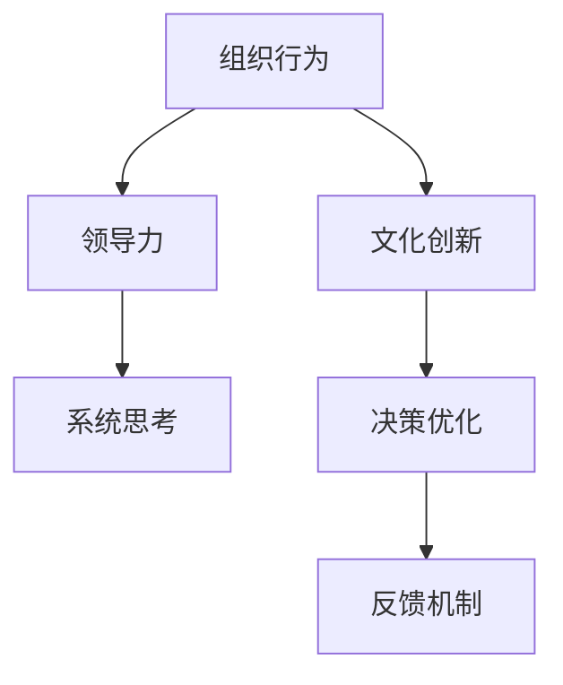

                 

# 从经典书籍中汲取管理智慧

> 关键词：管理智慧, 经典书籍, 组织行为, 领导力, 文化创新, 系统思考, 决策优化

## 1. 背景介绍

### 1.1 问题由来
在复杂多变的商业环境中，企业面临众多的挑战和机遇。如何科学地管理企业，制定出合适的战略决策，提升核心竞争力，是每一个企业管理者必须面对的问题。为解决这些问题，经典书籍为我们提供了宝贵的经验和智慧。从德鲁克的《管理的实践》，到泰勒的《科学管理原理》，再到彼得·圣吉的《第五项修炼》，这些经典书籍提供了从理论和实践两个层面的宝贵管理经验。

### 1.2 问题核心关键点
经典书籍的精髓在于其深厚的理论基础和丰富的实践案例。这些书籍通过阐述企业管理的核心概念、方法论和工具，揭示了组织行为、领导力、文化创新等管理要素的关键作用。通过系统阅读和深入理解这些经典书籍，管理者可以提升自身的知识水平和实践能力，从而更有效地应对企业发展中的各种挑战。

## 2. 核心概念与联系

### 2.1 核心概念概述

为了更好地理解经典书籍中的管理智慧，本节将介绍几个关键的管理概念，并探讨这些概念之间的联系：

- **组织行为(Organizational Behavior, OB)**：研究个体、群体和组织在企业中的行为和互动模式，揭示组织运作的机制。
- **领导力(Leadership)**：探讨如何通过影响和激励他人，达成共同目标，实现企业愿景。
- **文化创新(Cultural Innovation)**：强调企业文化的塑造和创新，以适应快速变化的外部环境。
- **系统思考(Systemic Thinking)**：强调整体性和动态性，强调系统内部各部分之间的相互关系和相互作用。
- **决策优化(Decision Making)**：研究如何通过科学方法和工具，提升决策的准确性和效率。

这些概念通过合作为企业管理提供了一个全面的视角，帮助管理者理解并应对复杂的管理问题。

### 2.2 核心概念原理和架构的 Mermaid 流程图



这个流程图展示了这些核心概念之间的相互关系：

1. **组织行为**：为领导力和文化创新提供基础。
2. **领导力**：推动组织行为和决策优化的实施。
3. **文化创新**：与系统思考相结合，不断提升组织的适应性和灵活性。
4. **系统思考**：提供全局视角，帮助决策优化和组织行为改进。
5. **决策优化**：在领导力和系统思考的指导下，实现组织行为的改进和优化。

## 3. 核心算法原理 & 具体操作步骤

### 3.1 算法原理概述

经典书籍中的管理智慧，并非仅仅停留在理论层面，许多书籍还提供了具体的管理算法和操作步骤。这些算法和操作步骤，为企业管理者提供了科学的管理手段，帮助其在实际工作中提升效率和效果。

### 3.2 算法步骤详解

以彼得·圣吉的《第五项修炼》为例，其提出了“系统思考”的五个步骤：

1. **自我超越(Seeking Self-Transcendence)**：
   - 定义个人愿景，不断超越自身限制，提升自我实现。
   - 通过实践和学习，实现个人和组织的同步成长。

2. **改善心智模型(Improving Mental Models)**：
   - 审视和修正自身的心智模式，从旧有的思维定势中解放出来。
   - 学习和吸收新知识，更新心智模型。

3. **建立共同愿景(Building Shared Vision)**：
   - 创建并共享组织愿景，使全体成员有共同的目标和方向。
   - 通过讨论和协商，达成共识，形成合力。

4. **团队学习(Team Learning)**：
   - 促进团队成员之间的信息交流和思维碰撞，形成集体智慧。
   - 通过群体决策和集思广益，提高团队的创新能力和执行力。

5. **系统实施(Systems Implementation)**：
   - 将上述修炼付诸实践，推动组织变革和创新。
   - 建立反馈机制，不断优化和调整系统。

通过这些步骤，管理者可以系统性地提升组织的学习能力和适应性，实现组织的长远发展。

### 3.3 算法优缺点

经典书籍中的管理智慧，既有其优点，也存在一定的局限性：

**优点**：
- 系统性和综合性：提供了一个全面、多维度的管理视角，帮助管理者全面提升自身能力。
- 实践指导性：提供了具体的管理操作步骤和案例分析，具有较强的可操作性。
- 历史验证性：经过时间和实践的验证，经典书籍中的智慧具有较高的可信度。

**缺点**：
- 理论深度：一些经典书籍更侧重于实践经验的总结，理论深度可能不足。
- 适用性：管理理念和方法在特定环境下效果显著，但在其他环境下的适用性需要进一步验证。
- 时效性：部分管理理念和实践可能受到时代背景的影响，需要进行更新和补充。

### 3.4 算法应用领域

经典书籍中的管理智慧，适用于各类企业组织，涉及的领域包括但不限于：

- **组织管理**：人力资源管理、组织结构设计、绩效考核。
- **战略管理**：企业愿景规划、战略制定与执行、风险管理。
- **人力资源**：招聘、培训、绩效管理、薪酬体系。
- **运营管理**：生产流程优化、供应链管理、质量控制。
- **财务管理**：预算管理、成本控制、投资决策。

## 4. 数学模型和公式 & 详细讲解 & 举例说明

### 4.1 数学模型构建

经典书籍中虽然不一定涉及复杂的数学模型，但仍然有些管理理论通过数学模型进行了描述。以泰勒的《科学管理原理》为例，其提出了工人效率的标准模型：

$$
\text{Total Work} = \text{Worker Efficiency} \times \text{Number of Workers} \times \text{Work Time}
$$

这个模型揭示了生产效率的关键因素，为管理者提供了一个科学的管理视角。

### 4.2 公式推导过程

以德鲁克的《管理的实践》为例，其提出了“目标管理”的方法：

1. **设定目标(Setting Objectives)**：
   - 管理者与员工共同设定明确、可衡量、可实现的目标。
   - 目标应具有挑战性，但也要具有可实现性。

2. **绩效考核(Performance Appraisal)**：
   - 定期评估员工目标达成情况，提供反馈和改进建议。
   - 建立公正透明的绩效评估体系，激发员工积极性。

3. **绩效改进(Performance Improvement)**：
   - 根据评估结果，制定改进计划，提升员工绩效。
   - 提供培训和发展机会，提升员工能力。

通过这些步骤，管理者可以实现对员工绩效的科学管理，提升组织的整体绩效。

### 4.3 案例分析与讲解

以丰田的精益生产为例，其采用了“系统思考”的方法，通过以下几个步骤实现了生产效率的提升：

1. **价值流分析(Value Stream Mapping)**：
   - 识别生产过程中的每一项增值和非增值活动，优化流程。
   - 通过可视化工具，明确生产过程中的瓶颈和浪费。

2. **库存管理(Inventory Management)**：
   - 通过精细化管理库存，降低生产成本，提升响应速度。
   - 实施看板管理，实现物料的按需生产。

3. **质量控制(Quality Control)**：
   - 通过全面质量管理，提升产品质量，减少缺陷。
   - 引入六西格玛管理方法，系统性地提升质量管理水平。

通过这些步骤，丰田实现了生产效率和质量的全面提升，成为了全球领先的制造企业。

## 5. 项目实践：代码实例和详细解释说明

### 5.1 开发环境搭建

在进行管理智慧实践前，我们需要准备好开发环境。以下是使用Python进行管理的项目实践环境配置流程：

1. 安装Python：从官网下载并安装Python，推荐使用3.7及以上版本。
2. 安装相关库：使用pip安装pandas、numpy、scikit-learn等常用库。
3. 创建虚拟环境：使用virtualenv或conda创建独立的虚拟环境，避免库冲突。
4. 配置开发工具：使用Visual Studio Code或PyCharm等开发工具。

### 5.2 源代码详细实现

以下是一个使用Python进行目标管理的示例代码：

```python
import pandas as pd
from sklearn.metrics import mean_squared_error

# 读取员工绩效数据
df = pd.read_csv('employee_performance.csv')

# 设定目标值
target_value = 100

# 计算员工绩效
for i in range(len(df)):
    if df['target'][i] > target_value:
        df['performance'][i] = 'Good'
    else:
        df['performance'][i] = 'Poor'

# 计算绩效误差
mse = mean_squared_error(df['target'], df['performance'])

# 输出结果
print(f"Mean Squared Error: {mse:.2f}")
```

### 5.3 代码解读与分析

这段代码实现了目标管理的第一步：设定目标值并计算员工绩效。通过比较实际绩效与目标值，将员工绩效分为优秀和不及格两个等级，并计算误差。通过这样的方式，管理者可以科学地评估员工绩效，并提供改进建议。

## 6. 实际应用场景

### 6.1 企业绩效管理

经典书籍中的管理智慧，可以应用于企业绩效管理。通过设定明确的目标值，定期评估员工绩效，并根据绩效结果提供改进建议，企业可以实现绩效的科学管理。

### 6.2 项目管理

项目管理中的系统思考，可以帮助管理者更好地识别项目中的关键问题和瓶颈，优化流程，提升项目管理效率。通过建立共同愿景和团队学习，促进项目团队之间的信息共享和协同合作，提升项目执行力。

### 6.3 人力资源管理

经典书籍中的管理智慧，可以应用于人力资源管理。通过设定清晰的职业发展目标，建立公平透明的绩效评估体系，提供培训和发展机会，企业可以提升员工的工作积极性和职业满意度。

### 6.4 未来应用展望

随着管理实践的不断演进，经典书籍中的管理智慧将继续发挥其重要作用。未来，管理智慧将与大数据、人工智能等新技术相结合，实现更加智能化、数据驱动的管理实践。

## 7. 工具和资源推荐

### 7.1 学习资源推荐

为了深入理解经典书籍中的管理智慧，以下是一些优质的学习资源：

1. 《管理的实践》：德鲁克的管理理论经典之作，提供了丰富的管理实践经验。
2. 《第五项修炼》：彼得·圣吉的代表作，系统介绍了系统思考的五个步骤。
3. 《科学管理原理》：泰勒的经典著作，提出了科学管理的基本原则。
4. 《领导梯队》：拉姆·查兰的著作，详细阐述了领导力发展的五个阶段。
5. 《创新者的窘境》：克莱顿·克里斯滕森的著作，探讨了创新和变革的困境与突破。

这些书籍可以帮助管理者系统理解经典管理理念，提升实践能力。

### 7.2 开发工具推荐

为了更好地实践管理智慧，以下是一些常用的开发工具：

1. Visual Studio Code：轻量级的代码编辑器，支持Python、R等语言。
2. PyCharm：强大的Python开发工具，支持多种框架和库。
3. Excel：数据处理和可视化工具，适用于数据驱动的管理实践。
4. Tableau：数据可视化工具，支持复杂的数据分析和可视化。
5. Jupyter Notebook：交互式编程环境，支持Python、R等语言。

合理利用这些工具，可以提升管理实践的效率和效果。

### 7.3 相关论文推荐

经典书籍的管理智慧，经过时间的验证，已经成为管理领域的重要基础。以下是一些相关的学术论文，供进一步深入研究：

1. "The Practice of Management" by Peter F. Drucker: 提供了丰富的管理实践经验。
2. "The Fifth Discipline: The Art and Practice of the Corporate Revolution" by Peter M. Senge: 介绍了系统思考的五个步骤。
3. "The Principles of Scientific Management" by Frederick Winslow Taylor: 提出了科学管理的基本原则。
4. "Leadership and the Nature of Leadership: A Global Perspective" by Bernard Mayer: 详细阐述了领导力的发展。
5. "The Innovator's Dilemma: When New Technologies Cause Great Firms to Fail" by Clayton M. Christensen: 探讨了创新和变革的困境与突破。

这些论文可以帮助管理者深入理解经典书籍中的管理理念，并应用于实际管理实践中。

## 8. 总结：未来发展趋势与挑战

### 8.1 总结

本文对经典书籍中的管理智慧进行了系统梳理。首先介绍了管理智慧的重要性，阐述了经典书籍的核心概念及其相互关系。其次，从理论到实践，详细讲解了经典书籍中的管理算法和操作步骤，提供了科学的管理手段。最后，本文探讨了经典管理智慧在实际应用中的场景，推荐了相应的学习资源和开发工具，帮助管理者提升自身能力。

通过本文的系统梳理，可以看到，经典书籍中的管理智慧提供了系统的管理理论和方法，帮助管理者全面提升管理能力。未来，经典书籍将继续为管理实践提供重要的理论基础和方法指导，推动企业持续发展和创新。

### 8.2 未来发展趋势

展望未来，经典书籍中的管理智慧将继续发展，并与其他技术手段相结合，提升管理实践的智能化和数据驱动化。以下趋势值得关注：

1. **大数据与人工智能**：通过大数据分析和人工智能技术，提升管理决策的科学性和精准性。
2. **区块链与物联网**：利用区块链和物联网技术，提升组织内部的透明度和安全性。
3. **全球化与跨文化管理**：在全球化背景下，跨文化管理成为企业管理的重要课题。
4. **可持续发展与社会责任**：企业管理必须注重环境保护和社会责任，实现可持续发展。

这些趋势将进一步推动企业管理智慧的发展，提升企业的竞争力和社会价值。

### 8.3 面临的挑战

尽管经典书籍中的管理智慧在实践中已取得显著成效，但仍面临一些挑战：

1. **快速变化的环境**：市场环境瞬息万变，经典管理理念和方法需要不断更新和适应。
2. **跨文化管理**：全球化背景下，跨文化管理成为企业面临的重要挑战。
3. **技术与组织的融合**：信息技术的发展，对企业管理理念和方法提出了新的要求。
4. **伦理和道德问题**：企业发展过程中，需要注重伦理和道德问题，确保管理实践的公平性和公正性。
5. **员工心理与健康**：员工的心理健康和福祉成为企业管理的重要考量因素。

这些挑战需要管理者在实践中不断探索和创新，以应对新的管理环境。

### 8.4 研究展望

未来的管理研究需要结合新技术和新兴理论，实现管理智慧的创新发展。以下研究方向值得关注：

1. **数据驱动管理**：利用大数据和人工智能技术，提升管理决策的科学性和准确性。
2. **系统性思维**：进一步深化系统性思维的研究，提升组织整体管理和应对能力。
3. **跨文化管理**：研究跨文化管理的理论和实践，提升全球化背景下的企业竞争力。
4. **可持续发展**：研究可持续发展管理的理论和实践，提升企业社会责任和环境意识。
5. **人工智能与伦理**：研究人工智能在管理中的应用，关注其伦理和社会影响。

这些研究将为企业管理实践提供新的方法和工具，推动企业迈向更高的管理水平。

## 9. 附录：常见问题与解答

**Q1：经典书籍中的管理智慧是否适用于所有企业？**

A: 经典书籍中的管理智慧具有普遍性，适用于各类企业组织。但在具体应用时，需要根据企业的实际情况进行适当的调整和优化。

**Q2：如何有效地学习经典书籍中的管理智慧？**

A: 学习经典书籍中的管理智慧，需要注重理论与实践的结合。可以通过案例分析、实战演练等方式，深入理解管理理念和方法，并在实际工作中加以应用。

**Q3：经典书籍中的管理智慧是否适用于新型的管理环境？**

A: 经典书籍中的管理智慧具有一定的普适性，但也需注意新型的管理环境带来的挑战和机遇。管理者需要结合实际情况，灵活应用管理智慧，创新管理方法。

**Q4：经典书籍中的管理智慧是否需要与新技术相结合？**

A: 经典书籍中的管理智慧需要与时俱进，结合新技术和新方法，实现管理智慧的持续发展和创新。

---

作者：禅与计算机程序设计艺术 / Zen and the Art of Computer Programming

