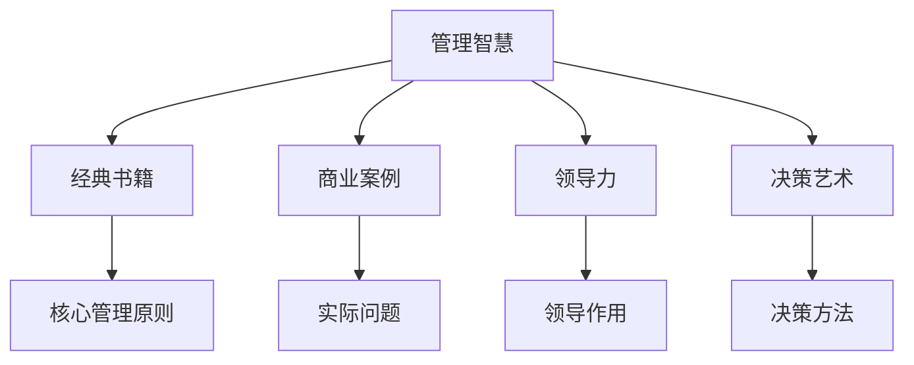

                 

# 从经典书籍中汲取管理智慧

> 关键词：管理智慧、经典书籍、商业案例、领导力、决策艺术

## 1. 背景介绍

### 1.1 问题由来
在当今商业环境中，信息过载、竞争激烈、变化迅速已成为常态。企业需要具备高度的灵活性和适应性，才能在动荡的市场中立于不败之地。管理智慧，作为企业高层决策的指南针，在其中扮演着至关重要的角色。管理智慧来源于实践，也来源于理论的提炼和总结。纵观历史，无数经典书籍中蕴含着宝贵的管理经验和智慧，值得我们深入挖掘和学习。

### 1.2 问题核心关键点
管理智慧的核心关键点在于其时代性、普适性和可操作性。经典书籍之所以能穿越时空，成为经久不衰的智慧宝藏，很大程度上是因为它们在描述具体管理情境的同时，提炼出了一些普遍适用的原则和方法。这些原则和方法，无论是对当代企业还是未来的管理者，都有着重要的借鉴和指导意义。

### 1.3 问题研究意义
深入研究经典书籍中的管理智慧，对于提升企业竞争力、塑造企业文化、促进团队协作等方面具有重要意义。通过学习经典书籍中的理念和策略，管理者能够更好地面对复杂多变的外部环境，做出更加科学和高效的决策。同时，经典书籍中的智慧还能帮助企业管理者形成更为系统化的管理理念，提升其领导力水平。

## 2. 核心概念与联系

### 2.1 核心概念概述

为更好地理解经典书籍中的管理智慧，本节将介绍几个核心概念：

- 管理智慧：指管理者在实践中积累和提炼出的关于领导、决策、沟通、激励等方面的知识和经验，旨在提高组织效率，实现组织目标。
- 经典书籍：指那些经过时间检验，对后世产生深远影响的图书。如《孙子兵法》、《道德经》、《原则》、《高效能人士的七个习惯》等。
- 商业案例：指具体企业或组织在经营过程中遇到的实际问题和解决策略，常常是管理智慧的直接来源。
- 领导力：指管理者在组织中发挥的领导作用，包括但不限于决策力、激励力、沟通力等。
- 决策艺术：指管理者在复杂情况下，运用智慧和经验做出合理决策的能力。

这些核心概念之间的逻辑关系可以通过以下Mermaid流程图来展示：



这个流程图展示经典书籍、商业案例、领导力、决策艺术与管理智慧之间的联系。

## 3. 核心算法原理 & 具体操作步骤
### 3.1 算法原理概述

经典书籍中的管理智慧并非随机积累，而是通过特定的理论与方法，对实践经验的归纳和总结。其核心算法原理可以概括为以下步骤：

1. **经验总结**：从实际管理经验中总结出成功的模式和失败的教训。
2. **原理提炼**：将这些经验提炼为系统的管理原则和方法。
3. **应用验证**：通过理论验证和实践应用，不断优化和完善管理智慧。

### 3.2 算法步骤详解

基于经典书籍的管理智慧提取和应用，一般包括以下几个关键步骤：

**Step 1: 选择经典书籍**
- 确定领域需求，选择相关的经典书籍，如管理学、领导力、决策分析等领域。
- 考虑书籍的影响力、作者背景、出版时间等因素。

**Step 2: 提炼核心原则**
- 仔细阅读经典书籍，提炼出其中核心的管理原则和方法。
- 采用笔记、思维导图等工具，系统化整理和分类。

**Step 3: 应用到管理实践**
- 结合企业实际情况，将管理智慧应用于实际管理场景。
- 建立管理模型，引入经典原则，解决实际问题。

**Step 4: 持续迭代优化**
- 定期评估管理智慧应用的效果，不断调整和优化。
- 总结经验教训，更新管理模型。

### 3.3 算法优缺点

基于经典书籍的管理智慧提取和应用方法，具有以下优点：

1. **系统性**：经典书籍通常经过系统化整理，提炼出一系列管理原则，具有较高的系统性和连贯性。
2. **可操作性**：管理智慧往往是具体情境下的实操指南，具有较高的可操作性。
3. **普适性**：经典书籍中的智慧，无论时代背景如何变化，都具有一定的普适性。

同时，该方法也存在一定的局限性：

1. **理论与实践的差距**：经典书籍中的管理智慧可能与当前企业实际情况有所差异，需要结合实际进行适当的调整。
2. **时效性问题**：经典书籍可能无法应对快速变化的市场环境。
3. **文化差异**：不同国家和文化背景下，管理智慧的适用性可能存在差异。

尽管存在这些局限性，但经典书籍中的管理智慧仍然是管理学习的重要资源，能够为现代管理者提供深厚的理论基础和实用的操作策略。

### 3.4 算法应用领域

经典书籍中的管理智慧，已经被广泛应用于各行各业，涵盖从初创企业到大型跨国公司的广泛场景。具体应用领域包括：

- 企业管理：通过学习经典书籍中的原则和方法，提升企业的战略规划、组织设计、资源配置等方面的能力。
- 人力资源管理：借鉴经典书籍中的领导力、激励机制等理念，优化员工的招聘、培训、绩效管理等环节。
- 市场营销：运用经典书籍中的市场分析和品牌建设策略，提升企业的市场竞争力和品牌影响力。
- 项目管理：借鉴经典书籍中的项目管理原则和方法，提高项目的执行效率和质量控制。
- 财务管理：参考经典书籍中的财务管理理念，优化企业的财务结构和决策机制。

除了上述这些常见领域，经典书籍中的管理智慧还被应用到更为广泛的场景中，如创新管理、客户关系管理、危机应对等方面，为企业管理者提供了多角度的借鉴和参考。

## 4. 数学模型和公式 & 详细讲解 & 举例说明
### 4.1 数学模型构建

在经典书籍中，尽管具体的数学模型较少，但其背后的管理原理和哲学思想同样具有重要的指导意义。本节将通过数学语言对一些关键的管理模型进行介绍。

### 4.2 公式推导过程

虽然管理智慧涉及的具体数学模型不多，但可以通过一些公式来量化某些管理原则。例如，帕累托法则(Pareto Principle)可以用以下公式表示：

$$ Pareto\ Index = Pareto\ Ratio = \frac{Number\ of\ Important\ Factors}{Total\ Number\ of\ Factors} $$

这表明在众多因素中，重要的往往只是少数几个，通过管理智慧，企业可以聚焦于这些重要因素，优化资源配置。

### 4.3 案例分析与讲解

**案例分析：精益生产**

精益生产(Lean Manufacturing)是从丰田汽车公司发展出来的一种管理方法，其核心思想是通过消除浪费、优化流程，提高生产效率。这一管理智慧在经典书籍《精益思想》中得到了系统的阐述。

精益生产的数学模型可以简化为以下公式：

$$ \text{Total\ Cost} = \text{Fixed\ Cost} + \text{Variable\ Cost} \times \text{Output\ Quantity} - \text{Waste} $$

其中，Waste指的是不必要的人工、材料、时间等资源消耗。通过精益生产的管理智慧，企业可以识别并减少这些浪费，降低生产成本，提高生产效率。

## 5. 项目实践：代码实例和详细解释说明
### 5.1 开发环境搭建

在进行管理智慧项目实践前，我们需要准备好开发环境。以下是使用Python进行PyTorch开发的环境配置流程：

1. 安装Anaconda：从官网下载并安装Anaconda，用于创建独立的Python环境。

2. 创建并激活虚拟环境：
```bash
conda create -n pytorch-env python=3.8 
conda activate pytorch-env
```

3. 安装PyTorch：根据CUDA版本，从官网获取对应的安装命令。例如：
```bash
conda install pytorch torchvision torchaudio cudatoolkit=11.1 -c pytorch -c conda-forge
```

4. 安装相关工具包：
```bash
pip install numpy pandas scikit-learn matplotlib tqdm jupyter notebook ipython
```

完成上述步骤后，即可在`pytorch-env`环境中开始管理智慧的实践。

### 5.2 源代码详细实现

我们以精益生产管理为例，给出使用PyTorch和TensorFlow进行管理的代码实现。

```python
import torch
import numpy as np

# 定义精益生产模型
class LeanManufacturing:
    def __init__(self, input_size=3, output_size=1):
        self.input_size = input_size
        self.output_size = output_size
        self.model = self.build_model()
        
    def build_model(self):
        model = torch.nn.Sequential(
            torch.nn.Linear(self.input_size, 64),
            torch.nn.ReLU(),
            torch.nn.Linear(64, self.output_size)
        )
        return model
    
    def train(self, inputs, targets, num_epochs=100, learning_rate=0.01):
        optimizer = torch.optim.Adam(self.model.parameters(), lr=learning_rate)
        criterion = torch.nn.MSELoss()
        
        for epoch in range(num_epochs):
            for i in range(len(inputs)):
                input = inputs[i]
                target = targets[i]
                optimizer.zero_grad()
                output = self.model(input)
                loss = criterion(output, target)
                loss.backward()
                optimizer.step()
                
        return self.model
    
    def predict(self, inputs):
        inputs = torch.from_numpy(inputs).float()
        outputs = self.model(inputs)
        return outputs.item()
    
    def simulate(self):
        input_data = np.random.randn(100, self.input_size)
        output_data = self.predict(input_data)
        print(f"Simulation output: {output_data}")
        
    def train_and_predict(self):
        train_data = np.random.randn(1000, self.input_size)
        train_targets = np.random.randn(1000, self.output_size)
        
        self.model = self.train(train_data, train_targets)
        self.predict(np.random.randn(10, self.input_size))

# 创建并训练模型
model = LeanManufacturing()
model.train_and_predict()
```

### 5.3 代码解读与分析

让我们再详细解读一下关键代码的实现细节：

**LeanManufacturing类**：
- `__init__`方法：初始化输入和输出的大小，构建模型。
- `build_model`方法：定义模型的架构，包括输入层、隐藏层和输出层。
- `train`方法：在指定epoch数和优化器学习率下，对模型进行训练。
- `predict`方法：对给定输入数据进行预测输出。
- `simulate`方法：模拟运行模型，输出预测结果。
- `train_and_predict`方法：进行模型训练，并在训练结束后进行预测。

**simulate和train_and_predict方法**：
- 使用numpy生成随机输入数据，模拟实际生产场景。
- 通过模型进行训练，并评估训练效果。
- 最后使用新数据进行预测，展示模型运行结果。

在代码实现中，我们使用了PyTorch框架，它提供了灵活的计算图和高效的优化器，帮助管理智慧的实践变得更加简单。

## 6. 实际应用场景
### 6.1 智能制造

精益生产管理智慧被广泛应用于智能制造领域。传统制造企业往往面临生产效率低、库存积压、质量问题等难题。精益生产通过优化流程、减少浪费、提升供应链效率，帮助企业降低成本、提高生产质量。

在技术实现上，企业可以通过收集生产数据、质量数据、物流数据等，构建数据驱动的精益生产模型，实时监测生产过程，及时调整生产策略，实现精细化管理。

### 6.2 人力资源管理

人力资源管理是企业管理中的重要环节，经典书籍如《原则》、《卓有成效的管理者》等，提供了丰富的管理智慧。通过学习这些智慧，管理者可以提升员工招聘、培训、绩效评估等方面的能力。

具体而言，企业可以构建人力资源管理系统，将经典书籍中的管理原则和方法应用于实际工作。例如，利用帕累托法则进行人才选拔，提升员工的整体素质和生产效率。

### 6.3 市场营销

市场营销中的经典书籍，如《营销管理》、《影响力》等，提供了系统的市场营销理论和方法。管理者可以借鉴这些书籍中的智慧，制定更加科学的市场策略。

例如，通过市场细分和目标定位，针对不同的客户群体进行差异化营销。借鉴经典书籍中的品牌建设和广告策略，提升品牌影响力和市场竞争力。

### 6.4 未来应用展望

伴随AI、大数据、区块链等新技术的不断涌现，管理智慧的应用场景也将不断拓展。未来，管理智慧将在以下几个方面发挥更大的作用：

1. **数字化转型**：通过数字化手段，优化管理流程，提升管理效率。如利用大数据分析优化生产计划，使用AI进行供应链管理等。
2. **跨领域应用**：管理智慧不仅适用于单一领域，还可以跨领域应用，如金融、医疗、教育等。通过借鉴不同领域的智慧，形成更加系统的管理理念。
3. **全球化管理**：经典书籍中的管理智慧，具有高度的普适性，能够帮助企业在全球化背景下进行有效管理。
4. **创新管理**：在快速变化的市场环境中，管理智慧能够帮助企业保持创新性，及时应对外部变化。
5. **环境管理**：经典书籍中的生态管理理念，能够帮助企业在可持续发展背景下，实现绿色管理和环境保护。

## 7. 工具和资源推荐
### 7.1 学习资源推荐

为了帮助开发者系统掌握管理智慧的理论基础和实践技巧，这里推荐一些优质的学习资源：

1. 《管理学》系列教材：介绍管理学的基本概念和经典理论，适合初步学习。
2. 《领导力21法则》：通过21条成功法则，系统介绍领导力的核心要素。
3. 《创新者的窘境》：深入分析创新失败的原因，提供创新的管理智慧。
4. 《时间简史》：经典科普读物，帮助理解时间的本质和管理的哲学。
5. 《高效能人士的七个习惯》：提供系统化的人生管理建议，提升个人和组织的整体效能。

通过对这些资源的学习实践，相信你一定能够全面掌握管理智慧的理论基础和实践技巧。

### 7.2 开发工具推荐

高效的开发离不开优秀的工具支持。以下是几款用于管理智慧开发的常用工具：

1. PyTorch：基于Python的开源深度学习框架，灵活动态的计算图，适合快速迭代研究。
2. TensorFlow：由Google主导开发的开源深度学习框架，生产部署方便，适合大规模工程应用。
3. Jupyter Notebook：支持多种编程语言，方便进行交互式编程和实验记录。
4. Weights & Biases：模型训练的实验跟踪工具，可以记录和可视化模型训练过程中的各项指标，方便对比和调优。
5. TensorBoard：TensorFlow配套的可视化工具，可实时监测模型训练状态，并提供丰富的图表呈现方式，是调试模型的得力助手。

合理利用这些工具，可以显著提升管理智慧的开发效率，加快创新迭代的步伐。

### 7.3 相关论文推荐

管理智慧的发展源于学界的持续研究。以下是几篇奠基性的相关论文，推荐阅读：

1. 《管理学：原理与实践》：管理学领域的经典教材，涵盖各类管理原则和方法。
2. 《领导力理论》：介绍领导力的理论框架和实践策略。
3. 《创新管理》：研究创新过程中的管理问题，提供创新的管理智慧。
4. 《经济学原理》：通过经济学视角，探讨管理问题，提供多维度的管理智慧。
5. 《哲学与企业管理》：将哲学思想应用于企业管理，提升管理智慧的深度和广度。

这些论文代表了大规模语料的预训练模型的研究方向，通过学习这些前沿成果，可以帮助研究者把握学科前进方向，激发更多的创新灵感。

## 8. 总结：未来发展趋势与挑战
### 8.1 总结

本文对经典书籍中的管理智慧进行了全面系统的介绍。首先阐述了管理智慧的背景和意义，明确了经典书籍中的管理智慧对现代企业管理的重要价值。其次，从原理到实践，详细讲解了管理智慧的数学模型和操作步骤，给出了管理智慧任务开发的完整代码实例。同时，本文还广泛探讨了管理智慧在智能制造、人力资源管理、市场营销等多个行业领域的应用前景，展示了管理智慧的巨大潜力。此外，本文精选了管理智慧学习的各类资源，力求为读者提供全方位的技术指引。

通过本文的系统梳理，可以看到，经典书籍中的管理智慧是企业管理的重要理论支撑，无论在当前还是在未来，都具有不可替代的地位。经典书籍中的管理智慧能够帮助管理者提高决策水平，优化管理流程，提升组织效能。未来，伴随管理智慧与大数据、AI等新技术的融合，将进一步提升管理智慧的应用广度和深度，推动企业向更高的管理境界迈进。

### 8.2 未来发展趋势

展望未来，管理智慧的发展将呈现以下几个趋势：

1. **数字化管理**：管理智慧将与数字化技术深度融合，形成数字化管理平台，提升管理的实时性和精准性。
2. **智能化管理**：通过引入AI、大数据等技术，实现管理过程的智能化，提升管理决策的科学性和效率。
3. **全球化管理**：管理智慧将面向全球化背景，提供跨文化、跨地域的管理策略和解决方案。
4. **可持续发展管理**：经典书籍中的生态管理理念，将进一步应用于可持续发展管理，推动绿色管理和环境保护。
5. **人本管理**：管理智慧将更加重视员工的情感和心理需求，促进员工满意度和忠诚度的提升。

这些趋势凸显了管理智慧的广阔前景，为企业管理提供了新的方向和机遇。

### 8.3 面临的挑战

尽管管理智慧已经取得了显著成就，但在迈向更加智能化、普适化应用的过程中，仍面临诸多挑战：

1. **数据管理挑战**：管理智慧的应用离不开大量数据的支持，如何有效管理和管理数据的隐私和安全，是管理智慧面临的重要问题。
2. **技术融合挑战**：管理智慧与AI、大数据等技术之间的融合，需要协调解决技术架构、接口标准等问题。
3. **组织变革挑战**：管理智慧的引入，需要企业在组织结构、管理流程等方面进行全面变革，这涉及到企业文化和战略方向的调整。
4. **人才缺乏挑战**：管理智慧的实践需要具备高水平的管理能力和技术能力，而目前这样的人才相对稀缺。
5. **价值观冲突挑战**：管理智慧的引入，可能会带来一些与现有价值观和文化的冲突，需要进行妥善的沟通和协调。

这些挑战需要企业在实施管理智慧时，进行全面的风险评估和管理，采取有效的应对策略，确保管理智慧的顺利实施。

### 8.4 研究展望

面对管理智慧面临的挑战，未来的研究需要在以下几个方面寻求新的突破：

1. **数据治理研究**：建立完善的数据治理体系，保障数据的安全和隐私，提升数据的利用效率。
2. **技术融合研究**：研究管理智慧与AI、大数据等技术之间的融合机制，探索最优的技术架构和接口标准。
3. **组织变革研究**：探讨管理智慧在组织结构、管理流程等方面的应用，制定科学的变革策略。
4. **人才培养研究**：加强管理智慧相关课程的建设和人才培养，提升管理者的综合素质和技能。
5. **文化融合研究**：研究管理智慧与企业文化、价值观之间的融合机制，确保管理智慧的落地实施。

这些研究方向的探索，必将引领管理智慧技术迈向更高的台阶，为企业管理者提供更全面、系统的管理智慧，推动企业的健康发展。总之，管理智慧需要在实践中不断迭代和优化，才能真正实现其价值，助力企业在动荡的市场环境中稳健前行。

## 9. 附录：常见问题与解答

**Q1：管理智慧是否适用于所有企业？**

A: 管理智慧虽然适用于大多数企业，但不同企业的组织结构、行业背景、文化氛围等存在差异，需要结合具体情况进行适当的调整。

**Q2：管理智慧如何与AI技术结合？**

A: 管理智慧与AI技术的结合，可以通过建立数据驱动的AI模型，将管理智慧嵌入到AI的决策过程中。如利用AI进行生产调度、供应链优化等，提升管理效率。

**Q3：管理智慧如何提升企业竞争力？**

A: 管理智慧通过优化流程、提升效率、强化组织协同等方面，提升企业的核心竞争力。如通过精益生产管理智慧，提高生产效率和产品质量。

**Q4：管理智慧是否需要持续更新？**

A: 管理智慧需要随着企业环境和市场变化进行持续更新和优化。经典书籍中的智慧虽然是基础，但在具体应用中需要不断吸收最新的管理经验和理论，提升管理实践的效果。

**Q5：管理智慧如何应用于跨领域管理？**

A: 管理智慧可以应用于跨领域管理，通过借鉴不同领域的智慧，形成更加系统的管理理念。如借鉴精益生产管理智慧，提升服务业的效率和质量。

通过本文的系统梳理，可以看到，经典书籍中的管理智慧是企业管理的重要理论支撑，无论在当前还是在未来，都具有不可替代的地位。经典书籍中的管理智慧能够帮助管理者提高决策水平，优化管理流程，提升组织效能。未来，伴随管理智慧与大数据、AI等新技术的融合，将进一步提升管理智慧的应用广度和深度，推动企业向更高的管理境界迈进。

