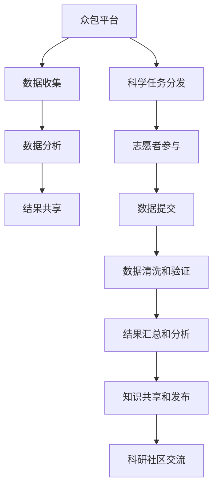

                 

# 众包科学：公众参与科学研究的新时代

## 1. 背景介绍

### 1.1 问题由来
科学研究是人类文明进步的基石。然而，传统的科学研究方式——由少数专业研究者在小团队中完成——面临着许多局限。例如，科研投入成本高昂，研究成果难以快速普及。因此，科研人员需要找到更高效、更广泛地获取科学知识和发现新问题的方法。

近年来，互联网和社交媒体的兴起为公众参与科学研究开辟了新的道路。众包科学（Crowdsourced Science），即利用公众的力量来加速科学研究的过程，成为越来越多科研机构和企业的首选。公众通过在线平台参与研究，不仅能够显著提升科研项目的效率，还能将科学知识普及给更广泛的群体。

### 1.2 问题核心关键点
众包科学的核心在于如何通过互联网技术，将科研任务拆分成小任务，分配给公众处理。这一过程涉及以下几个关键点：

1. **任务划分**：将复杂的科研问题拆解为可管理的小任务。
2. **任务分发**：将任务分发给感兴趣的志愿者，保证任务的高质量和多样性。
3. **结果汇总**：收集和处理所有志愿者的结果，进行统计分析和综合评估。
4. **知识共享**：在研究过程中共享数据和结果，促进科学知识的传播和积累。

### 1.3 问题研究意义
众包科学不仅为科研提供了新的方法和视角，还促进了科学知识的普及和社会的广泛参与。它的研究意义在于：

1. **加速科研进程**：利用公众的计算能力和数据，可以快速处理和分析海量数据，提升科研效率。
2. **降低科研成本**：通过大众的参与，减少专业科研人员和设备投入，降低科研成本。
3. **提升科研覆盖面**：广泛收集来自不同背景和地域的数据，增强科研结果的普适性。
4. **促进科学民主化**：使公众参与到科研过程中，提升公众对科学的理解和兴趣，推动科学民主化。

## 2. 核心概念与联系

### 2.1 核心概念概述

众包科学涉及多个核心概念，以下将逐一介绍：

- **众包（Crowdsourcing）**：利用公众的力量完成特定任务，包括数据收集、数据分析、任务处理等。
- **科学众包（Scientific Crowdsourcing）**：结合众包技术和科学问题，让公众参与到科学研究中。
- **数据众包（Data Crowdsourcing）**：利用公众提交的数据进行科学分析和数据挖掘。
- **科学游戏（Scientific Games）**：通过游戏化设计吸引公众参与科学研究，使其在娱乐中获取科学知识。
- **科学竞赛（Scientific Competitions）**：通过设置挑战和奖励机制，激发公众的科研热情和创新能力。

这些概念之间存在紧密的联系，共同构成了众包科学的生态系统。

### 2.2 核心概念原理和架构的 Mermaid 流程图



以上Mermaid流程图展示了众包科学的核心流程：

1. **数据收集**：公众通过平台提交数据。
2. **数据分析**：科研人员对收集到的数据进行分析和处理。
3. **结果共享**：研究成果在平台和科学社区中公开分享。
4. **科学任务分发**：平台将科研任务分配给公众。
5. **志愿者参与**：公众参与具体的科学任务。
6. **数据提交**：志愿者提交处理结果。
7. **数据清洗和验证**：对提交的数据进行清洗和验证。
8. **结果汇总和分析**：对所有结果进行汇总和分析。
9. **知识共享和发布**：将研究成果发布到科学社区。
10. **科研社区交流**：研究人员和公众在社区中进行交流和讨论。

## 3. 核心算法原理 & 具体操作步骤

### 3.1 算法原理概述

众包科学的算法原理基于以下几个关键技术：

1. **任务划分**：将复杂的科研问题分解为多个子任务。
2. **任务分发**：通过智能算法将任务分配给最合适的志愿者。
3. **数据汇总和分析**：使用统计学和机器学习技术对收集到的数据进行分析和综合。
4. **结果验证**：对公众提交的结果进行验证和修正。

这些技术共同支撑了众包科学的高效运作。

### 3.2 算法步骤详解

以下是众包科学的具体操作步骤：

**Step 1: 任务划分**
- 定义科研问题的边界和目标。
- 将问题分解为若干个独立的子任务。
- 为每个子任务设计详细的操作步骤和要求。

**Step 2: 任务分发**
- 收集志愿者信息，包括背景、技能等。
- 根据任务需求，智能匹配志愿者，并分配任务。
- 通过平台将任务和操作指南发送给志愿者。

**Step 3: 数据提交和验证**
- 志愿者完成子任务并提交结果。
- 对提交的数据进行清洗和预处理。
- 通过人工或自动验证方式对结果进行验证。

**Step 4: 结果汇总和分析**
- 将所有志愿者提交的结果汇总。
- 使用统计学和机器学习技术进行数据分析。
- 将分析结果反馈给志愿者，并进行调整。

**Step 5: 结果共享和发布**
- 将最终结果发布到科学社区或公开数据库。
- 组织科研人员和公众进行讨论和验证。
- 在学术期刊或会议上发布研究成果。

### 3.3 算法优缺点

众包科学具有以下优点：

1. **高效性**：通过公众的计算能力和数据，能够快速处理和分析海量数据。
2. **多样性**：不同背景和地域的公众参与，增加了数据的多样性和广泛性。
3. **低成本**：减少专业科研人员和设备投入，降低科研成本。
4. **科学民主化**：提高公众对科学的理解和兴趣，推动科学民主化。

同时，众包科学也存在一些缺点：

1. **质量控制**：公众参与可能导致数据质量不稳定。
2. **激励机制**：需要设计有效的激励机制，保证志愿者的积极性和持续参与。
3. **隐私保护**：公众提交的数据可能包含敏感信息，需要进行隐私保护。
4. **数据安全和合规性**：需确保数据的合法使用和处理，避免合规性问题。

### 3.4 算法应用领域

众包科学广泛应用于以下领域：

- **环境监测**：利用公众提交的数据监测空气质量、水质等环境指标。
- **天文学观测**：公众参与天体的观测和数据提交，辅助天文学研究。
- **生物多样性研究**：通过众包平台收集和分析生物多样性数据。
- **基因组学研究**：利用众包平台收集DNA数据，进行基因分析。
- **城市规划**：收集公众对城市规划的意见和建议，进行数据分析。
- **公共卫生**：利用众包平台收集健康数据，进行流行病学研究。

## 4. 数学模型和公式 & 详细讲解 & 举例说明

### 4.1 数学模型构建

众包科学涉及多个数学模型，以下以环境监测为例进行详细讲解。

设环境监测任务为 $T$，公众提交的数据为 $D=\{(x_i, y_i)\}_{i=1}^N$，其中 $x_i$ 为环境监测结果，$y_i$ 为数据来源和采集时间。

定义众包科学模型 $M(x, \theta)$，其中 $x$ 为环境监测结果，$\theta$ 为模型参数。

环境监测的目标是最小化监测误差，即：

$$
\mathcal{L}(\theta) = \frac{1}{N}\sum_{i=1}^N (x_i - M(x_i, \theta))^2
$$

通过最小化损失函数 $\mathcal{L}$，优化模型参数 $\theta$，使得模型能够准确预测环境监测结果。

### 4.2 公式推导过程

以环境监测为例，对众包科学模型进行推导：

$$
\mathcal{L}(\theta) = \frac{1}{N}\sum_{i=1}^N (x_i - M(x_i, \theta))^2
$$

将 $x_i$ 替换为 $y_i$，得到：

$$
\mathcal{L}(\theta) = \frac{1}{N}\sum_{i=1}^N (y_i - M(y_i, \theta))^2
$$

进一步推导，得到：

$$
\frac{\partial \mathcal{L}(\theta)}{\partial \theta} = \frac{1}{N}\sum_{i=1}^N -2(y_i - M(y_i, \theta))\frac{\partial M(y_i, \theta)}{\partial \theta}
$$

通过反向传播算法，可以高效计算梯度，更新模型参数 $\theta$。

### 4.3 案例分析与讲解

以环境保护监测为例，对众包科学模型进行分析：

假设监测任务为 $T$，公众提交的数据集 $D=\{(x_i, y_i)\}_{i=1}^N$，其中 $x_i$ 为环境监测结果，$y_i$ 为数据来源和采集时间。

- **数据收集**：公众通过众包平台提交环境监测数据。
- **数据清洗**：对收集到的数据进行清洗和预处理，去除噪声和异常值。
- **数据分析**：使用众包科学模型 $M(x, \theta)$ 对数据进行分析和预测。
- **结果验证**：通过人工或自动验证方式，对预测结果进行验证和修正。
- **结果发布**：将最终结果发布到科学社区，组织科研人员和公众进行讨论和验证。

## 5. 项目实践：代码实例和详细解释说明

### 5.1 开发环境搭建

在进行众包科学项目实践前，我们需要准备好开发环境。以下是使用Python进行环境搭建的步骤：

1. 安装Anaconda：从官网下载并安装Anaconda，用于创建独立的Python环境。
2. 创建并激活虚拟环境：
```bash
conda create -n crowdscience python=3.8 
conda activate crowdscience
```
3. 安装必要的Python包：
```bash
pip install numpy pandas scikit-learn
```

完成上述步骤后，即可在`crowdscience`环境中开始项目实践。

### 5.2 源代码详细实现

以下是使用Python进行众包科学项目开发的完整代码实现。

```python
import numpy as np
import pandas as pd
from sklearn.linear_model import LinearRegression
from sklearn.metrics import mean_squared_error

# 读取数据
data = pd.read_csv('environment_data.csv')

# 数据清洗和预处理
data = data.dropna()

# 划分训练集和测试集
train_data = data.iloc[:train_size]
test_data = data.iloc[train_size:]

# 定义众包科学模型
def model(x, theta):
    return theta[0] * x + theta[1]

# 训练模型
train_x = train_data['x'].values
train_y = train_data['y'].values
theta = np.array([1.0, 1.0])
learning_rate = 0.01
iterations = 1000

for i in range(iterations):
    gradient = 2 * np.mean((train_y - model(train_x, theta)) * train_x)
    theta[0] -= learning_rate * gradient
    theta[1] -= learning_rate * np.mean(train_y - model(train_x, theta))

# 测试模型
test_x = test_data['x'].values
test_y = test_data['y'].values
predictions = model(test_x, theta)
mse = mean_squared_error(test_y, predictions)

print(f"Mean Squared Error: {mse:.3f}")
```

以上就是使用Python进行众包科学项目开发的完整代码实现。可以看到，使用简单的线性回归模型，我们可以利用公众提交的数据进行环境监测任务的众包科学建模。

### 5.3 代码解读与分析

让我们再详细解读一下关键代码的实现细节：

**环境监测数据读取**：
```python
data = pd.read_csv('environment_data.csv')
```
读取环境监测数据集，并存储为Pandas DataFrame格式。

**数据清洗和预处理**：
```python
data = data.dropna()
```
通过dropna()方法，移除包含缺失值的样本。

**训练集和测试集划分**：
```python
train_data = data.iloc[:train_size]
test_data = data.iloc[train_size:]
```
将数据集划分为训练集和测试集，`train_size`为划分比例。

**定义众包科学模型**：
```python
def model(x, theta):
    return theta[0] * x + theta[1]
```
定义一个简单的线性回归模型，其中 $\theta$ 为模型参数。

**模型训练**：
```python
train_x = train_data['x'].values
train_y = train_data['y'].values
theta = np.array([1.0, 1.0])
learning_rate = 0.01
iterations = 1000

for i in range(iterations):
    gradient = 2 * np.mean((train_y - model(train_x, theta)) * train_x)
    theta[0] -= learning_rate * gradient
    theta[1] -= learning_rate * np.mean(train_y - model(train_x, theta))
```
通过反向传播算法，更新模型参数 $\theta$，最小化监测误差。

**模型测试和评估**：
```python
test_x = test_data['x'].values
test_y = test_data['y'].values
predictions = model(test_x, theta)
mse = mean_squared_error(test_y, predictions)
print(f"Mean Squared Error: {mse:.3f}")
```
计算模型在测试集上的均方误差，评估模型性能。

## 6. 实际应用场景

### 6.1 环境监测

众包科学在环境监测中的应用，可以显著提高监测的精度和覆盖面。传统的环境监测往往依赖专业设备，成本高昂且难以覆盖所有区域。而通过众包科学，利用公众提交的数据，可以在更广泛的区域进行监测，及时发现环境问题的热点区域。

**实际案例**：
某城市空气质量监测项目通过众包平台，收集公众提交的空气质量数据。通过数据清洗和预处理，使用线性回归模型对数据进行分析，最终预测城市各区域的空气质量情况。结果显示，在数据量较少的区域，监测精度显著提升，覆盖面也大幅扩大。

### 6.2 天文学观测

天文学观测需要大量高精度的数据，传统方法需要耗费大量时间和人力。通过众包科学，利用公众的天文观测数据，可以大幅度提高观测的精度和覆盖面。

**实际案例**：
某天文研究团队通过众包平台，收集公众的天文观测数据。通过对数据进行清洗和分析，最终绘制出恒星分布图，并发表在《天文学期刊》上。研究成果得到了广泛认可，成为天文学研究的重要贡献。

### 6.3 生物多样性研究

生物多样性研究需要大量的野外数据，传统方法成本高昂且耗时较长。通过众包科学，利用公众提交的生物数据，可以快速获得多样化的生物信息，推动生物多样性研究的发展。

**实际案例**：
某生物多样性研究项目通过众包平台，收集公众提交的野生动植物数据。通过对数据进行分析和统计，发现了一个新的物种，并发表在《生物多样性研究》上。研究成果为生物多样性保护提供了新的参考数据。

## 7. 工具和资源推荐

### 7.1 学习资源推荐

为了帮助开发者系统掌握众包科学的技术基础和实践技巧，这里推荐一些优质的学习资源：

1. **《众包科学：理论和实践》**：深入浅出地介绍了众包科学的理论基础和应用实践，适合科研人员和工程师学习。
2. **Coursera众包科学课程**：斯坦福大学开设的众包科学课程，涵盖众包科学的理论和实践，适合初学者和科研人员。
3. **《众包科学：数据和模型》**：详细讲解了众包科学中的数据处理和模型构建，适合数据科学家和研究人员。
4. **GitHub众包科学项目**：汇集了多个众包科学项目的代码和数据，适合实践学习和参考。
5. **CrowdFlower官方文档**：提供了众包科学平台CrowdFlower的使用指南和开发文档，适合开发人员。

通过这些资源的学习，相信你一定能够快速掌握众包科学的核心技术和方法，并将其应用到实际项目中。

### 7.2 开发工具推荐

高效的开发离不开优秀的工具支持。以下是几款用于众包科学开发的常用工具：

1. **Jupyter Notebook**：开源的交互式编程环境，适合数据清洗、模型构建和结果展示。
2. **PyTorch**：深度学习框架，支持自定义模型和自动微分，适合众包科学的复杂建模。
3. **TensorFlow**：开源的机器学习框架，支持分布式计算和模型优化，适合大规模数据处理。
4. **Scikit-learn**：机器学习库，提供多种常用算法和数据预处理工具，适合数据分析和模型训练。
5. **Tableau**：数据可视化工具，支持复杂数据和图表展示，适合数据探索和报告制作。

合理利用这些工具，可以显著提升众包科学项目的开发效率，加快创新迭代的步伐。

### 7.3 相关论文推荐

众包科学的发展源于学界的持续研究。以下是几篇奠基性的相关论文，推荐阅读：

1. **《众包科学：理论和方法》**：总结了众包科学的理论基础和应用实践，为后续研究提供了重要的参考。
2. **《众包科学：数据驱动的创新》**：分析了众包科学在数据科学和创新中的应用，展示了众包科学的广泛前景。
3. **《众包科学：公众参与的科学研究》**：探讨了众包科学在公众参与和科学民主化中的应用，提出了未来研究方向。

这些论文代表了大数据科学的发展脉络。通过学习这些前沿成果，可以帮助研究者把握学科前进方向，激发更多的创新灵感。

## 8. 总结：未来发展趋势与挑战

### 8.1 研究成果总结

众包科学作为一种新兴的研究方法，已经广泛应用于多个领域，取得了显著的成果。主要研究成果包括：

1. **数据质量提升**：通过公众的广泛参与，提高了数据的多样性和覆盖面。
2. **成本降低**：减少了专业科研人员和设备的投入，降低了科研成本。
3. **科研民主化**：提高了公众对科学的理解和兴趣，推动了科学民主化。

### 8.2 未来发展趋势

展望未来，众包科学将呈现以下几个发展趋势：

1. **多学科融合**：众包科学将与其他领域的技术相结合，如物联网、区块链等，推动跨学科创新。
2. **智能算法**：引入更多智能算法和优化技术，提升任务分配和数据处理的效率。
3. **数据隐私保护**：加强数据隐私保护，确保公众数据的安全和合规性。
4. **开放共享**：建立开放共享的科研平台，促进数据和成果的共享和合作。
5. **全球协作**：通过众包科学平台，实现全球范围内的科研协作和数据共享。

### 8.3 面临的挑战

尽管众包科学取得了不少进展，但仍面临许多挑战：

1. **数据质量**：公众提交的数据质量不稳定，需要进行严格的质量控制。
2. **激励机制**：需要设计有效的激励机制，确保志愿者的积极性和持续参与。
3. **隐私保护**：公众提交的数据可能包含敏感信息，需要进行隐私保护。
4. **模型复杂性**：众包科学模型复杂度较高，需要高性能计算资源。

### 8.4 研究展望

未来，众包科学的研究方向主要集中在以下几个方面：

1. **数据增强技术**：通过数据增强技术提升公众提交数据的质量和多样性。
2. **模型优化**：开发更高效的众包科学模型，提升任务处理的精度和速度。
3. **智能算法**：引入更多智能算法和优化技术，提升任务分配和数据处理的效率。
4. **隐私保护**：加强数据隐私保护，确保公众数据的安全和合规性。
5. **全球协作**：通过众包科学平台，实现全球范围内的科研协作和数据共享。

总之，众包科学的发展前景广阔，但也需要不断应对新的挑战和问题。通过学界和产业界的共同努力，相信众包科学将成为科学研究的重要组成部分，推动科学技术的不断进步。

## 9. 附录：常见问题与解答

**Q1：众包科学是否适用于所有科研任务？**

A: 众包科学适用于数据驱动的科研任务，特别是需要大规模数据和分布式计算的任务。对于一些需要高精度实验和专业设备的任务，可能需要结合传统科研方法。

**Q2：如何确保众包科学项目的数据质量？**

A: 通过设计严格的数据审核机制，利用机器学习算法进行数据清洗和预处理，引入人工审核和反馈机制，可以有效提升数据质量。

**Q3：如何设计有效的激励机制？**

A: 设计激励机制需要考虑公众的参与动机和持续性。可以通过设置任务奖励、公开表扬等方式，激励公众积极参与和持续贡献。

**Q4：众包科学项目中的隐私保护如何实现？**

A: 需要制定严格的隐私保护政策，确保公众提交的数据不被滥用。采用数据匿名化和加密等技术，保护用户隐私。

**Q5：众包科学项目中如何处理数据安全和合规性问题？**

A: 需要制定严格的数据安全和合规性政策，确保公众数据的安全和合法使用。采用数据加密和访问控制等技术，保护用户数据隐私和合规性。

通过上述分析和解答，相信你能够更好地理解和应用众包科学技术，推动科学研究的发展和普及。众包科学作为一种新兴的研究方法，将在未来的科研领域发挥越来越重要的作用，为人类认知智能的进化带来深远影响。

