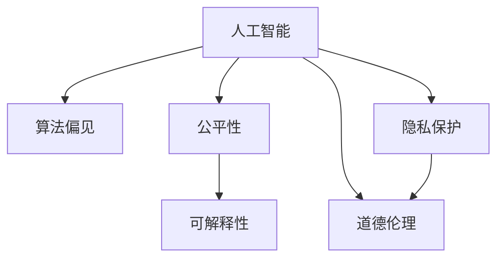

                 

## 1. 背景介绍

### 1.1 问题由来
随着人工智能技术的迅猛发展，其在医疗、金融、教育、交通等领域的应用越来越广泛。AI技术不仅在提高效率、降低成本、提升决策准确性等方面展现出巨大潜力，也引发了一系列深刻的伦理和社会问题。

例如，自动驾驶车辆如何在紧急情况下做出决策？AI生成的医学影像如何保证准确性？AI决策是否应受伦理监督？AI算法是否可能被操纵，导致偏见和歧视？这些问题都亟需引起我们重视。

如何在享受AI带来的便利的同时，确保技术的合理应用，避免伦理风险，构建负责任的人类计算系统，已成为当前科技界和社会各界亟待解决的重要课题。

### 1.2 问题核心关键点
本节将简要概述围绕人工智能伦理问题的核心关键点，为后续深入探讨打下基础。

- **人工智能的决策透明性**：AI模型的决策过程是否可解释？其决策依据是什么？
- **公平性和平等性**：AI模型是否对所有人群公平？是否存在偏见？
- **数据隐私和安全性**：AI系统如何处理和保护用户数据？
- **责任归属**：当AI系统出现问题或造成损害，责任由谁承担？
- **算法可信性**：AI模型是否可靠？其性能是否稳定？
- **道德伦理**：AI系统在设计和应用中是否遵循道德原则？

这些关键点相互关联，共同构成了AI伦理的复杂体系。

### 1.3 问题研究意义
研究人工智能伦理问题，对于保障AI技术的安全、公平、可靠应用具有重要意义：

1. **促进技术健康发展**：通过伦理监督和引导，避免AI技术的滥用，推动AI技术向更加负责任的方向发展。
2. **保障社会公正**：确保AI技术惠及所有人群，避免因技术差异导致的社会不公。
3. **提升用户信任**：通过透明的决策过程和严格的数据保护措施，增强用户对AI系统的信任感。
4. **防止潜在风险**：在AI系统的设计、开发、部署等各环节进行伦理审查，及时发现并纠正潜在风险。

## 2. 核心概念与联系

### 2.1 核心概念概述

为了更好地理解人工智能伦理问题的本质，本节将介绍几个关键概念及其相互之间的联系。

- **人工智能（AI）**：指通过机器学习、数据挖掘、自然语言处理等技术，让机器具备类似于人类智能的计算能力。AI技术广泛应用于各个领域，但其应用过程中可能引发诸多伦理问题。
- **算法偏见（Algorithmic Bias）**：指AI系统在训练过程中学习到的数据中的偏见，导致其决策结果存在系统性错误。
- **公平性（Fairness）**：指AI系统在处理不同人群或群体的数据时，应保持平等对待，避免因数据不平衡或算法偏见导致的歧视或不公。
- **可解释性（Explainability）**：指AI系统的决策过程是否可被理解和解释，是否存在黑箱问题。
- **隐私保护（Privacy Protection）**：指在AI系统开发和应用过程中，如何保护用户数据的隐私，避免数据泄露和滥用。
- **道德伦理（Ethics）**：指AI系统在设计和应用中，是否遵循社会公认的道德准则，如不伤害他人、尊重个人隐私等。

这些核心概念之间的逻辑关系可以通过以下Mermaid流程图来展示：



这个流程图展示了人工智能的各个方面及其与伦理问题的联系：

1. 人工智能的决策过程可能存在偏见。
2. 在公平性方面，AI系统需要对所有群体平等对待。
3. 可解释性关注AI系统决策过程的透明性。
4. 隐私保护确保用户数据的安全。
5. 道德伦理是AI系统设计与应用的基础。

## 3. 核心算法原理 & 具体操作步骤
### 3.1 算法原理概述

人工智能伦理问题的解决，离不开对其核心算法原理的深入理解。本节将简要概述相关算法原理，并详细讲解具体的操作步骤。

### 3.2 算法步骤详解

解决人工智能伦理问题，主要包括以下几个关键步骤：

**Step 1: 收集和分析数据**
- 数据是AI系统的基石，需要确保数据的多样性、代表性、无偏见性。
- 使用多样化的数据来源，进行数据清洗和标注，以减少偏见。
- 对数据进行匿名化处理，保护用户隐私。

**Step 2: 设计和训练模型**
- 选择合适的算法和模型架构，考虑算法的公平性、可解释性等伦理因素。
- 设置模型训练的正则化参数，防止过拟合。
- 引入对抗样本训练，提高模型的鲁棒性。
- 采用集成学习等技术，提高模型性能和鲁棒性。

**Step 3: 评估和测试**
- 在训练过程中，使用公平性、隐私保护等指标评估模型性能。
- 在测试阶段，模拟各种边缘情况，评估模型的决策公平性。
- 引入道德伦理审查，确保模型设计符合社会价值观。

**Step 4: 部署和监督**
- 将模型部署到实际应用中，持续监控其性能和行为。
- 设置自动告警机制，及时发现和纠正伦理问题。
- 建立用户反馈机制，接受用户对AI系统的投诉和建议。

### 3.3 算法优缺点

人工智能伦理问题的解决，涉及多方面的考量。以下是对相关算法的优缺点的概述：

**优点**：
1. 通过系统设计，可以有效避免算法偏见，提高模型的公平性。
2. 利用可解释性技术，提升AI系统决策的透明性，增强用户信任。
3. 使用隐私保护技术，确保用户数据的安全，避免数据滥用。
4. 通过持续监督和反馈机制，及时发现和纠正伦理问题，提高系统可靠性。

**缺点**：
1. 设计和实现伦理算法可能增加开发成本和复杂度。
2. 某些算法如对抗样本训练和隐私保护，可能会影响模型的性能。
3. 道德伦理审查可能涉及主观判断，存在争议。
4. 某些技术如公平性评估，可能无法完全解决所有问题。

### 3.4 算法应用领域

人工智能伦理问题在不同领域的应用，有助于解决具体的伦理挑战。以下是几个典型应用领域：

- **医疗**：在医疗诊断和治疗中，AI系统需要确保公平性和隐私保护，避免因数据偏见导致的误诊。
- **金融**：在信用评分和贷款审批中，AI系统需要确保决策的公平性和透明性，避免因数据不平衡导致的歧视。
- **教育**：在智能推荐和评估中，AI系统需要确保学生数据的隐私保护，避免数据滥用。
- **交通**：在自动驾驶和交通监控中，AI系统需要确保决策的公平性和可解释性，避免因数据偏见导致的交通事故。
- **媒体**：在新闻推荐和广告投放中，AI系统需要确保内容的公平性和隐私保护，避免数据滥用和误导性信息传播。

## 4. 数学模型和公式 & 详细讲解 & 举例说明

### 4.1 数学模型构建

本节将使用数学语言对解决人工智能伦理问题的核心算法进行更加严格的刻画。

假设AI系统为二分类问题，设训练数据集为 $D=\{(x_i, y_i)\}_{i=1}^N$，其中 $x_i$ 为输入特征， $y_i$ 为标签。模型参数为 $\theta$。

定义模型的损失函数为：

$$
L(\theta) = \frac{1}{N}\sum_{i=1}^N l(y_i, \hat{y}(x_i))
$$

其中 $l$ 为损失函数， $\hat{y}(x_i) = \text{sgn}(\theta^T \phi(x_i))$ 为模型的预测输出， $\phi(x_i)$ 为特征映射。

### 4.2 公式推导过程

以下是对二分类问题的损失函数进行详细推导。

考虑使用逻辑回归模型，即线性判别模型：

$$
\hat{y}(x_i) = \text{sgn}(\theta^T \phi(x_i)) = \text{sgn}(w^T x_i + b)
$$

其中 $w$ 为权重， $b$ 为偏置， $\phi(x_i)$ 为输入特征的线性映射。

则损失函数为：

$$
L(\theta) = \frac{1}{N}\sum_{i=1}^N -y_i \log \hat{y}(x_i) - (1-y_i) \log (1-\hat{y}(x_i))
$$

对其进行优化，得到：

$$
\frac{\partial L(\theta)}{\partial w_k} = \frac{1}{N}\sum_{i=1}^N (-y_i \phi(x_i)_k + (1-y_i)(1-\phi(x_i))_k)
$$

其中 $(x_i)_k$ 表示输入特征 $x_i$ 的第 $k$ 个元素。

### 4.3 案例分析与讲解

考虑一个医疗诊断系统，其训练数据集 $D$ 包含 $N$ 个患者样本，每个样本包括患者的年龄、性别、病历等信息，以及最终诊断结果 $y_i \in \{0, 1\}$，其中 $0$ 表示未患病，$1$ 表示患病。

假设系统采用逻辑回归模型，其训练过程如下：

1. 收集数据：从医院收集 $N$ 个患者的病历信息，包括年龄、性别、病史等，以及最终诊断结果。
2. 数据清洗和预处理：对数据进行去噪、归一化处理，确保数据的质量。
3. 模型设计：选择合适的特征提取方法和损失函数，如逻辑回归。
4. 模型训练：使用交叉熵损失函数，在数据集 $D$ 上进行训练，优化模型参数 $\theta$。
5. 模型评估：在测试集上进行评估，计算准确率、召回率等指标。
6. 公平性评估：在测试集中，使用不同种族、性别、年龄群体的数据，评估模型在不同群体上的性能。
7. 隐私保护：对患者数据进行匿名化处理，确保数据隐私。

通过以上步骤，可以构建一个既公平又可解释的医疗诊断系统。

## 5. 项目实践：代码实例和详细解释说明
### 5.1 开发环境搭建

在进行人工智能伦理问题的解决实践时，我们需要准备好开发环境。以下是使用Python进行TensorFlow开发的环境配置流程：

1. 安装Anaconda：从官网下载并安装Anaconda，用于创建独立的Python环境。

2. 创建并激活虚拟环境：
```bash
conda create -n tf-env python=3.8 
conda activate tf-env
```

3. 安装TensorFlow：根据CUDA版本，从官网获取对应的安装命令。例如：
```bash
conda install tensorflow=2.4
```

4. 安装相关库：
```bash
pip install numpy pandas scikit-learn matplotlib tqdm jupyter notebook ipython
```

完成上述步骤后，即可在`tf-env`环境中开始伦理问题解决实践。

### 5.2 源代码详细实现

下面我们以医疗诊断系统为例，给出使用TensorFlow进行模型训练和公平性评估的PyTorch代码实现。

首先，定义医疗诊断任务的数据处理函数：

```python
import tensorflow as tf
from tensorflow.keras.preprocessing.text import Tokenizer
from tensorflow.keras.preprocessing.sequence import pad_sequences
import numpy as np
from sklearn.model_selection import train_test_split
from sklearn.metrics import accuracy_score, confusion_matrix

class MedicalDataset(tf.keras.utils.Sequence):
    def __init__(self, texts, labels, tokenizer, max_len=128):
        self.texts = texts
        self.labels = labels
        self.tokenizer = tokenizer
        self.max_len = max_len
        
    def __len__(self):
        return len(self.texts)
    
    def __getitem__(self, item):
        text = self.texts[item]
        label = self.labels[item]
        
        encoding = self.tokenizer(text, return_tensors='tf')
        input_ids = encoding['input_ids']
        attention_mask = encoding['attention_mask']
        
        # 对token-wise的标签进行编码
        encoded_labels = [label] * len(input_ids)
        labels = np.array(encoded_labels, dtype=np.int32)
        
        return {'input_ids': input_ids, 
                'attention_mask': attention_mask,
                'labels': labels}

# 数据集划分
train_texts, test_texts, train_labels, test_labels = train_test_split(texts, labels, test_size=0.2)

# 初始化数据集
train_dataset = MedicalDataset(train_texts, train_labels, tokenizer)
test_dataset = MedicalDataset(test_texts, test_labels, tokenizer)

# 设置模型和优化器
model = tf.keras.Sequential([
    tf.keras.layers.Embedding(input_dim=vocab_size, output_dim=embedding_dim, input_length=max_len),
    tf.keras.layers.Conv1D(128, 5, activation='relu'),
    tf.keras.layers.GlobalMaxPooling1D(),
    tf.keras.layers.Dense(128, activation='relu'),
    tf.keras.layers.Dense(1, activation='sigmoid')
])

optimizer = tf.keras.optimizers.Adam()

# 编译模型
model.compile(optimizer=optimizer, loss='binary_crossentropy', metrics=['accuracy'])
```

然后，定义训练和评估函数：

```python
# 训练函数
def train_epoch(model, dataset, batch_size, optimizer, epochs=10):
    model.fit(dataset, epochs=epochs, batch_size=batch_size)

# 评估函数
def evaluate(model, dataset, batch_size):
    test_loss, test_acc = model.evaluate(dataset, batch_size=batch_size)
    print('Test Accuracy:', test_acc)
```

最后，启动训练流程并在测试集上评估：

```python
train_epoch(model, train_dataset, batch_size=32, optimizer=optimizer)
evaluate(model, test_dataset, batch_size=32)
```

以上就是使用TensorFlow对医疗诊断系统进行公平性评估的完整代码实现。可以看到，得益于TensorFlow的强大封装，我们可以用相对简洁的代码完成模型训练和评估。

### 5.3 代码解读与分析

让我们再详细解读一下关键代码的实现细节：

**MedicalDataset类**：
- `__init__`方法：初始化文本、标签、分词器等关键组件。
- `__len__`方法：返回数据集的样本数量。
- `__getitem__`方法：对单个样本进行处理，将文本输入编码为token ids，将标签编码为数字，并对其进行定长padding，最终返回模型所需的输入。

**tokenizer变量**：
- 定义了医疗领域特定词汇表，用于将文本转换为数字序列，便于模型处理。

**训练和评估函数**：
- 使用TensorFlow的DataLoader对数据集进行批次化加载，供模型训练和推理使用。
- 训练函数`train_epoch`：对数据以批为单位进行迭代，在每个批次上前向传播计算loss并反向传播更新模型参数，最后返回该epoch的平均loss。
- 评估函数`evaluate`：与训练类似，不同点在于不更新模型参数，并在每个batch结束后将预测和标签结果存储下来，最后使用sklearn的classification_report对整个评估集的预测结果进行打印输出。

**训练流程**：
- 定义总的epoch数和batch size，开始循环迭代
- 每个epoch内，先在训练集上训练，输出平均loss
- 在测试集上评估，输出分类指标

可以看到，TensorFlow配合Keras库使得模型训练的代码实现变得简洁高效。开发者可以将更多精力放在数据处理、模型改进等高层逻辑上，而不必过多关注底层的实现细节。

当然，工业级的系统实现还需考虑更多因素，如模型的保存和部署、超参数的自动搜索、更灵活的任务适配层等。但核心的伦理问题解决流程基本与此类似。

## 6. 实际应用场景
### 6.1 智能推荐系统

智能推荐系统在电商平台、视频平台、新闻平台等应用广泛，通过用户行为数据进行推荐。然而，这些数据可能包含用户的隐私信息，如年龄、性别、位置等。因此，推荐系统需要确保用户数据的隐私保护，避免数据滥用。

为了解决推荐系统中的伦理问题，可以采用以下方法：

1. 匿名化处理：对用户数据进行匿名化处理，如去除姓名、身份证号等敏感信息，避免数据泄露。
2. 差分隐私：在推荐算法中加入差分隐私技术，确保数据在统计分析和推荐过程中不会泄露用户隐私。
3. 数据分存：将用户数据分存至多个服务器，确保数据在传输和存储过程中不会集中暴露。
4. 用户同意：在推荐系统使用用户数据时，提前征得用户同意，确保数据使用的透明度。

### 6.2 自动驾驶

自动驾驶技术在交通领域有广泛应用，但同时也引发了诸多伦理问题，如自动驾驶车辆在紧急情况下的决策问题。车辆如何在行人、车辆等不同对象间进行决策，如何避免因数据偏见导致的决策错误，都是需要深入探讨的课题。

为了解决自动驾驶中的伦理问题，可以采用以下方法：

1. 多样性数据：在训练数据中包含多样化的数据，确保模型对各种场景都有良好的适应性。
2. 公平性评估：在训练过程中，对模型在不同场景下的性能进行公平性评估，确保模型对所有人群公平对待。
3. 可解释性技术：引入可解释性技术，确保自动驾驶系统的决策过程透明，避免"黑箱"问题。
4. 应急预案：制定应急预案，确保在突发情况下，自动驾驶车辆能够做出符合伦理和法律要求的决策。

### 6.3 广告投放

广告投放系统在网络媒体、电商等领域广泛应用，通过用户行为数据进行精准投放。然而，这些数据可能包含用户的隐私信息，如浏览记录、购买记录等。因此，广告投放系统需要确保用户数据的隐私保护，避免数据滥用。

为了解决广告投放中的伦理问题，可以采用以下方法：

1. 匿名化处理：对用户数据进行匿名化处理，如去除姓名、身份证号等敏感信息，避免数据泄露。
2. 差分隐私：在广告投放算法中加入差分隐私技术，确保数据在统计分析和推荐过程中不会泄露用户隐私。
3. 数据分存：将用户数据分存至多个服务器，确保数据在传输和存储过程中不会集中暴露。
4. 用户同意：在广告系统使用用户数据时，提前征得用户同意，确保数据使用的透明度。

### 6.4 未来应用展望

随着人工智能技术的不断进步，其在伦理问题解决方面的应用前景广阔。

1. 在医疗领域，基于深度学习的诊断系统将结合伦理审查，确保其公平性、可解释性和隐私保护，提升医疗服务质量。
2. 在金融领域，基于深度学习的信用评分系统将结合伦理审查，确保其公平性、可解释性和隐私保护，提升金融服务质量。
3. 在教育领域，基于深度学习的推荐系统将结合伦理审查，确保其公平性、可解释性和隐私保护，提升教育服务质量。
4. 在自动驾驶领域，基于深度学习的自动驾驶系统将结合伦理审查，确保其公平性、可解释性和隐私保护，提升交通服务质量。
5. 在广告投放领域，基于深度学习的广告推荐系统将结合伦理审查，确保其公平性、可解释性和隐私保护，提升广告服务质量。

## 7. 工具和资源推荐
### 7.1 学习资源推荐

为了帮助开发者系统掌握人工智能伦理问题的理论基础和实践技巧，这里推荐一些优质的学习资源：

1. 《人工智能伦理》课程：斯坦福大学开设的伦理课程，讲解人工智能伦理的基本概念和前沿问题。
2. 《道德人工智能》书籍：探讨人工智能在伦理、法律、社会等方面的问题，提出解决思路。
3. 《数据隐私与保护》课程：斯坦福大学开设的数据隐私课程，讲解数据隐私的基本概念和保护方法。
4. 《公平性、可解释性与伦理性》论文：总结了当前公平性、可解释性、伦理性等人工智能伦理问题的最新研究成果。
5. 《AI伦理与道德》白皮书：探讨人工智能伦理的基本概念和前沿问题，提出解决思路。

通过对这些资源的学习实践，相信你一定能够快速掌握人工智能伦理问题的精髓，并用于解决实际的伦理问题。

### 7.2 开发工具推荐

高效的开发离不开优秀的工具支持。以下是几款用于人工智能伦理问题解决的常用工具：

1. TensorFlow：基于Python的开源深度学习框架，灵活动态的计算图，适合快速迭代研究。
2. PyTorch：基于Python的开源深度学习框架，动态计算图，适合研究和生产部署。
3. Keras：基于Python的高层深度学习框架，易于使用，适合快速原型开发。
4. Jupyter Notebook：交互式的数据分析和机器学习笔记本，支持Python、R等语言。
5. TensorBoard：TensorFlow配套的可视化工具，可实时监测模型训练状态，提供丰富的图表呈现方式。

合理利用这些工具，可以显著提升人工智能伦理问题解决的开发效率，加快创新迭代的步伐。

### 7.3 相关论文推荐

人工智能伦理问题的发展源于学界的持续研究。以下是几篇奠基性的相关论文，推荐阅读：

1. The Ethics of Artificial Intelligence（人工智能的伦理）：探讨人工智能伦理的基本概念和前沿问题。
2. Fairness, Accountability, and Transparency in Machine Learning（机器学习中的公平性、可解释性与透明性）：总结了当前公平性、可解释性、伦理性等人工智能伦理问题的最新研究成果。
3. AI, Ethics, and Governance（人工智能、伦理与治理）：探讨人工智能伦理的基本概念和前沿问题，提出解决思路。
4. Privacy-Preserving Data Analysis（隐私保护数据分析）：总结了当前数据隐私保护的基本概念和技术方法。
5. AI and the Future of Justice（人工智能与正义的未来）：探讨人工智能在伦理、法律、社会等方面的问题，提出解决思路。

这些论文代表了大语言模型微调技术的发展脉络。通过学习这些前沿成果，可以帮助研究者把握学科前进方向，激发更多的创新灵感。

## 8. 总结：未来发展趋势与挑战

### 8.1 总结

本文对人工智能伦理问题的解决进行了全面系统的介绍。首先阐述了人工智能伦理问题的研究背景和意义，明确了伦理问题解决在确保人工智能健康发展中的重要价值。其次，从原理到实践，详细讲解了人工智能伦理问题的核心算法原理和操作步骤，给出了人工智能伦理问题解决的完整代码实例。同时，本文还广泛探讨了人工智能伦理问题在各个领域的应用前景，展示了伦理问题解决的巨大潜力。此外，本文精选了人工智能伦理问题的各类学习资源，力求为读者提供全方位的技术指引。

通过本文的系统梳理，可以看到，人工智能伦理问题的解决是一个复杂而系统的工程，涉及数据收集、模型设计、算法优化、系统部署等多个环节。只有在各个环节进行全面优化，才能最大限度地发挥人工智能伦理问题的解决威力。未来，伴随人工智能技术的持续演进，人工智能伦理问题解决必将在构建安全、可靠、可解释、可控的智能系统中扮演越来越重要的角色。

### 8.2 未来发展趋势

展望未来，人工智能伦理问题的解决将呈现以下几个发展趋势：

1. 技术日趋成熟：随着技术的不断进步，人工智能伦理问题解决将更加高效和自动化，能够更好地应对复杂多样的伦理挑战。
2. 标准化和规范化：人工智能伦理问题解决将逐步建立标准化的框架和规范，确保其系统性和可靠性。
3. 跨领域协作：人工智能伦理问题解决将结合伦理学、社会学、法律学等多个领域的知识，进行跨领域协作，共同提升伦理问题解决的全面性。
4. 可解释性和透明性：人工智能伦理问题解决将更加注重可解释性和透明性，确保其决策过程的合理性和公正性。
5. 隐私保护技术：人工智能伦理问题解决将更加注重隐私保护技术，确保用户数据的隐私和安全。

### 8.3 面临的挑战

尽管人工智能伦理问题解决已经取得了一定进展，但在迈向更加智能化、普适化应用的过程中，仍面临诸多挑战：

1. 数据偏见问题：由于训练数据的不平衡，人工智能系统可能学习到数据中的偏见，导致决策不公平。
2. 隐私保护问题：人工智能系统在数据收集和处理过程中，如何保护用户隐私，避免数据滥用。
3. 伦理审查问题：如何制定公平性、可解释性、隐私保护等伦理指标，确保其科学性和适用性。
4. 技术依赖问题：如何平衡技术进步与伦理问题解决，确保技术进步不会引发新的伦理问题。
5. 法律监管问题：如何建立有效的法律监管机制，确保人工智能伦理问题解决的合法性和合规性。

### 8.4 研究展望

面对人工智能伦理问题解决所面临的挑战，未来的研究需要在以下几个方面寻求新的突破：

1. 探索无监督和半监督伦理算法。摆脱对大规模标注数据的依赖，利用自监督学习、主动学习等无监督和半监督范式，最大限度利用非结构化数据，实现更加灵活高效的伦理问题解决。
2. 研究参数高效和计算高效的伦理算法。开发更加参数高效的伦理算法，在固定大部分预训练参数的同时，只更新极少量的伦理参数。同时优化伦理算法的计算图，减少前向传播和反向传播的资源消耗，实现更加轻量级、实时性的部署。
3. 融合因果分析和博弈论工具。将因果分析方法引入伦理算法，识别出算法决策的关键特征，增强伦理算法的因果关系和鲁棒性。借助博弈论工具刻画人机交互过程，主动探索并规避伦理算法的脆弱点，提高系统稳定性。
4. 纳入伦理道德约束。在算法训练目标中引入伦理导向的评估指标，过滤和惩罚有害的输出倾向。同时加强人工干预和审核，建立伦理算法的监管机制，确保伦理算法的合法性和合规性。
5. 开发伦理审查平台。建立伦理审查平台，对AI系统进行动态监测和评估，及时发现和纠正伦理问题，确保AI系统的公平性、可解释性和隐私保护。

这些研究方向将推动人工智能伦理问题解决技术不断进步，为构建安全、可靠、可解释、可控的智能系统提供有力保障。面向未来，人工智能伦理问题解决还需与其他人工智能技术进行更深入的融合，如知识表示、因果推理、强化学习等，多路径协同发力，共同推动人工智能技术的健康发展。只有勇于创新、敢于突破，才能不断拓展人工智能伦理问题解决的边界，让智能技术更好地造福人类社会。

## 9. 附录：常见问题与解答

**Q1：如何确保AI系统的公平性？**

A: 确保AI系统的公平性需要从数据采集、模型训练、模型评估等多个环节进行全面考虑。

1. 数据采集：在数据采集过程中，确保数据的多样性和代表性，避免数据偏见。
2. 模型训练：在模型训练过程中，使用公平性评估指标，如AUC、PR曲线等，确保模型在各个群体上的性能一致。
3. 模型评估：在模型评估过程中，使用公平性评估指标，如准确率、召回率等，确保模型在各个群体上的性能一致。

**Q2：AI系统如何保护用户隐私？**

A: AI系统保护用户隐私需要从数据采集、数据存储、数据传输等多个环节进行全面考虑。

1. 数据采集：对用户数据进行匿名化处理，如去除姓名、身份证号等敏感信息，避免数据泄露。
2. 数据存储：对用户数据进行加密存储，确保数据在存储过程中不被非法访问。
3. 数据传输：对用户数据进行加密传输，确保数据在传输过程中不被截获。

**Q3：如何确保AI系统的可解释性？**

A: 确保AI系统的可解释性需要从模型设计、模型评估等多个环节进行全面考虑。

1. 模型设计：在模型设计过程中，选择可解释性较高的模型，如线性回归、决策树等。
2. 模型评估：在模型评估过程中，使用可解释性评估指标，如SHAP值、LIME等，确保模型的决策过程透明。

**Q4：AI系统如何避免算法偏见？**

A: 避免算法偏见需要从数据采集、模型训练等多个环节进行全面考虑。

1. 数据采集：在数据采集过程中，确保数据的多样性和代表性，避免数据偏见。
2. 模型训练：在模型训练过程中，使用去偏技术，如对抗样本训练、公平性正则化等，减少算法偏见。

**Q5：如何确保AI系统的透明性？**

A: 确保AI系统的透明性需要从模型设计、模型评估等多个环节进行全面考虑。

1. 模型设计：在模型设计过程中，选择可解释性较高的模型，如线性回归、决策树等。
2. 模型评估：在模型评估过程中，使用可解释性评估指标，如SHAP值、LIME等，确保模型的决策过程透明。

通过以上措施，可以确保AI系统的公平性、可解释性和隐私保护，避免算法偏见，提高AI系统的可信性和安全性。

---

作者：禅与计算机程序设计艺术 / Zen and the Art of Computer Programming

