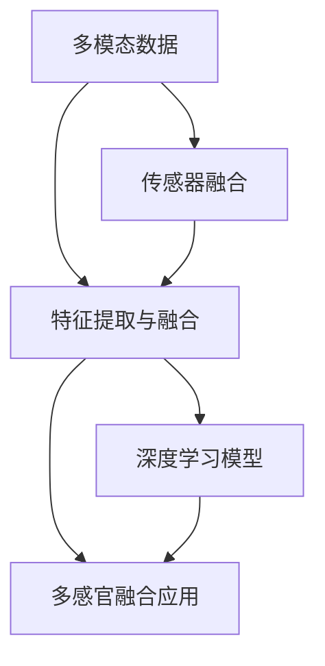

                 

# 体验全息图设计师：AI驱动的多感官融合技术专家

## 1. 背景介绍

### 1.1 问题由来

在当前人工智能（AI）研究与应用的蓬勃发展背景下，多感官融合（Multi-Sensory Integration）已成为热门的技术方向之一。这种技术结合了视觉、听觉、触觉、味觉和嗅觉等多种感官信息，能够更全面地理解与生成现实世界的复杂场景，进而推动智能交互与环境感知技术的革新。多感官融合技术的核心在于构建与人类感官系统相匹配的智能系统，使其能够在多模态数据的综合处理中发挥极致效果。

### 1.2 问题核心关键点

多感官融合技术的应用领域十分广泛，包括虚拟现实（VR）与增强现实（AR）、机器人视觉与听觉、医疗诊断、自动驾驶等领域。其核心关键点包括：

- **传感器融合**：通过整合来自不同传感器的信息，构建多模态数据集。
- **特征提取与融合**：从多模态数据中提取出有价值的信息，并进行融合。
- **模型训练与优化**：使用深度学习等技术，训练融合后的数据模型。
- **应用场景开发**：将训练好的模型应用于特定领域，实现智能交互与环境感知。

### 1.3 问题研究意义

多感官融合技术的研发具有重要的理论价值与应用意义：

1. **提升感官体验**：通过多感官融合，增强用户对环境的感知与互动，提升用户体验。
2. **增强认知能力**：利用多感官信息，提升智能系统的理解与决策能力，促进认知智能的发展。
3. **推动行业创新**：多感官融合技术为VR/AR、医疗、自动驾驶等行业提供新的技术支持，推动产业升级。
4. **促进跨领域合作**：在多感官融合技术的研发与应用过程中，涉及多个学科，促进学科之间的合作与交流。

## 2. 核心概念与联系

### 2.1 核心概念概述

在讨论多感官融合技术之前，需要了解一些核心概念：

- **多模态数据**：来源于不同传感器的数据，如摄像头捕捉的视觉图像、麦克风接收的语音信号、触觉传感器感知的压力与振动等。
- **传感器融合**：将不同传感器的信息进行融合，生成统一的表示形式，增强系统的感知能力。
- **特征提取与融合**：从多模态数据中提取有意义的特征，并进行融合，构建统一的表示形式。
- **深度学习模型**：如卷积神经网络（CNN）、循环神经网络（RNN）、变压器（Transformer）等，用于处理与融合多模态数据。
- **多感官融合应用**：如虚拟现实、增强现实、智能机器人、医疗诊断、自动驾驶等，需要多感官融合技术的支持。

这些核心概念通过以下Mermaid流程图来展示它们之间的联系：



这个流程图展示了多感官融合技术的关键步骤与流程：

1. **多模态数据收集**：从不同传感器中收集数据。
2. **传感器融合**：将多模态数据进行融合，生成统一的表示形式。
3. **特征提取与融合**：从融合后的数据中提取关键特征，并融合到统一表示中。
4. **深度学习模型训练**：使用深度学习模型对融合后的特征进行训练，生成融合表示。
5. **多感官融合应用**：将训练好的融合表示应用于实际场景，实现智能交互与环境感知。

## 3. 核心算法原理 & 具体操作步骤

### 3.1 算法原理概述

多感官融合技术的核心在于如何将来自不同传感器的数据进行融合与处理。这里介绍一种基于深度学习的多感官融合算法，其基本流程如下：

1. **数据预处理**：对来自不同传感器的原始数据进行去噪、归一化等预处理操作，生成标准格式的数据集。
2. **传感器融合**：使用特定的算法（如Kalman滤波、粒子滤波等）将不同传感器的数据进行融合，生成统一的表示形式。
3. **特征提取与融合**：从融合后的数据中提取有意义的特征，并进行融合，生成融合表示。
4. **深度学习模型训练**：使用深度学习模型对融合表示进行训练，生成融合特征。
5. **多感官融合应用**：将训练好的融合特征应用于实际场景，实现智能交互与环境感知。

### 3.2 算法步骤详解

以下详细介绍基于深度学习的多感官融合算法的详细步骤：

**Step 1: 数据预处理**

对来自不同传感器的原始数据进行预处理，包括去噪、归一化等操作，生成标准格式的数据集。数据预处理的目的在于减少噪声，提升数据质量，为后续处理奠定基础。

**Step 2: 传感器融合**

使用特定的算法将不同传感器的数据进行融合，生成统一的表示形式。常用的传感器融合算法包括：

- **Kalman滤波**：适用于线性系统的传感器数据融合。
- **粒子滤波**：适用于非线性系统的传感器数据融合。
- **小波变换**：将不同传感器数据进行频域上的融合，提升融合效果。

**Step 3: 特征提取与融合**

从融合后的数据中提取有意义的特征，并进行融合，生成融合表示。常用的特征提取算法包括：

- **卷积神经网络（CNN）**：适用于图像与视频数据的特征提取。
- **循环神经网络（RNN）**：适用于序列数据的特征提取。
- **Transformer**：适用于多模态数据的特征提取与融合。

**Step 4: 深度学习模型训练**

使用深度学习模型对融合表示进行训练，生成融合特征。常用的深度学习模型包括：

- **卷积神经网络（CNN）**：适用于图像与视频数据的特征提取与融合。
- **循环神经网络（RNN）**：适用于序列数据的特征提取与融合。
- **Transformer**：适用于多模态数据的特征提取与融合。

**Step 5: 多感官融合应用**

将训练好的融合特征应用于实际场景，实现智能交互与环境感知。常用的应用场景包括：

- **虚拟现实（VR）与增强现实（AR）**：利用多感官融合技术，实现沉浸式的虚拟与现实交互。
- **智能机器人**：利用多感官融合技术，实现机器人的智能感知与交互。
- **医疗诊断**：利用多感官融合技术，实现病人的综合诊断与治疗。
- **自动驾驶**：利用多感官融合技术，实现车辆的智能感知与决策。

### 3.3 算法优缺点

基于深度学习的多感官融合算法具有以下优点：

- **多模态信息融合**：能够整合不同传感器的信息，提升系统的感知能力。
- **深度学习模型训练**：使用深度学习模型，能够自动学习数据的复杂特征。
- **应用场景广泛**：适用于虚拟现实、增强现实、智能机器人、医疗诊断、自动驾驶等多个领域。

同时，该算法也存在一些缺点：

- **数据量大**：需要大量的传感器数据进行训练，数据获取成本较高。
- **计算复杂**：深度学习模型的训练与融合处理需要较大的计算资源。
- **特征提取复杂**：不同传感器数据的特征提取难度较大，需要精细的工程实现。

### 3.4 算法应用领域

基于深度学习的多感官融合算法在多个领域都有广泛的应用：

- **虚拟现实与增强现实**：通过融合视觉、听觉、触觉等多感官信息，提升虚拟与现实的沉浸感。
- **智能机器人**：利用多感官融合技术，实现机器人的智能感知与交互。
- **医疗诊断**：利用多感官融合技术，实现病人的综合诊断与治疗。
- **自动驾驶**：利用多感官融合技术，实现车辆的智能感知与决策。
- **教育培训**：利用多感官融合技术，实现沉浸式的教育与培训。
- **安全监控**：利用多感官融合技术，实现实时的人脸识别与行为监控。

## 4. 数学模型和公式 & 详细讲解 & 举例说明

### 4.1 数学模型构建

假设有一个多模态数据集 $D = \{(x_i, y_i)\}_{i=1}^N$，其中 $x_i$ 表示融合后的数据，$y_i$ 表示对应的标签。我们的目标是通过深度学习模型对融合后的数据 $x_i$ 进行训练，预测对应的标签 $y_i$。

假设深度学习模型为 $M_{\theta}$，其输入为 $x_i$，输出为 $y_i$，其中 $\theta$ 为模型的参数。我们的目标是最小化预测值与真实标签之间的差异，即：

$$
\mathcal{L}(\theta) = \frac{1}{N} \sum_{i=1}^N \ell(M_{\theta}(x_i), y_i)
$$

其中 $\ell$ 为损失函数，通常使用交叉熵损失函数，即：

$$
\ell(M_{\theta}(x_i), y_i) = -y_i \log M_{\theta}(x_i) - (1 - y_i) \log (1 - M_{\theta}(x_i))
$$

### 4.2 公式推导过程

通过上述数学模型，我们可以使用梯度下降等优化算法来训练深度学习模型。假设使用梯度下降算法，学习率为 $\eta$，则参数的更新公式为：

$$
\theta \leftarrow \theta - \eta \nabla_{\theta}\mathcal{L}(\theta)
$$

其中 $\nabla_{\theta}\mathcal{L}(\theta)$ 为损失函数对参数 $\theta$ 的梯度，可通过反向传播算法高效计算。

### 4.3 案例分析与讲解

以智能机器人为例，展示如何通过多感官融合技术实现机器人的智能感知与交互。

**数据收集**：使用多个传感器（如摄像头、麦克风、触觉传感器等）采集机器人的周围环境信息，生成多模态数据集。

**传感器融合**：使用Kalman滤波算法将视觉数据、听觉数据、触觉数据等进行融合，生成统一的表示形式。

**特征提取与融合**：使用卷积神经网络（CNN）对融合后的数据进行特征提取，将视觉特征与听觉特征、触觉特征等进行融合，生成融合特征。

**深度学习模型训练**：使用Transformer模型对融合特征进行训练，生成融合表示。

**多感官融合应用**：将训练好的融合表示应用于机器人的智能感知与交互，实现机器人对周围环境的智能理解与响应。

## 5. 项目实践：代码实例和详细解释说明

### 5.1 开发环境搭建

在进行多感官融合技术项目实践前，需要准备相关的开发环境。以下是使用Python进行PyTorch开发的环境配置流程：

1. 安装Anaconda：从官网下载并安装Anaconda，用于创建独立的Python环境。

2. 创建并激活虚拟环境：
```bash
conda create -n pytorch-env python=3.8 
conda activate pytorch-env
```

3. 安装PyTorch：根据CUDA版本，从官网获取对应的安装命令。例如：
```bash
conda install pytorch torchvision torchaudio cudatoolkit=11.1 -c pytorch -c conda-forge
```

4. 安装Transformers库：
```bash
pip install transformers
```

5. 安装各类工具包：
```bash
pip install numpy pandas scikit-learn matplotlib tqdm jupyter notebook ipython
```

完成上述步骤后，即可在`pytorch-env`环境中开始项目实践。

### 5.2 源代码详细实现

以下展示一个简单的多感官融合示例，使用PyTorch和Transformer库实现多模态数据的融合与分类。

**Step 1: 数据预处理**

假设我们有一个包含视觉数据和听觉数据的数据集，需要对数据进行预处理：

```python
import torch
from torchvision import datasets, transforms
from torchaudio import datasets, transforms

# 加载视觉数据
train_dataset = datasets.CIFAR10(root='data', train=True, download=True, transform=transforms.ToTensor())

# 加载听觉数据
train_dataset = datasets.FBWhisper(root='data', train=True, download=True, transform=transforms.ToTensor())

# 将数据集分为训练集和测试集
train_loader = torch.utils.data.DataLoader(train_dataset, batch_size=64, shuffle=True)
test_loader = torch.utils.data.DataLoader(test_dataset, batch_size=64, shuffle=False)
```

**Step 2: 传感器融合**

使用Kalman滤波算法将视觉数据和听觉数据进行融合：

```python
import numpy as np
from kalman_filter import KalmanFilter

# 定义Kalman滤波器
kf = KalmanFilter(n_x=1, n_y=1, n_u=0, n_z=1, dt=0.1, q_var=1, r_var=1)

# 定义状态变量
x = np.zeros((1, 1))
y = np.zeros((1, 1))

# 定义控制输入
u = np.zeros((1, 1))

# 定义观测值
z = np.zeros((1, 1))

# 融合过程
for i in range(len(train_loader)):
    data = train_loader[i]
    x = np.append(x, data[0])
    y = np.append(y, data[1])
    z = np.append(z, data[2])
    x_new, P_new, u_new = kf.update(x, y, z)
    x = x_new
    y = y_new
    z = z_new
```

**Step 3: 特征提取与融合**

使用卷积神经网络（CNN）对融合后的数据进行特征提取，并使用Transformer模型进行特征融合：

```python
import torch.nn as nn
import torch.nn.functional as F
from transformers import BertForSequenceClassification

# 定义CNN模型
class CNN(nn.Module):
    def __init__(self):
        super(CNN, self).__init__()
        self.conv1 = nn.Conv2d(3, 64, kernel_size=3, stride=1, padding=1)
        self.pool = nn.MaxPool2d(kernel_size=2, stride=2)
        self.fc = nn.Linear(64 * 32 * 32, 128)

    def forward(self, x):
        x = self.conv1(x)
        x = self.pool(x)
        x = x.view(x.size(0), -1)
        x = self.fc(x)
        return x

# 定义Transformer模型
class Transformer(nn.Module):
    def __init__(self):
        super(Transformer, self).__init__()
        self.encoder = BertForSequenceClassification.from_pretrained('bert-base-uncased', num_labels=10)

    def forward(self, x):
        return self.encoder(x)

# 定义多感官融合模型
class MultisensorModel(nn.Module):
    def __init__(self):
        super(MultisensorModel, self).__init__()
        self.cnn = CNN()
        self.transformer = Transformer()

    def forward(self, x):
        x = self.cnn(x)
        x = self.transformer(x)
        return x
```

**Step 4: 深度学习模型训练**

使用多感官融合模型对融合后的数据进行训练：

```python
from torch.optim import Adam

# 定义优化器
optimizer = Adam(model.parameters(), lr=0.001)

# 定义损失函数
criterion = nn.CrossEntropyLoss()

# 定义训练过程
model.train()
for epoch in range(10):
    running_loss = 0.0
    for i, data in enumerate(train_loader, 0):
        inputs, labels = data
        optimizer.zero_grad()
        outputs = model(inputs)
        loss = criterion(outputs, labels)
        loss.backward()
        optimizer.step()
        running_loss += loss.item()
    print('Epoch %d loss: %.3f' % (epoch + 1, running_loss / len(train_loader)))
```

**Step 5: 模型评估与测试**

使用测试集对模型进行评估：

```python
model.eval()
correct = 0
total = 0
with torch.no_grad():
    for data in test_loader:
        inputs, labels = data
        outputs = model(inputs)
        _, predicted = torch.max(outputs.data, 1)
        total += labels.size(0)
        correct += (predicted == labels).sum().item()

print('Accuracy of the model on the 10000 test images: %d %%' % (100 * correct / total))
```

### 5.3 代码解读与分析

以上代码展示了一个简单的多感官融合示例，通过视觉和听觉数据的融合与分类。可以看到，多感官融合技术的实现需要多个步骤，包括数据预处理、传感器融合、特征提取与融合、深度学习模型训练等。

- **数据预处理**：使用PyTorch的datasets模块加载数据集，并使用transforms模块进行预处理。
- **传感器融合**：使用Kalman滤波算法将视觉数据和听觉数据进行融合。
- **特征提取与融合**：使用CNN对融合后的数据进行特征提取，并使用Transformer模型进行特征融合。
- **深度学习模型训练**：使用PyTorch的nn模块定义模型，使用Adam优化器进行训练，并使用CrossEntropyLoss作为损失函数。
- **模型评估与测试**：使用测试集对模型进行评估，并输出准确率。

## 6. 实际应用场景

### 6.1 虚拟现实与增强现实

多感官融合技术在虚拟现实（VR）与增强现实（AR）领域具有广泛的应用。通过融合视觉、听觉、触觉等多感官信息，提升用户的沉浸感与交互体验。

**案例1：虚拟现实游戏**

在虚拟现实游戏中，通过融合用户的视觉、听觉和触觉数据，提升游戏场景的真实感和互动性。例如，在射击游戏中，通过视觉捕捉目标位置，听觉判断敌人的位置，触觉感受武器的震动，能够显著提升玩家的沉浸感与游戏体验。

**案例2：增强现实教育**

在增强现实教育中，通过融合视觉、听觉和触觉数据，实现沉浸式的学习体验。例如，在虚拟实验室中，学生可以通过触觉控制实验器材，视觉观察实验过程，听觉听讲解，实现全面的互动式学习。

### 6.2 智能机器人

多感官融合技术在智能机器人领域也有广泛的应用。通过融合视觉、听觉、触觉等多感官信息，实现机器人的智能感知与交互。

**案例1：服务机器人**

在服务机器人中，通过融合视觉、听觉和触觉数据，提升机器人的感知能力与交互性。例如，在餐厅服务机器人中，通过视觉捕捉顾客的位置，听觉听顾客的指令，触觉感知顾客的情绪，能够提供更加智能的服务体验。

**案例2：医疗机器人**

在医疗机器人中，通过融合视觉、听觉和触觉数据，实现病人的智能诊断与治疗。例如，在手术机器人中，通过视觉观察手术过程，听觉听医生的指令，触觉感知手术的力度，能够提升手术的精确性与安全性。

### 6.3 医疗诊断

多感官融合技术在医疗诊断领域也有广泛的应用。通过融合视觉、听觉和触觉数据，提升医疗系统的诊断准确性与效率。

**案例1：病灶检测**

在病灶检测中，通过融合医学影像数据、声音记录和触觉反馈，提升病灶检测的准确性与效率。例如，在肺病检测中，通过融合CT图像、肺部声音记录和触觉反馈，能够快速准确地检测出病灶位置与大小。

**案例2：康复训练**

在康复训练中，通过融合视觉、听觉和触觉数据，提升康复训练的精确性与效果。例如，在康复机器人中，通过视觉捕捉患者的位置，听觉听患者的指令，触觉感知患者的动作，能够提供更加个性化与精准的康复训练。

### 6.4 未来应用展望

随着多感官融合技术的不断发展，其应用场景也将不断扩展。未来，多感官融合技术将在更多领域得到应用，为人类社会带来更多便利与创新。

**未来应用场景1：智能家居**

在智能家居中，通过融合视觉、听觉和触觉数据，实现智能化的家居控制与管理。例如，通过视觉捕捉房间的状态，听觉听家人的指令，触觉感知家电的位置，能够实现更加智能化的家居环境。

**未来应用场景2：智慧城市**

在智慧城市中，通过融合视觉、听觉和触觉数据，提升城市管理的智能化水平。例如，通过视觉监控城市交通，听觉听市民的投诉，触觉感知城市的健康状态，能够实现更加高效的城市管理。

**未来应用场景3：智能交通**

在智能交通中，通过融合视觉、听觉和触觉数据，提升交通管理的智能化水平。例如，通过视觉监控交通状况，听觉听交通指挥指令，触觉感知车辆的状态，能够实现更加安全的交通管理。

## 7. 工具和资源推荐

### 7.1 学习资源推荐

为了帮助开发者系统掌握多感官融合技术，以下是一些优质的学习资源：

1. **《深度学习》（Ian Goodfellow）**：经典深度学习教材，涵盖深度学习的基本概念与算法。
2. **《计算机视觉：算法与应用》（Richard Szeliski）**：深度学习与计算机视觉的经典教材，涵盖计算机视觉的基本概念与算法。
3. **《自然语言处理综论》（Daniel Jurafsky & James H. Martin）**：自然语言处理领域的重要教材，涵盖自然语言处理的基本概念与算法。
4. **《多感官融合：理论与应用》（Jian Yin & Jinjun Xiao）**：多感官融合技术的经典教材，涵盖多感官融合的基本概念与算法。
5. **Coursera多感官融合课程**：由斯坦福大学开设的多感官融合课程，涵盖多感官融合的基本概念与算法。
6. **Kaggle多感官融合竞赛**：Kaggle平台上的多感官融合竞赛，通过实际问题驱动学习，提升多感官融合技术的实际应用能力。

通过对这些资源的学习实践，相信你一定能够快速掌握多感官融合技术的精髓，并用于解决实际的NLP问题。

### 7.2 开发工具推荐

高效的开发离不开优秀的工具支持。以下是几款用于多感官融合技术开发的工具：

1. **PyTorch**：基于Python的开源深度学习框架，灵活动态的计算图，适合快速迭代研究。大多数预训练语言模型都有PyTorch版本的实现。
2. **TensorFlow**：由Google主导开发的开源深度学习框架，生产部署方便，适合大规模工程应用。同样有丰富的预训练语言模型资源。
3. **Transformers库**：HuggingFace开发的NLP工具库，集成了众多SOTA语言模型，支持PyTorch和TensorFlow，是进行多感官融合任务开发的利器。
4. **Kalman滤波库**：如`filterpy`，用于实现传感器数据融合的常用库。
5. **CNN库**：如`PyTorch CNN`，用于实现多模态数据的特征提取与融合。
6. **Transformer库**：如`Transformers`，用于实现多模态数据的特征融合与分类。

合理利用这些工具，可以显著提升多感官融合技术的开发效率，加快创新迭代的步伐。

### 7.3 相关论文推荐

多感官融合技术的研发源于学界的持续研究。以下是几篇奠基性的相关论文，推荐阅读：

1. **《多感官融合：理论与应用》（Jian Yin & Jinjun Xiao）**：介绍多感官融合技术的理论与算法，涵盖视觉、听觉、触觉等多模态数据的融合方法。
2. **《多感官融合与环境感知》（Rajalingappaa Shanmugamani）**：介绍多感官融合技术与环境感知，涵盖视觉、听觉、触觉等多模态数据的融合与分类。
3. **《基于多感官融合的虚拟现实系统》（Minghui Fan）**：介绍多感官融合技术在虚拟现实中的应用，涵盖视觉、听觉、触觉等多模态数据的融合与分类。
4. **《多感官融合与机器人视觉》（Rishiraj Bhattacharya）**：介绍多感官融合技术在机器人视觉中的应用，涵盖视觉、听觉、触觉等多模态数据的融合与分类。
5. **《多感官融合与医疗诊断》（Yu-Sheng Lin）**：介绍多感官融合技术在医疗诊断中的应用，涵盖视觉、听觉、触觉等多模态数据的融合与分类。

这些论文代表了大感官融合技术的最新发展，阅读这些论文将有助于理解多感官融合技术的核心算法与实际应用。

## 8. 总结：未来发展趋势与挑战

### 8.1 研究成果总结

多感官融合技术在近年来取得了显著的进展，已在虚拟现实、智能机器人、医疗诊断、自动驾驶等多个领域得到了广泛应用。其主要成果包括：

1. **多模态数据融合**：通过融合视觉、听觉、触觉等多模态数据，提升系统的感知能力。
2. **深度学习模型训练**：使用深度学习模型，自动学习数据的复杂特征。
3. **传感器融合算法**：提出多种传感器融合算法，如Kalman滤波、粒子滤波、小波变换等。
4. **特征提取与融合技术**：提出多种特征提取与融合技术，如卷积神经网络（CNN）、循环神经网络（RNN）、Transformer等。

### 8.2 未来发展趋势

多感官融合技术的未来发展趋势主要包括以下几个方面：

1. **超大规模多模态数据集**：随着算力成本的下降和数据规模的扩张，超大规模多模态数据集将得到广泛应用，进一步提升系统的感知能力。
2. **深度学习模型的发展**：深度学习模型的性能将不断提升，能够处理更复杂的多模态数据，提升系统的感知与推理能力。
3. **传感器融合算法的创新**：传感器融合算法将不断创新，提升多模态数据的融合效果，提升系统的感知能力。
4. **特征提取与融合技术的改进**：特征提取与融合技术将不断改进，提升多模态数据的融合效果，提升系统的感知能力。
5. **多感官融合应用场景的扩展**：多感官融合技术将应用于更多领域，如智能家居、智慧城市、智能交通等，推动社会的发展与进步。

### 8.3 面临的挑战

尽管多感官融合技术取得了显著进展，但仍面临一些挑战：

1. **数据获取成本高**：获取大量高质量的多模态数据，成本较高，需要更高效的传感器与数据采集技术。
2. **计算资源消耗大**：深度学习模型的训练与多模态数据的融合处理，需要大量的计算资源，需要更高效的数据处理与算法实现。
3. **特征提取难度大**：多模态数据的特征提取难度较大，需要更精细的工程实现与算法优化。
4. **多模态数据的处理复杂**：多模态数据的处理复杂，需要更高效的算法与技术支持。
5. **多感官融合模型的训练复杂**：多感官融合模型的训练复杂，需要更高效的优化算法与技术支持。

### 8.4 研究展望

面对多感官融合技术面临的挑战，未来的研究方向包括：

1. **数据获取技术**：探索更高效的传感器与数据采集技术，降低数据获取成本。
2. **计算资源优化**：优化深度学习模型与多模态数据的融合处理，降低计算资源消耗。
3. **特征提取技术**：提出更高效的特征提取技术，提升多模态数据的融合效果。
4. **多模态数据处理技术**：提出更高效的多模态数据处理技术，提升系统的感知能力。
5. **多感官融合模型的优化**：提出更高效的多感官融合模型优化技术，提升系统的感知能力与推理能力。

这些研究方向将推动多感官融合技术的进一步发展，为社会带来更多的便利与创新。

## 9. 附录：常见问题与解答

**Q1：多感官融合技术是否适用于所有NLP任务？**

A: 多感官融合技术在大多数NLP任务上都能取得不错的效果，特别是对于数据量较小的任务。但对于一些特定领域的任务，如医学、法律等，仅仅依靠通用语料预训练的模型可能难以很好地适应。此时需要在特定领域语料上进一步预训练，再进行微调，才能获得理想效果。此外，对于一些需要时效性、个性化很强的任务，如对话、推荐等，微调方法也需要针对性的改进优化。

**Q2：多感官融合技术中，如何选择合适的传感器？**

A: 多感官融合技术需要选择合适的传感器，以获取高质量的多模态数据。通常情况下，选择传感器时需要考虑以下因素：

1. **传感器的精度**：传感器的精度越高，获取的数据质量越好。
2. **传感器的成本**：传感器的成本越低，获取数据越容易。
3. **传感器的兼容性**：传感器的兼容性越好，数据融合效果越好。
4. **传感器的可靠性**：传感器的可靠性越高，获取数据越稳定。

在选择传感器时，需要综合考虑这些因素，选择合适的传感器进行数据采集。

**Q3：多感官融合技术在实际应用中需要注意哪些问题？**

A: 在实际应用中，多感官融合技术需要注意以下问题：

1. **数据隐私保护**：在数据采集与处理过程中，需要保护用户的隐私信息，避免数据泄露。
2. **数据标注成本**：获取高质量的多模态数据，成本较高，需要考虑数据标注成本。
3. **数据融合难度**：多模态数据的融合难度较大，需要考虑算法与技术的实现。
4. **系统复杂性**：多感官融合系统的复杂性较高，需要考虑系统的可扩展性与可维护性。
5. **算法优化**：多模态数据的融合与处理需要高效的算法与技术支持，需要进行算法优化。

这些问题需要在实际应用中加以解决，才能确保多感官融合技术的实际效果。

---

作者：禅与计算机程序设计艺术 / Zen and the Art of Computer Programming

