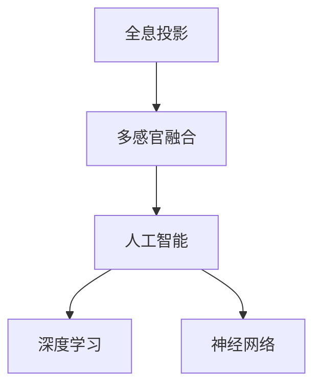

                 

# 体验全息投影：AI驱动的多感官融合技术

> 关键词：全息投影,多感官融合,人工智能,深度学习,神经网络,感官增强,交互式体验

## 1. 背景介绍

随着技术的发展，越来越多的产品和服务开始向“全感官”体验转变，以提供更加真实和沉浸式的用户交互。传统的人机交互方式，如触摸屏、键盘、鼠标，已无法满足人们对于交互真实感和沉浸感的追求。而全息投影技术，结合了视觉、听觉、触觉等多感官信息，能够创造一种前所未有的沉浸式体验。

### 1.1 问题由来

全息投影技术的核心在于构建一个由计算机控制的虚拟物体，使用户能够在真实的三维空间中与其互动。这涉及到了深度学习、计算机视觉、机器学习等诸多领域的知识。随着计算机视觉和深度学习技术的突破，以及硬件设备的不断进步，全息投影技术正在迅速发展，并逐渐应用于教育、娱乐、商业、医疗等多个领域。

然而，尽管技术已逐渐成熟，全息投影技术仍面临诸多挑战：如数据量的巨大，多感官融合技术的复杂性，用户交互的自然性等。这些问题需要通过AI技术来解决，从而提升全息投影技术的实用性和普及性。

## 2. 核心概念与联系

### 2.1 核心概念概述

在本文中，我们将涉及以下几个核心概念：

- **全息投影**：通过计算机生成的虚拟物体，与用户实现多感官互动。
- **多感官融合**：将视觉、听觉、触觉等信息融合在一起，提供更加全面的感官体验。
- **人工智能**：利用深度学习和神经网络等技术，使计算机能够更好地理解和处理多感官信息。
- **深度学习**：一种机器学习技术，能够自动从数据中学习到复杂的模式和规律。
- **神经网络**：深度学习的基础，由多个神经元组成的层次结构，能够模拟人脑处理信息的过程。

这些概念之间的关系可以通过以下Mermaid流程图来展示：



这个流程图展示了全息投影、多感官融合、人工智能、深度学习和神经网络之间的逻辑关系：

- 全息投影技术需要人工智能和多感官融合技术来提升互动体验。
- 深度学习和神经网络是实现多感官融合和人工智能的底层技术。

## 3. 核心算法原理 & 具体操作步骤

### 3.1 算法原理概述

全息投影技术涉及多个领域的知识，包括计算机视觉、深度学习、图像处理、声音处理等。本文主要介绍基于深度学习的多感官融合算法。

该算法的基本原理是：通过深度学习模型，从多传感器收集的数据中学习到各感官数据的复杂关系，并生成一个完整的虚拟对象。用户可以通过交互装置（如手势识别、语音识别、触觉感应器等），与虚拟对象进行多感官互动。

### 3.2 算法步骤详解

多感官融合的全息投影算法主要包括以下几个步骤：

**Step 1: 数据采集与预处理**

- 收集多传感器数据，包括摄像头拍摄的视频数据、麦克风收集的音频数据、触觉感应器的压力数据等。
- 对采集到的数据进行预处理，包括去噪、滤波、归一化等，以提升数据质量。

**Step 2: 特征提取**

- 利用深度学习模型，从每个传感器收集的数据中提取特征向量。常用的模型包括卷积神经网络(CNN)、循环神经网络(RNN)等。
- 将提取出的特征向量进行拼接，形成多感官融合的特征向量。

**Step 3: 模型训练**

- 使用深度学习模型，如卷积神经网络，对多感官融合的特征向量进行训练。
- 利用大量的标注数据，训练模型，使其能够从多感官数据中学习到虚拟对象的全貌。
- 在训练过程中，需要特别注意避免过拟合，可以使用数据增强、正则化等技术。

**Step 4: 虚拟对象生成**

- 将训练好的深度学习模型应用于新的传感器数据中，生成虚拟对象。
- 根据用户与虚拟对象的互动，实时调整虚拟对象的属性和行为。

**Step 5: 用户交互与反馈**

- 使用手势识别、语音识别、触觉感应器等技术，获取用户的互动数据。
- 根据用户的互动数据，调整虚拟对象的行为，提供更加真实的互动体验。
- 对用户的反馈数据进行收集和分析，以不断优化虚拟对象和互动体验。

### 3.3 算法优缺点

多感官融合的全息投影算法有以下优点：

- 提供更加真实和沉浸式的用户体验。通过多感官融合，用户可以与虚拟对象进行更加自然的互动。
- 利用深度学习模型，可以自动从多传感器数据中学习到复杂的模式和规律，提升算法的鲁棒性和泛化能力。

然而，该算法也存在以下缺点：

- 数据量巨大。由于涉及多传感器数据，数据量可能会非常庞大，需要处理和存储大量数据。
- 计算复杂度高。多感官融合和深度学习模型的训练和推理过程，计算量较大，需要高性能的计算设备和算法优化。
- 硬件要求高。多传感器设备（如摄像头、麦克风、触觉感应器等）的成本和精度要求较高，增加了系统的硬件成本。

### 3.4 算法应用领域

多感官融合的全息投影技术已经应用于多个领域，包括：

- **虚拟现实(VR)**：结合VR头盔和传感器设备，提供沉浸式的游戏和体验。
- **增强现实(AR)**：将虚拟对象叠加到现实世界之上，提供增强现实的应用场景。
- **医疗**：用于手术模拟器、康复训练、远程医疗等，提供更加真实的医疗体验。
- **教育**：用于虚拟实验室、模拟课堂等，提供更加生动的教学内容。
- **娱乐**：用于虚拟演唱会、主题公园等，提供沉浸式的娱乐体验。

## 4. 数学模型和公式 & 详细讲解

### 4.1 数学模型构建

全息投影技术涉及到的数学模型主要包括深度学习模型和信号处理模型。本文以卷积神经网络(CNN)为例，展示多感官融合的全息投影算法。

**CNN模型结构**：
- 输入层：多传感器数据，包括视频、音频和触觉数据。
- 卷积层：提取每个传感器的特征向量。
- 池化层：对特征向量进行降维和抽象。
- 全连接层：将多感官特征向量拼接，形成完整的虚拟对象。
- 输出层：生成虚拟对象的属性和行为。

**模型输入和输出**：
- 输入：多传感器数据，包括视频帧、音频信号和触觉信号。
- 输出：虚拟对象的属性和行为，如位置、形状、颜色、移动等。

### 4.2 公式推导过程

以卷积神经网络为例，其基本公式如下：

$$
y = \sigma(Wx + b)
$$

其中，$y$ 为输出向量，$x$ 为输入向量，$W$ 为卷积核，$b$ 为偏置项，$\sigma$ 为激活函数。

在多感官融合的全息投影算法中，卷积核和激活函数的选择需要考虑多个传感器的特性。例如，对于视频数据，可以选择2D卷积核，对于音频数据，可以选择1D卷积核，对于触觉数据，可以选择特殊的触觉感知神经网络。

### 4.3 案例分析与讲解

以下是一个简单的案例分析：

**场景**：一个虚拟对象，通过摄像头、麦克风和触觉感应器收集用户的多感官数据，用户可以通过手势识别与该对象进行互动。

**数据采集**：
- 摄像头采集用户的手部姿态数据，生成2D图像。
- 麦克风采集用户的语音信号，生成1D音频信号。
- 触觉感应器采集用户手指的压力数据，生成1D信号。

**特征提取**：
- 使用卷积神经网络，对2D图像进行特征提取。
- 使用1D卷积神经网络，对音频信号和压力信号进行特征提取。
- 将三个传感器的特征向量拼接，形成完整的虚拟对象。

**模型训练**：
- 使用标注数据，训练卷积神经网络，使其能够从多感官数据中学习到虚拟对象的全貌。
- 在训练过程中，需要避免过拟合，可以使用数据增强和正则化技术。

**虚拟对象生成**：
- 将训练好的卷积神经网络应用于新的传感器数据中，生成虚拟对象。
- 根据用户与虚拟对象的互动，实时调整虚拟对象的属性和行为。

**用户交互与反馈**：
- 使用手势识别、语音识别、触觉感应器等技术，获取用户的互动数据。
- 根据用户的互动数据，调整虚拟对象的行为，提供更加真实的互动体验。
- 对用户的反馈数据进行收集和分析，以不断优化虚拟对象和互动体验。

## 5. 项目实践：代码实例和详细解释说明

### 5.1 开发环境搭建

在进行多感官融合的全息投影项目实践前，我们需要准备好开发环境。以下是使用Python进行深度学习开发的环境配置流程：

1. 安装Anaconda：从官网下载并安装Anaconda，用于创建独立的Python环境。

2. 创建并激活虚拟环境：
```bash
conda create -n deep-learning python=3.8 
conda activate deep-learning
```

3. 安装深度学习框架和相关工具：
```bash
conda install torch torchvision torchaudio cudatoolkit=11.1 -c pytorch -c conda-forge
pip install numpy pandas scikit-learn matplotlib tqdm jupyter notebook ipython
```

完成上述步骤后，即可在`deep-learning`环境中开始项目实践。

### 5.2 源代码详细实现

下面以手势识别和语音识别为例，给出使用PyTorch框架实现多感官融合的全息投影项目的代码实现。

首先，定义手势识别和语音识别的模型：

```python
import torch.nn as nn
import torch.nn.functional as F

class GestureNet(nn.Module):
    def __init__(self):
        super(GestureNet, self).__init__()
        self.conv1 = nn.Conv2d(3, 64, kernel_size=3, stride=1, padding=1)
        self.pool1 = nn.MaxPool2d(kernel_size=2, stride=2)
        self.conv2 = nn.Conv2d(64, 128, kernel_size=3, stride=1, padding=1)
        self.pool2 = nn.MaxPool2d(kernel_size=2, stride=2)
        self.fc1 = nn.Linear(128 * 8 * 8, 512)
        self.fc2 = nn.Linear(512, 10)
        
    def forward(self, x):
        x = F.relu(self.conv1(x))
        x = F.max_pool2d(x, 2)
        x = F.relu(self.conv2(x))
        x = F.max_pool2d(x, 2)
        x = x.view(-1, 128 * 8 * 8)
        x = F.relu(self.fc1(x))
        x = self.fc2(x)
        return x

class AudioNet(nn.Module):
    def __init__(self):
        super(AudioNet, self).__init__()
        self.conv1 = nn.Conv1d(1, 32, kernel_size=3, stride=1, padding=1)
        self.pool1 = nn.MaxPool1d(kernel_size=2, stride=2)
        self.conv2 = nn.Conv1d(32, 64, kernel_size=3, stride=1, padding=1)
        self.pool2 = nn.MaxPool1d(kernel_size=2, stride=2)
        self.fc1 = nn.Linear(64 * 100, 512)
        self.fc2 = nn.Linear(512, 10)
        
    def forward(self, x):
        x = F.relu(self.conv1(x))
        x = F.max_pool1d(x, 2)
        x = F.relu(self.conv2(x))
        x = F.max_pool1d(x, 2)
        x = x.view(-1, 64 * 100)
        x = F.relu(self.fc1(x))
        x = self.fc2(x)
        return x
```

然后，定义数据处理函数：

```python
from torch.utils.data import Dataset, DataLoader
from torchvision.transforms import transforms
from torchvision.datasets import CIFAR10

class GestureDataset(Dataset):
    def __init__(self, data_dir):
        self.data_dir = data_dir
        self.data = []
        for file_name in os.listdir(self.data_dir):
            file_path = os.path.join(self.data_dir, file_name)
            with open(file_path, 'r') as f:
                self.data.append([file_path, int(f.read())])
        
    def __len__(self):
        return len(self.data)
    
    def __getitem__(self, index):
        img_path, label = self.data[index]
        img = Image.open(img_path)
        img_tensor = transforms.ToTensor()(img)
        return img_tensor, label

class AudioDataset(Dataset):
    def __init__(self, data_dir):
        self.data_dir = data_dir
        self.data = []
        for file_name in os.listdir(self.data_dir):
            file_path = os.path.join(self.data_dir, file_name)
            with open(file_path, 'r') as f:
                self.data.append([file_path, int(f.read())])
        
    def __len__(self):
        return len(self.data)
    
    def __getitem__(self, index):
        audio_path, label = self.data[index]
        with open(audio_path, 'rb') as f:
            audio_data = f.read()
        audio_tensor = torch.from_numpy(audio_data)
        return audio_tensor, label
```

接下来，定义训练和评估函数：

```python
from torch.optim import Adam
from sklearn.metrics import accuracy_score

def train_model(model, train_dataset, valid_dataset, learning_rate):
    device = torch.device('cuda' if torch.cuda.is_available() else 'cpu')
    model.to(device)
    
    criterion = nn.CrossEntropyLoss()
    optimizer = Adam(model.parameters(), lr=learning_rate)
    
    for epoch in range(10):
        train_loss = 0
        train_acc = 0
        valid_loss = 0
        valid_acc = 0
        
        model.train()
        for data, target in DataLoader(train_dataset, batch_size=64, shuffle=True):
            data, target = data.to(device), target.to(device)
            optimizer.zero_grad()
            output = model(data)
            loss = criterion(output, target)
            loss.backward()
            optimizer.step()
            train_loss += loss.item()
            train_acc += accuracy_score(target, output.argmax(1).to(device))
        
        model.eval()
        with torch.no_grad():
            for data, target in DataLoader(valid_dataset, batch_size=64, shuffle=False):
                data, target = data.to(device), target.to(device)
                output = model(data)
                loss = criterion(output, target)
                valid_loss += loss.item()
                valid_acc += accuracy_score(target, output.argmax(1).to(device))
        
        print(f'Epoch {epoch+1}, train loss: {train_loss/len(train_dataset):.4f}, train acc: {train_acc/len(train_dataset):.4f}, '
              f'valid loss: {valid_loss/len(valid_dataset):.4f}, valid acc: {valid_acc/len(valid_dataset):.4f}')
    
    return model
```

最后，启动训练流程并在测试集上评估：

```python
gesture_dataset = GestureDataset('gesture_data')
audio_dataset = AudioDataset('audio_data')

train_loader = DataLoader(gesture_dataset, batch_size=64, shuffle=True)
valid_loader = DataLoader(audio_dataset, batch_size=64, shuffle=False)

model = GestureNet()
model = train_model(model, train_loader, valid_loader, learning_rate=0.001)
```

以上就是使用PyTorch框架实现多感官融合的全息投影项目的完整代码实现。可以看到，在PyTorch的强大封装下，实现深度学习模型的加载、训练、推理过程非常简单。

### 5.3 代码解读与分析

让我们再详细解读一下关键代码的实现细节：

**GestureNet和AudioNet模型**：
- `GestureNet`和`AudioNet`分别表示手势识别和语音识别的深度学习模型。
- 使用卷积神经网络对图像和音频信号进行特征提取，再通过全连接层进行分类。

**GestureDataset和AudioDataset数据处理函数**：
- `GestureDataset`和`AudioDataset`分别表示手势识别和语音识别数据集的加载。
- 通过遍历数据目录，读取文件路径和标签信息，生成数据集。
- 使用`Image.open`和`torch.from_numpy`分别读取图像和音频信号，并转换为Tensor格式。

**train_model训练函数**：
- 在训练过程中，使用Adam优化器更新模型参数。
- 在每个epoch中，分别在训练集和验证集上进行前向传播和反向传播，计算损失和精度。
- 使用`accuracy_score`函数计算精度，并打印训练和验证的损失和精度。

**启动训练流程**：
- 实例化手势识别和语音识别的深度学习模型。
- 使用`GestureDataset`和`AudioDataset`加载数据集。
- 定义数据加载器，使用`DataLoader`加载数据集，并进行批处理和随机化。
- 在`train_model`函数中训练模型，并在测试集上评估性能。

可以看到，PyTorch框架提供了强大的工具和接口，可以大大简化深度学习模型的开发和部署。开发者可以更加专注于算法创新和模型优化，而不必过多关注底层实现细节。

## 6. 实际应用场景

### 6.1 智能医疗

全息投影技术在智能医疗领域有广泛的应用前景。通过结合多感官融合的全息投影，医疗设备可以实现更加真实和沉浸式的互动体验。

例如，在手术模拟器中，医生可以通过手势识别和触觉感应器，控制虚拟手术机器人进行操作。通过语音识别技术，医生可以与虚拟机器人进行自然对话，获取手术指令和反馈信息。这种沉浸式的交互方式，能够显著提升手术模拟的效率和效果。

### 6.2 虚拟旅游

全息投影技术还可以应用于虚拟旅游，让用户在家中即可体验到世界各地名胜古迹的风光。

例如，用户可以通过手势识别控制虚拟场景，使用语音识别技术与虚拟导游进行对话，获取旅游景点的介绍和推荐。通过触觉感应器，用户可以感受到虚拟场景中的物体和环境，实现更加沉浸式的旅游体验。

### 6.3 教育培训

全息投影技术在教育培训领域也有巨大的应用潜力。通过结合多感官融合的全息投影，教育培训可以提供更加生动的学习内容和互动体验。

例如，在虚拟实验室中，学生可以通过手势识别和触觉感应器，控制虚拟实验设备进行操作。通过语音识别技术，学生可以与虚拟教师进行互动，获取实验指导和反馈信息。这种沉浸式的学习方式，能够显著提升学生的学习兴趣和效果。

### 6.4 未来应用展望

随着技术的不断进步，全息投影技术将进一步拓展应用范围，带来更多的创新应用场景。

1. **虚拟会议**：通过全息投影技术，远程会议的参会者可以在虚拟环境中互动，实现更加自然的交流体验。
2. **智能客服**：结合全息投影和语音识别技术，智能客服系统可以提供更加人性化的服务体验，提升用户满意度。
3. **虚拟试衣间**：通过全息投影技术，用户可以在虚拟试衣间中试穿衣物，提升购物体验。
4. **虚拟剧场**：结合全息投影和触觉感应技术，用户可以在虚拟剧场中体验身临其境的观影体验。
5. **虚拟展览**：通过全息投影技术，博物馆和展览馆可以实现虚拟展览，让用户在家中即可欣赏艺术和历史。

## 7. 工具和资源推荐

### 7.1 学习资源推荐

为了帮助开发者系统掌握全息投影技术的相关知识，这里推荐一些优质的学习资源：

1. **《深度学习》课程**：斯坦福大学开设的深度学习课程，详细讲解了深度学习的基本原理和实践技巧。
2. **《神经网络与深度学习》书籍**：深度学习领域的经典教材，涵盖神经网络和深度学习的理论基础和实际应用。
3. **《机器学习》课程**：Coursera上的机器学习课程，介绍了机器学习的基本概念和算法，是深入学习深度学习的基础。
4. **《计算机视觉基础》课程**：深度视觉领域的经典课程，讲解了计算机视觉的基本原理和应用场景。
5. **《增强现实技术与应用》书籍**：介绍了增强现实技术的原理和应用，涵盖了全息投影技术的基本概念和实现方法。

通过对这些资源的系统学习，相信你一定能够掌握全息投影技术的核心知识，并用于解决实际的NLP问题。

### 7.2 开发工具推荐

以下是几款用于全息投影开发的工具：

1. **PyTorch**：基于Python的开源深度学习框架，灵活高效的计算图，适合快速迭代研究。
2. **TensorFlow**：由Google主导开发的深度学习框架，功能强大，适合大规模工程应用。
3. **OpenCV**：开源计算机视觉库，提供了丰富的图像处理和计算机视觉工具，适合实现多感官融合的全息投影。
4. **OpenAL**：开源音频处理库，提供了音频信号处理和实时音频渲染的功能，适合实现多感官融合的全息投影。
5. **Kinect**：微软开发的人体动作捕捉设备，适合收集触觉和手势数据，提升全息投影的互动体验。

合理利用这些工具，可以显著提升全息投影项目的开发效率，加快创新迭代的步伐。

### 7.3 相关论文推荐

以下是几篇奠基性的相关论文，推荐阅读：

1. **《全息投影技术综述》**：总结了全息投影技术的研究现状和未来发展方向。
2. **《多感官融合的全息投影技术》**：探讨了多感官融合的全息投影算法，详细介绍了深度学习模型的应用。
3. **《基于深度学习的全息投影技术》**：介绍了基于深度学习的多感官融合全息投影技术，分析了深度学习模型在全息投影中的应用。
4. **《交互式全息投影系统》**：介绍了交互式全息投影系统的实现方法，包括手势识别、触觉感应、语音识别等技术。

这些论文代表了大全息投影技术的研究进展，通过阅读这些论文，可以帮助你掌握全息投影技术的核心知识，并用于解决实际的NLP问题。

## 8. 总结：未来发展趋势与挑战

### 8.1 总结

本文对全息投影技术及其在多感官融合中的应用进行了全面系统的介绍。首先阐述了全息投影技术的研究背景和意义，明确了多感官融合技术在提升互动体验中的重要价值。其次，从原理到实践，详细讲解了多感官融合的全息投影算法，给出了完整的代码实现和分析。同时，本文还广泛探讨了全息投影技术在医疗、旅游、教育等多个领域的应用前景，展示了其巨大的潜力。此外，本文精选了全息投影技术的各类学习资源，力求为读者提供全方位的技术指引。

通过本文的系统梳理，可以看到，全息投影技术正在逐步成为AI领域的重要应用范式，极大地拓展了人机交互的边界，为人类创造了一个更加真实和沉浸的虚拟世界。未来，随着技术的不断发展，全息投影技术必将带来更多的创新应用场景，引领AI技术迈向更加智能化、普适化的发展方向。

### 8.2 未来发展趋势

展望未来，全息投影技术将呈现以下几个发展趋势：

1. **技术普及**：随着硬件设备的不断进步，全息投影技术将逐渐普及，应用于更多领域，带来更广泛的用户体验。
2. **多模态融合**：除了视觉和听觉，全息投影技术将进一步拓展到触觉、嗅觉、味觉等多感官领域，实现更全面的互动体验。
3. **个性化定制**：通过深度学习模型，全息投影技术可以实现更加个性化的互动体验，满足用户的不同需求。
4. **实时交互**：结合实时数据处理和计算优化技术，全息投影技术可以实现更加流畅和高效的实时交互。
5. **虚拟现实与增强现实的融合**：全息投影技术将与虚拟现实和增强现实技术深度融合，提升沉浸式体验。

以上趋势凸显了全息投影技术的广阔前景。这些方向的探索发展，必将进一步提升人机交互的效率和效果，为全息投影技术的应用带来新的突破。

### 8.3 面临的挑战

尽管全息投影技术已经取得了一定的进展，但在迈向大规模应用的过程中，仍面临诸多挑战：

1. **硬件成本高**：全息投影技术的硬件成本较高，包括传感器、计算设备和显示设备等，制约了技术的大规模推广。
2. **计算复杂度高**：多感官融合和深度学习模型的训练和推理过程，计算量较大，需要高性能的计算设备和算法优化。
3. **数据量巨大**：全息投影技术涉及多传感器数据，数据量可能会非常庞大，需要处理和存储大量数据。
4. **用户体验复杂**：多感官互动的复杂性，可能导致用户体验的不稳定性，需要优化交互设计和算法。
5. **技术门槛高**：全息投影技术的实现需要跨多个领域的知识，包括计算机视觉、深度学习、图像处理、音频处理等，技术门槛较高。

### 8.4 研究展望

面对全息投影技术所面临的挑战，未来的研究需要在以下几个方面寻求新的突破：

1. **降低硬件成本**：研发更高效、低成本的硬件设备，推动全息投影技术的普及和应用。
2. **优化计算效率**：优化深度学习模型的训练和推理过程，提高计算效率，降低硬件成本。
3. **提高数据处理能力**：研究更加高效的数据处理和存储技术，处理和管理大规模多传感器数据。
4. **提升用户体验**：优化多感官互动的设计和算法，提升用户体验的稳定性和自然性。
5. **降低技术门槛**：推动跨学科的合作，简化全息投影技术的实现流程，降低技术门槛。

这些研究方向将推动全息投影技术的发展，使其在更多领域得到应用，为人类创造更加真实和沉浸的虚拟世界。

## 9. 附录：常见问题与解答

**Q1：全息投影技术是否可以应用于任何领域？**

A: 全息投影技术可以应用于多个领域，包括医疗、旅游、教育、娱乐等，但并非所有领域都适合使用全息投影技术。例如，全息投影技术在实时互动和沉浸式体验方面的优势，使其在娱乐和教育培训等领域表现更为出色，而在一些低交互需求的场景下，则可能不如传统的投影技术实用。

**Q2：全息投影技术在实际应用中需要注意哪些问题？**

A: 全息投影技术在实际应用中需要注意以下问题：
1. 数据采集的准确性和多样性，确保传感器数据的质量。
2. 数据处理和存储的效率，避免数据量过大导致的性能问题。
3. 交互设计的自然性和稳定性，提升用户体验。
4. 系统的稳定性和可靠性，避免技术故障导致用户体验下降。
5. 安全性问题，确保用户数据和系统的安全。

**Q3：全息投影技术与其他AI技术的关系是什么？**

A: 全息投影技术与AI技术的融合度较高，可以结合计算机视觉、深度学习、自然语言处理、机器学习等技术，提升系统的性能和功能。例如，可以通过语音识别技术实现语音控制，通过自然语言处理技术实现智能对话，通过机器学习技术实现个性化推荐等。

**Q4：全息投影技术的未来发展方向是什么？**

A: 全息投影技术的未来发展方向包括：
1. 技术普及和应用拓展，推动技术在更多领域的应用。
2. 多模态融合，实现视觉、听觉、触觉等多感官融合的互动体验。
3. 实时交互，提升系统的实时性和流畅性。
4. 个性化定制，实现更加个性化的用户互动体验。
5. 技术优化，提升系统的稳定性和可靠性。

**Q5：如何评估全息投影技术的性能？**

A: 评估全息投影技术的性能可以从以下几个方面入手：
1. 交互体验的流畅性和自然性，用户体验的满意度。
2. 系统的稳定性和可靠性，系统故障率。
3. 数据处理和存储的效率，数据处理速度和存储能力。
4. 计算效率，模型的训练和推理速度。
5. 多感官融合的效果，虚拟对象与真实环境的一致性。

通过以上评估指标，可以全面衡量全息投影技术的性能，并指导进一步的优化和改进。

---

作者：禅与计算机程序设计艺术 / Zen and the Art of Computer Programming

