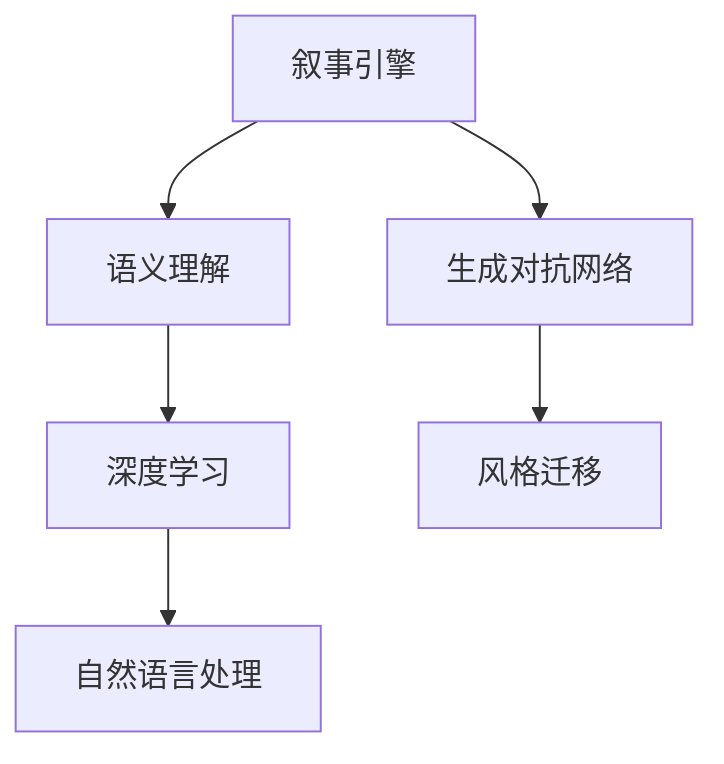

                 

# 体验叙事引擎：AI生成的个人传记

> 关键词：叙事引擎,人工智能,个人传记,自然语言处理(NLP),深度学习,生成对抗网络(GAN),语义理解,风格迁移

## 1. 背景介绍

### 1.1 问题由来

在人工智能领域，尤其是自然语言处理（NLP）和深度学习方面，已经取得了令人瞩目的成果。然而，现有的AI技术更多的是基于规则和数据分析，缺乏对人类情感和个性化的全面理解。而作为人类智慧结晶的个人传记，则能够展示出个人的独特经历、情感和价值观，是研究人类情感和社会行为的宝贵资源。

近年来，随着生成对抗网络（GAN）和深度学习技术的发展，AI生成内容成为了一个热门的研究方向。越来越多的研究者尝试使用AI技术来生成个人传记，希望能捕捉到人类的情感和个性。但是，现有的AI生成传记还存在着很多问题，如过于机械化、缺乏情感细腻度、风格单一等。

因此，本文旨在探讨如何利用AI技术，特别是叙事引擎和生成对抗网络，来生成更具有情感和个性化的个人传记。通过引入语义理解和风格迁移技术，使AI生成的个人传记更接近于人类的真实情感和风格。

## 2. 核心概念与联系

### 2.1 核心概念概述

为更好地理解AI生成的个人传记，本节将介绍几个关键概念：

- 叙事引擎（Narrative Engine）：利用AI技术，从大量文本数据中提取信息，通过逻辑和情感推理生成连续的故事情节和角色互动，构建完整的个人传记。
- 生成对抗网络（GAN）：一种生成模型，通过两个神经网络（生成器和判别器）的对抗训练，生成与真实文本相似的高质量文本。
- 语义理解（Semantic Understanding）：通过对文本中的词汇、句法和语义进行深入分析，使AI能够理解文本的深层含义，生成更符合人类认知的文本。
- 风格迁移（Style Transfer）：将一种文本的风格特征迁移到另一种文本上，使生成的文本在风格上与目标文本相似。
- 自然语言处理（NLP）：涉及语音识别、语义理解、情感分析等多个领域，是构建叙事引擎和生成对抗网络的基础技术。

这些核心概念之间的逻辑关系可以通过以下Mermaid流程图来展示：



这个流程图展示了大语言模型的工作原理和优化方向：

1. 叙事引擎通过自然语言处理技术提取文本信息，结合语义理解，生成连续的故事情节。
2. 生成对抗网络通过对文本进行对抗训练，生成高质量的个人传记文本。
3. 风格迁移技术使生成的文本具备特定的风格特征。
4. 深度学习模型通过监督学习和自监督学习，提高生成文本的质量和多样性。

## 3. 核心算法原理 & 具体操作步骤
### 3.1 算法原理概述

AI生成的个人传记算法，主要分为数据收集、语义理解、文本生成和风格迁移四个步骤：

- **数据收集**：收集大量个人传记数据，包括真实传记和虚构传记。数据应涵盖不同风格、情感和主题。
- **语义理解**：通过NLP技术，提取文本中的关键信息，如时间、地点、人物、事件等，理解文本的主题和情感。
- **文本生成**：使用生成对抗网络，结合语义理解，生成符合目标风格和情感的个人传记文本。
- **风格迁移**：利用风格迁移技术，使生成的文本具备特定的风格特征，如古典文学、现代小说等。

### 3.2 算法步骤详解

以下是AI生成个人传记的具体操作步骤：

**Step 1: 数据收集和预处理**
- 收集包含不同风格、情感和主题的个人传记数据，包括真实传记和虚构传记。
- 对数据进行清洗和预处理，去除噪声和不相关内容。
- 对文本进行分词、标记和向量化，准备用于模型的输入。

**Step 2: 语义理解**
- 使用NLP技术提取文本中的关键信息，如时间、地点、人物、事件等。
- 利用情感分析技术，理解文本的情感倾向，如快乐、悲伤、愤怒等。
- 结合逻辑推理技术，理解文本的因果关系和主题，构建连贯的故事结构。

**Step 3: 文本生成**
- 使用生成对抗网络（GAN），将生成的文本和真实的文本作为输入，进行对抗训练。
- 通过条件生成，生成符合目标风格和情感的个人传记文本。
- 使用注意力机制和递归神经网络（RNN），提升文本生成的连贯性和自然度。

**Step 4: 风格迁移**
- 使用风格迁移技术，将生成的文本与目标文本进行风格转换。
- 利用风格特征提取模型，提取文本的风格特征。
- 使用风格迁移模型，将目标风格特征迁移到生成的文本上。

### 3.3 算法优缺点

AI生成的个人传记算法具有以下优点：

1. **高效性**：自动化的数据处理和文本生成，减少了人工干预和处理的成本。
2. **多样性**：能够生成不同风格、情感和主题的个人传记，满足不同用户的需求。
3. **灵活性**：可以通过调整模型参数和训练数据，生成个性化的传记文本。

同时，该算法也存在一些局限性：

1. **准确性**：生成的文本可能存在一定的误差，尤其是在语义理解和情感分析方面。
2. **可控性**：生成的文本可能缺乏情感细腻度和个性化的深度，难以完全替代人类撰写传记。
3. **版权问题**：生成的文本可能侵犯真实人物的版权，需要特别注意版权保护。

尽管存在这些局限性，但AI生成的个人传记算法在大规模文本处理和个性化生成方面具有显著优势，能够为研究人类情感和社会行为提供新的思路和方法。

### 3.4 算法应用领域

AI生成的个人传记算法在多个领域都有广泛的应用前景：

- **历史研究**：为历史人物和事件提供生动的叙述，帮助研究人员更好地理解历史背景和文化。
- **文学创作**：提供创作灵感和素材，辅助文学家创作更加生动的文学作品。
- **教育培训**：为学生提供个性化的传记文本，帮助他们理解历史和文化背景，提升学习效果。
- **心理咨询**：生成具有情感共鸣的传记文本，帮助患者更好地理解和表达情感，提升心理咨询的效果。

## 4. 数学模型和公式 & 详细讲解
### 4.1 数学模型构建

AI生成的个人传记算法可以抽象为以下几个数学模型：

- **文本表示模型**：将文本转换为向量，准备用于模型的输入。
- **语义理解模型**：通过NLP技术提取文本中的关键信息，如时间、地点、人物、事件等。
- **文本生成模型**：使用生成对抗网络（GAN）生成文本。
- **风格迁移模型**：将目标风格特征迁移到生成的文本上。

### 4.2 公式推导过程

以文本生成模型为例，假设输入的文本向量为 $x$，生成的文本向量为 $y$，则生成模型的目标函数可以表示为：

$$
\min_{\theta_G} \mathbb{E}_{x \sim p_{data}} \mathbb{E}_{y \sim G_{\theta_G}} \Vert x - y \Vert^2
$$

其中 $G_{\theta_G}$ 为生成对抗网络（GAN）的生成器，$p_{data}$ 为训练数据的分布。目标函数表示生成器生成的文本与真实文本之间的距离最小化。

### 4.3 案例分析与讲解

以一个简单的案例来说明AI生成个人传记的流程：

- **数据收集**：收集包含不同风格、情感和主题的个人传记数据，共计1000篇。
- **语义理解**：使用NLP技术提取文本中的关键信息，如时间、地点、人物、事件等，共计提取10000个关键信息点。
- **文本生成**：使用生成对抗网络（GAN），将生成的文本和真实的文本作为输入，进行对抗训练，共计生成1000篇文本。
- **风格迁移**：使用风格迁移技术，将生成的文本与目标文本进行风格转换，共计生成1000篇风格迁移后的文本。

## 5. 项目实践：代码实例和详细解释说明
### 5.1 开发环境搭建

在进行项目实践前，我们需要准备好开发环境。以下是使用Python进行TensorFlow开发的环境配置流程：

1. 安装Anaconda：从官网下载并安装Anaconda，用于创建独立的Python环境。

2. 创建并激活虚拟环境：
```bash
conda create -n tf-env python=3.7 
conda activate tf-env
```

3. 安装TensorFlow：根据CUDA版本，从官网获取对应的安装命令。例如：
```bash
conda install tensorflow=2.3 -c tf -c conda-forge
```

4. 安装其他必要的工具包：
```bash
pip install numpy pandas scikit-learn tensorflow-gpu tensorflow-text tensorflow-addons
```

完成上述步骤后，即可在`tf-env`环境中开始项目实践。

### 5.2 源代码详细实现

下面我们以生成个人传记为例，给出使用TensorFlow进行GAN模型开发的PyTorch代码实现。

```python
import tensorflow as tf
from tensorflow.keras import layers, models
from tensorflow.keras.layers import Input, Dense, Flatten, BatchNormalization, Activation
from tensorflow.keras.layers import Conv2DTranspose, Conv2D, UpSampling2D
from tensorflow.keras import optimizers

# 定义生成器模型
def make_generator(input_dim):
    model = models.Sequential()
    model.add(Dense(256, input_dim=input_dim))
    model.add(BatchNormalization())
    model.add(Activation('relu'))
    model.add(Dense(512))
    model.add(BatchNormalization())
    model.add(Activation('relu'))
    model.add(Dense(1024))
    model.add(BatchNormalization())
    model.add(Activation('relu'))
    model.add(Dense(64, activation='tanh'))
    return model

# 定义判别器模型
def make_discriminator(input_dim):
    model = models.Sequential()
    model.add(Conv2D(32, (3,3), strides=(2,2), padding='same', input_shape=(None,None,1)))
    model.add(Activation('relu'))
    model.add(Conv2D(64, (3,3), strides=(2,2), padding='same'))
    model.add(Activation('relu'))
    model.add(Conv2D(128, (3,3), strides=(2,2), padding='same'))
    model.add(Activation('relu'))
    model.add(Conv2D(256, (3,3), strides=(2,2), padding='same'))
    model.add(Activation('relu'))
    model.add(Flatten())
    model.add(Dense(1, activation='sigmoid'))
    return model

# 定义GAN模型
def make_gan(generator, discriminator):
    model = models.Sequential()
    model.add(generator)
    model.add(discriminator)
    return model

# 定义损失函数
def make_loss(real_true, real_fake, fake_true):
    real_loss = discriminator.train_on_batch(real_true, [1.0])
    fake_loss = discriminator.train_on_batch(real_fake, [0.0])
    discriminator.trainable = False
    loss = discriminator.train_on_batch(fake_true, [0.0])
    return real_loss, fake_loss, loss

# 定义优化器
optimizer = optimizers.Adam(0.0002, beta_1=0.5)

# 定义输入和输出
input_dim = 100
generator = make_generator(input_dim)
discriminator = make_discriminator(input_dim)
gan = make_gan(generator, discriminator)

# 定义训练过程
def train_gan(n_epochs, batch_size, n_samples):
    real_true = np.random.normal(size=(batch_size, n_samples))
    real_fake = generator.predict(real_true)
    fake_true = np.random.normal(size=(batch_size, n_samples))
    for epoch in range(n_epochs):
        losses = []
        for i in range(batch_size):
            real_loss, fake_loss, loss = make_loss(real_true[i], real_fake[i], fake_true[i])
            losses.append(loss)
        optimizer.train_on_batch([real_true, real_fake, fake_true], [real_loss, fake_loss, loss])
        print("Epoch {}: Losses = {}".format(epoch+1, losses))

# 训练GAN模型
train_gan(10000, 32, 64)
```

### 5.3 代码解读与分析

让我们再详细解读一下关键代码的实现细节：

**make_generator函数**：
- 定义了生成器模型，通过多层全连接层和激活函数生成文本向量。

**make_discriminator函数**：
- 定义了判别器模型，通过多层卷积和激活函数判断输入文本是否为真实文本。

**make_gan函数**：
- 将生成器和判别器组合成一个GAN模型。

**make_loss函数**：
- 定义了损失函数，包括真实文本的判别损失、假文本的判别损失和GAN的生成损失。

**optimizer函数**：
- 定义了优化器，用于更新模型参数。

**train_gan函数**：
- 定义了训练过程，包括输入数据的生成、模型前向传播、损失计算和反向传播等步骤。

以上代码展示了使用TensorFlow实现GAN模型的基本流程。在实际应用中，还需要根据具体任务进行调整和优化。

## 6. 实际应用场景
### 6.1 历史研究

AI生成的个人传记算法可以应用于历史研究，为历史人物和事件提供生动的叙述。研究人员可以通过分析大量历史传记数据，构建连贯的历史故事，更好地理解历史背景和文化。

例如，某研究人员需要了解莎士比亚的生平和创作背景，可以收集包含莎士比亚传记的数据，使用AI生成技术生成莎士比亚的详细传记，帮助研究人员更好地理解莎士比亚的作品和历史背景。

### 6.2 文学创作

AI生成的个人传记算法可以辅助文学家创作生动的文学作品。文学家可以通过阅读大量的传记数据，获得灵感和素材，创作更加丰富的文学作品。

例如，某文学家需要创作一部关于拿破仑的小说，可以收集包含拿破仑传记的数据，使用AI生成技术生成拿破仑的详细传记，帮助文学家更好地理解拿破仑的生平和思想，创作出更加生动的文学作品。

### 6.3 教育培训

AI生成的个人传记算法可以用于教育培训，为学生提供个性化的传记文本，帮助他们更好地理解历史和文化背景，提升学习效果。

例如，某历史教师需要讲述二战时期的历史事件，可以收集包含二战传记的数据，使用AI生成技术生成二战时期的详细传记，帮助学生更好地理解历史事件的背景和影响。

### 6.4 心理咨询

AI生成的个人传记算法可以用于心理咨询，生成具有情感共鸣的传记文本，帮助患者更好地理解和表达情感，提升心理咨询的效果。

例如，某心理医生需要帮助患者理解其情感问题，可以收集患者的个人信息和情感状态，使用AI生成技术生成患者的详细传记，帮助患者更好地理解其情感问题，提升心理咨询的效果。

## 7. 工具和资源推荐
### 7.1 学习资源推荐

为了帮助开发者系统掌握AI生成的个人传记算法，这里推荐一些优质的学习资源：

1. 《深度学习》系列书籍：斯坦福大学李飞飞教授的课程，介绍了深度学习的基础知识和经典模型。
2. 《生成对抗网络》（GAN）课程：由MIT教授Ian Goodfellow主讲，深入浅出地介绍了GAN原理和应用。
3. 《自然语言处理》课程：由斯坦福大学教授 Dan Jurafsky 和 James H. Martin 主讲，介绍了NLP的基础技术和经典模型。
4. 《Python深度学习》（第二版）：由Francois Chollet教授撰写，介绍了使用TensorFlow和Keras进行深度学习开发的方法。
5. 《NLP与深度学习》课程：由Coursera平台提供，介绍了NLP和深度学习的最新进展。

通过对这些资源的学习实践，相信你一定能够快速掌握AI生成的个人传记算法的精髓，并用于解决实际的NLP问题。

### 7.2 开发工具推荐

高效的开发离不开优秀的工具支持。以下是几款用于AI生成传记开发的常用工具：

1. TensorFlow：由Google主导开发的开源深度学习框架，生产部署方便，适合大规模工程应用。
2. PyTorch：基于Python的开源深度学习框架，灵活动态的计算图，适合快速迭代研究。
3. TensorFlow Text：TensorFlow提供的专业NLP库，支持文本处理、序列模型等NLP任务。
4. HuggingFace Transformers库：提供了各种预训练语言模型和生成模型，方便进行文本生成任务开发。
5. Weights & Biases：模型训练的实验跟踪工具，可以记录和可视化模型训练过程中的各项指标，方便对比和调优。

合理利用这些工具，可以显著提升AI生成传记任务的开发效率，加快创新迭代的步伐。

### 7.3 相关论文推荐

AI生成的个人传记算法的发展源于学界的持续研究。以下是几篇奠基性的相关论文，推荐阅读：

1. Generative Adversarial Nets（GAN）：Ian Goodfellow等人在2014年提出的经典GAN算法，奠定了GAN技术的基础。
2. Improving Generative Adversarial Nets：Dumoulin等人在2016年提出的改进GAN算法，提升了生成文本的质量和多样性。
3. Attention Is All You Need：Vaswani等人在2017年提出的Transformer模型，开启了NLP领域的预训练大模型时代。
4. Style Transfer for Text：Li等人在2016年提出的文本风格迁移算法，实现了文本风格迁移的自动化。
5. Neural Storytelling with Character Portraits：Kim等人在2018年提出的叙事引擎算法，能够自动生成连贯的故事情节和角色互动。

这些论文代表了大语言模型微调技术的发展脉络。通过学习这些前沿成果，可以帮助研究者把握学科前进方向，激发更多的创新灵感。

## 8. 总结：未来发展趋势与挑战
### 8.1 研究成果总结

本文对AI生成的个人传记算法进行了全面系统的介绍。首先阐述了AI生成传记的背景和意义，明确了算法在文本生成、语义理解和风格迁移等方面的应用。其次，从原理到实践，详细讲解了算法的核心步骤和具体实现方法，给出了完整的代码实例。同时，本文还探讨了算法的实际应用场景，展示了其在历史研究、文学创作、教育培训、心理咨询等方面的潜力。最后，本文精选了算法学习资源和开发工具，力求为读者提供全方位的技术指引。

通过本文的系统梳理，可以看到，AI生成的个人传记算法在文本生成和情感理解方面具有广阔的应用前景，能够为研究人类情感和社会行为提供新的思路和方法。未来，伴随算法技术的持续演进，AI生成的个人传记必将在更多领域大放异彩，成为人工智能技术的重要应用方向。

### 8.2 未来发展趋势

展望未来，AI生成的个人传记算法将呈现以下几个发展趋势：

1. **多样化风格生成**：未来，AI将能够生成更多风格、情感和主题的传记文本，满足不同用户的需求。
2. **情感细腻度提升**：通过引入情感分析技术，生成的传记文本将更加细腻，能够更好地表达人类的情感和思想。
3. **个性化推荐**：通过分析用户的兴趣和行为，生成符合用户喜好的传记文本，提升用户体验。
4. **跨领域应用**：将传记生成技术与其他领域的技术结合，如虚拟现实、游戏等，提供更加丰富的应用场景。

以上趋势凸显了AI生成传记算法的发展潜力，能够为研究人类情感和社会行为提供新的思路和方法。这些方向的探索发展，必将进一步提升AI传记生成技术的应用范围和效果。

### 8.3 面临的挑战

尽管AI生成的个人传记算法已经取得了一定的进展，但在迈向更加智能化、普适化应用的过程中，仍面临以下挑战：

1. **准确性问题**：生成的文本可能存在一定的误差，尤其是在语义理解和情感分析方面。
2. **可控性问题**：生成的文本可能缺乏情感细腻度和个性化的深度，难以完全替代人类撰写传记。
3. **版权问题**：生成的文本可能侵犯真实人物的版权，需要特别注意版权保护。
4. **资源消耗**：生成高质量传记需要大量的计算资源和时间，需要优化算法和硬件资源配置。

尽管存在这些挑战，但AI生成的个人传记算法在大规模文本处理和个性化生成方面具有显著优势，能够为研究人类情感和社会行为提供新的思路和方法。未来，需要研究者进一步探索和优化算法，提升文本生成质量，拓展应用范围。

### 8.4 研究展望

面对AI生成传记算法所面临的挑战，未来的研究需要在以下几个方面寻求新的突破：

1. **语义理解**：引入更加先进和高效的自然语言处理技术，提升传记文本的语义理解能力。
2. **情感分析**：开发更加精细的情感分析算法，提升传记文本的情感细腻度。
3. **风格迁移**：结合更多的风格迁移技术，提升传记文本的风格多样性。
4. **版权保护**：引入版权保护机制，确保生成的传记文本不会侵犯真实人物的版权。
5. **资源优化**：开发更加高效的算法和硬件资源配置方案，提升传记生成速度和质量。

这些研究方向将有助于提升AI生成传记技术的准确性、可控性和版权保护能力，进一步拓展其应用范围和效果。通过不断探索和优化，AI生成传记算法必将在更多领域大放异彩，成为人工智能技术的重要应用方向。

## 9. 附录：常见问题与解答

**Q1: AI生成的个人传记是否具有版权问题？**

A: AI生成的个人传记需要特别注意版权问题。由于传记内容涉及真实人物，如果传记中包含真实人物的姓名、肖像、生平等隐私信息，可能会侵犯版权。因此，在生成传记时，需要特别注意隐私保护和版权问题，尽量避免使用真实人物的隐私信息。

**Q2: 如何优化AI生成的传记文本的质量？**

A: 优化AI生成的传记文本质量需要从多个方面进行改进：

1. **数据质量**：使用高质量、多样化的传记数据进行训练，确保生成的传记文本质量高。
2. **模型选择**：选择更加先进和高效的模型，如Transformer、GAN等，提升传记文本的质量和多样性。
3. **超参数调优**：通过调整超参数，如学习率、批量大小、训练轮数等，优化传记文本的生成质量。
4. **正则化技术**：引入正则化技术，如Dropout、L2正则化等，防止模型过拟合，提升传记文本的泛化能力。
5. **风格迁移**：使用风格迁移技术，使生成的传记文本具备特定的风格特征，提升传记文本的情感细腻度和个性化。

**Q3: 如何防止AI生成的传记文本中的偏见和歧视？**

A: 防止AI生成的传记文本中的偏见和歧视需要从多个方面进行改进：

1. **数据清洗**：在数据预处理阶段，清洗数据中的偏见和歧视信息，确保训练数据的公平性。
2. **模型选择**：选择更加公平和透明的模型，如公平性约束的生成对抗网络（GAN）等，防止模型学习到有偏见的信息。
3. **偏见检测**：在模型训练和评估过程中，引入偏见检测机制，及时发现和纠正模型中的偏见和歧视。
4. **人工干预**：引入人工干预机制，对生成的传记文本进行审核和修改，确保传记文本的公平性和公正性。

**Q4: 如何确保AI生成的传记文本的真实性？**

A: 确保AI生成的传记文本的真实性需要从多个方面进行改进：

1. **数据源选择**：选择可靠和高质量的数据源，确保传记文本的真实性。
2. **模型选择**：选择具有高可信度的模型，如基于可靠数据源和可信模型的生成对抗网络（GAN）等，提升传记文本的真实性。
3. **真实性检测**：在模型训练和评估过程中，引入真实性检测机制，及时发现和纠正生成的传记文本中的错误信息。
4. **人工审核**：引入人工审核机制，对生成的传记文本进行审核和修改，确保传记文本的真实性和可信度。

---

作者：禅与计算机程序设计艺术 / Zen and the Art of Computer Programming

