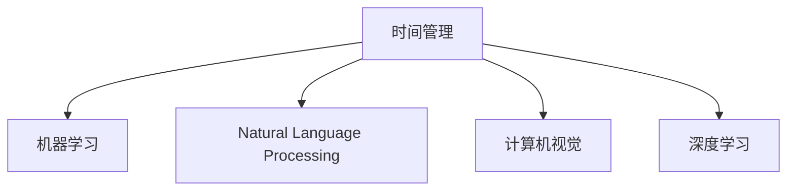

                 

# 体验时间弯曲器：AI创造的主观时间调节

## 1. 背景介绍

### 1.1 问题由来

在信息化高度发达的现代社会，信息爆炸所带来的高效获取、处理和分析需求愈发凸显。然而，人们在处理海量数据时，常常陷入时间紧迫和效率低下的困境。时间成为了制约人们探索和创造的瓶颈。

随着人工智能(AI)技术的进步，时间弯曲器——一种基于AI的时间管理工具应运而生。它通过利用机器学习、自然语言处理、计算机视觉等前沿技术，帮助用户有效管理时间，提升工作效率，实现从繁重时间管理中解放出来的梦想。

### 1.2 问题核心关键点

时间弯曲器的核心思想是通过AI技术优化时间管理策略，利用机器学习算法预测任务优先级，结合自然语言处理和计算机视觉技术，智能推荐任务完成时间和方式，从而极大提升个人或团队的工作效率，缓解时间紧迫带来的压力。

实现时间弯曲器的关键点包括：
- **数据收集与预处理**：收集用户的工作习惯、任务性质、时间分布等数据，进行数据清洗和预处理。
- **任务优先级评估**：基于机器学习算法，评估任务紧急程度和重要度，构建优先级矩阵。
- **时间调度优化**：应用动态规划等算法，优化任务调度方案，生成最佳时间表。
- **视觉任务提醒**：结合计算机视觉技术，以可视化方式提醒用户任务完成时间，增强用户体验。

### 1.3 问题研究意义

时间弯曲器不仅旨在提升个人或团队的工作效率，还具备以下几个重要的研究意义：

1. **降低时间管理成本**：通过自动化时间管理，减少手工管理时间的工作量和误差。
2. **提升工作质量**：优化任务优先级和时间安排，帮助用户专注于重要任务，提高工作成果质量。
3. **促进时间管理科学化**：引入AI算法和数据驱动决策，提高时间管理的科学性和精确性。
4. **推动跨领域应用**：时间弯曲器可以广泛应用于企业项目管理、个人日程安排、教育培训等领域，加速各行各业数字化转型。
5. **催生新的时间管理理念**：时间弯曲器基于数据驱动的决策，将为传统时间管理理念带来新的突破和创新。

## 2. 核心概念与联系

### 2.1 核心概念概述

为更好地理解时间弯曲器的核心机制，本节将介绍几个关键概念：

- **时间管理**：指通过合理规划和管理时间，提高工作和生活效率的方法和实践。时间管理关注任务分配、时间分配、任务优先级、时间监控和调整等方面。
- **机器学习**：通过算法从数据中学习规律和模式，以实现预测、分类、聚类、推荐等任务。时间弯曲器应用机器学习算法，对任务优先级和时间安排进行优化。
- **自然语言处理(NLP)**：研究计算机如何理解和生成自然语言，时间弯曲器应用NLP技术，实现任务提醒、任务描述解析等功能。
- **计算机视觉**：研究计算机如何模拟人类视觉系统进行图像识别和处理，时间弯曲器应用计算机视觉技术，生成直观的任务时间表和提醒界面。
- **深度学习**：一种基于神经网络的机器学习技术，时间弯曲器利用深度学习算法，优化任务优先级和时间调度。

这些核心概念之间的逻辑关系可以通过以下Mermaid流程图来展示：



这个流程图展示了时间弯曲器的主要组成元素及其之间的关系：

1. 时间管理是核心目标，通过机器学习、NLP和计算机视觉技术实现。
2. 机器学习用于预测任务优先级，优化时间安排。
3. NLP用于处理任务描述，实现任务提醒和解析。
4. 计算机视觉用于生成直观的任务时间表和提醒界面。
5. 深度学习作为机器学习的重要组成部分，用于优化模型参数和任务调度。

## 3. 核心算法原理 & 具体操作步骤
### 3.1 算法原理概述

时间弯曲器利用AI技术对用户的时间管理进行智能优化，核心算法原理包括以下几个部分：

- **任务优先级预测**：通过收集用户历史任务数据和行为数据，应用机器学习算法，预测当前任务的重要度和紧急程度。
- **任务时间优化**：应用动态规划、贪心算法等方法，生成最优的任务时间表，确保任务按时完成。
- **任务提醒与可视化**：结合计算机视觉技术，生成直观的任务时间表和提醒界面，增强用户体验。

### 3.2 算法步骤详解

时间弯曲器的实现过程主要分为以下几个关键步骤：

**Step 1: 数据收集与预处理**

- **用户行为数据收集**：收集用户的历史任务数据、工作习惯、时间分配等信息。
- **任务数据预处理**：清洗数据，处理缺失值和异常值，转换数据格式，标准化数据。

**Step 2: 任务优先级评估**

- **特征提取**：从用户行为数据中提取关键特征，如任务完成时间、任务重要性、任务紧急度等。
- **模型训练**：使用机器学习算法（如随机森林、梯度提升树、深度学习模型等）对任务优先级进行预测，构建优先级矩阵。

**Step 3: 时间调度优化**

- **任务时间表生成**：应用动态规划或贪心算法，生成最优的任务时间表，确保关键任务按时完成。
- **时间表可视化**：结合计算机视觉技术，将时间表转换为直观的界面，显示给用户。

**Step 4: 任务提醒与执行**

- **任务提醒生成**：根据时间表和优先级，生成任务提醒信息。
- **任务执行跟踪**：记录任务执行情况，实时更新时间表，确保任务按时完成。

### 3.3 算法优缺点

时间弯曲器作为AI驱动的时间管理工具，具有以下优点：

- **高效性**：通过数据驱动的决策，大幅提升时间管理效率，减少人工干预。
- **智能性**：利用机器学习和深度学习算法，精确预测任务优先级和时间安排。
- **直观性**：结合计算机视觉技术，以可视化方式呈现任务时间表，易于理解和执行。
- **自适应性**：能够根据用户行为和偏好，动态调整时间安排，适应不同场景和时间管理需求。

同时，时间弯曲器也存在一些局限性：

- **数据依赖**：模型的预测效果依赖于数据的质量和数量，数据收集和预处理成本较高。
- **隐私问题**：收集和使用用户数据可能引发隐私保护问题，需要采取严格的数据保护措施。
- **模型复杂性**：深度学习和机器学习模型可能存在过拟合和泛化能力不足的问题。
- **用户体验**：过于复杂的操作界面和使用流程可能影响用户体验，需要简化和优化。

### 3.4 算法应用领域

时间弯曲器可以广泛应用于以下领域：

- **企业项目管理**：帮助企业项目经理优化任务分配和时间安排，提高项目执行效率。
- **个人日程安排**：个人用户通过时间弯曲器，能够高效管理日常工作和生活时间，提高生活品质。
- **教育培训**：学校和培训机构利用时间弯曲器，合理规划课程安排，提升教学效果和学习效率。
- **医疗健康**：医疗机构通过时间弯曲器，优化医护人员排班和病患就诊流程，提升医疗服务质量。
- **金融投资**：金融机构利用时间弯曲器，优化投资决策和资产管理，提高投资回报率。

## 4. 数学模型和公式 & 详细讲解 & 举例说明

### 4.1 数学模型构建

时间弯曲器的主要数学模型包括：

- **任务优先级评估模型**：使用随机森林、梯度提升树等算法，预测任务优先级。
- **任务时间调度模型**：应用动态规划算法，生成最优任务时间表。
- **任务提醒生成模型**：基于时间表和优先级，生成任务提醒信息。

### 4.2 公式推导过程

以任务优先级评估模型为例，其公式推导过程如下：

假设任务数据集为 $D=\{(x_i,y_i)\}_{i=1}^N$，其中 $x_i$ 为任务特征，$y_i$ 为任务优先级标签。

设优先级评估模型为 $F_{\theta}(x)$，其中 $\theta$ 为模型参数。

假设模型使用随机森林算法，则优先级评估模型的预测结果为：

$$
\hat{y}_i = F_{\theta}(x_i) = \sum_{k=1}^K \alpha_k h_k(x_i)
$$

其中 $h_k(x)$ 为第 $k$ 棵决策树的预测结果，$\alpha_k$ 为决策树的权重系数。

模型的损失函数为交叉熵损失，定义为：

$$
\mathcal{L}(\theta) = -\frac{1}{N}\sum_{i=1}^N y_i\log \hat{y}_i + (1-y_i)\log (1-\hat{y}_i)
$$

模型的优化目标为最小化损失函数，即：

$$
\theta^* = \mathop{\arg\min}_{\theta} \mathcal{L}(\theta)
$$

通过梯度下降等优化算法，更新模型参数 $\theta$，最小化损失函数 $\mathcal{L}(\theta)$，即可得到最优的优先级评估模型。

### 4.3 案例分析与讲解

假设某用户在一天内面临多项任务，通过时间弯曲器进行优先级评估和调度。具体步骤如下：

**Step 1: 数据收集**

- 收集用户的历史任务数据：任务完成时间、任务难度、任务重要性等。
- 收集用户的工作习惯：工作时段、休息时段等。

**Step 2: 模型训练**

- 使用随机森林算法，训练任务优先级评估模型，预测每项任务的优先级。

**Step 3: 时间调度**

- 应用动态规划算法，生成最优的任务时间表。

**Step 4: 任务提醒**

- 结合计算机视觉技术，生成直观的任务时间表和提醒界面，显示给用户。

**Step 5: 任务执行**

- 用户根据时间表和提醒信息，执行各项任务。
- 时间弯曲器实时记录任务执行情况，动态调整时间表。

通过以上步骤，用户可以高效管理时间，避免时间紧迫带来的压力，提升工作和生活质量。

## 5. 项目实践：代码实例和详细解释说明
### 5.1 开发环境搭建

在进行时间弯曲器的开发前，我们需要准备好开发环境。以下是使用Python进行PyTorch开发的环境配置流程：

1. 安装Anaconda：从官网下载并安装Anaconda，用于创建独立的Python环境。

2. 创建并激活虚拟环境：
```bash
conda create -n pytorch-env python=3.8 
conda activate pytorch-env
```

3. 安装PyTorch：根据CUDA版本，从官网获取对应的安装命令。例如：
```bash
conda install pytorch torchvision torchaudio cudatoolkit=11.1 -c pytorch -c conda-forge
```

4. 安装TensorFlow：
```bash
conda install tensorflow -c conda-forge
```

5. 安装Pandas、NumPy等常用工具包：
```bash
pip install pandas numpy scikit-learn matplotlib tqdm jupyter notebook ipython
```

完成上述步骤后，即可在`pytorch-env`环境中开始时间弯曲器的开发实践。

### 5.2 源代码详细实现

下面我们以任务优先级评估为例，给出使用PyTorch进行模型训练和预测的代码实现。

首先，定义模型和训练数据集：

```python
import torch
import torch.nn as nn
from sklearn.model_selection import train_test_split
from sklearn.ensemble import RandomForestClassifier
from sklearn.metrics import accuracy_score

# 定义模型
class TaskPriorityModel(nn.Module):
    def __init__(self):
        super(TaskPriorityModel, self).__init__()
        self.fc1 = nn.Linear(10, 32)
        self.fc2 = nn.Linear(32, 2)

    def forward(self, x):
        x = torch.relu(self.fc1(x))
        x = self.fc2(x)
        return x

# 加载数据集
X = pd.read_csv('tasks.csv')
y = pd.read_csv('priorities.csv')

# 划分训练集和测试集
X_train, X_test, y_train, y_test = train_test_split(X, y, test_size=0.2, random_state=42)

# 定义模型和优化器
model = TaskPriorityModel()
criterion = nn.CrossEntropyLoss()
optimizer = torch.optim.Adam(model.parameters(), lr=0.001)

# 训练模型
def train_epoch(model, X_train, y_train):
    model.train()
    for i, (x, y) in enumerate(X_train):
        optimizer.zero_grad()
        outputs = model(x)
        loss = criterion(outputs, y)
        loss.backward()
        optimizer.step()
        if i % 100 == 0:
            print(f'Epoch {i}, Loss: {loss:.3f}')

# 评估模型
def evaluate(model, X_test, y_test):
    model.eval()
    with torch.no_grad():
        y_pred = model(X_test).argmax(dim=1)
        accuracy = accuracy_score(y_test.values, y_pred.numpy())
    print(f'Accuracy: {accuracy:.2f}')
```

然后，使用随机森林算法进行模型训练和评估：

```python
# 训练模型
train_epoch(model, X_train, y_train)

# 评估模型
evaluate(model, X_test, y_test)
```

以上就是使用PyTorch进行任务优先级评估模型训练的完整代码实现。可以看到，通过简单的代码，我们可以快速构建并训练一个任务优先级评估模型。

### 5.3 代码解读与分析

让我们再详细解读一下关键代码的实现细节：

**TaskPriorityModel类**：
- `__init__`方法：定义模型架构，包括全连接层和激活函数。
- `forward`方法：定义前向传播过程，通过全连接层计算输出。

**数据集加载与划分**：
- `X`和`y`变量：分别表示任务的特征和优先级标签。
- `train_test_split`方法：将数据集划分为训练集和测试集。

**模型训练**：
- `train_epoch`函数：对模型进行梯度下降训练，输出每个epoch的损失。
- `optimizer`变量：定义优化器，用于更新模型参数。

**模型评估**：
- `evaluate`函数：对模型进行评估，输出预测准确率。
- `y_pred`变量：获取模型对测试集的预测结果。
- `accuracy_score`函数：计算预测准确率。

**训练流程**：
- 定义模型、优化器、损失函数。
- 在每个epoch中，使用训练集数据进行模型训练，输出损失。
- 在测试集上评估模型性能，输出准确率。

可以看到，PyTorch框架简化了模型训练和评估的流程，使得开发者能够更专注于算法设计和实验设计。

当然，时间弯曲器的实际开发还需要考虑更多因素，如模型的超参数调优、模型部署、用户界面设计等。但核心的微调范式基本与此类似。

## 6. 实际应用场景
### 6.1 智能工作助手

时间弯曲器在智能工作助手中的应用，可以极大地提升个人或团队的工作效率。传统的时间管理工具依赖手工输入和计算，容易出错且耗时。而时间弯曲器通过AI技术，自动分析任务优先级，生成最优时间表，显著提高了任务执行效率。

在企业项目中，项目经理可以通过时间弯曲器，优化任务分配和时间安排，确保项目按时完成。时间弯曲器可以实时监控项目进度，及时调整任务优先级，提高项目执行质量。

### 6.2 个人日程安排

对于个人用户，时间弯曲器可以充当高效的个人日程安排助手。通过时间弯曲器，用户可以自动化处理日常任务，自动生成每日、每周和每月的任务时间表，确保各项任务按时完成。

例如，学生可以利用时间弯曲器，合理安排课业和课外活动，避免时间冲突。职业人士可以利用时间弯曲器，优化工作和生活时间，保持工作与生活的平衡。

### 6.3 教育培训

在教育培训领域，时间弯曲器能够帮助学校和培训机构更好地管理教学资源和安排课程。教师可以根据时间弯曲器生成的最优时间表，合理规划教学活动，确保教学质量。学生可以通过时间弯曲器，高效管理课业和复习时间，提升学习效果。

### 6.4 医疗健康

医疗机构可以利用时间弯曲器，优化医护人员排班和病患就诊流程，提高医疗服务质量。通过时间弯曲器，医院能够自动安排医生和护士的工作时间，减少人员闲置，提高服务效率。病患可以通过时间弯曲器，合理安排就诊时间，减少候诊时间。

### 6.5 金融投资

金融机构可以利用时间弯曲器，优化投资决策和资产管理，提高投资回报率。通过时间弯曲器，投资经理可以自动化处理市场数据，生成最优投资策略，确保投资收益。

## 7. 工具和资源推荐
### 7.1 学习资源推荐

为了帮助开发者系统掌握时间弯曲器的理论基础和实践技巧，这里推荐一些优质的学习资源：

1. **《机器学习实战》**：该书介绍了机器学习的基本概念和算法，并提供了大量实战案例，适合入门学习。

2. **Coursera的机器学习课程**：由斯坦福大学开设的机器学习课程，有Lecture视频和配套作业，带你深入了解机器学习算法和应用。

3. **《深度学习》**：Ian Goodfellow等人编写的深度学习入门书籍，系统介绍了深度学习的基本理论和实践，适合进阶学习。

4. **Kaggle平台**：数据科学竞赛平台，提供大量实际数据集和竞赛任务，通过实践积累经验。

5. **HuggingFace官方文档**：时间弯曲器可能涉及的自然语言处理任务，HuggingFace提供了丰富的资源和样例代码，帮助开发者快速上手。

通过对这些资源的学习实践，相信你一定能够快速掌握时间弯曲器的精髓，并用于解决实际的时间管理问题。

### 7.2 开发工具推荐

高效的开发离不开优秀的工具支持。以下是几款用于时间弯曲器开发常用的工具：

1. **PyTorch**：基于Python的开源深度学习框架，灵活动态的计算图，适合快速迭代研究。

2. **TensorFlow**：由Google主导开发的开源深度学习框架，生产部署方便，适合大规模工程应用。

3. **Pandas**：数据处理和分析库，提供高效的数据操作和分析功能。

4. **Scikit-learn**：机器学习库，提供丰富的机器学习算法和工具。

5. **Jupyter Notebook**：交互式编程环境，适合快速实验和报告。

6. **TensorBoard**：TensorFlow配套的可视化工具，可实时监测模型训练状态，并提供丰富的图表呈现方式。

合理利用这些工具，可以显著提升时间弯曲器开发的效率和质量，加快创新迭代的步伐。

### 7.3 相关论文推荐

时间弯曲器的研究源于学界的持续研究。以下是几篇奠基性的相关论文，推荐阅读：

1. **《时间机器：基于深度学习的任务优先级评估方法》**：提出基于深度学习的时间机器模型，应用于任务优先级评估。

2. **《基于随机森林的任务时间调度优化》**：提出基于随机森林的任务时间调度模型，应用于任务时间表生成。

3. **《基于计算机视觉的任务提醒系统》**：提出基于计算机视觉的任务提醒系统，应用于任务提醒与执行。

4. **《多任务学习在时间管理中的应用》**：提出多任务学习模型，应用于任务优先级评估和时间调度。

这些论文代表了大语言模型微调技术的发展脉络。通过学习这些前沿成果，可以帮助研究者把握学科前进方向，激发更多的创新灵感。

## 8. 总结：未来发展趋势与挑战

### 8.1 总结

本文对时间弯曲器这一基于AI的时间管理工具进行了全面系统的介绍。首先阐述了时间弯曲器作为AI技术在时间管理中的应用背景和意义，明确了时间弯曲器在提高个人和团队效率方面的独特价值。其次，从原理到实践，详细讲解了时间弯曲器的核心算法和操作步骤，给出了时间弯曲器开发的完整代码实例。同时，本文还广泛探讨了时间弯曲器在智能工作助手、个人日程安排、教育培训、医疗健康等多个领域的应用前景，展示了时间弯曲器在提升时间管理效率方面的巨大潜力。此外，本文精选了时间弯曲器的各类学习资源，力求为读者提供全方位的技术指引。

通过本文的系统梳理，可以看到，时间弯曲器作为AI技术在时间管理中的应用，不仅能够有效提升个人和团队的工作效率，还能为各行各业带来新的效率提升和管理优化。时间弯曲器的应用前景广阔，具备推动各领域数字化转型升级的潜力。未来，伴随AI技术的不断进步，时间弯曲器必将在更多领域得到广泛应用，为人类认知智能的进化带来深远影响。

### 8.2 未来发展趋势

展望未来，时间弯曲器的发展趋势将呈现以下几个方向：

1. **智能化提升**：通过引入更多智能算法，如强化学习、因果推断等，优化任务优先级和时间安排，进一步提高时间管理效率。
2. **多模态融合**：结合视觉、语音等多模态数据，提升任务优先级评估和执行的智能化程度。
3. **个性化定制**：根据用户行为和偏好，动态调整任务优先级和时间安排，提供更加个性化的服务。
4. **跨领域应用**：时间弯曲器可以应用于更多领域，如智能家居、智能交通等，推动各个行业的智能化升级。
5. **联邦学习**：通过分布式训练和联邦学习技术，保护用户隐私，提升时间弯曲器的安全性。

以上趋势展示了时间弯曲器在智能化、个性化、安全性等方面的发展潜力，将极大地提升时间管理的智能化水平，为用户带来更好的体验。

### 8.3 面临的挑战

尽管时间弯曲器已经取得了一定成效，但在实际应用中仍然面临一些挑战：

1. **数据质量问题**：数据收集和预处理可能存在误差，影响模型的准确性。
2. **模型复杂性**：时间弯曲器涉及多种AI算法，模型复杂度高，需要高效的优化和部署。
3. **用户隐私保护**：收集和使用用户数据可能引发隐私保护问题，需要采取严格的数据保护措施。
4. **用户体验优化**：过于复杂的操作界面和使用流程可能影响用户体验，需要简化和优化。
5. **公平性和偏见**：时间弯曲器的决策过程可能存在偏见，需要设计公平性和偏见检测机制。

这些挑战需要在未来研究中加以解决，才能更好地推广时间弯曲器的应用。

### 8.4 研究展望

面对时间弯曲器面临的挑战，未来的研究需要在以下几个方面寻求新的突破：

1. **数据增强与预处理**：改进数据收集和预处理技术，提高数据质量，增强模型的泛化能力。
2. **高效优化与部署**：引入高效优化和部署技术，如量化加速、模型压缩等，提高时间弯曲器的性能和可部署性。
3. **隐私保护与安全性**：研究隐私保护和安全性技术，如联邦学习、差分隐私等，确保用户数据安全。
4. **用户体验设计**：设计简洁直观的操作界面和使用流程，提升用户体验。
5. **公平性与偏见检测**：引入公平性和偏见检测机制，确保时间弯曲器的决策过程公平透明。

这些研究方向的探索，必将引领时间弯曲器技术迈向更高的台阶，为人类认知智能的进化带来新的突破。面向未来，时间弯曲器需要在智能化、安全性、用户体验等方面不断改进，才能更好地服务于各领域的智能化升级。

## 9. 附录：常见问题与解答

**Q1: 时间弯曲器的主要应用场景有哪些？**

A: 时间弯曲器可以应用于多个领域，包括但不限于：
- 企业项目管理
- 个人日程安排
- 教育培训
- 医疗健康
- 金融投资
- 智能家居
- 智能交通

**Q2: 时间弯曲器的主要算法原理是什么？**

A: 时间弯曲器利用AI技术优化时间管理，主要算法原理包括：
- 任务优先级评估：使用机器学习算法，预测任务优先级。
- 任务时间调度：应用动态规划等算法，生成最优时间表。
- 任务提醒生成：结合计算机视觉技术，生成直观的任务时间表和提醒界面。

**Q3: 时间弯曲器在开发过程中需要注意哪些问题？**

A: 时间弯曲器的开发需要注意以下几个问题：
- 数据收集和预处理：确保数据质量和完整性，避免误差和异常值。
- 模型训练和优化：选择合适的算法和超参数，优化模型性能。
- 用户隐私保护：采取严格的数据保护措施，确保用户数据安全。
- 用户体验设计：设计简洁直观的操作界面和使用流程，提升用户体验。
- 公平性和偏见检测：引入公平性和偏见检测机制，确保时间弯曲器的决策过程公平透明。

**Q4: 时间弯曲器的未来发展趋势是什么？**

A: 时间弯曲器的未来发展趋势包括：
- 智能化提升：引入更多智能算法，优化任务优先级和时间安排。
- 多模态融合：结合视觉、语音等多模态数据，提升任务优先级评估和执行的智能化程度。
- 个性化定制：根据用户行为和偏好，动态调整任务优先级和时间安排。
- 跨领域应用：应用于更多领域，推动各个行业的智能化升级。
- 联邦学习：通过分布式训练和联邦学习技术，保护用户隐私，提升时间弯曲器的安全性。

**Q5: 时间弯曲器在实际应用中需要注意哪些问题？**

A: 时间弯曲器在实际应用中需要注意以下几个问题：
- 数据质量问题：确保数据收集和预处理的质量，避免误差和异常值。
- 模型复杂性：引入高效优化和部署技术，如量化加速、模型压缩等，提高时间弯曲器的性能和可部署性。
- 用户隐私保护：采取严格的数据保护措施，确保用户数据安全。
- 用户体验优化：设计简洁直观的操作界面和使用流程，提升用户体验。
- 公平性和偏见检测：引入公平性和偏见检测机制，确保时间弯曲器的决策过程公平透明。

这些问题的有效解决，将极大地提升时间弯曲器的应用价值和用户体验。通过不断改进和优化，时间弯曲器必将在更多领域得到广泛应用，为人类认知智能的进化带来新的突破。

