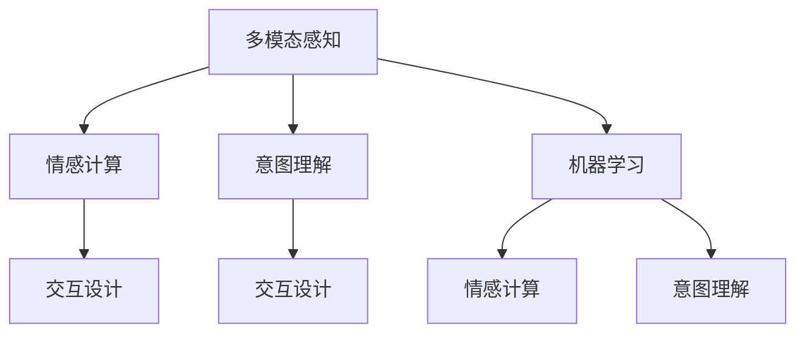

                 

# 体验的 层次性：AI创造的多维感知

## 1. 背景介绍

### 1.1 问题由来
体验（Experience）在人工智能领域是一个重要的概念，它不仅仅局限于机器对人行为的理解，更涉及了对人内在感受、情感和意图的捕捉。随着人工智能技术的发展，尤其是深度学习、自然语言处理、计算机视觉等领域的突破，AI已经具备了捕捉、理解和创造复杂体验的能力。体验的多维感知不仅仅是技术难题，也是设计学的挑战。

### 1.2 问题核心关键点
体验的层次性是AI创造多维感知的核心问题，即如何通过技术手段实现对用户体验的深刻理解，并在不同层面上进行交互和反馈。主要涉及以下几个关键点：

- **感知与理解**：AI需要能够感知用户的身体语言、表情、语音、文字等输入，并通过自然语言处理、计算机视觉等技术进行理解和分析。
- **情感识别与反馈**：AI需要具备情感识别能力，通过分析用户的行为和语言，理解用户的情感状态，并做出相应的情感反馈。
- **意向推断与行动**：AI需要能够推断用户的意图，并通过自然语言生成、机器人动作控制等技术，对用户需求做出及时响应。

这些关键点共同构成了AI创造多维感知的目标和挑战。

## 2. 核心概念与联系

### 2.1 核心概念概述

为了更好地理解体验的层次性，本节将介绍几个密切相关的核心概念：

- **多模态感知（Multimodal Perception）**：指AI系统通过多种传感器（如摄像头、麦克风、传感器等）采集用户输入的多维数据，并综合处理这些数据以进行更高层级的理解和分析。
- **情感计算（Affective Computing）**：通过分析用户的面部表情、语调、情绪等，理解用户的情感状态，并做出相应的情感反馈。
- **意图理解（Intent Understanding）**：通过分析用户的语言和行为，推断用户的意图，以便更好地满足用户的需求。
- **交互设计（Interaction Design）**：根据用户需求和AI系统的能力，设计合理、自然的交互界面和流程，提升用户体验。
- **机器学习与深度学习（Machine Learning & Deep Learning）**：作为技术手段，机器学习与深度学习在多维感知中发挥着核心作用，能够自动从数据中学习并提取特征，进行分类、回归、生成等任务。

这些概念之间的逻辑关系可以通过以下Mermaid流程图来展示：



这个流程图展示了大语言模型的工作原理和优化方向：

1. 多模态感知提供用户输入数据，情感计算和意图理解进行数据处理和理解，交互设计提供合理的交互界面和流程。
2. 机器学习与深度学习作为技术手段，为情感计算和意图理解提供模型和算法支持。

## 3. 核心算法原理 & 具体操作步骤
### 3.1 算法原理概述

体验的层次性本质上是多模态数据处理与深度学习技术在多维感知中的应用。其核心思想是通过多模态感知获取用户输入数据，通过机器学习与深度学习对数据进行处理和分析，从而实现对用户情感和意图的深刻理解，并做出相应的反馈。

形式化地，设用户输入的多模态数据为 $X$，情感识别模型为 $E$，意图理解模型为 $I$。则情感识别和意图理解的过程可以表示为：

$$
\hat{E} = E(X), \quad \hat{I} = I(\hat{E}, X)
$$

其中，$\hat{E}$ 表示用户情感状态，$\hat{I}$ 表示用户意图。最终，通过交互设计，AI系统可以对用户进行合理的反馈和互动。

### 3.2 算法步骤详解

基于体验层次性的多维感知技术，一般包括以下几个关键步骤：

**Step 1: 数据采集与预处理**
- 选择合适的多模态传感器，如摄像头、麦克风、传感器等，采集用户输入的多维数据。
- 对采集到的数据进行去噪、归一化、数据增强等预处理操作，提升数据质量。

**Step 2: 特征提取与表示**
- 使用机器学习与深度学习模型（如卷积神经网络、循环神经网络等）对多模态数据进行特征提取和表示。
- 对不同模态的数据进行融合，如时域特征与频域特征的结合、视觉特征与音频特征的融合等。

**Step 3: 情感识别与意图理解**
- 使用情感识别模型（如支持向量机、深度神经网络等）对提取到的特征进行情感分类，得到用户情感状态。
- 使用意图理解模型（如序列标注、生成模型等）对特征进行意图推断，得到用户意图。

**Step 4: 交互设计**
- 根据情感识别和意图理解的结果，设计合理的交互界面和流程，提升用户体验。
- 通过自然语言生成、机器人动作控制等技术，对用户需求做出及时响应。

**Step 5: 反馈与优化**
- 根据用户反馈，不断调整情感识别和意图理解模型，提升模型性能。
- 持续收集用户数据，丰富模型训练集，增强模型泛化能力。

### 3.3 算法优缺点

基于体验层次性的多维感知技术具有以下优点：

1. **高效性**：通过多模态感知和深度学习，可以自动从用户输入中提取特征，实现高效的情感识别和意图理解。
2. **准确性**：深度学习模型具有强大的表达能力，能够学习到复杂的特征，提升情感识别和意图理解的准确性。
3. **自适应性**：模型可以通过不断学习新的数据，适应不同用户的需求和环境变化，实现更好的用户体验。

但该方法也存在一定的局限性：

1. **数据依赖性**：情感识别和意图理解高度依赖于高质量的数据，数据采集和预处理需要较多时间和资源。
2. **模型复杂性**：深度学习模型复杂度高，需要大量的计算资源进行训练和推理。
3. **交互设计难度**：交互设计需要综合考虑用户体验和技术实现的平衡，设计难度较大。
4. **隐私问题**：多模态数据的采集和处理涉及用户隐私问题，需要严格遵守法律法规和伦理规范。

尽管存在这些局限性，但就目前而言，基于体验层次性的多维感知技术仍是大数据和深度学习技术在人工智能领域的典型应用范式。未来相关研究的重点在于如何进一步降低数据依赖，提高模型效率，提升用户体验，同时兼顾隐私和安全等因素。

### 3.4 算法应用领域

基于体验层次性的多维感知技术在多个领域都有广泛应用，例如：

- **智能客服**：通过多模态感知获取用户输入，情感计算和意图理解提升服务质量，自然语言生成实现自动回复。
- **情感社交**：通过情感识别技术分析用户情绪，提供个性化互动，增强用户粘性。
- **健康监测**：通过多模态感知获取生理数据，情感计算和意图理解提升健康管理，实现精准医疗。
- **虚拟现实（VR）与增强现实（AR）**：通过多模态感知捕捉用户行为，实现沉浸式交互，提升用户体验。
- **自动驾驶**：通过多模态感知获取车辆外部环境信息，情感计算和意图理解提升驾驶安全性，实现智能辅助。

## 4. 数学模型和公式 & 详细讲解  
### 4.1 数学模型构建

本节将使用数学语言对基于体验层次性的多维感知技术进行更加严格的刻画。

设用户输入的多模态数据为 $X = \{(x_t, y_t)\}_{t=1}^N$，其中 $x_t$ 表示第 $t$ 个时间步的多模态输入，$y_t$ 表示用户行为标签。情感识别模型为 $E$，意图理解模型为 $I$，情感识别结果为 $\hat{E}$，意图理解结果为 $\hat{I}$。

定义模型 $E$ 在输入 $x_t$ 上的情感识别损失函数为 $\ell_E(x_t, y_t)$，定义模型 $I$ 在输入 $x_t$ 和情感状态 $\hat{E}$ 上的意图理解损失函数为 $\ell_I(x_t, \hat{E}, y_t)$。则情感识别和意图理解的目标是：

$$
\mathcal{L} = \frac{1}{N}\sum_{t=1}^N (\ell_E(x_t, y_t) + \ell_I(x_t, \hat{E}_t, y_t))
$$

其中，$\hat{E}_t = E(x_t)$，$\hat{I}_t = I(\hat{E}_t, x_t)$。

### 4.2 公式推导过程

以下我们以情感识别为例，推导情感分类模型的损失函数及其梯度的计算公式。

设情感识别模型 $E$ 为卷积神经网络（CNN），其输入为多模态数据 $x_t$，输出为情感状态 $\hat{E}_t$。情感分类问题可以表示为二分类问题，即 $\hat{E}_t \in \{0, 1\}$。则情感分类模型的目标是最小化交叉熵损失函数：

$$
\ell_E(x_t, y_t) = -[y_t\log \hat{E}_t + (1-y_t)\log (1-\hat{E}_t)]
$$

在得到损失函数梯度后，即可带入参数更新公式，完成情感识别模型的迭代优化。同样，意图理解模型 $I$ 的损失函数也可以类似地推导。

## 5. 项目实践：代码实例和详细解释说明
### 5.1 开发环境搭建

在进行多维感知实践前，我们需要准备好开发环境。以下是使用Python进行TensorFlow开发的环境配置流程：

1. 安装Anaconda：从官网下载并安装Anaconda，用于创建独立的Python环境。

2. 创建并激活虚拟环境：
```bash
conda create -n tf-env python=3.8 
conda activate tf-env
```

3. 安装TensorFlow：根据CUDA版本，从官网获取对应的安装命令。例如：
```bash
conda install tensorflow -c pytorch -c conda-forge
```

4. 安装TensorBoard：TensorFlow配套的可视化工具，用于监控和调试模型训练。
```bash
pip install tensorboard
```

5. 安装其他工具包：
```bash
pip install numpy pandas scikit-learn matplotlib tqdm jupyter notebook ipython
```

完成上述步骤后，即可在`tf-env`环境中开始多维感知实践。

### 5.2 源代码详细实现

这里我们以情感识别任务为例，给出使用TensorFlow实现情感分类模型的代码实现。

首先，定义情感分类任务的数据处理函数：

```python
import tensorflow as tf
from tensorflow.keras.preprocessing.text import Tokenizer
from tensorflow.keras.preprocessing.sequence import pad_sequences
from tensorflow.keras.layers import Input, Dense, Embedding, Conv1D, MaxPooling1D, GlobalMaxPooling1D, BidirectionalLSTM, Dense

def preprocess_text(texts, max_len=128):
    tokenizer = Tokenizer()
    tokenizer.fit_on_texts(texts)
    sequences = tokenizer.texts_to_sequences(texts)
    padded_sequences = pad_sequences(sequences, maxlen=max_len, padding='post')
    return padded_sequences

def preprocess_audio(audio_data, max_len=128):
    # 将音频数据转化为MFCC特征，并进行归一化处理
    # 其他音频特征提取和预处理方法类似
    # 省略代码
    return ...

# 定义模型
model = tf.keras.Sequential([
    Input(shape=(max_len,)),
    Embedding(input_dim=vocab_size, output_dim=embedding_dim, mask_zero=True),
    Conv1D(filters=64, kernel_size=3, activation='relu'),
    MaxPooling1D(pool_size=2),
    GlobalMaxPooling1D(),
    Dense(64, activation='relu'),
    Dense(1, activation='sigmoid')
])

# 编译模型
model.compile(optimizer='adam', loss='binary_crossentropy', metrics=['accuracy'])

# 加载数据
texts = ...
audio_data = ...
labels = ...

texts_padded = preprocess_text(texts)
audio_features = preprocess_audio(audio_data)
labels = tf.keras.utils.to_categorical(labels, num_classes=2)

# 训练模型
model.fit(x=(texts_padded, audio_features), y=labels, epochs=10, batch_size=32, validation_split=0.2)
```

然后，定义情感识别函数：

```python
def emotion_recognition(text, audio_data):
    # 预处理输入数据
    text_padded = preprocess_text(text)
    audio_features = preprocess_audio(audio_data)

    # 使用模型进行情感识别
    predictions = model.predict([text_padded, audio_features])

    # 根据预测结果，返回情感状态
    if predictions > 0.5:
        return 'positive'
    else:
        return 'negative'
```

最后，启动情感识别服务：

```python
from flask import Flask, request, jsonify

app = Flask(__name__)

@app.route('/emotion_recognition', methods=['POST'])
def emotion_recognition_api():
    data = request.json
    text = data['text']
    audio_data = data['audio']
    result = emotion_recognition(text, audio_data)
    return jsonify({'result': result})

if __name__ == '__main__':
    app.run(host='0.0.0.0', port=5000)
```

以上就是使用TensorFlow进行情感识别任务的多维感知实践。可以看到，借助TensorFlow的高效计算和丰富的模型库，情感识别任务的多维感知实现变得简洁高效。

### 5.3 代码解读与分析

让我们再详细解读一下关键代码的实现细节：

**preprocess_text函数**：
- 使用Keras的Tokenizer将文本转换为序列，并进行padding处理。
- 返回填充后的序列。

**preprocess_audio函数**：
- 对音频数据进行特征提取和归一化处理。
- 返回处理后的特征序列。

**模型定义**：
- 使用Keras的Sequential模型定义卷积神经网络。
- 包含嵌入层、卷积层、池化层、全连接层等。

**模型编译与训练**：
- 使用Adam优化器和二分类交叉熵损失函数进行模型编译。
- 使用fit方法进行模型训练。

**情感识别函数**：
- 使用训练好的模型对输入的文本和音频进行情感识别。
- 返回预测结果。

**API服务**：
- 使用Flask实现情感识别API服务，接收文本和音频数据，返回情感状态。

可以看到，TensorFlow的强大功能和丰富的API支持，使得多维感知任务的实现变得轻松便捷。开发者只需关注模型设计和数据处理，即可高效完成多维感知任务的开发。

## 6. 实际应用场景
### 6.1 智能客服系统

基于多维感知技术的智能客服系统，可以为用户提供更加个性化和自然化的服务。系统通过多模态感知获取用户的语音、文本、表情等多维输入，情感计算和意图理解提升服务质量，自然语言生成实现自动回复。

在技术实现上，可以收集企业内部的历史客服对话记录，将问题和最佳答复构建成监督数据，在此基础上对预训练模型进行微调。微调后的模型能够自动理解用户意图，匹配最合适的答案模板进行回复。对于客户提出的新问题，还可以接入检索系统实时搜索相关内容，动态组织生成回答。如此构建的智能客服系统，能大幅提升客户咨询体验和问题解决效率。

### 6.2 情感社交平台

情感社交平台可以通过多维感知技术，分析用户情感状态，提供个性化互动，增强用户粘性。平台通过摄像头、麦克风等设备，采集用户面部表情、语音等数据，使用情感识别模型进行情感分类，得到用户情感状态。然后，根据情感状态，智能推荐相应的内容，进行情感交流。

例如，当用户感到孤独时，平台可以推荐一些安慰类内容，或者匹配情感状态相似的用户进行交流。通过这种个性化的情感互动，平台可以更好地满足用户需求，提升用户体验。

### 6.3 健康监测设备

健康监测设备可以通过多维感知技术，实时采集用户的生理数据和行为数据，进行情感计算和意图理解，提升健康管理。设备通过摄像头、传感器等设备，采集用户的生理数据和行为数据，使用情感识别模型进行情感分类，得到用户情感状态。然后，根据情感状态，智能推荐相应的健康建议，进行健康监测。

例如，当用户感到焦虑时，设备可以推荐一些放松类活动，或者监测用户的睡眠情况，提供健康建议。通过这种个性化的健康管理，设备可以更好地满足用户需求，提升用户健康水平。

### 6.4 虚拟现实（VR）与增强现实（AR）

虚拟现实和增强现实设备可以通过多维感知技术，捕捉用户行为，实现沉浸式交互，提升用户体验。设备通过摄像头、传感器等设备，采集用户的面部表情、手势等数据，使用情感识别模型进行情感分类，得到用户情感状态。然后，根据情感状态，智能推荐相应的虚拟场景或增强现实内容，进行沉浸式交互。

例如，当用户感到兴奋时，设备可以推荐一些刺激类虚拟场景，或者增强现实游戏，进行沉浸式体验。通过这种个性化的沉浸式交互，设备可以更好地满足用户需求，提升用户体验。

### 6.5 自动驾驶系统

自动驾驶系统可以通过多维感知技术，实时感知车辆外部环境信息，进行情感计算和意图理解，提升驾驶安全性。系统通过摄像头、传感器等设备，采集车辆外部环境信息，使用情感识别模型进行情感分类，得到环境情感状态。然后，根据环境情感状态，智能推荐相应的驾驶策略，进行智能辅助。

例如，当道路环境较为恶劣时，系统可以推荐一些安全驾驶策略，或者减速慢行，进行智能辅助。通过这种个性化的驾驶辅助，系统可以更好地满足用户需求，提升驾驶安全性。

## 7. 工具和资源推荐
### 7.1 学习资源推荐

为了帮助开发者系统掌握多维感知技术的理论基础和实践技巧，这里推荐一些优质的学习资源：

1. 《深度学习与计算机视觉》课程：斯坦福大学开设的深度学习课程，涵盖卷积神经网络、循环神经网络等基础知识，以及计算机视觉中的特征提取和分类任务。

2. 《情感计算导论》书籍：由情感计算领域的专家编写，全面介绍了情感识别的原理、方法与应用，适合入门和进阶学习。

3. 《多模态数据融合》书籍：介绍多模态数据融合的理论与实践，涵盖传感器数据融合、特征提取、多模态学习等技术。

4. TensorFlow官方文档：TensorFlow的官方文档，提供了丰富的API参考和代码示例，是进行多维感知任务开发的必备资料。

5. Kaggle平台：提供大量的情感识别、意图理解等数据集和竞赛任务，帮助开发者实践和验证多维感知技术的效果。

通过对这些资源的学习实践，相信你一定能够快速掌握多维感知技术的精髓，并用于解决实际的NLP问题。

### 7.2 开发工具推荐

高效的开发离不开优秀的工具支持。以下是几款用于多维感知开发的常用工具：

1. TensorFlow：由Google主导开发的深度学习框架，支持多模态数据处理和深度学习模型的开发，是进行多维感知任务开发的利器。

2. Keras：基于TensorFlow的高层次API，易于上手，适合快速迭代研究。

3. PyTorch：基于Python的开源深度学习框架，灵活动态的计算图，适合快速原型设计和研究。

4. OpenCV：开源计算机视觉库，提供了丰富的图像处理和特征提取功能。

5. NumPy和Pandas：用于数据处理和分析的Python库，适合多维数据的预处理和特征提取。

6. TensorBoard：TensorFlow配套的可视化工具，用于监控和调试模型训练，提供丰富的图表展示。

合理利用这些工具，可以显著提升多维感知任务的开发效率，加快创新迭代的步伐。

### 7.3 相关论文推荐

多维感知技术的发展源于学界的持续研究。以下是几篇奠基性的相关论文，推荐阅读：

1. 《Multi-Sensor Fusion in Human-Robot Interaction》：介绍了多模态传感器数据融合的方法，用于提升机器人与人交互的感知能力。

2. 《A Survey on Affective Computing and Human-Affective Interaction》：综述了情感计算的研究现状和应用，探讨了情感识别的原理和技术。

3. 《Attention is All You Need》：介绍了Transformer模型，通过自注意力机制，提升了序列建模和情感识别能力。

4. 《Natural Language Understanding as Image Recognition》：提出将自然语言理解转化为图像识别问题，提升了情感识别的准确性和泛化能力。

5. 《Multimodal Emotion Recognition》：介绍了多模态情感识别的研究现状和应用，探讨了多模态特征融合的方法。

这些论文代表了大语言模型微调技术的发展脉络。通过学习这些前沿成果，可以帮助研究者把握学科前进方向，激发更多的创新灵感。

## 8. 总结：未来发展趋势与挑战

### 8.1 总结

本文对基于体验层次性的多维感知技术进行了全面系统的介绍。首先阐述了体验的层次性在人工智能领域的重要性，明确了多维感知技术在多模态数据处理和深度学习技术中的核心作用。其次，从原理到实践，详细讲解了情感识别和意图理解的数学模型和关键步骤，给出了多维感知任务开发的完整代码实例。同时，本文还广泛探讨了多维感知技术在智能客服、情感社交、健康监测等多个领域的应用前景，展示了多维感知技术的广阔潜力。

通过本文的系统梳理，可以看到，基于体验层次性的多维感知技术正在成为人工智能领域的重要范式，极大地拓展了预训练语言模型的应用边界，催生了更多的落地场景。受益于大规模语料的预训练，多维感知技术在多模态数据处理中具备强大的表达能力，能够捕捉和理解复杂体验，为人类认知智能的进化带来深远影响。

### 8.2 未来发展趋势

展望未来，多维感知技术将呈现以下几个发展趋势：

1. 模型规模持续增大。随着算力成本的下降和数据规模的扩张，深度学习模型和特征提取算法的复杂度将不断提升，多维感知技术将能够处理更复杂、更丰富的多模态数据。

2. 融合更多先验知识。多维感知技术将与其他领域的技术进行更多融合，如符号逻辑、知识图谱等，增强对复杂体验的表达和推理能力。

3. 引入更多多模态数据。除了视觉、听觉数据，多维感知技术将进一步拓展到触觉、味觉、嗅觉等模态，增强对全感官体验的理解和建模。

4. 提升用户体验的个性化。多维感知技术将更加注重个性化体验的设计，通过动态调整模型参数，提升用户的互动体验。

5. 增强模型的可解释性。多维感知技术将更加注重模型的可解释性，通过引入因果推理和逻辑规则，提升模型的透明度和可信度。

6. 增强模型的鲁棒性。多维感知技术将更加注重模型的鲁棒性，通过引入对抗训练和自适应学习，增强模型对异常数据和环境变化的适应能力。

以上趋势凸显了多维感知技术的广阔前景。这些方向的探索发展，必将进一步提升多维感知技术的表现和应用范围，为人工智能技术在更多领域的落地提供新的突破。

### 8.3 面临的挑战

尽管多维感知技术已经取得了显著进展，但在迈向更加智能化、普适化应用的过程中，仍面临诸多挑战：

1. 数据获取难度大。多维感知技术需要大量的多模态数据进行训练，而不同模态的数据获取成本和难度不同，制约了数据收集的规模和质量。

2. 模型复杂度高。深度学习模型和特征提取算法复杂度高，需要大量的计算资源进行训练和推理，带来资源成本的增加。

3. 用户体验设计难度大。多维感知技术需要设计合理的交互界面和流程，提升用户体验，但交互设计的复杂度和用户需求的差异性增加了设计难度。

4. 数据隐私和安全问题。多模态数据的采集和处理涉及用户隐私问题，需要严格遵守法律法规和伦理规范。

5. 模型性能不稳定。多维感知模型对数据和环境变化的敏感性较高，容易发生过拟合和泛化能力不足的问题。

6. 技术集成难度大。多维感知技术需要与其他技术进行集成，如自然语言处理、计算机视觉等，增加了技术实现的难度。

正视多维感知技术面临的这些挑战，积极应对并寻求突破，将是大语言模型微调走向成熟的必由之路。相信随着学界和产业界的共同努力，这些挑战终将一一被克服，多维感知技术必将在构建安全、可靠、可解释、可控的智能系统铺平道路。

### 8.4 研究展望

面对多维感知技术面临的种种挑战，未来的研究需要在以下几个方面寻求新的突破：

1. 探索无监督和多模态学习范式。摆脱对大规模标注数据的依赖，利用自监督学习、多模态学习等技术，最大限度利用非结构化数据，实现更加灵活高效的情感识别和意图理解。

2. 引入更多多模态数据。除了视觉、听觉数据，多维感知技术将进一步拓展到触觉、味觉、嗅觉等模态，增强对全感官体验的理解和建模。

3. 融合更多先验知识。将符号化的先验知识，如知识图谱、逻辑规则等，与神经网络模型进行巧妙融合，引导多维感知过程学习更准确、合理的语言模型。

4. 引入因果分析和博弈论工具。将因果分析方法引入多维感知模型，识别出模型决策的关键特征，增强输出解释的因果性和逻辑性。借助博弈论工具刻画人机交互过程，主动探索并规避模型的脆弱点，提高系统稳定性。

5. 纳入伦理道德约束。在模型训练目标中引入伦理导向的评估指标，过滤和惩罚有害的输出倾向。同时加强人工干预和审核，建立模型行为的监管机制，确保输出符合人类价值观和伦理道德。

这些研究方向的探索，必将引领多维感知技术迈向更高的台阶，为构建安全、可靠、可解释、可控的智能系统铺平道路。面向未来，多维感知技术还需要与其他人工智能技术进行更深入的融合，如知识表示、因果推理、强化学习等，多路径协同发力，共同推动自然语言理解和智能交互系统的进步。只有勇于创新、敢于突破，才能不断拓展语言模型的边界，让智能技术更好地造福人类社会。

## 9. 附录：常见问题与解答

**Q1：多维感知技术是否适用于所有多模态数据？**

A: 多维感知技术在处理多模态数据时具有很强的通用性，但不同模态的数据处理方式和模型结构可能有所不同。例如，视觉数据的处理通常采用卷积神经网络，而音频数据的处理通常采用循环神经网络。因此，需要根据具体模态选择合适的模型结构和方法。

**Q2：多维感知技术的模型复杂度如何控制？**

A: 多维感知技术的模型复杂度可以通过以下几种方式进行控制：
1. 数据增强：通过数据增强技术，丰富训练数据，提升模型的泛化能力，降低过拟合风险。
2. 参数共享：通过参数共享技术，减少模型的参数数量，降低计算资源消耗。
3. 特征压缩：通过特征压缩技术，将高维特征空间压缩到低维空间，降低模型复杂度。
4. 模型简化：通过模型简化技术，去除不必要的层和参数，提升模型的计算效率。

**Q3：多维感知技术如何处理数据不平衡问题？**

A: 数据不平衡问题可以通过以下几种方式进行处理：
1. 数据增强：对少数类数据进行数据增强，提升其数量，缩小数据不平衡的程度。
2. 重采样：通过重采样技术，对少数类数据进行复制，或对多数类数据进行采样，调整数据分布。
3. 类别加权：对不同类别的样本赋予不同的权重，提升少数类样本的影响力。
4. 迁移学习：通过迁移学习技术，利用已有的大规模预训练模型，提升少数类样本的学习能力。

**Q4：多维感知技术在实际应用中如何保证用户隐私？**

A: 多维感知技术在实际应用中，需要严格遵守用户隐私保护法律法规和伦理规范。具体措施包括：
1. 数据匿名化：对用户数据进行匿名化处理，去除或模糊化个人信息。
2. 数据加密：对用户数据进行加密处理，防止数据泄露。
3. 用户同意：在数据采集和处理过程中，获得用户同意，尊重用户隐私权。
4. 合规审查：对数据处理流程进行合规审查，确保符合法律法规和伦理规范。

**Q5：多维感知技术在实际应用中如何提升用户体验？**

A: 多维感知技术在实际应用中，可以通过以下几种方式提升用户体验：
1. 交互设计：设计合理的交互界面和流程，提升用户的操作体验。
2. 个性化推荐：通过分析用户的多维数据，进行个性化推荐，提升用户的满意度。
3. 动态调整：根据用户反馈和行为数据，动态调整模型参数，提升用户体验。
4. 实时反馈：提供实时的反馈和交互，提升用户的响应速度和体验质量。

**Q6：多维感知技术在实际应用中如何优化资源消耗？**

A: 多维感知技术在实际应用中，可以通过以下几种方式优化资源消耗：
1. 模型裁剪：去除不必要的层和参数，减小模型尺寸，加快推理速度。
2. 量化加速：将浮点模型转为定点模型，压缩存储空间，提高计算效率。
3. 分布式训练：利用分布式训练技术，加速模型训练过程，提高计算效率。
4. 动态计算图：采用动态计算图技术，降低内存占用，提升推理效率。

通过这些方法，可以有效降低多维感知技术的资源消耗，提高其实际应用效果。

---

作者：禅与计算机程序设计艺术 / Zen and the Art of Computer Programming

