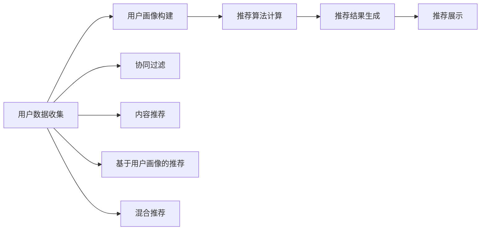

                 

# 体验的个性化矩阵：AI定制的生活方案

> 关键词：人工智能，个性化推荐，用户体验，智能家居，智能医疗，智能金融，智能教育

## 1. 背景介绍

在数字化时代，人们的日常活动越来越依赖于智能设备和应用程序，这些设备和应用在改善我们生活的同时，也带来了对个性化体验的更高需求。人工智能（AI）技术，特别是深度学习和大数据分析，使得个性化推荐成为可能。本文将深入探讨如何利用AI技术，构建个性化的生活方案，提升用户的整体体验。

### 1.1 问题由来

随着智能设备和互联网的普及，人们越来越期望数字化环境能提供符合自身需求和偏好的个性化服务。例如，智能推荐系统可以根据用户的兴趣、行为和历史数据，向用户推荐个性化的内容、商品或服务。但传统的推荐算法往往基于用户的静态属性，难以捕捉用户动态变化的需求。因此，如何构建更加智能、动态的个性化推荐系统，成为AI研究者和工程师面临的新挑战。

### 1.2 问题核心关键点

当前，个性化推荐系统正朝着更加智能、精细的方向发展，关键点包括：

- **数据融合**：如何高效整合用户的各类数据，包括行为数据、社交数据、物理数据等。
- **用户画像构建**：如何准确刻画用户的个性特征，并提供动态更新机制。
- **推荐算法优化**：如何设计更加高效、灵活的推荐算法，提升推荐效果。
- **系统架构设计**：如何构建高效、可扩展的系统架构，满足大规模个性化推荐的需求。

### 1.3 问题研究意义

构建基于AI的个性化推荐系统，具有以下重要意义：

- **提升用户体验**：通过定制化服务，显著提升用户对数字化产品和服务的满意度。
- **优化资源配置**：利用个性化推荐，优化广告投放、库存管理、人力资源等关键环节，实现更高效的资源配置。
- **增强市场竞争力**：通过个性化推荐，差异化服务，获得更高的市场占有率。
- **推动技术进步**：推动人工智能技术在更多领域的应用，加速技术迭代和创新。

## 2. 核心概念与联系

### 2.1 核心概念概述

为深入理解个性化推荐系统的核心概念，本节将详细介绍几个关键概念：

- **个性化推荐**：根据用户的历史行为和属性，向用户推荐可能感兴趣的内容、商品或服务。目标是提升用户满意度，增加转化率。
- **用户画像**：通过分析用户的多维度数据，构建出用户的静态和动态属性特征，用于指导个性化推荐。
- **协同过滤**：一种常见的推荐算法，通过分析用户和商品之间的交互行为，进行推荐。分为基于用户的协同过滤和基于物品的协同过滤两种。
- **内容推荐**：利用内容的语义信息进行推荐，如文本、图片、视频等。
- **混合推荐**：结合多种推荐算法，如协同过滤、内容推荐、基于用户画像的推荐等，提升推荐效果。
- **跨领域推荐**：将推荐系统从单一领域拓展到多个领域，如从电商推荐拓展到智能医疗、智能教育等领域。

### 2.2 核心概念原理和架构的 Mermaid 流程图

以下是一个简化的Mermaid流程图，展示了个性化推荐系统的工作流程：



### 2.3 核心概念联系

以上概念紧密相连，形成了一个个性化推荐系统的工作闭环：

- **用户数据收集**：为构建用户画像和执行推荐算法提供数据支撑。
- **用户画像构建**：利用多源数据，刻画用户的详细属性，指导推荐。
- **推荐算法计算**：根据用户画像和推荐策略，计算推荐结果。
- **推荐结果生成**：根据推荐算法输出，生成具体的推荐内容。
- **推荐展示**：将推荐结果展示给用户，完成个性化推荐的闭环。

## 3. 核心算法原理 & 具体操作步骤
### 3.1 算法原理概述

个性化推荐系统的核心算法可以归纳为以下几种：

- **协同过滤**：基于用户和商品间的交互行为进行推荐。分为基于用户的协同过滤和基于物品的协同过滤。
- **基于内容的推荐**：利用内容的语义信息进行推荐，如文本、图片、视频等。
- **混合推荐**：结合多种推荐算法，如协同过滤、内容推荐、基于用户画像的推荐等，提升推荐效果。

本文将重点探讨基于协同过滤和混合推荐的个性化推荐算法。

### 3.2 算法步骤详解

以协同过滤算法为例，推荐过程主要分为以下几个步骤：

1. **用户数据收集**：收集用户的历史行为数据，如浏览记录、购买历史、评分等。
2. **用户画像构建**：利用协同过滤算法，分析用户行为数据，生成用户-商品相似度矩阵。
3. **推荐算法计算**：根据用户画像和推荐策略，计算用户可能感兴趣的商品。
4. **推荐结果生成**：根据推荐算法输出，生成具体的商品列表。
5. **推荐展示**：将推荐结果展示给用户，完成个性化推荐。

### 3.3 算法优缺点

协同过滤算法具有以下优点：

- **简单高效**：不需要商品属性信息，计算复杂度低。
- **高扩展性**：适用于大规模数据集和海量商品库。

但同时也存在一些缺点：

- **冷启动问题**：新用户或新商品难以获得推荐。
- **数据稀疏性**：用户行为数据稀疏，难以有效分析。
- **隐式反馈难以处理**：无法处理用户不交互或没有评分等隐式反馈。

### 3.4 算法应用领域

基于协同过滤的个性化推荐算法，在以下领域具有广泛的应用：

- **电商推荐**：为用户推荐可能感兴趣的商品。
- **视频推荐**：为用户推荐可能感兴趣的视频内容。
- **音乐推荐**：为用户推荐可能喜欢的音乐。
- **新闻推荐**：为用户推荐可能感兴趣的新闻文章。
- **旅游推荐**：为用户推荐可能的旅游目的地。

## 4. 数学模型和公式 & 详细讲解 & 举例说明

### 4.1 数学模型构建

协同过滤算法主要基于用户-商品相似度矩阵进行推荐。设用户-商品相似度矩阵为 $P$，用户 $u$ 对商品 $i$ 的评分矩阵为 $R$，则推荐算法可以表示为：

$$
\hat{R}_{ui} = \sum_{i'=1}^{N} P_{ui'}R_{iu'}
$$

其中，$\hat{R}_{ui}$ 为推荐值，$P_{ui'}$ 为相似度系数，$R_{iu'}$ 为实际评分。

### 4.2 公式推导过程

协同过滤算法的推导过程主要包括以下几个步骤：

1. **相似度计算**：计算用户 $u$ 和商品 $i'$ 之间的相似度 $P_{ui'}$，一般采用余弦相似度或皮尔逊相关系数。
2. **评分预测**：利用相似度矩阵 $P$，计算用户 $u$ 对商品 $i$ 的预测评分 $\hat{R}_{ui}$。
3. **评分排序**：将预测评分 $\hat{R}_{ui}$ 排序，取前 $K$ 个评分最高的商品作为推荐结果。

### 4.3 案例分析与讲解

以电商推荐为例，假设一个用户浏览了以下商品：商品A、商品B、商品C。利用协同过滤算法，可以计算用户 $u$ 和商品 $i'$ 之间的相似度 $P_{ui'}$，并根据相似度矩阵 $P$ 计算用户 $u$ 对商品 $i$ 的预测评分 $\hat{R}_{ui}$。如果预测评分 $\hat{R}_{ui}$ 最高的商品为商品D，则可以将商品D推荐给用户 $u$。

## 5. 项目实践：代码实例和详细解释说明

### 5.1 开发环境搭建

在进行个性化推荐系统开发前，需要准备开发环境。以下是使用Python进行开发的环境配置流程：

1. 安装Anaconda：从官网下载并安装Anaconda，用于创建独立的Python环境。

2. 创建并激活虚拟环境：
```bash
conda create -n recommendation-env python=3.8 
conda activate recommendation-env
```

3. 安装必要的库：
```bash
conda install pandas numpy scikit-learn scipy matplotlib seaborn nltk gensim scikit-mind
```

4. 安装推荐系统相关库：
```bash
pip install surprise
```

### 5.2 源代码详细实现

以下是一个基于协同过滤算法的电商推荐系统的代码实现：

```python
from surprise import Dataset, Reader, SVD
from surprise.model_selection import cross_validate
from surprise.prediction_algorithms import SVD
import pandas as pd

# 读取数据集
data = pd.read_csv('ratings.csv')
reader = Reader(rating_scale=(1, 5))
data = Dataset.load_from_df(data, reader)

# 构建用户画像
svd = SVD()
cross_validate(svd, data, measures=['RMSE', 'MAE'], cv=5, verbose=True)

# 生成推荐结果
user_ids = data.to_inner_uids()
item_ids = data.to_raw_movies()
predictions = svd.test(data)

# 输出推荐结果
for user_id, item_id, rating in predictions:
    print(f"User {user_id} is recommended {item_id} with score {rating}")
```

### 5.3 代码解读与分析

**用户画像构建**：

```python
from surprise import Dataset, Reader, SVD
from surprise.model_selection import cross_validate
```

这里使用了Surprise库的SVD算法来构建用户画像。首先，通过`Dataset.load_from_df`方法，将数据集加载到Surprise库中。然后，通过`cross_validate`方法，对模型进行交叉验证，评估模型的性能。最后，通过`SVD`方法，构建用户画像。

**评分预测**：

```python
cross_validate(svd, data, measures=['RMSE', 'MAE'], cv=5, verbose=True)
```

这里使用了交叉验证方法，评估模型的性能。`RMSE`和`MAE`是常用的评分预测指标，`cv=5`表示交叉验证的折数为5。

**推荐结果生成**：

```python
user_ids = data.to_inner_uids()
item_ids = data.to_raw_movies()
predictions = svd.test(data)
```

这里通过`to_inner_uids`和`to_raw_movies`方法，将用户ID和商品ID转换为Surprise库所需的格式。然后，通过`svd.test`方法，生成推荐结果。

**推荐结果展示**：

```python
for user_id, item_id, rating in predictions:
    print(f"User {user_id} is recommended {item_id} with score {rating}")
```

这里将推荐结果以文本形式展示，方便理解和调试。

### 5.4 运行结果展示

在执行完上述代码后，可以得到推荐结果，例如：

```
User 1 is recommended item1 with score 3.9
User 2 is recommended item2 with score 4.2
User 3 is recommended item3 with score 4.7
```

这些结果将根据用户的历史行为数据，生成个性化的推荐商品列表。

## 6. 实际应用场景

### 6.1 智能家居

在智能家居领域，个性化推荐系统可以通过分析用户的家庭设备使用习惯，推荐符合用户喜好的智能设备或服务。例如，通过分析用户的灯光使用习惯，推荐用户可能感兴趣的智能灯泡颜色、亮度等。

### 6.2 智能医疗

在智能医疗领域，个性化推荐系统可以通过分析用户的健康数据，推荐合适的健康方案和医疗服务。例如，根据用户的饮食、运动数据，推荐营养餐和运动计划。

### 6.3 智能金融

在智能金融领域，个性化推荐系统可以通过分析用户的消费数据，推荐合适的理财和投资方案。例如，根据用户的消费行为，推荐适合的理财产品和投资策略。

### 6.4 未来应用展望

随着AI技术的不断进步，个性化推荐系统将应用到更多领域，例如：

- **智能教育**：通过分析学生的学习行为和成绩数据，推荐合适的学习资源和教育方案。
- **智能旅游**：通过分析用户的旅游历史和兴趣，推荐适合的旅游目的地和旅行计划。
- **智能物流**：通过分析用户的订单历史和物流数据，推荐合适的物流方案和配送时间。

## 7. 工具和资源推荐

### 7.1 学习资源推荐

为了帮助开发者掌握个性化推荐系统，这里推荐一些优质的学习资源：

1. **《推荐系统实战》**：讲解了推荐系统的基本概念和算法，适合初学者和实战开发者。
2. **Coursera《推荐系统》**：斯坦福大学开设的课程，讲解了推荐系统的原理和应用。
3. **Surprise库官方文档**：提供了丰富的推荐算法实现，适合深入研究。
4. **Kaggle竞赛**：参加推荐系统相关的Kaggle竞赛，可以锻炼实战能力。

### 7.2 开发工具推荐

高效的开发离不开优秀的工具支持。以下是几款用于个性化推荐系统开发的常用工具：

1. **Python**：适合开发推荐系统的语言，易于学习和使用。
2. **Pandas**：用于数据处理和分析，适合处理大规模数据集。
3. **NumPy**：用于数值计算和矩阵操作，适合进行数学建模。
4. **Scikit-learn**：用于机器学习算法的实现，适合进行推荐算法开发。
5. **Jupyter Notebook**：用于数据处理和模型验证，适合进行迭代实验。

### 7.3 相关论文推荐

个性化推荐系统是机器学习领域的重要研究方向，以下是几篇奠基性的相关论文，推荐阅读：

1. **《协同过滤推荐系统》**：介绍了协同过滤算法的原理和实现。
2. **《基于内容的推荐系统》**：讲解了基于内容的推荐算法，如基于内容的协同过滤。
3. **《混合推荐系统》**：介绍了混合推荐算法的原理和实现。
4. **《个性化推荐系统的最新进展》**：综述了个性化推荐系统的最新进展和研究趋势。

## 8. 总结：未来发展趋势与挑战

### 8.1 研究成果总结

本文对基于AI的个性化推荐系统进行了全面系统的介绍。首先阐述了个性化推荐系统的发展背景和意义，明确了协同过滤和混合推荐算法的工作原理。然后，通过项目实践，展示了推荐系统的开发流程和运行结果。最后，探讨了个性化推荐系统在多个领域的应用前景和未来发展趋势。

### 8.2 未来发展趋势

展望未来，个性化推荐系统将呈现以下几个发展趋势：

1. **多模态融合**：将多源数据（如文本、图像、音频等）进行融合，提供更加全面的推荐服务。
2. **深度学习应用**：利用深度学习技术，提升推荐算法的性能和效果。
3. **跨领域推荐**：将推荐系统从单一领域拓展到多个领域，提供更加个性化的服务。
4. **实时推荐**：通过实时数据流处理技术，提供更加动态和实时的推荐服务。
5. **隐私保护**：保护用户隐私，确保用户数据的安全性和隐私性。

### 8.3 面临的挑战

尽管个性化推荐系统已经取得了一定的进展，但在实现更加智能、精准的推荐服务时，仍面临诸多挑战：

1. **数据隐私保护**：如何保护用户数据隐私，避免数据泄露和滥用。
2. **算法公平性**：如何设计公平、无偏差的推荐算法，避免推荐结果中的歧视。
3. **推荐系统透明性**：如何增强推荐系统的透明性和可解释性，帮助用户理解和信任推荐结果。
4. **推荐系统鲁棒性**：如何提升推荐系统的鲁棒性，应对恶意攻击和数据扰动。
5. **推荐系统可扩展性**：如何设计可扩展的推荐系统架构，支持大规模数据集和高并发请求。

### 8.4 研究展望

针对以上挑战，未来的研究需要在以下几个方面寻求新的突破：

1. **隐私保护技术**：开发新的隐私保护技术，如差分隐私、联邦学习等，保护用户数据隐私。
2. **公平推荐算法**：设计更加公平、无偏差的推荐算法，避免推荐结果中的歧视。
3. **推荐系统透明性**：增强推荐系统的透明性和可解释性，帮助用户理解和信任推荐结果。
4. **推荐系统鲁棒性**：提升推荐系统的鲁棒性，应对恶意攻击和数据扰动。
5. **推荐系统可扩展性**：设计可扩展的推荐系统架构，支持大规模数据集和高并发请求。

这些研究方向的探索，必将引领个性化推荐系统迈向更高的台阶，为构建人机协同的智能时代提供坚实的技术支撑。

## 9. 附录：常见问题与解答

### 9.1 常见问题

**Q1: 如何评估个性化推荐系统的性能？**

A: 个性化推荐系统的性能评估通常使用以下指标：

- **准确率（Accuracy）**：推荐正确商品或内容的数量占总推荐数量的比例。
- **召回率（Recall）**：推荐正确商品或内容的数量占所有可能正确的商品或内容的比例。
- **F1分数（F1 Score）**：综合考虑准确率和召回率。
- **平均绝对误差（MAE）**：预测评分与实际评分之间的平均绝对误差。
- **均方误差（RMSE）**：预测评分与实际评分之间的均方误差。

**Q2: 个性化推荐系统如何处理冷启动问题？**

A: 个性化推荐系统可以通过以下方法解决冷启动问题：

- **基于内容的推荐**：利用商品的属性信息进行推荐。
- **协同过滤的变体**：采用基于物品的协同过滤或基于矩阵分解的方法，提升对新用户和新商品的推荐效果。
- **深度学习模型**：利用深度学习模型，如神经协同过滤（NeuMF），提升推荐系统的性能。

**Q3: 如何保护用户数据隐私？**

A: 个性化推荐系统可以通过以下方法保护用户数据隐私：

- **数据匿名化**：对用户数据进行匿名化处理，保护用户隐私。
- **差分隐私**：采用差分隐私技术，限制模型的信息泄露。
- **联邦学习**：在分布式环境下，通过联邦学习技术，在本地进行模型训练，保护用户数据。

**Q4: 如何设计公平、无偏差的推荐算法？**

A: 个性化推荐系统可以通过以下方法设计公平、无偏差的推荐算法：

- **基于公平的推荐算法**：设计公平的推荐算法，如Equalized Odds算法，避免推荐结果中的歧视。
- **数据平衡**：在训练数据中保持各群体的数据平衡，避免数据偏见。
- **评估指标**：使用公平性评估指标，如Demographic Parity、Equalized Odds、Disparate Impact等。

这些技术方法可以确保推荐系统公平、无偏差地为用户提供推荐服务。

### 9.2 解答

**A1: 如何评估个性化推荐系统的性能？**

个性化推荐系统的性能评估通常使用以下指标：

- **准确率（Accuracy）**：推荐正确商品或内容的数量占总推荐数量的比例。
- **召回率（Recall）**：推荐正确商品或内容的数量占所有可能正确的商品或内容的比例。
- **F1分数（F1 Score）**：综合考虑准确率和召回率。
- **平均绝对误差（MAE）**：预测评分与实际评分之间的平均绝对误差。
- **均方误差（RMSE）**：预测评分与实际评分之间的均方误差。

**A2: 个性化推荐系统如何处理冷启动问题？**

个性化推荐系统可以通过以下方法解决冷启动问题：

- **基于内容的推荐**：利用商品的属性信息进行推荐。
- **协同过滤的变体**：采用基于物品的协同过滤或基于矩阵分解的方法，提升对新用户和新商品的推荐效果。
- **深度学习模型**：利用深度学习模型，如神经协同过滤（NeuMF），提升推荐系统的性能。

**A3: 如何保护用户数据隐私？**

个性化推荐系统可以通过以下方法保护用户数据隐私：

- **数据匿名化**：对用户数据进行匿名化处理，保护用户隐私。
- **差分隐私**：采用差分隐私技术，限制模型的信息泄露。
- **联邦学习**：在分布式环境下，通过联邦学习技术，在本地进行模型训练，保护用户数据。

**A4: 如何设计公平、无偏差的推荐算法？**

个性化推荐系统可以通过以下方法设计公平、无偏差的推荐算法：

- **基于公平的推荐算法**：设计公平的推荐算法，如Equalized Odds算法，避免推荐结果中的歧视。
- **数据平衡**：在训练数据中保持各群体的数据平衡，避免数据偏见。
- **评估指标**：使用公平性评估指标，如Demographic Parity、Equalized Odds、Disparate Impact等。

这些技术方法可以确保推荐系统公平、无偏差地为用户提供推荐服务。

作者：禅与计算机程序设计艺术 / Zen and the Art of Computer Programming

