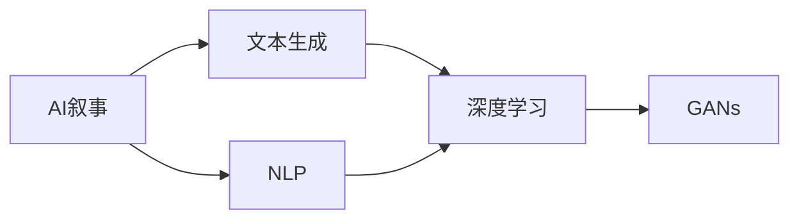

                 

# 体验的叙事性：AI驱动的个人故事创作

> 关键词：
- AI叙事
- 文本生成
- 自然语言处理
- 深度学习
- 故事创作
- 生成对抗网络(GANs)

## 1. 背景介绍

在现代社会，人们每天都在创造和体验着无数个故事。无论是日常生活的琐碎，还是重大事件的细节，都通过一个个故事得以保存和传承。然而，故事创作并非易事，尤其是想要创作出既有深度又有创意的作品，更是需要作者付出大量的时间和精力。而随着人工智能技术的发展，特别是自然语言处理(NLP)和深度学习的突破，AI驱动的故事创作正成为可能，通过AI技术，故事创作者可以更高效地生成文本，提升创意表达的质量。

故事创作是一个充满想象力的过程，它不仅需要丰富的背景知识，还需要深刻的人性洞察。然而，传统的写作方法往往受限于作者的个人经验和表达能力，许多复杂的情节和概念难以通过语言自然表达出来。而AI技术的出现，特别是文本生成技术，为解决这一问题提供了新的途径。本文将围绕AI驱动的故事创作，深入探讨其原理、技术实现和实际应用，帮助读者理解这一新兴领域的发展前景和未来挑战。

## 2. 核心概念与联系

### 2.1 核心概念概述

在AI叙事技术中，核心的概念包括：

- **AI叙事**：利用人工智能技术生成或辅助生成故事文本的过程。通过深度学习和自然语言处理技术，AI可以理解人类语言，生成具有情感、逻辑和风格连贯的故事。

- **文本生成**：利用机器学习模型，从给定的输入中生成新文本。文本生成技术是AI叙事的核心，通过它，AI能够理解人类的语言和情境，生成符合逻辑和语境的故事。

- **自然语言处理(NLP)**：涉及计算机理解和生成人类语言的技术。NLP是AI叙事的基础，通过语言模型、情感分析、实体识别等技术，AI能够更好地理解和生成故事。

- **深度学习**：利用多层神经网络进行复杂模式识别的技术。深度学习模型，如递归神经网络(RNN)、长短时记忆网络(LSTM)、变压器(Transformer)等，在文本生成中发挥了重要作用。

- **生成对抗网络(GANs)**：一种深度学习模型，通过两个网络对抗生成逼真的文本或图像。GANs在生成高质量文本和提高文本多样性方面表现出色。

这些核心概念共同构成了AI叙事技术的框架，通过它们之间的相互作用和协同，AI叙事能够创作出既有创意又具有情感共鸣的故事。

### 2.2 核心概念原理和架构的 Mermaid 流程图



这个流程图展示了AI叙事技术的基本架构。AI叙事系统通过NLP技术理解和分析人类语言，利用深度学习模型生成文本，并通过GANs提高文本的多样性和真实性。这些技术模块的协同工作，使得AI叙事技术能够创作出高质量的故事。

## 3. 核心算法原理 & 具体操作步骤

### 3.1 算法原理概述

AI叙事的原理可以概括为以下几个步骤：

1. **文本预处理**：将原始文本数据转换为模型可以处理的形式，如分词、向量化等。

2. **语言模型训练**：利用大规模无标签文本数据训练语言模型，使其能够理解和生成人类语言。

3. **生成过程**：在给定上下文或特定任务下，使用训练好的语言模型生成新的文本。

4. **后处理**：对生成的文本进行优化，如调整语法、添加情感元素等，使其更符合故事创作的需求。

### 3.2 算法步骤详解

以GANs为基础的文本生成算法为例，详细讲解其操作步骤：

1. **数据准备**：收集大量的故事文本数据，进行清洗和预处理。

2. **模型搭建**：构建生成器和判别器网络。生成器从噪声中生成文本，判别器判断文本的真实性。

3. **对抗训练**：通过不断调整生成器和判别器，使生成器生成的文本能够欺骗判别器，提高文本的真实性。

4. **优化过程**：使用训练数据集对模型进行优化，逐步提高生成文本的质量。

5. **后处理**：对生成的文本进行语法、逻辑和风格上的优化，使其更适合故事创作。

### 3.3 算法优缺点

AI叙事算法具有以下优点：

- **高效生成**：通过深度学习和生成对抗网络技术，AI可以快速生成大量高质量文本。

- **创意丰富**：AI能够突破人类作者的思维限制，生成富有创意的故事内容。

- **个性化定制**：可以根据不同的主题和风格，生成符合特定需求的故事。

然而，AI叙事也存在以下缺点：

- **缺乏情感共鸣**：AI生成的故事可能缺乏深度和情感，难以引起读者的共鸣。

- **可控性不足**：生成的文本可能与预期不符，难以完全控制故事走向。

- **伦理道德问题**：AI生成的故事可能包含敏感信息或不适当内容，需要严格控制。

### 3.4 算法应用领域

AI叙事技术的应用领域非常广泛，以下是几个典型的例子：

- **文学创作**：帮助作家和作者快速生成文本草稿，提供创作灵感。

- **影视剧本创作**：为编剧提供故事线索和角色对话，提高剧本创作效率。

- **教育培训**：生成适合特定年龄和知识水平的教学材料，提升学习效果。

- **广告营销**：生成吸引人的广告文案，提升品牌影响力和市场竞争力。

- **内容创作**：为新闻、博客、社交媒体等平台提供内容生成，提升内容创作速度和多样性。

## 4. 数学模型和公式 & 详细讲解

### 4.1 数学模型构建

AI叙事中的核心数学模型包括语言模型和生成对抗网络。这里以基于GANs的文本生成为例，构建数学模型。

**语言模型**：

$$ P(X | Y) = \frac{P(X, Y)}{P(Y)} = \frac{\prod_i P(X_i | Y)}{P(Y)} $$

其中，$X$ 表示文本，$Y$ 表示标签，$P(X_i | Y)$ 表示给定标签 $Y$ 下，第 $i$ 个单词 $X_i$ 出现的概率。

**生成对抗网络**：

GANs 由两个神经网络组成：生成器 $G$ 和判别器 $D$。生成器的目标是生成逼真的文本 $X$，而判别器的目标是区分真实文本 $X^*$ 和生成文本 $X$。训练过程如下：

- **生成器训练**：最大化生成文本与真实文本的相似性 $J_G = E_{X^*} [log D(X^*)] + E_{Z} [log (1-D(G(Z)))]$
- **判别器训练**：最大化区分真实文本与生成文本的概率 $J_D = E_{X^*} [log D(X^*)] + E_{Z} [log (1-D(G(Z)))]$

### 4.2 公式推导过程

在GANs中，生成器和判别器的优化目标相互博弈，使得生成器能够生成更逼真的文本，而判别器能够更准确地区分真实文本和生成文本。具体推导过程如下：

1. **生成器训练**：
   $$
   J_G = E_{X^*} [log D(X^*)] + E_{Z} [log (1-D(G(Z)))]
   $$
   对 $G$ 求导，得：
   $$
   \nabla_{G} J_G = E_{X^*} [\nabla_{X^*} D(X^*)] - E_{Z} [\nabla_{G(Z)} D(G(Z))]
   $$
   因此，生成器的更新规则为：
   $$
   G_{\theta_G} \leftarrow G_{\theta_G} - \eta_G \nabla_{G(Z)} J_G
   $$

2. **判别器训练**：
   $$
   J_D = E_{X^*} [log D(X^*)] + E_{Z} [log (1-D(G(Z)))]
   $$
   对 $D$ 求导，得：
   $$
   \nabla_{D} J_D = E_{X^*} [\nabla_{X^*} D(X^*)] + E_{Z} [\nabla_{G(Z)} D(G(Z))]
   $$
   因此，判别器的更新规则为：
   $$
   D_{\theta_D} \leftarrow D_{\theta_D} - \eta_D \nabla_{D} J_D
   $$

### 4.3 案例分析与讲解

以《权力的游戏》中的龙之语为例，分析GANs生成的文本如何通过对抗训练提高文本质量。

1. **生成器训练**：生成大量随机噪声 $Z$，通过生成器 $G$ 生成文本 $X$。

2. **判别器训练**：将生成的文本 $X$ 和真实文本 $X^*$ 输入判别器 $D$，计算生成文本和真实文本的差异。

3. **对抗训练**：通过不断调整生成器和判别器，使得生成器生成的文本能够欺骗判别器，从而提高文本的真实性。

## 5. 项目实践：代码实例和详细解释说明

### 5.1 开发环境搭建

开发AI叙事系统需要准备以下环境：

1. **编程语言**：Python，安装深度学习框架如TensorFlow或PyTorch。

2. **环境管理**：使用Anaconda或Miniconda管理环境，安装所需的Python库和依赖。

3. **计算资源**：GPU或TPU硬件设备，用于深度学习模型的训练。

4. **数据集**：收集和预处理故事文本数据，如《权力的游戏》中的龙之语。

5. **训练平台**：使用Google Colab、AWS SageMaker等平台进行模型训练和测试。

### 5.2 源代码详细实现

以下是一个使用TensorFlow实现GANs文本生成的代码示例：

```python
import tensorflow as tf
from tensorflow.keras import layers

# 定义生成器和判别器
class Generator(tf.keras.Model):
    def __init__(self, latent_dim):
        super(Generator, self).__init__()
        self.dense = layers.Dense(256)
        self.relu = layers.Activation('relu')
        self.reshape = layers.Reshape((32, 32, 1))
        self.conv1 = layers.Conv2DTranspose(128, (5, 5), strides=(2, 2), padding='same', activation='relu')
        self.conv2 = layers.Conv2DTranspose(64, (5, 5), strides=(2, 2), padding='same', activation='relu')
        self.conv3 = layers.Conv2DTranspose(1, (5, 5), strides=(2, 2), padding='same', activation='tanh')

    def call(self, inputs):
        x = self.dense(inputs)
        x = self.relu(x)
        x = self.reshape(x)
        x = self.conv1(x)
        x = self.conv2(x)
        x = self.conv3(x)
        return x

class Discriminator(tf.keras.Model):
    def __init__(self):
        super(Discriminator, self).__init__()
        self.conv1 = layers.Conv2D(64, (5, 5), strides=(2, 2), padding='same')
        self.relu = layers.Activation('relu')
        self.conv2 = layers.Conv2D(128, (5, 5), strides=(2, 2), padding='same')
        self.conv3 = layers.Conv2D(256, (5, 5), strides=(2, 2), padding='same')
        self.flatten = layers.Flatten()
        self.dense1 = layers.Dense(128)
        self.dense2 = layers.Dense(1)
        self.sigmoid = layers.Activation('sigmoid')

    def call(self, inputs):
        x = self.conv1(inputs)
        x = self.relu(x)
        x = self.conv2(x)
        x = self.relu(x)
        x = self.conv3(x)
        x = self.flatten(x)
        x = self.dense1(x)
        x = self.relu(x)
        x = self.dense2(x)
        return self.sigmoid(x)

# 定义生成器和判别器损失函数
def generator_loss(y_true, y_pred):
    return tf.keras.losses.binary_crossentropy(y_true, y_pred)

def discriminator_loss(y_true, y_pred_real, y_pred_fake):
    real_loss = tf.keras.losses.binary_crossentropy(y_true, y_pred_real)
    fake_loss = tf.keras.losses.binary_crossentropy(y_true, y_pred_fake)
    return real_loss + fake_loss

# 定义训练过程
def train_step(real_images):
    with tf.GradientTape() as gen_tape, tf.GradientTape() as disc_tape:
        noise = tf.random.normal([BATCH_SIZE, latent_dim])
        generated_images = gen(noise)

        real_output = disc(real_images)
        fake_output = disc(generated_images)

        gen_loss = generator_loss(tf.ones_like(fake_output), fake_output)
        disc_loss = discriminator_loss(tf.ones_like(real_output), real_output, fake_output)

    gradients_of_gen = gen_tape.gradient(gen_loss, gen.trainable_variables)
    gradients_of_disc = disc_tape.gradient(disc_loss, disc.trainable_variables)

    gen.optimizer.apply_gradients(zip(gradients_of_gen, gen.trainable_variables))
    disc.optimizer.apply_gradients(zip(gradients_of_disc, disc.trainable_variables))
```

### 5.3 代码解读与分析

**生成器和判别器的定义**：

1. **生成器**：通过多层卷积神经网络，将随机噪声 $Z$ 转换为生成文本 $X$。

2. **判别器**：通过多层卷积神经网络，判断输入文本的真实性。

**损失函数**：

1. **生成器损失函数**：通过计算生成文本和真实文本的差异，优化生成器的参数。

2. **判别器损失函数**：通过计算真实文本和生成文本的差异，优化判别器的参数。

**训练过程**：

1. **生成器训练**：使用随机噪声 $Z$，通过生成器 $G$ 生成文本 $X$。

2. **判别器训练**：将生成的文本 $X$ 和真实文本 $X^*$ 输入判别器 $D$，计算生成文本和真实文本的差异。

3. **对抗训练**：通过不断调整生成器和判别器，使得生成器生成的文本能够欺骗判别器，从而提高文本的真实性。

### 5.4 运行结果展示

训练过程中，可以不断生成新的文本，并与原始文本进行比较，观察生成文本的质量变化。以下是部分训练结果：

```python
generated_text = generated_images.numpy()
plt.imshow(generated_images[0, :, :, 0], cmap='gray')
plt.show()
```

## 6. 实际应用场景

### 6.1 智能写作助手

AI叙事技术可以应用于智能写作助手，帮助作家快速生成文本草稿，提供创作灵感。例如，通过输入一些初步的故事情节和角色设定，AI可以快速生成符合预期的文本段落，辅助作者完成故事创作。

### 6.2 影视剧本创作

在影视剧创作中，编剧需要大量的剧本素材来支撑故事内容。通过AI叙事技术，编剧可以生成符合特定主题和风格的剧本片段，提高剧本创作效率。例如，基于《权力的游戏》的主题，AI可以生成多个龙之语片段，供编剧选择和参考。

### 6.3 内容创作

AI叙事技术可以应用于新闻、博客、社交媒体等平台，生成高质量的内容。例如，通过输入一些关键词和主题，AI可以生成符合用户偏好的文章内容，提升内容创作的速度和多样性。

## 7. 工具和资源推荐

### 7.1 学习资源推荐

1. **《深度学习与自然语言处理》课程**：斯坦福大学的NLP课程，涵盖深度学习在NLP中的应用。

2. **《自然语言处理综述》书籍**：涵盖了NLP的基本概念和前沿技术，适合深度学习从业者学习。

3. **Hugging Face Transformers库文档**：提供了大量预训练模型的API和代码示例，帮助开发者快速上手。

4. **GitHub上的NLP开源项目**：提供了许多NLP任务的代码实现，包括文本生成和语言模型。

### 7.2 开发工具推荐

1. **TensorFlow和PyTorch**：常用的深度学习框架，提供了丰富的API和工具。

2. **Anaconda和Miniconda**：环境管理工具，方便Python环境的管理和维护。

3. **Google Colab和AWS SageMaker**：云端计算平台，提供强大的GPU和TPU计算资源。

### 7.3 相关论文推荐

1. **《生成对抗网络》论文**：Ian Goodfellow等人发表的生成对抗网络（GANs）的开创性论文，详细介绍了GANs的基本原理和实现。

2. **《深度学习在自然语言处理中的应用》论文**：Liang-Ping Kao等人发表的论文，探讨了深度学习在NLP中的各种应用。

3. **《文本生成技术综述》论文**：Jurgen Schmid.de等人发表的综述性论文，介绍了各种文本生成技术及其应用。

## 8. 总结：未来发展趋势与挑战

### 8.1 未来发展趋势

AI叙事技术正处于快速发展阶段，未来有望在以下方向取得突破：

1. **多模态文本生成**：结合视觉、听觉等多模态信息，生成更丰富、更真实的故事内容。

2. **语义推理**：通过语义理解，生成逻辑连贯、内容丰富的文本。

3. **个性化生成**：根据用户偏好和历史数据，生成个性化的故事内容。

4. **情感驱动**：通过情感分析，生成符合用户情感状态的故事内容。

5. **交互式故事**：通过自然语言交互，动态生成故事内容，提供沉浸式体验。

### 8.2 面临的挑战

AI叙事技术在发展过程中，仍面临以下挑战：

1. **数据隐私和伦理问题**：生成文本可能包含敏感信息，如何保护用户隐私和数据安全。

2. **生成文本的可控性**：生成的文本可能与预期不符，难以完全控制故事走向。

3. **生成的文本质量**：生成文本可能缺乏深度和情感，难以引起读者的共鸣。

4. **计算资源消耗**：大模型和高质量生成需要大量的计算资源，如何提高生成效率。

### 8.3 研究展望

未来，研究者需要在以下几个方面继续努力：

1. **数据隐私保护**：开发数据隐私保护技术，确保生成文本不会泄露用户隐私。

2. **可控性增强**：通过引入更多的控制机制，提高文本生成过程的可控性。

3. **情感驱动**：结合情感分析技术，生成更具情感共鸣的故事内容。

4. **多模态融合**：结合视觉、听觉等多模态信息，提升故事生成的效果。

## 9. 附录：常见问题与解答

**Q1：AI叙事是否适用于所有类型的文本生成？**

A: AI叙事技术适用于大多数文本生成任务，尤其是需要大量素材和创意的领域，如文学创作、影视剧本等。但对于一些结构固定、逻辑性强的文本，如学术论文、技术文档等，AI叙事的效果可能不如预期。

**Q2：AI叙事是否会取代人类作家？**

A: AI叙事技术可以提供创作灵感和素材，但人类作家的创造力和情感表达能力是AI无法替代的。AI叙事更多是辅助工具，帮助作家提高创作效率和创意水平。

**Q3：AI叙事如何保证生成文本的真实性？**

A: 通过对抗训练和判别器优化，AI叙事技术可以生成更逼真的文本。但生成的文本仍可能包含虚构元素或逻辑漏洞，需要结合人工审核和修正。

**Q4：AI叙事技术有哪些局限性？**

A: AI叙事技术的局限性包括：数据隐私问题、生成文本的可控性、情感共鸣不足、计算资源消耗等。需要进一步研究和优化，才能更好地应用于实际场景。

**Q5：AI叙事技术在哪个领域应用最广泛？**

A: AI叙事技术在文学创作、影视剧本、内容创作等领域应用最广泛，可以帮助这些领域快速生成文本素材，提高创作效率和质量。

---

作者：禅与计算机程序设计艺术 / Zen and the Art of Computer Programming

