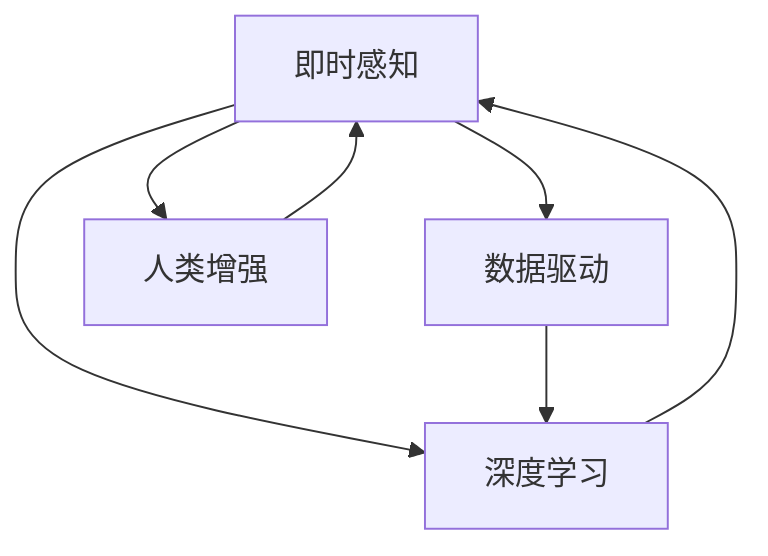

                 

# 体验的时空压缩：AI创造的即时感知

> 关键词：人工智能,即时感知,时空压缩,深度学习,数据驱动,人类增强

## 1. 背景介绍

### 1.1 问题由来
在人类历史上，时间和空间一直是限制人们感知和理解世界的主要因素。随着时间的流逝和空间的限制，人们不得不依赖有限的经验和直觉来理解复杂的自然现象和社会行为。而随着人工智能技术的飞速发展，尤其是深度学习技术的进步，我们开始有能力在更短的时间内、更宽的空间范围内，获取和处理海量数据，实现对世界的即时感知。

在医疗、交通、金融、教育等众多领域，人工智能正在以前所未有的速度，改变着我们的生活和工作方式。无论是通过医学影像的快速分析，还是自动驾驶技术的精确控制，亦或是金融市场的智能预测，人工智能正在让我们的世界变得更加透明、高效和智能。然而，这一切背后，都离不开一个关键的技术：AI创造的即时感知。

### 1.2 问题核心关键点
即时感知技术通过深度学习模型，在短时间内对海量数据进行快速处理和分析，实现对世界的瞬间洞察。这一技术的核心在于：
- 数据的收集与存储：即时感知需要大量高质量的数据作为支撑，数据的质量直接影响着感知结果的准确性和可靠性。
- 模型的训练与优化：即时感知模型的训练需要高效的算法和大规模的计算资源，模型的性能直接决定了感知的即时性和准确性。
- 应用的集成与部署：将即时感知模型应用于实际场景，需要考虑模型的接口设计、性能优化、安全性保障等诸多因素，确保模型在实际应用中能稳定运行。

本文将详细介绍即时感知技术的核心概念和关键算法，并通过实例分析、项目实践和应用场景的展示，带你全面深入理解AI创造的即时感知，探索未来发展的无限可能。

## 2. 核心概念与联系

### 2.1 核心概念概述

为了更好地理解即时感知技术，本节将介绍几个密切相关的核心概念：

- 即时感知(Real-time Perception)：指通过AI技术在极短的时间内，对实时输入的数据进行快速处理和分析，以获得对世界的即时理解。即时感知在医疗影像分析、自动驾驶、金融交易等领域有广泛应用。

- 深度学习(Deep Learning)：一种基于多层神经网络的机器学习技术，通过反向传播算法训练模型，能够学习到数据的深层次特征表示。深度学习是实现即时感知的关键技术之一。

- 数据驱动(Data-Driven)：指通过大量实际数据训练模型，从数据中学习规律和知识，从而实现对世界的高效感知。数据驱动是即时感知技术的基石。

- 人类增强(Human Augmentation)：指通过AI技术提升人类的感知和决策能力，让人们能够更好地理解和应对复杂环境。

这些核心概念之间的逻辑关系可以通过以下Mermaid流程图来展示：



这个流程图展示出即时感知技术的核心概念及其之间的关系：

1. 数据驱动是即时感知的基础，通过大量实际数据训练模型。
2. 深度学习是实现即时感知的关键技术，能够学习到数据的深层次特征。
3. 人类增强是即时感知的最终目标，通过提升人类感知能力，让人们更好地应对复杂环境。

这些概念共同构成了即时感知技术的核心框架，使得AI能够通过深度学习模型，实现对世界的即时理解。

## 3. 核心算法原理 & 具体操作步骤
### 3.1 算法原理概述

即时感知技术主要通过深度学习模型实现，其核心算法包括卷积神经网络(CNN)、循环神经网络(RNN)、变分自编码器(VAE)等。其中，卷积神经网络是最常用的算法之一，广泛应用于图像和视频处理等领域。

卷积神经网络的核心思想是通过卷积层、池化层和全连接层等组成的网络结构，对输入数据进行特征提取和分类。其算法原理包括：
- 卷积层：通过卷积操作提取输入数据的局部特征。
- 池化层：通过池化操作减小特征图尺寸，降低计算复杂度。
- 全连接层：通过全连接操作，将特征图转化为最终的分类结果。

以下是卷积神经网络的基本结构示意图：

```
层1: 卷积层
层2: 激活函数
层3: 池化层
层4: 卷积层
层5: 激活函数
层6: 池化层
层7: 全连接层
层8: 输出层
```

其中，卷积层和池化层通过局部连接和降维操作，提取出图像的局部特征，减少计算量。全连接层将特征图转化为最终的分类结果。

### 3.2 算法步骤详解

基于深度学习的即时感知技术一般包括以下几个关键步骤：

**Step 1: 数据准备与预处理**
- 收集实时数据：如医学影像、交通摄像头、金融市场等。
- 数据清洗与标注：去除噪声数据、标注真实标签。
- 数据增强：通过旋转、裁剪、噪声添加等方式，扩充训练集多样性。

**Step 2: 模型训练**
- 设计模型架构：选择合适的卷积神经网络结构。
- 数据划分：将数据集划分为训练集、验证集和测试集。
- 模型训练：使用优化算法如Adam、SGD等，迭代更新模型参数，最小化损失函数。

**Step 3: 模型评估与优化**
- 在验证集上评估模型性能，调整超参数。
- 在测试集上验证模型泛化能力，进行微调。
- 性能分析：使用混淆矩阵、ROC曲线等指标，分析模型性能。

**Step 4: 部署与集成**
- 将训练好的模型部署到实际应用场景。
- 设计接口与数据流：确保模型与系统无缝集成。
- 性能监控：实时监控模型性能，及时发现和解决问题。

以上是即时感知技术的通用流程，具体应用中还需针对任务特点进行优化。

### 3.3 算法优缺点

基于深度学习的即时感知技术具有以下优点：
- 实时性：通过高效的数据处理和模型推理，能够实现对世界的即时理解。
- 准确性：深度学习模型能够学习到数据的深层次特征，提高感知结果的准确性。
- 泛化能力：通过大量实际数据的训练，模型具备较强的泛化能力，能够适应不同的数据分布。

但该技术也存在一些缺点：
- 计算资源需求高：深度学习模型需要大规模的计算资源进行训练和推理。
- 数据质量依赖强：即时感知结果的准确性依赖于数据的质量和多样性。
- 模型复杂度高：深度学习模型的复杂度较高，容易出现过拟合现象。

尽管存在这些局限性，但即时感知技术仍然是大数据时代下实现对世界快速理解的重要工具。

### 3.4 算法应用领域

基于深度学习的即时感知技术已经在医疗、交通、金融等领域得到广泛应用，具体包括：

- 医学影像分析：通过深度学习模型对医学影像进行快速分析和诊断，如肺结节检测、肿瘤分割等。
- 自动驾驶：通过实时处理车辆传感器数据，实现对道路环境的即时感知，进行精确控制。
- 金融交易：通过实时分析市场数据，预测股票价格走势，实现智能交易。
- 智能监控：通过实时处理视频数据，实现对异常行为的即时检测，提高安防效率。
- 语音识别：通过实时处理音频数据，实现对自然语言的高效识别和理解，推动语音交互的普及。

除了这些经典应用外，即时感知技术还被创新性地应用到更多场景中，如智能客服、智慧城市、虚拟现实等，为人类感知世界提供了新的途径。

## 4. 数学模型和公式 & 详细讲解  
### 4.1 数学模型构建

本节将使用数学语言对即时感知技术的核心算法进行更加严格的刻画。

记输入数据为 $x \in \mathbb{R}^n$，输出标签为 $y \in \{0,1\}$。定义损失函数为交叉熵损失函数 $\ell(x,y)=-[y\log M(x)+(1-y)\log(1-M(x))]$，其中 $M(x)$ 为深度学习模型对输入数据的预测概率。

即时感知模型的训练目标是最小化损失函数，即找到最优参数 $\theta$：

$$
\theta^* = \mathop{\arg\min}_{\theta} \mathcal{L}(\theta)
$$

在实践中，我们通常使用基于梯度的优化算法（如Adam、SGD等）来近似求解上述最优化问题。设 $\eta$ 为学习率，则参数的更新公式为：

$$
\theta \leftarrow \theta - \eta \nabla_{\theta}\mathcal{L}(\theta)
$$

其中 $\nabla_{\theta}\mathcal{L}(\theta)$ 为损失函数对参数 $\theta$ 的梯度，可通过反向传播算法高效计算。

### 4.2 公式推导过程

以医学影像分类为例，推导交叉熵损失函数及其梯度的计算公式。

假设输入数据为一张医学影像，输出标签为正类或负类。通过深度学习模型，得到影像的分类概率 $M(x)$。则交叉熵损失函数定义为：

$$
\ell(x,y) = -[y\log M(x)+(1-y)\log(1-M(x))]
$$

将其代入总体损失函数，得：

$$
\mathcal{L}(\theta) = -\frac{1}{N}\sum_{i=1}^N [y_i\log M(x_i)+(1-y_i)\log(1-M(x_i))]
$$

根据链式法则，损失函数对参数 $\theta_k$ 的梯度为：

$$
\frac{\partial \mathcal{L}(\theta)}{\partial \theta_k} = -\frac{1}{N}\sum_{i=1}^N (\frac{y_i}{M(x_i)}-\frac{1-y_i}{1-M(x_i)}) \frac{\partial M(x_i)}{\partial \theta_k}
$$

其中 $\frac{\partial M(x_i)}{\partial \theta_k}$ 可进一步递归展开，利用自动微分技术完成计算。

在得到损失函数的梯度后，即可带入参数更新公式，完成模型的迭代优化。重复上述过程直至收敛，最终得到适应实时数据的最优模型参数 $\theta^*$。

## 5. 项目实践：代码实例和详细解释说明
### 5.1 开发环境搭建

在进行即时感知实践前，我们需要准备好开发环境。以下是使用Python进行TensorFlow开发的环境配置流程：

1. 安装Anaconda：从官网下载并安装Anaconda，用于创建独立的Python环境。

2. 创建并激活虚拟环境：
```bash
conda create -n tf-env python=3.8 
conda activate tf-env
```

3. 安装TensorFlow：根据CUDA版本，从官网获取对应的安装命令。例如：
```bash
conda install tensorflow -c pytorch -c conda-forge
```

4. 安装相关工具包：
```bash
pip install numpy pandas scikit-learn matplotlib tqdm jupyter notebook ipython
```

完成上述步骤后，即可在`tf-env`环境中开始即时感知实践。

### 5.2 源代码详细实现

这里我们以医学影像分类为例，给出使用TensorFlow对卷积神经网络进行即时感知的PyTorch代码实现。

首先，定义医学影像分类数据处理函数：

```python
import tensorflow as tf
from tensorflow.keras.preprocessing.image import ImageDataGenerator

train_datagen = ImageDataGenerator(rescale=1./255)
train_generator = train_datagen.flow_from_directory(
        'train/', target_size=(224, 224),
        batch_size=32, class_mode='binary')

test_datagen = ImageDataGenerator(rescale=1./255)
test_generator = test_datagen.flow_from_directory(
        'test/', target_size=(224, 224),
        batch_size=32, class_mode='binary')
```

然后，定义模型和优化器：

```python
from tensorflow.keras.applications.resnet50 import ResNet50
from tensorflow.keras.layers import GlobalAveragePooling2D
from tensorflow.keras.models import Model

base_model = ResNet50(weights='imagenet', include_top=False, input_shape=(224, 224, 3))

x = base_model.output
x = GlobalAveragePooling2D()(x)
x = tf.keras.layers.Dense(128, activation='relu')(x)
output = tf.keras.layers.Dense(1, activation='sigmoid')(x)

model = Model(inputs=base_model.input, outputs=output)

optimizer = tf.keras.optimizers.Adam(learning_rate=0.001)
```

接着，定义训练和评估函数：

```python
from tensorflow.keras.callbacks import EarlyStopping

def train_epoch(model, generator, batch_size, optimizer):
    model.fit_generator(generator, steps_per_epoch=train_generator.samples//batch_size, epochs=1, validation_data=test_generator, validation_steps=test_generator.samples//batch_size, callbacks=[EarlyStopping(patience=5)])
    
def evaluate(model, generator, batch_size):
    test_generator.reset()
    _, test_loss, test_acc = model.evaluate_generator(generator, steps=test_generator.samples//batch_size)
    print('Test loss:', test_loss)
    print('Test accuracy:', test_acc)
```

最后，启动训练流程并在测试集上评估：

```python
epochs = 20
batch_size = 32

for epoch in range(epochs):
    train_epoch(model, train_generator, batch_size, optimizer)
    evaluate(model, test_generator, batch_size)
```

以上就是使用TensorFlow对卷积神经网络进行即时感知的完整代码实现。可以看到，通过TensorFlow的Keras API，我们能够用相对简洁的代码完成模型的训练和评估。

### 5.3 代码解读与分析

让我们再详细解读一下关键代码的实现细节：

**医学影像分类数据处理函数**：
- `train_datagen`和`test_datagen`：定义数据增强和预处理策略，将输入数据归一化到0-1之间。
- `train_generator`和`test_generator`：使用`flow_from_directory`加载训练集和测试集，进行批处理和数据增强。

**模型定义**：
- `ResNet50`：选择ResNet50作为基础卷积神经网络结构。
- `GlobalAveragePooling2D`：对卷积层的输出进行全局平均池化操作。
- `Dense`：定义全连接层，输出分类结果。
- `Model`：将输入和输出连接起来，定义最终的分类模型。

**训练和评估函数**：
- `train_epoch`：对数据集进行迭代训练，使用EarlyStopping回调函数防止过拟合。
- `evaluate`：评估模型在测试集上的表现，打印测试损失和准确率。

**训练流程**：
- `epochs`和`batch_size`：设置训练轮数和批次大小。
- `for循环`：每次迭代训练一次，并在测试集上进行评估。

可以看到，通过TensorFlow的Keras API，我们能够将卷积神经网络的构建和训练过程简化为几行代码。这大大降低了即时感知技术的开发门槛，使得开发者可以更加专注于模型优化和性能提升。

当然，工业级的系统实现还需考虑更多因素，如模型的保存和部署、超参数的自动搜索、多模型集成等。但核心的即时感知流程基本与此类似。

## 6. 实际应用场景
### 6.1 医疗影像分析

在医疗领域，即时感知技术可以应用于医学影像的快速分析和诊断。传统的手工分析和诊断耗时耗力，容易出现误诊和漏诊。而通过即时感知技术，能够在极短的时间内，对大量的医学影像进行快速分析和诊断，显著提升医疗效率和诊断准确性。

具体而言，可以收集医院内的医学影像数据，进行标注和预处理。在此基础上，对预训练的卷积神经网络进行微调，使其能够识别出各种疾病和病变。在实际应用中，通过在线上传医学影像，即时感知模型能够快速输出诊断结果，辅助医生进行诊疗决策。

### 6.2 自动驾驶

在自动驾驶领域，即时感知技术可以用于实时处理车辆传感器数据，实现对道路环境的即时感知。传统的手动驾驶模式，存在反应时间慢、决策不够精准等问题。而通过即时感知技术，能够实时感知车辆周围的环境，做出精确的控制决策，保证行车安全。

具体而言，可以在车辆上安装各种传感器，如摄像头、雷达、激光雷达等，实时获取环境数据。通过即时感知技术，对传感器数据进行快速处理和分析，识别出道路中的障碍物、行人、车辆等信息，生成精确的导航路线和驾驶策略。在实际应用中，通过实时处理传感器数据，即时感知系统能够快速响应环境变化，做出精确控制，保证行车安全。

### 6.3 金融交易

在金融领域，即时感知技术可以用于实时分析市场数据，预测股票价格走势，实现智能交易。传统的手动交易模式，容易出现情绪化交易、反应慢等问题。而通过即时感知技术，能够实时感知市场动态，做出精确的交易决策，提高投资回报率。

具体而言，可以收集金融市场的交易数据、新闻资讯、社交媒体信息等，进行标注和预处理。在此基础上，对预训练的卷积神经网络进行微调，使其能够识别出市场趋势和价格波动。在实际应用中，通过实时处理市场数据，即时感知系统能够快速输出投资建议，辅助交易员进行交易决策。

### 6.4 未来应用展望

随着即时感知技术的不断发展，其在更多领域的应用将不断拓展，带来更广泛的影响：

1. 智慧城市：即时感知技术可以用于实时监控和管理城市运行，如交通流量监测、垃圾处理、空气质量检测等。通过实时感知城市动态，提高城市管理效率和应急响应能力。

2. 智能客服：即时感知技术可以用于实时处理客户咨询，生成个性化的回答和解决方案。通过实时感知客户需求，提高客户满意度，提升企业服务质量。

3. 教育培训：即时感知技术可以用于实时评估学生学习效果，提供个性化的学习建议。通过实时感知学习行为，提升教学质量和学生学习效率。

4. 工业制造：即时感知技术可以用于实时监控和管理工业生产过程，如设备故障检测、质量控制、生产调度等。通过实时感知生产动态，提高生产效率和质量控制。

5. 虚拟现实：即时感知技术可以用于实时处理虚拟环境数据，实现虚拟现实场景的实时渲染和交互。通过实时感知虚拟环境，提升用户体验和虚拟现实效果。

未来，伴随即时感知技术的持续演进，其在更多领域的应用将不断拓展，为人类感知世界提供新的途径，开启更加智能、高效的生活和工作方式。

## 7. 工具和资源推荐
### 7.1 学习资源推荐

为了帮助开发者系统掌握即时感知技术的理论基础和实践技巧，这里推荐一些优质的学习资源：

1. 《深度学习》系列书籍：由深度学习领域专家撰写，深入浅出地介绍了深度学习的基本概念和核心算法。

2. TensorFlow官方文档：TensorFlow的官方文档，提供了海量API文档和样例代码，是学习即时感知技术的必备资料。

3. PyTorch官方文档：PyTorch的官方文档，提供了丰富的深度学习框架和模型库，是学习即时感知技术的另一重要工具。

4. Kaggle数据集：Kaggle提供了海量数据集，涵盖医疗、金融、交通等多个领域，是学习即时感知技术的绝佳数据来源。

5. Coursera深度学习课程：由斯坦福大学等知名学府开设的深度学习课程，通过Lecture视频和编程作业，带你全面掌握深度学习技术。

通过学习这些资源，相信你一定能够快速掌握即时感知技术的精髓，并用于解决实际的NLP问题。

### 7.2 开发工具推荐

高效的开发离不开优秀的工具支持。以下是几款用于即时感知开发的常用工具：

1. TensorFlow：由Google主导开发的深度学习框架，生产部署方便，适合大规模工程应用。

2. PyTorch：基于Python的开源深度学习框架，灵活性高，适合快速迭代研究。

3. Keras：TensorFlow的高级API，提供了简单易用的接口，方便快速搭建深度学习模型。

4. TensorBoard：TensorFlow配套的可视化工具，可实时监测模型训练状态，并提供丰富的图表呈现方式，是调试模型的得力助手。

5. Weights & Biases：模型训练的实验跟踪工具，可以记录和可视化模型训练过程中的各项指标，方便对比和调优。

6. Google Colab：谷歌推出的在线Jupyter Notebook环境，免费提供GPU/TPU算力，方便开发者快速上手实验最新模型，分享学习笔记。

合理利用这些工具，可以显著提升即时感知技术的开发效率，加快创新迭代的步伐。

### 7.3 相关论文推荐

即时感知技术的发展源于学界的持续研究。以下是几篇奠基性的相关论文，推荐阅读：

1. AlexNet: ImageNet Classification with Deep Convolutional Neural Networks：提出AlexNet卷积神经网络，实现了在ImageNet数据集上的优异表现。

2. Deep Residual Learning for Image Recognition：提出ResNet网络结构，解决了深度网络训练过程中的梯度消失问题。

3. TensorFlow: A System for Large-Scale Machine Learning：介绍TensorFlow深度学习框架的构建和应用，是学习即时感知技术的必备参考。

4. Understanding Deep Learning Requires Rethinking Generalization：探讨深度学习模型的泛化能力，对即时感知技术的研究具有重要指导意义。

这些论文代表了大语言模型微调技术的发展脉络。通过学习这些前沿成果，可以帮助研究者把握学科前进方向，激发更多的创新灵感。

## 8. 总结：未来发展趋势与挑战

### 8.1 总结

本文对基于深度学习的即时感知技术进行了全面系统的介绍。首先阐述了即时感知技术的背景和意义，明确了其在日常生产生活中应用的重要性。其次，从原理到实践，详细讲解了即时感知技术的数学原理和关键步骤，给出了即时感知任务开发的完整代码实例。同时，本文还广泛探讨了即时感知技术在医疗、交通、金融等众多领域的应用前景，展示了其巨大的潜力。此外，本文精选了即时感知技术的各类学习资源，力求为读者提供全方位的技术指引。

通过本文的系统梳理，可以看到，基于深度学习的即时感知技术正在成为大数据时代下实现对世界快速理解的重要工具。其在医疗影像分析、自动驾驶、金融交易等领域的应用，已经显著提升了各行业的效率和质量。未来，伴随技术的不断进步，即时感知技术将在更多领域得到应用，为人类感知世界带来革命性的变化。

### 8.2 未来发展趋势

展望未来，深度学习的即时感知技术将呈现以下几个发展趋势：

1. 计算资源规模化：随着计算资源的不断扩展，即时感知技术将能够处理更大规模的数据集，实现更高精度的感知结果。

2. 模型结构的优化：通过引入自适应层、注意力机制等先进技术，优化卷积神经网络结构，提高模型的感知能力和泛化能力。

3. 多模态数据融合：通过融合视觉、听觉、语言等多种模态数据，实现更全面、更深入的即时感知。

4. 实时性进一步提升：通过优化数据处理和模型推理算法，进一步提高即时感知技术的实时性，实现毫秒级响应。

5. 应用场景的拓展：在更多领域，如智慧城市、智能客服、工业制造等，即时感知技术将得到广泛应用，提升各行业的智能化水平。

以上趋势凸显了即时感知技术的广阔前景。这些方向的探索发展，必将进一步提升NLP系统的性能和应用范围，为人类感知世界提供新的途径。

### 8.3 面临的挑战

尽管深度学习的即时感知技术已经取得了瞩目成就，但在迈向更加智能化、普适化应用的过程中，仍面临诸多挑战：

1. 计算资源瓶颈：深度学习模型需要大规模的计算资源进行训练和推理，如何高效利用计算资源，是亟待解决的难题。

2. 数据质量和多样性：即时感知结果的准确性依赖于数据质量和多样性，如何获取高质量、多样化的数据，也是一大挑战。

3. 模型复杂性和解释性：深度学习模型结构复杂，难以解释其内部工作机制和决策逻辑。如何在保证性能的同时，增强模型的可解释性，也将是重要的研究课题。

4. 应用场景的复杂性：不同领域的应用场景复杂多样，如何在特定场景下优化模型，实现高效、稳定的感知，也需要不断探索。

5. 伦理和隐私问题：在应用即时感知技术时，如何确保数据的安全性和隐私保护，也是亟待解决的问题。

6. 技术实现的复杂性：即时感知技术需要综合应用深度学习、数据处理、系统集成等多种技术，技术实现复杂度高，需要多方协作才能实现。

正视即时感知技术面临的这些挑战，积极应对并寻求突破，将是大语言模型微调走向成熟的必由之路。相信随着学界和产业界的共同努力，这些挑战终将一一被克服，即时感知技术必将在构建智能感知世界中扮演越来越重要的角色。

### 8.4 研究展望

未来，在深度学习即时感知技术的研究上，还需要在以下几个方面寻求新的突破：

1. 探索更高效的数据处理和模型推理算法，提高计算效率和实时性。

2. 研究如何利用多模态数据融合技术，提升即时感知技术的感知能力和应用范围。

3. 开发更灵活、可扩展的深度学习框架和模型库，支持更多应用场景的即时感知。

4. 引入更多的先验知识和领域专家的经验，优化模型设计和训练过程。

5. 加强模型的可解释性和伦理性，确保应用的安全和公平。

这些研究方向的探索，必将引领深度学习即时感知技术迈向更高的台阶，为人类感知世界提供新的途径，推动人工智能技术的进一步发展。面向未来，深度学习即时感知技术需要与其他人工智能技术进行更深入的融合，如知识表示、因果推理、强化学习等，多路径协同发力，共同推动人工智能技术的进步。只有勇于创新、敢于突破，才能不断拓展人工智能的边界，让智能技术更好地造福人类社会。

## 9. 附录：常见问题与解答

**Q1：即时感知技术是否适用于所有应用场景？**

A: 深度学习的即时感知技术在处理数据量较大、特征复杂的场景时表现优异，但并不适用于所有应用场景。对于数据量较小、特征简单的场景，传统的手动处理方式可能更加高效。

**Q2：如何优化即时感知模型的计算效率？**

A: 优化即时感知模型的计算效率，可以从以下几个方面入手：
1. 数据增强：通过回译、裁剪、噪声添加等方式，扩充训练集多样性。
2. 模型压缩：使用剪枝、量化、低秩分解等方法，减少模型参数量和计算量。
3. 硬件优化：利用GPU、TPU等高性能设备，加速模型推理过程。
4. 网络架构优化：引入自适应层、注意力机制等先进技术，优化模型结构。

**Q3：即时感知技术在实际应用中需要注意哪些问题？**

A: 将即时感知模型应用于实际场景，还需要考虑以下因素：
1. 模型接口设计：确保模型与系统无缝集成，提供易用的接口。
2. 性能监控：实时监测模型性能，及时发现和解决问题。
3. 安全性保障：采用访问鉴权、数据脱敏等措施，保障数据和模型安全。

**Q4：即时感知技术在未来有哪些发展方向？**

A: 未来的即时感知技术将向以下几个方向发展：
1. 融合更多模态数据：融合视觉、听觉、语言等多种模态数据，实现更全面、深入的感知。
2. 引入更多的先验知识：将符号化的先验知识，如知识图谱、逻辑规则等，与神经网络模型进行融合，优化模型设计和训练过程。
3. 加强模型的可解释性和伦理性：引入因果分析、博弈论等工具，增强模型输出的解释性和伦理性，确保应用的安全和公平。

这些方向的探索发展，将引领即时感知技术迈向更高的台阶，为构建智能感知世界提供新的途径。

---

作者：禅与计算机程序设计艺术 / Zen and the Art of Computer Programming

