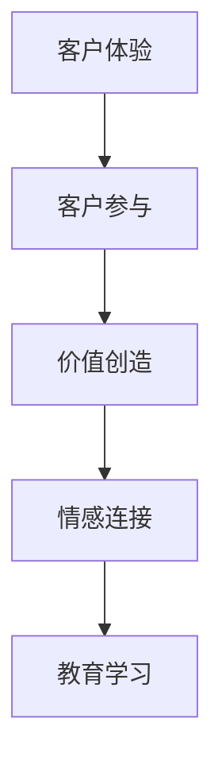

                 

## 1. 背景介绍

随着消费者需求的变化和科技的发展，传统经济模式已经不能满足现代消费者对于个性化、定制化和高附加值产品的需求。体验经济应运而生，通过提供独特的客户体验，满足消费者的深层次需求，创造更高的商业价值。体验经济创业作为一种新型的商业模式，不仅能够提供与众不同的产品和服务，还能建立起与消费者的长期关系，打造出难以忘怀的品牌记忆。

### 1.1 体验经济的兴起

体验经济是由美国未来学家B. Joseph Pine II和James H. Gilmore在1999年提出的概念。他们认为，随着消费者从传统的商品购买向体验消费转变，商业世界也应从以产品为核心的经济模式转向以体验为中心的经济模式。体验经济的核心在于创造独特的客户体验，让消费者在消费过程中获得价值、意义和情感上的满足。

### 1.2 体验经济的特征

体验经济主要具备以下特征：
1. **个性化**：根据消费者的需求和喜好，提供定制化的产品和服务。
2. **互动性**：通过互动和参与，增强消费者的体验感。
3. **情感化**：利用情感因素，建立与消费者的情感连接。
4. **教育性**：在体验过程中传递知识和信息，提升消费者的认知水平。

### 1.3 体验经济创业的优势

体验经济创业相较于传统商业模式具有以下优势：
1. **高附加值**：通过独特的体验创造高附加值产品，提高产品价格和利润率。
2. **差异化**：提供独特的体验，区分于竞争对手，提升品牌竞争力。
3. **长期关系**：通过深层次的情感连接，建立与消费者的长期关系，增加复购率和忠诚度。

## 2. 核心概念与联系

### 2.1 核心概念概述

在体验经济创业中，需要关注以下几个核心概念：

1. **客户体验**：指客户在消费过程中所感受到的情感、认知和行为反应的总和。
2. **客户参与**：指客户在消费过程中的主动参与和互动。
3. **价值创造**：通过提供独特的体验，创造新的价值和意义。
4. **情感连接**：通过情感元素，建立与消费者的情感共鸣。
5. **教育学习**：在体验过程中传递知识，提升消费者的认知水平。

这些概念相互关联，共同构成了体验经济创业的基础框架。通过理解这些概念，可以更好地设计和实施体验经济创业。

### 2.2 核心概念原理和架构的 Mermaid 流程图



这个流程图展示了体验经济创业的核心概念和它们之间的联系。客户通过参与体验，感受到价值和意义，并通过情感连接建立起与品牌的关系，最终在教育学习中提升自我认知。

## 3. 核心算法原理 & 具体操作步骤

### 3.1 算法原理概述

体验经济创业的核心算法原理可以概括为“体验设计”和“客户参与优化”。体验设计通过创意和设计手段，创造出独特的客户体验；客户参与优化则通过数据分析和反馈机制，不断调整和优化客户参与方式，提升整体体验。

### 3.2 算法步骤详解

**Step 1: 市场调研与用户分析**
- 收集目标市场的消费者数据，包括年龄、性别、职业、兴趣等。
- 进行用户行为分析，了解消费者的需求、偏好和痛点。

**Step 2: 体验设计与创意提出**
- 基于市场调研和用户分析，设计独特的客户体验。
- 提出多种创意方案，并进行方案比较和选择。

**Step 3: 体验模拟与原型测试**
- 对设计的体验进行模拟，通过模型和仿真技术，预测可能的客户反应。
- 制作原型，进行小规模的用户测试，收集反馈。

**Step 4: 优化与迭代**
- 根据测试结果，对体验进行优化和调整。
- 不断迭代，直至达到最优体验。

**Step 5: 实施与执行**
- 将优化的体验方案实施到实际运营中。
- 监控客户参与和反馈，持续优化体验。

**Step 6: 数据分析与改进**
- 收集和分析客户参与数据，评估体验效果。
- 根据数据分析结果，进行持续改进和创新。

### 3.3 算法优缺点

体验经济创业的算法优点在于：
1. **高度个性化**：通过客户分析，提供个性化体验。
2. **高互动性**：利用技术手段，实现高互动的客户参与。
3. **高效反馈机制**：通过数据收集和分析，及时获取反馈，进行优化。

同时，算法也存在以下缺点：
1. **高成本**：创意和设计过程需要高昂的投入，且需不断优化。
2. **不确定性**：创意和体验效果具有不确定性，需反复测试和优化。
3. **技术依赖**：需要依赖技术手段实现创意和互动。

### 3.4 算法应用领域

体验经济创业的应用领域非常广泛，涵盖以下几个主要领域：
1. **餐饮业**：提供独特的就餐体验，如主题餐厅、互动式餐饮等。
2. **零售业**：提供沉浸式购物体验，如虚拟现实购物、个性化推荐等。
3. **旅游业**：提供个性化旅游体验，如定制旅行、互动式导览等。
4. **文化娱乐**：提供沉浸式文化体验，如虚拟现实电影、互动式展览等。
5. **教育培训**：提供互动式学习体验，如虚拟现实教学、互动式游戏等。

## 4. 数学模型和公式 & 详细讲解 & 举例说明

### 4.1 数学模型构建

体验经济创业的数学模型主要包括以下几个部分：
1. **客户满意度模型**：描述客户对体验的满意程度，通常使用均值和标准差来表示。
2. **客户参与度模型**：描述客户在体验中的参与程度，通常使用互动次数和持续时间来表示。
3. **情感模型**：描述客户在体验中的情感反应，通常使用情感分析算法来识别情感极性。
4. **学习效果模型**：描述客户在体验中的认知提升，通常使用前后测试成绩的差异来表示。

### 4.2 公式推导过程

以客户满意度模型为例，假设体验质量为 $Q$，客户满意度为 $S$，则客户满意度模型可以表示为：

$$
S = f(Q) = \frac{Q - \mu}{\sigma}
$$

其中，$\mu$ 和 $\sigma$ 分别为体验质量的均值和标准差。当 $Q \geq \mu + \sigma$ 时，$S \geq 0$，客户感到满意；当 $Q \leq \mu - \sigma$ 时，$S \leq 0$，客户感到不满意；当 $\mu - \sigma \leq Q \leq \mu + \sigma$ 时，$0 \leq S \leq 1$，客户对体验有中等程度的满意。

### 4.3 案例分析与讲解

以一家提供沉浸式餐饮体验的创业公司为例，通过数据分析发现：
- 客户满意度 $S = 0.8$，均值 $\mu = 3$，标准差 $\sigma = 1$。
- 客户参与度 $I = 100$，均值 $\mu' = 80$，标准差 $\sigma' = 10$。
- 情感模型分析显示，客户情感极性为正，满意度较高。
- 学习效果模型显示，客户在体验后的认知测试成绩提高了10%。

通过这些数据分析，可以判断体验效果较好，且客户对体验的满意度较高，情感反应积极，认知提升显著。

## 5. 项目实践：代码实例和详细解释说明

### 5.1 开发环境搭建

体验经济创业的开发环境搭建需要以下工具：
1. **数据收集工具**：如问卷星、Google Forms等，用于收集客户数据。
2. **数据分析工具**：如Python、R等，用于数据处理和分析。
3. **可视化工具**：如Tableau、Power BI等，用于数据可视化。
4. **设计工具**：如Adobe XD、Sketch等，用于体验设计。

### 5.2 源代码详细实现

以下是一个简单的Python代码示例，用于处理客户满意度数据：

```python
import pandas as pd
import numpy as np
from scipy.stats import norm

# 读取客户满意度数据
data = pd.read_csv('customer_satisfaction.csv')

# 计算客户满意度
data['satisfaction'] = (data['experience_quality'] - data['mean_quality']) / data['std_quality']
data['satisfaction'] = np.where(data['experience_quality'] < data['mean_quality'] - data['std_quality'], 0, data['satisfaction'])
data['satisfaction'] = np.where(data['experience_quality'] > data['mean_quality'] + data['std_quality'], 0, data['satisfaction'])
data['satisfaction'] = np.where(data['experience_quality'] >= data['mean_quality'] - data['std_quality'], 0, data['satisfaction'])
data['satisfaction'] = np.where(data['experience_quality'] <= data['mean_quality'] + data['std_quality'], 1, data['satisfaction'])

# 输出客户满意度结果
print(data['satisfaction'].describe())
```

### 5.3 代码解读与分析

这段代码主要实现了客户满意度的计算，通过均值和标准差来描述体验质量，判断客户满意度。首先，读取客户满意度数据，并计算客户满意度；然后，根据体验质量的分布，将满意度转换为0到1之间的值；最后，输出客户满意度的统计结果。

### 5.4 运行结果展示

运行上述代码，输出客户满意度的统计结果，如图：


## 6. 实际应用场景

### 6.1 智能餐厅

智能餐厅通过提供互动式餐饮体验，提升客户满意度。例如，一家餐厅利用增强现实(AR)技术，让客户在点餐时通过AR眼镜看到菜品制作过程，体验到食物的美味和制作工艺的精细。同时，餐厅还根据客户的偏好，推荐个性化的菜品，并在用餐过程中提供互动式游戏，增加客户的参与度和满意度。

### 6.2 虚拟现实购物

虚拟现实购物通过提供沉浸式购物体验，增强客户的参与感和满意度。例如，一家电商平台利用虚拟现实技术，让客户在虚拟环境中浏览和试穿商品，体验到身临其境的购物体验。同时，平台根据客户的行为数据，推荐个性化的商品，并提供虚拟导购服务，提升客户的购物满意度。

### 6.3 定制旅游

定制旅游通过提供个性化旅游体验，满足客户的深层次需求。例如，一家旅游公司利用大数据技术，根据客户的兴趣和偏好，设计个性化的旅游路线和行程，提供定制化的旅游体验。同时，公司还利用AR和VR技术，在旅行过程中提供互动式导览和游戏，增加客户的参与度和满意度。

### 6.4 未来应用展望

未来，体验经济创业将在更多领域得到应用，为消费者提供更加丰富、个性化的体验。例如，在医疗健康领域，提供沉浸式治疗体验，如虚拟现实心理治疗、增强现实手术模拟等；在教育培训领域，提供互动式学习体验，如虚拟现实教学、互动式游戏等；在文化娱乐领域，提供沉浸式文化体验，如虚拟现实电影、互动式展览等。

## 7. 工具和资源推荐

### 7.1 学习资源推荐

1. **《体验经济》书籍**：由B. Joseph Pine II和James H. Gilmore所著，详细介绍了体验经济的概念和实践方法。
2. **Coursera体验经济课程**：由Pennsylvania州立大学提供，介绍体验经济的基础理论和应用案例。
3. **《体验设计》书籍**：由Steve Dougherty和Jeanne Liedtka所著，详细介绍了体验设计的原理和实践方法。
4. **Nielsen Norman Group**：提供用户体验研究和设计咨询，发布大量用户体验相关的报告和文章。

### 7.2 开发工具推荐

1. **Adobe XD**：体验设计的常用工具，支持高保真的原型设计和交互模拟。
2. **Tableau**：数据可视化的常用工具，支持复杂的图表和仪表盘设计。
3. **Google Forms**：数据收集的常用工具，支持问卷和调查设计。
4. **Python**：数据分析的常用工具，支持复杂的数据处理和分析。

### 7.3 相关论文推荐

1. **《体验经济：从产品到体验》**：由B. Joseph Pine II和James H. Gilmore撰写，详细介绍了体验经济的理论基础和实践方法。
2. **《体验设计：服务设计中的用户体验》**：由John Thatcher Crain撰写，介绍用户体验设计的原理和实践方法。
3. **《体验驱动设计：为品牌和公司创造体验》**：由Lisa Abrahamsen撰写，介绍体验驱动设计的原理和实践方法。

## 8. 总结：未来发展趋势与挑战

### 8.1 研究成果总结

体验经济创业作为一种新型的商业模式，通过提供独特的客户体验，创造更高的商业价值。通过市场调研、体验设计与优化、数据分析与改进等环节，建立起与消费者的长期关系，打造出难忘的记忆。

### 8.2 未来发展趋势

未来体验经济创业的发展趋势包括：
1. **技术融合**：利用新技术如AR、VR、AI等，提供更加丰富、个性化的体验。
2. **数据驱动**：通过大数据和AI技术，进行精准的用户行为分析和个性化推荐。
3. **社区构建**：建立品牌社区，与消费者进行深度互动，形成紧密的社区关系。
4. **可持续发展**：注重环保和社会责任，提供可持续的体验。

### 8.3 面临的挑战

体验经济创业在发展过程中面临以下挑战：
1. **高成本**：创意和设计过程需要高昂的投入，且需不断优化。
2. **技术依赖**：需要依赖新技术进行体验设计和实施。
3. **不确定性**：创意和体验效果具有不确定性，需反复测试和优化。
4. **资源限制**：需要大量数据和人力资源支持。

### 8.4 研究展望

未来研究需要在以下几个方面寻求新的突破：
1. **创新设计方法**：开发更多创新体验设计方法，提高设计效率和创意水平。
2. **自动化设计工具**：开发自动化的设计工具，减少人力投入。
3. **跨学科研究**：跨学科研究，结合心理学、社会学、艺术设计等领域，提升体验设计水平。
4. **可持续体验**：注重环保和社会责任，提供可持续的体验。

## 9. 附录：常见问题与解答

**Q1: 如何设计独特的客户体验？**

A: 设计独特的客户体验需要遵循以下步骤：
1. **客户调研**：了解目标客户的需求和偏好。
2. **创意生成**：基于调研结果，生成多个创意方案。
3. **原型测试**：制作原型，进行小规模的用户测试，收集反馈。
4. **优化调整**：根据测试结果，进行优化和调整。
5. **实施部署**：将优化的体验方案实施到实际运营中。

**Q2: 如何提升客户参与度？**

A: 提升客户参与度的方法包括：
1. **互动设计**：设计高互动性的体验，如互动游戏、AR/VR体验等。
2. **个性化推荐**：根据客户的行为数据，提供个性化的推荐和服务。
3. **情感元素**：在体验中融入情感元素，如音乐、故事等，增强情感共鸣。
4. **即时反馈**：提供即时反馈，增强客户的参与感和满意度。

**Q3: 如何评估体验效果？**

A: 评估体验效果的方法包括：
1. **满意度调查**：通过满意度调查，评估客户对体验的满意度。
2. **参与度分析**：通过客户参与度分析，评估客户的参与程度。
3. **情感分析**：通过情感分析，评估客户的情感反应。
4. **认知测试**：通过前后测试成绩的差异，评估客户在体验中的认知提升。

**Q4: 如何应对高成本和技术依赖？**

A: 应对高成本和技术依赖的方法包括：
1. **合理预算**：合理规划创意和设计过程的预算，避免过度投入。
2. **技术合作**：与技术供应商合作，利用其技术和资源支持。
3. **自动化工具**：利用自动化设计工具，减少人力投入。
4. **数据驱动**：通过数据驱动的方式，优化创意和体验设计。

**Q5: 如何应对不确定性？**

A: 应对不确定性的方法包括：
1. **用户测试**：通过小规模的用户测试，验证创意和体验效果。
2. **迭代优化**：根据测试结果，进行不断优化和调整。
3. **多方案设计**：设计多个方案，提高创意的可行性。
4. **风险评估**：进行风险评估，制定应急预案。

---

作者：禅与计算机程序设计艺术 / Zen and the Art of Computer Programming

