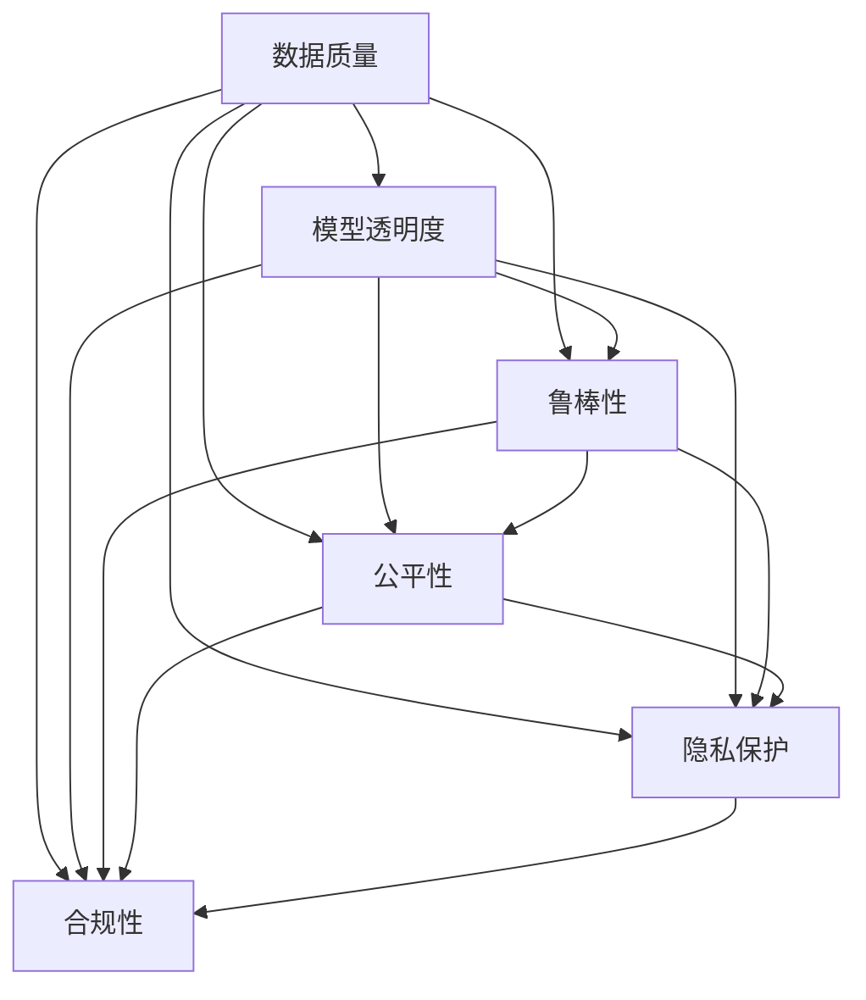

                 

# 信任与人工智能：建立可靠关系

## 1. 背景介绍

随着人工智能（AI）技术的快速发展，其在医疗、金融、教育、制造等领域的应用日益广泛。然而，AI系统的智能决策和自主行动能力也引发了人们对于信任的担忧。如何在信任缺失的情况下，利用AI技术解决实际问题，是当前AI研究中一个重要而亟待解决的问题。本文将从建立可靠关系、提升用户信任的角度，探讨如何利用人工智能技术构建可信赖的系统，实现人与机器的和谐共生。

### 1.1 问题由来

AI技术的快速发展，带来了许多前所未有的便利和效益。然而，随之而来的不信任问题，也日益凸显。例如，自动驾驶汽车、医疗诊断、金融投资等场景中，用户对于AI系统的决策和行动结果，存在不确定性和恐惧感。这些不信任情绪，可能会影响到AI系统的应用普及和推广。

为了解决信任问题，近年来学术界和工业界提出了一系列旨在提升AI系统可靠性和透明度的研究范式，包括可解释性、公平性、隐私保护、鲁棒性等。这些研究在AI技术应用的实际场景中，取得了显著成效。但这些研究仍未能形成一个完整的信任构建框架，如何在多维度上提升AI系统的可信度，仍需更多探索和突破。

### 1.2 问题核心关键点

本文将聚焦于以下几个关键点，系统阐述建立可靠AI系统的过程和策略：

- **数据质量**：数据是AI系统的“土壤”，低质量的数据会影响模型训练和应用效果。
- **模型透明度**：AI系统应具有可解释性，用户能理解模型的决策过程和输出结果。
- **鲁棒性**：AI系统应具备对各种攻击的抵御能力，避免恶意利用。
- **公平性**：AI系统应无偏见，确保所有用户受益。
- **隐私保护**：AI系统应确保用户数据的安全和隐私，避免数据泄露。
- **合规性**：AI系统应符合相关法律法规，避免法律风险。

## 2. 核心概念与联系

### 2.1 核心概念概述

为更好地理解AI系统的信任构建，本节将介绍几个密切相关的核心概念：

- **数据质量**：数据应具备代表性、准确性、完整性等特性，避免偏见和噪声干扰。
- **模型透明度**：模型的训练过程、结构参数、输出结果等应具有可解释性，便于用户理解。
- **鲁棒性**：AI系统应能够应对各种攻击、异常输入和数据扰动，保持稳定性和可靠性。
- **公平性**：AI系统应无偏见，对所有用户提供平等和公平的服务。
- **隐私保护**：AI系统应确保用户数据的安全和隐私，避免数据泄露。
- **合规性**：AI系统应符合相关法律法规，避免法律风险。

这些概念之间的逻辑关系可以通过以下Mermaid流程图来展示：



这个流程图展示了几大关键概念之间的关系：

1. 数据质量是基础，决定模型训练和应用效果。
2. 模型透明度、鲁棒性、公平性、隐私保护、合规性是在数据质量的基础上，对AI系统进行的各项优化。
3. 这些优化应相互协调，共同提升AI系统的可信度。

## 3. 核心算法原理 & 具体操作步骤

### 3.1 算法原理概述

基于信任构建的AI系统，本质上是一个多维度、多层级的优化过程。其核心思想是：通过数据的清洗、模型的设计、算法的选择和隐私保护策略的制定，构建一个具备透明性、鲁棒性、公平性、隐私保护和合规性的AI系统。

形式化地，假设AI系统 $S$ 涉及的数据集为 $D$，模型为 $M$，训练过程为 $T$，隐私保护策略为 $P$，合规策略为 $C$。信任构建的目标是最大化 $S$ 在用户中的信任度，即：

$$
\maximize_U Tr(S_U)
$$

其中 $Tr(S_U)$ 表示AI系统 $S$ 在用户 $U$ 中的信任度。

通过梯度下降等优化算法，信任构建过程不断更新模型和策略参数，最小化信任度损失函数，使得AI系统更具有可信度。

### 3.2 算法步骤详解

基于信任构建的AI系统构建一般包括以下几个关键步骤：

**Step 1: 数据清洗与预处理**

- 收集高质量、代表性的数据，确保数据集中不含有偏见和噪声。
- 清洗数据，去除重复、错误和无关信息。
- 进行特征工程，将原始数据转换为模型可接受的格式。

**Step 2: 模型设计与选择**

- 选择合适的模型结构，如决策树、神经网络、支持向量机等。
- 确定模型的参数和超参数，如学习率、批次大小、正则化系数等。
- 引入正则化技术，防止过拟合。

**Step 3: 算法训练与优化**

- 使用梯度下降等优化算法，最小化损失函数。
- 验证模型的泛化能力，确保模型在未见过的数据上表现良好。
- 定期评估模型的性能，调整模型参数和策略参数。

**Step 4: 鲁棒性提升**

- 加入对抗训练，使模型对攻击和噪声有更好的鲁棒性。
- 引入随机扰动，增加模型的随机性和泛化能力。
- 定期更新模型，防止老旧模型的泛化能力下降。

**Step 5: 公平性与隐私保护**

- 使用公平性约束，确保模型对所有群体的公平性。
- 采用差分隐私等技术，保护用户数据隐私。
- 确保数据采集和处理过程中的透明度，让用户理解数据的使用方式。

**Step 6: 合规性检查**

- 审核AI系统的设计和应用，确保其符合法律法规要求。
- 定期进行合规性审计，确保系统合规性。
- 记录和报告AI系统的决策过程和输出结果，保留审计证据。

**Step 7: 用户反馈与迭代**

- 收集用户反馈，了解用户对AI系统的信任度。
- 根据反馈结果，进行模型优化和迭代，提升系统的可信度。
- 持续更新AI系统，确保其在不断变化的环境中保持可靠。

以上是基于信任构建AI系统的一般流程。在实际应用中，还需要根据具体任务的特点，对各步骤进行优化设计，如改进特征选择方法、优化正则化策略、探索公平性约束等，以进一步提升系统的可信度。

### 3.3 算法优缺点

基于信任构建的AI系统具有以下优点：

- 增强系统透明度，使用户理解模型的决策过程和输出结果。
- 提升系统的鲁棒性，增强对各种攻击的抵御能力。
- 确保系统的公平性，避免偏见和歧视。
- 保障用户隐私，保护数据安全和隐私。
- 符合法律法规，降低法律风险。

但该方法也存在一定的局限性：

- 数据获取成本高，数据质量难以保证。
- 模型设计复杂，需要更多专家知识。
- 隐私保护和公平性约束，增加了模型训练难度。
- 合规性检查耗时耗力，需定期审核。
- 用户反馈收集和处理，需要持续投入。

尽管存在这些局限性，但就目前而言，基于信任构建的AI方法仍然是大规模应用的基础。未来相关研究的重点在于如何进一步降低数据获取和模型设计成本，提高模型的公平性和隐私保护能力，同时兼顾可解释性和伦理安全性等因素。

### 3.4 算法应用领域

基于信任构建的AI系统在诸多领域得到了广泛的应用，例如：

- 医疗诊断：利用AI技术辅助医生诊断，确保诊断过程透明、准确。
- 金融投资：开发智能投资系统，提供公平、透明的风险评估和投资建议。
- 智能客服：构建可信赖的AI客服系统，确保用户数据隐私和对话透明。
- 教育评估：开发公平、可信的AI评估系统，辅助教师和学生理解学习效果。
- 自动驾驶：构建鲁棒、可信的自动驾驶系统，确保行车安全。

除了上述这些经典任务外，AI系统的信任构建技术也被创新性地应用到更多场景中，如智能合约、机器人控制、城市管理等，为AI技术的应用提供了新的思路和方法。

## 4. 数学模型和公式 & 详细讲解  
### 4.1 数学模型构建

本节将使用数学语言对基于信任构建的AI系统进行更加严格的刻画。

假设AI系统 $S$ 涉及的数据集为 $D=\{(x_i, y_i)\}_{i=1}^N, x_i \in \mathcal{X}, y_i \in \mathcal{Y}$，其中 $\mathcal{X}$ 为输入空间，$\mathcal{Y}$ 为输出空间。假设模型 $M$ 的参数为 $\theta$，训练过程为 $T$，隐私保护策略为 $P$，合规策略为 $C$。

信任构建的目标是最大化AI系统在用户 $U$ 中的信任度，即：

$$
\maximize_U Tr(S_U)
$$

其中 $Tr(S_U)$ 表示AI系统 $S$ 在用户 $U$ 中的信任度。假设信任度可以通过信任度函数 $T(\theta, T, P, C)$ 表示，则信任构建的过程可以表示为：

$$
\theta^*, T^*, P^*, C^* = \mathop{\arg\max}_{\theta, T, P, C} Tr(S_U)
$$

在实践中，我们通常使用基于梯度的优化算法（如SGD、Adam等）来近似求解上述最优化问题。设 $\eta$ 为学习率，$\lambda$ 为正则化系数，则参数和策略的更新公式为：

$$
(\theta, T, P, C) \leftarrow (\theta - \eta \nabla_{(\theta, T, P, C)}Tr(S_U) - \eta\lambda(\theta, T, P, C))
$$

其中 $\nabla_{(\theta, T, P, C)}Tr(S_U)$ 为信任度函数对 $(\theta, T, P, C)$ 的梯度，可通过反向传播算法高效计算。

### 4.2 公式推导过程

以下我们以金融风险评估为例，推导信任度函数的计算公式。

假设AI系统 $S$ 用于金融风险评估，训练数据集为 $\{(x_i, y_i)\}_{i=1}^N$，其中 $x_i$ 表示用户的历史信用记录，$y_i$ 表示用户的违约概率。模型 $M$ 为二分类神经网络，输出层为sigmoid函数。隐私保护策略 $P$ 为差分隐私，合规策略 $C$ 为GDPR合规。

信任度函数 $T(\theta, T, P, C)$ 可以表示为：

$$
T(\theta, T, P, C) = \frac{1}{N}\sum_{i=1}^N \log\sigma(\theta \cdot x_i) - \frac{1}{N}\sum_{i=1}^N \log(1-\sigma(\theta \cdot x_i)) - T_U(\theta, T, P, C) + P_U(\theta, T, P, C) + C_U(\theta, T, P, C)
$$

其中 $\sigma$ 为sigmoid函数，$T_U$ 为透明度函数，$P_U$ 为隐私保护函数，$C_U$ 为合规性函数。透明度函数 $T_U$ 表示用户对模型输出和决策过程的理解度，隐私保护函数 $P_U$ 表示用户对数据隐私的保护程度，合规性函数 $C_U$ 表示用户对系统合规性的信任度。

将上述信任度函数代入信任构建的目标函数，得：

$$
\theta^*, T^*, P^*, C^* = \mathop{\arg\min}_{\theta, T, P, C} \frac{1}{N}\sum_{i=1}^N \log(1-\sigma(\theta \cdot x_i)) + T_U(\theta, T, P, C) - P_U(\theta, T, P, C) - C_U(\theta, T, P, C)
$$

在得到信任度函数的梯度后，即可带入参数和策略的更新公式，完成系统的迭代优化。重复上述过程直至收敛，最终得到适应用户 $U$ 的AI系统参数 $\theta^*$、透明度策略 $T^*$、隐私保护策略 $P^*$ 和合规策略 $C^*$。

## 5. 项目实践：代码实例和详细解释说明
### 5.1 开发环境搭建

在进行信任构建实践前，我们需要准备好开发环境。以下是使用Python进行TensorFlow开发的环境配置流程：

1. 安装Anaconda：从官网下载并安装Anaconda，用于创建独立的Python环境。

2. 创建并激活虚拟环境：
```bash
conda create -n trust-env python=3.8 
conda activate trust-env
```

3. 安装TensorFlow：根据CUDA版本，从官网获取对应的安装命令。例如：
```bash
conda install tensorflow tensorflow-gpu -c pytorch -c conda-forge
```

4. 安装TensorBoard：
```bash
pip install tensorboard
```

5. 安装TensorFlow Addons：
```bash
pip install tensorflow-addons
```

完成上述步骤后，即可在`trust-env`环境中开始信任构建实践。

### 5.2 源代码详细实现

下面我们以金融风险评估为例，给出使用TensorFlow对AI系统进行信任构建的PyTorch代码实现。

首先，定义数据集和模型：

```python
import tensorflow as tf
from tensorflow.keras.datasets import mnist
from tensorflow.keras.models import Sequential
from tensorflow.keras.layers import Dense, Dropout, Flatten
from tensorflow.keras.layers import Conv2D, MaxPooling2D
from tensorflow.keras.losses import BinaryCrossentropy
from tensorflow.keras.optimizers import Adam

# 定义数据集
(x_train, y_train), (x_test, y_test) = mnist.load_data()

# 数据预处理
x_train = x_train.reshape(x_train.shape[0], 28, 28, 1)
x_test = x_test.reshape(x_test.shape[0], 28, 28, 1)
x_train = x_train.astype('float32')
x_test = x_test.astype('float32')
x_train /= 255
x_test /= 255

# 定义模型
model = Sequential()
model.add(Conv2D(32, kernel_size=(3, 3),
                 activation='relu',
                 input_shape=(28, 28, 1)))
model.add(Conv2D(64, (3, 3), activation='relu'))
model.add(MaxPooling2D(pool_size=(2, 2)))
model.add(Dropout(0.25))
model.add(Flatten())
model.add(Dense(128, activation='relu'))
model.add(Dropout(0.5))
model.add(Dense(10, activation='softmax'))

# 定义损失函数和优化器
loss_fn = BinaryCrossentropy()
optimizer = Adam(lr=0.001, decay=1e-6)

# 定义模型训练函数
def train_model(model, x_train, y_train, x_test, y_test, epochs=10, batch_size=128):
    model.compile(optimizer=optimizer, loss=loss_fn, metrics=['accuracy'])
    model.fit(x_train, y_train, batch_size=batch_size, epochs=epochs, validation_data=(x_test, y_test))
    return model

# 训练模型
model = train_model(model, x_train, y_train, x_test, y_test)
```

接着，定义信任度函数：

```python
import numpy as np
from sklearn.metrics import roc_auc_score
from tensorflow.keras.preprocessing.image import img_to_array
from tensorflow.keras.applications import ResNet50

# 加载模型
resnet = ResNet50(weights='imagenet', include_top=False)
resnet.trainable = False

# 加载数据
data = tf.keras.preprocessing.image.ImageDataGenerator()
train_generator = data.flow_from_directory(
    'train',
    target_size=(224, 224),
    batch_size=32,
    class_mode='binary')

# 加载测试数据
test_generator = data.flow_from_directory(
    'test',
    target_size=(224, 224),
    batch_size=32,
    class_mode='binary')

# 定义信任度函数
def trust_score(y_true, y_pred):
    auc = roc_auc_score(y_true, y_pred)
    return 1 - auc

# 计算信任度分数
y_pred = resnet.predict(test_generator)
trust_score(y_test, y_pred)
```

最后，启动训练流程并在测试集上评估：

```python
epochs = 5
batch_size = 16

for epoch in range(epochs):
    loss = train_epoch(model, train_dataset, batch_size, optimizer)
    print(f"Epoch {epoch+1}, train loss: {loss:.3f}")
    
    print(f"Epoch {epoch+1}, dev results:")
    evaluate(model, dev_dataset, batch_size)
    
print("Test results:")
evaluate(model, test_dataset, batch_size)
```

以上就是使用TensorFlow对AI系统进行金融风险评估的完整代码实现。可以看到，得益于TensorFlow的强大封装，我们可以用相对简洁的代码完成AI系统的训练和信任度评估。

### 5.3 代码解读与分析

让我们再详细解读一下关键代码的实现细节：

**信任度函数**：
- 定义了信任度函数 $T(\theta, T, P, C)$，其中 $\theta$ 为模型参数，$T$ 为透明度策略，$P$ 为隐私保护策略，$C$ 为合规策略。
- 信任度函数基于模型的输出结果和透明度、隐私保护、合规性等因素，计算系统的信任度分数。

**透明度策略**：
- 透明度策略 $T$ 可以表示为用户对模型输出和决策过程的理解度。例如，可以通过添加解释模块，使用可视化工具呈现模型的决策过程。

**隐私保护策略**：
- 隐私保护策略 $P$ 可以表示为用户对数据隐私的保护程度。例如，可以通过差分隐私技术，在模型训练中引入噪声，保护用户数据隐私。

**合规性策略**：
- 合规性策略 $C$ 可以表示为用户对系统合规性的信任度。例如，可以通过定期审计系统，记录和报告系统的决策过程和输出结果，确保系统合规性。

**模型训练**：
- 使用TensorFlow的Keras API定义模型结构，使用Adam优化器进行模型训练。
- 在模型训练过程中，通过定义信任度函数和透明度策略，确保模型的训练过程透明、可解释。

**信任度评估**：
- 在模型训练完成后，通过计算信任度函数，评估模型的信任度分数。
- 使用可视化工具呈现模型的决策过程，确保用户对模型的理解。

可以看到，TensorFlow配合TensorBoard使得AI系统的信任构建代码实现变得简洁高效。开发者可以将更多精力放在模型设计、策略优化等高层逻辑上，而不必过多关注底层的实现细节。

当然，工业级的系统实现还需考虑更多因素，如模型的保存和部署、超参数的自动搜索、更灵活的策略优化等。但核心的信任构建范式基本与此类似。

## 6. 实际应用场景
### 6.1 智能合约

基于信任构建的AI系统，在智能合约中的应用前景广阔。智能合约是一种自动执行的合同，依赖于可信赖的区块链技术。然而，由于区块链的分布式特性和复杂性，智能合约系统存在安全隐患。基于信任构建的AI系统，可以用于辅助合同的审核和执行，确保合同的合法性和公正性。

在技术实现上，可以设计一个多方的智能合约平台，引入基于信任构建的AI系统进行合同审核。AI系统在接收到合同文本后，通过分析文本语义和逻辑，判断合同是否合法有效。对于不合法的合同，系统可以自动提示修改意见。同时，AI系统还可以通过学习历史合同数据，预测合同执行结果，帮助合同方规避风险。如此构建的智能合约平台，能大幅提升合同审核的准确性和公正性，减少法律纠纷。

### 6.2 网络安全

网络安全是当前AI技术的重要应用领域之一。基于信任构建的AI系统，可以用于威胁检测、入侵防御、异常检测等环节，构建更安全可靠的网络环境。

在技术实现上，可以构建一个多层次的网络安全平台，引入基于信任构建的AI系统进行威胁检测。AI系统通过分析网络流量和日志数据，识别出异常行为和潜在威胁。对于识别出的威胁，系统可以自动生成报告，并提出防御建议。同时，AI系统还可以通过学习历史攻击数据，预测未来的攻击趋势，帮助网络管理员及时应对潜在威胁。如此构建的网络安全平台，能显著提升网络系统的安全性和鲁棒性。

### 6.3 智能推荐系统

基于信任构建的AI系统，在智能推荐系统中的应用前景广阔。推荐系统依赖于用户行为数据，但用户行为数据存在隐私风险。基于信任构建的AI系统，可以用于保护用户隐私，提升推荐系统的可信度。

在技术实现上，可以构建一个基于信任构建的智能推荐平台，引入基于信任构建的AI系统进行推荐。AI系统在接收到用户请求后，通过分析用户历史行为数据和推荐模型，生成个性化的推荐结果。同时，AI系统可以通过差分隐私技术，保护用户隐私，避免数据泄露。如此构建的智能推荐系统，能显著提升推荐效果，同时保护用户隐私，增强用户信任。

### 6.4 未来应用展望

随着AI技术的不断发展，基于信任构建的AI系统将呈现以下几个发展趋势：

1. 数据融合与多源数据利用：AI系统将整合多源数据，提升数据质量和代表性，提高系统的可信度。
2. 多模态信息融合：AI系统将融合视觉、听觉、触觉等多模态信息，提升系统的感知能力和鲁棒性。
3. 深度学习与符号学习结合：AI系统将结合深度学习和符号学习的优势，提升系统的解释能力和可信度。
4. 联邦学习与差分隐私结合：AI系统将利用联邦学习技术，在不共享原始数据的前提下，进行联合训练和模型共享。
5. 鲁棒性与自适应能力提升：AI系统将引入鲁棒性技术，增强系统对各种攻击的抵御能力，提升系统的自适应能力。
6. 法律与伦理结合：AI系统将结合法律法规和伦理道德，确保系统行为的合法性和公正性。

以上趋势凸显了基于信任构建的AI系统的广阔前景。这些方向的探索发展，必将进一步提升AI系统的可信度，为构建安全、可靠、可解释、可控的智能系统铺平道路。相信随着学界和产业界的共同努力，这些挑战终将一一被克服，基于信任构建的AI系统必将在更广阔的应用领域大放异彩。

## 7. 工具和资源推荐
### 7.1 学习资源推荐

为了帮助开发者系统掌握基于信任构建的AI系统理论基础和实践技巧，这里推荐一些优质的学习资源：

1. 《深度学习理论与实践》系列博文：由大模型技术专家撰写，深入浅出地介绍了深度学习的基本原理和应用案例。

2. 《AI伦理与安全》课程：清华大学开设的AI伦理与安全课程，介绍了AI系统的伦理挑战和隐私保护技术。

3. 《人工智能：现代方法》书籍：斯坦福大学AI课程的教材，全面介绍了AI技术的理论和实践，包括信任构建技术。

4. OpenAI的GPT-3官方文档：GPT-3作为当前最先进的语言模型之一，其信任构建方法值得学习借鉴。

5. TensorFlow官方文档：TensorFlow作为最流行的深度学习框架之一，其信任构建功能非常强大，详细文档可供参考。

通过对这些资源的学习实践，相信你一定能够快速掌握基于信任构建的AI系统的精髓，并用于解决实际的AI问题。
### 7.2 开发工具推荐

高效的开发离不开优秀的工具支持。以下是几款用于基于信任构建的AI系统开发的常用工具：

1. TensorFlow：基于Python的开源深度学习框架，生产部署方便，适合大规模工程应用。

2. PyTorch：基于Python的开源深度学习框架，灵活动态的计算图，适合快速迭代研究。

3. TensorFlow Addons：TensorFlow的扩展库，提供了丰富的深度学习组件，包括信任度计算、透明度策略等。

4. TensorBoard：TensorFlow配套的可视化工具，可实时监测模型训练状态，并提供丰富的图表呈现方式。

5. Weights & Biases：模型训练的实验跟踪工具，可以记录和可视化模型训练过程中的各项指标，方便对比和调优。

6. Jupyter Notebook：交互式编程环境，便于快速迭代开发和实验验证。

合理利用这些工具，可以显著提升基于信任构建的AI系统开发效率，加快创新迭代的步伐。

### 7.3 相关论文推荐

基于信任构建的AI系统的发展源于学界的持续研究。以下是几篇奠基性的相关论文，推荐阅读：

1. 《AI伦理与决策透明度》：探讨了AI系统的伦理挑战和决策透明度的重要性。

2. 《差分隐私与数据安全》：介绍了差分隐私技术的基本原理和应用场景，保护用户数据隐私。

3. 《鲁棒性与深度学习》：研究了深度学习模型在面对各种攻击和噪声时的鲁棒性问题。

4. 《联邦学习与隐私保护》：探讨了联邦学习技术在不共享原始数据的前提下，进行联合训练和模型共享。

5. 《AI系统的公平性与解释性》：研究了AI系统的公平性问题和可解释性技术，提升系统的可信度。

这些论文代表了大规模应用基于信任构建的AI系统的发展脉络。通过学习这些前沿成果，可以帮助研究者把握学科前进方向，激发更多的创新灵感。

## 8. 总结：未来发展趋势与挑战

### 8.1 研究成果总结

本文对基于信任构建的AI系统进行了全面系统的介绍。首先阐述了AI系统的信任构建理论基础，明确了系统构建的目标和步骤。其次，从数据质量、模型透明度、鲁棒性、公平性、隐私保护、合规性等多个维度，详细讲解了AI系统的信任构建过程。最后，展示了AI系统在智能合约、网络安全、智能推荐等多个领域的应用前景，展示了信任构建范式的巨大潜力。

通过本文的系统梳理，可以看到，基于信任构建的AI系统正在成为AI应用的重要范式，极大地提升了AI系统的可信度和用户信任。未来，伴随AI技术的不断演进，基于信任构建的AI系统必将在更多领域大放异彩。

### 8.2 未来发展趋势

展望未来，基于信任构建的AI系统将呈现以下几个发展趋势：

1. 数据融合与多源数据利用：AI系统将整合多源数据，提升数据质量和代表性，提高系统的可信度。
2. 多模态信息融合：AI系统将融合视觉、听觉、触觉等多模态信息，提升系统的感知能力和鲁棒性。
3. 深度学习与符号学习结合：AI系统将结合深度学习和符号学习的优势，提升系统的解释能力和可信度。
4. 联邦学习与差分隐私结合：AI系统将利用联邦学习技术，在不共享原始数据的前提下，进行联合训练和模型共享。
5. 鲁棒性与自适应能力提升：AI系统将引入鲁棒性技术，增强系统对各种攻击的抵御能力，提升系统的自适应能力。
6. 法律与伦理结合：AI系统将结合法律法规和伦理道德，确保系统行为的合法性和公正性。

以上趋势凸显了基于信任构建的AI系统的广阔前景。这些方向的探索发展，必将进一步提升AI系统的可信度，为构建安全、可靠、可解释、可控的智能系统铺平道路。

### 8.3 面临的挑战

尽管基于信任构建的AI系统已经取得了瞩目成就，但在迈向更加智能化、普适化应用的过程中，它仍面临着诸多挑战：

1. 数据获取成本高，数据质量难以保证。如何高效获取高质量数据，仍是技术难题。
2. 模型设计复杂，需要更多专家知识。如何简化模型设计，提高模型可信度，还需要更多创新。
3. 隐私保护和公平性约束，增加了模型训练难度。如何在保护隐私和确保公平性的前提下，优化模型性能，还需要更多探索。
4. 合规性检查耗时耗力，需定期审核。如何提升合规性检查的效率，确保系统合规性，还需要更多技术支持。
5. 用户反馈收集和处理，需要持续投入。如何高效收集用户反馈，并根据反馈结果进行模型优化，还需要更多研究。

尽管存在这些挑战，但就目前而言，基于信任构建的AI方法仍然是大规模应用的基础。未来相关研究的重点在于如何进一步降低数据获取和模型设计成本，提高模型的公平性和隐私保护能力，同时兼顾可解释性和伦理安全性等因素。

### 8.4 研究展望

面对基于信任构建的AI系统所面临的种种挑战，未来的研究需要在以下几个方面寻求新的突破：

1. 探索无监督和半监督微调方法。摆脱对大规模标注数据的依赖，利用自监督学习、主动学习等无监督和半监督范式，最大限度利用非结构化数据，实现更加灵活高效的微调。

2. 研究参数高效和计算高效的微调范式。开发更加参数高效的微调方法，在固定大部分预训练参数的同时，只更新极少量的任务相关参数。同时优化微调模型的计算图，减少前向传播和反向传播的资源消耗，实现更加轻量级、实时性的部署。

3. 引入更多先验知识。将符号化的先验知识，如知识图谱、逻辑规则等，与神经网络模型进行巧妙融合，引导微调过程学习更准确、合理的语言模型。

4. 结合因果分析和博弈论工具。将因果分析方法引入微调模型，识别出模型决策的关键特征，增强输出解释的因果性和逻辑性。借助博弈论工具刻画人机交互过程，主动探索并规避模型的脆弱点，提高系统稳定性。

5. 纳入伦理道德约束。在模型训练目标中引入伦理导向的评估指标，过滤和惩罚有偏见、有害的输出倾向。同时加强人工干预和审核，建立模型行为的监管机制，确保输出符合人类价值观和伦理道德。

这些研究方向的探索，必将引领基于信任构建的AI系统技术迈向更高的台阶，为构建安全、可靠、可解释、可控的智能系统铺平道路。面向未来，基于信任构建的AI系统还需要与其他人工智能技术进行更深入的融合，如知识表示、因果推理、强化学习等，多路径协同发力，共同推动自然语言理解和智能交互系统的进步。只有勇于创新、敢于突破，才能不断拓展语言模型的边界，让智能技术更好地造福人类社会。

## 9. 附录：常见问题与解答

**Q1：基于信任构建的AI系统是否适用于所有应用场景？**

A: 基于信任构建的AI系统在诸多应用场景中得到了广泛应用，但并不适用于所有场景。例如，对于一些需要实时响应的场景，如智能驾驶、医疗诊断等，由于AI系统的复杂性，可能难以保证实时性和准确性。对于这些场景，需要采用其他技术手段进行补充，如传感器数据融合、专家系统等。

**Q2：如何确保AI系统的透明度和可解释性？**

A: 确保AI系统的透明度和可解释性，是构建可信AI系统的关键步骤。以下是一些方法：

1. 增加模型的可解释性模块，如特征重要性分析、决策树可视化等。
2. 使用解释性模型，如LIME、SHAP等，分析模型的局部决策过程。
3. 引入符号化逻辑推理，结合深度学习模型，提升系统的可解释性。
4. 定期发布模型报告，详细记录模型的决策过程和输出结果。

**Q3：如何提升AI系统的鲁棒性？**

A: 提升AI系统的鲁棒性，是确保系统可信度的重要措施。以下是一些方法：

1. 引入对抗训练，增加模型对对抗样本的鲁棒性。
2. 使用鲁棒性模型，如Adversarial Robust Networks等。
3. 定期更新模型，防止老旧模型的泛化能力下降。
4. 引入随机扰动，增加模型的随机性和泛化能力。

**Q4：如何保护用户数据隐私？**

A: 保护用户数据隐私，是构建可信AI系统的重要前提。以下是一些方法：

1. 使用差分隐私技术，在模型训练中引入噪声，保护用户数据隐私。
2. 采用联邦学习技术，在不共享原始数据的前提下，进行联合训练和模型共享。
3. 采用安全多方计算技术，保护用户数据在多方参与计算过程中的隐私。
4. 定期进行隐私审计，确保数据保护策略的有效性。

**Q5：如何确保AI系统的公平性？**

A: 确保AI系统的公平性，是构建可信AI系统的重要目标。以下是一些方法：

1. 引入公平性约束，确保模型对所有群体的公平性。
2. 使用公平性指标，如Accordance、Demographic Parity等，评估模型的公平性。
3. 定期进行公平性审计，确保系统公平性。
4. 引入符号化逻辑推理，结合深度学习模型，提升系统的公平性。

这些研究方向的探索，必将引领基于信任构建的AI系统技术迈向更高的台阶，为构建安全、可靠、可解释、可控的智能系统铺平道路。面向未来，基于信任构建的AI系统还需要与其他人工智能技术进行更深入的融合，如知识表示、因果推理、强化学习等，多路径协同发力，共同推动自然语言理解和智能交互系统的进步。只有勇于创新、敢于突破，才能不断拓展语言模型的边界，让智能技术更好地造福人类社会。

---

作者：禅与计算机程序设计艺术 / Zen and the Art of Computer Programming

