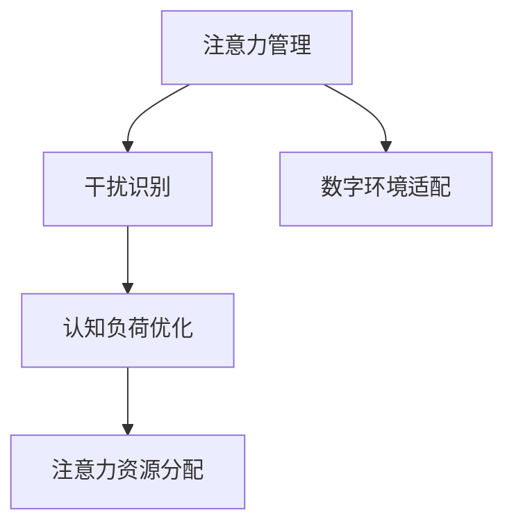

                 

# 信息时代的注意力管理技术与策略：在干扰和分心中保持专注

> 关键词：注意力管理,干扰抵抗,分心应对,认知负荷,数字环境

## 1. 背景介绍

在信息爆炸的时代，人类所面对的信息量和种类都前所未有的庞大，如何在海量信息中保持专注和高效工作，成为了一项日益重要而复杂的技术挑战。传统的注意力管理理论在以纸质书籍、报刊为主要信息载体的时代，其适用性受到限制，无法有效应对数字环境下的信息干扰和分心现象。

### 1.1 问题由来

现代工作与生活场景中，手机、电脑、平板等移动设备已成为人们获取信息、沟通交流不可或缺的工具。然而，它们在提供便利的同时，也成为了主要的干扰源之一。数字环境中的信息碎片化、推送式通知、社交媒体、网络搜索等活动，都在不断打断人们的注意力，使得学习和工作变得更加困难。因此，研究信息时代下注意力管理技术与策略，有着重要的理论和实践意义。

### 1.2 问题核心关键点

注意力管理问题核心在于，如何在干扰和分心中保持高效专注，最大化信息获取和处理效率。问题的关键点包括：

- 干扰和分心的识别与量化。如何准确识别干扰和分心的来源和影响程度。
- 认知负荷的优化。如何在干扰和分心情境下，优化认知负荷，减少信息过载对注意力的影响。
- 注意力资源的分配与调节。如何合理分配和调节注意力资源，使其在关键任务上发挥最大效用。
- 数字环境的适应与定制。如何针对特定的数字环境，设计适应性强的注意力管理策略。

## 2. 核心概念与联系

### 2.1 核心概念概述

为更好地理解信息时代注意力管理技术与策略，本节将介绍几个密切相关的核心概念：

- **注意力管理(Attention Management)**：指通过技术手段，在干扰和分心环境中，调整注意力资源的分配和调节，以实现高效的信息获取和任务处理。
- **干扰(Interference)**：指任何可能打断信息处理流程的额外刺激，如通知、广告、无关资讯等。
- **分心(Diversion)**：指导致信息处理者从当前任务上转移注意力的外部因素，如社交媒体、娱乐内容等。
- **认知负荷(Cognitive Load)**：指在信息处理过程中，个体需要投入的注意力和记忆资源总量。高认知负荷会导致信息过载，降低注意力管理效果。
- **数字环境(Digital Environment)**：指以数字化设备、软件等为主要信息载体的现代工作与生活环境。

这些核心概念之间的逻辑关系可以通过以下Mermaid流程图来展示：



这个流程图展示了一个完整的注意力管理流程：

1. 从数字环境识别和量化干扰。
2. 优化认知负荷以缓解信息过载。
3. 合理分配注意力资源以提升关键任务效率。
4. 适应特定的数字环境，定制个性化的注意力管理策略。

## 3. 核心算法原理 & 具体操作步骤
### 3.1 算法原理概述

信息时代下的注意力管理，通常采用基于认知心理学、行为科学的原理，结合计算机科学的技术手段，构建智能化、自动化的注意力调节系统。该系统的目标是通过技术手段，实时监测和调整个体的注意力状态，避免干扰和分心，最大化认知效率。

核心算法原理主要包括以下几个步骤：

1. **干扰识别与量化**：通过传感器、日志等手段，识别并量化外界干扰和内部分心行为。
2. **认知负荷评估**：实时监测用户的注意力状态，评估当前认知负荷水平。
3. **注意力资源分配**：根据当前任务的重要性和紧急程度，分配相应的注意力资源。
4. **注意力调节**：根据干扰识别和认知负荷评估结果，自动调节用户注意力，如限制干扰源、提醒注意集中等。

### 3.2 算法步骤详解

基于认知科学的注意力管理流程，通常包括以下关键步骤：

**Step 1: 干扰与分心监测**

- 通过键盘记录、鼠标移动、摄像头、网络数据等手段，实时监测用户的干扰和分心行为。
- 使用行为科学模型，如眼动追踪、脑波信号分析等，更精确地识别用户注意力分散的时机和原因。
- 构建用户分心行为库，便于进一步的分析和处理。

**Step 2: 认知负荷评估**

- 定义认知负荷指标，如注意力集中度、工作记忆容量、信息处理速度等。
- 设计问卷、实验等方法，评估用户的认知负荷水平。
- 使用生物信息学技术，如心率、脑电波等，实时监测用户的生理状态，间接推断其认知负荷。

**Step 3: 注意力资源分配**

- 定义任务优先级和紧急程度，计算每个任务所需注意力资源。
- 根据用户当前状态和任务需求，动态分配注意力资源。
- 使用强化学习算法，如Q-learning、A3C等，优化注意力资源分配策略。

**Step 4: 注意力调节**

- 根据实时监测数据，自动调节用户工作环境，如调整屏幕亮度、减少干扰源等。
- 提供提醒和反馈，提示用户集中注意力。
- 使用自然语言处理技术，如聊天机器人，帮助用户复位注意力。

### 3.3 算法优缺点

信息时代注意力管理技术的优点包括：

- **自动化程度高**：通过算法自动监测和调节注意力，减少人工干预，提高效率。
- **精准度高**：使用生理指标和行为数据，可以更准确地评估和调整注意力状态。
- **适用性强**：适应各种数字环境和任务类型，提供灵活的定制化策略。

然而，也存在一些缺点：

- **依赖数据量大**：需要持续采集大量用户行为和生理数据，才能实现精准管理。
- **隐私保护困难**：用户数据涉及隐私，如何保护用户隐私成为重要问题。
- **技术门槛高**：算法实现复杂，需要跨学科技术整合，对开发人员要求较高。
- **用户接受度低**：部分用户可能对持续监测和反馈持抵触态度，导致技术应用受限。

### 3.4 算法应用领域

注意力管理技术已经广泛应用于以下领域：

- **工作和学习**：帮助职场和学生提高工作效率和学习成绩，减少分心行为。
- **健康管理**：通过监测注意力状态，预防和治疗注意力缺陷障碍(ADHD)等疾病。
- **驾驶辅助**：通过监测驾驶员注意力集中度，提供警示和辅助，减少交通事故。
- **智能家居**：根据用户注意力状态，自动调整家居设备，提升生活舒适度。
- **游戏和娱乐**：帮助游戏玩家保持集中，提高游戏体验。

这些领域的应用展示了注意力管理技术的广泛潜力和实际价值。随着技术的不断进步，未来其在更多场景下的应用前景更加广阔。

## 4. 数学模型和公式 & 详细讲解
### 4.1 数学模型构建

信息时代注意力管理的数学模型通常包含以下几个关键组成部分：

- **干扰与分心监测模型**：通过行为数据构建时间序列模型，识别干扰和分心行为。
- **认知负荷评估模型**：使用生理数据和认知任务完成度构建状态空间模型，评估认知负荷水平。
- **注意力资源分配模型**：构建图论模型，优化注意力资源分配。
- **注意力调节模型**：设计动态系统模型，实时调整注意力状态。

### 4.2 公式推导过程

以认知负荷评估模型为例，假设认知负荷状态为 $x_t$，当前任务对认知负荷的影响为 $u_t$，则认知负荷状态更新公式为：

$$
x_{t+1} = f(x_t, u_t)
$$

其中 $f$ 为认知负荷动态系统模型，通常使用线性动态系统或非线性动态系统描述。例如，对于一个简单的线性模型，可以使用如下公式：

$$
x_{t+1} = \alpha x_t + \beta u_t
$$

其中 $\alpha$ 为认知负荷转移系数，$\beta$ 为认知负荷影响系数。

在实际应用中，可以通过实验和数据分析，得到这些参数的估计值。

### 4.3 案例分析与讲解

以一个典型的注意力管理应用为例，假设我们正在开发一款针对学生和职场用户的注意力管理应用。其核心功能包括：

- **干扰识别**：使用摄像头和键盘记录用户行为，通过行为科学模型识别干扰和分心行为。
- **认知负荷评估**：使用心率传感器监测用户生理状态，结合问卷和实验数据，评估用户认知负荷水平。
- **注意力资源分配**：使用Q-learning算法，根据当前任务优先级和认知负荷水平，优化注意力资源分配。
- **注意力调节**：使用聊天机器人，提供提醒和反馈，帮助用户集中注意力。

## 5. 项目实践：代码实例和详细解释说明
### 5.1 开发环境搭建

在进行注意力管理应用开发前，我们需要准备好开发环境。以下是使用Python进行开发的常见配置步骤：

1. 安装Python：从官网下载并安装最新版本的Python，或使用Anaconda等包管理工具。
2. 安装必要的库：使用pip安装机器学习、自然语言处理、计算机视觉等必要的库，如scikit-learn、numpy、torch等。
3. 构建实验环境：使用虚拟环境，隔离开发和测试所需的依赖库，避免版本冲突。
4. 准备数据集：收集或购买包含行为数据、生理数据的样本，构建用于训练和评估的数据集。

### 5.2 源代码详细实现

以下是一个使用Python和TensorFlow开发注意力管理应用的示例代码。

```python
import tensorflow as tf
import numpy as np

class AttentionManager(tf.keras.Model):
    def __init__(self, num_features):
        super(AttentionManager, self).__init__()
        self.fc1 = tf.keras.layers.Dense(128, activation='relu')
        self.fc2 = tf.keras.layers.Dense(1)

    def call(self, inputs):
        x = self.fc1(inputs)
        x = self.fc2(x)
        return x

# 加载数据集
train_data = ...
test_data = ...

# 构建模型
model = AttentionManager(num_features)

# 编译模型
model.compile(optimizer='adam', loss='mse')

# 训练模型
model.fit(train_data, epochs=10, validation_data=test_data)

# 评估模型
loss = model.evaluate(test_data)
print(f"Test loss: {loss:.3f}")
```

这段代码定义了一个简单的注意力管理模型，用于估计用户的认知负荷水平。其中，`AttentionManager`类定义了两个全连接层，分别用于特征提取和回归预测。通过调用`compile`方法，将模型编译为训练模型。使用`fit`方法训练模型，并使用`evaluate`方法评估模型性能。

### 5.3 代码解读与分析

代码的核心部分在于`AttentionManager`类的定义，它包括两个全连接层，用于将输入数据转换为预测值。在实际应用中，这些预测值可以通过生理指标、行为数据等输入到模型中。

需要注意的是，代码中使用的是简单的线性回归模型。在实际应用中，可能需要结合更复杂的神经网络模型，如LSTM、RNN等，以适应非线性关系和时序特性。

## 6. 实际应用场景
### 6.1 学生课堂管理

在学生课堂管理中，注意力管理技术可以有效提高学生的学习效率，减少分心行为。通过在课堂上佩戴智能手环或头戴设备，实时监测学生的行为和生理数据，结合学习任务的优先级和紧急程度，自动调节学生的注意力资源。例如，可以限制学生使用手机，提醒学生集中注意力，或提供短暂的注意力休息提示。

### 6.2 企业生产调度

在企业生产调度中，注意力管理技术可以提升生产效率，减少工人分心和失误。通过在生产线上安装摄像头和传感器，监测工人的行为和生理状态，根据任务的复杂度和重要性，动态分配注意力资源。例如，在操作复杂、危险度高的任务上，限制工人分心行为，提供及时的注意力提醒。

### 6.3 智能家居环境

在智能家居环境中，注意力管理技术可以提升用户的生活舒适度，提高家庭的智能化水平。通过智能家居设备的联网，实时监测用户的行为和生理状态，根据用户当前状态和任务需求，自动调节家居设备，如调整灯光、控制空调等。例如，在用户处于疲劳状态时，自动降低灯光亮度，提供舒缓的音乐，帮助用户放松。

### 6.4 未来应用展望

随着技术的不断进步，注意力管理技术将在更多场景下得到应用，为人类生产生活带来更高效、更智能的体验。

在医疗领域，注意力管理技术可以帮助患者管理心理压力，减少焦虑和抑郁等精神疾病，提升治疗效果。在智能交通中，通过监测驾驶员注意力集中度，减少交通事故，提高行车安全。在社交媒体平台，通过监测用户注意力状态，智能推荐相关内容，提升用户体验。

未来，随着物联网技术的发展，越来越多的数字设备将融入人们的生产生活，注意力管理技术将发挥更大的作用，提升人类在数字环境中的生活质量。

## 7. 工具和资源推荐
### 7.1 学习资源推荐

为了帮助开发者系统掌握注意力管理技术与策略的理论基础和实践技巧，这里推荐一些优质的学习资源：

1. 《深度学习》系列书籍：Yoshua Bengio、Ian Goodfellow等著名深度学习专家所著，系统介绍了深度学习的基本理论和应用。
2. 《认知心理学》系列课程：耶鲁大学、斯坦福大学等知名学府开设的认知心理学课程，深入浅出地讲解了注意力管理的心理机制。
3. 《智能环境中的认知负荷评估》论文：文献探讨了认知负荷评估在智能环境中的应用，提供了详细的技术实现方案。
4. 《行为数据处理与分析》教程：Coursera、edX等在线平台提供的免费课程，涵盖行为数据采集、处理和分析的实践方法。
5. 《注意力机制在深度学习中的应用》书籍：讲解了注意力机制在深度学习中的各种应用，包括机器翻译、图像识别等。

通过对这些资源的学习实践，相信你一定能够快速掌握注意力管理技术与策略的精髓，并用于解决实际的数字环境下的注意力管理问题。

### 7.2 开发工具推荐

高效的开发离不开优秀的工具支持。以下是几款用于注意力管理开发的常用工具：

1. TensorFlow：由Google主导开发的开源深度学习框架，适合构建复杂、高效的深度学习模型。
2. PyTorch：基于Python的开源深度学习框架，灵活动态的计算图，适合快速迭代研究。
3. Scikit-learn：基于Python的机器学习库，提供了大量的特征工程、数据处理和模型评估工具。
4. OpenCV：开源计算机视觉库，提供了图像处理、视频分析等功能，可以用于行为监测和分析。
5. TensorBoard：TensorFlow配套的可视化工具，可实时监测模型训练状态，并提供丰富的图表呈现方式。

合理利用这些工具，可以显著提升注意力管理任务的开发效率，加快创新迭代的步伐。

### 7.3 相关论文推荐

注意力管理技术的发展源于学界的持续研究。以下是几篇奠基性的相关论文，推荐阅读：

1. Affective Computing in Human-Computer Interaction：探讨了情感计算在HCI中的重要性与实践方法，对注意力管理的心理机制提供了深入的洞察。
2. User Interface Design for Focus Assistance in Mobile Devices：介绍了移动设备上焦点辅助设计的研究进展，提供了一些有效的注意力管理策略。
3. Modeling and Predicting Workplace Stress Using Wearable Technology：使用可穿戴技术监测工作压力，提供了注意力管理在实际工作场景中的应用案例。
4. Attention Is All You Need（即Transformer原论文）：介绍了Transformer结构和注意力机制，为注意力管理技术提供了理论基础。
5. Multi-Modal Attention Mechanism in Deep Learning：探讨了多模态注意力机制在深度学习中的各种应用，包括自然语言处理、计算机视觉等。

这些论文代表了大语言模型微调技术的发展脉络。通过学习这些前沿成果，可以帮助研究者把握学科前进方向，激发更多的创新灵感。

## 8. 总结：未来发展趋势与挑战
### 8.1 总结

本文对信息时代注意力管理技术与策略进行了全面系统的介绍。首先阐述了注意力管理在干扰和分心中保持高效专注的理论基础和实践意义，明确了注意力管理在数字环境下的重要性和应用场景。其次，从原理到实践，详细讲解了注意力管理的数学模型和核心算法，给出了注意力管理任务开发的完整代码实例。同时，本文还广泛探讨了注意力管理技术在多个领域的应用前景，展示了其广阔的潜力和实际价值。此外，本文精选了注意力管理技术的各类学习资源，力求为读者提供全方位的技术指引。

通过本文的系统梳理，可以看到，信息时代注意力管理技术与策略已经成为数字环境下的重要工具，具有广阔的应用前景和实际价值。未来，伴随技术的不断进步，注意力管理技术将会在更多场景下得到应用，为人类生产生活带来更高效、更智能的体验。

### 8.2 未来发展趋势

展望未来，信息时代注意力管理技术将呈现以下几个发展趋势：

1. **跨模态信息整合**：未来，注意力管理将不再局限于单一模态数据，而是融合视觉、听觉、触觉等多模态信息，提升系统的感知能力和适应性。
2. **实时动态调整**：基于实时数据监测，动态调整注意力资源，进一步提升系统的即时响应和灵活性。
3. **个性化定制**：结合用户行为数据和生理数据，提供个性化定制的注意力管理策略，提升用户体验。
4. **跨领域应用**：从传统的教育、医疗等领域，扩展到智能交通、社交媒体、智能家居等多个行业，提升各类系统的智能化水平。
5. **自动化和智能化**：通过人工智能技术，如强化学习、深度学习等，实现更加智能化的注意力管理，减少人工干预。

以上趋势凸显了信息时代注意力管理技术的广阔前景。这些方向的探索发展，必将进一步提升注意力管理系统的性能和应用范围，为人类认知智能的进化带来深远影响。

### 8.3 面临的挑战

尽管信息时代注意力管理技术已经取得了一定的进展，但在迈向更加智能化、普适化应用的过程中，仍面临诸多挑战：

1. **数据隐私保护**：在持续监测和分析用户行为和生理数据时，如何保护用户隐私，避免数据泄露，成为一大难题。
2. **技术伦理**：在注意力管理过程中，如何确保技术的安全性和伦理性，避免算法的偏见和误导，需要更多理论和实践的积累。
3. **跨领域应用难度**：不同行业和场景下的注意力管理需求不同，如何设计跨领域的通用模型，并适配到特定应用，需要更多的研究和实验。
4. **用户接受度**：用户对持续监测和反馈可能持抵触态度，如何提高用户接受度和满意度，是技术推广的关键。
5. **技术标准缺失**：缺乏统一的技术标准和规范，导致不同系统之间的互通性和兼容性问题。

正视注意力管理面临的这些挑战，积极应对并寻求突破，将是大语言模型微调技术走向成熟的必由之路。相信随着学界和产业界的共同努力，这些挑战终将一一被克服，注意力管理技术必将在构建人机协同的智能时代中扮演越来越重要的角色。

### 8.4 研究展望

面对信息时代注意力管理所面临的种种挑战，未来的研究需要在以下几个方面寻求新的突破：

1. **跨模态注意力机制**：开发更加灵活的跨模态注意力机制，结合视觉、听觉、触觉等多种感官信息，提升系统的感知能力和适应性。
2. **隐私保护技术**：研究隐私保护技术，如差分隐私、联邦学习等，保护用户数据隐私，同时保证注意力管理的有效性。
3. **技术伦理标准**：建立统一的技术伦理标准，确保注意力管理系统的安全性和伦理性，避免算法的偏见和误导。
4. **跨领域应用框架**：设计跨领域的通用注意力管理框架，适配到不同的行业和场景，提升系统的通用性和可扩展性。
5. **用户接受度提升**：通过用户反馈和行为分析，优化注意力管理系统的用户体验，提升用户接受度和满意度。

这些研究方向的探索，必将引领信息时代注意力管理技术的进一步发展，为构建安全、可靠、可解释、可控的智能系统铺平道路。面向未来，信息时代注意力管理技术还需要与其他人工智能技术进行更深入的融合，如认知推理、强化学习等，多路径协同发力，共同推动自然语言理解和智能交互系统的进步。只有勇于创新、敢于突破，才能不断拓展语言模型的边界，让智能技术更好地造福人类社会。

## 9. 附录：常见问题与解答
----------------------------------------------------------------

**Q1：如何区分分心和干扰？**

A: 分心和干扰都可以打断注意力集中，但其影响方式和来源不同。分心通常指内部因素，如注意力分散、疲劳、焦虑等，而干扰通常指外部因素，如噪音、通知、社交媒体等。通过行为科学模型和生理指标监测，可以较为准确地识别和区分分心和干扰。

**Q2：注意力管理系统的设计难点在哪里？**

A: 注意力管理系统的设计难点主要在于：

1. 如何准确识别用户行为和生理数据，并转化为注意力管理指标。
2. 如何评估和动态调整用户的认知负荷水平，避免信息过载。
3. 如何在复杂多变的数字环境中，设计适应性强、通用性高的注意力管理策略。
4. 如何平衡用户隐私保护和注意力管理功能，确保用户数据安全。

**Q3：注意力管理技术如何提升用户专注度？**

A: 通过实时监测和动态调整，注意力管理技术可以提升用户专注度的方法包括：

1. 限制干扰源：在注意力集中时，限制手机、电脑等设备的通知，减少干扰。
2. 提醒用户集中：通过聊天机器人或通知提醒，引导用户重新集中注意力。
3. 优化认知负荷：通过合理分配任务优先级，减少用户的信息过载。
4. 提供注意力休息：在注意力集中一段时间后，提醒用户进行短暂的休息，恢复精力。

**Q4：注意力管理系统的部署难度有多大？**

A: 注意力管理系统的部署难度主要在于：

1. 数据采集和处理：需要采集和处理大量的用户行为和生理数据，技术门槛较高。
2. 模型训练和优化：需要训练和优化复杂的深度学习模型，并不断调整模型参数，优化性能。
3. 系统集成和适配：需要与各种设备和平台进行集成和适配，确保系统的兼容性。

**Q5：注意力管理技术有哪些未来发展方向？**

A: 未来，注意力管理技术的发展方向包括：

1. **跨模态注意力机制**：结合视觉、听觉、触觉等多种感官信息，提升系统的感知能力和适应性。
2. **实时动态调整**：基于实时数据监测，动态调整注意力资源，进一步提升系统的即时响应和灵活性。
3. **个性化定制**：结合用户行为数据和生理数据，提供个性化定制的注意力管理策略，提升用户体验。
4. **跨领域应用**：从传统的教育、医疗等领域，扩展到智能交通、社交媒体、智能家居等多个行业，提升各类系统的智能化水平。
5. **自动化和智能化**：通过人工智能技术，如强化学习、深度学习等，实现更加智能化的注意力管理，减少人工干预。

这些方向的发展，将使得信息时代注意力管理技术具有更广泛的应用前景和更高的智能水平。

---

作者：禅与计算机程序设计艺术 / Zen and the Art of Computer Programming

