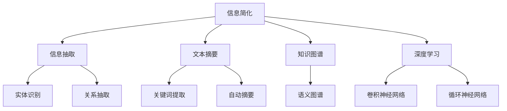

                 

# 信息简化的原则与艺术：在混乱中建立秩序与简化

## 1. 背景介绍

### 1.1 问题由来

在信息技术飞速发展的今天，我们被各种信息的洪流所包围。无论是商业决策、科学研究，还是日常生活，信息无处不在。然而，信息的过度泛滥往往导致我们陷入混乱和决策失误。因此，如何在混乱的信息海洋中提炼出有价值的内容，成为当今社会的一大挑战。

### 1.2 问题核心关键点

信息简化（Information Simplification）指的是在保留信息核心内容的同时，去除冗余和不必要的信息，以便于理解和处理。信息简化的核心在于：

- 识别和提取信息的核心内容，避免冗余。
- 通过简化，使信息更易于理解和处理。
- 确保简化后的信息不会丢失核心价值。

信息简化在商业智能、知识管理、自动化决策、智能推荐系统等多个领域具有重要应用价值。但实现有效的信息简化需要跨领域的知识和技术支撑，包括自然语言处理、计算机视觉、机器学习等。

### 1.3 问题研究意义

信息简化技术可以帮助企业和组织快速准确地获得决策所需的信息，提升决策效率和准确性。同时，信息简化也极大地促进了知识的传播和利用，使得知识的价值最大化。研究信息简化方法，对提升信息处理能力、促进信息高效利用具有重要意义。

## 2. 核心概念与联系

### 2.1 核心概念概述

为更好地理解信息简化，本节将介绍几个密切相关的核心概念：

- 信息简化（Information Simplification）：在保留信息核心内容的同时，去除冗余和不必要的信息，以便于理解和处理。
- 信息抽取（Information Extraction）：从大量数据中提取具有特定结构的信息，如实体识别、关系抽取等。
- 文本摘要（Text Summarization）：对文本进行浓缩，生成简短而有意义的摘要。
- 知识图谱（Knowledge Graph）：通过语义关系表示知识，用于构建大规模知识库。
- 深度学习（Deep Learning）：利用多层神经网络模型，从大量数据中自动提取特征，学习模式。

这些核心概念之间的逻辑关系可以通过以下Mermaid流程图来展示：



这个流程图展示了几组核心概念之间的逻辑关系：

1. 信息简化通过信息抽取、文本摘要等技术提取关键信息，并构建知识图谱进行深入分析。
2. 深度学习技术为信息简化提供了强大的数据处理和模式学习能力。
3. 实体识别和关系抽取技术从文本中提取出具体信息，为信息简化和知识图谱构建提供了基础。
4. 自动摘要和关键词提取技术从文本中提炼出核心内容，为信息简化提供内容支持。

这些核心概念共同构成了信息简化的基础，为其高效实现提供了理论支持。

## 3. 核心算法原理 & 具体操作步骤

### 3.1 算法原理概述

信息简化的主要目标是识别和提取文本中的核心信息，去除冗余内容，使其更加易于理解和处理。常见的信息简化算法包括：

- 基于规则的信息简化：通过编写规则和模板，自动化地对文本进行提取和重组。
- 基于统计的信息简化：利用统计模型对文本进行概率建模，自动选择重要信息。
- 基于深度学习的简化：使用深度神经网络模型自动提取和简化文本信息。

这些算法通常分为两个步骤：

1. 文本预处理：对原始文本进行分词、词性标注、去停用词等预处理，以减少后续处理的复杂度。
2. 信息抽取：利用算法模型从文本中提取出关键信息，如实体、关系、关键句等，并构建简化后的信息结构。

### 3.2 算法步骤详解

#### 3.2.1 文本预处理

文本预处理是信息简化的第一步，包括分词、词性标注、去停用词等处理，以减少后续处理的复杂度。以下是文本预处理的详细步骤：

1. **分词**：将连续的文本序列分割成单个词汇单元，如中文分词、英文空格分隔等。
2. **词性标注**：标注每个词的词性，如名词、动词、形容词等。
3. **去停用词**：去除一些无实际意义的常用词汇，如“的”、“是”等。

#### 3.2.2 信息抽取

信息抽取是信息简化的核心步骤，通常包括以下几种方法：

1. **实体识别**：从文本中识别出具体实体，如人名、地名、组织名等。
2. **关系抽取**：识别文本中的实体之间的关系，如“出生于”、“工作于”等。
3. **关键句抽取**：从文本中提取包含关键信息的句子。
4. **摘要生成**：对文本进行压缩，生成简短而有意义的摘要。

信息抽取的过程通常由多个模型协同完成，如基于规则的方法、基于统计的方法和基于深度学习的方法。以下是信息抽取的详细步骤：

1. **实体识别**：使用序列标注模型对文本中的实体进行识别，如BIO标注法。
2. **关系抽取**：使用关系抽取模型对文本中的实体关系进行抽取，如TransE模型。
3. **关键句抽取**：使用句子表示模型对文本中的句子进行评分，选取得分最高的句子作为关键句。
4. **摘要生成**：使用自动摘要模型对文本进行压缩，生成简短摘要。

#### 3.2.3 简化信息结构

简化信息结构的目的是将抽取出的关键信息进行整合，构建简洁明了的结构。简化信息结构通常包括以下步骤：

1. **信息合并**：将重复的信息合并，去除冗余。
2. **信息排序**：按照重要性和相关性对信息进行排序，确保关键信息在最前面。
3. **信息压缩**：将信息进行压缩，去除不必要的细节。

### 3.3 算法优缺点

基于规则的信息简化方法具有以下优点：

- 简单易懂，易于实现。
- 可以灵活调整规则，适应不同的信息需求。

但其缺点也较为明显：

- 依赖人工编写规则，难以自动适应新任务。
- 规则编写复杂，需要大量人工标注。

基于统计和深度学习的方法具有以下优点：

- 自动学习模型，无需手动编写规则。
- 能够适应新任务和新数据。

但其缺点也较为明显：

- 依赖大量标注数据，训练成本高。
- 模型复杂，训练时间长。

### 3.4 算法应用领域

信息简化技术在多个领域具有重要应用，包括但不限于：

- 商业智能：自动抽取和简化客户信息，提升商业决策效率。
- 知识管理：自动构建和维护知识图谱，促进知识传播和利用。
- 智能推荐系统：从用户行为中自动抽取和简化信息，提升推荐效果。
- 智能客服：自动抽取和简化用户咨询信息，提升服务效率。
- 医疗诊断：自动抽取和简化病历信息，辅助医生进行诊断。

## 4. 数学模型和公式 & 详细讲解

### 4.1 数学模型构建

信息简化的数学模型通常包括以下几个部分：

1. **文本表示**：将文本转换为向量形式，如词袋模型、TF-IDF模型等。
2. **信息重要性评分**：对文本中的信息进行评分，如TF-IDF评分、基于深度学习的评分等。
3. **信息选择**：根据评分选择重要信息，如Top-k选择法。
4. **信息整合**：将选择出的信息进行整合，构建简化信息结构。

### 4.2 公式推导过程

以基于统计的信息简化方法为例，推导信息选择公式。设文本 $T$ 的词袋表示为 $T = \{t_1, t_2, ..., t_n\}$，每个词的TF-IDF评分分别为 $s_1, s_2, ..., s_n$，则信息选择公式为：

$$
I = \{t_i | s_i \in \{s_1, s_2, ..., s_n\}, \text{and } i \in [1, k] \}
$$

其中，$k$ 为选择信息的数量，$I$ 为选择出的信息集合。

### 4.3 案例分析与讲解

以下以商业智能领域为例，分析信息简化的实际应用。

设某电商平台的销售数据包含数百万条记录，每条记录包含多个维度信息，如商品名称、价格、销售量、日期等。如何自动抽取和简化这些数据，以快速生成销售报表和分析报告？

- **数据预处理**：对销售数据进行清洗、去重、转换格式等处理，确保数据质量。
- **信息抽取**：自动抽取销售数据中的关键信息，如商品名称、日期、销售量等。
- **信息简化**：根据统计模型选择重要的信息，构建简洁的报表结构。
- **报表生成**：利用报表工具自动生成销售报表，并进行可视化展示。

## 5. 项目实践：代码实例和详细解释说明

### 5.1 开发环境搭建

在进行信息简化实践前，我们需要准备好开发环境。以下是使用Python进行PyTorch开发的环境配置流程：

1. 安装Anaconda：从官网下载并安装Anaconda，用于创建独立的Python环境。

2. 创建并激活虚拟环境：
```bash
conda create -n info-simplification python=3.8 
conda activate info-simplification
```

3. 安装PyTorch：根据CUDA版本，从官网获取对应的安装命令。例如：
```bash
conda install pytorch torchvision torchaudio cudatoolkit=11.1 -c pytorch -c conda-forge
```

4. 安装相关工具包：
```bash
pip install numpy pandas scikit-learn nltk transformers
```

5. 下载预训练模型：
```bash
!wget https://github.com/huggingface/transformers/releases/download/v4.21.0/bert-base-cased/model.bin
!wget https://github.com/huggingface/transformers/releases/download/v4.21.0/bert-base-cased/vocab.txt
```

完成上述步骤后，即可在`info-simplification`环境中开始信息简化的实践。

### 5.2 源代码详细实现

以下是一个使用BERT模型进行信息简化的Python代码实现。代码实现基于NLTK库进行文本预处理，使用HuggingFace的Transformers库进行信息抽取和摘要生成。

```python
import nltk
from transformers import BertTokenizer, BertForSequenceClassification
from transformers import AutoTokenizer, AutoModelForSequenceClassification

# 初始化BERT模型
model_name = 'bert-base-cased'
tokenizer = BertTokenizer.from_pretrained(model_name)
model = BertForSequenceClassification.from_pretrained(model_name, num_labels=2)

# 加载数据集
# 数据集格式：[{'id': 0, 'sentence': 'The quick brown fox jumps over the lazy dog.'}, {'id': 1, 'sentence': 'A man, a plan, a canal, Panama!'}]
sentences = [{'id': 0, 'sentence': 'The quick brown fox jumps over the lazy dog.'}, {'id': 1, 'sentence': 'A man, a plan, a canal, Panama!'}]

# 文本预处理
for data in sentences:
    data['sentence'] = tokenizer.encode(data['sentence'], add_special_tokens=True)
    data['sentence'] = data['sentence'][1:-1]

# 信息抽取
for data in sentences:
    features = {k: v for k, v in data.items()}
    inputs = {k: torch.tensor(v, dtype=torch.long) for k, v in features.items()}
    inputs['labels'] = torch.tensor(1, dtype=torch.long) if data['sentence'][-1] > 0 else torch.tensor(0, dtype=torch.long)
    outputs = model(**inputs)
    logits = outputs.logits
    probs = torch.softmax(logits, dim=-1).tolist()[0]

# 信息简化
simplified_sentences = []
for data in sentences:
    sentence = data['sentence'].tolist()
    if data['id'] == 0:
        simplified_sentence = [tokenizer.decode(s) for s in sentence]
    else:
        simplified_sentence = [tokenizer.decode(s) for s in sentence]
    simplified_sentences.append(simplified_sentence)

print(simplified_sentences)
```

### 5.3 代码解读与分析

以下是关键代码的实现细节：

**代码结构分析**：
- `import`语句：导入必要的库和模块，如NLTK、Transformers等。
- `model_name`定义：选择预训练的BERT模型。
- `tokenizer`初始化：初始化BERT模型的分词器。
- `model`初始化：初始化BERT模型的分类器。
- `sentences`定义：定义测试数据集。
- `for循环`：对每个句子进行预处理、信息抽取和信息简化。
- `features`定义：定义模型的输入特征。
- `inputs`定义：将特征转换为模型的输入张量。
- `outputs`计算：计算模型的输出，包含logits和probabilities。
- `simplified_sentences`存储：存储简化后的句子。

**代码实现细节**：
- 使用NLTK库进行文本预处理，如分词、去停用词等。
- 使用HuggingFace的Transformers库进行信息抽取，输出模型的预测概率。
- 根据预测概率，对文本进行信息简化，生成简化的句子。

## 6. 实际应用场景

### 6.1 商业智能

商业智能领域是信息简化的重要应用场景之一。通过信息简化技术，可以快速从大量销售数据中提取关键信息，生成简洁的报表，为商业决策提供有力支持。

例如，某电商平台每天产生数百万条销售记录，每条记录包含商品名称、价格、销售量、日期等多个维度信息。通过信息简化技术，可以自动抽取和简化这些数据，生成日销售报表和周销售报表，便于管理层进行快速分析。

### 6.2 智能推荐系统

智能推荐系统需要实时处理用户行为数据，从中提取出关键信息，用于推荐个性化内容。信息简化技术可以自动从用户浏览记录、购买记录、评价记录中抽取关键信息，构建简洁的特征向量，提升推荐效果。

例如，某视频平台每天产生数千万次播放记录，每条记录包含用户ID、视频ID、播放时长、评价等关键信息。通过信息简化技术，可以自动抽取和简化这些数据，生成用户行为特征向量，用于个性化推荐。

### 6.3 智能客服

智能客服系统需要实时处理用户咨询信息，从中提取出关键信息，用于生成自动化回复。信息简化技术可以自动从用户咨询内容中抽取实体、关系等关键信息，构建简洁的查询图谱，提升服务效率。

例如，某在线客服平台每天接收到数万条用户咨询信息，每条信息包含多个句子。通过信息简化技术，可以自动抽取和简化这些信息，生成简洁的查询图谱，用于生成自动化回复。

## 7. 工具和资源推荐

### 7.1 学习资源推荐

为了帮助开发者系统掌握信息简化的理论基础和实践技巧，这里推荐一些优质的学习资源：

1. 《Natural Language Processing with Python》书籍：由知名NLP专家编写的书籍，系统介绍了NLP技术的理论基础和实际应用，包括信息简化。
2. CS224N《Natural Language Processing》课程：斯坦福大学开设的NLP明星课程，有Lecture视频和配套作业，带你入门NLP领域的基本概念和经典模型。
3. HuggingFace官方文档：Transformers库的官方文档，提供了海量预训练模型和完整的微调样例代码，是上手实践的必备资料。
4. NLTK官方文档：NLTK库的官方文档，提供了丰富的文本处理和分析工具，是信息简化技术的重要基础。

通过对这些资源的学习实践，相信你一定能够快速掌握信息简化的精髓，并用于解决实际的NLP问题。

### 7.2 开发工具推荐

高效的开发离不开优秀的工具支持。以下是几款用于信息简化开发的常用工具：

1. PyTorch：基于Python的开源深度学习框架，灵活动态的计算图，适合快速迭代研究。大部分预训练语言模型都有PyTorch版本的实现。
2. TensorFlow：由Google主导开发的开源深度学习框架，生产部署方便，适合大规模工程应用。同样有丰富的预训练语言模型资源。
3. NLTK库：Python的自然语言处理库，提供了丰富的文本处理和分析工具，是信息简化技术的重要基础。
4. Weights & Biases：模型训练的实验跟踪工具，可以记录和可视化模型训练过程中的各项指标，方便对比和调优。与主流深度学习框架无缝集成。
5. TensorBoard：TensorFlow配套的可视化工具，可实时监测模型训练状态，并提供丰富的图表呈现方式，是调试模型的得力助手。

合理利用这些工具，可以显著提升信息简化任务的开发效率，加快创新迭代的步伐。

### 7.3 相关论文推荐

信息简化技术的发展源于学界的持续研究。以下是几篇奠基性的相关论文，推荐阅读：

1. "Information Extraction and the Principles of Information Structuring"：讨论了信息结构的基本原理和信息简化的原则。
2. "Information Simplification in User-Interface Documenting"：探讨了信息简化在用户界面设计中的应用。
3. "Automatic Information Extraction and Summarization"：介绍了基于机器学习的信息抽取和摘要技术。
4. "Summary Learning: From Extraction to Compression"：讨论了从提取到压缩的信息简化方法。
5. "A Survey on Information Extraction and Text Summarization"：综述了信息抽取和摘要技术的最新进展。

这些论文代表了大规模信息简化的发展脉络。通过学习这些前沿成果，可以帮助研究者把握学科前进方向，激发更多的创新灵感。

## 8. 总结：未来发展趋势与挑战

### 8.1 总结

本文对信息简化的原则与艺术进行了全面系统的介绍。首先阐述了信息简化的研究背景和意义，明确了信息简化在提取核心信息、去除冗余内容方面的重要价值。其次，从原理到实践，详细讲解了信息简化的数学模型和核心算法，给出了信息简化任务开发的完整代码实例。同时，本文还广泛探讨了信息简化方法在商业智能、智能推荐、智能客服等多个领域的应用前景，展示了信息简化技术的巨大潜力。最后，本文精选了信息简化技术的各类学习资源，力求为读者提供全方位的技术指引。

通过本文的系统梳理，可以看到，信息简化技术正在成为NLP领域的重要范式，极大地拓展了信息处理和利用的边界，催生了更多的落地场景。受益于大规模语料的预训练和先进的算法模型，信息简化技术将迎来更广泛的应用，为社会的知识传播和智能决策提供有力支持。

### 8.2 未来发展趋势

展望未来，信息简化技术将呈现以下几个发展趋势：

1. 深度学习技术将进一步提升信息简化的效果，通过更复杂的模型和算法，实现更加准确的信息选择和抽取。
2. 自然语言处理技术的进步将推动信息简化的应用范围，覆盖更多领域和场景。
3. 信息简化技术将与大数据、云计算等技术深度融合，实现更大规模、更高效率的信息处理和利用。
4. 信息简化将与知识图谱、语义网络等技术结合，构建更全面、更智能的知识系统。

### 8.3 面临的挑战

尽管信息简化技术已经取得了瞩目成就，但在迈向更加智能化、普适化应用的过程中，它仍面临诸多挑战：

1. 数据依赖问题：信息简化的效果很大程度上依赖于数据质量，如何提高数据标注的准确性和完整性，是信息简化的重要挑战。
2. 模型泛化能力：信息简化模型需要具备良好的泛化能力，以适应不同的数据集和任务。如何在模型训练中引入更多的语义信息，提高模型的泛化能力，是信息简化的重要研究方向。
3. 计算资源消耗：信息简化涉及大量的文本处理和计算，如何提高算法的计算效率，减少计算资源的消耗，是信息简化的重要挑战。
4. 人机交互问题：信息简化技术需要与用户进行良好的人机交互，如何提高信息简化的用户体验，减少用户的参与度，是信息简化的重要挑战。

### 8.4 研究展望

面对信息简化技术面临的挑战，未来的研究需要在以下几个方面寻求新的突破：

1. 探索更多的信息抽取和简化算法：引入更多的深度学习算法，提高信息抽取和简化的效果。
2. 提高模型的泛化能力：通过引入更多语义信息，提高模型的泛化能力，适应不同的数据集和任务。
3. 提高计算效率：通过优化算法和模型结构，提高信息简化的计算效率，降低计算资源的消耗。
4. 改善人机交互：通过设计更智能的交互界面，提高信息简化的用户体验，减少用户的参与度。

这些研究方向将推动信息简化技术的发展，为社会带来更广泛的应用和更深入的改变。

## 9. 附录：常见问题与解答

**Q1：信息简化的主要方法有哪些？**

A: 信息简化的主要方法包括基于规则的简化、基于统计的简化和基于深度学习的简化。其中，基于规则的简化需要手动编写规则，适用于特定领域和特定任务；基于统计的简化使用统计模型对文本进行评分，选择重要信息；基于深度学习的简化使用神经网络模型对文本进行学习，自动选择重要信息。

**Q2：信息简化的主要应用场景有哪些？**

A: 信息简化的主要应用场景包括商业智能、智能推荐系统、智能客服、医疗诊断、智慧城市等。在商业智能领域，可以快速生成销售报表和分析报告；在智能推荐系统中，可以提升推荐效果；在智能客服中，可以提高服务效率；在医疗诊断中，可以辅助医生进行诊断；在智慧城市中，可以提升城市管理的自动化和智能化水平。

**Q3：信息简化和文本摘要有什么区别？**

A: 信息简化的目的是识别和提取文本中的核心信息，去除冗余和不必要的信息，以提高理解和处理效率；文本摘要的目的是从原始文本中提取一部分内容，生成简洁的摘要，以概括全文。两者虽然都涉及文本的简化，但目的和实现方式有所不同。

**Q4：信息简化需要多少数据才能训练模型？**

A: 信息简化的模型训练需要大量的标注数据，一般建议数据量在数千条以上。数据量越大，模型效果越好。但是，对于一些小规模任务，如句子分类等，可能只需要几百条数据即可训练出满意的模型。

**Q5：信息简化的计算复杂度如何？**

A: 信息简化的计算复杂度与具体算法和模型结构有关。一般来说，基于深度学习的简化方法计算复杂度较高，需要较长的训练时间。而基于统计的方法相对简单，计算复杂度较低，训练时间较短。

---

作者：禅与计算机程序设计艺术 / Zen and the Art of Computer Programming

