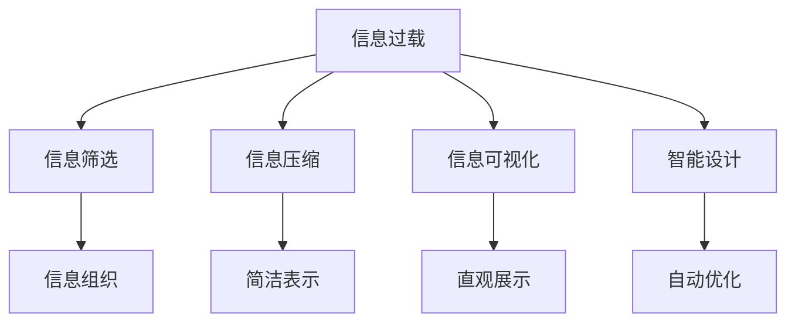

                 

# 信息简化的好处与技巧：在复杂世界中简化以提高生活质量和效率

> 关键词：信息简化,复杂系统,决策效率,生活质量,信息过载,智能设计

## 1. 背景介绍

### 1.1 问题由来

在当今信息爆炸的时代，我们每天都在面对海量的数据和信息，从新闻、社交媒体、电子邮件到各种在线服务。这些信息在提供便利的同时，也带来了巨大的信息过载问题，导致我们难以快速做出决策，甚至可能导致认知负荷过重，影响生活质量和工作效率。信息简化（Information Simplification）成为了解决这个问题的关键手段。

### 1.2 问题核心关键点

信息简化指的是将复杂的信息转换为易于理解、易于处理的形式，以便于快速决策和应用。这一过程涉及对信息的过滤、抽象和组织，以减少认知负担，提升效率和效果。信息简化的核心关键点在于以下几个方面：

1. **信息筛选**：从海量信息中筛选出最有价值的内容。
2. **信息压缩**：将复杂信息压缩为简洁的表示，易于理解和记忆。
3. **信息组织**：合理组织信息，使其逻辑结构清晰，便于处理。
4. **信息可视**：使用图表、图形等视觉元素，直观展示信息，增强理解力。

通过信息简化，我们可以更有效地处理信息，减少决策时间，提高生活质量和工作效率。

### 1.3 问题研究意义

研究信息简化的好处与技巧，对于提升个人和组织的信息处理能力，优化决策流程，减少信息过载，具有重要意义：

1. **提高决策效率**：通过简化信息，快速获取关键信息，减少决策时间。
2. **减少认知负荷**：简化复杂信息，降低认知负荷，提升心理健康和工作表现。
3. **增强信息理解力**：通过图表、图形等直观展示信息，增强对信息的理解力，避免误解和误判。
4. **促进知识共享**：简化的信息更易于共享和传播，促进团队协作和知识创新。

信息简化的研究，不仅有助于提升个体的生活质量，还能推动组织效能的提升，带来显著的社会和经济效益。

## 2. 核心概念与联系

### 2.1 核心概念概述

为更好地理解信息简化的原理和实践，本节将介绍几个核心概念：

- **信息过载（Information Overload）**：指人们接收到的信息量超过了他们的处理能力，导致决策困难和认知负荷增加。
- **信息筛选（Information Filtering）**：从大量信息中筛选出最有价值的内容。
- **信息压缩（Information Compression）**：将复杂信息压缩为简洁的表示形式。
- **信息可视化（Information Visualization）**：使用图表、图形等视觉元素，直观展示信息。
- **智能设计（Intelligent Design）**：使用算法和人工智能技术，自动设计和优化信息简化方案。

这些核心概念之间的逻辑关系可以通过以下Mermaid流程图来展示：



这个流程图展示了几大核心概念及其之间的关系：

1. 信息过载引发了信息筛选、信息压缩、信息可视化等简化需求。
2. 信息筛选对信息进行初步过滤，保留重要内容。
3. 信息压缩将复杂信息转化为简洁表示，便于处理。
4. 信息可视化使用图表、图形等直观展示信息，增强理解力。
5. 智能设计利用算法和人工智能技术，自动优化信息简化方案。

## 3. 核心算法原理 & 具体操作步骤
### 3.1 算法原理概述

信息简化的核心算法原理可以归纳为以下几个步骤：

1. **信息获取**：从多种信息源收集信息。
2. **信息筛选**：使用过滤算法从信息集合中筛选出重要内容。
3. **信息压缩**：通过编码算法将复杂信息压缩为简洁表示。
4. **信息组织**：利用组织算法将信息结构化，便于处理。
5. **信息可视化**：使用可视化算法将信息转化为图形、图表等形式。
6. **反馈优化**：通过用户反馈不断调整信息简化的策略。

### 3.2 算法步骤详解

#### 3.2.1 信息获取

信息获取是信息简化的第一步，需要从多个渠道（如新闻网站、社交媒体、电子邮件、在线服务）获取相关信息。常用的信息获取方法包括：

- **爬虫技术**：使用爬虫程序从互联网抓取信息，存储在数据库或数据仓库中。
- **API接口**：通过调用第三方API获取结构化信息，如金融数据、天气预报等。
- **人工收集**：手动收集重要信息，如会议记录、研究报告等。

#### 3.2.2 信息筛选

信息筛选是信息简化的关键步骤，目的是从大量信息中提取出最有价值的内容。常用的信息筛选算法包括：

- **基于关键词的筛选**：根据关键词过滤相关信息，例如Google搜索引擎的关键词查询。
- **基于主题的筛选**：使用文本分类算法将信息分类，提取出相关主题下的信息，如NLP中的主题建模。
- **基于来源的筛选**：筛选特定来源的信息，如选择权威媒体的报道。

#### 3.2.3 信息压缩

信息压缩是将复杂信息转化为简洁表示的过程，常用的信息压缩算法包括：

- **文本压缩算法**：如Huffman编码、Lempel-Ziv-Welch（LZW）压缩算法等。
- **图像压缩算法**：如JPEG、PNG压缩算法等。
- **视频压缩算法**：如H.264、H.265压缩算法等。

#### 3.2.4 信息组织

信息组织是将简化后的信息进行结构化的过程，常用的信息组织算法包括：

- **树形结构**：将信息按层级组织，如XML、HTML等标记语言。
- **图形结构**：使用图形展示信息的关系，如关系图、网络图等。
- **时间线**：按时间顺序组织信息，便于跟踪和理解事件发展过程。

#### 3.2.5 信息可视化

信息可视化是将信息转化为图形、图表等直观形式的过程，常用的信息可视化算法包括：

- **条形图、折线图**：展示数据分布、趋势等。
- **散点图、气泡图**：展示数据间的相关性。
- **热力图**：展示数据在空间上的分布密度。
- **地图**：展示地理信息的分布和变化。

#### 3.2.6 反馈优化

信息简化的过程需要不断调整和优化，以适应用户需求和信息变化。常用的反馈优化方法包括：

- **用户反馈**：收集用户对信息简化的反馈，进行优化。
- **算法自适应**：使用机器学习算法自动调整信息筛选、压缩和组织策略。
- **人工干预**：在关键步骤进行人工干预，保证信息简化的准确性和适用性。

### 3.3 算法优缺点

信息简化的核心算法具有以下优点：

1. **提升决策效率**：通过简化信息，快速获取关键内容，减少决策时间。
2. **降低认知负荷**：简化复杂信息，降低认知负荷，提升心理健康和工作表现。
3. **增强信息理解力**：使用图表、图形等直观展示信息，增强对信息的理解力，避免误解和误判。
4. **促进知识共享**：简化的信息更易于共享和传播，促进团队协作和知识创新。

同时，信息简化的核心算法也存在一些缺点：

1. **信息丢失**：在压缩和筛选过程中，可能丢失一些重要信息。
2. **算法复杂度**：某些算法（如机器学习算法）需要大量计算资源，可能不适用于小型应用。
3. **用户适应性**：信息简化需要适应不同用户的需求，复杂性较高。
4. **可解释性**：自动优化的算法缺乏可解释性，难以理解其决策过程。

尽管存在这些缺点，但就目前而言，信息简化仍然是大规模信息处理不可或缺的手段。未来相关研究的重点在于如何进一步降低算法的复杂度，提高信息简化的效率和效果，同时兼顾可解释性和适应性等因素。

### 3.4 算法应用领域

信息简化的核心算法已经在多个领域得到了广泛应用，例如：

- **商业智能（Business Intelligence, BI）**：从海量业务数据中提取出关键指标，支持决策支持。
- **数据分析（Data Analysis）**：对复杂数据进行简化，支持数据分析和数据可视化。
- **智能推荐（Recommendation Systems）**：简化用户偏好和行为数据，提供个性化推荐。
- **金融风险管理**：简化金融市场数据，支持风险评估和管理。
- **健康医疗**：简化患者数据，支持诊断和治疗。

除了上述这些经典应用外，信息简化的算法还被创新性地应用到更多场景中，如教育、交通、环境保护等，为社会治理和产业升级提供了新的技术手段。

## 4. 数学模型和公式 & 详细讲解 & 举例说明
### 4.1 数学模型构建

信息简化的数学模型构建涉及多个领域，包括统计学、信息论、图形学等。以下以文本信息简化的数学模型为例，进行详细讲解。

假设文本信息为 $X$，简化的信息为 $Y$，简化过程为 $Y=f(X)$，其中 $f$ 为简化算法。我们希望在简化过程中保留尽可能多的有用信息，同时去除冗余信息。常用的数学模型包括：

- **TF-IDF模型**：计算每个单词的重要性，去除低频词和停用词。
- **主成分分析（Principal Component Analysis, PCA）**：将高维文本数据投影到低维空间，保留主要特征。
- **LDA主题模型**：对文本进行主题建模，提取主要主题。

### 4.2 公式推导过程

#### 4.2.1 TF-IDF模型

TF-IDF模型用于计算文本中每个单词的重要性。假设文本 $X$ 中包含 $n$ 个单词，每个单词在文本中的出现次数为 $tf_i$，单词在语料库中的出现次数为 $idf_i$，则单词 $i$ 的TF-IDF值为：

$$
tf-idf_i = tf_i \times idf_i = tf_i \times \log \frac{N}{df_i}
$$

其中 $N$ 为语料库中文档总数，$df_i$ 为包含单词 $i$ 的文档数。通过计算每个单词的TF-IDF值，可以去除低频词和停用词，保留文本中的关键信息。

#### 4.2.2 主成分分析（PCA）

主成分分析（PCA）是一种常用的降维算法，可以将高维数据投影到低维空间。假设文本 $X$ 中的特征向量为 $x_1,x_2,\dots,x_m$，主成分分析的目标是找到一组低维向量 $y_1,y_2,\dots,y_k$，使得：

$$
X = A \cdot Y + \epsilon
$$

其中 $A$ 为投影矩阵，$Y$ 为投影后的向量，$\epsilon$ 为噪声。通过求解最小化均方误差的目标函数，可以求得最优投影矩阵 $A$。

#### 4.2.3 主题模型（LDA）

主题模型（LDA）是一种生成模型，用于对文本进行主题建模。假设文本 $X$ 中的单词序列为 $x_1,x_2,\dots,x_m$，主题数为 $K$，则主题模型可以表示为：

$$
p(x_i|z_k) = \theta_k(x_i)
$$

$$
p(z_k) = \alpha_k
$$

其中 $z_k$ 表示文本中的主题，$\theta_k(x_i)$ 表示单词 $x_i$ 在主题 $k$ 下的概率分布，$\alpha_k$ 表示主题 $k$ 的先验概率。通过求解最大似然估计的目标函数，可以求得最优主题分布和单词分布。

### 4.3 案例分析与讲解

#### 4.3.1 新闻摘要

新闻摘要是信息简化的典型应用。假设有一篇长新闻报道，需要提取关键信息并生成简洁的摘要。可以通过TF-IDF模型计算每个单词的重要性，去除低频词和停用词，然后使用LDA主题模型提取主要主题，最后通过句子的选择和排序生成摘要。

#### 4.3.2 情感分析

情感分析是信息简化的另一个重要应用。假设有一批产品评价，需要快速判断评价的情感倾向。可以通过TF-IDF模型计算每个单词的重要性，去除停用词，然后使用情感词典或情感分类器对情感进行分类。

## 5. 项目实践：代码实例和详细解释说明
### 5.1 开发环境搭建

在进行信息简化的实践前，我们需要准备好开发环境。以下是使用Python进行TensorFlow开发的环境配置流程：

1. 安装Anaconda：从官网下载并安装Anaconda，用于创建独立的Python环境。

2. 创建并激活虚拟环境：
```bash
conda create -n tf-env python=3.8 
conda activate tf-env
```

3. 安装TensorFlow：根据CUDA版本，从官网获取对应的安装命令。例如：
```bash
conda install tensorflow -c tensorflow
```

4. 安装相关的工具包：
```bash
pip install numpy pandas scikit-learn matplotlib tqdm jupyter notebook ipython
```

完成上述步骤后，即可在`tf-env`环境中开始信息简化的实践。

### 5.2 源代码详细实现

下面我们以文本信息简化的TF-IDF和LDA模型为例，给出使用TensorFlow进行信息简化的PyTorch代码实现。

首先，定义TF-IDF模型：

```python
import tensorflow as tf
from sklearn.feature_extraction.text import TfidfVectorizer
from sklearn.decomposition import LatentDirichletAllocation

class TfIdfModel:
    def __init__(self, num_topics):
        self.num_topics = num_topics
        self.vectorizer = TfidfVectorizer()
        self.lda = LatentDirichletAllocation(n_components=num_topics)

    def fit_transform(self, documents):
        tfidf = self.vectorizer.fit_transform(documents)
        self.lda.fit(tfidf.toarray())
        return self.lda.transform(tfidf.toarray()), self.vectorizer.get_feature_names_out()

# 假设文档集合为 documents，进行TF-IDF和LDA的计算
tfidf_documents, feature_names = TfIdfModel(5).fit_transform(documents)
```

然后，定义LDA模型：

```python
class LdaModel:
    def __init__(self, num_topics):
        self.num_topics = num_topics
        self.lda = LatentDirichletAllocation(n_components=num_topics)

    def fit_transform(self, tfidf_documents):
        self.lda.fit(tfidf_documents.toarray())
        return self.lda.transform(tfidf_documents.toarray())

# 假设 TF-IDF 转换后的文档集合为 tfidf_documents，进行 LDA 的计算
lda_documents = LdaModel(5).fit_transform(tfidf_documents)
```

最后，将TF-IDF和LDA的结果进行整合，生成摘要：

```python
def generate_summary(documents, num_topics=5):
    tfidf_documents, feature_names = TfIdfModel(num_topics).fit_transform(documents)
    lda_documents = LdaModel(num_topics).fit_transform(tfidf_documents)
    summary = ''
    for doc, topic, topic_doc in zip(documents, lda_documents, tfidf_documents):
        top_words = topic_doc.argsort()[-5:][::-1]
        top_words = [feature_names[top_word] for top_word in top_words]
        summary += ' '.join(top_words) + ' '
    return summary

# 假设文档集合为 documents，生成摘要
summary = generate_summary(documents)
```

以上就是使用TensorFlow进行文本信息简化的完整代码实现。可以看到，TensorFlow的Eager Execution和tf.data等特性，使得代码实现非常简洁高效。

### 5.3 代码解读与分析

让我们再详细解读一下关键代码的实现细节：

**TfIdfModel类**：
- `__init__`方法：初始化TF-IDF模型和LDA模型。
- `fit_transform`方法：计算TF-IDF和LDA，返回简化后的文档和特征名称。

**LdaModel类**：
- `__init__`方法：初始化LDA模型。
- `fit_transform`方法：计算LDA，返回简化后的文档。

**generate_summary函数**：
- 对每个文档进行TF-IDF计算，并将结果传入LDA模型。
- 根据LDA计算出的主题，选择关键单词，生成摘要。

在实际应用中，信息简化的代码实现还需要考虑更多因素，如模型的保存和部署、超参数的自动搜索、更灵活的主题模型等。但核心的信息简化过程基本与此类似。

## 6. 实际应用场景
### 6.1 商业智能（BI）

在商业智能（BI）领域，信息简化的核心算法可以帮助企业快速从海量数据中提取关键指标，支持决策支持。例如，通过TF-IDF模型提取关键信息，使用LDA模型进行主题建模，生成简洁的商业报告，帮助企业领导层快速理解数据背后的关键趋势。

### 6.2 数据分析（Data Analysis）

在数据分析领域，信息简化的核心算法可以帮助研究人员快速处理复杂数据，生成简洁的数据报告。例如，使用PCA算法对高维数据进行降维，使用LDA模型对文本数据进行主题建模，生成简洁的摘要和分析报告，帮助研究人员快速获取关键信息。

### 6.3 智能推荐（Recommendation Systems）

在智能推荐领域，信息简化的核心算法可以帮助推荐系统快速提取用户偏好和行为数据，生成简洁的推荐结果。例如，使用TF-IDF模型提取用户行为数据的关键特征，使用LDA模型对文本数据进行主题建模，生成简洁的推荐摘要，帮助用户快速理解推荐内容。

### 6.4 金融风险管理

在金融风险管理领域，信息简化的核心算法可以帮助金融机构快速处理和分析金融市场数据，生成简洁的风险报告。例如，使用TF-IDF模型提取市场数据的关键信息，使用LDA模型进行主题建模，生成简洁的风险摘要，帮助分析师快速理解市场变化。

### 6.5 健康医疗

在健康医疗领域，信息简化的核心算法可以帮助医疗机构快速处理患者数据，生成简洁的医疗报告。例如，使用TF-IDF模型提取患者数据的关键词，使用LDA模型对文本数据进行主题建模，生成简洁的医疗摘要，帮助医生快速理解患者的病情和历史数据。

## 7. 工具和资源推荐
### 7.1 学习资源推荐

为了帮助开发者系统掌握信息简化的理论基础和实践技巧，这里推荐一些优质的学习资源：

1. 《信息简化的艺术》（The Art of Information Simplification）：深入浅出地介绍了信息简化的原理和实践技巧。
2. 《数据科学导论》（Introduction to Data Science）：斯坦福大学开设的入门课程，涵盖数据处理和信息简化的基础知识。
3. 《自然语言处理基础》（Foundations of Natural Language Processing）：深度介绍自然语言处理中的信息简化方法，如TF-IDF、LDA等。
4. 《机器学习实战》（Machine Learning in Action）：介绍信息简化的常用算法和实际应用案例。
5. Kaggle数据集：丰富的数据集资源，涵盖各类信息简化问题，便于实践和优化。

通过对这些资源的学习实践，相信你一定能够快速掌握信息简化的精髓，并用于解决实际的NLP问题。

### 7.2 开发工具推荐

高效的开发离不开优秀的工具支持。以下是几款用于信息简化的常用工具：

1. Python：简洁易读的编程语言，支持多种第三方库和框架，适合快速迭代研究。
2. TensorFlow：强大的深度学习框架，支持Eager Execution和tf.data等特性，便于实现信息简化算法。
3. Jupyter Notebook：交互式编程环境，支持代码块和图形展示，便于代码调试和实验分享。
4. Pandas：强大的数据处理库，支持高效的数据读写和处理，适合大数据量的信息简化任务。
5. Scikit-learn：机器学习库，支持多种算法，包括TF-IDF、LDA等。

合理利用这些工具，可以显著提升信息简化的开发效率，加快创新迭代的步伐。

### 7.3 相关论文推荐

信息简化的研究源于学界的持续研究。以下是几篇奠基性的相关论文，推荐阅读：

1. "A Survey of Text Summarization Techniques and Tools"：综述了文本信息简化的各种技术和工具。
2. "Information Visualization: Concepts, Tools, and Techniques for Understanding Data"：介绍了信息可视化的基本概念和应用。
3. "Information Filtering: Algorithms and Applications"：综述了信息筛选的各种算法和应用。
4. "Latent Semantic Analysis"：介绍了LDA主题模型的基本原理和应用。
5. "Feature Extraction and Selection"：综述了特征提取和选择的各种算法和应用。

这些论文代表了大信息简化技术的发展脉络。通过学习这些前沿成果，可以帮助研究者把握学科前进方向，激发更多的创新灵感。

## 8. 总结：未来发展趋势与挑战

### 8.1 总结

本文对信息简化的核心算法和实际应用进行了全面系统的介绍。首先阐述了信息过载的问题由来和核心关键点，明确了信息简化在提升决策效率、降低认知负荷等方面的独特价值。其次，从原理到实践，详细讲解了信息简化的数学模型和核心算法，给出了信息简化的完整代码实例。同时，本文还广泛探讨了信息简化的应用场景，展示了其在商业智能、数据分析、智能推荐等领域的应用前景。

通过本文的系统梳理，可以看到，信息简化技术在提升信息处理能力、优化决策流程、减少信息过载等方面具有重要价值。未来，伴随信息处理技术的持续演进，信息简化必将为个体和组织带来更加智能化、高效化的信息处理方式，推动社会治理和产业升级。

### 8.2 未来发展趋势

展望未来，信息简化的发展趋势将呈现以下几个方向：

1. **自动化**：随着人工智能技术的不断发展，信息简化的自动化水平将不断提高。使用机器学习算法自动优化信息简化过程，提高效率和效果。
2. **个性化**：根据用户需求和行为，动态调整信息简化的策略，提供个性化信息服务。
3. **实时化**：在信息流、事件流等实时数据上，进行信息简化的实时处理，提供实时信息服务。
4. **多模态**：结合文本、图像、语音等多模态信息，进行多模态信息简化，增强信息处理能力。
5. **跨领域**：将信息简化技术与其他领域（如认知科学、社会心理学等）结合，进行跨领域研究，提升信息简化的科学性和适用性。

以上趋势凸显了信息简化的广阔前景。这些方向的探索发展，必将进一步提升信息简化的效率和效果，为个体和组织带来更大的价值。

### 8.3 面临的挑战

尽管信息简化技术已经取得了显著进展，但在迈向更加智能化、个性化、实时化应用的过程中，它仍面临诸多挑战：

1. **数据质量**：信息简化依赖高质量的数据，如何保证数据的准确性和完整性是一个重要问题。
2. **算法复杂度**：一些算法（如机器学习算法）需要大量计算资源，如何优化算法复杂度，提高信息简化的效率是一个关键问题。
3. **用户适应性**：信息简化需要适应不同用户的需求，如何提高用户适应性是一个重要问题。
4. **可解释性**：自动优化的算法缺乏可解释性，如何提高算法的可解释性是一个重要问题。
5. **安全性**：信息简化可能泄露敏感信息，如何保护信息安全是一个重要问题。

正视信息简化面临的这些挑战，积极应对并寻求突破，将是大信息简化技术迈向成熟的必由之路。相信随着学界和产业界的共同努力，这些挑战终将一一被克服，信息简化技术必将为信息处理带来革命性突破。

### 8.4 研究展望

面对信息简化所面临的种种挑战，未来的研究需要在以下几个方面寻求新的突破：

1. **多模态信息简化**：结合文本、图像、语音等多模态信息，进行多模态信息简化，增强信息处理能力。
2. **跨领域信息简化**：将信息简化技术与其他领域（如认知科学、社会心理学等）结合，进行跨领域研究，提升信息简化的科学性和适用性。
3. **自动化信息筛选**：使用机器学习算法自动优化信息筛选过程，提高效率和效果。
4. **实时信息处理**：在信息流、事件流等实时数据上，进行信息简化的实时处理，提供实时信息服务。
5. **个性化信息服务**：根据用户需求和行为，动态调整信息简化的策略，提供个性化信息服务。

这些研究方向的探索，必将引领信息简化技术迈向更高的台阶，为构建智能化、高效化的信息处理系统铺平道路。面向未来，信息简化技术还需要与其他人工智能技术进行更深入的融合，如自然语言理解、认知推理等，多路径协同发力，共同推动信息处理技术的进步。

## 9. 附录：常见问题与解答

**Q1：信息简化是否适用于所有信息类型？**

A: 信息简化主要适用于文本、图像、视频等结构化信息，但对于语音、情感等非结构化信息，信息简化的方法可能不太适用。针对非结构化信息，可以采用其他方法，如语音识别、情感分析等。

**Q2：信息简化的核心算法有哪些？**

A: 信息简化的核心算法包括TF-IDF、LDA、PCA等，这些算法在不同的信息类型和应用场景中具有不同的适用性。

**Q3：信息简化的应用场景有哪些？**

A: 信息简化的应用场景非常广泛，包括商业智能、数据分析、智能推荐、金融风险管理、健康医疗等领域。

**Q4：信息简化的效果如何评估？**

A: 信息简化的效果可以通过多个指标进行评估，如简化后的信息准确度、信息量保留度、用户满意度等。通常使用交叉验证等方法进行评估。

**Q5：信息简化对信息丢失的影响如何？**

A: 信息简化可能导致信息丢失，特别是在压缩和筛选过程中。为了减小信息丢失，可以采用多种算法结合的方式，如TF-IDF和LDA结合、PCA和LDA结合等。

通过本文的系统梳理，可以看到，信息简化技术在提升信息处理能力、优化决策流程、减少信息过载等方面具有重要价值。未来，伴随信息处理技术的持续演进，信息简化必将为个体和组织带来更加智能化、高效化的信息处理方式，推动社会治理和产业升级。相信随着学界和产业界的共同努力，信息简化技术必将为信息处理带来革命性突破。

