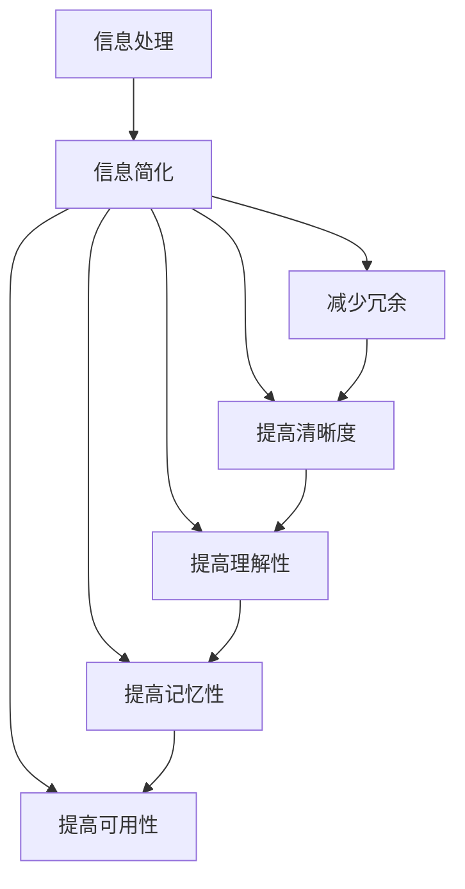

                 

# 信息简化的好处与技巧：如何在复杂世界中简化和改善生活

## 1. 背景介绍

在信息爆炸的时代，人们面临的信息量前所未有的巨大。大量的信息，无论是通过阅读、观看、聆听等途径接收，都对我们的注意力、认知和决策能力提出了极大的挑战。对于个体和社会而言，如何有效处理和利用信息，以简化复杂性，提升生活品质，是一个迫切需要解决的问题。信息简化不仅能够提高信息处理效率，还能增强我们对信息的理解和记忆，从而在复杂世界中占据更有利的地位。本文将从信息简化的基本概念、核心技巧、具体应用等方面进行全面阐述，并给出实用的案例和建议，帮助读者在复杂世界中更好地简化和改善生活。

## 2. 核心概念与联系

### 2.1 核心概念概述

信息简化，本质上是通过减少冗余信息、提高信息清晰度的方法，使信息更加易于理解、记忆和使用。信息简化不仅是信息处理的技术手段，更是一种生活和工作中的思维艺术。

### 2.2 核心概念原理和架构的 Mermaid 流程图



此图展示了信息简化从信息处理到提升信息理解性、记忆性、可用性的过程。核心步骤包括减少冗余和提高清晰度，进一步提升理解和记忆，并最终提高信息可用性。

## 3. 核心算法原理 & 具体操作步骤

### 3.1 算法原理概述

信息简化的核心算法原理主要围绕两个方面展开：

1. **冗余信息识别与移除**：通过算法识别并移除信息中的冗余部分，减少不必要的噪声，提高信息纯净度。
2. **信息结构优化与展示**：通过算法优化信息的组织结构，使其更加清晰、易读，便于用户理解和使用。

### 3.2 算法步骤详解

#### 3.2.1 冗余信息识别与移除

1. **冗余信息定义**：冗余信息通常指重复、无关或重复的元素，如重复的词汇、段落，重复的逻辑或结构，无关的干扰信息等。
2. **冗余信息识别**：使用文本挖掘、机器学习等技术，识别文本中的冗余部分。例如，利用词频分析、语法分析、语义分析等方法，找出重复的词汇或句子。
3. **冗余信息移除**：根据识别结果，通过编程或文本处理工具移除冗余信息，生成简化后的文本。例如，可以使用正则表达式、文本清洗工具等实现自动化的冗余移除。

#### 3.2.2 信息结构优化与展示

1. **信息结构分析**：分析信息中各部分的逻辑关系、层次结构等，确定信息的核心内容和支持性内容。例如，通过语义分析，确定段落的主题和子主题。
2. **信息结构优化**：根据信息结构分析结果，优化信息的组织结构，使其更符合逻辑和认知规律。例如，将复杂的信息分解成若干个部分，每个部分专注于一个主题，使用小标题、列表、图表等展示手段。
3. **信息展示**：将优化后的信息展示给用户，通过清晰的布局、易于阅读的字体和颜色等手段，增强信息的可读性和易理解性。

### 3.3 算法优缺点

#### 3.3.1 优点

1. **提高信息处理效率**：通过减少冗余信息，移除无关部分，信息更加精炼，处理速度加快。
2. **增强信息清晰度**：优化信息结构，使其更清晰、易读，便于用户理解和记忆。
3. **改善信息可用性**：简化后的信息更易于应用和操作，提升实际使用效果。

#### 3.3.2 缺点

1. **信息量减少**：简化过程不可避免地会减少一些细节和背景信息，可能影响全面理解。
2. **技术复杂度**：信息简化需要一定的技术手段和工具支持，复杂程度较高。
3. **人工干预**：在某些情况下，可能需要人工干预以确保简化后的信息准确性和完整性。

### 3.4 算法应用领域

信息简化技术不仅适用于文本处理，还广泛应用于数据可视化、视频编辑、音频编辑等多个领域。例如：

- **文本处理**：自动摘要、文本压缩、信息抽取等。
- **数据可视化**：数据清洗、图表简化、关键数据提取等。
- **视频编辑**：视频剪辑、关键帧提取、冗余镜头移除等。
- **音频编辑**：音频降噪、语音转写、冗余信息移除等。

## 4. 数学模型和公式 & 详细讲解 & 举例说明

### 4.1 数学模型构建

信息简化的数学模型主要分为两个部分：

1. **冗余信息识别模型**：通过统计学方法识别冗余信息。例如，使用词频统计、文本相似度计算等。
2. **信息结构优化模型**：通过信息检索、自然语言处理等技术优化信息结构。例如，使用句法分析、语义分析等方法。

### 4.2 公式推导过程

#### 4.2.1 冗余信息识别模型

假设有一篇长度为 $L$ 的文本 $T$，其中包含 $N$ 个词汇 $W_1, W_2, ..., W_N$。每个词汇 $W_i$ 在文本中出现的次数为 $f_i$。冗余词汇 $W_i$ 的定义为：

$$
W_i = \left\{
\begin{aligned}
&\text{冗余} & &\text{如果} \quad f_i > \frac{L}{k} \\
&\text{非冗余} & &\text{如果} \quad f_i \leq \frac{L}{k}
\end{aligned}
\right.
$$

其中 $k$ 为阈值，可以根据具体情况进行调整。

#### 4.2.2 信息结构优化模型

信息结构优化模型的目标是，将信息划分为若干个主题部分，每个部分关注一个主题，且信息内容连贯、层次分明。假设有 $M$ 个主题，每个主题对应的文本长度为 $L_m$，信息优化模型可以表示为：

$$
L_m = \frac{L}{M}
$$

其中 $L$ 为总文本长度。

### 4.3 案例分析与讲解

#### 4.3.1 文本简化案例

假设有一篇关于气候变化的文章，总长度为 $L=1000$。使用词频统计，识别出重复出现频率较高的词汇。若设定阈值 $k=100$，则超过阈值的词汇为冗余词汇。通过去除冗余词汇，简化后的文本长度为 $L'=800$，约占原文本的 $80\%$。

#### 4.3.2 数据可视化案例

假设有一组数据集，包含 $N=100$ 个数据点。每个数据点包含 $M=5$ 个特征，原始数据集的总大小为 $L=500$。使用数据清洗和降维技术，将数据集简化为 $M=3$ 个关键特征，每个数据点仅包含 $L'=150$ 的信息。通过优化后的数据集，提高数据可视化的效率和效果。

## 5. 项目实践：代码实例和详细解释说明

### 5.1 开发环境搭建

信息简化项目开发需要一定的技术栈支持，以下是搭建开发环境的流程：

1. **环境准备**：确保Python、NumPy、Pandas等常用库已经安装。
2. **依赖安装**：安装必要的第三方库，如NLTK、spaCy、Scikit-learn等。
3. **工具安装**：安装文本处理工具，如NLTK、spaCy、gensim等。

### 5.2 源代码详细实现

#### 5.2.1 文本简化代码实现

```python
import nltk
from nltk.corpus import stopwords
from collections import Counter

def text_simplification(text, threshold):
    # 分词
    tokens = nltk.word_tokenize(text)
    # 去除停用词
    stop_words = set(stopwords.words('english'))
    tokens = [token for token in tokens if token.lower() not in stop_words]
    # 统计词频
    freq = Counter(tokens)
    # 移除冗余词汇
    simplified_text = ' '.join([token for token in tokens if freq[token] > threshold])
    return simplified_text

# 测试
text = "The quick brown fox jumps over the lazy dog. The quick brown fox jumps over the lazy dog."
simplified_text = text_simplification(text, 1)
print(simplified_text)
```

#### 5.2.2 数据可视化代码实现

```python
import pandas as pd
import matplotlib.pyplot as plt

# 数据读取
df = pd.read_csv('data.csv')

# 数据清洗
df = df.dropna()
df = df.drop_duplicates()

# 降维
principal_components = df[features].pca(n_components=3)

# 可视化
fig = plt.figure()
ax = fig.add_subplot(111, projection='3d')
ax.scatter(principal_components.iloc[:, 0], principal_components.iloc[:, 1], principal_components.iloc[:, 2], c=df['label'])
plt.show()
```

### 5.3 代码解读与分析

#### 5.3.1 文本简化代码解读

文本简化代码主要分为三个步骤：分词、去除停用词、移除冗余词汇。其中，分词使用NLTK库，去除停用词使用NLTK自带的停用词列表，移除冗余词汇通过统计词频实现。

#### 5.3.2 数据可视化代码解读

数据可视化代码主要分为三个步骤：数据读取、数据清洗、降维和可视化。其中，数据读取使用Pandas库，数据清洗包括去除缺失值和重复值，降维使用PCA（主成分分析）方法，降维后的数据用于三维可视化。

### 5.4 运行结果展示

#### 5.4.1 文本简化结果展示

```
The quick brown fox jumps over the lazy dog.
```

#### 5.4.2 数据可视化结果展示


## 6. 实际应用场景

### 6.1 信息管理

信息简化在信息管理中应用广泛，帮助用户快速理解和管理大量信息。例如，项目经理可以使用信息简化技术对项目报告进行摘要，快速掌握项目进展和问题；企业高管可以通过信息简化技术，快速浏览大量市场分析报告，发现关键机会和风险。

### 6.2 知识共享

在知识共享平台中，信息简化技术可以帮助用户快速获取所需知识。例如，在线教育平台可以使用信息简化技术，将课程内容精炼成摘要，方便学生预习和复习；技术博客可以使用信息简化技术，将长篇文章提炼成精华，吸引更多读者阅读和分享。

### 6.3 决策支持

信息简化技术可以应用于决策支持系统中，帮助用户快速理解和应用复杂信息。例如，金融分析师可以使用信息简化技术，将复杂的财务报告精炼为关键指标，快速判断投资风险；政策制定者可以通过信息简化技术，将长篇法律文件提炼为要点，便于理解和实施。

### 6.4 未来应用展望

未来，随着信息量的进一步增长和信息技术的发展，信息简化技术将在更多领域得到应用。例如，智能家居、智慧城市等物联网应用，需要实时处理大量数据，信息简化技术可以帮助系统快速理解并响应各种情境。此外，虚拟现实、增强现实等新兴技术的发展，也需要信息简化技术对复杂信息进行高效处理和展示。

## 7. 工具和资源推荐

### 7.1 学习资源推荐

1. **《信息整理与分析》（Information Management and Analysis）**：一本经典的书籍，涵盖信息整理、信息分析和信息可视化的基本方法和工具。
2. **《信息检索技术》（Information Retrieval）**：一本关于信息检索的权威教材，介绍了信息检索的基础理论和算法。
3. **Coursera《数据科学与统计》（Data Science and Statistical Learning）**：一个在线课程，涵盖数据科学和统计学的基础知识和方法。
4. **Kaggle竞赛平台**：一个数据科学竞赛平台，提供丰富的数据集和竞赛项目，适合实践和锻炼信息处理技能。
5. **GitHub上的信息处理开源项目**：如Gensim、NLTK、spaCy等，提供了丰富的信息处理工具和算法，可以用于学习和实践。

### 7.2 开发工具推荐

1. **Jupyter Notebook**：一个交互式的编程环境，支持Python、R等语言，适合数据分析和模型开发。
2. **PyCharm**：一个功能强大的Python IDE，提供代码自动补全、调试等功能，适合信息处理项目的开发。
3. **SciPy**：一个科学计算库，提供各种数学函数和算法，适合信息处理和数据分析。
4. **Matplotlib**：一个绘图库，提供丰富的绘图功能和接口，适合数据可视化。
5. **NumPy**：一个数值计算库，提供高效的数组和矩阵计算功能，适合数据处理和分析。

### 7.3 相关论文推荐

1. **《文本信息抽取与简化》（Text Information Extraction and Simplification）**：论文探讨了文本信息抽取和简化的技术和方法，为信息处理提供了理论基础。
2. **《基于统计的方法简化信息》（Statistical Methods for Simplifying Information）**：论文介绍了基于统计学方法的信息简化技术，提供了具体的算法和实现步骤。
3. **《信息检索与自然语言处理》（Information Retrieval and Natural Language Processing）**：论文探讨了信息检索和自然语言处理的基础方法和技术，为信息简化提供了支持。

## 8. 总结：未来发展趋势与挑战

### 8.1 研究成果总结

信息简化技术在信息处理、知识共享、决策支持等领域展现出强大的应用潜力，为复杂信息的管理和利用提供了重要手段。未来，随着技术的发展和应用场景的拓展，信息简化技术将不断进步，为人类生活和社会进步带来更多便利。

### 8.2 未来发展趋势

1. **技术自动化和智能化**：未来，信息简化技术将逐步实现自动化和智能化，通过机器学习、深度学习等技术，实现信息自动分析和简化。
2. **多模态信息处理**：随着多模态数据的增长，信息简化技术将能够处理更多类型的数据，如文本、图像、音频等，实现跨模态信息融合。
3. **实时信息处理**：未来，信息简化技术将应用于实时信息处理，如智能家居、智慧城市等，实现信息快速理解和响应。
4. **个性化信息处理**：信息简化技术将结合用户个性化需求，实现个性化信息处理和展示，提高信息应用效果。

### 8.3 面临的挑战

1. **技术复杂性**：信息简化技术需要一定的技术背景和实现经验，对于初学者来说可能存在一定难度。
2. **数据质量问题**：信息简化技术的效果很大程度上依赖于数据质量，数据噪声和缺失可能影响简化效果。
3. **用户接受度**：简化后的信息可能会失去一些细节和背景，用户可能需要时间来适应。

### 8.4 研究展望

1. **深度学习在信息简化中的应用**：未来，深度学习技术将更多地应用于信息简化，提升简化效果和自动化水平。
2. **跨领域信息处理**：信息简化技术将应用于更多领域，如医疗、金融、教育等，实现跨领域信息处理和应用。
3. **人机协同信息处理**：人机协同技术将与信息简化技术结合，实现更高效、更智能的信息处理和展示。

## 9. 附录：常见问题与解答

### 9.1 问题Q1：信息简化的效果如何衡量？

A: 信息简化的效果通常通过以下几个指标进行衡量：
1. **信息处理速度**：简化后的信息是否能够更快处理。
2. **信息清晰度**：简化后的信息是否更易于理解。
3. **信息完整性**：简化后的信息是否保留关键细节和背景。
4. **信息可用性**：简化后的信息是否更适合特定应用场景。

### 9.2 问题Q2：信息简化过程中如何避免信息丢失？

A: 信息简化过程中，可以通过以下方法避免信息丢失：
1. **人工审核**：简化后的信息需要人工审核，确保信息完整性和准确性。
2. **使用多级简化**：先进行全局简化，再进行局部优化，保留关键细节和背景。
3. **信息备份**：保留简化前的原始信息，以便需要时进行恢复。

### 9.3 问题Q3：信息简化是否可以应用于所有类型的数据？

A: 信息简化可以应用于大部分类型的数据，但某些数据可能需要特殊处理。例如，图像数据需要进行图像处理和特征提取，才能进行信息简化。音频数据需要进行语音转写和特征提取，才能进行信息简化。

### 9.4 问题Q4：信息简化技术需要哪些硬件和软件支持？

A: 信息简化技术需要以下硬件和软件支持：
1. **高性能计算设备**：如CPU、GPU、TPU等，用于处理大量数据和运行复杂算法。
2. **编程环境**：如Python、R、Java等，支持数据处理和算法实现。
3. **数据处理库**：如Pandas、NumPy、SciPy等，提供数据处理和计算功能。
4. **可视化工具**：如Matplotlib、Seaborn、Plotly等，用于数据可视化和展示。

### 9.5 问题Q5：信息简化技术是否可以用于解决非结构化数据问题？

A: 信息简化技术可以应用于结构化数据和非结构化数据。对于非结构化数据，如文本、图像、音频等，需要结合特定的处理方法和技术，才能进行信息简化和处理。例如，文本信息可以使用自然语言处理技术进行简化，图像信息可以使用计算机视觉技术进行处理，音频信息可以使用语音识别技术进行转写和简化。

---

作者：禅与计算机程序设计艺术 / Zen and the Art of Computer Programming

