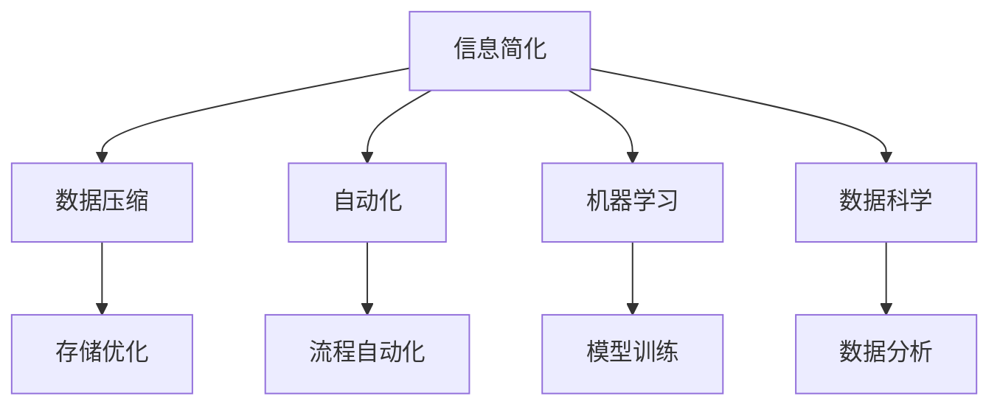

                 

# 信息简化的好处与挑战：简化复杂性的艺术与科学

> 关键词：信息简化,复杂性,数据压缩,自动化,机器学习,数据科学

## 1. 背景介绍

### 1.1 问题由来

在信息爆炸的今天，数据和信息无处不在。随着互联网、物联网的快速发展，每天有海量的数据产生并被存储下来。这些数据不仅仅限于文本和图像，还包括日志文件、传感器数据、视频和音频等。然而，信息量和复杂性的爆炸式增长也带来了新的挑战：如何从海量的数据中提取有价值的信息，并简化复杂性以供人类和机器理解和利用？

信息简化（Information Simplification），即从复杂数据中提取出关键信息并加以精简的过程，是数据科学、人工智能和机器学习中的核心任务。随着技术的发展，自动化、智能化的信息简化方法正在被广泛研究和使用，以应对这一挑战。

### 1.2 问题核心关键点

信息简化的好处显而易见：

1. **降低处理成本**：简化后的信息通常更易于处理，能够减少计算和存储资源的需求。
2. **提升可读性**：简化后的信息更易被人理解，提高信息传递的效率和效果。
3. **增强决策质量**：通过聚焦关键信息，提高决策的准确性和有效性。
4. **促进创新**：简化后的信息更便于分析，能快速揭示数据中的模式和趋势，推动新思想的产生。

然而，信息简化的挑战同样不容忽视：

1. **保持信息完整性**：在简化过程中，必须确保关键信息不被丢失，以避免误导性或不准确的结果。
2. **兼顾多样性**：简化过程中需要考虑不同受众的需求，保持信息的广度和深度。
3. **处理高维数据**：对于高维数据，如何在保留关键特征的同时简化表示是一个难题。
4. **自动化和个性化**：如何自动、个性化地对信息进行简化，并适应不同的上下文环境，是一个复杂的任务。

信息简化不仅仅是数据处理的技术问题，更是一门艺术和科学。本文将从核心概念、算法原理、具体操作、数学模型等多个角度，系统地探讨信息简化的原理与实践，帮助读者深入理解并掌握这一重要技术。

## 2. 核心概念与联系

### 2.1 核心概念概述

为了更好地理解信息简化，首先介绍几个关键概念：

- **信息简化（Information Simplification）**：从复杂数据中提取关键信息并加以精简的过程。通常用于处理大规模数据、提升数据可读性和促进信息共享。
- **数据压缩（Data Compression）**：通过算法对数据进行压缩，减少数据存储和传输的体积。与信息简化类似，但关注点更多在于数据量的减少。
- **自动化（Automation）**：利用算法和工具自动完成信息简化的任务，提高效率和准确性。
- **机器学习（Machine Learning）**：通过训练模型学习数据的特征和模式，自动进行信息提取和简化。
- **数据科学（Data Science）**：融合统计学、机器学习、数据库管理等多个学科，解决数据处理和信息提取的科学。

这些概念之间的逻辑关系可以通过以下Mermaid流程图来展示：



这个流程图展示了一个完整的信息简化流程：从原始数据开始，经过数据压缩、自动化处理、机器学习模型训练和数据科学分析，最终得到简化后的信息。

## 3. 核心算法原理 & 具体操作步骤

### 3.1 算法原理概述

信息简化的算法原理主要包括三个步骤：数据预处理、特征选择和模型训练。

1. **数据预处理**：对原始数据进行清洗、去重、标准化等操作，确保数据的质量和一致性。
2. **特征选择**：通过算法从数据中提取最重要的特征，减少数据的维度，提升数据处理效率。
3. **模型训练**：利用机器学习模型对数据进行训练，学习数据的模式和规律，以自动进行特征选择和信息简化。

### 3.2 算法步骤详解

#### 3.2.1 数据预处理

数据预处理是信息简化的第一步，主要包括以下几个步骤：

1. **数据清洗**：去除缺失值、异常值等不完整的数据点，确保数据的准确性。
2. **数据标准化**：对数据进行归一化、中心化等处理，使其符合一定的统计分布，便于后续分析。
3. **数据分割**：将数据划分为训练集、验证集和测试集，确保模型训练和评估的可靠性。

#### 3.2.2 特征选择

特征选择是信息简化的关键步骤，旨在从原始数据中提取出最重要、最有用的特征。常用的特征选择方法包括：

1. **信息增益**：通过计算特征对分类任务的贡献度，选择最有信息增益的特征。
2. **卡方检验**：衡量特征与分类目标之间的相关性，选择与目标最相关的特征。
3. **相关性分析**：通过计算特征与目标变量之间的相关系数，选择相关性高的特征。
4. **主成分分析（PCA）**：通过线性变换将高维数据降维到低维空间，保留主要特征信息。

#### 3.2.3 模型训练

模型训练是信息简化的核心步骤，通过训练模型学习数据的模式和规律，自动进行特征选择和信息简化。常用的机器学习模型包括：

1. **决策树**：通过树形结构分割数据，选择最重要的特征进行分类。
2. **随机森林**：通过多个决策树的组合，提高模型的稳定性和准确性。
3. **支持向量机（SVM）**：通过寻找最优超平面，进行二分类或多分类。
4. **神经网络**：通过多层非线性变换，提取数据的高级特征。

### 3.3 算法优缺点

信息简化的算法具有以下优点：

1. **提升数据处理效率**：通过减少数据维度，减少计算和存储资源的需求。
2. **增强模型性能**：通过特征选择和模型训练，提高模型的准确性和泛化能力。
3. **自动化处理**：通过算法和工具，自动完成数据预处理、特征选择和模型训练，减少人工干预。
4. **提高可读性**：通过简化信息，提高数据和报告的可读性和理解度。

但同时，信息简化也存在以下缺点：

1. **丢失信息风险**：在特征选择和模型训练过程中，可能会丢失部分重要信息，影响结果的准确性。
2. **模型复杂度**：过度简化可能导致模型过于简单，无法捕捉数据中的复杂规律。
3. **计算开销**：特征选择和模型训练本身也需要消耗计算资源，增加了处理时间。
4. **模型解释性**：复杂的模型和算法可能难以解释，影响结果的可信度和可操作性。

### 3.4 算法应用领域

信息简化技术在多个领域都有广泛的应用：

1. **自然语言处理（NLP）**：用于文本摘要、情感分析、信息抽取等任务，提升文本处理效率和效果。
2. **计算机视觉（CV）**：用于图像分类、目标检测、图像压缩等任务，减少图像数据量，提高处理速度。
3. **医疗领域**：用于病历分析、药物研发等任务，提取关键信息，提高医疗决策的科学性和准确性。
4. **金融领域**：用于风险评估、市场预测等任务，提取关键特征，降低分析成本。
5. **社交网络**：用于用户行为分析、推荐系统等任务，提取关键信息，提高社交互动效率。

## 4. 数学模型和公式 & 详细讲解 & 举例说明

### 4.1 数学模型构建

信息简化的数学模型主要包括以下几个组成部分：

1. **原始数据集**：表示为 $D=\{x_1,x_2,...,x_n\}$，其中 $x_i$ 表示数据点的特征向量。
2. **目标变量**：表示为 $y$，用于分类或回归任务。
3. **特征集合**：表示为 $\mathcal{F}$，用于表示数据中的特征。

### 4.2 公式推导过程

以信息增益（Information Gain）为例，推导特征选择的数学模型。

设原始数据集 $D=\{x_1,x_2,...,x_n\}$，其中 $x_i$ 表示数据点的特征向量。目标变量为 $y$，用于分类任务。假设特征集合为 $\mathcal{F}=\{f_1,f_2,...,f_m\}$。

信息增益定义为：

$$
\text{IG}(D,y,f) = \text{Entropy}(D) - \sum_{i=1}^m \text{Entropy}(D|f_i)
$$

其中，$\text{Entropy}(D)$ 表示数据集 $D$ 的熵，$\text{Entropy}(D|f_i)$ 表示在特征 $f_i$ 条件下数据集 $D$ 的熵。

信息增益越大，表示特征 $f_i$ 对分类任务的贡献度越高，应优先选择。

### 4.3 案例分析与讲解

以文本摘要为例，分析信息简化的应用过程。

假设原始文本数据集 $D=\{x_1,x_2,...,x_n\}$，每个文本 $x_i$ 表示为一组单词序列。目标变量为 $y$，表示文本的主题。假设特征集合为 $\mathcal{F}=\{f_1,f_2,...,f_m\}$，其中 $f_i$ 表示文本中第 $i$ 个单词的重要性。

1. **数据预处理**：对原始文本进行分词、去停用词、标点符号处理等操作，确保数据的一致性和质量。
2. **特征选择**：使用信息增益或TF-IDF等方法，选择与文本主题最相关的单词，作为特征集合 $\mathcal{F}$。
3. **模型训练**：使用文本分类模型（如朴素贝叶斯、支持向量机等）对数据进行训练，自动提取文本的特征并简化信息。

## 5. 项目实践：代码实例和详细解释说明

### 5.1 开发环境搭建

在进行信息简化实践前，我们需要准备好开发环境。以下是使用Python进行Scikit-Learn开发的环境配置流程：

1. 安装Anaconda：从官网下载并安装Anaconda，用于创建独立的Python环境。
2. 创建并激活虚拟环境：
```bash
conda create -n simplified_env python=3.8 
conda activate simplified_env
```

3. 安装Scikit-Learn：
```bash
pip install scikit-learn
```

4. 安装其他相关工具包：
```bash
pip install numpy pandas matplotlib seaborn sklearn
```

完成上述步骤后，即可在`<simplified_env>`环境中开始信息简化的实践。

### 5.2 源代码详细实现

这里我们以信息增益特征选择为例，给出使用Scikit-Learn库进行文本分类任务的信息简化代码实现。

```python
import numpy as np
from sklearn.feature_extraction.text import TfidfVectorizer
from sklearn.feature_selection import SelectKBest, chi2
from sklearn.ensemble import RandomForestClassifier
from sklearn.metrics import accuracy_score
from sklearn.model_selection import train_test_split

# 原始文本数据集
texts = ["这是第一段文本", "这是第二段文本", "这是第三段文本", "这是第四段文本"]

# 特征选择（信息增益）
vectorizer = TfidfVectorizer(stop_words='english')
X = vectorizer.fit_transform(texts)

# 目标变量
y = np.array([1, 1, 0, 0])

# 特征选择
selector = SelectKBest(chi2, k=2)
X = selector.fit_transform(X, y)

# 模型训练
clf = RandomForestClassifier()
clf.fit(X, y)

# 预测
X_new = vectorizer.transform(["这是第五段文本", "这是第六段文本"])
X_new = selector.transform(X_new)
prediction = clf.predict(X_new)

print(prediction)
```

### 5.3 代码解读与分析

让我们再详细解读一下关键代码的实现细节：

**特征选择（信息增益）**：
- 使用Scikit-Learn库中的`TfidfVectorizer`对文本数据进行向量化处理，去除停用词，并进行TF-IDF权重计算。
- 使用`SelectKBest`选择与目标变量最相关的特征。`chi2`表示卡方检验，用于衡量特征与目标变量之间的相关性。
- 设置`k`值为2，表示选择最重要的2个特征。

**模型训练**：
- 使用`RandomForestClassifier`对数据进行训练，自动学习数据的模式和规律。
- `RandomForest`是一种集成学习方法，通过多个决策树的组合，提高模型的稳定性和准确性。

**预测**：
- 使用训练好的模型对新的文本数据进行预测，输出分类结果。

## 6. 实际应用场景

### 6.1 智能客服系统

信息简化技术在智能客服系统中的应用，能够显著提升系统的响应速度和准确性。传统客服系统往往需要人工审核和分类，效率低下且难以处理复杂的用户问题。通过信息简化，可以将用户对话自动分类，并提取关键信息，快速响应用户需求。

**具体实现**：
- 收集客服对话数据，进行清洗和预处理。
- 使用信息增益或相关性分析等方法，选择与用户意图相关的特征。
- 训练分类模型（如朴素贝叶斯、支持向量机等），对用户对话进行自动分类。
- 根据分类结果，生成自动回复，提高客服系统效率。

### 6.2 医疗诊断系统

在医疗诊断系统中，信息简化技术能够帮助医生快速获取患者的关键信息，提升诊断的准确性和效率。传统的医疗诊断系统需要医生手动输入和处理大量数据，容易出现误差。通过信息简化，可以从病历中提取出关键信息，减少医生的工作量。

**具体实现**：
- 收集病历数据，进行清洗和预处理。
- 使用信息增益或主成分分析等方法，选择与疾病诊断相关的特征。
- 训练分类模型（如支持向量机、神经网络等），对病历数据进行自动分类和诊断。
- 根据诊断结果，生成推荐治疗方案，提升医疗决策的科学性。

### 6.3 金融风险评估

在金融领域，信息简化技术能够帮助金融机构评估客户的信用风险，提升风险管理的效率。传统的金融风险评估需要人工审核和分析大量数据，容易出现主观偏差。通过信息简化，可以从客户数据中提取出关键特征，自动进行信用评估。

**具体实现**：
- 收集客户数据，进行清洗和预处理。
- 使用信息增益或卡方检验等方法，选择与信用风险相关的特征。
- 训练分类模型（如决策树、随机森林等），对客户数据进行自动分类和风险评估。
- 根据评估结果，生成风险控制策略，降低金融风险。

## 7. 工具和资源推荐

### 7.1 学习资源推荐

为了帮助开发者系统掌握信息简化的理论基础和实践技巧，这里推荐一些优质的学习资源：

1. **《信息简化的数学基础与算法》**：深入浅出地介绍了信息简化的基本概念和常见算法。
2. **《机器学习实战》**：涵盖了机器学习算法和工具的实践应用，包括信息简化的具体实现。
3. **Kaggle平台**：提供了大量机器学习竞赛和数据集，可以用于学习和实践信息简化技术。
4. **Coursera平台**：开设了多门机器学习相关的课程，涵盖信息简化技术的应用。

### 7.2 开发工具推荐

信息简化的开发离不开优秀的工具支持。以下是几款用于信息简化开发的常用工具：

1. **Scikit-Learn**：基于Python的开源机器学习库，提供了丰富的特征选择和模型训练工具。
2. **TensorFlow**：由Google主导开发的深度学习框架，支持自动微分和分布式训练。
3. **PyTorch**：基于Python的开源深度学习框架，灵活的动态计算图，支持模型的快速迭代。
4. **Weights & Biases**：模型训练的实验跟踪工具，记录和可视化模型训练过程中的各项指标。
5. **TensorBoard**：TensorFlow配套的可视化工具，实时监测模型训练状态，并提供丰富的图表呈现方式。

### 7.3 相关论文推荐

信息简化的研究源于学界的持续探索。以下是几篇奠基性的相关论文，推荐阅读：

1. **《信息增益》**：提出了信息增益的概念，用于特征选择和信息简化。
2. **《卡方检验》**：介绍了卡方检验的基本原理和应用。
3. **《主成分分析》**：详细介绍了主成分分析的数学模型和实际应用。
4. **《自动信息摘要》**：探讨了自动生成文本摘要的技术和方法。
5. **《深度学习在信息简化中的应用》**：介绍了深度学习在信息简化中的最新进展和实际应用。

## 8. 总结：未来发展趋势与挑战

### 8.1 研究成果总结

信息简化的技术在多个领域已经得到了广泛应用，取得了显著的成果。主要体现在以下几个方面：

1. **提升数据处理效率**：通过信息简化，减少了数据处理的复杂度和时间成本，提高了数据处理的效率。
2. **增强模型性能**：通过特征选择和模型训练，提升了模型的准确性和泛化能力，提高了信息提取和简化的效果。
3. **实现自动化处理**：通过自动化工具和算法，减少了人工干预，提高了信息简化的效率和可靠性。

### 8.2 未来发展趋势

展望未来，信息简化技术的发展趋势主要包括以下几个方面：

1. **深度学习的应用**：深度学习模型的广泛应用，将提升信息简化的自动化程度和准确性。
2. **跨领域的应用**：信息简化技术将在更多领域得到应用，如医疗、金融、社交网络等。
3. **个性化和动态化**：信息简化将更加注重个性化和动态化，根据不同的用户需求和上下文环境，自动选择和简化解码信息。
4. **融合其他技术**：信息简化将与其他技术（如自然语言处理、计算机视觉等）进行深度融合，提升信息处理和分析的全面性和复杂性。

### 8.3 面临的挑战

尽管信息简化技术已经取得了显著进展，但仍面临一些挑战：

1. **数据质量和多样性**：原始数据的质量和多样性直接影响信息简化的效果，需要解决数据清洗和预处理的问题。
2. **模型复杂度**：过度简化可能导致模型过于简单，无法捕捉数据中的复杂规律。
3. **计算资源需求**：信息简化本身也需要消耗计算资源，需要在计算效率和效果之间找到平衡。
4. **模型可解释性**：复杂的模型和算法可能难以解释，影响结果的可信度和可操作性。

### 8.4 研究展望

未来的研究需要在以下几个方面寻求新的突破：

1. **无监督学习**：探索无监督和半监督学习的方法，摆脱对大量标注数据的依赖，提高信息简化的效率和准确性。
2. **多模态信息融合**：将信息简化与其他模态的信息融合，提升信息的全面性和复杂性。
3. **自动化和个性化**：进一步提高信息简化的自动化程度，增强个性化和动态化，提升信息简化的效果和应用范围。
4. **跨领域应用**：将信息简化技术应用于更多的领域，提升各领域的信息处理和分析能力。

## 9. 附录：常见问题与解答

**Q1：信息简化和数据压缩的区别是什么？**

A: 信息简化和数据压缩都是信息处理的重要技术，但关注点略有不同。信息简化旨在从数据中提取关键信息并加以精简，提升信息的可读性和处理效率。而数据压缩则是通过算法减少数据存储和传输的体积，降低资源消耗。两者可以互补使用，但信息简化更注重信息的理解和应用。

**Q2：信息简化的过程中如何避免丢失关键信息？**

A: 信息简化的过程中，可以通过以下方法避免丢失关键信息：
1. 选择合适的特征选择方法，确保选取的特征能够代表原始数据的关键信息。
2. 在特征选择和模型训练过程中，设置合理的参数和阈值，防止过度简化。
3. 结合领域知识和人工干预，对信息简化的结果进行验证和调整。

**Q3：信息简化的自动化实现有什么优点和挑战？**

A: 信息简化的自动化实现具有以下优点：
1. 提高处理效率，减少人工干预，降低成本。
2. 提高准确性，减少人工失误，提升结果可靠性。
3. 提高可扩展性，支持大规模数据的处理和分析。

但同时，自动化实现也面临一些挑战：
1. 需要大量数据和计算资源，前期投入较大。
2. 模型的复杂性和可解释性可能降低，难以理解模型的决策过程。
3. 需要不断优化和调整，保持自动化处理的准确性和效果。

通过不断优化和改进，信息简化的自动化实现将更好地适应实际应用的需求。

---

作者：禅与计算机程序设计艺术 / Zen and the Art of Computer Programming

