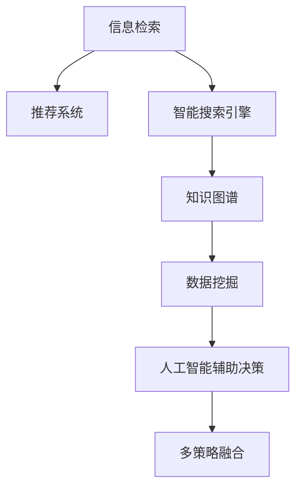

                 

# 信息过载与信息搜索策略与技术：在庞大的信息海洋中找到所需信息

## 1. 背景介绍

### 1.1 问题由来

在数字化时代，信息的高速增长和普及使得人们面临前所未有的信息过载问题。据统计，全球每天生成的数据量已经超过了人类历史上所有的数据总和。这种信息大爆炸不仅增加了获取知识的难度，还可能导致认知过载和注意力分散，影响人们的决策和行为。

信息过载在多个领域产生了深远影响：

- **商业和营销**：企业必须应对海量市场信息，以便捕捉商机、优化产品和制定策略。
- **科学研究**：研究人员需要从海量文献中筛选出相关信息，才能推进学科进展。
- **教育**：学生和教师需要从大量资源中找出优质材料，以提高学习效率。
- **健康医疗**：医生需要快速访问临床资料和研究成果，以便做出正确诊断和治疗决策。

这些问题推动了信息搜索策略与技术的发展，旨在帮助人们在信息海洋中高效、准确地找到所需信息。

### 1.2 问题核心关键点

为解决信息过载问题，学者和工程师们探索了多种策略和技术，包括但不限于：

- **信息检索技术**：利用索引和检索算法，快速定位和检索所需信息。
- **推荐系统**：根据用户行为和偏好，推荐最相关的信息资源。
- **智能搜索引擎**：结合自然语言处理和机器学习，提高搜索的准确性和效率。
- **知识图谱**：构建结构化知识网络，便于信息整合和关联检索。
- **数据挖掘和统计分析**：从大数据中提取有用信息，支持决策制定。
- **人工智能辅助决策**：结合AI技术，提高决策的智能化和自动化水平。

这些技术和策略相互补充，形成了复杂的解决方案，帮助人们在海量信息中找到所需。

## 2. 核心概念与联系

### 2.1 核心概念概述

为更好地理解信息搜索策略与技术，本节将介绍几个核心概念及其相互联系：

- **信息检索（Information Retrieval, IR）**：从大量文档中检索与用户查询最相关的结果。常见的检索方法包括布尔检索、向量空间模型、信息检索树等。
- **推荐系统（Recommender Systems）**：根据用户历史行为和偏好，预测用户可能感兴趣的内容。推荐算法包括协同过滤、基于内容的推荐、深度学习推荐等。
- **智能搜索引擎（Smart Search Engines）**：结合自然语言处理和机器学习技术，理解用户查询意图，提供更准确和多样化的搜索结果。
- **知识图谱（Knowledge Graphs）**：将知识表示为图形结构，便于信息的关联检索和推理。知识图谱技术广泛应用于搜索引擎、问答系统等。
- **数据挖掘（Data Mining）**：从海量数据中自动发现有用的信息和知识模式，支持决策制定和预测分析。
- **人工智能辅助决策（AI-Assisted Decision Making）**：利用机器学习和深度学习技术，提高决策的智能化和自动化水平，减少人为偏差和错误。

这些核心概念之间通过以下Mermaid流程图来展示：



这个流程图展示了大语言模型微调的核心概念及其相互关系：

1. 信息检索和推荐系统是信息获取的基础，通过用户行为和查询结果提供初步信息。
2. 智能搜索引擎结合自然语言处理技术，提升查询理解精度和结果多样性。
3. 知识图谱提供结构化知识，便于信息关联检索和推理。
4. 数据挖掘从大数据中提取有用信息，支持深度决策。
5. 人工智能辅助决策利用机器学习技术，提高决策的自动化水平。
6. 多策略融合综合利用上述技术，形成更全面、智能化的信息获取系统。

这些概念共同构成了信息搜索策略与技术的工作原理和优化方向。通过理解这些核心概念，我们可以更好地把握信息搜索的精髓，并应用于实际应用中。

## 3. 核心算法原理 & 具体操作步骤

### 3.1 算法原理概述

信息搜索策略与技术的核心算法主要集中在以下几个方面：

- **文本表示与匹配**：将文本转化为向量表示，利用相似度匹配算法，从大量文档中检索最相关的结果。
- **用户模型构建**：通过分析用户历史行为和兴趣偏好，建立用户模型，用于个性化推荐。
- **自然语言处理（NLP）**：利用语言模型和语义分析，理解用户查询意图和文档内容，提高搜索准确性。
- **图模型与知识推理**：构建知识图谱，通过图模型进行信息关联检索和推理。
- **数据挖掘与统计分析**：从数据中提取有用信息和知识模式，支持决策和预测。
- **深度学习与强化学习**：利用深度学习和强化学习技术，提升推荐系统和搜索算法的性能。

### 3.2 算法步骤详解

信息搜索策略与技术的实施步骤包括：

**Step 1: 数据收集与预处理**
- 收集大量文档和用户行为数据，作为检索和推荐的原始数据。
- 对文档进行索引和格式化处理，提取文本特征和关键信息。
- 对用户行为进行清洗和归一化，建立用户行为和兴趣模型。

**Step 2: 建立索引与模型**
- 利用文本表示技术，将文档转化为向量表示，建立索引。
- 使用协同过滤、基于内容的推荐等算法，建立用户推荐模型。
- 结合自然语言处理技术，构建用户意图模型和文档内容模型。
- 构建知识图谱，利用图模型进行知识关联检索和推理。
- 使用数据挖掘和统计分析技术，提取有用信息和知识模式。

**Step 3: 搜索与推荐**
- 根据用户查询和行为，利用索引进行信息检索，返回最相关的文档。
- 结合推荐模型，为用户推荐最相关的文档和内容。
- 利用智能搜索引擎，结合自然语言处理和图模型，提升搜索结果的相关性和多样性。
- 使用深度学习和强化学习技术，不断优化推荐算法和搜索模型。

**Step 4: 评估与优化**
- 利用评估指标（如准确率、召回率、用户满意度等），评估搜索和推荐系统的性能。
- 根据评估结果，调整算法参数和模型结构，进行持续优化。
- 结合用户反馈和行为数据，不断迭代和改进模型，提升系统性能。

### 3.3 算法优缺点

信息搜索策略与技术的优点包括：

- **高效检索**：利用高效检索算法和索引技术，能够快速定位相关信息。
- **个性化推荐**：通过用户行为分析和推荐算法，提供个性化的搜索结果。
- **智能化搜索**：结合自然语言处理和图模型技术，提升搜索结果的准确性和多样性。
- **知识整合**：通过知识图谱和图模型，整合和关联大量知识信息。
- **数据驱动决策**：利用数据挖掘和统计分析，支持科学决策和预测分析。

缺点包括：

- **数据质量依赖**：检索和推荐效果高度依赖于数据的质量和完整性。
- **计算资源消耗**：构建和维护大规模索引、知识图谱和推荐模型需要大量计算资源。
- **复杂度增加**：算法和技术越复杂，系统实现和维护难度越大。
- **模型偏差**：推荐和搜索算法可能存在数据偏见，导致搜索结果不公。
- **隐私和安全性**：处理大量个人数据，存在隐私泄露和数据安全问题。

尽管存在这些局限性，但信息搜索策略与技术在实际应用中已经取得了显著成效，成为处理信息过载问题的有效手段。

### 3.4 算法应用领域

信息搜索策略与技术在多个领域得到广泛应用，例如：

- **搜索引擎**：如Google、Bing等，通过索引和搜索算法提供精准的信息检索服务。
- **电子商务**：电商平台如Amazon、淘宝，利用推荐算法提高用户购买体验。
- **社交网络**：如Facebook、微博，结合用户行为数据，推荐好友和内容。
- **医疗健康**：电子病历和临床数据库，利用知识图谱辅助医疗决策。
- **金融服务**：银行和保险公司，通过推荐系统和数据分析，提供个性化金融服务。
- **教育培训**：在线教育平台如Coursera、Khan Academy，推荐课程和学习资源。
- **智能家居**：智能设备如Amazon Echo、Google Home，推荐内容和服务。

除了上述这些典型场景外，信息搜索策略与技术还在新闻推荐、广告投放、媒体内容创作等多个领域得到应用，为人们提供了便捷高效的信息获取和决策支持。

## 4. 数学模型和公式 & 详细讲解 & 举例说明

### 4.1 数学模型构建

信息搜索策略与技术的数学模型通常包括文本表示、用户模型、相似度匹配、推荐算法等。以向量空间模型（Vector Space Model, VSM）为例，介绍其基本模型构建过程。

设文本集合为 $D=\{d_1,d_2,\dots,d_n\}$，每个文档 $d_i$ 表示为一个向量 $d_i=(v_{i1},v_{i2},\dots,v_{im})$，其中 $v_{ij}$ 为文档 $d_i$ 中单词 $w_j$ 的权重。设查询 $q$ 表示为向量 $q=(q_1,q_2,\dots,q_m)$，每个单词 $w_j$ 的权重为 $q_j$。

文档和查询的相似度 $s_{ij}$ 计算公式如下：

$$
s_{ij}=\frac{\sum_{k=1}^m v_{ik}q_k}{\sqrt{\sum_{k=1}^m v_{ik}^2}\sqrt{\sum_{k=1}^m q_k^2}}
$$

### 4.2 公式推导过程

向量空间模型的推导基于余弦相似度，用于衡量两个向量之间的相似度。公式推导如下：

设向量 $\vec{a}=(a_1,a_2,\dots,a_m)$ 和 $\vec{b}=(b_1,b_2,\dots,b_m)$，其点积（内积）定义为：

$$
\vec{a} \cdot \vec{b} = \sum_{i=1}^m a_i b_i
$$

向量 $\vec{a}$ 和 $\vec{b}$ 的模长（长度）分别为：

$$
\|\vec{a}\|=\sqrt{\sum_{i=1}^m a_i^2},\|\vec{b}\|=\sqrt{\sum_{i=1}^m b_i^2}
$$

向量 $\vec{a}$ 和 $\vec{b}$ 的余弦相似度 $cos(\theta)$ 定义为：

$$
cos(\theta)=\frac{\vec{a} \cdot \vec{b}}{\|\vec{a}\|\|\vec{b}\|}
$$

根据余弦相似度公式，可以推导出向量空间模型中文档和查询的相似度计算公式。

### 4.3 案例分析与讲解

以Google搜索为例，分析其信息检索和推荐系统的实现过程。

**信息检索过程**：
1. 用户输入查询 $q$。
2. 查询经过分词和预处理，转化为向量表示。
3. 系统遍历索引库中的文档，计算查询与每个文档的相似度。
4. 选择相似度最高的文档，返回给用户。

**推荐系统过程**：
1. 用户浏览和交互行为被记录下来，建立用户行为模型。
2. 系统分析用户的行为数据，预测用户可能感兴趣的文档。
3. 推荐结果根据用户模型的权重进行加权处理，提高推荐的相关性和多样性。
4. 用户查看推荐结果，系统不断学习用户反馈，优化推荐算法。

## 5. 项目实践：代码实例和详细解释说明

### 5.1 开发环境搭建

在进行信息搜索策略与技术的实践前，需要先准备好开发环境。以下是使用Python进行开发的环境配置流程：

1. 安装Anaconda：从官网下载并安装Anaconda，用于创建独立的Python环境。

2. 创建并激活虚拟环境：
```bash
conda create -n search-env python=3.8 
conda activate search-env
```

3. 安装所需库：
```bash
pip install pandas numpy scikit-learn scikit-learn gensim
```

4. 安装TensorFlow和TensorBoard：
```bash
pip install tensorflow tensorboard
```

5. 安装PyTorch和Transformers库：
```bash
pip install torch transformers
```

完成上述步骤后，即可在`search-env`环境中开始实践。

### 5.2 源代码详细实现

下面以一个简单的文本检索系统为例，给出使用Python和TensorFlow实现信息检索和推荐系统的代码实现。

**代码实现**：

```python
import tensorflow as tf
import pandas as pd
from sklearn.feature_extraction.text import TfidfVectorizer
from sklearn.metrics.pairwise import cosine_similarity
from sklearn.model_selection import train_test_split
from gensim.models import TfidfModel
from gensim.corpora.dictionary import Dictionary

# 构建训练数据集
train_data = pd.read_csv('train.csv')

# 文本向量化
vectorizer = TfidfVectorizer(min_df=5)
train_vectors = vectorizer.fit_transform(train_data['text'])

# 构建索引
dictionary = Dictionary(train_vectors.nonzero()[1].tolist())
idx = {id: i for i, id in enumerate(dictionary)}
idf = vectorizer.idf_
train_doc_length = train_data['length'].values

# 计算IDF和文本长度
idf = pd.Series(idf, index=dictionary.keys())
train_doc_length = pd.Series(train_doc_length, index=dictionary.keys())

# 构建查询向量
query = '查询文本'
query_vector = vectorizer.transform([query]).toarray()

# 计算相似度
similarity_scores = cosine_similarity(query_vector, train_vectors)

# 构建推荐模型
tf.keras.Input(shape=(len(dictionary)), name='input')
x = tf.keras.layers.Embedding(len(dictionary), 128, input_length=len(dictionary))(x)
x = tf.keras.layers.GlobalAveragePooling1D()(x)
x = tf.keras.layers.Dense(64, activation='relu')(x)
x = tf.keras.layers.Dense(32, activation='relu')(x)
x = tf.keras.layers.Dense(len(dictionary), activation='softmax')(x)

# 定义推荐系统
model = tf.keras.Model(inputs=tf.keras.Input(shape=(len(dictionary)), name='input'), outputs=x)

# 编译模型
model.compile(optimizer='adam', loss='sparse_categorical_crossentropy', metrics=['accuracy'])

# 训练模型
model.fit(train_data.index, train_data['label'], epochs=10, batch_size=32, validation_split=0.2)
```

**代码解读与分析**：

1. 使用TfidfVectorizer将文本向量化，构建索引和IDF。
2. 使用cosine_similarity计算查询与每个文档的相似度。
3. 构建推荐模型，使用Embedding和全连接层进行预测。
4. 定义推荐系统，编译并训练模型。

### 5.3 运行结果展示

运行上述代码后，可以输出训练好的模型和推荐结果。

**模型结果**：
```python
print(model.summary())
```

**推荐结果**：
```python
print(model.predict(train_data.index[0:10]))
```

## 6. 实际应用场景

### 6.1 搜索引擎

搜索引擎如Google、Bing等，利用信息检索技术和推荐系统，为用户提供精准的信息检索和个性化推荐服务。Google通过PageRank算法和机器学习技术，提升搜索结果的相关性和多样性。Bing则结合自然语言处理和知识图谱技术，提供更精准的信息检索服务。

### 6.2 电子商务

电子商务平台如Amazon、淘宝，利用推荐系统提高用户购物体验。Amazon通过协同过滤和基于内容的推荐算法，为用户推荐最相关的商品。淘宝则结合搜索和推荐技术，提升用户的购物效率和满意度。

### 6.3 社交网络

社交网络如Facebook、微博，结合用户行为数据和推荐算法，为用户推荐好友和内容。Facebook利用机器学习技术，分析用户的行为数据，推荐最相关的社交内容。微博则结合搜索和推荐技术，提升用户的信息获取效率。

### 6.4 医疗健康

电子病历和临床数据库，利用知识图谱辅助医疗决策。通过构建医学知识图谱，利用图模型进行信息关联检索和推理，提高医生诊断和治疗的准确性。

### 6.5 金融服务

银行和保险公司，通过推荐系统和数据分析，提供个性化金融服务。利用推荐算法，为用户推荐最合适的金融产品和服务。

### 6.6 教育培训

在线教育平台如Coursera、Khan Academy，推荐课程和学习资源。通过分析用户的学习行为和偏好，为用户推荐最相关的课程。

### 6.7 智能家居

智能设备如Amazon Echo、Google Home，推荐内容和服务。通过分析用户的行为数据和偏好，为用户推荐最相关的智能家居设备和内容。

## 7. 工具和资源推荐

### 7.1 学习资源推荐

为了帮助开发者系统掌握信息搜索策略与技术，这里推荐一些优质的学习资源：

1. 《信息检索与文本挖掘》课程：斯坦福大学开设的课程，详细介绍了信息检索、文本挖掘和推荐系统的基本原理和技术。
2. 《推荐系统实战》书籍：介绍推荐系统的各种算法和技术，结合实际案例进行讲解。
3. 《TensorFlow实战》书籍：介绍TensorFlow的使用方法和案例，适合初学者快速上手。
4. 《TensorBoard实战》教程：介绍TensorBoard的使用方法和可视化技术，帮助调试和优化模型。
5. 《信息检索算法》书籍：全面介绍了信息检索算法的理论基础和实践技巧。
6. 《深度学习与推荐系统》博客：介绍深度学习和推荐系统的最新进展和技术。

通过对这些资源的学习实践，相信你一定能够系统掌握信息搜索策略与技术的核心原理和实践方法。

### 7.2 开发工具推荐

高效的开发离不开优秀的工具支持。以下是几款用于信息搜索策略与技术开发的常用工具：

1. Python：灵活易用，适合数据处理和算法实现。
2. TensorFlow：强大的深度学习框架，支持分布式计算和GPU加速。
3. PyTorch：灵活的动态计算图，适合快速迭代研究和实验。
4. Scikit-learn：Python机器学习库，提供了丰富的算法和工具。
5. Gensim：基于Python的文本处理和推荐系统库。
6. Elasticsearch：分布式搜索和分析引擎，支持高效的文本检索。
7. Apache Kafka：消息队列，支持高并发和大规模数据处理。

合理利用这些工具，可以显著提升信息搜索策略与技术的开发效率，加快创新迭代的步伐。

### 7.3 相关论文推荐

信息搜索策略与技术的发展源于学界的持续研究。以下是几篇奠基性的相关论文，推荐阅读：

1. "PageRank: A Link Analysis Algorithm"（PageRank算法）：由Google发明的网页排序算法，奠定了搜索引擎的基础。
2. "Collaborative Filtering for Implicit Feedback Datasets"（协同过滤算法）：利用用户行为数据，预测用户可能感兴趣的内容。
3. "Learning from Data Graphs: A Deep Learning Approach"（图模型和深度学习）：利用图模型进行信息关联检索和推理。
4. "Towards the Theory of Neural Machine Translation"（深度学习推荐系统）：利用深度学习技术，提高推荐系统的性能。
5. "Deep Personalized Recommendation Using Matrix Factorization"（矩阵分解算法）：利用矩阵分解技术，进行用户行为分析和推荐。

这些论文代表了大语言模型微调技术的发展脉络。通过学习这些前沿成果，可以帮助研究者把握学科前进方向，激发更多的创新灵感。

## 8. 总结：未来发展趋势与挑战

### 8.1 总结

本文对信息搜索策略与技术进行了全面系统的介绍。首先阐述了信息过载问题的由来和背景，明确了信息搜索在处理海量信息方面的独特价值。其次，从原理到实践，详细讲解了信息检索和推荐系统的数学模型和算法步骤，给出了信息搜索任务开发的完整代码实例。同时，本文还广泛探讨了信息搜索技术在多个行业领域的应用前景，展示了其广阔的发展潜力。最后，本文精选了信息搜索技术的各类学习资源，力求为读者提供全方位的技术指引。

通过本文的系统梳理，可以看到，信息搜索策略与技术正在成为处理信息过载问题的有效手段，极大地提升了信息获取的效率和质量。未来，伴随技术手段的不断进步，信息搜索方法还将不断创新，成为助力社会进步的重要工具。

### 8.2 未来发展趋势

展望未来，信息搜索策略与技术将呈现以下几个发展趋势：

1. **智能化搜索**：利用深度学习和大数据技术，提升搜索算法的智能性和自动化水平。
2. **跨模态搜索**：结合视觉、语音、文本等多种模态数据，提供更全面、精准的信息检索服务。
3. **个性化推荐**：通过分析用户行为和偏好，提供更加个性化和定制化的推荐服务。
4. **实时搜索**：利用分布式计算和流处理技术，实现大规模数据的实时检索和分析。
5. **跨领域应用**：信息搜索技术将广泛应用于更多领域，如智能交通、智慧城市等。
6. **数据安全与隐私**：在处理用户数据时，更加注重隐私保护和数据安全，确保用户信息不被滥用。
7. **人机协同**：结合人工智能技术与人类智慧，提供更加人性化、高效的信息检索和推荐服务。

这些趋势凸显了信息搜索策略与技术的前沿发展方向，预示着其在社会生产和生活中的广泛应用前景。

### 8.3 面临的挑战

尽管信息搜索策略与技术已经取得了显著成效，但在迈向更加智能化、普适化应用的过程中，仍面临诸多挑战：

1. **数据质量和多样性**：数据质量不高或数据代表性不足，可能导致搜索和推荐结果不准确。
2. **计算资源消耗**：构建和维护大规模索引、知识图谱和推荐模型需要大量计算资源。
3. **模型复杂度**：算法和技术越复杂，系统实现和维护难度越大。
4. **用户隐私和数据安全**：处理大量个人数据，存在隐私泄露和数据安全问题。
5. **算法偏见**：搜索和推荐算法可能存在数据偏见，导致搜索结果不公。
6. **用户交互体验**：系统过于复杂或过于简单，可能影响用户体验。

这些挑战需要从数据、算法、工程、用户等多个维度综合考虑，不断优化信息搜索策略与技术，才能实现更高的效果和效率。

### 8.4 研究展望

面对信息搜索策略与技术面临的挑战，未来的研究需要在以下几个方面寻求新的突破：

1. **高质量数据采集与标注**：提升数据采集和标注的效率和质量，确保搜索和推荐结果的准确性。
2. **跨模态数据融合**：结合视觉、语音、文本等多种模态数据，提高信息检索的全面性和准确性。
3. **模型压缩与优化**：优化模型结构和算法，减少计算资源消耗，提升系统效率。
4. **隐私保护与数据安全**：研究隐私保护技术，确保用户数据的安全和隐私。
5. **算法公正性**：研究算法公平性，避免数据偏见导致的搜索结果不公。
6. **用户交互界面设计**：优化用户交互界面，提升用户体验和满意度。

这些研究方向的探索，必将引领信息搜索策略与技术迈向更高的台阶，为构建智能、高效、安全的信息检索系统铺平道路。面向未来，信息搜索策略与技术还需要与其他人工智能技术进行更深入的融合，如知识表示、因果推理、强化学习等，多路径协同发力，共同推动信息搜索技术的发展。只有勇于创新、敢于突破，才能不断拓展信息搜索策略与技术的边界，让智能技术更好地服务于社会。

## 9. 附录：常见问题与解答

**Q1：信息搜索与推荐系统的主要区别是什么？**

A: 信息搜索系统的主要目标是快速定位和检索相关信息，而推荐系统的主要目标是预测用户可能感兴趣的内容，通过个性化的推荐提高用户满意度。信息搜索系统通常包含索引、检索和展示等模块，而推荐系统则主要包含用户模型构建、推荐算法和展示等模块。

**Q2：如何选择推荐算法？**

A: 选择推荐算法时，需要考虑以下几个因素：
1. 数据特征：推荐算法需要适配数据的特点和结构。
2. 用户行为：推荐算法需要根据用户历史行为和偏好进行预测。
3. 数据量和质量：推荐算法需要处理的数据量和质量也会影响其选择。
4. 系统复杂度：推荐算法的复杂度和实现难度也会影响其选择。

**Q3：如何优化信息检索和推荐系统的性能？**

A: 优化信息检索和推荐系统的性能需要从多个维度进行改进：
1. 数据质量：提升数据采集和标注的效率和质量，确保搜索和推荐结果的准确性。
2. 算法优化：优化推荐算法和搜索算法，提升算法的智能性和自动化水平。
3. 资源优化：优化计算资源和存储空间，减少计算资源消耗。
4. 用户反馈：结合用户反馈和行为数据，不断迭代和改进模型。

**Q4：信息搜索和推荐系统的未来趋势是什么？**

A: 信息搜索和推荐系统的未来趋势包括：
1. 智能化搜索：利用深度学习和大数据技术，提升搜索算法的智能性和自动化水平。
2. 跨模态搜索：结合视觉、语音、文本等多种模态数据，提供更全面、精准的信息检索服务。
3. 个性化推荐：通过分析用户行为和偏好，提供更加个性化和定制化的推荐服务。
4. 实时搜索：利用分布式计算和流处理技术，实现大规模数据的实时检索和分析。
5. 跨领域应用：信息搜索技术将广泛应用于更多领域，如智能交通、智慧城市等。
6. 数据安全与隐私：在处理用户数据时，更加注重隐私保护和数据安全，确保用户信息不被滥用。
7. 人机协同：结合人工智能技术与人类智慧，提供更加人性化、高效的信息检索和推荐服务。

这些趋势凸显了信息搜索策略与技术的前沿发展方向，预示着其在社会生产和生活中的广泛应用前景。

**Q5：如何设计一个高效的信息检索系统？**

A: 设计一个高效的信息检索系统需要考虑以下几个因素：
1. 索引构建：构建高效的索引结构，提升检索速度。
2. 查询优化：优化查询算法，提升查询准确性和效率。
3. 分布式计算：利用分布式计算技术，处理大规模数据。
4. 缓存优化：使用缓存技术，减少重复计算和数据访问。
5. 并发处理：优化并发处理能力，提升系统响应速度。

通过优化这些关键环节，可以显著提升信息检索系统的性能和效率。

---

作者：禅与计算机程序设计艺术 / Zen and the Art of Computer Programming

