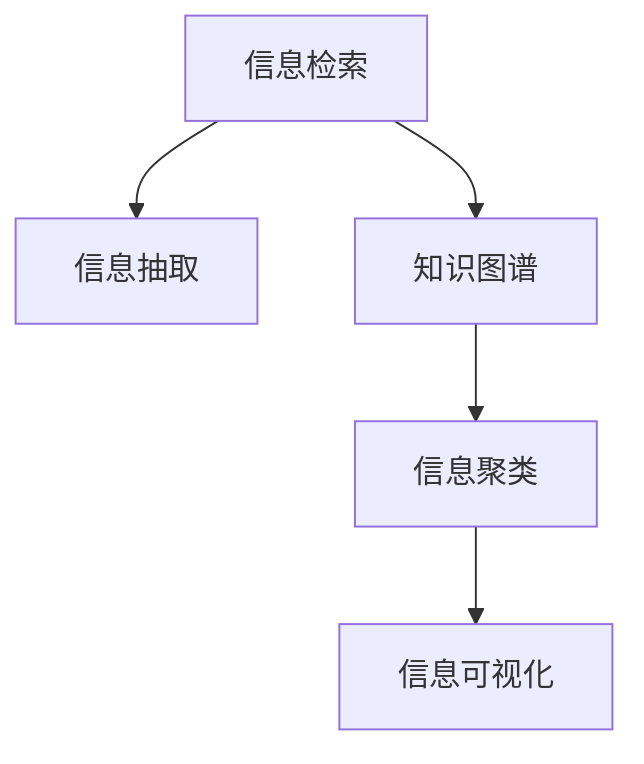

                 

# 信息过载与信息搜索策略与指南：在庞大的信息海洋中找到所需信息

## 1. 背景介绍

### 1.1 问题由来

在当今信息时代，信息无处不在，信息生产与传播的速度和规模达到了前所未有的高度。然而，随着信息量的爆炸性增长，信息过载(Information Overload)问题日益严重。信息过载指的是个体接触到的信息量超出了其处理和分析的能力范围，导致认知负荷过重、注意力分散、决策困难等一系列问题。据统计，全球每天产生的信息量高达2.5亿条，人类的注意力和认知资源已远远跟不上信息产生的速度和规模。如何在海量信息中找到有价值的信息，成为信息时代的一大挑战。

### 1.2 问题核心关键点

解决信息过载问题的核心在于设计高效的信息搜索策略与工具。信息搜索是指通过特定的方法和工具，在海量信息中快速找到所需信息的复杂过程。为有效应对信息过载，需要从信息检索、信息筛选、信息聚类等多个维度出发，构建系统的信息搜索体系。

目前，信息搜索技术已经广泛应用于搜索引擎、内容推荐系统、社交网络等领域。而随着AI技术的发展，基于机器学习、自然语言处理(NLP)的信息检索和信息抽取技术已经逐步替代传统的关键词匹配和基于规则的检索方法，提高了信息搜索的智能化水平。但信息搜索仍面临诸如搜索结果相关性、个性化推荐、复杂查询理解等问题，亟需进一步的研究与突破。

### 1.3 问题研究意义

信息搜索技术的改进不仅能提升信息处理效率，还能减少对人类认知资源的依赖，帮助人们在信息爆炸的时代保持清晰和专注。信息搜索技术的优化，将极大地提升决策质量和决策速度，推动信息时代的知识工作者的工作效率和生活质量。此外，面向未来，信息搜索技术将为智能问答系统、个性化推荐系统、知识图谱构建等技术发展提供强有力的支持，进一步推动人工智能技术的普及和应用。

## 2. 核心概念与联系

### 2.1 核心概念概述

为更好地理解信息搜索技术，本节将介绍几个核心概念：

- **信息检索**：指通过特定算法在海量数据中查找与查询词匹配的文档。常用的信息检索算法包括倒排索引、TF-IDF、BM25等。
- **信息抽取**：指从非结构化文本数据中自动抽取结构化信息，如实体、关系、事件等。常用的信息抽取技术包括命名实体识别、依存句法分析、事件抽取等。
- **知识图谱**：指通过有向图结构存储实体及其关系，辅助信息检索和推理。知识图谱的构建需要依赖信息抽取和关系抽取技术。
- **信息聚类**：指将相似信息聚合成类，便于用户快速定位和浏览。常用的信息聚类算法包括K-means、层次聚类、谱聚类等。
- **信息可视化**：指通过图形化界面展示信息结构，帮助用户更直观地理解信息内容。常用的信息可视化工具包括D3.js、Tableau等。

这些核心概念之间的逻辑关系可以通过以下Mermaid流程图来展示：



这个流程图展示了信息检索、信息抽取、知识图谱、信息聚类和信息可视化等核心概念及其之间的关系：

1. 信息检索是信息搜索的基础，用于在海量文本中查找与查询词匹配的文档。
2. 信息抽取是信息检索的补充，用于从文本中自动提取结构化信息。
3. 知识图谱是将信息结构化的重要手段，为信息检索和信息抽取提供结构化支持。
4. 信息聚类有助于对搜索结果进行进一步分类，便于用户浏览。
5. 信息可视化是信息呈现的方式，增强用户的直观理解和感知。

## 3. 核心算法原理 & 具体操作步骤

### 3.1 算法原理概述

信息搜索的本质是通过算法在海量信息中匹配查询词，找到最相关的信息。其核心算法通常基于信息检索模型、信息抽取模型和信息聚类模型。

#### 3.1.1 信息检索模型

信息检索模型主要包括倒排索引和向量空间模型。倒排索引是将文档中的关键词与文档id进行映射，用于快速定位与查询词匹配的文档。向量空间模型则是将查询词和文档表示为向量，通过余弦相似度等方法计算两者之间的匹配度。

#### 3.1.2 信息抽取模型

信息抽取模型包括基于规则的抽取和基于机器学习的抽取。基于规则的抽取需要人工定义抽取规则，效率较低。基于机器学习的抽取则利用深度学习模型，如BERT、EduRNN等，自动从文本中抽取实体、关系等结构化信息。

#### 3.1.3 信息聚类模型

信息聚类模型主要使用无监督聚类算法，如K-means、层次聚类、谱聚类等。这些算法根据文档间的相似度将文档聚类，生成文档的类别结构。

### 3.2 算法步骤详解

以下是一个典型的信息搜索流程，包括预处理、检索、聚类和可视化的步骤：

1. **预处理**：将原始文本进行分词、去停用词、词干提取等预处理操作，生成标准化的查询词和文档。
2. **检索**：使用倒排索引或向量空间模型，在海量文本中查找与查询词匹配的文档。
3. **聚类**：对检索到的文档进行聚类，生成文档的类别结构，便于用户浏览和筛选。
4. **可视化**：通过信息可视化工具，将搜索结果以图形化界面呈现，帮助用户直观理解信息内容。

### 3.3 算法优缺点

信息搜索算法具有以下优点：

1. **高效性**：通过算法匹配能够快速定位相关文档，节省了大量的人工操作。
2. **准确性**：利用深度学习模型进行信息抽取，能够自动提取结构化信息，减少人工标注的误差。
3. **可扩展性**：算法可以处理大规模数据集，适用于互联网、社交网络等场景。

然而，这些算法也存在一些缺点：

1. **模型依赖性**：模型的性能依赖于训练数据的质量和数量，需要大量的标注数据进行训练。
2. **泛化能力有限**：不同的查询词和领域背景下的信息检索效果往往不同，模型的泛化能力需要进一步提高。
3. **资源消耗大**：大规模信息检索和聚类需要较高的计算资源，对硬件要求较高。

### 3.4 算法应用领域

信息搜索技术已经广泛应用于各种领域，以下是几个典型应用场景：

- **搜索引擎**：如Google、百度等搜索引擎，通过信息检索技术快速定位相关网页，帮助用户获取所需信息。
- **推荐系统**：如Amazon、Netflix等，通过信息抽取和聚类技术，生成个性化的推荐内容，提升用户体验。
- **智能问答系统**：如Siri、Cortana等，通过信息检索和抽取技术，回答用户的问题，增强智能互动。
- **社交网络**：如Twitter、微信等，通过信息聚类技术，将用户兴趣和关注点自动分类，便于用户浏览和互动。

## 4. 数学模型和公式 & 详细讲解 & 举例说明

### 4.1 数学模型构建

本节将使用数学语言对信息搜索的核心算法进行严格的刻画。

设文本集合为 $D=\{d_1, d_2, ..., d_m\}$，其中每个文档 $d_i$ 可以表示为一个词向量 $x_i \in \mathbb{R}^n$，查询词为 $q \in \mathbb{R}^n$。信息检索的目标是找到与查询词 $q$ 最相关的文档 $d_r$。

假设信息检索模型为 $M$，信息检索的过程可以表示为：

$$
d_r = \mathop{\arg\min}_{d_i} \text{Dist}(d_i, q)
$$

其中 $\text{Dist}(d_i, q)$ 为文档 $d_i$ 和查询词 $q$ 之间的距离度量函数，常用的距离度量函数包括余弦距离、欧式距离、曼哈顿距离等。

### 4.2 公式推导过程

以余弦距离为例，推导信息检索模型。余弦距离定义为：

$$
\text{CosDist}(d_i, q) = \frac{\langle d_i, q \rangle}{\|d_i\| \cdot \|q\|}
$$

其中 $\langle \cdot, \cdot \rangle$ 表示向量点乘，$\|\cdot\|$ 表示向量的欧几里得范数。

假设信息检索模型为倒排索引，对于查询词 $q$，其倒排列表包含所有包含该查询词的文档，记为 $L(q)$。则信息检索的过程可以表示为：

$$
d_r = \mathop{\arg\min}_{d_i \in L(q)} \text{CosDist}(d_i, q)
$$

这表示在包含查询词 $q$ 的文档列表中，选择与查询词 $q$ 最相关的文档。

### 4.3 案例分析与讲解

以Google Scholar为例，Google Scholar的信息检索模型基于TF-IDF（Term Frequency-Inverse Document Frequency）和PageRank算法。TF-IDF用于衡量查询词在文档中出现的频率和重要性，PageRank用于衡量文档在网络中的权威性和相关性。Google Scholar首先利用TF-IDF计算查询词与每个文档之间的相似度，再使用PageRank算法进一步排序，选择最相关的文档返回给用户。

## 5. 项目实践：代码实例和详细解释说明

### 5.1 开发环境搭建

在进行信息搜索项目开发前，我们需要准备好开发环境。以下是使用Python进行ElasticSearch开发的开发环境配置流程：

1. 安装ElasticSearch：从官网下载并安装ElasticSearch，使用Java运行环境。
2. 安装Python Elasticsearch客户端：
```bash
pip install elasticsearch
```

3. 安装Jupyter Notebook：
```bash
pip install jupyter notebook
```

4. 配置ElasticSearch环境：
```bash
vi /etc/elasticsearch/elasticsearch.yml
```

5. 安装Visualization插件：
```bash
bin/elasticsearch-plugin install elasticsearch-visualization
```

完成上述步骤后，即可在ElasticSearch上进行信息搜索的实践。

### 5.2 源代码详细实现

以下是使用Python Elasticsearch客户端实现信息检索的代码示例：

```python
from elasticsearch import Elasticsearch

es = Elasticsearch([{'host': 'localhost', 'port': 9200}])

def search_documents(query, index='my_index'):
    res = es.search(index=index, body={
        'query': {
            'match': {
                'content': query
            }
        }
    })
    return res['hits']['hits']

# 查询包含"data science"的文档
results = search_documents("data science")
for hit in results:
    print(hit["_source"])
```

### 5.3 代码解读与分析

这里我们详细解读一下关键代码的实现细节：

- 使用ElasticSearch的官方Python客户端，方便进行ElasticSearch的操作。
- `search_documents`函数：接收查询词 `query` 和索引 `index` 作为参数，使用ElasticSearch的Search API进行查询，返回包含查询词的文档列表。
- 在ElasticSearch中创建索引 `my_index`，存储文档内容和标题等文本信息。
- 查询包含"data science"的文档，将结果打印输出。

### 5.4 运行结果展示

运行代码后，可以得到一个包含所有包含"data science"的文档列表。通过ElasticSearch的Visualization插件，可以对搜索结果进行可视化展示，如生成柱状图、饼图等，便于用户直观理解。

## 6. 实际应用场景

### 6.1 电子商务推荐系统

电子商务网站如Amazon、京东等，每天都会产生大量的交易数据、用户行为数据和商品信息。通过信息搜索技术，可以将用户搜索历史、浏览记录、评价评论等数据作为输入，生成个性化的推荐内容。推荐系统通过信息检索技术，匹配用户查询和商品信息，再利用信息抽取和聚类技术，自动生成个性化的商品列表，提升用户体验和转化率。

### 6.2 智能问答系统

智能问答系统如Siri、Cortana等，通过信息搜索技术，可以快速定位用户问题的答案。当用户提问时，系统首先进行信息检索，找到包含相关信息的文档或网页。然后利用信息抽取技术，自动抽取答案段落，并通过信息可视化技术，将答案以图形化界面呈现，方便用户理解。

### 6.3 社交媒体分析

社交媒体平台如Twitter、微信等，每天生成大量的用户发帖、评论、互动数据。通过信息搜索技术，可以将用户兴趣、关注点、行为模式等数据进行自动分类和聚类，生成用户的兴趣标签。社交媒体平台可以基于用户的兴趣标签，推送相关内容和信息，提升用户体验和互动率。

### 6.4 未来应用展望

未来，随着信息搜索技术的不断进步，其应用场景将进一步拓展，带来更广泛的商业和社会价值：

1. **智能客服**：智能客服系统可以通过信息检索和抽取技术，自动理解和处理用户问题，提升服务效率和用户体验。
2. **金融风控**：金融领域可以利用信息搜索技术，自动抓取和分析相关新闻、报告等信息，提高风险评估和预警能力。
3. **医疗诊断**：医疗领域可以通过信息检索和抽取技术，自动搜索和匹配病历、研究论文等相关信息，辅助医生进行诊断和治疗。
4. **教育培训**：在线教育平台可以利用信息搜索技术，自动推荐相关的学习资源和课程，提升学习效果。

## 7. 工具和资源推荐

### 7.1 学习资源推荐

为帮助开发者系统掌握信息搜索技术，这里推荐一些优质的学习资源：

1. **《Introduction to Information Retrieval》书籍**：由Christopher Manning等人所著，全面介绍了信息检索理论和方法，是信息搜索领域的经典教材。
2. **《Python Elasticsearch官方文档》**：ElasticSearch的官方Python客户端文档，提供了丰富的API和样例代码，是学习和使用ElasticSearch的必备资料。
3. **Coursera《Algorithms on Big Data》课程**：由IBM等公司开设的在线课程，介绍了大规模数据处理的算法和技术，包括信息检索和信息抽取等内容。
4. **Kaggle《Natural Language Processing with Python》竞赛**：通过实际竞赛项目，训练信息搜索和信息抽取技能，提升实战能力。
5. **ArXiv《NLP》领域论文**：开源的论文资源，包含最新的信息检索和信息抽取技术，适合深入学习和研究。

### 7.2 开发工具推荐

高效的信息搜索开发离不开优秀的工具支持。以下是几款常用的信息搜索开发工具：

1. **ElasticSearch**：流行的开源搜索引擎，支持全文检索、结构化数据检索和地理空间检索等功能，适用于大规模数据集。
2. **TensorFlow**：Google主导的深度学习框架，支持大规模分布式计算，适用于复杂的信息抽取和聚类任务。
3. **NLTK**：Python的自然语言处理库，提供丰富的文本处理功能，支持信息检索和信息抽取等操作。
4. **PyTorch**：Facebook主导的深度学习框架，支持动态计算图和模型压缩等技术，适用于高效的信息搜索模型。
5. **D3.js**：流行的数据可视化库，支持复杂的信息可视化操作，适用于多维数据的呈现。

### 7.3 相关论文推荐

信息搜索技术的发展源于学界的持续研究。以下是几篇奠基性的相关论文，推荐阅读：

1. **《The SMART Retrieval System》**：提出了SMART检索系统，结合文本分析和检索算法，提高了信息检索的准确性和相关性。
2. **《Google Scholar: A System for Automatic Discovery of Scholarly Literature》**：介绍了Google Scholar的信息检索模型和算法，展示了在大规模数据集上的应用效果。
3. **《BERT: Pre-training of Deep Bidirectional Transformers for Language Understanding》**：提出BERT模型，通过预训练和微调技术，显著提升了信息抽取和信息检索的效果。
4. **《Retrieval-Augmented Pre-Trained Language Models》**：提出检索增强的预训练语言模型，通过检索模型与预训练模型结合，提升了信息检索的准确性和鲁棒性。
5. **《Neural Tensor Networks for Neural Machine Translation》**：提出神经张量网络，用于自动抽取和推理文档之间的关系，提升了信息检索和信息抽取的效果。

## 8. 总结：未来发展趋势与挑战

### 8.1 总结

本文对信息搜索技术进行了全面系统的介绍。首先阐述了信息过载问题以及信息搜索技术的背景和意义，明确了信息搜索技术在提升信息处理效率、降低认知负荷等方面的重要作用。其次，从原理到实践，详细讲解了信息检索、信息抽取、信息聚类等核心算法，给出了信息搜索任务开发的完整代码实例。同时，本文还广泛探讨了信息搜索技术在电子商务推荐、智能问答、社交媒体分析等多个领域的应用前景，展示了信息搜索技术的广泛应用潜力。此外，本文精选了信息搜索技术的各类学习资源，力求为读者提供全方位的技术指引。

通过本文的系统梳理，可以看到，信息搜索技术在信息处理和智能互动方面具有重要的应用价值。未来，随着技术的发展和应用的普及，信息搜索技术将继续拓展其应用边界，成为人工智能技术的重要组成部分。

### 8.2 未来发展趋势

展望未来，信息搜索技术将呈现以下几个发展趋势：

1. **深度学习的应用**：深度学习模型在信息抽取和检索中的应用将越来越广泛，提升信息搜索的准确性和泛化能力。
2. **跨模态信息的整合**：信息搜索将逐步拓展到图像、视频、语音等多模态数据，提升信息搜索的全面性和复杂性。
3. **个性化推荐系统**：通过深度学习模型，实现更加个性化、动态化的推荐系统，提升用户体验。
4. **自然语言生成**：结合信息检索和生成模型，自动生成相关文本，提升信息搜索的便捷性和交互性。
5. **实时数据处理**：利用流处理技术和分布式计算，实现实时信息检索和推荐，满足动态需求。

以上趋势凸显了信息搜索技术的广阔前景。这些方向的探索发展，必将进一步提升信息搜索的智能化水平，为用户带来更好的体验和价值。

### 8.3 面临的挑战

尽管信息搜索技术已经取得了显著进展，但在迈向更加智能化、普适化应用的过程中，仍面临诸多挑战：

1. **数据质量问题**：信息搜索依赖于大规模标注数据和高质量语料库，数据质量对检索效果有很大影响。
2. **模型泛化能力**：不同领域和场景下的信息搜索效果往往不同，模型的泛化能力需要进一步提升。
3. **计算资源限制**：大规模信息检索和聚类需要较高的计算资源，对硬件要求较高。
4. **隐私和安全问题**：信息搜索过程中涉及大量敏感信息，如何保障用户隐私和数据安全，是一个重要问题。
5. **可解释性和可控性**：信息搜索模型通常被认为是"黑盒"系统，缺乏解释性和可控性，限制了其应用范围。

### 8.4 研究展望

面对信息搜索面临的这些挑战，未来的研究需要在以下几个方面寻求新的突破：

1. **数据增强技术**：开发数据增强算法，提升训练数据的数量和质量，降低对标注数据的依赖。
2. **多模态信息检索**：研究跨模态信息检索技术，实现图像、视频、语音等多模态信息的联合检索。
3. **计算优化技术**：开发高效的信息检索和聚类算法，优化模型计算图，提升计算效率。
4. **隐私保护技术**：研究隐私保护技术，如差分隐私、联邦学习等，保障用户隐私和数据安全。
5. **可解释性模型**：开发可解释性模型，如透明深度学习、模型蒸馏等，增强模型的解释性和可控性。

这些研究方向的探索，必将引领信息搜索技术迈向更高的台阶，为构建更加智能、普适的信息搜索系统铺平道路。面向未来，信息搜索技术还需要与其他人工智能技术进行更深入的融合，如知识表示、因果推理、强化学习等，多路径协同发力，共同推动人工智能技术的普及和应用。

## 9. 附录：常见问题与解答

**Q1：信息搜索是否适用于所有信息源？**

A: 信息搜索技术适用于结构化和半结构化信息源，如文档、网页、数据库等。但对于非结构化信息源，如图像、音频、视频等，需要结合多模态信息检索技术进行处理。

**Q2：如何提高信息检索的准确性？**

A: 提高信息检索的准确性需要从数据预处理、算法优化和系统调参等多个方面入手。常用的优化策略包括：
1. 数据增强：通过数据扩充、标注纠错等方式，提升训练数据的数量和质量。
2. 算法改进：引入深度学习模型，如BERT、EduRNN等，提升检索模型的性能。
3. 模型融合：结合不同检索模型，取其长处，提升检索效果。

**Q3：信息抽取过程中需要注意哪些问题？**

A: 信息抽取过程中需要注意以下几点：
1. 标注数据的质量：信息抽取依赖于高质量的标注数据，标注数据的准确性对抽取效果有很大影响。
2. 模型泛化能力：不同领域和场景下的信息抽取效果往往不同，模型的泛化能力需要进一步提升。
3. 多模态信息整合：信息抽取不仅仅涉及文本信息，还需要结合图像、视频、语音等多模态信息，实现更全面的信息抽取。
4. 对抗样本防御：信息抽取模型可能面临对抗样本攻击，需要加入对抗训练和鲁棒性检测技术，增强模型的鲁棒性。

**Q4：信息搜索系统在部署时需要注意哪些问题？**

A: 信息搜索系统在部署时需要注意以下几点：
1. 硬件资源配置：信息搜索系统需要较高的计算资源，需要根据数据量和并发请求量配置硬件资源。
2. 数据存储与传输：信息搜索系统需要高效的存储和传输机制，保证数据的安全性和实时性。
3. 系统稳定性：信息搜索系统需要具备高可用性和稳定性，能够应对高并发请求和突发事件。
4. 用户隐私保护：信息搜索系统需要保护用户隐私，防止敏感信息泄露。

通过这些步骤和策略，可以有效提升信息搜索系统的性能和可靠性，为用户带来更好的体验和价值。

---

作者：禅与计算机程序设计艺术 / Zen and the Art of Computer Programming

