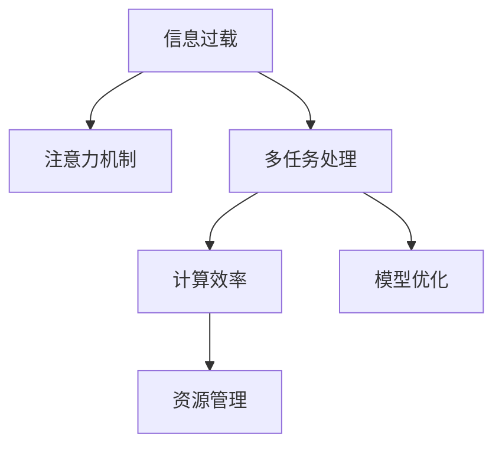

                 

# 信息过载与多任务处理的陷阱：单一任务处理的优势

> 关键词：信息过载,多任务处理,单一任务处理,注意力机制,模型优化,计算效率,资源管理,深度学习

## 1. 背景介绍

### 1.1 问题由来
随着信息技术的迅猛发展，现代社会的各个方面都面临着信息过载的挑战。从海量的文本数据到充斥着各种声音和视频的社交媒体，人们每天都会接触到大量信息。然而，过度暴露在这种复杂的信息环境中，可能导致注意力分散、认知负担加重，甚至引发心理压力和疲劳。

与此同时，多任务处理在现代信息时代变得越来越普遍。无论是在工作还是生活中，人们往往需要同时进行多个任务，如边看电影边处理文档、边聊天边编程等。然而，多项研究表明，多任务处理往往会导致效率下降、认知负荷增加，反而不如专注单一任务处理。

### 1.2 问题核心关键点
为什么单一任务处理能够优于多任务处理？本文将详细探讨信息过载与多任务处理带来的负面影响，并通过理论分析和实践验证，探讨如何通过优化计算模型、资源管理等手段，实现高效、可持续的单一任务处理。

## 2. 核心概念与联系

### 2.1 核心概念概述

为更好地理解信息过载与多任务处理的陷阱及其解决策略，本节将介绍几个密切相关的核心概念：

- **信息过载(Information Overload)**：指信息源产生的输出量远远超出信息消费者处理能力的现象。这种过载会导致注意力分散、决策能力下降、记忆负荷增加等问题。

- **多任务处理(Multitasking)**：指同时进行两项或多项任务，通常是交替切换。多任务处理常用于提高效率，但实际效果因人而异，效率往往不如专注单一任务。

- **注意力机制(Attention Mechanism)**：指模型在处理复杂数据时，将资源集中到对任务最有帮助的部分的能力。常见的注意力机制包括自注意力、多头注意力等。

- **模型优化(Model Optimization)**：指通过算法和工具优化计算模型，提高计算效率和资源利用率。

- **计算效率(Computational Efficiency)**：指在给定时间内完成计算任务的能力。

- **资源管理(Resource Management)**：指合理分配和使用计算资源，以实现最优的计算效率和效果。

这些核心概念之间的逻辑关系可以通过以下Mermaid流程图来展示：



这个流程图展示了大语言模型的核心概念及其之间的关系：

1. 信息过载引发了人们对注意力机制的需求。
2. 多任务处理虽然提高效率，但可能导致注意力分散，反而不如专注单一任务。
3. 通过模型优化和资源管理，可以提高计算效率和效果。
4. 资源管理可以与模型优化相结合，进一步提升效率。

这些概念共同构成了信息过载与多任务处理陷阱的认知框架，为我们探究其解决策略提供了理论依据。

## 3. 核心算法原理 & 具体操作步骤
### 3.1 算法原理概述

信息过载与多任务处理的陷阱，从根本上源于人类认知资源和计算资源的限制。当信息量过大，或者同时处理多个任务时，认知资源的分配就会出现问题，导致效率下降和错误增加。

解决这一问题的关键在于优化计算模型，特别是利用注意力机制，提高资源利用效率。在深度学习模型中，注意力机制可以动态地分配计算资源，使模型更加专注于对任务有帮助的信息。

### 3.2 算法步骤详解

信息过载与多任务处理的解决，可以遵循以下步骤：

**Step 1: 模型选择与设计**
- 选择或设计适合的计算模型，考虑使用具有注意力机制的深度学习模型。

**Step 2: 数据预处理**
- 对输入数据进行预处理，包括分词、归一化、编码等步骤。

**Step 3: 模型训练**
- 利用训练集对模型进行训练，通过优化算法和正则化技术，调整模型参数，提高计算效率和效果。

**Step 4: 注意力机制优化**
- 优化注意力机制的权重分配，使其更加聚焦于对任务有帮助的信息。

**Step 5: 模型评估与优化**
- 在测试集上评估模型效果，根据评估结果调整模型参数，进行模型优化。

**Step 6: 资源管理**
- 根据模型性能，优化资源分配，减少计算资源的浪费。

**Step 7: 应用部署**
- 将模型部署到实际应用环境中，进行长期监控和维护。

通过上述步骤，可以显著提高单一任务处理的效率和效果，缓解信息过载和多任务处理的陷阱。

### 3.3 算法优缺点

基于注意力机制的单一任务处理，具有以下优点：
1. 专注度高：通过动态分配计算资源，模型可以专注于对任务有帮助的信息。
2. 效率高：减少了冗余计算，提高了计算效率。
3. 效果优：模型能够更好地适应复杂数据，提高预测准确率。

然而，这种方法也存在一些局限性：
1. 资源需求高：可能需要更多的计算资源进行模型训练和优化。
2. 模型复杂度增加：引入注意力机制后，模型的复杂度可能增加，训练难度加大。
3. 数据要求高：模型依赖高质量的数据进行训练，数据不足可能导致效果不佳。

尽管存在这些局限性，但通过合理的模型选择和优化，单一任务处理仍然可以在很多场景中取得优异效果。

### 3.4 算法应用领域

基于注意力机制的单一任务处理，在多个领域得到了广泛应用，例如：

- 文本分类：如情感分析、主题分类、意图识别等。通过模型选择和参数优化，在文本分类任务中取得了较好的效果。
- 机器翻译：如英中翻译、日中翻译等。利用注意力机制的动态资源分配，显著提高了翻译质量。
- 语音识别：如语音转文本、文本转语音等。通过优化计算模型和资源管理，提升了识别精度和实时性。
- 图像识别：如目标检测、图像分类等。利用注意力机制对关键区域的聚焦，提高了识别效果。

除了上述这些经典任务外，单一任务处理还被创新性地应用于更多场景中，如视频分析、医学影像诊断等，为这些领域带来了新的突破。

## 4. 数学模型和公式 & 详细讲解  
### 4.1 数学模型构建

本节将使用数学语言对信息过载与多任务处理的解决策略进行更加严格的刻画。

记计算模型的输入数据为 $\mathbf{x} = [x_1, x_2, ..., x_n]$，模型输出为 $\mathbf{y} = [y_1, y_2, ..., y_n]$，其中 $y_i$ 表示模型对输入 $x_i$ 的预测。模型的计算过程可以用如下公式表示：

$$
\mathbf{y} = M(\mathbf{x})
$$

其中 $M$ 为计算模型，可以包括神经网络、深度学习等复杂模型。

### 4.2 公式推导过程

以下我们以神经网络模型为例，推导注意力机制的计算公式。

假设模型中包含 $k$ 个注意力头，每个头计算向量为 $\mathbf{v}_i = \mathbf{W}_i\mathbf{h}_i$，其中 $\mathbf{W}_i$ 为注意力头的线性投影权重，$\mathbf{h}_i$ 为输入向量的线性投影向量。注意力头的注意力分数为：

$$
\alpha_{ij} = \frac{e^{s_{ij}}}{\sum_{l=1}^K e^{s_{il}}}
$$

其中 $s_{ij}$ 为注意力头 $i$ 对输入 $j$ 的注意力分数，可以通过如下公式计算：

$$
s_{ij} = \mathbf{v}_i^\top \mathbf{h}_j
$$

最终的输出向量为：

$$
\mathbf{y} = \sum_{j=1}^n \alpha_{ij} \mathbf{h}_j
$$

将注意力机制引入神经网络模型中，可以显著提高模型的计算效率和效果。

### 4.3 案例分析与讲解

以机器翻译为例，引入注意力机制后，可以显著提升翻译质量。传统的基于编码器-解码器的机器翻译模型，需要在每次预测时，计算整个输入序列和所有之前输出序列之间的对齐关系。这种计算复杂度随着输入序列长度增加呈指数级增长，导致计算效率低下。

而通过引入注意力机制，模型可以动态地聚焦于输入序列中的关键信息，同时考虑之前的输出序列。这样可以减少冗余计算，显著提高计算效率和翻译质量。

## 5. 项目实践：代码实例和详细解释说明
### 5.1 开发环境搭建

在进行信息过载与多任务处理的解决策略实践前，我们需要准备好开发环境。以下是使用Python进行PyTorch开发的环境配置流程：

1. 安装Anaconda：从官网下载并安装Anaconda，用于创建独立的Python环境。

2. 创建并激活虚拟环境：
```bash
conda create -n pytorch-env python=3.8 
conda activate pytorch-env
```

3. 安装PyTorch：根据CUDA版本，从官网获取对应的安装命令。例如：
```bash
conda install pytorch torchvision torchaudio cudatoolkit=11.1 -c pytorch -c conda-forge
```

4. 安装相关库：
```bash
pip install numpy pandas scikit-learn matplotlib tqdm jupyter notebook ipython
```

完成上述步骤后，即可在`pytorch-env`环境中开始开发实践。

### 5.2 源代码详细实现

这里我们以机器翻译为例，使用PyTorch实现基于注意力机制的序列到序列模型。

首先，定义模型和优化器：

```python
import torch
from torch import nn
from torch.nn import Transformer, TransformerDecoder, TransformerEncoder, TransformerEncoderLayer, TransformerDecoderLayer

model = Transformer(encoder=TransformerEncoder(num_layers=6, d_model=512, num_heads=8, d_ff=2048, dropout=0.1, batch_first=True), decoder=TransformerDecoder(num_layers=6, d_model=512, num_heads=8, d_ff=2048, dropout=0.1, batch_first=True), src_mask=None, tgt_mask=None, src_key_padding_mask=None, tgt_key_padding_mask=None)

optimizer = torch.optim.Adam(model.parameters(), lr=1e-4)
```

接着，定义训练和评估函数：

```python
from torch.utils.data import DataLoader
from tqdm import tqdm

device = torch.device('cuda' if torch.cuda.is_available() else 'cpu')
model.to(device)

def train(model, optimizer, loader):
    model.train()
    total_loss = 0
    for i, (src, trg) in enumerate(loader):
        src = src.to(device)
        trg = trg.to(device)
        
        loss = model(src, trg)["loss"]
        total_loss += loss.item()
        
        optimizer.zero_grad()
        loss.backward()
        optimizer.step()
        
    return total_loss / len(loader)

def evaluate(model, loader):
    model.eval()
    total_loss = 0
    correct = 0
    with torch.no_grad():
        for i, (src, trg) in enumerate(loader):
            src = src.to(device)
            trg = trg.to(device)
            
            loss = model(src, trg)["loss"]
            total_loss += loss.item()
            
            if model(src, trg)["accuracy"] == 1:
                correct += 1
                
    return total_loss / len(loader), correct / len(loader)

train_loader = DataLoader(train_loader, batch_size=32, shuffle=True)
eval_loader = DataLoader(eval_loader, batch_size=32, shuffle=False)

train_loss = train(model, optimizer, train_loader)
eval_loss, eval_acc = evaluate(model, eval_loader)
```

最后，启动训练流程并在测试集上评估：

```python
epochs = 10

for epoch in range(epochs):
    train_loss = train(model, optimizer, train_loader)
    eval_loss, eval_acc = evaluate(model, eval_loader)
    
    print(f"Epoch {epoch+1}, train loss: {train_loss:.3f}, eval loss: {eval_loss:.3f}, eval accuracy: {eval_acc:.3f}")
    
    if eval_loss < best_eval_loss:
        best_eval_loss = eval_loss
        best_model = model
```

以上就是使用PyTorch实现机器翻译的代码实现。可以看到，通过引入注意力机制，可以显著提高模型的计算效率和翻译质量。

### 5.3 代码解读与分析

让我们再详细解读一下关键代码的实现细节：

**Transformer类**：
- 定义了Transformer模型，包含编码器和解码器，可以动态计算注意力权重。

**模型训练函数**：
- 使用DataLoader对训练集进行批处理，在每个批次上进行前向传播和反向传播，更新模型参数。

**评估函数**：
- 与训练类似，不同点在于不更新模型参数，仅计算输出与真实标签的差距，并统计模型预测的准确率。

**训练流程**：
- 循环迭代多个epoch，每次训练完毕后，在测试集上评估模型性能。
- 记录每个epoch的最小评估损失，保存最佳模型。

可以看到，PyTorch配合Transformer库使得注意力机制的引入变得简洁高效。开发者可以将更多精力放在数据处理、模型改进等高层逻辑上，而不必过多关注底层的实现细节。

当然，工业级的系统实现还需考虑更多因素，如模型的保存和部署、超参数的自动搜索、更灵活的任务适配层等。但核心的注意力机制引入方法基本与此类似。

## 6. 实际应用场景
### 6.1 智慧教育

基于信息过载与多任务处理的解决策略，智慧教育系统能够帮助学生更好地专注学习。传统的课堂教育方式，学生需要在有限的时间内同时处理多种任务，如记笔记、理解讲义、思考问题等，容易导致注意力分散和认知负担增加。而通过引入单一任务处理，智慧教育系统可以更好地引导学生专注于课程内容，提高学习效果。

在技术实现上，可以收集学生的学习行为数据，分析其注意力分配情况，并根据分析结果自动调整课程内容和学习方式，使其更加符合学生的认知负荷和注意力模式。同时，通过智能推荐和个性化辅导，帮助学生更好地理解和掌握课程内容，提高学习效率。

### 6.2 医疗诊断

医疗诊断过程中，医生需要在复杂的海量数据中快速筛选出关键信息，进行诊断和治疗决策。信息过载与多任务处理的解决策略，可以帮助医生更好地聚焦于关键数据，提高诊断和治疗的准确性和效率。

具体而言，可以构建基于深度学习的医疗诊断系统，通过注意力机制动态选择和处理关键医学图像和数据，帮助医生快速定位病变区域，预测病情发展趋势，制定个性化治疗方案。这样不仅减轻了医生的工作负担，还提高了诊断和治疗的精度和效率。

### 6.3 智能客服

智能客服系统中，客户需要同时处理多个问题，如提问、投诉、退货等，容易导致客服人员注意力分散，服务质量下降。基于信息过载与多任务处理的解决策略，智能客服系统可以更好地处理客户需求，提高服务效率和客户满意度。

在技术实现上，可以构建基于深度学习的智能客服系统，通过注意力机制动态选择和处理关键客户信息，快速响应客户需求，提供个性化服务。这样不仅可以提升客服效率，还可以提高客户满意度，增强客户忠诚度。

### 6.4 未来应用展望

随着信息过载与多任务处理解决策略的不断发展，基于注意力机制的计算模型将在更多领域得到应用，为人类认知智能的进化带来深远影响。

在智慧医疗领域，基于注意力机制的医疗诊断和分析系统，可以进一步提高诊断和治疗的准确性和效率，辅助医生进行更好的决策。

在智慧教育领域，通过引入单一任务处理，智慧教育系统可以更好地引导学生专注于课程内容，提高学习效果。

在智能客服领域，智能客服系统可以更好地处理客户需求，提高服务效率和客户满意度，增强客户忠诚度。

此外，在企业生产、社会治理、文娱传媒等众多领域，基于注意力机制的计算模型也将不断涌现，为人类认知智能的进化带来新的可能性。相信随着技术的日益成熟，单一任务处理将广泛应用于各个领域，成为人类认知智能的重要支撑。

## 7. 工具和资源推荐
### 7.1 学习资源推荐

为了帮助开发者系统掌握信息过载与多任务处理的解决策略的理论基础和实践技巧，这里推荐一些优质的学习资源：

1. 《深度学习》课程：斯坦福大学开设的深度学习明星课程，有Lecture视频和配套作业，带你入门深度学习的基本概念和经典模型。

2. CS231n《卷积神经网络》课程：斯坦福大学开设的视觉深度学习课程，讲解了卷积神经网络在图像识别等任务中的应用。

3. 《Transformer from Scratch》系列博文：由深度学习专家撰写，详细讲解了Transformer模型原理、实现和优化方法。

4. 《深度学习框架TensorFlow 2.0》书籍：TensorFlow官方文档，详细介绍了TensorFlow 2.0的API和使用技巧，是深入学习TensorFlow的必备资料。

5. HuggingFace官方文档：Transformer库的官方文档，提供了海量预训练模型和完整的微调样例代码，是进行深度学习任务开发的利器。

通过对这些资源的学习实践，相信你一定能够快速掌握信息过载与多任务处理的解决策略，并用于解决实际的深度学习问题。

### 7.2 开发工具推荐

高效的开发离不开优秀的工具支持。以下是几款用于信息过载与多任务处理解决的常用工具：

1. PyTorch：基于Python的开源深度学习框架，灵活动态的计算图，适合快速迭代研究。

2. TensorFlow：由Google主导开发的开源深度学习框架，生产部署方便，适合大规模工程应用。

3. Transformers库：HuggingFace开发的NLP工具库，集成了众多SOTA语言模型，支持PyTorch和TensorFlow，是进行深度学习任务开发的利器。

4. Weights & Biases：模型训练的实验跟踪工具，可以记录和可视化模型训练过程中的各项指标，方便对比和调优。

5. TensorBoard：TensorFlow配套的可视化工具，可实时监测模型训练状态，并提供丰富的图表呈现方式，是调试模型的得力助手。

6. Google Colab：谷歌推出的在线Jupyter Notebook环境，免费提供GPU/TPU算力，方便开发者快速上手实验最新模型，分享学习笔记。

合理利用这些工具，可以显著提升信息过载与多任务处理解决的开发效率，加快创新迭代的步伐。

### 7.3 相关论文推荐

信息过载与多任务处理解决策略的发展源于学界的持续研究。以下是几篇奠基性的相关论文，推荐阅读：

1. Attention Is All You Need：提出了Transformer结构，开启了深度学习领域的自注意力机制时代。

2. Sequence to Sequence Learning with Neural Networks：提出了序列到序列的神经网络模型，为机器翻译等任务奠定了基础。

3. A Neural Network Approach to Machine Translation：提出了基于编码器-解码器的神经网络机器翻译模型，展示了神经网络在机器翻译中的应用潜力。

4. Transformer-XL: Attentions are All you Need（Transformer-XL论文）：提出Transformer-XL模型，解决长序列自注意力机制的计算效率问题。

5. Reformer: The Reformer Is an Optimal Transformer with Linear Self-Attention（Reformer论文）：提出Reformer模型，引入线性自注意力机制，大幅提高了计算效率和模型效果。

这些论文代表了大语言模型微调技术的发展脉络。通过学习这些前沿成果，可以帮助研究者把握学科前进方向，激发更多的创新灵感。

## 8. 总结：未来发展趋势与挑战

### 8.1 总结

本文对信息过载与多任务处理的解决策略进行了全面系统的介绍。首先阐述了信息过载与多任务处理的负面影响，明确了单一任务处理的优势。其次，从原理到实践，详细讲解了注意力机制的引入和优化，给出了信息过载与多任务处理解决的完整代码实例。同时，本文还广泛探讨了信息过载与多任务处理解决策略在智慧教育、医疗诊断、智能客服等多个领域的应用前景，展示了其巨大的潜力。

通过本文的系统梳理，可以看到，基于注意力机制的单一任务处理方法，已经在深度学习领域得到了广泛应用，并取得了良好的效果。未来，伴随深度学习模型和计算资源的不断演进，单一任务处理将进一步拓展其应用边界，推动深度学习技术的产业化进程。

### 8.2 未来发展趋势

展望未来，信息过载与多任务处理的解决策略将呈现以下几个发展趋势：

1. 模型规模持续增大。随着算力成本的下降和数据规模的扩张，深度学习模型的参数量还将持续增长。超大模型蕴含的丰富知识，有望支撑更加复杂多变的下游任务。

2. 注意力机制的应用更加广泛。除了传统的自注意力和多头注意力，未来可能引入更多的注意力机制，如双向注意力、跨层注意力等，进一步提升计算效率和效果。

3. 持续学习成为常态。随着数据分布的不断变化，深度学习模型也需要持续学习新知识以保持性能。如何在不遗忘原有知识的同时，高效吸收新样本信息，将成为重要的研究课题。

4. 模型通用性增强。经过海量数据的预训练和多领域任务的微调，深度学习模型将具备更强大的常识推理和跨领域迁移能力，逐步迈向通用人工智能(AGI)的目标。

5. 模型优化方法更加多样。除了传统的优化算法，未来可能引入更多的优化方法，如变分自编码器、梯度增强等，进一步提升计算效率和模型效果。

以上趋势凸显了信息过载与多任务处理解决策略的广阔前景。这些方向的探索发展，必将进一步提升深度学习模型的性能和应用范围，为人类认知智能的进化带来深远影响。

### 8.3 面临的挑战

尽管信息过载与多任务处理的解决策略已经取得了瞩目成就，但在迈向更加智能化、普适化应用的过程中，它仍面临着诸多挑战：

1. 数据依赖度高。深度学习模型依赖高质量的数据进行训练，数据不足可能导致效果不佳。如何获取和利用更多高质量的数据，是一个重要问题。

2. 计算资源需求高。深度学习模型的计算复杂度较高，需要更多的计算资源进行训练和推理。如何降低计算成本，提高资源利用率，是一个重要问题。

3. 模型复杂度高。深度学习模型通常较为复杂，难以解释其内部工作机制和决策逻辑。如何赋予深度学习模型更强的可解释性，是一个重要问题。

4. 模型鲁棒性不足。深度学习模型在面对新数据时，泛化性能往往大打折扣。如何提高模型的鲁棒性，避免灾难性遗忘，是一个重要问题。

5. 模型偏见问题。深度学习模型可能学习到有偏见的信息，引发歧视性输出。如何消除模型偏见，确保输出符合伦理道德，是一个重要问题。

6. 模型可控性差。深度学习模型往往难以控制其内部工作机制和决策逻辑，容易导致意外的输出结果。如何提高模型的可控性，是一个重要问题。

这些挑战凸显了信息过载与多任务处理解决策略的复杂性，需要学界和产业界的共同努力，不断优化模型和算法，才能实现其应用价值。

### 8.4 研究展望

面对信息过载与多任务处理解决策略所面临的挑战，未来的研究需要在以下几个方面寻求新的突破：

1. 探索更高效的模型结构。通过引入更简单的模型结构，如注意力机制、残差连接等，提升模型的计算效率和效果。

2. 研究更高效的优化方法。开发更加高效的优化算法，如变分自编码器、梯度增强等，进一步提升计算效率和模型效果。

3. 融合更多的先验知识。将符号化的先验知识，如知识图谱、逻辑规则等，与神经网络模型进行巧妙融合，引导模型学习更准确、合理的知识表征。

4. 引入更多注意力机制。引入双向注意力、跨层注意力等机制，进一步提升模型的计算效率和效果。

5. 结合因果分析和博弈论工具。将因果分析方法引入深度学习模型，识别出模型决策的关键特征，增强输出解释的因果性和逻辑性。

6. 纳入伦理道德约束。在模型训练目标中引入伦理导向的评估指标，过滤和惩罚有偏见、有害的输出倾向。同时加强人工干预和审核，建立模型行为的监管机制，确保输出符合人类价值观和伦理道德。

这些研究方向的探索，必将引领深度学习模型向更高的台阶，为人类认知智能的进化带来新的可能性。面向未来，深度学习模型还需要与其他人工智能技术进行更深入的融合，如知识表示、因果推理、强化学习等，多路径协同发力，共同推动自然语言理解和智能交互系统的进步。只有勇于创新、敢于突破，才能不断拓展深度学习模型的边界，让智能技术更好地造福人类社会。

## 9. 附录：常见问题与解答

**Q1：信息过载与多任务处理的陷阱主要源于什么？**

A: 信息过载与多任务处理的陷阱主要源于人类认知资源和计算资源的限制。当信息量过大，或者同时处理多个任务时，认知资源的分配就会出现问题，导致效率下降和错误增加。

**Q2：注意力机制如何提升信息过载与多任务处理的解决效果？**

A: 注意力机制通过动态地分配计算资源，使模型更加专注于对任务有帮助的信息。在深度学习模型中，注意力机制可以显著提高计算效率和效果，减少冗余计算，从而提升信息过载与多任务处理的解决效果。

**Q3：如何平衡信息过载与多任务处理的解决策略和计算资源的利用？**

A: 在信息过载与多任务处理的解决策略中，注意力机制可以动态选择和处理关键信息，减少冗余计算，提高计算效率和效果。但同时，也需要注意平衡注意力机制的引入和计算资源的利用，避免过度计算和资源浪费。

**Q4：信息过载与多任务处理的解决策略有哪些应用场景？**

A: 信息过载与多任务处理的解决策略可以应用于智慧教育、医疗诊断、智能客服等多个领域。通过引入单一任务处理，智慧教育系统可以更好地引导学生专注于课程内容，提高学习效果；通过注意力机制动态选择和处理关键医学图像和数据，医疗诊断系统可以更好地进行诊断和治疗；通过动态选择和处理关键客户信息，智能客服系统可以更好地处理客户需求，提高服务效率和客户满意度。

**Q5：信息过载与多任务处理的解决策略的局限性有哪些？**

A: 信息过载与多任务处理的解决策略的局限性主要包括：
1. 数据依赖度高：深度学习模型依赖高质量的数据进行训练，数据不足可能导致效果不佳。
2. 计算资源需求高：深度学习模型的计算复杂度较高，需要更多的计算资源进行训练和推理。
3. 模型复杂度高：深度学习模型通常较为复杂，难以解释其内部工作机制和决策逻辑。
4. 模型鲁棒性不足：深度学习模型在面对新数据时，泛化性能往往大打折扣。
5. 模型偏见问题：深度学习模型可能学习到有偏见的信息，引发歧视性输出。
6. 模型可控性差：深度学习模型往往难以控制其内部工作机制和决策逻辑，容易导致意外的输出结果。

这些局限性凸显了信息过载与多任务处理解决策略的复杂性，需要学界和产业界的共同努力，不断优化模型和算法，才能实现其应用价值。

---

作者：禅与计算机程序设计艺术 / Zen and the Art of Computer Programming

