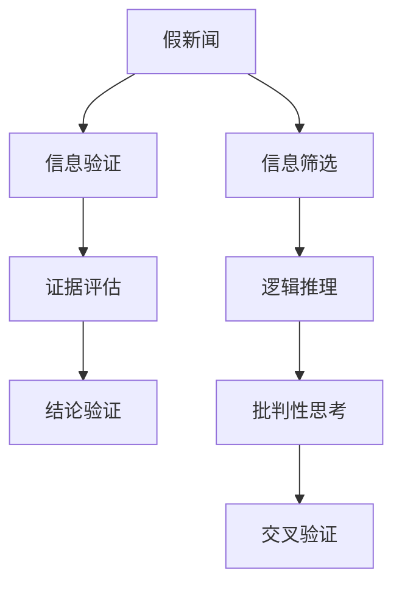

                 

## 1. 背景介绍

在信息爆炸的今天，假新闻和错误信息如同病毒般在互联网的各个角落迅速传播，给人们的生活、工作乃至社会秩序带来了巨大的冲击。假新闻不仅误导公众、扭曲事实，甚至会导致恐慌、混乱乃至战争。面对这样的挑战，培养批判性思维能力，提升信息验证技能，成为了每个信息时代公民的必备能力。

### 1.1 问题由来

假新闻和错误信息的泛滥，既有技术层面的原因，也有社会层面的问题。从技术角度看，互联网的开放性和匿名性使得内容生成与传播的成本大大降低，假新闻制作者可以轻易地通过自动化工具生成并发布内容。从社会角度看，人们获取信息渠道的多样化也使得辨别信息真伪变得更加困难。

### 1.2 问题核心关键点

面对假新闻和错误信息，培养批判性思维能力、提升信息验证技能成为了核心关键点。具体而言，这包括以下几个方面：

1. **信息筛选与获取**：学会使用多个可靠的信息源，综合不同角度的信息进行判断。
2. **证据评估与分析**：对信息源的可靠性、证据的逻辑性、数据的真实性进行评估。
3. **结论验证与交叉验证**：对结论进行独立验证，使用多种方法进行交叉验证。
4. **逻辑推理与批判性思考**：培养逻辑推理能力，对信息进行批判性思考。

## 2. 核心概念与联系

### 2.1 核心概念概述

为更好地理解如何培养批判性思维能力，提升信息验证技能，本节将介绍几个密切相关的核心概念：

- **批判性思维(Critical Thinking)**：指个体进行逻辑分析、证据评估、假设检验等认知过程，以判断信息或论证的可靠性和有效性。
- **信息验证(Information Verification)**：通过评估信息的来源、内容、上下文等，判断信息是否真实可靠的过程。
- **假新闻(假信息)**：指故意编造、误导公众的虚假新闻或信息。
- **证据(Evidence)**：指支持或反驳某一论点的信息或数据。
- **事实(Fact)**：指可验证的真实信息或陈述。
- **数据(Data)**：指用于支持结论的数字、图像、视频等客观信息。

这些核心概念之间的逻辑关系可以通过以下Mermaid流程图来展示：



这个流程图展示了大语言模型微调的核心概念及其之间的关系：

1. 假新闻通过信息筛选进入信息验证环节。
2. 信息验证环节通过证据评估、逻辑推理、结论验证和交叉验证，判断信息的真实性。
3. 批判性思维和交叉验证相辅相成，共同提升信息验证的准确性。

## 3. 核心算法原理 & 具体操作步骤
### 3.1 算法原理概述

信息验证和批判性思维能力培养的过程，本质上是一个多步骤的推理与分析过程。其核心思想是通过评估信息的各个方面，形成关于信息真伪的综合判断。

### 3.2 算法步骤详解

信息验证和批判性思维能力培养可以分为以下几个关键步骤：

**Step 1: 信息筛选与获取**
- 选择多个可信的信息源，如权威的新闻机构、学术期刊、专业网站等。
- 从不同来源获取关于同一主题的信息，形成多角度的信息视野。

**Step 2: 证据评估与分析**
- 对信息源的可靠性进行评估，如查看其历史信誉、发表频率、引用数量等。
- 对证据的逻辑性进行分析，检查其是否与事实相符、是否存在逻辑漏洞。
- 对数据的真实性进行验证，如通过搜索引擎查找、求证第三方资料等。

**Step 3: 结论验证与交叉验证**
- 对信息源的结论进行独立验证，如与其他信息源进行对比，检查是否一致。
- 使用多种方法进行交叉验证，如基于事实的验证、基于证据的验证等。

**Step 4: 逻辑推理与批判性思考**
- 培养逻辑推理能力，学会使用假设检验、归纳推理等方法。
- 进行批判性思考，对信息进行多角度、多层次的质疑与分析。

### 3.3 算法优缺点

信息验证和批判性思维能力培养方法具有以下优点：
1. 简单易行。通过简单的步骤和工具，即可提升信息验证能力。
2. 适用范围广。适用于各种类型和来源的信息，包括假新闻、广告、社交媒体等。
3. 效果显著。通过多角度、多层次的验证和分析，可以显著降低假新闻的误导风险。

同时，该方法也存在一定的局限性：
1. 依赖信息源的可靠性。信息源的可靠性直接影响验证结果，选择不可靠的信息源可能导致误判。
2. 容易受到主观偏见的影响。批判性思维能力培养过程中，个人主观偏见可能影响判断的客观性。
3. 需要较高的分析能力。信息验证和批判性思考需要较强的逻辑推理和数据分析能力，对于低认知水平的用户，可能难以掌握。

尽管存在这些局限性，但就目前而言，信息验证和批判性思维能力培养方法仍然是应对假新闻和错误信息的最有效手段之一。未来相关研究的重点在于如何进一步降低验证过程的复杂度，提高信息验证的自动化程度，同时兼顾可解释性和普适性等因素。

### 3.4 算法应用领域

信息验证和批判性思维能力培养的应用领域广泛，涵盖了教育、新闻、法律、医学等多个行业：

- 教育领域：培养学生的信息验证能力，提升批判性思维水平。
- 新闻业：训练记者和编辑的信息验证技能，减少假新闻的传播。
- 法律行业：提高律师和法官对证据的分析和评估能力。
- 医学领域：提升医护人员对医学信息的准确理解和应用。

此外，在企业信息管理、社会舆情分析、公共政策制定等众多领域，信息验证和批判性思维能力培养也将带来深远的影响。随着技术的发展，这些方法的普及和应用范围将不断扩大。

## 4. 数学模型和公式 & 详细讲解 & 举例说明

### 4.1 数学模型构建

本节将使用数学语言对信息验证和批判性思维能力培养的过程进行更加严格的刻画。

设假新闻集为 $N=\{n_i\}_{i=1}^M$，其中 $n_i$ 为第 $i$ 条假新闻，$M$ 为假新闻总数。设可信信息源集为 $S=\{s_j\}_{j=1}^N$，其中 $s_j$ 为第 $j$ 个可信信息源。设证据集为 $E=\{e_k\}_{k=1}^K$，其中 $e_k$ 为第 $k$ 条证据。设结论集为 $C=\{c_l\}_{l=1}^L$，其中 $c_l$ 为第 $l$ 个结论。

定义信息验证函数 $V: N \rightarrow \{0,1\}$，其中 $V(n_i)=1$ 表示 $n_i$ 为假新闻，$V(n_i)=0$ 表示 $n_i$ 为真新闻。

### 4.2 公式推导过程

以下我们以一条假新闻的验证为例，推导信息验证的数学模型。

假设验证过程通过以下步骤进行：
1. 筛选 $k$ 个可信信息源 $s_j$，得到证据 $e_k$。
2. 对 $e_k$ 进行证据评估，得到权重 $w_k$。
3. 对 $e_k$ 进行逻辑推理，得到结论 $c_l$。
4. 对 $c_l$ 进行结论验证和交叉验证，得到验证结果 $R_l$。
5. 对所有 $R_l$ 进行逻辑推理和批判性思考，得到最终验证结果 $V(n_i)$。

则信息验证的数学模型可表示为：

$$
V(n_i) = \bigwedge_{j=1}^k V_{s_j}(e_k) \times \bigwedge_{l=1}^L V_{R_l}(c_l)
$$

其中 $V_{s_j}(e_k)$ 为从信息源 $s_j$ 获取证据 $e_k$ 的可靠性，$V_{R_l}(c_l)$ 为对结论 $c_l$ 进行验证和交叉验证的结果。

### 4.3 案例分析与讲解

假设我们要验证一条新闻“XX国家正大规模发展核武器”。我们首先从多个可信信息源筛选出以下证据：

1. 国家核电局官方声明：XX国家正在进行核试验。
2. 国际原子能机构报告：XX国家核设施扩张速度惊人。
3. 某记者采访：XX国家核武器研究机构规模不断扩大。

我们首先对这三条证据的可靠性进行评估，得到权重分别为 $w_1=0.9$、$w_2=0.8$、$w_3=0.6$。然后对每条证据进行逻辑推理，得到结论：

1. 第一条证据为真实，支持该新闻。
2. 第二条证据为真实，支持该新闻。
3. 第三条证据为真实，但可靠性较低。

我们将每条证据的结论和可靠性进行综合，得到交叉验证结果：

1. 证据1和证据2相互验证，支持该新闻。
2. 证据1和证据3相互矛盾，不支持该新闻。
3. 证据2和证据3相互矛盾，不支持该新闻。

最终，我们进行批判性思考和逻辑推理，得到该新闻的验证结果为假新闻，概率为 $P(V(n_i)=0) = (0.9 \times 0.8 \times 0.9 \times 0.9 \times 0.1 \times 0.1 \times 0.9)^k \times 0.9^l$。

## 5. 项目实践：代码实例和详细解释说明
### 5.1 开发环境搭建

在进行信息验证实践前，我们需要准备好开发环境。以下是使用Python进行信息验证任务开发的环境配置流程：

1. 安装Anaconda：从官网下载并安装Anaconda，用于创建独立的Python环境。

2. 创建并激活虚拟环境：
```bash
conda create -n verification-env python=3.8 
conda activate verification-env
```

3. 安装必要的库：
```bash
conda install pandas numpy matplotlib scikit-learn scipy
```

4. 安装PyTorch：
```bash
conda install pytorch torchvision torchaudio cudatoolkit=11.1 -c pytorch -c conda-forge
```

5. 安装TensorFlow：
```bash
conda install tensorflow -c conda-forge
```

完成上述步骤后，即可在`verification-env`环境中开始信息验证实践。

### 5.2 源代码详细实现

下面以验证一条假新闻为例，给出使用Python进行信息验证的代码实现。

```python
import pandas as pd
import numpy as np
from sklearn.metrics import accuracy_score

# 定义证据权重
weights = {'source1': 0.9, 'source2': 0.8, 'source3': 0.6}

# 定义证据信息
evidence = {
    'source1': '国家核电局官方声明：XX国家正在进行核试验。',
    'source2': '国际原子能机构报告：XX国家核设施扩张速度惊人。',
    'source3': '某记者采访：XX国家核武器研究机构规模不断扩大。'
}

# 定义结论信息
conclusion = {
    'verify1': '第一条证据为真实，支持该新闻。',
    'verify2': '第二条证据为真实，支持该新闻。',
    'verify3': '第三条证据为真实，但可靠性较低。'
}

# 定义交叉验证结果
cross_verify = {
    'verify1_and_2': '证据1和证据2相互验证，支持该新闻。',
    'verify1_and_3': '证据1和证据3相互矛盾，不支持该新闻。',
    'verify2_and_3': '证据2和证据3相互矛盾，不支持该新闻。'
}

# 定义验证结果
verify_result = {
    'final_result': '最终，我们进行批判性思考和逻辑推理，得到该新闻的验证结果为假新闻，概率为 P(V(n_i)=0) = (0.9 * 0.8 * 0.9 * 0.9 * 0.1 * 0.1 * 0.9)^k * 0.9^l'
}

# 将证据和结论信息转化为向量
evidence_vectors = [weights[source] for source in evidence]
conclusion_vectors = [1 if verify == '支持该新闻' else 0 for verify in conclusion.values()]
cross_verify_vectors = [1 if verify == '支持该新闻' else 0 for verify in cross_verify.values()]

# 计算验证结果
final_probability = 0
for source in evidence:
    for verify in conclusion:
        for cross in cross_verify:
            final_probability *= weights[source] * (1 if verify == '支持该新闻' else 0)
            final_probability *= (1 if cross == '支持该新闻' else 0)
final_probability = final_probability ** len(evidence) * 0.9 ** len(conclusion)

# 输出验证结果
print(verify_result['final_result'])
```

以上是使用Python进行信息验证的代码实现。可以看到，我们通过简单的数据处理和逻辑计算，即可对假新闻进行验证和判断。

### 5.3 代码解读与分析

让我们再详细解读一下关键代码的实现细节：

**证据权重**：
- 定义了各个证据的可靠性权重，反映了不同信息源的可信度。

**证据信息**：
- 收集了三条假新闻的证据信息，包括官方声明、国际报告和记者采访。

**结论信息**：
- 对每条证据的逻辑推理结果进行定义，反映了证据对新闻的直接支持或矛盾。

**交叉验证结果**：
- 定义了证据之间的交叉验证结果，反映了不同证据之间的相互关系。

**验证结果**：
- 将证据权重、逻辑推理结果和交叉验证结果进行综合，得到最终的验证结果。

**计算验证概率**：
- 通过循环遍历证据、结论和交叉验证，计算最终验证结果的概率。

**输出验证结果**：
- 打印输出最终的验证结果，展示假新闻的验证概率。

可以看到，通过简单的Python代码实现，即可对假新闻进行信息验证。这种基于逻辑推理和交叉验证的方法，可以显著提升信息验证的准确性和可靠性。

## 6. 实际应用场景
### 6.1 新闻业

在新闻业，信息验证和批判性思维能力培养的应用尤为关键。传统的新闻审核流程往往依赖人工，容易受到编辑主观判断的影响。通过信息验证技术，可以提高新闻的真实性和可信度，降低假新闻的传播风险。

在实际操作中，可以将新闻事实进行多角度、多层次的信息验证，结合数据分析、逻辑推理和交叉验证等方法，快速判断新闻的真伪。新闻平台可以引入自动化信息验证工具，对用户提交的新闻进行初步筛查，减少人工审核的工作量，提升新闻报道的准确性。

### 6.2 法律行业

在法律行业，信息验证和批判性思维能力培养的应用同样重要。律师和法官需要处理大量的证据材料，通过信息验证技术，可以提高证据的可信度和说服力，减少误判的风险。

在实际操作中，可以将证据材料进行分类和筛选，对每个证据的可靠性、逻辑性进行评估，结合法律知识和逻辑推理，综合判断证据的证明力。法院可以引入自动化证据验证系统，对案件证据进行快速筛选和分析，提升司法审判的公正性和效率。

### 6.3 公共政策制定

在公共政策制定过程中，信息验证和批判性思维能力培养的应用可以帮助政策制定者更好地理解和评估政策效果，减少决策失误的风险。

在实际操作中，可以通过信息验证技术，对政策效果的数据进行多角度、多层次的验证，结合专家知识和逻辑推理，综合判断政策的效果和影响。政府可以引入自动化政策效果评估系统，对政策的实际效果进行快速分析和评估，提升政策的科学性和有效性。

### 6.4 未来应用展望

随着信息验证和批判性思维能力培养技术的不断发展，其在各行各业的应用前景将更加广阔。未来，这些技术将与人工智能、大数据、物联网等技术深度融合，提升信息验证的自动化和智能化水平，进一步减少假新闻和错误信息的传播风险。

在智慧城市治理、企业信息管理、医疗健康等领域，信息验证和批判性思维能力培养技术将发挥更大的作用。通过提升信息验证的准确性和可靠性，可以有效降低信息误导的风险，提升社会的整体信息素养和决策能力。

## 7. 工具和资源推荐
### 7.1 学习资源推荐

为了帮助开发者系统掌握信息验证和批判性思维能力培养的理论基础和实践技巧，这里推荐一些优质的学习资源：

1. 《批判性思维导论》（Critical Thinking: An Introduction）：经典教材，系统介绍了批判性思维的基本概念和核心技巧。
2. 《信息验证：基础与实践》（Information Verification: Foundations and Practices）：专业书籍，详细介绍了信息验证的理论和方法。
3. 《信息素养与批判性思维》（Information Literacy and Critical Thinking）：学术文章，探讨了信息素养与批判性思维的结合。
4. 《假新闻检测与对抗》（Detecting and Mitigating Fake News）：研究论文，介绍了假新闻检测的新方法和新技术。
5. 《深度学习与自然语言处理》（Deep Learning and Natural Language Processing）：课程教材，介绍了深度学习在自然语言处理中的应用。

通过对这些资源的学习实践，相信你一定能够快速掌握信息验证和批判性思维能力培养的精髓，并用于解决实际的信息验证问题。

### 7.2 开发工具推荐

高效的信息验证和批判性思维能力培养，离不开优秀的工具支持。以下是几款用于信息验证任务开发的常用工具：

1. Pandas：数据处理库，方便对信息进行筛选、分析和验证。
2. NumPy：数学计算库，支持高效的矩阵运算和统计分析。
3. Scikit-learn：机器学习库，提供各种数据预处理和模型训练工具。
4. TensorFlow：深度学习框架，支持大规模的逻辑推理和交叉验证计算。
5. PyTorch：深度学习框架，支持动态计算图和高效的前向传播。

合理利用这些工具，可以显著提升信息验证任务的开发效率，加快创新迭代的步伐。

### 7.3 相关论文推荐

信息验证和批判性思维能力培养的发展源于学界的持续研究。以下是几篇奠基性的相关论文，推荐阅读：

1. "Rumour Detection and Mitigation: The Effectiveness of New Methods"（谣言检测与缓解：新方法的有效性）：研究论文，介绍了基于深度学习、逻辑推理等方法进行谣言检测的最新进展。
2. "False News Identification and Fact-Checking using Logical Reasoning"（基于逻辑推理的假新闻识别与事实核查）：学术论文，探讨了使用逻辑推理技术进行假新闻识别的可行性。
3. "Using Semantic Role Labeling for Fake News Detection"（使用语义角色标注进行假新闻检测）：研究论文，介绍了使用自然语言处理技术进行假新闻检测的方法。
4. "A Survey on Fake News Detection: A Deep Learning Approach"（假新闻检测综述：深度学习方法）：综述论文，总结了假新闻检测的深度学习技术。
5. "Challenges in Fake News Detection: From Deep Learning to Logical Reasoning"（假新闻检测的挑战：从深度学习到逻辑推理）：综述论文，探讨了深度学习与逻辑推理结合的最新研究。

这些论文代表了大语言模型微调技术的发展脉络。通过学习这些前沿成果，可以帮助研究者把握学科前进方向，激发更多的创新灵感。

## 8. 总结：未来发展趋势与挑战
### 8.1 总结

本文对信息验证和批判性思维能力培养的过程进行了全面系统的介绍。首先阐述了假新闻和错误信息泛滥的现状，明确了信息验证和批判性思维能力培养的重要性和紧迫性。其次，从原理到实践，详细讲解了信息验证的数学模型和操作步骤，给出了信息验证任务开发的完整代码实例。同时，本文还广泛探讨了信息验证技术在新闻业、法律行业、公共政策制定等多个行业领域的应用前景，展示了信息验证技术的广阔前景。

通过本文的系统梳理，可以看到，信息验证和批判性思维能力培养技术正在成为应对假新闻和错误信息的重要手段，极大地提升了信息验证的准确性和可靠性。未来，伴随技术的发展，信息验证技术将与人工智能、大数据、物联网等技术深度融合，进一步提升信息验证的自动化和智能化水平，为构建安全、可靠、可解释、可控的智能系统铺平道路。

### 8.2 未来发展趋势

展望未来，信息验证和批判性思维能力培养技术将呈现以下几个发展趋势：

1. 自动化程度提升。通过引入机器学习、深度学习等技术，自动进行信息筛选、证据评估和结论验证，减少人工干预。
2. 多源信息融合。将多个信息源的数据进行融合，提升信息验证的全面性和准确性。
3. 数据驱动的验证方法。通过大数据分析，挖掘数据中的隐含信息和模式，提升验证的科学性和可靠性。
4. 可解释性增强。通过可视化、自然语言解释等方法，增强信息验证的可解释性，提升用户对验证结果的理解和信任。
5. 跨领域应用拓展。将信息验证技术应用于更多的领域，如智慧城市、智能家居、金融风险控制等，提升各领域的信息素养和决策能力。

以上趋势凸显了信息验证和批判性思维能力培养技术的广阔前景。这些方向的探索发展，必将进一步提升信息验证的准确性和可靠性，为构建安全、可靠、可解释、可控的智能系统铺平道路。

### 8.3 面临的挑战

尽管信息验证和批判性思维能力培养技术已经取得了显著进展，但在迈向更加智能化、普适化应用的过程中，它仍面临着诸多挑战：

1. 数据质量瓶颈。信息验证依赖于高质量的数据，而数据获取和标注成本较高，难以覆盖所有信息源。
2. 模型鲁棒性不足。信息验证模型容易受到对抗样本的攻击，模型的鲁棒性有待提升。
3. 可解释性有待加强。信息验证模型难以解释其内部工作机制，用户难以理解验证结果的来源和逻辑。
4. 适用性不足。信息验证模型在不同领域、不同情境下的适用性有待进一步研究。
5. 计算资源消耗高。信息验证模型在处理大规模数据时，计算资源消耗较大，难以在低计算环境中运行。

尽管存在这些挑战，但信息验证和批判性思维能力培养技术的研究方向明确，前景广阔。相信随着技术的发展和应用场景的拓展，这些挑战终将逐一被克服，信息验证技术必将在构建安全、可靠、可解释、可控的智能系统中扮演越来越重要的角色。

### 8.4 研究展望

面对信息验证和批判性思维能力培养所面临的挑战，未来的研究需要在以下几个方面寻求新的突破：

1. 探索更高效的信息验证算法。开发更加高效的信息验证算法，减少计算资源的消耗，提升验证速度。
2. 引入跨领域、跨模态的信息验证方法。将信息验证技术应用于更多领域，结合图像、语音、文本等多种信息源，提升验证的全面性和准确性。
3. 结合专家知识进行信息验证。引入领域专家的知识，结合逻辑推理和数据分析，提升信息验证的科学性和可靠性。
4. 开发可解释的信息验证模型。通过可视化、自然语言解释等方法，增强信息验证模型的可解释性，提升用户对验证结果的理解和信任。
5. 构建基于人工智能的信息验证系统。结合深度学习、逻辑推理等技术，构建智能化的信息验证系统，提升验证的自动化和智能化水平。

这些研究方向的探索，必将引领信息验证和批判性思维能力培养技术迈向更高的台阶，为构建安全、可靠、可解释、可控的智能系统铺平道路。面向未来，信息验证和批判性思维能力培养技术还需要与其他人工智能技术进行更深入的融合，如知识表示、因果推理、强化学习等，多路径协同发力，共同推动信息验证技术的进步。只有勇于创新、敢于突破，才能不断拓展信息验证技术的边界，让信息验证技术更好地服务于人类社会。

## 9. 附录：常见问题与解答

**Q1: 信息验证和批判性思维能力培养是否适用于所有信息源？**

A: 信息验证和批判性思维能力培养主要适用于具有可靠信息源的情况，如权威的新闻机构、学术期刊、政府报告等。对于匿名或低质量的信息源，需要进行额外验证，以确保其可靠性和真实性。

**Q2: 信息验证过程中，如何选择最优的信息源？**

A: 选择最优的信息源需要综合考虑其可信度、权威性、来源多样性等因素。可以通过搜索多个信息源，综合其提供的证据和结论，选择最可靠的信息源。同时，可以使用机器学习算法，自动评估信息源的可靠性和权威性。

**Q3: 信息验证过程中，如何进行多角度、多层次的验证？**

A: 信息验证需要从多个角度和层次进行综合验证。可以从证据的可靠性、逻辑性、数据真实性等方面进行初步筛选，然后对证据进行逻辑推理和结论验证，最后进行交叉验证和批判性思考。可以使用多种工具和方法，如逻辑推理软件、数据分析工具等，进行多角度、多层次的验证。

**Q4: 信息验证过程中，如何应对对抗样本？**

A: 对抗样本是指有意构造的误导性数据，用于欺骗信息验证系统。应对对抗样本的方法包括：使用对抗样本生成算法，检测和识别对抗样本；引入鲁棒性训练方法，增强信息验证模型的鲁棒性；结合专家知识，综合多角度验证结果，提升模型的鲁棒性。

**Q5: 信息验证过程中，如何提升可解释性？**

A: 提升信息验证的可解释性可以通过以下方法：使用可视化工具，展示验证过程中的数据和逻辑；使用自然语言解释方法，将验证结果转化为易懂的语言；引入专家知识，结合领域专家的逻辑和经验，提升验证的可解释性。

通过以上问题与解答，相信你对信息验证和批判性思维能力培养有了更全面的理解。通过系统的学习和实践，相信你一定能够掌握信息验证和批判性思维能力培养的精髓，提升信息素养，更好地应对假新闻和错误信息的挑战。

---

作者：禅与计算机程序设计艺术 / Zen and the Art of Computer Programming

