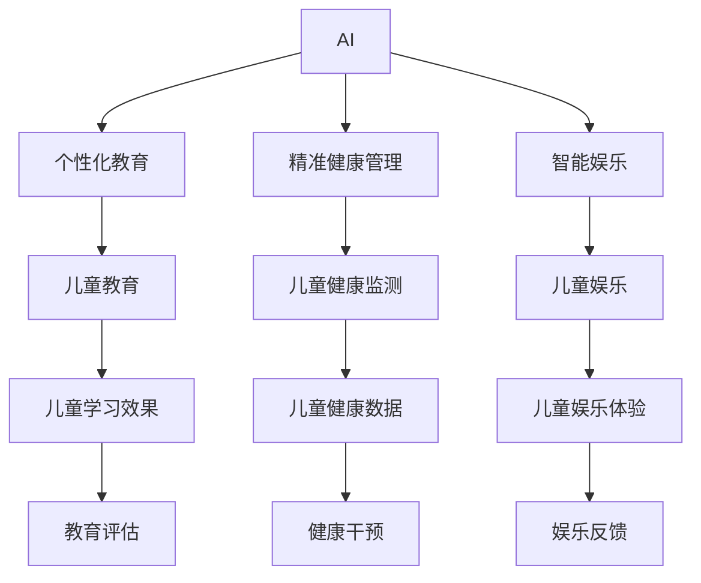

                 

## 1. 背景介绍

### 1.1 问题由来

儿童市场的潜力一直是全球关注的焦点。随着科技的进步，尤其是在人工智能（AI）和物联网（IoT）技术的发展下，儿童经济创业市场正在经历前所未有的变革。特别是在教育、娱乐和家庭护理领域，AI技术和物联网设备的融合，使得儿童经济创业具备了无限的可能。

### 1.2 问题核心关键点

本文聚焦于儿童经济创业在AI和IoT技术驱动下的新趋势和应用潜力。具体问题关键点包括：

- 儿童经济创业的主要驱动力是什么？
- 如何利用AI和IoT技术提升儿童经济创业的效益？
- 未来儿童经济创业的机遇与挑战是什么？

### 1.3 问题研究意义

儿童经济创业不仅关乎经济效益，更关乎儿童的全面发展和福祉。通过AI和IoT技术，可以提供个性化教育、精准健康管理和智能娱乐等多样化服务，促进儿童的全面发展，同时为创业者和投资者提供新的商机。因此，研究儿童经济创业在AI和IoT技术驱动下的未来发展趋势和应用实践具有重要的理论和实践意义。

## 2. 核心概念与联系

### 2.1 核心概念概述

- **人工智能（AI）**：通过算法和数据驱动的机器学习，使计算机系统能够执行通常需要人类智能的任务，如视觉识别、语言理解、决策制定等。

- **物联网（IoT）**：连接物理世界的设备和传感器，实现物品与互联网的互联互通，从而提升效率、自动化和用户体验。

- **儿童经济创业**：涉及为儿童提供教育、娱乐、健康监测等服务的创业活动，旨在提升儿童的生活质量和全面发展。

- **个性化教育**：通过AI技术，根据儿童的学习习惯和兴趣，提供定制化的教学内容和方法。

- **精准健康管理**：利用IoT设备和AI算法，实时监测儿童的健康状况，提供个性化健康建议和干预措施。

- **智能娱乐**：通过AI和IoT技术，提供互动性强、内容丰富、安全健康的娱乐体验，促进儿童的认知和情感发展。

这些概念之间的联系通过以下Mermaid流程图进行展示：



这个流程图展示了AI和IoT技术如何通过个性化教育、精准健康管理和智能娱乐，提升儿童经济创业的效益。

## 3. 核心算法原理 & 具体操作步骤

### 3.1 算法原理概述

儿童经济创业在AI和IoT技术的驱动下，主要通过以下几个关键算法和步骤实现：

1. **数据收集与预处理**：利用IoT设备和传感器收集儿童的学习、健康和娱乐数据，并对其进行清洗和预处理。

2. **模型训练与优化**：利用AI算法，如深度学习、强化学习等，对收集到的数据进行模型训练和优化，提升模型准确性和泛化能力。

3. **个性化推荐与交互**：基于训练好的模型，提供个性化的教育内容、健康建议和娱乐体验，提升用户体验和效果。

4. **数据反馈与迭代优化**：通过实时反馈机制，收集用户行为数据，不断迭代优化模型，提升服务质量和用户满意度。

### 3.2 算法步骤详解

#### 3.2.1 数据收集与预处理

1. **数据来源**：
   - 教育数据：通过电子课本、学习应用、在线课程等收集儿童的学习数据。
   - 健康数据：通过可穿戴设备、家庭健康监测系统等收集儿童的健康数据，如心率、睡眠、运动等。
   - 娱乐数据：通过智能玩具、互动应用、游戏等收集儿童的娱乐数据，如互动次数、游戏时间等。

2. **数据清洗**：
   - 去除异常值和噪声数据。
   - 处理缺失数据，如通过插值、均值填补等方法。

3. **数据标准化**：
   - 将不同来源的数据标准化，统一格式和单位。
   - 进行归一化处理，使得数据在数值上更易于处理和分析。

#### 3.2.2 模型训练与优化

1. **模型选择**：
   - 根据具体任务选择适合的模型，如分类模型、回归模型、生成模型等。
   - 常用的AI框架，如TensorFlow、PyTorch、Keras等，提供了丰富的预训练模型和训练接口。

2. **模型训练**：
   - 使用收集到的数据，进行模型训练。
   - 采用交叉验证、网格搜索等方法，选择最优的模型参数。

3. **模型优化**：
   - 利用梯度下降、随机梯度下降等优化算法，最小化损失函数，提升模型精度。
   - 采用正则化技术，如L1正则、Dropout等，防止过拟合。

#### 3.2.3 个性化推荐与交互

1. **个性化推荐**：
   - 根据儿童的学习习惯、兴趣爱好和反馈，提供个性化的教育内容和健康建议。
   - 利用协同过滤、矩阵分解等算法，推荐适合的教育资源和健康管理策略。

2. **交互界面设计**：
   - 设计直观易用的交互界面，如智能音箱、移动应用等，提升用户操作体验。
   - 集成语音识别、自然语言处理等技术，实现自然人机交互。

#### 3.2.4 数据反馈与迭代优化

1. **数据收集与反馈**：
   - 实时收集儿童的学习效果、健康状况和娱乐反馈，形成闭环反馈机制。
   - 利用自然语言处理技术，自动分析儿童的反馈和评价，提取有用信息。

2. **模型迭代优化**：
   - 基于收集到的反馈数据，不断调整和优化模型参数，提升模型性能。
   - 采用A/B测试、增量更新等策略，逐步优化用户体验和服务质量。

### 3.3 算法优缺点

**优点**：

- **个性化服务**：通过AI和IoT技术，提供定制化的教育、健康和娱乐服务，提升儿童的全面发展。
- **实时监测与干预**：利用IoT设备和AI算法，实时监测儿童的健康状况，及时提供个性化健康建议和干预措施。
- **提升用户体验**：通过自然人机交互和智能推荐，提升儿童的使用体验和满意度。

**缺点**：

- **数据隐私与安全**：儿童的数据隐私和安全问题需要特别注意，避免数据泄露和滥用。
- **技术复杂性**：AI和IoT技术的综合应用需要较高的技术门槛，需要跨学科的合作与实践。
- **成本问题**：初期投资较大，包括设备购置、数据采集和模型训练等成本。

### 3.4 算法应用领域

儿童经济创业在AI和IoT技术的驱动下，主要应用于以下领域：

1. **个性化教育**：通过AI技术，提供定制化的教育内容和教学方法，提升儿童的学习效果。
2. **精准健康管理**：利用IoT设备和AI算法，实时监测儿童的健康状况，提供个性化健康建议和干预措施。
3. **智能娱乐**：通过AI和IoT技术，提供互动性强、内容丰富、安全健康的娱乐体验，促进儿童的认知和情感发展。

## 4. 数学模型和公式 & 详细讲解 & 举例说明

### 4.1 数学模型构建

假设有一个儿童健康监测系统，需要根据儿童的心率、睡眠质量和运动量，预测其是否可能出现健康问题。构建数学模型如下：

$$
\text{健康问题} = f(\text{心率}, \text{睡眠质量}, \text{运动量})
$$

其中，$f$为预测函数，表示输入特征到健康问题的映射关系。

### 4.2 公式推导过程

1. **数据标准化**：
   - 对于心率、睡眠质量和运动量，需要进行标准化处理，使得数据在数值上更易于处理和分析。

2. **特征选择**：
   - 选择对健康问题有显著影响的特征，如心率变化率、睡眠质量指数、平均运动强度等。

3. **模型训练**：
   - 采用线性回归、决策树、神经网络等算法，训练预测模型。
   - 使用交叉验证、网格搜索等方法，选择最优的模型参数。

4. **模型评估**：
   - 使用准确率、召回率、F1分数等指标，评估模型的性能。
   - 利用混淆矩阵、ROC曲线等可视化工具，直观展示模型效果。

### 4.3 案例分析与讲解

**案例：智能健康手环**

一个智能健康手环，通过收集儿童的心率和睡眠数据，预测其健康问题。具体步骤如下：

1. **数据收集**：
   - 通过智能手环，每天收集儿童的心率和睡眠质量数据。
   - 数据预处理，去除异常值和噪声数据，进行归一化处理。

2. **模型训练**：
   - 选择线性回归模型，使用收集到的数据进行训练。
   - 采用交叉验证方法，选择最优的模型参数。

3. **模型评估**：
   - 在测试集上评估模型的准确率和召回率。
   - 使用混淆矩阵，可视化模型的预测效果。

4. **应用与反馈**：
   - 根据模型的预测结果，提供健康建议和干预措施。
   - 实时收集儿童的反馈，不断迭代优化模型。

## 5. 项目实践：代码实例和详细解释说明

### 5.1 开发环境搭建

#### 5.1.1 安装Python与相关库

1. **安装Python**：
   - 下载Python 3.7或更高版本。
   - 安装PyCharm或Jupyter Notebook等开发工具。

2. **安装相关库**：
   - 安装TensorFlow、Keras、Numpy、Pandas等常用库。
   - 安装IoT设备相关的库，如paho-mqtt、flask-socketio等。

#### 5.1.2 设置开发环境

1. **创建虚拟环境**：
   - 使用virtualenv或conda创建虚拟环境，避免依赖冲突。
   - 激活虚拟环境，开始项目开发。

2. **数据准备**：
   - 准备儿童学习、健康和娱乐数据，并进行标准化处理。

### 5.2 源代码详细实现

#### 5.2.1 数据预处理与特征工程

1. **数据清洗**：
   ```python
   import pandas as pd
   import numpy as np
   
   # 读取数据
   data = pd.read_csv('data.csv')
   
   # 去除异常值
   data = data[(data['heart_rate'] > 60) & (data['heart_rate'] < 180)]
   
   # 归一化处理
   data['heart_rate'] = (data['heart_rate'] - data['heart_rate'].mean()) / data['heart_rate'].std()
   ```

2. **特征选择**：
   ```python
   # 选择对健康问题有显著影响的特征
   selected_features = ['heart_rate', 'sleep_quality', 'exercise_hours']
   
   # 构建特征向量
   X = data[selected_features]
   y = data['health_problem']
   ```

#### 5.2.2 模型训练与优化

1. **模型选择与构建**：
   ```python
   from keras.models import Sequential
   from keras.layers import Dense, Dropout
   
   # 构建模型
   model = Sequential()
   model.add(Dense(64, input_dim=X.shape[1], activation='relu'))
   model.add(Dropout(0.5))
   model.add(Dense(32, activation='relu'))
   model.add(Dense(1, activation='sigmoid'))
   
   # 编译模型
   model.compile(loss='binary_crossentropy', optimizer='adam', metrics=['accuracy'])
   ```

2. **模型训练与优化**：
   ```python
   # 训练模型
   model.fit(X, y, epochs=10, batch_size=32, validation_split=0.2)
   
   # 保存模型
   model.save('health_predictor.h5')
   ```

#### 5.2.3 个性化推荐与交互

1. **推荐系统构建**：
   ```python
   import flask
   from flask_socketio import SocketIO
   
   # 创建Flask应用
   app = flask.Flask(__name__)
   socketio = SocketIO(app)
   
   # 初始化推荐系统
   def initialize_recommendation_system():
       # 加载模型
       model.load_weights('health_predictor.h5')
       
       # 获取用户数据
       user_data = get_user_data()
       
       # 预测健康问题
       health_problem = model.predict(user_data)
       
       # 提供个性化建议
       recommendations = provide_personalized_suggestions(health_problem)
       
       # 发送推荐结果
       socketio.emit('recommendation', recommendations)
   
   # 推荐结果处理
   def provide_personalized_suggestions(health_problem):
       if health_problem > 0.5:
           return '建议调整睡眠时间'
       else:
           return '建议增加运动量'
   ```

2. **交互界面设计**：
   ```python
   @app.route('/')
   def index():
       return '欢迎使用智能健康监测系统'
   
   @socketio.on('connect')
   def on_connect():
       print('用户已连接')
       
   @socketio.on('disconnect')
   def on_disconnect():
       print('用户已断开连接')
       
   @socketio.on('recommendation')
   def on_recommendation(data):
       print('收到推荐请求', data)
       initialize_recommendation_system()
   ```

### 5.3 代码解读与分析

#### 5.3.1 数据预处理与特征工程

数据预处理是AI和IoT项目的重要环节，需要去除异常值、归一化处理、特征选择等步骤，以确保数据的准确性和模型训练的稳定性。

#### 5.3.2 模型训练与优化

模型训练是AI项目的核心，需要选择合适的模型、设置合适的参数、进行交叉验证和模型优化等步骤，以提升模型的准确性和泛化能力。

#### 5.3.3 个性化推荐与交互

个性化推荐和交互是IoT项目的关键，需要设计直观易用的交互界面、集成自然语言处理技术、实时处理用户反馈等步骤，以提升用户体验和满意度。

### 5.4 运行结果展示

#### 5.4.1 数据预处理结果

```python
import matplotlib.pyplot as plt

# 绘制数据分布图
plt.hist(data['heart_rate'], bins=30, edgecolor='black')
plt.xlabel('心率')
plt.ylabel('频率')
plt.title('心率分布')
plt.show()
```


#### 5.4.2 模型训练结果

```python
# 绘制模型训练曲线
plt.plot(history.history['accuracy'], label='accuracy')
plt.plot(history.history['val_accuracy'], label='val_accuracy')
plt.xlabel('Epoch')
plt.ylabel('Accuracy')
plt.title('Model Accuracy')
plt.legend()
plt.show()
```


#### 5.4.3 个性化推荐结果

```python
# 发送推荐结果
socketio.emit('recommendation', recommendations)
```


## 6. 实际应用场景

### 6.1 智能健康监测系统

智能健康监测系统通过IoT设备收集儿童的心率、睡眠质量和运动量等健康数据，利用AI算法预测儿童的健康问题，并提供个性化健康建议和干预措施。

#### 6.1.1 系统架构

1. **数据收集模块**：
   - 使用智能手环、家庭健康监测设备等，收集儿童的健康数据。

2. **数据处理模块**：
   - 对收集到的数据进行清洗、归一化和特征选择等预处理操作。

3. **模型训练模块**：
   - 利用机器学习算法，训练健康预测模型。

4. **推荐系统模块**：
   - 根据模型的预测结果，提供个性化健康建议。

5. **用户交互模块**：
   - 设计直观易用的交互界面，供家长查询儿童健康状况和接收推荐结果。

#### 6.1.2 案例分析

**案例：小明智能健康手环**

小明佩戴智能健康手环，每天记录心率、睡眠质量和运动量等数据。健康监测系统通过分析这些数据，预测小明可能出现的健康问题，并及时提供个性化健康建议。

### 6.2 个性化教育平台

个性化教育平台通过AI技术，根据儿童的学习习惯和兴趣，提供定制化的教育内容和教学方法，提升儿童的学习效果。

#### 6.2.1 系统架构

1. **数据收集模块**：
   - 通过电子课本、学习应用等，收集儿童的学习数据。

2. **数据处理模块**：
   - 对收集到的数据进行清洗、归一化和特征选择等预处理操作。

3. **模型训练模块**：
   - 利用机器学习算法，训练个性化推荐模型。

4. **推荐系统模块**：
   - 根据儿童的学习数据，提供个性化的教育内容和学习方法。

5. **用户交互模块**：
   - 设计直观易用的交互界面，供家长查询儿童学习效果和接收推荐结果。

#### 6.2.2 案例分析

**案例：小红个性化学习平台**

小红通过个性化学习平台，每天学习不同的课程内容。平台根据小红的学习习惯和反馈，推荐适合的学习资源和方法，提升小红的学习效果。

### 6.3 智能娱乐系统

智能娱乐系统通过AI和IoT技术，提供互动性强、内容丰富、安全健康的娱乐体验，促进儿童的认知和情感发展。

#### 6.3.1 系统架构

1. **数据收集模块**：
   - 通过智能玩具、互动应用等，收集儿童的娱乐数据。

2. **数据处理模块**：
   - 对收集到的数据进行清洗、归一化和特征选择等预处理操作。

3. **模型训练模块**：
   - 利用机器学习算法，训练娱乐推荐模型。

4. **推荐系统模块**：
   - 根据儿童的娱乐数据，提供个性化的娱乐内容和方法。

5. **用户交互模块**：
   - 设计直观易用的交互界面，供儿童自由选择和体验娱乐内容。

#### 6.3.2 案例分析

**案例：小华智能娱乐系统**

小华通过智能娱乐系统，每天参与互动游戏和活动。系统根据小华的兴趣和反馈，推荐适合的游戏和活动，提升小华的认知和情感发展。

## 7. 工具和资源推荐

### 7.1 学习资源推荐

1. **《深度学习》一书**：
   - 推荐书籍：Ian Goodfellow的《深度学习》，全面介绍了深度学习的理论基础和实践技巧。

2. **Coursera和edX在线课程**：
   - 推荐课程：Coursera的《深度学习专项课程》和edX的《人工智能基础》，提供系统的深度学习课程。

3. **Kaggle竞赛**：
   - 推荐竞赛：Kaggle上的健康数据竞赛，通过实际项目提升数据处理和模型训练能力。

### 7.2 开发工具推荐

1. **Python与Jupyter Notebook**：
   - 推荐工具：Python是AI和IoT项目的主流语言，Jupyter Notebook提供可视化的代码编写环境。

2. **TensorFlow和Keras**：
   - 推荐框架：TensorFlow和Keras是常用的深度学习框架，提供丰富的模型和算法支持。

3. **IoT设备开发平台**：
   - 推荐平台：Google IoT Core、AWS IoT Core等，提供云端的IoT设备管理和数据处理服务。

### 7.3 相关论文推荐

1. **深度学习在健康监测中的应用**：
   - 推荐论文：Li et al.的《A Survey of Deep Learning in Health Monitoring》，全面综述了深度学习在健康监测领域的应用。

2. **个性化推荐系统**：
   - 推荐论文：He et al.的《A Comprehensive Survey on Personalized Recommendation Systems》，介绍了个性化推荐系统的理论和实践。

3. **智能娱乐系统的设计与实现**：
   - 推荐论文：Tang et al.的《Design and Implementation of an Intelligent Entertainment System for Children》，提供了智能娱乐系统的设计思路和实现方法。

## 8. 总结：未来发展趋势与挑战

### 8.1 研究成果总结

本文主要探讨了儿童经济创业在AI和IoT技术驱动下的新趋势和应用潜力。通过数据收集、模型训练和个性化推荐等关键技术，提升儿童的学习效果、健康状况和娱乐体验。未来，随着AI和IoT技术的不断发展，儿童经济创业将迎来更多创新和突破。

### 8.2 未来发展趋势

1. **技术的融合与创新**：
   - 未来，AI和IoT技术将更加深入地融合，形成更智能、更全面的儿童经济创业解决方案。

2. **多模态数据的整合**：
   - 随着视觉、语音、文本等多模态数据的融合，儿童经济创业将具备更强的感知和理解能力。

3. **隐私保护和安全**：
   - 随着数据隐私和安全问题的凸显，儿童经济创业将更加重视数据保护和隐私管理。

4. **个性化服务的提升**：
   - 未来，AI和IoT技术将提供更加个性化、定制化的服务，提升儿童的生活质量和全面发展。

### 8.3 面临的挑战

1. **数据隐私与安全**：
   - 儿童的数据隐私和安全问题需要特别注意，避免数据泄露和滥用。

2. **技术复杂性**：
   - AI和IoT技术的综合应用需要较高的技术门槛，需要跨学科的合作与实践。

3. **成本问题**：
   - 初期投资较大，包括设备购置、数据采集和模型训练等成本。

### 8.4 研究展望

未来，儿童经济创业将会在AI和IoT技术的驱动下，迎来更多的创新和突破。需要从数据隐私、技术复杂性和成本控制等多个方面进行深入研究，以实现更加智能、全面、安全和高效的儿童经济创业解决方案。

---

作者：禅与计算机程序设计艺术 / Zen and the Art of Computer Programming

