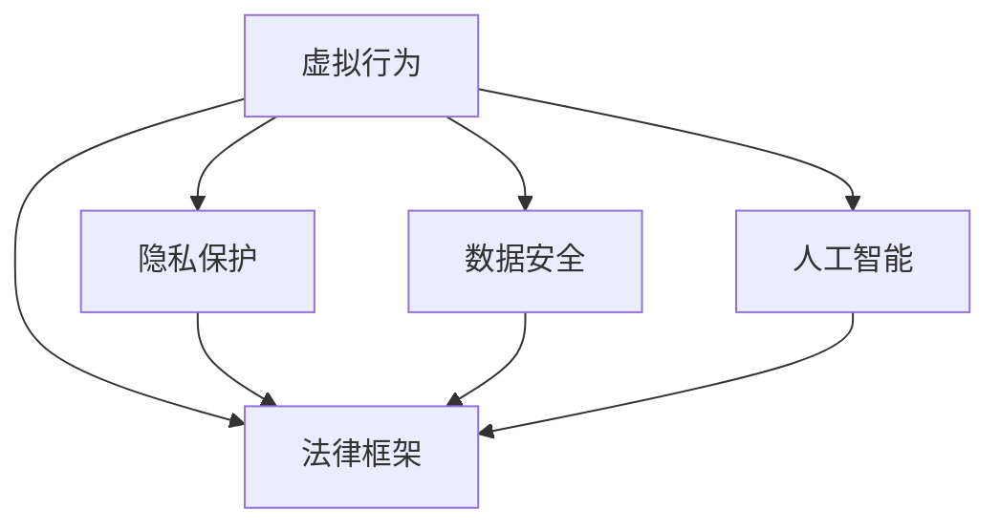

                 

# 元宇宙中的伦理道德:虚拟行为的现实影响

> 关键词：元宇宙,虚拟行为,伦理道德,隐私保护,数据安全,法律框架,人工智能

## 1. 背景介绍

随着技术的发展，我们正在迈向一个全新的数字时代——元宇宙（Metaverse）。这个由虚拟现实、增强现实和数字身份构建的虚拟世界，正在以前所未有的速度改变我们的生活方式和社交方式。然而，这个虚拟世界也带来了新的伦理道德问题，需要我们认真思考和应对。

### 1.1 元宇宙的兴起

元宇宙是指通过虚拟现实技术构建的虚拟世界，用户可以在其中进行工作、学习、娱乐、社交等活动。元宇宙的兴起主要得益于以下几个方面的技术进步：

- **虚拟现实(VR)和增强现实(AR)**：这些技术使人们可以更加身临其境地体验虚拟世界，增强了沉浸感。
- **区块链技术**：为元宇宙提供了去中心化的交易和数字身份认证机制，保障了数据的安全和隐私。
- **云计算和边缘计算**：这些技术为元宇宙提供了强大的计算和存储能力，支持大规模用户同时在线。
- **人工智能**：使元宇宙中的虚拟行为更加智能化和自适应，提供了个性化的用户体验。

### 1.2 元宇宙的潜力

元宇宙具有广阔的应用前景，可以改变我们工作、学习、娱乐和社交的方式，提供更丰富、更灵活的体验。例如：

- **远程办公**：在元宇宙中可以创建虚拟办公室，方便远程团队协作。
- **虚拟教育**：学生可以在虚拟环境中进行沉浸式学习，提高学习效果。
- **虚拟娱乐**：虚拟游戏、虚拟演唱会等娱乐形式更加丰富和互动。
- **虚拟社交**：虚拟社区和虚拟活动提供新的社交方式，增进人际互动。

## 2. 核心概念与联系

### 2.1 核心概念概述

要理解元宇宙中的伦理道德问题，首先需要理解相关的核心概念：

- **虚拟行为**：指用户在元宇宙中进行的各种活动，包括语言交流、虚拟互动、虚拟交易等。
- **隐私保护**：指保护用户个人信息和数据不被泄露的措施。
- **数据安全**：指保护数据在传输和存储过程中不被篡改或破坏。
- **法律框架**：指规范元宇宙行为的法律法规，确保虚拟行为的合法性和道德性。
- **人工智能**：指在元宇宙中用于模拟和增强虚拟行为的算法和技术。

这些概念之间有着紧密的联系。例如，隐私保护和数据安全是人工智能在元宇宙中应用的前提，而法律框架则是规范这些应用的基础。

### 2.2 核心概念的相互关系

这些核心概念之间的关系可以通过以下Mermaid流程图来展示：



这个流程图展示了虚拟行为与隐私保护、数据安全、法律框架和人工智能之间的关系。其中，隐私保护和数据安全是保护虚拟行为安全的基础，而法律框架为虚拟行为提供了规范和约束。人工智能则是实现这些保护和规范的关键技术。

## 3. 核心算法原理 & 具体操作步骤

### 3.1 算法原理概述

在元宇宙中，虚拟行为的伦理道德问题主要体现在隐私保护和数据安全方面。保护用户隐私和数据安全的关键在于设计合适的算法和技术，防止数据泄露和滥用。

### 3.2 算法步骤详解

以下是一般的隐私保护和数据安全算法的步骤：

**Step 1: 数据加密**
- 对用户上传的数据进行加密，确保在传输和存储过程中不被窃取或篡改。

**Step 2: 数据匿名化**
- 对用户数据进行匿名化处理，确保即使数据泄露，也无法关联到用户真实身份。

**Step 3: 访问控制**
- 使用访问控制列表(ACL)等机制，限制数据访问权限，确保只有授权用户可以访问数据。

**Step 4: 数据审计**
- 对数据访问和使用情况进行审计，记录和监控所有数据操作，及时发现和处理异常行为。

**Step 5: 合规检查**
- 定期对数据处理过程进行合规检查，确保符合相关法律法规和行业标准。

### 3.3 算法优缺点

这些算法在保护隐私和数据安全方面具有以下优点：

- **安全性高**：通过加密和匿名化处理，可以有效防止数据泄露和滥用。
- **合规性好**：通过访问控制和审计机制，确保数据处理过程符合相关法律法规。

但同时，这些算法也存在一些缺点：

- **计算复杂度高**：加密和匿名化处理需要消耗大量的计算资源。
- **隐私泄露风险**：尽管加密和匿名化可以有效保护数据，但仍存在被破解或逆向推断的风险。
- **访问控制复杂**：需要设计复杂的访问控制机制，增加了系统的复杂性和维护成本。

### 3.4 算法应用领域

这些算法在元宇宙中有着广泛的应用：

- **虚拟社区**：保护用户隐私和数据安全，确保虚拟社区的良性运行。
- **虚拟金融**：保护虚拟交易数据的安全，防止欺诈和盗窃。
- **虚拟身份认证**：保护用户虚拟身份的安全，防止冒充和欺诈。
- **虚拟社交网络**：保护用户社交数据的安全，防止隐私泄露和滥用。

## 4. 数学模型和公式 & 详细讲解 & 举例说明

### 4.1 数学模型构建

以下是一些常用的隐私保护和数据安全模型的数学模型构建：

**模型1: 对称加密**
- **公式**：$E(m) = k \oplus m$
- **解释**：使用对称密钥$k$对明文$m$进行加密，得到密文$E(m)$。

**模型2: 非对称加密**
- **公式**：$E(m) = e(m, k_1)$, $D(m) = d(m, k_2)$
- **解释**：使用公钥$k_1$加密明文$m$，得到密文$E(m)$，使用私钥$k_2$解密密文，得到明文$m$。

**模型3: 数据匿名化**
- **公式**：$A(m) = f(m, k_3)$
- **解释**：使用匿名化函数$f$和密钥$k_3$对明文$m$进行匿名化处理，得到匿名化数据$A(m)$。

**模型4: 访问控制**
- **公式**：$AC = \{(k_4, k_5)|k_4 \in K_1, k_5 \in K_2, k_1 = f(k_4, k_5)\}$
- **解释**：访问控制列表$AC$定义了用户$k_4$和资源$k_5$之间的访问权限，$k_1$为授权密钥。

### 4.2 公式推导过程

以下是一些隐私保护和数据安全公式的推导过程：

**公式1: 对称加密**
- **推导**：设明文为$m$，密钥为$k$，则加密后的密文为$E(m) = k \oplus m$。

**公式2: 非对称加密**
- **推导**：设公钥为$k_1$，私钥为$k_2$，则加密后的密文为$E(m) = e(m, k_1)$，解密后的明文为$D(m) = d(m, k_2)$。

**公式3: 数据匿名化**
- **推导**：设匿名化函数为$f$，明文为$m$，密钥为$k_3$，则匿名化后的数据为$A(m) = f(m, k_3)$。

**公式4: 访问控制**
- **推导**：设用户密钥为$k_4$，资源密钥为$k_5$，授权密钥为$k_1$，则访问控制列表$AC = \{(k_4, k_5)|k_1 = f(k_4, k_5)\}$。

### 4.3 案例分析与讲解

以下是一个具体的案例分析：

**案例1: 虚拟社区的数据保护**
- **背景**：一个虚拟社区需要对用户上传的数据进行加密和匿名化处理，防止数据泄露和滥用。
- **算法**：使用对称加密模型$E(m) = k \oplus m$和数据匿名化模型$A(m) = f(m, k_3)$，对用户上传的明文数据$m$进行加密和匿名化处理。
- **实现**：在用户上传数据时，使用随机生成的对称密钥$k$进行加密，再将加密后的数据进行匿名化处理，最后存储到数据库中。
- **分析**：对称加密模型提供了较高的安全性，但需要妥善保管对称密钥；数据匿名化模型可以防止数据泄露，但匿名化函数需要设计合理，以避免逆向推断。

## 5. 项目实践：代码实例和详细解释说明

### 5.1 开发环境搭建

在进行元宇宙中的隐私保护和数据安全实践时，需要搭建一个开发环境。以下是一些推荐的工具和资源：

- **Python**：常用的编程语言，提供了丰富的加密和匿名化库。
- **OpenSSL**：开源加密库，支持对称和非对称加密。
- **Pandas**：数据分析库，用于数据处理和审计。
- **Flask**：Web框架，用于构建API接口，方便数据访问和管理。
- **Docker**：容器化技术，用于部署和管理应用。

### 5.2 源代码详细实现

以下是使用Python和OpenSSL库实现对称加密的示例代码：

```python
import os
from Crypto.Cipher import AES
from Crypto.Random import get_random_bytes

def encrypt_data(data, key):
    cipher = AES.new(key, AES.MODE_EAX)
    ciphertext, tag = cipher.encrypt_and_digest(data.encode('utf-8'))
    return cipher.nonce, ciphertext, tag

def decrypt_data(nonce, ciphertext, tag, key):
    cipher = AES.new(key, AES.MODE_EAX, nonce)
    plaintext = cipher.decrypt_and_verify(ciphertext, tag)
    return plaintext.decode('utf-8')

# 示例使用
key = get_random_bytes(16)
data = 'Hello, world!'
nonce, ciphertext, tag = encrypt_data(data, key)
print('Nonce:', nonce)
print('Ciphertext:', ciphertext)
print('Tag:', tag)
decrypted = decrypt_data(nonce, ciphertext, tag, key)
print('Decrypted:', decrypted)
```

### 5.3 代码解读与分析

以下是代码的详细解读和分析：

**功能**：该代码实现了对称加密算法，使用AES加密模式对数据进行加密和解密。

**步骤**：
1. **生成随机密钥**：使用`get_random_bytes`函数生成16字节的随机密钥。
2. **加密数据**：使用`encrypt_data`函数对数据进行加密，生成加密后的密文和认证标签。
3. **解密数据**：使用`decrypt_data`函数对密文和认证标签进行解密，得到原始数据。

**优点**：
- **安全性高**：使用AES加密模式和认证标签，提供高强度的数据保护。
- **简单易用**：代码实现简单，易于理解和维护。

**缺点**：
- **密钥管理复杂**：需要妥善保管对称密钥，防止泄露。
- **性能较低**：AES加密模式需要消耗较多的计算资源。

## 6. 实际应用场景

### 6.1 虚拟社区

在虚拟社区中，用户上传的数据包括个人资料、聊天记录、交易记录等，这些数据需要得到严格的保护，防止泄露和滥用。例如：

- **个人资料保护**：用户上传的个人资料数据需要进行加密和匿名化处理，防止数据泄露。
- **聊天记录保护**：用户之间的聊天记录需要加密存储，防止被恶意获取和篡改。
- **交易记录保护**：虚拟交易数据需要进行加密和匿名化处理，防止数据泄露和滥用。

### 6.2 虚拟金融

在虚拟金融中，用户进行虚拟交易，需要保证交易数据的安全和隐私。例如：

- **交易记录保护**：虚拟交易记录需要进行加密和匿名化处理，防止数据泄露和篡改。
- **身份认证保护**：用户身份需要进行加密存储，防止身份信息泄露。
- **交易验证保护**：虚拟交易需要进行签名验证，防止欺诈和盗窃。

### 6.3 虚拟身份认证

在虚拟身份认证中，用户的虚拟身份信息需要得到严格保护，防止身份信息泄露和冒充。例如：

- **虚拟身份保护**：用户的虚拟身份需要进行加密和匿名化处理，防止身份信息泄露。
- **授权访问控制**：用户访问资源需要进行身份验证和授权，防止未授权访问。
- **行为审计**：用户行为需要进行审计和监控，防止异常行为。

### 6.4 未来应用展望

未来，元宇宙中的隐私保护和数据安全将面临更多的挑战和机遇。以下是对未来应用前景的展望：

- **隐私保护技术进步**：随着技术的发展，隐私保护技术将更加先进，提供更高的安全性和隐私保障。
- **数据安全措施完善**：数据安全措施将更加全面，涵盖数据存储、传输、处理等各个环节。
- **法律法规完善**：元宇宙的法律法规将逐步完善，为隐私保护和数据安全提供法律保障。
- **人工智能辅助**：人工智能将辅助隐私保护和数据安全，提供更智能和自动化的解决方案。

## 7. 工具和资源推荐

### 7.1 学习资源推荐

以下是一些推荐的隐私保护和数据安全学习资源：

- **《网络安全技术基础》**：介绍网络安全的基本概念和关键技术。
- **《数据保护与隐私技术》**：详细介绍数据保护和隐私保护的技术和方法。
- **《人工智能伦理道德》**：介绍人工智能伦理道德的理论和实践，涵盖隐私保护和数据安全方面的内容。

### 7.2 开发工具推荐

以下是一些推荐的隐私保护和数据安全开发工具：

- **Python**：常用编程语言，提供了丰富的加密和匿名化库。
- **OpenSSL**：开源加密库，支持对称和非对称加密。
- **Pandas**：数据分析库，用于数据处理和审计。
- **Flask**：Web框架，用于构建API接口，方便数据访问和管理。
- **Docker**：容器化技术，用于部署和管理应用。

### 7.3 相关论文推荐

以下是一些隐私保护和数据安全的经典论文：

- **《A Survey on Encryption Techniques》**：对各种加密技术进行全面的综述。
- **《Data Privacy Protection in Blockchain Technology》**：介绍区块链技术在数据隐私保护中的应用。
- **《AI Ethics: Principles and Practices》**：介绍人工智能伦理道德的理论和实践，涵盖隐私保护和数据安全方面的内容。

## 8. 总结：未来发展趋势与挑战

### 8.1 研究成果总结

在元宇宙中，隐私保护和数据安全是核心问题，需要设计合适的算法和技术，防止数据泄露和滥用。本文从算法原理、具体操作步骤、数学模型等方面对隐私保护和数据安全进行了详细的讲解，并给出了具体的代码实现。同时，介绍了这些算法在元宇宙中的应用场景，以及未来发展的趋势和面临的挑战。

### 8.2 未来发展趋势

未来，隐私保护和数据安全将面临更多的挑战和机遇：

- **技术进步**：随着技术的发展，隐私保护和数据安全技术将更加先进，提供更高的安全性和隐私保障。
- **法律法规完善**：元宇宙的法律法规将逐步完善，为隐私保护和数据安全提供法律保障。
- **人工智能辅助**：人工智能将辅助隐私保护和数据安全，提供更智能和自动化的解决方案。
- **跨领域融合**：隐私保护和数据安全将与其他技术领域进行深度融合，形成更加全面和系统的解决方案。

### 8.3 面临的挑战

尽管隐私保护和数据安全技术在元宇宙中得到了广泛应用，但仍面临一些挑战：

- **技术复杂性**：隐私保护和数据安全技术需要设计复杂的算法和机制，增加了系统的复杂性和维护成本。
- **法律法规限制**：法律法规对隐私保护和数据安全提出了更高的要求，需要符合相关标准和规范。
- **伦理道德问题**：隐私保护和数据安全技术需要在保护隐私的同时，考虑伦理道德问题，避免数据滥用。

### 8.4 研究展望

未来的研究需要在以下几个方面寻求新的突破：

- **隐私保护技术创新**：探索新的隐私保护技术，如差分隐私、同态加密等，提供更高的安全性和隐私保障。
- **数据安全措施完善**：完善数据安全措施，涵盖数据存储、传输、处理等各个环节，确保数据安全。
- **人工智能辅助隐私保护**：开发基于人工智能的隐私保护技术，提供更智能和自动化的解决方案。
- **跨领域融合**：隐私保护和数据安全技术与人工智能、区块链、物联网等技术进行深度融合，形成更加全面和系统的解决方案。

总之，隐私保护和数据安全是元宇宙中的核心问题，需要全社会共同努力，从技术、法律、伦理等多个角度进行综合治理，确保元宇宙中的虚拟行为能够得到合理的保护和规范。只有在各个环节协同发力，才能真正构建一个安全、可信、可持续发展的元宇宙。

---

作者：禅与计算机程序设计艺术 / Zen and the Art of Computer Programming

