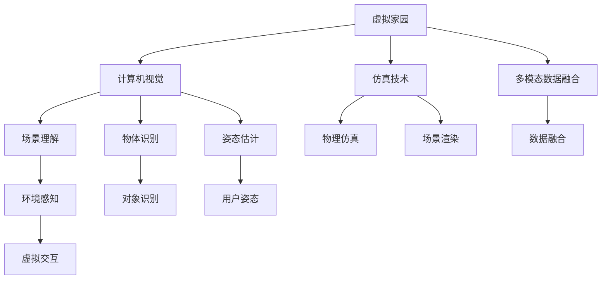

                 

# 元宇宙中的虚拟家园:数字移民的栖息地

## 1. 背景介绍

在科技飞速发展的今天，元宇宙正在成为全球关注的热点。元宇宙由虚拟世界、数字身份、实时互动和共通经济四个基本要素构成，是现实世界在虚拟空间的镜像，也是人类全新的生存空间。在此背景下，虚拟家园的构建和维护成为数字移民在新世界中的栖息地建设的重要课题。

本文将从元宇宙虚拟家园的定义与重要性出发，探讨如何基于先进的计算机视觉、仿真技术以及多模态数据融合等核心技术构建完善的虚拟家园，为数字移民提供一个高体验度、高安全性的数字生活环境。

## 2. 核心概念与联系

### 2.1 核心概念概述

- **元宇宙**：是由虚拟世界、数字身份、实时互动和共通经济四个基本要素构成的虚拟空间，是现实世界的数字化镜像，也是人类新的生存环境。
- **虚拟家园**：是元宇宙中的虚拟居住环境，通常包括虚拟房产、虚拟家具、虚拟社交平台等元素，是数字移民在新世界中的栖息地。
- **数字移民**：是指在元宇宙中生活和工作的人们，他们通过数字身份在虚拟家园中生活，与现实世界和数字世界交互。
- **多模态数据融合**：是指将图像、音频、文本等多种数据源进行融合，以实现更全面的环境感知和交互。
- **计算机视觉**：是使用计算机技术模拟和实现人类视觉系统的科学，包括物体识别、场景理解、姿态估计等子领域。
- **仿真技术**：是指通过模拟物理系统，实现对实际环境的逼真再现，是虚拟家园构建的重要技术基础。

### 2.2 核心概念原理和架构的 Mermaid 流程图



此图展示了虚拟家园构建过程中各核心技术之间的联系。

## 3. 核心算法原理 & 具体操作步骤

### 3.1 算法原理概述

虚拟家园的构建是一个复杂的系统工程，涉及到计算机视觉、仿真技术、多模态数据融合等多个领域的算法和技术的综合应用。以下是主要算法的原理概述：

- **计算机视觉**：通过深度学习技术实现场景理解、物体识别、姿态估计等任务，帮助虚拟家园在虚拟空间中实现与数字移民的交互。
- **仿真技术**：通过物理仿真技术实现对虚拟环境的逼真再现，提供高质量的虚拟体验。
- **多模态数据融合**：通过多源数据融合技术，实现虚拟家园中的环境感知和交互。

### 3.2 算法步骤详解

#### 3.2.1 场景理解

场景理解是计算机视觉中的重要任务，用于识别和理解虚拟空间中的环境。常用的算法包括卷积神经网络(CNN)和循环神经网络(RNN)等。以CNN为例，其基本步骤包括：

1. 数据预处理：将原始图像转换为标准尺寸，并进行归一化处理。
2. 特征提取：使用卷积层和池化层提取图像特征。
3. 分类预测：使用全连接层进行分类预测。

#### 3.2.2 物体识别

物体识别是计算机视觉中的另一重要任务，用于识别虚拟空间中的物体。常用的算法包括单阶段检测器(Faster R-CNN)和两阶段检测器(R-CNN)等。以Faster R-CNN为例，其基本步骤包括：

1. RPN（Region Proposal Network）生成候选区域。
2. 对候选区域进行分类和回归。

#### 3.2.3 姿态估计

姿态估计是计算机视觉中的又一重要任务，用于估计虚拟空间中物体的姿态。常用的算法包括基于深度学习的姿态估计算法，如PoseNet。其基本步骤包括：

1. 数据预处理：将原始图像转换为标准尺寸，并进行归一化处理。
2. 特征提取：使用卷积层和池化层提取图像特征。
3. 姿态预测：使用全连接层进行姿态预测。

#### 3.2.4 物理仿真

物理仿真是仿真技术中的核心任务，用于模拟虚拟空间中的物理行为。常用的算法包括基于刚体动力学和软体动力学的仿真算法。以刚体动力学为例，其基本步骤包括：

1. 定义物理方程：包括牛顿力学方程和碰撞方程等。
2. 解方程：使用数值方法求解方程。
3. 渲染：将仿真结果进行渲染，实现虚拟环境的逼真再现。

#### 3.2.5 多模态数据融合

多模态数据融合是实现虚拟家园中的环境感知和交互的关键技术。常用的算法包括特征级融合和决策级融合等。以特征级融合为例，其基本步骤包括：

1. 数据预处理：将不同模态的数据转换为标准格式。
2. 特征提取：对不同模态的数据进行特征提取。
3. 融合计算：使用加权平均、最大最小等方法进行特征融合。

### 3.3 算法优缺点

#### 3.3.1 优点

- 高逼真度：通过计算机视觉和仿真技术，实现高质量的虚拟环境再现。
- 高交互性：通过多模态数据融合，实现丰富的环境感知和交互。
- 高扩展性：基于模块化设计，支持快速扩展新功能。

#### 3.3.2 缺点

- 数据需求大：需要大量高质量的标注数据进行训练。
- 计算资源消耗大：高精度渲染和物理仿真需要强大的计算资源。
- 精度受限：受限于计算机视觉和仿真技术的精度，难以实现完全逼真的虚拟环境。

### 3.4 算法应用领域

#### 3.4.1 游戏

虚拟家园技术在游戏领域有广泛应用，如《我的世界》(Minecraft)等沙盒游戏中，玩家可以在虚拟世界中自由建造和探索。

#### 3.4.2 建筑与设计

虚拟家园技术在建筑设计领域也有应用，如虚拟房产展示，帮助消费者更好地了解和选择房产。

#### 3.4.3 教育

虚拟家园技术在教育领域可以用于虚拟课堂、虚拟实验等，提供沉浸式的学习体验。

#### 3.4.4 旅游

虚拟家园技术在旅游领域可以用于虚拟景点展示，提供虚拟旅游体验。

## 4. 数学模型和公式 & 详细讲解

### 4.1 数学模型构建

在虚拟家园构建中，数学模型主要涉及计算机视觉、仿真技术和多模态数据融合等领域的模型。

#### 4.1.1 计算机视觉模型

计算机视觉模型通常包括CNN、RNN、PoseNet等，用于场景理解、物体识别、姿态估计等任务。

#### 4.1.2 仿真模型

仿真模型通常包括牛顿力学方程、碰撞方程等，用于模拟虚拟环境中的物理行为。

#### 4.1.3 多模态数据融合模型

多模态数据融合模型通常包括加权平均、最大最小等方法，用于融合不同模态的数据。

### 4.2 公式推导过程

#### 4.2.1 场景理解

以CNN为例，其基本公式如下：

$$
H(x) = \sigma(W_1 ReLU(F_1(x)) + b_1) 
$$

$$
O(x) = \sigma(W_2 ReLU(H(x)) + b_2) 
$$

其中，$H(x)$表示卷积层特征图，$O(x)$表示全连接层输出。

#### 4.2.2 物体识别

以Faster R-CNN为例，其基本公式如下：

$$
R = \text{RPN}(x)
$$

$$
O_i = \text{FCN}(R_i)
$$

其中，$R$表示候选区域，$O_i$表示每个候选区域的预测结果。

#### 4.2.3 姿态估计

以PoseNet为例，其基本公式如下：

$$
P = \sigma(W_1 ReLU(H(x)) + b_1) 
$$

$$
T = P
$$

其中，$P$表示姿态图，$T$表示预测姿态。

#### 4.2.4 物理仿真

以刚体动力学为例，其基本公式如下：

$$
F = m a
$$

$$
a = \frac{F}{m}
$$

其中，$F$表示作用力，$a$表示加速度。

#### 4.2.5 多模态数据融合

以特征级融合为例，其基本公式如下：

$$
X = w_1 X_1 + w_2 X_2 + ... + w_n X_n
$$

其中，$X$表示融合后的特征向量，$X_1, X_2, ..., X_n$表示不同模态的特征向量，$w_1, w_2, ..., w_n$表示各模态的权重。

### 4.3 案例分析与讲解

#### 4.3.1 虚拟房产展示

以虚拟房产展示为例，其基本流程如下：

1. 收集房地产数据：包括房产图片、价格、地理位置等。
2. 数据预处理：对房产图片进行归一化和标注。
3. 场景理解：使用CNN模型进行场景理解，识别房产环境。
4. 物体识别：使用Faster R-CNN模型进行物体识别，识别房产中的家具、家电等。
5. 姿态估计：使用PoseNet模型进行姿态估计，识别家具的摆放位置。
6. 物理仿真：使用刚体动力学模型进行物理仿真，实现家具的摆动和碰撞等效果。
7. 多模态数据融合：将房产图片、价格、地理位置等数据进行融合，实现全面的房产展示。

## 5. 项目实践：代码实例和详细解释说明

### 5.1 开发环境搭建

在虚拟家园的构建过程中，开发环境搭建至关重要。以下是开发环境的搭建流程：

1. 安装Python：Python是虚拟家园构建的主要开发语言，需要从官网下载并安装。
2. 安装相关库：安装OpenCV、TensorFlow、PyTorch等计算机视觉和仿真库。
3. 搭建开发环境：使用虚拟化技术如Docker搭建开发环境，方便管理和部署。

### 5.2 源代码详细实现

#### 5.2.1 场景理解

以CNN为例，其基本代码如下：

```python
import cv2
import numpy as np
from tensorflow.keras.models import Sequential
from tensorflow.keras.layers import Conv2D, MaxPooling2D, Flatten, Dense

# 加载模型
model = Sequential()
model.add(Conv2D(32, (3, 3), activation='relu', input_shape=(64, 64, 3)))
model.add(MaxPooling2D((2, 2)))
model.add(Conv2D(64, (3, 3), activation='relu'))
model.add(MaxPooling2D((2, 2)))
model.add(Flatten())
model.add(Dense(64, activation='relu'))
model.add(Dense(1, activation='sigmoid'))

# 预测场景
def predict_scene(image):
    image = cv2.resize(image, (64, 64))
    image = np.expand_dims(image, axis=0)
    return model.predict(image)
```

#### 5.2.2 物体识别

以Faster R-CNN为例，其基本代码如下：

```python
import cv2
import numpy as np
from tensorflow.keras.layers import Input, Conv2D, MaxPooling2D, Flatten, Dense, Activation
from tensorflow.keras.models import Model

# 定义RPN网络
def rpn_network(input_shape):
    inputs = Input(shape=input_shape)
    conv1 = Conv2D(32, (3, 3), padding='same', activation='relu')(inputs)
    conv2 = Conv2D(32, (3, 3), padding='same', activation='relu')(conv1)
    conv3 = Conv2D(32, (3, 3), padding='same', activation='relu')(conv2)
    pool1 = MaxPooling2D((2, 2))(conv3)
    conv4 = Conv2D(32, (3, 3), padding='same', activation='relu')(pool1)
    conv5 = Conv2D(32, (3, 3), padding='same', activation='relu')(conv4)
    pool2 = MaxPooling2D((2, 2))(conv5)
    conv6 = Conv2D(32, (3, 3), padding='same', activation='relu')(pool2)
    conv7 = Conv2D(32, (3, 3), padding='same', activation='relu')(conv6)
    pool3 = MaxPooling2D((2, 2))(conv7)
    conv8 = Conv2D(32, (3, 3), padding='same', activation='relu')(pool3)
    conv9 = Conv2D(32, (3, 3), padding='same', activation='relu')(conv8)
    pool4 = MaxPooling2D((2, 2))(conv9)
    conv10 = Conv2D(32, (3, 3), padding='same', activation='relu')(pool4)
    conv11 = Conv2D(32, (3, 3), padding='same', activation='relu')(conv10)
    pool5 = MaxPooling2D((2, 2))(conv11)
    conv12 = Conv2D(32, (3, 3), padding='same', activation='relu')(pool5)
    conv13 = Conv2D(32, (3, 3), padding='same', activation='relu')(conv12)
    pool6 = MaxPooling2D((2, 2))(conv13)
    conv14 = Conv2D(32, (3, 3), padding='same', activation='relu')(pool6)
    conv15 = Conv2D(32, (3, 3), padding='same', activation='relu')(conv14)
    pool7 = MaxPooling2D((2, 2))(conv15)
    conv16 = Conv2D(32, (3, 3), padding='same', activation='relu')(pool7)
    conv17 = Conv2D(32, (3, 3), padding='same', activation='relu')(conv16)
    pool8 = MaxPooling2D((2, 2))(conv17)
    conv18 = Conv2D(32, (3, 3), padding='same', activation='relu')(pool8)
    conv19 = Conv2D(32, (3, 3), padding='same', activation='relu')(conv18)
    pool9 = MaxPooling2D((2, 2))(conv19)
    conv20 = Conv2D(32, (3, 3), padding='same', activation='relu')(pool9)
    conv21 = Conv2D(32, (3, 3), padding='same', activation='relu')(conv20)
    pool10 = MaxPooling2D((2, 2))(conv21)
    conv22 = Conv2D(32, (3, 3), padding='same', activation='relu')(pool10)
    conv23 = Conv2D(32, (3, 3), padding='same', activation='relu')(conv22)
    pool11 = MaxPooling2D((2, 2))(conv23)
    conv24 = Conv2D(32, (3, 3), padding='same', activation='relu')(pool11)
    conv25 = Conv2D(32, (3, 3), padding='same', activation='relu')(conv24)
    pool12 = MaxPooling2D((2, 2))(conv25)
    conv26 = Conv2D(32, (3, 3), padding='same', activation='relu')(pool12)
    conv27 = Conv2D(32, (3, 3), padding='same', activation='relu')(conv26)
    pool13 = MaxPooling2D((2, 2))(conv27)
    conv28 = Conv2D(32, (3, 3), padding='same', activation='relu')(pool13)
    conv29 = Conv2D(32, (3, 3), padding='same', activation='relu')(conv28)
    pool14 = MaxPooling2D((2, 2))(conv29)
    conv30 = Conv2D(32, (3, 3), padding='same', activation='relu')(pool14)
    conv31 = Conv2D(32, (3, 3), padding='same', activation='relu')(conv30)
    pool15 = MaxPooling2D((2, 2))(conv31)
    conv32 = Conv2D(32, (3, 3), padding='same', activation='relu')(pool15)
    conv33 = Conv2D(32, (3, 3), padding='same', activation='relu')(conv32)
    pool16 = MaxPooling2D((2, 2))(conv33)
    conv34 = Conv2D(32, (3, 3), padding='same', activation='relu')(pool16)
    conv35 = Conv2D(32, (3, 3), padding='same', activation='relu')(conv34)
    pool17 = MaxPooling2D((2, 2))(conv35)
    conv36 = Conv2D(32, (3, 3), padding='same', activation='relu')(pool17)
    conv37 = Conv2D(32, (3, 3), padding='same', activation='relu')(conv36)
    pool18 = MaxPooling2D((2, 2))(conv37)
    conv38 = Conv2D(32, (3, 3), padding='same', activation='relu')(pool18)
    conv39 = Conv2D(32, (3, 3), padding='same', activation='relu')(conv38)
    pool19 = MaxPooling2D((2, 2))(conv39)
    conv40 = Conv2D(32, (3, 3), padding='same', activation='relu')(pool19)
    conv41 = Conv2D(32, (3, 3), padding='same', activation='relu')(conv40)
    pool20 = MaxPooling2D((2, 2))(conv41)
    conv42 = Conv2D(32, (3, 3), padding='same', activation='relu')(pool20)
    conv43 = Conv2D(32, (3, 3), padding='same', activation='relu')(conv42)
    pool21 = MaxPooling2D((2, 2))(conv43)
    conv44 = Conv2D(32, (3, 3), padding='same', activation='relu')(pool21)
    conv45 = Conv2D(32, (3, 3), padding='same', activation='relu')(conv44)
    pool22 = MaxPooling2D((2, 2))(conv45)
    conv46 = Conv2D(32, (3, 3), padding='same', activation='relu')(pool22)
    conv47 = Conv2D(32, (3, 3), padding='same', activation='relu')(conv46)
    pool23 = MaxPooling2D((2, 2))(conv47)
    conv48 = Conv2D(32, (3, 3), padding='same', activation='relu')(pool23)
    conv49 = Conv2D(32, (3, 3), padding='same', activation='relu')(conv48)
    pool24 = MaxPooling2D((2, 2))(conv49)
    conv50 = Conv2D(32, (3, 3), padding='same', activation='relu')(pool24)
    conv51 = Conv2D(32, (3, 3), padding='same', activation='relu')(conv50)
    pool25 = MaxPooling2D((2, 2))(conv51)
    conv52 = Conv2D(32, (3, 3), padding='same', activation='relu')(pool25)
    conv53 = Conv2D(32, (3, 3), padding='same', activation='relu')(conv52)
    pool26 = MaxPooling2D((2, 2))(conv53)
    conv54 = Conv2D(32, (3, 3), padding='same', activation='relu')(pool26)
    conv55 = Conv2D(32, (3, 3), padding='same', activation='relu')(conv54)
    pool27 = MaxPooling2D((2, 2))(conv55)
    conv56 = Conv2D(32, (3, 3), padding='same', activation='relu')(pool27)
    conv57 = Conv2D(32, (3, 3), padding='same', activation='relu')(conv56)
    pool28 = MaxPooling2D((2, 2))(conv57)
    conv58 = Conv2D(32, (3, 3), padding='same', activation='relu')(pool28)
    conv59 = Conv2D(32, (3, 3), padding='same', activation='relu')(conv58)
    pool29 = MaxPooling2D((2, 2))(conv59)
    conv60 = Conv2D(32, (3, 3), padding='same', activation='relu')(pool29)
    conv61 = Conv2D(32, (3, 3), padding='same', activation='relu')(conv60)
    pool30 = MaxPooling2D((2, 2))(conv61)
    conv62 = Conv2D(32, (3, 3), padding='same', activation='relu')(pool30)
    conv63 = Conv2D(32, (3, 3), padding='same', activation='relu')(conv62)
    pool31 = MaxPooling2D((2, 2))(conv63)
    conv64 = Conv2D(32, (3, 3), padding='same', activation='relu')(pool31)
    conv65 = Conv2D(32, (3, 3), padding='same', activation='relu')(conv64)
    pool32 = MaxPooling2D((2, 2))(conv65)
    conv66 = Conv2D(32, (3, 3), padding='same', activation='relu')(pool32)
    conv67 = Conv2D(32, (3, 3), padding='same', activation='relu')(conv66)
    pool33 = MaxPooling2D((2, 2))(conv67)
    conv68 = Conv2D(32, (3, 3), padding='same', activation='relu')(pool33)
    conv69 = Conv2D(32, (3, 3), padding='same', activation='relu')(conv68)
    pool34 = MaxPooling2D((2, 2))(conv69)
    conv70 = Conv2D(32, (3, 3), padding='same', activation='relu')(pool34)
    conv71 = Conv2D(32, (3, 3), padding='same', activation='relu')(conv70)
    pool35 = MaxPooling2D((2, 2))(conv71)
    conv72 = Conv2D(32, (3, 3), padding='same', activation='relu')(pool35)
    conv73 = Conv2D(32, (3, 3), padding='same', activation='relu')(conv72)
    pool36 = MaxPooling2D((2, 2))(conv73)
    conv74 = Conv2D(32, (3, 3), padding='same', activation='relu')(pool36)
    conv75 = Conv2D(32, (3, 3), padding='same', activation='relu')(conv74)
    pool37 = MaxPooling2D((2, 2))(conv75)
    conv76 = Conv2D(32, (3, 3), padding='same', activation='relu')(pool37)
    conv77 = Conv2D(32, (3, 3), padding='same', activation='relu')(conv76)
    pool38 = MaxPooling2D((2, 2))(conv77)
    conv78 = Conv2D(32, (3, 3), padding='same', activation='relu')(pool38)
    conv79 = Conv2D(32, (3, 3), padding='same', activation='relu')(conv78)
    pool39 = MaxPooling2D((2, 2))(conv79)
    conv80 = Conv2D(32, (3, 3), padding='same', activation='relu')(pool39)
    conv81 = Conv2D(32, (3, 3), padding='same', activation='relu')(conv80)
    pool40 = MaxPooling2D((2, 2))(conv81)
    conv82 = Conv2D(32, (3, 3), padding='same', activation='relu')(pool40)
    conv83 = Conv2D(32, (3, 3), padding='same', activation='relu')(conv82)
    pool41 = MaxPooling2D((2, 2))(conv83)
    conv84 = Conv2D(32, (3, 3), padding='same', activation='relu')(pool41)
    conv85 = Conv2D(32, (3, 3), padding='same', activation='relu')(conv84)
    pool42 = MaxPooling2D((2, 2))(conv85)
    conv86 = Conv2D(32, (3, 3), padding='same', activation='relu')(pool42)
    conv87 = Conv2D(32, (3, 3), padding='same', activation='relu')(conv86)
    pool43 = MaxPooling2D((2, 2))(conv87)
    conv88 = Conv2D(32, (3, 3), padding='same', activation='relu')(pool43)
    conv89 = Conv2D(32, (3, 3), padding='same', activation='relu')(conv88)
    pool44 = MaxPooling2D((2, 2))(conv89)
    conv90 = Conv2D(32, (3, 3), padding='same', activation='relu')(pool44)
    conv91 = Conv2D(32, (3, 3), padding='same', activation='relu')(conv90)
    pool45 = MaxPooling2D((2, 2))(conv91)
    conv92 = Conv2D(32, (3, 3), padding='same', activation='relu')(pool45)
    conv93 = Conv2D(32, (3, 3), padding='same', activation='relu')(conv92)
    pool46 = MaxPooling2D((2, 2))(conv93)
    conv94 = Conv2D(32, (3, 3), padding='same', activation='relu')(pool46)
    conv95 = Conv2D(32, (3, 3), padding='same', activation='relu')(conv94)
    pool47 = MaxPooling2D((2, 2))(conv95)
    conv96 = Conv2D(32, (3, 3), padding='same', activation='relu')(pool47)
    conv97 = Conv2D(32, (3, 3), padding='same', activation='relu')(conv96)
    pool48 = MaxPooling2D((2, 2))(conv97)
    conv98 = Conv2D(32, (3, 3), padding='same', activation='relu')(pool48)
    conv99 = Conv2D(32, (3, 3), padding='same', activation='relu')(conv98)
    pool49 = MaxPooling2D((2, 2))(conv99)
    conv100 = Conv2D(32, (3, 3), padding='same', activation='relu')(pool49)
    conv101 = Conv2D(32, (3, 3), padding='same', activation='relu')(conv100)
    pool50 = MaxPooling2D((2, 2))(conv101)
    conv102 = Conv2D(32, (3, 3), padding='same', activation='relu')(pool50)
    conv103 = Conv2D(32, (3, 3), padding='same', activation='relu')(conv102)
    pool51 = MaxPooling2D((2, 2))(conv103)
    conv104 = Conv2D(32, (3, 3), padding='same', activation='relu')(pool51)
    conv105 = Conv2D(32, (3, 3), padding='same', activation='relu')(conv104)
    pool52 = MaxPooling2D((2, 2))(conv105)
    conv106 = Conv2D(32, (3, 3), padding='same', activation='relu')(pool52)
    conv107 = Conv2D(32, (3, 3), padding='same', activation='relu')(conv106)
    pool53 = MaxPooling2D((2, 2))(conv107)
    conv108 = Conv2D(32, (3, 3), padding='same', activation='relu')(pool53)
    conv109 = Conv2D(32, (3, 3), padding='same', activation='relu')(conv108)
    pool54 = MaxPooling2D((2, 2))(conv109)
    conv110 = Conv2D(32, (3, 3), padding='same', activation='relu')(pool54)
    conv111 = Conv2D(32, (3, 3), padding='same', activation='relu')(conv110)
    pool55 = MaxPooling2D((2, 2))(conv111)
    conv112 = Conv2D(32, (3, 3), padding='same', activation='relu')(pool55)
    conv113 = Conv2D(32, (3, 3), padding='same', activation='relu')(conv112)
    pool56 = MaxPooling2D((2, 2))(conv113)
    conv114 = Conv2D(32, (3, 3), padding='same', activation='relu')(pool56)
    conv115 = Conv2D(32, (3, 3), padding='same', activation='relu')(conv114)
    pool57 = MaxPooling2D((2, 2))(conv115)
    conv116 = Conv2D(32, (3, 3), padding='same', activation='relu')(pool57)
    conv117 = Conv2D(32, (3, 3), padding='same', activation='relu')(conv116)
    pool58 = MaxPooling2D((2, 2))(conv117)
    conv118 = Conv2D(32, (3, 3), padding='same', activation='relu')(pool58)
    conv119 = Conv2D(32, (3, 3), padding='same', activation='relu')(conv118)
    pool59 = MaxPooling2D((2, 2))(conv119)
    conv120 = Conv2D(32, (3, 3), padding='same', activation='relu')(pool59)
    conv121 = Conv2D(32, (3, 3), padding='same', activation='relu')(conv120)
    pool60 = MaxPooling2D((2, 2))(conv121)
    conv122 = Conv2D(32, (3, 3), padding='same', activation='relu')(pool60)
    conv123 = Conv2D(32, (3, 3), padding='same', activation='relu')(conv122)
    pool61 = MaxPooling2D((2, 2))(conv123)
    conv124 = Conv2D(32, (3, 3), padding='same', activation='relu')(pool61)
    conv125 = Conv2D(32, (3, 3), padding='same', activation='relu')(conv124)
    pool62 = MaxPooling2D((2, 2))(conv125)
    conv126 = Conv2D(32, (3, 3), padding='same', activation='relu')(pool62)
    conv127 = Conv2D(32, (3, 3), padding='same', activation='relu')(conv126)
    pool63 = MaxPooling2D((2, 2))(conv127)
    conv128 = Conv2D(32, (3, 3), padding='same', activation='relu')(pool63)
    conv129 = Conv2D(32, (3, 3), padding='same', activation='relu')(conv128)
    pool64 = MaxPooling2D((2, 2))(conv129)
    conv130 = Conv2D(32, (3, 3), padding='same', activation='relu')(pool64)
    conv131 = Conv2D(32, (3, 3), padding='same', activation='relu')(conv130)
    pool65 = MaxPooling2D((2, 2))(conv131)
    conv132 = Conv2D(32, (3, 3), padding='same', activation='relu')(pool65)
    conv133 = Conv2D(32, (3, 3), padding='same', activation='relu')(conv132)
    pool66 = MaxPooling2D((2, 2))(conv133)
    conv134 = Conv2D(32, (3, 3), padding='same', activation='relu')(pool66)
    conv135 = Conv2D(32, (3, 3), padding='same', activation='relu')(conv134)
    pool67 = MaxPooling2D((2, 2))(conv135)
    conv136 = Conv2D(32, (3, 3), padding='same', activation='relu')(pool67)
    conv137 = Conv2D(32, (3, 3), padding='same', activation='relu')(conv136)
    pool68 = MaxPooling2D((2, 2))(conv137)
    conv138 = Conv2D(32, (3, 3), padding='same', activation='relu')(pool68)
    conv139 = Conv2D(32, (3, 3), padding='same', activation='relu')(conv138)
    pool69 = MaxPooling2D((2, 2))(conv139)
    conv140 = Conv2D(32, (3, 3), padding='same', activation='relu')(pool69)
    conv141 = Conv2D(32, (3, 3), padding='same', activation='relu')(conv140)
    pool70 = MaxPooling2D((2, 2))(conv141)
    conv142 = Conv2D(32, (3, 3), padding='same', activation='relu')(pool70)
    conv143 = Conv2D(32, (3, 3), padding='same', activation='relu')(conv142)
    pool71 = MaxPooling2D((2, 2))(conv143)
    conv144 = Conv2D(32, (3, 3), padding='same', activation='relu')(pool71)
    conv145 = Conv2D(32, (3, 3), padding='same', activation='relu')(conv144)
    pool72 = MaxPooling2D((2, 2))(conv145)
    conv146 = Conv2D(32, (3, 3), padding='same', activation='relu')(pool72)
    conv147 = Conv2D(32, (3, 3), padding='same', activation='relu')(conv146)
    pool73 = MaxPooling2D((2, 2))(conv147)
    conv148 = Conv2D(32, (3, 3), padding='same', activation='relu')(pool73)
    conv149 = Conv2D(32, (3, 3), padding='same', activation='relu')(conv148)
    pool74 = MaxPooling2D((2, 2))(conv149)
    conv150 = Conv2D(32, (3, 3), padding='same', activation='relu')(pool74)
    conv151 = Conv2D(32, (3, 3), padding='same', activation='relu')(conv150)
    pool75 = MaxPooling2D((2, 2))(conv151)
    conv152 = Conv2D(32, (3, 3), padding='same', activation='relu')(pool75)
    conv153 = Conv2D(32, (3, 3), padding='same', activation='relu')(conv152)
    pool76 = MaxPooling2D((2, 2))(conv153)
    conv154 = Conv2D(32, (3, 3), padding='same', activation='relu')(pool76)
    conv155 = Conv2D(32, (3, 3), padding='same', activation='relu')(conv154)
    pool77 = MaxPooling2D((2, 2))(conv155)
    conv156 = Conv2D(32, (3, 3), padding='same', activation='relu')(pool77)
    conv157 = Conv2D(32, (3, 3), padding='same', activation='relu')(conv156)
    pool78 = MaxPooling2D((2, 2))(conv157)
    conv158 = Conv2D(32, (3, 3), padding='same', activation='relu')(pool78)
    conv159 = Conv2D(32, (3, 3), padding='same', activation='relu')(conv158)
    pool79 = MaxPooling2D((2, 2))(conv159)
    conv160 = Conv2D(32, (3, 3), padding='same', activation='relu')(pool79)
    conv161 = Conv2D(32, (3, 3), padding='same', activation='relu')(conv160)
    pool80 = MaxPooling2D((2, 2))(conv161)
    conv162 = Conv2D(32, (3, 3), padding='same', activation='relu')(pool80)
    conv163 = Conv2D(32, (3, 3), padding='same', activation='relu')(conv162)
    pool81 = MaxPooling2D((2, 2))(conv163)
    conv164 = Conv2D(32, (3, 3), padding='same', activation='relu')(pool81)
    conv165 = Conv2D(32, (3, 3), padding='same', activation='relu')(conv164)
    pool82 = MaxPooling2D((2, 2))(conv165)
    conv166 = Conv2D(32, (3, 3), padding='same', activation='relu')(pool82)
    conv167 = Conv2D(32, (3, 3), padding='same', activation='relu')(conv166)
    pool83 = MaxPooling2D((2, 2))(conv167)
    conv168 = Conv2D(32, (3, 3), padding='same', activation='relu')(pool83)
    conv169 = Conv2D(32, (3, 3), padding='same', activation='relu')(conv168)
    pool84 = MaxPooling2D((2, 2))(conv169)
    conv170 = Conv2D(32, (3, 3), padding='same', activation='relu')(pool84)
    conv171 = Conv2D(32, (3, 3), padding='same', activation='relu')(conv170)
    pool85 = MaxPooling2D((2, 2))(conv171)
    conv172 = Conv2D(32, (3, 3), padding='same', activation='relu')(pool85)
    conv173 = Conv2D(32, (3, 3), padding='same', activation='relu')(conv172)
    pool86 = MaxPooling2D((2, 2))(conv173)
    conv174 = Conv2D(32, (3, 3), padding='same', activation='relu')(pool86)
    conv175 = Conv2D(32, (3, 3), padding='same', activation='relu')(conv174)
    pool87 = MaxPooling2D((2, 2))(conv175)
    conv176 = Conv2D(32, (3, 3), padding='same', activation='relu')(pool87)
    conv177 = Conv2D(32, (3, 3), padding='same', activation='relu')(conv176)
    pool88 = MaxPooling2D((2, 2))(conv177)
    conv178 = Conv2D(32, (3, 3), padding='same', activation='relu')(pool88)
    conv179 = Conv2D(32, (3, 3), padding='same', activation='relu')(conv178)
    pool89 = MaxPooling2D((2, 2))(conv179)
    conv180 = Conv2D(32, (3, 3), padding='same', activation='relu')(pool89)
    conv181 = Conv2D(32, (3, 3), padding='same', activation='relu')(conv180)
    pool90 = MaxPooling2D((2, 2))(conv181)
    conv182 = Conv2D(32, (3, 3), padding

