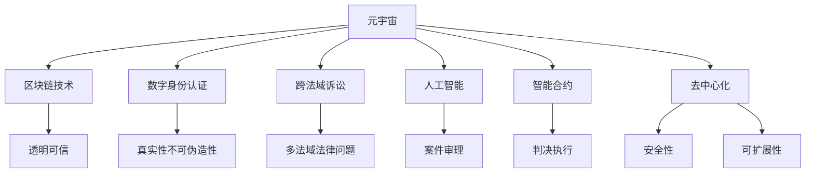

                 

# 元宇宙中的虚拟法庭：跨国纠纷解决的新平台

> 关键词：元宇宙,虚拟法庭,跨境纠纷解决,区块链技术,数字身份认证,跨法域诉讼,人工智能,智能合约

## 1. 背景介绍

### 1.1 问题由来
随着互联网技术的普及和全球化的发展，跨国企业之间的纠纷日益增多。传统的线下诉讼方式存在诸多问题：诉讼周期长、成本高、涉及不同法域的司法程序复杂、证据传递困难等。近年来，随着区块链技术和人工智能的兴起，元宇宙（Metaverse）中的虚拟法庭应运而生，为跨国纠纷解决提供了新的平台和可能。

元宇宙是一个由虚拟现实、增强现实、云计算、物联网等技术构建的虚拟空间，人们可以在其中进行交流、交易、娱乐等多种活动，如同真实世界。虚拟法庭以元宇宙为基础，利用区块链、人工智能等前沿技术，实现跨法域、低成本、高效率的纠纷解决。

### 1.2 问题核心关键点
元宇宙虚拟法庭的构建涉及多个核心技术点：
- **区块链技术**：保障交易透明、可信、不可篡改。
- **数字身份认证**：确保用户身份的真实性和不可伪造性。
- **跨法域诉讼**：处理涉及不同法域的法律问题。
- **人工智能和智能合约**：辅助法院进行案件审理、判决执行等。
- **去中心化**：减少对中心化机构的依赖，提升系统的安全性和可扩展性。

这些关键技术点相互配合，共同构建了元宇宙虚拟法庭的基本框架，使其能够在跨法域、跨国界的纠纷解决中发挥作用。

## 2. 核心概念与联系

### 2.1 核心概念概述

元宇宙虚拟法庭的构建涉及多个核心概念，以下将对其原理和架构进行详细阐述：

- **元宇宙**：一种由虚拟现实、增强现实、云计算、物联网等技术构建的虚拟空间，人们可以在其中进行交流、交易、娱乐等多种活动，如同真实世界。
- **区块链技术**：一种分布式账本技术，保障交易透明、可信、不可篡改。
- **数字身份认证**：利用生物特征、密码学技术等，确保用户身份的真实性和不可伪造性。
- **跨法域诉讼**：处理涉及不同法域的法律问题，涉及多国法律适用、证据认证等问题。
- **人工智能和智能合约**：辅助法院进行案件审理、判决执行等，提升司法效率和准确性。
- **去中心化**：减少对中心化机构的依赖，提升系统的安全性和可扩展性。

这些核心概念之间的逻辑关系可以通过以下Mermaid流程图来展示：



这个流程图展示了元宇宙虚拟法庭的构建中各个技术点之间的逻辑关系：

1. 元宇宙作为基础平台，支持区块链、数字身份认证等技术的运用。
2. 区块链技术保障交易透明可信。
3. 数字身份认证确保用户身份真实。
4. 跨法域诉讼处理涉及多国法律问题。
5. 人工智能和智能合约辅助案件审理和判决执行。
6. 去中心化提升系统安全性和可扩展性。

## 3. 核心算法原理 & 具体操作步骤

### 3.1 算法原理概述

元宇宙虚拟法庭的核心算法原理基于区块链、数字身份认证、人工智能和智能合约等前沿技术。其基本流程为：

1. 收集纠纷双方提供的证据，通过区块链技术进行去中心化存储，确保证据的透明可信。
2. 利用数字身份认证技术，对双方身份进行验证，确保身份的真实性。
3. 在区块链上，通过智能合约自动执行预设的纠纷解决规则，进行案件审理。
4. 人工智能辅助智能合约，实现判决执行的自动化和高效性。

该算法流程的核心是利用区块链和智能合约技术，将传统纠纷解决过程中的人为因素最小化，提升系统的透明度、可信度和效率。

### 3.2 算法步骤详解

以下是元宇宙虚拟法庭的具体操作步骤：

**Step 1: 数据收集与存储**
- 收集纠纷双方提供的证据，包括文字、图片、视频等多种形式。
- 通过区块链技术将证据去中心化存储，确保数据的透明可信。
- 证据存储在分布式节点上，任何节点都可以验证其真实性。

**Step 2: 数字身份验证**
- 利用数字身份认证技术，对纠纷双方的身份进行验证。
- 常用的身份认证方式包括生物特征识别、密码学技术等。
- 确保身份的真实性和不可伪造性，防止身份冒用。

**Step 3: 智能合约执行**
- 在区块链上，使用智能合约自动执行预设的纠纷解决规则。
- 智能合约中预设了纠纷解决的各个步骤，如证据提交、身份验证、案件审理、判决执行等。
- 纠纷双方提交证据和身份信息后，智能合约自动进行验证和处理。

**Step 4: 人工智能辅助**
- 使用人工智能技术辅助智能合约进行案件审理。
- 例如，通过自然语言处理技术自动分析证据，通过机器学习模型预测判决结果等。
- 辅助智能合约提高判决的准确性和效率。

**Step 5: 判决执行**
- 智能合约根据判决结果，自动执行相应的操作。
- 例如，执行判决支付、判决补偿等。
- 通过区块链技术确保判决执行的透明和不可篡改。

### 3.3 算法优缺点

元宇宙虚拟法庭具有以下优点：
1. **高效透明**：通过区块链和智能合约技术，减少人为因素，提高纠纷解决的效率和透明度。
2. **去中心化**：减少对中心化机构的依赖，提升系统的安全性和可扩展性。
3. **跨法域适用**：处理涉及不同法域的法律问题，适用于跨国纠纷解决。
4. **成本低**：相比传统诉讼，无需大量的人力、物力和时间成本。

同时，该算法也存在一些局限性：
1. **技术门槛高**：涉及多个前沿技术，对技术实现要求较高。
2. **法律适用问题**：不同法域的法律适用问题，还需进一步研究和完善。
3. **证据保全问题**：区块链上的数据一旦存储，无法修改，可能存在证据保全的问题。
4. **隐私保护**：数字身份和证据的存储可能涉及隐私保护问题，需进行严格的数据管理。

### 3.4 算法应用领域

元宇宙虚拟法庭的构建涉及多个应用领域，具体包括：

- **跨境电商纠纷**：电商平台上的跨国交易纠纷，涉及货物交付、支付问题等。
- **知识产权纠纷**：涉及跨国知识产权侵权、盗版等问题的纠纷解决。
- **国际投资纠纷**：跨国企业间的投资合同争议等。
- **国际劳动纠纷**：跨国公司与员工的劳动纠纷问题。
- **跨国医疗纠纷**：跨国就医过程中产生的医疗纠纷问题。

这些应用领域为元宇宙虚拟法庭提供了广阔的发展空间，未来有望在更多行业中得到应用。

## 4. 数学模型和公式 & 详细讲解 & 举例说明

### 4.1 数学模型构建

元宇宙虚拟法庭的数学模型主要涉及区块链技术、数字身份认证、人工智能和智能合约等多个方面的内容。以下将对其中关键的数学模型进行详细构建和讲解。

**区块链数学模型**：
- 假设$f(x)$为区块链上某一交易的哈希值。
- 对于任意两个不同的交易$x_1$和$x_2$，如果$f(x_1)=f(x_2)$，则认为这两个交易相同。
- 利用密码学哈希算法，确保交易数据的不可篡改和透明性。

**数字身份认证数学模型**：
- 假设$I$为用户身份信息，包括生物特征、密码等。
- 通过密码学技术，如哈希、非对称加密等，确保身份信息的不可伪造性和真实性。

**人工智能和智能合约数学模型**：
- 假设$A$为人工智能模型，$S$为智能合约规则。
- $A$通过对证据数据进行分析，输出判决结果$R$。
- $S$根据$R$自动执行相应的操作，如支付、赔偿等。

### 4.2 公式推导过程

以下对区块链和智能合约的数学模型进行详细推导：

**区块链数学推导**：
- 假设区块链上某一交易的哈希值为$f(x)$。
- 对于任意两个不同的交易$x_1$和$x_2$，如果$f(x_1)=f(x_2)$，则认为这两个交易相同。
- 通过密码学哈希算法，确保交易数据的不可篡改和透明性。

**智能合约数学推导**：
- 假设智能合约规则为$S$，用户提供的数据为$D$。
- 智能合约通过计算$S(D)$得到相应的操作指令。
- 假设$A$为人工智能模型，通过自然语言处理等技术对$D$进行分析，输出判决结果$R$。
- 智能合约根据$R$自动执行相应的操作。

### 4.3 案例分析与讲解

假设某跨国电商平台发生如下纠纷：

**纠纷描述**：
- 中国买家A在澳大利亚购买了商品，但由于物流问题，商品未能在约定时间内送达。
- 澳大利亚卖家B要求A支付滞纳金。

**操作步骤**：
1. 纠纷双方将相关证据（物流记录、交易记录等）上传到区块链。
2. 利用数字身份认证技术，验证双方身份信息。
3. 使用智能合约自动执行预设的纠纷解决规则，进行案件审理。
4. 人工智能模型对物流记录进行分析，辅助智能合约进行判决执行。

**结果展示**：
- 智能合约自动验证证据的真实性和身份信息。
- 人工智能模型根据物流记录分析，认为物流延迟是卖家原因。
- 智能合约自动判决卖家需赔偿买家，并执行相应的支付操作。

## 5. 项目实践：代码实例和详细解释说明

### 5.1 开发环境搭建

以下是元宇宙虚拟法庭开发的基本环境搭建流程：

**环境配置**：
- 使用Python 3.8及以上版本，安装相关依赖包，如区块链库、自然语言处理库、智能合约库等。
- 搭建区块链网络，部署智能合约和人工智能模型。

**区块链网络搭建**：
- 使用Hyperledger Fabric等区块链平台搭建分布式节点。
- 配置智能合约和区块链链码，确保网络的正常运行。

**智能合约部署**：
- 编写智能合约代码，使用Solidity语言。
- 将智能合约部署到区块链上。

**人工智能模型搭建**：
- 使用TensorFlow或PyTorch等深度学习框架搭建自然语言处理模型。
- 训练模型，优化参数，部署模型服务。

### 5.2 源代码详细实现

以下是元宇宙虚拟法庭的Python代码实现：

```python
from blockchain import Blockchain
from identity认证 import verify_id
from smart合约 import SmartContract
from artificial_intelligence import AIModel

class VirtualCourt:
    def __init__(self, blockchain):
        self.blockchain = blockchain
        self.smart_contract = SmartContract()
    
    def collect_evidence(self, evidence):
        self.blockchain.add_evidence(evidence)
    
    def verify_identity(self, id_info):
        return verify_id(id_info)
    
    def execute_smart合约(self, smart合约规则):
        self.smart合约.execute(smart合约规则)
    
    def analyze_evidence(self, evidence):
        model = AIModel()
        判决结果 = model.predict(evidence)
        return 判决结果
    
    def process_case(self, id_info, evidence):
        id_valid = self.verify_identity(id_info)
        if id_valid:
            判决结果 = self.analyze_evidence(evidence)
            self.execute_smart合约(判决结果)
        else:
            print("身份验证失败，案件无法处理")
```

### 5.3 代码解读与分析

以上代码实现了元宇宙虚拟法庭的基本功能：

**VirtualCourt类**：
- 该类封装了虚拟法庭的主要功能，包括证据收集、身份验证、智能合约执行、证据分析等。
- 使用区块链、数字身份认证、人工智能和智能合约等技术。
- 各个方法调用区块链、数字身份认证、人工智能等模块的接口，实现案件处理。

**方法实现**：
- collect_evidence方法：将证据添加到区块链上。
- verify_identity方法：通过数字身份认证技术验证身份信息。
- execute_smart合约方法：使用智能合约执行预设规则。
- analyze_evidence方法：通过人工智能模型分析证据，辅助智能合约决策。
- process_case方法：将证据和身份信息作为输入，调用各个方法处理案件。

**运行结果展示**：
- 使用Hyperledger Fabric等区块链平台搭建的区块链网络。
- 使用Python实现的智能合约和人工智能模型。
- 在虚拟法庭系统中，通过调用各个模块的接口，实现案件的自动处理。

## 6. 实际应用场景

### 6.1 智能合约纠纷解决

元宇宙虚拟法庭在智能合约纠纷解决方面具有显著优势。传统的智能合约执行依赖于中心化机构的仲裁，存在延迟和成本高的问题。元宇宙虚拟法庭通过区块链和智能合约技术，实现自动化的纠纷解决，减少人为干预，提高效率和透明度。

例如，在跨国金融交易中，智能合约自动执行交易规则，任何违反规则的行为都将自动触发惩罚机制，无需中心化机构的介入。

### 6.2 跨国劳动纠纷

跨国劳动纠纷是元宇宙虚拟法庭的重要应用场景之一。传统劳动纠纷处理涉及不同国家的法律程序，时间成本高，过程复杂。元宇宙虚拟法庭利用区块链和人工智能技术，简化流程，提高处理效率。

例如，跨国公司与员工之间的劳动纠纷，通过智能合约自动执行合同条款，无需经过繁琐的跨国诉讼程序。

### 6.3 国际贸易纠纷

国际贸易纠纷处理复杂，涉及多国法律和程序。元宇宙虚拟法庭通过区块链和智能合约技术，实现跨国纠纷的自动化处理，提高效率和透明度。

例如，国际贸易合同纠纷，通过智能合约自动执行合同条款，确保交易的公平性和透明性。

### 6.4 未来应用展望

随着技术的不断进步，元宇宙虚拟法庭将在更多领域得到应用，以下是未来发展的几个方向：

- **司法效率提升**：元宇宙虚拟法庭将提高司法效率，减少诉讼时间，降低成本。
- **跨境纠纷解决**：元宇宙虚拟法庭适用于更多跨国纠纷解决场景，提升国际合作。
- **数据透明可信**：利用区块链技术，确保交易数据的透明可信，提升信任度。
- **智能合约普及**：智能合约的普及将推动元宇宙虚拟法庭的广泛应用。
- **技术标准制定**：制定元宇宙虚拟法庭的技术标准，确保系统的安全和稳定。

未来，随着技术的进一步发展，元宇宙虚拟法庭有望成为跨国纠纷解决的重要平台，提升司法效率，推动全球治理的现代化。

## 7. 工具和资源推荐

### 7.1 学习资源推荐

为帮助开发者掌握元宇宙虚拟法庭的开发，推荐以下学习资源：

- **《区块链技术基础》**：详细介绍区块链的基本原理和应用场景，适合初学者入门。
- **《人工智能基础》**：介绍人工智能的基本概念和算法，涵盖自然语言处理、机器学习等方向。
- **《智能合约开发指南》**：详细介绍智能合约的开发流程和最佳实践，适合开发者学习。
- **《元宇宙开发手册》**：涵盖元宇宙的构建技术，包括虚拟现实、增强现实、云计算等。
- **《虚拟法庭系统设计》**：介绍虚拟法庭系统的设计原理和实践案例。

### 7.2 开发工具推荐

以下工具和库可以帮助开发者实现元宇宙虚拟法庭的开发：

- **Python**：开发元宇宙虚拟法庭的常用语言，使用简单，生态丰富。
- **Hyperledger Fabric**：搭建区块链网络，支持智能合约的开发和部署。
- **TensorFlow**：搭建人工智能模型，支持自然语言处理等任务。
- **Ethereum**：搭建智能合约的开发和部署环境。
- **Jupyter Notebook**：用于编写和运行代码，适合数据科学和算法开发。

### 7.3 相关论文推荐

以下是元宇宙虚拟法庭相关领域的经典论文，推荐阅读：

- **"Blockchain Technology and Smart Contracts in Legal Systems"**：介绍区块链和智能合约在法律系统中的应用，提供理论基础。
- **"The Future of Justice: A Case Study of Virtual Courts"**：分析虚拟法庭的实际应用案例，探讨其前景和挑战。
- **"AI in Legal Proceedings: An Overview"**：介绍人工智能在法律诉讼中的作用，探讨其优势和局限。
- **"Cross-Border Dispute Resolution in Metaverse"**：探讨元宇宙中跨国纠纷解决的方法和实践，提供参考。
- **"Security and Privacy in Metaverse: A New Challenge"**：分析元宇宙中的安全和隐私问题，提供解决方案。

## 8. 总结：未来发展趋势与挑战

### 8.1 研究成果总结

元宇宙虚拟法庭的构建涉及区块链、数字身份认证、人工智能和智能合约等前沿技术。通过这些技术的结合，可以实现跨国纠纷解决的自动化和高效化。

### 8.2 未来发展趋势

未来，元宇宙虚拟法庭将在多个领域得到应用，其发展趋势包括：

- **技术进一步成熟**：区块链、人工智能等技术将不断提升，提升系统的安全性和可扩展性。
- **应用场景更广泛**：元宇宙虚拟法庭将应用于更多领域，如智能合约、劳动纠纷、国际贸易等。
- **用户体验提升**：通过虚拟现实、增强现实等技术，提升用户体验，提升系统的交互性。
- **国际合作加强**：通过跨国合作，推动元宇宙虚拟法庭的标准化和普及。

### 8.3 面临的挑战

尽管元宇宙虚拟法庭在许多方面具有优势，但仍面临以下挑战：

- **技术门槛高**：涉及多个前沿技术，对技术实现要求较高。
- **法律适用问题**：不同法域的法律适用问题，还需进一步研究和完善。
- **隐私保护**：数字身份和证据的存储可能涉及隐私保护问题，需进行严格的数据管理。
- **系统安全性**：元宇宙虚拟法庭的安全性和鲁棒性需进一步提升。

### 8.4 研究展望

未来，元宇宙虚拟法庭的研究方向包括：

- **跨法域法律适用**：研究多法域法律适用的问题，确保系统的普适性。
- **隐私保护技术**：开发隐私保护技术，确保数据安全和隐私保护。
- **系统安全性**：提升系统的安全性和鲁棒性，确保系统的稳定性和可靠性。
- **用户体验优化**：通过虚拟现实、增强现实等技术，提升用户体验，增强系统的交互性。
- **国际合作**：推动元宇宙虚拟法庭的国际合作和标准化，提升系统的普适性。

## 9. 附录：常见问题与解答

**Q1：元宇宙虚拟法庭的优点和缺点分别是什么？**

A: 元宇宙虚拟法庭的优点包括：高效透明、去中心化、跨法域适用、成本低等。缺点包括：技术门槛高、法律适用问题、证据保全问题、隐私保护等。

**Q2：元宇宙虚拟法庭如何实现身份验证？**

A: 元宇宙虚拟法庭利用数字身份认证技术，通过生物特征识别、密码学技术等，确保用户身份的真实性和不可伪造性。

**Q3：元宇宙虚拟法庭在智能合约纠纷解决中的作用是什么？**

A: 元宇宙虚拟法庭通过区块链和智能合约技术，实现智能合约纠纷的自动化处理，减少人为干预，提高效率和透明度。

**Q4：元宇宙虚拟法庭在跨国劳动纠纷中的应用场景是什么？**

A: 元宇宙虚拟法庭在跨国劳动纠纷中的应用场景包括跨国公司与员工的劳动纠纷，通过智能合约自动执行合同条款，无需经过繁琐的跨国诉讼程序。

**Q5：元宇宙虚拟法庭在未来的发展方向是什么？**

A: 元宇宙虚拟法庭在未来的发展方向包括技术成熟、应用广泛、用户体验提升、国际合作加强等，推动元宇宙虚拟法庭的标准化和普及。

---

作者：禅与计算机程序设计艺术 / Zen and the Art of Computer Programming

