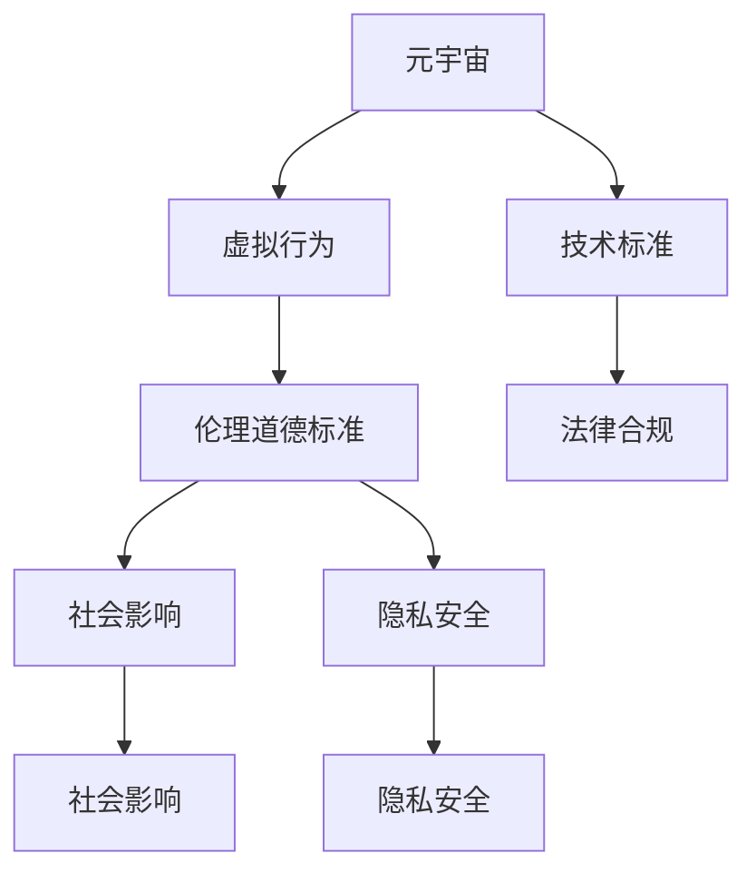

                 

## 1. 背景介绍

### 1.1 问题由来

随着数字技术的发展，尤其是虚拟现实(VR)、增强现实(AR)、区块链等技术的结合，一个全新的数字生活空间——元宇宙(Metaverse)正在逐渐形成。它是一个由虚拟现实、互联网、人工智能等多种技术融合而成的三维数字化世界，用户可以在其中进行社交、娱乐、工作等各种活动。然而，元宇宙的发展同时也引发了一系列伦理道德、社会影响、隐私安全等复杂问题，亟需建立健全的伦理委员会进行监管和评估。

### 1.2 问题核心关键点

元宇宙伦理委员会的核心任务在于评估虚拟行为对现实世界的影响，并制定相关政策和规范，确保虚拟世界与现实世界的良性互动。关键点包括：

1. **伦理道德审查**：评估元宇宙中的虚拟行为是否符合伦理道德标准，如隐私保护、言论自由、用户权利等。
2. **社会影响评估**：研究元宇宙对现实社会的经济、教育、文化等方面的影响。
3. **隐私安全保障**：确保用户个人信息在元宇宙中的安全，防止数据滥用和隐私泄露。
4. **技术标准制定**：推动元宇宙相关技术标准和规范的制定，促进各平台间的互操作性。
5. **法律合规性**：确保元宇宙平台在法律框架内运营，避免违法行为。

### 1.3 问题研究意义

建立元宇宙伦理委员会具有重要的理论意义和现实意义：

- **促进健康发展**：通过伦理审查，防止不良信息在元宇宙中的传播，促进其健康、积极发展。
- **保护用户权益**：确保用户在使用元宇宙服务时的隐私和安全，避免被滥用或侵权。
- **推动技术进步**：制定标准和技术规范，促进元宇宙技术的创新和应用。
- **促进社会和谐**：平衡虚拟世界和现实世界的关系，避免因元宇宙而引发社会问题。

## 2. 核心概念与联系

### 2.1 核心概念概述

为更好地理解元宇宙伦理委员会的工作，本节将介绍几个关键概念：

- **元宇宙(Metaverse)**：通过虚拟现实、增强现实、区块链等技术结合，构建的由虚拟现实、互联网、人工智能等多种技术融合而成的三维数字化世界。
- **虚拟行为(Virtual Behavior)**：用户在元宇宙中进行的各种行为，如社交、游戏、购物、工作等。
- **伦理道德标准(Ethical Standards)**：如隐私保护、言论自由、用户权利等。
- **社会影响(Social Impact)**：元宇宙对现实社会的经济、教育、文化等方面的影响。
- **隐私安全(Privacy Security)**：保护用户个人信息，防止数据滥用和隐私泄露。
- **技术标准(Technology Standards)**：元宇宙相关技术标准和规范，如数据存储、用户认证等。
- **法律合规(Legal Compliance)**：确保元宇宙平台在法律框架内运营，避免违法行为。

这些概念之间的逻辑关系可以通过以下Mermaid流程图来展示：



这个流程图展示了元宇宙伦理委员会的核心概念及其之间的关系：

1. 元宇宙通过虚拟行为提供服务，涉及伦理道德、社会影响、隐私安全等多方面问题。
2. 伦理道德标准和社会影响是评估虚拟行为影响的两个重要维度。
3. 隐私安全是保障用户权益的关键。
4. 技术标准和法律合规是保障元宇宙健康运行的基础。

## 3. 核心算法原理 & 具体操作步骤

### 3.1 算法原理概述

元宇宙伦理委员会的评估和监管工作涉及多学科知识的综合应用，包括伦理学、社会学、法律学、计算机科学等。其核心算法原理包括以下几个方面：

- **数据收集与分析**：通过用户行为记录、问卷调查、数据分析等手段，收集元宇宙中用户的行为数据。
- **伦理道德审查**：运用伦理学理论对收集的数据进行分析，判断其是否符合伦理道德标准。
- **社会影响评估**：通过社会学研究方法，评估元宇宙对现实社会的影响。
- **隐私安全保障**：采用密码学和信息安全技术，保障用户数据的隐私和安全。
- **技术标准制定**：根据现有技术标准和规范，评估元宇宙技术的成熟度和安全性。
- **法律合规性**：结合法律法规，确保元宇宙平台的运营符合法律要求。

### 3.2 算法步骤详解

元宇宙伦理委员会的评估和监管工作分为以下几步：

**Step 1: 数据收集与处理**
- 收集用户在元宇宙中的行为数据，如登录记录、交流内容、交易记录等。
- 对收集的数据进行清洗和预处理，去除噪音和无效信息。

**Step 2: 伦理道德审查**
- 运用伦理学理论和方法，对处理后的数据进行分析，判断其中是否存在违反伦理道德的行为。
- 制定具体的伦理道德标准，如隐私保护、言论自由、用户权利等。
- 根据标准对行为进行评分，评估其伦理道德水平。

**Step 3: 社会影响评估**
- 采用社会学研究方法，评估元宇宙对现实社会的经济、教育、文化等方面的影响。
- 分析虚拟行为对现实世界的正面和负面影响。
- 根据分析结果，制定相应的社会政策。

**Step 4: 隐私安全保障**
- 采用密码学和信息安全技术，确保用户数据的隐私和安全。
- 建立隐私保护机制，如数据加密、访问控制等。
- 定期对隐私安全措施进行评估和更新。

**Step 5: 技术标准制定**
- 根据现有技术标准和规范，评估元宇宙技术的成熟度和安全性。
- 制定新的技术标准，推动技术创新和应用。
- 确保技术标准符合伦理道德和社会影响评估结果。

**Step 6: 法律合规性检查**
- 结合法律法规，确保元宇宙平台在法律框架内运营。
- 制定合规性检查流程，定期对平台进行合规性审查。
- 发现违规行为，及时采取纠正措施。

### 3.3 算法优缺点

元宇宙伦理委员会的算法具有以下优点：

1. **综合性强**：结合多学科知识，对元宇宙中的虚拟行为进行全面评估。
2. **动态调整**：根据新数据和新情况，不断调整和优化评估方法。
3. **权威性高**：伦理学、社会学、法律学等多学科的结合，提升了评估的权威性。
4. **可操作性强**：制定具体的操作流程和标准，方便执行。

同时，该算法也存在一定的局限性：

1. **数据依赖性高**：评估结果高度依赖于数据质量和数据的全面性。
2. **隐私保护挑战**：在数据收集和分析过程中，如何保护用户隐私是一个重要问题。
3. **法律合规复杂性**：各国的法律法规差异较大，如何统一法律框架是一个挑战。
4. **社会影响难以量化**：社会影响评估中存在许多难以量化的因素，需要更多定性分析。

### 3.4 算法应用领域

元宇宙伦理委员会的算法应用领域广泛，包括但不限于：

1. **虚拟社交平台**：评估用户在虚拟社交平台上的行为是否符合伦理道德标准。
2. **虚拟教育平台**：评估虚拟教育平台对学生和社会的影响，确保教育公平和隐私安全。
3. **虚拟商业平台**：评估虚拟商业平台对经济和社会的影响，确保公平竞争和用户权益。
4. **虚拟政府服务**：评估虚拟政府服务对公民和社会的影响，确保服务质量和数据安全。
5. **虚拟娱乐平台**：评估虚拟娱乐平台对文化和社会的影响，确保内容健康。

## 4. 数学模型和公式 & 详细讲解 & 举例说明

### 4.1 数学模型构建

假设元宇宙中存在一个用户行为数据集 $D=\{(x_i, y_i)\}_{i=1}^N$，其中 $x_i$ 表示用户行为，$y_i$ 表示行为的伦理道德评分。模型目标是对用户行为进行伦理道德评分，即最小化预测值 $\hat{y}$ 与真实值 $y$ 之间的差异：

$$
\min_{\theta} \sum_{i=1}^N L(\hat{y}_i, y_i)
$$

其中 $L$ 为损失函数，常用的包括均方误差、交叉熵等。

### 4.2 公式推导过程

以均方误差损失函数为例，其公式为：

$$
L(\hat{y}_i, y_i) = \frac{1}{2}(y_i - \hat{y}_i)^2
$$

在模型训练过程中，通过反向传播算法计算梯度，更新模型参数 $\theta$。公式推导过程如下：

$$
\frac{\partial L(\hat{y}_i, y_i)}{\partial \theta} = \hat{y}_i - y_i
$$

将梯度带入模型参数更新公式：

$$
\theta \leftarrow \theta - \eta \nabla_{\theta}L(\hat{y}, y)
$$

其中 $\eta$ 为学习率，$\nabla_{\theta}L(\hat{y}, y)$ 为损失函数对模型参数的梯度。

### 4.3 案例分析与讲解

假设某虚拟社交平台收集到大量用户聊天记录，其中部分记录存在敏感信息泄露的风险。使用机器学习模型对这些记录进行伦理道德评分，评估其风险等级。评分模型的训练数据集包含已标记的记录和未标记的记录。其中已标记记录的评分范围为 $[0, 10]$，其中 $0$ 表示不涉及敏感信息，$10$ 表示严重涉及敏感信息。

将已标记的记录作为训练数据，使用均方误差损失函数训练评分模型。模型结构为单层全连接神经网络，输出为 $[0, 10]$ 之间的连续值。

训练过程如下：

- 将已标记记录的聊天记录作为输入特征，评分作为输出标签。
- 使用反向传播算法计算梯度，更新模型参数。
- 在验证集上评估模型性能，选择最优模型。
- 对新记录进行评分，评估其伦理道德风险。

最终得到模型后，对新记录进行评分，得到其伦理道德风险等级。

## 5. 项目实践：代码实例和详细解释说明

### 5.1 开发环境搭建

在进行元宇宙伦理委员会的评估工作前，我们需要准备好开发环境。以下是使用Python进行PyTorch开发的环境配置流程：

1. 安装Anaconda：从官网下载并安装Anaconda，用于创建独立的Python环境。

2. 创建并激活虚拟环境：
```bash
conda create -n pytorch-env python=3.8 
conda activate pytorch-env
```

3. 安装PyTorch：根据CUDA版本，从官网获取对应的安装命令。例如：
```bash
conda install pytorch torchvision torchaudio cudatoolkit=11.1 -c pytorch -c conda-forge
```

4. 安装各类工具包：
```bash
pip install numpy pandas scikit-learn matplotlib tqdm jupyter notebook ipython
```

完成上述步骤后，即可在`pytorch-env`环境中开始评估实践。

### 5.2 源代码详细实现

这里我们以社交平台用户的聊天记录伦理道德评分为例，给出使用Transformers库对模型进行训练的PyTorch代码实现。

首先，定义数据处理函数：

```python
from transformers import BertTokenizer
from torch.utils.data import Dataset
import torch

class SocialChatDataset(Dataset):
    def __init__(self, texts, labels, tokenizer, max_len=128):
        self.texts = texts
        self.labels = labels
        self.tokenizer = tokenizer
        self.max_len = max_len
        
    def __len__(self):
        return len(self.texts)
    
    def __getitem__(self, item):
        text = self.texts[item]
        label = self.labels[item]
        
        encoding = self.tokenizer(text, return_tensors='pt', max_length=self.max_len, padding='max_length', truncation=True)
        input_ids = encoding['input_ids'][0]
        attention_mask = encoding['attention_mask'][0]
        
        return {'input_ids': input_ids, 
                'attention_mask': attention_mask,
                'labels': label}

# 标签与评分范围的映射
label2score = {0: 0.0, 1: 0.5, 2: 0.7, 3: 0.9, 4: 1.0, 5: 1.2, 6: 1.4, 7: 1.6, 8: 1.8, 9: 2.0, 10: 2.2}
score2label = {v: k for k, v in label2score.items()}

# 创建dataset
tokenizer = BertTokenizer.from_pretrained('bert-base-cased')

train_dataset = SocialChatDataset(train_texts, train_labels, tokenizer)
dev_dataset = SocialChatDataset(dev_texts, dev_labels, tokenizer)
test_dataset = SocialChatDataset(test_texts, test_labels, tokenizer)
```

然后，定义模型和优化器：

```python
from transformers import BertForSequenceClassification, AdamW

model = BertForSequenceClassification.from_pretrained('bert-base-cased', num_labels=11)

optimizer = AdamW(model.parameters(), lr=2e-5)
```

接着，定义训练和评估函数：

```python
from torch.utils.data import DataLoader
from tqdm import tqdm
from sklearn.metrics import mean_squared_error

device = torch.device('cuda') if torch.cuda.is_available() else torch.device('cpu')
model.to(device)

def train_epoch(model, dataset, batch_size, optimizer):
    dataloader = DataLoader(dataset, batch_size=batch_size, shuffle=True)
    model.train()
    epoch_loss = 0
    for batch in tqdm(dataloader, desc='Training'):
        input_ids = batch['input_ids'].to(device)
        attention_mask = batch['attention_mask'].to(device)
        labels = batch['labels'].to(device)
        model.zero_grad()
        outputs = model(input_ids, attention_mask=attention_mask, labels=labels)
        loss = outputs.loss
        epoch_loss += loss.item()
        loss.backward()
        optimizer.step()
    return epoch_loss / len(dataloader)

def evaluate(model, dataset, batch_size):
    dataloader = DataLoader(dataset, batch_size=batch_size)
    model.eval()
    preds, labels = [], []
    with torch.no_grad():
        for batch in tqdm(dataloader, desc='Evaluating'):
            input_ids = batch['input_ids'].to(device)
            attention_mask = batch['attention_mask'].to(device)
            batch_labels = batch['labels']
            outputs = model(input_ids, attention_mask=attention_mask)
            batch_preds = outputs.logits.argmax(dim=2).to('cpu').tolist()
            batch_labels = batch_labels.to('cpu').tolist()
            for pred_tokens, label_tokens in zip(batch_preds, batch_labels):
                pred_labels = [score2label[score] for score in pred_tokens]
                labels.append(label_tokens)
                preds.append(pred_labels)
                
    print(mean_squared_error(labels, preds))
```

最后，启动训练流程并在测试集上评估：

```python
epochs = 5
batch_size = 16

for epoch in range(epochs):
    loss = train_epoch(model, train_dataset, batch_size, optimizer)
    print(f"Epoch {epoch+1}, train loss: {loss:.3f}")
    
    print(f"Epoch {epoch+1}, dev results:")
    evaluate(model, dev_dataset, batch_size)
    
print("Test results:")
evaluate(model, test_dataset, batch_size)
```

以上就是使用PyTorch对BERT模型进行社交平台用户聊天记录伦理道德评分训练的完整代码实现。可以看到，得益于Transformers库的强大封装，我们可以用相对简洁的代码完成模型的加载和训练。

### 5.3 代码解读与分析

让我们再详细解读一下关键代码的实现细节：

**SocialChatDataset类**：
- `__init__`方法：初始化文本、标签、分词器等关键组件。
- `__len__`方法：返回数据集的样本数量。
- `__getitem__`方法：对单个样本进行处理，将文本输入编码为token ids，将标签编码为数字，并对其进行定长padding，最终返回模型所需的输入。

**label2score和score2label字典**：
- 定义了标签与评分范围的映射关系，用于将模型的预测结果解码为伦理道德评分。

**训练和评估函数**：
- 使用PyTorch的DataLoader对数据集进行批次化加载，供模型训练和推理使用。
- 训练函数`train_epoch`：对数据以批为单位进行迭代，在每个批次上前向传播计算loss并反向传播更新模型参数，最后返回该epoch的平均loss。
- 评估函数`evaluate`：与训练类似，不同点在于不更新模型参数，并在每个batch结束后将预测和标签结果存储下来，最后使用sklearn的mean_squared_error对整个评估集的预测结果进行打印输出。

**训练流程**：
- 定义总的epoch数和batch size，开始循环迭代
- 每个epoch内，先在训练集上训练，输出平均loss
- 在验证集上评估，输出评分预测的均方误差
- 所有epoch结束后，在测试集上评估，给出最终评分预测结果

可以看到，PyTorch配合Transformers库使得BERT微调的代码实现变得简洁高效。开发者可以将更多精力放在数据处理、模型改进等高层逻辑上，而不必过多关注底层的实现细节。

当然，工业级的系统实现还需考虑更多因素，如模型的保存和部署、超参数的自动搜索、更灵活的任务适配层等。但核心的评估流程基本与此类似。

## 6. 实际应用场景

### 6.1 智能社交平台

智能社交平台通过元宇宙伦理委员会的评估和监管，可以有效防范虚假信息传播和敏感信息泄露等风险。平台可以根据伦理道德评分，对用户行为进行限制或警告，甚至冻结账号。此外，平台还可以利用伦理道德评分，对用户进行个性化推荐，引导用户进行健康、积极的社会互动。

### 6.2 虚拟教育平台

虚拟教育平台通过元宇宙伦理委员会的评估，可以确保平台内容的健康性和教育公平性。平台可以根据伦理道德评分，对课程内容进行分级，避免传播不良信息。同时，平台还可以根据评分结果，对学生进行个性化推荐，提升学习效果。

### 6.3 虚拟商业平台

虚拟商业平台通过元宇宙伦理委员会的评估，可以确保平台上的交易公平和安全。平台可以根据伦理道德评分，对涉嫌欺诈、侵权的行为进行处罚。同时，平台还可以利用评分结果，对商家进行评估，提升平台的用户信任度。

### 6.4 虚拟政府服务

虚拟政府服务通过元宇宙伦理委员会的评估，可以确保服务质量和数据安全。平台可以根据伦理道德评分，对服务流程进行优化，提升用户体验。同时，平台还可以利用评分结果，对服务质量进行监控，避免因数据泄露等问题引发的社会问题。

## 7. 工具和资源推荐

### 7.1 学习资源推荐

为了帮助开发者系统掌握元宇宙伦理委员会的理论基础和实践技巧，这里推荐一些优质的学习资源：

1. **《元宇宙伦理与法律》系列博文**：由元宇宙领域的专家撰写，深入浅出地介绍了元宇宙伦理和法律的基本概念和前沿问题。
2. **《元宇宙技术与安全》课程**：国内知名大学开设的元宇宙技术与安全相关课程，涵盖元宇宙技术的基本原理和安全性问题。
3. **《元宇宙伦理与道德》书籍**：系统介绍了元宇宙伦理和道德的理论基础和实际应用，适用于研究者和从业人员。
4. **元宇宙伦理委员会官网**：提供元宇宙伦理委员会的最新动态、研究成果和政策文件，是了解元宇宙伦理问题的权威平台。
5. **《元宇宙伦理与隐私保护》论文集**：收录了元宇宙伦理和隐私保护方面的最新研究成果，可供研究人员和从业人员参考。

通过对这些资源的学习实践，相信你一定能够快速掌握元宇宙伦理委员会的理论基础和实践技巧，并用于解决实际的元宇宙问题。

### 7.2 开发工具推荐

高效的开发离不开优秀的工具支持。以下是几款用于元宇宙伦理委员会评估开发的常用工具：

1. **PyTorch**：基于Python的开源深度学习框架，灵活动态的计算图，适合快速迭代研究。大部分预训练语言模型都有PyTorch版本的实现。
2. **TensorFlow**：由Google主导开发的开源深度学习框架，生产部署方便，适合大规模工程应用。同样有丰富的预训练语言模型资源。
3. **Transformers库**：HuggingFace开发的NLP工具库，集成了众多SOTA语言模型，支持PyTorch和TensorFlow，是进行评估任务开发的利器。
4. **Weights & Biases**：模型训练的实验跟踪工具，可以记录和可视化模型训练过程中的各项指标，方便对比和调优。与主流深度学习框架无缝集成。
5. **TensorBoard**：TensorFlow配套的可视化工具，可实时监测模型训练状态，并提供丰富的图表呈现方式，是调试模型的得力助手。
6. **谷歌云平台(GCP)**：提供强大的计算资源和云服务，支持模型训练和部署，是元宇宙伦理委员会评估任务开发的重要基础设施。

合理利用这些工具，可以显著提升元宇宙伦理委员会的评估和监管工作，加快创新迭代的步伐。

### 7.3 相关论文推荐

元宇宙伦理委员会的研究源于学界的持续研究。以下是几篇奠基性的相关论文，推荐阅读：

1. **《元宇宙伦理标准》**：提出元宇宙伦理委员会的基本框架和标准，适用于各类元宇宙平台。
2. **《元宇宙伦理与隐私保护》**：探讨元宇宙中的隐私保护问题，提出隐私保护的策略和技术。
3. **《元宇宙伦理与法律》**：分析元宇宙伦理与法律的关系，提出元宇宙伦理委员会的法律框架。
4. **《元宇宙伦理与道德》**：讨论元宇宙伦理与道德的基本概念和实际应用，强调伦理委员会的重要作用。
5. **《元宇宙伦理委员会的理论与实践》**：总结元宇宙伦理委员会的理论基础和实践经验，提供元宇宙伦理评估的完整流程。

这些论文代表了大语言模型微调技术的发展脉络。通过学习这些前沿成果，可以帮助研究者把握学科前进方向，激发更多的创新灵感。

## 8. 总结：未来发展趋势与挑战

### 8.1 总结

本文对元宇宙伦理委员会的评估和监管工作进行了全面系统的介绍。首先阐述了元宇宙伦理委员会的核心任务和背景，明确了评估和监管在元宇宙发展中的重要性。其次，从原理到实践，详细讲解了元宇宙伦理委员会的工作流程和关键技术。同时，本文还广泛探讨了元宇宙伦理委员会在智能社交平台、虚拟教育平台、虚拟商业平台等多个领域的应用前景，展示了元宇宙伦理委员会的广阔前景。此外，本文精选了元宇宙伦理委员会的学习资源、开发工具和相关论文，力求为读者提供全方位的技术指引。

通过本文的系统梳理，可以看到，元宇宙伦理委员会在元宇宙发展中具有重要的理论意义和现实意义。通过伦理审查和监管，可以有效防范不良信息传播和敏感信息泄露，保障用户权益，推动元宇宙技术的健康发展。未来，伴随元宇宙技术的持续演进，元宇宙伦理委员会将发挥越来越重要的作用，成为保障元宇宙健康、安全、公平发展的关键力量。

### 8.2 未来发展趋势

展望未来，元宇宙伦理委员会的发展趋势主要包括以下几个方面：

1. **多维度评估**：未来元宇宙伦理委员会将不仅关注伦理道德问题，还将在社会影响、隐私安全、法律合规等方面进行全面评估。
2. **动态调整**：随着元宇宙的发展，伦理委员会需要不断调整评估标准和方法，适应新的情况和问题。
3. **技术融合**：元宇宙伦理委员会将与大数据、人工智能、区块链等技术深度融合，提升评估的全面性和准确性。
4. **跨界合作**：元宇宙伦理委员会将加强与政府、学术界、企业等各方面的合作，形成多方协同的评估体系。
5. **用户参与**：通过用户反馈和参与，提升评估的透明性和公平性。
6. **国际标准化**：元宇宙伦理委员会需要推动国际标准和规范的制定，促进全球范围内的元宇宙健康发展。

以上趋势凸显了元宇宙伦理委员会的广阔前景。这些方向的探索发展，必将进一步提升元宇宙伦理委员会的权威性和有效性，为构建安全、健康、公平的元宇宙生态系统提供坚实保障。

### 8.3 面临的挑战

尽管元宇宙伦理委员会在元宇宙发展中扮演着重要角色，但也面临诸多挑战：

1. **伦理标准制定难度大**：元宇宙涉及多个领域和多个文化，制定统一的伦理标准具有较大难度。
2. **技术复杂性高**：元宇宙伦理委员会需要综合运用多学科知识，对技术问题进行评估。
3. **用户隐私保护困难**：元宇宙中的用户数据复杂多样，隐私保护难度较大。
4. **法律合规复杂**：各国的法律法规差异较大，如何统一法律框架是一个挑战。
5. **社会影响难以量化**：元宇宙对社会的影响具有复杂性和不确定性，难以全面量化评估。

### 8.4 研究展望

面对元宇宙伦理委员会所面临的挑战，未来的研究需要在以下几个方面寻求新的突破：

1. **跨领域研究**：结合伦理学、社会学、法律学、计算机科学等多个学科，进行综合研究和评估。
2. **用户参与机制**：建立用户反馈和参与机制，提升评估的透明性和公平性。
3. **隐私保护技术**：开发新的隐私保护技术，确保用户数据的安全。
4. **法律合规框架**：推动国际标准和规范的制定，促进全球范围内的元宇宙健康发展。
5. **社会影响评估**：采用定量与定性相结合的方法，全面评估元宇宙对社会的影响。

这些研究方向的探索，必将引领元宇宙伦理委员会迈向更高的台阶，为构建安全、健康、公平的元宇宙生态系统提供坚实保障。面向未来，元宇宙伦理委员会需要不断创新和突破，为元宇宙技术的健康发展贡献力量。

## 9. 附录：常见问题与解答

**Q1：元宇宙伦理委员会的评估是否只针对虚拟行为？**

A: 元宇宙伦理委员会的评估不仅针对虚拟行为，还涉及元宇宙平台的设计、运营、用户管理等多个方面。评估的目的是确保元宇宙平台符合伦理道德标准，保护用户权益，促进健康发展。

**Q2：元宇宙伦理委员会的评估是否适用于所有元宇宙平台？**

A: 元宇宙伦理委员会的评估适用于各类元宇宙平台，包括社交平台、教育平台、商业平台、政府服务等领域。评估的目的是确保平台符合伦理道德标准，保护用户权益，促进健康发展。

**Q3：元宇宙伦理委员会的评估是否需要考虑国际差异？**

A: 元宇宙伦理委员会的评估需要考虑国际差异，各国的法律法规和文化背景不同，需要制定统一的伦理道德标准和法律框架。评估时应综合考虑国际差异，制定具有普适性的标准。

**Q4：元宇宙伦理委员会的评估是否需要考虑用户隐私保护？**

A: 元宇宙伦理委员会的评估需要考虑用户隐私保护，确保用户数据的安全。评估时应制定严格的隐私保护措施，防止数据滥用和泄露。

**Q5：元宇宙伦理委员会的评估是否需要考虑法律合规性？**

A: 元宇宙伦理委员会的评估需要考虑法律合规性，确保平台在法律框架内运营。评估时应制定合规性检查流程，定期对平台进行合规性审查。

这些问题的回答，有助于我们更好地理解元宇宙伦理委员会的核心任务和评估方法，明确其在元宇宙发展中的重要地位和作用。相信随着元宇宙技术的持续演进，元宇宙伦理委员会将发挥越来越重要的作用，成为保障元宇宙健康、安全、公平发展的关键力量。面向未来，元宇宙伦理委员会需要不断创新和突破，为构建安全、健康、公平的元宇宙生态系统提供坚实保障。

---

作者：禅与计算机程序设计艺术 / Zen and the Art of Computer Programming

