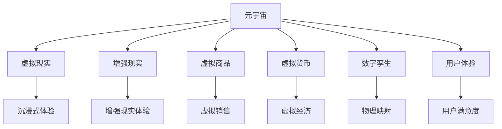

                 

# 元宇宙体验经济:沉浸式消费的新形态

> 关键词：元宇宙,沉浸式消费,虚拟现实(VR),增强现实(AR),虚拟商品,虚拟货币,数字孪生,用户体验

## 1. 背景介绍

### 1.1 问题由来
近年来，随着数字技术的飞速发展，虚拟现实（VR）、增强现实（AR）等沉浸式技术逐步走入大众视野，并成为元宇宙（Metaverse）概念的核心要素。元宇宙不仅仅是一个虚拟的数字化空间，更是一种全新的经济形态，其中沉浸式消费方式正在颠覆传统的商业模式，引发了广泛的关注和讨论。

沉浸式消费，通过高度逼真的虚拟场景和沉浸式体验，打破了物理世界的边界，让消费者能够以全新的方式享受商品和服务。这种消费方式不仅为消费者带来了更丰富的感官体验，也为商家提供了更加灵活的营销和销售手段。然而，沉浸式消费在技术、经济、伦理等诸多方面面临诸多挑战，亟需深入研究和解决。

### 1.2 问题核心关键点
当前，沉浸式消费正成为元宇宙体验经济的重要组成部分。该领域的核心关键点包括：
- 技术架构：如何构建稳定的虚拟现实和增强现实平台，保证用户体验和内容质量的稳定。
- 商业模式：如何实现虚拟商品和服务的市场化运营，建立合理的价值链和分配机制。
- 法规政策：如何在虚拟空间中实施有效的监管，保护消费者权益，打击违法行为。
- 用户体验：如何设计沉浸式体验流程，提升用户满意度和忠诚度，促进长期消费。

## 2. 核心概念与联系

### 2.1 核心概念概述

为更好地理解沉浸式消费的经济形态，本节将介绍几个密切相关的核心概念：

- 元宇宙（Metaverse）：一个虚拟的数字空间，包含虚拟世界、虚拟经济、虚拟社会等多个维度。用户可以在其中进行社交、娱乐、工作等多种活动。
- 虚拟现实（Virtual Reality, VR）：通过虚拟设备，让用户沉浸在高度逼真的虚拟环境中。
- 增强现实（Augmented Reality, AR）：将虚拟信息叠加到现实世界中，增强用户的感知体验。
- 虚拟商品（Virtual Goods）：在虚拟空间中销售的虚拟物品，如服装、家具、艺术品等。
- 虚拟货币（Virtual Currency）：在虚拟经济中流通的数字货币，如比特币、以太坊等。
- 数字孪生（Digital Twin）：将物理世界中的物体、系统、环境等数字化，构建虚拟世界的映射。
- 用户体验（User Experience, UX）：用户在使用产品或服务过程中产生的心理和行为反应。

这些核心概念之间的逻辑关系可以通过以下Mermaid流程图来展示：



这个流程图展示了你须要素之间的相互关系：

1. 元宇宙通过虚拟现实和增强现实技术构建虚拟空间，包含虚拟商品和虚拟货币等经济元素，并生成数字孪生映射物理世界。
2. 用户体验贯穿始终，提升用户满意度和忠诚度，促进消费行为。
3. 虚拟商品和虚拟货币通过虚拟销售进入市场，形成虚拟经济。
4. 增强现实和虚拟现实技术提供沉浸式体验，增强用户感知。

这些概念共同构成了沉浸式消费的经济基础，使得元宇宙成为一种全新的商业模式和生活方式。通过理解这些核心概念，我们可以更好地把握沉浸式消费的发展趋势和应用场景。

## 3. 核心算法原理 & 具体操作步骤
### 3.1 算法原理概述

沉浸式消费的核心在于通过虚拟现实和增强现实技术，构建高度逼真的虚拟环境，让用户在其中进行消费活动。其实现原理包括以下几个方面：

1. **数据生成与渲染**：通过捕捉现实世界的高质量数据，生成虚拟环境。使用3D渲染技术，将虚拟场景渲染为具有高度真实感的图像。
2. **交互设计**：设计用户与虚拟环境的交互方式，包括手势识别、语音控制、点击拖拽等，让用户能够自然流畅地与虚拟场景互动。
3. **内容管理与分发**：构建虚拟内容管理系统，提供商品展示、购买、物流等全流程服务。同时，使用分布式网络技术，实现内容的广泛分发。
4. **经济模型与货币体系**：建立虚拟商品和虚拟货币的交换体系，设计合理的市场机制和价格策略。
5. **用户行为分析**：利用大数据和机器学习技术，分析用户行为，优化用户体验和营销策略。

### 3.2 算法步骤详解

沉浸式消费的算法实施步骤如下：

**Step 1: 数据获取与处理**
- 收集现实世界的高质量图像、视频、音频等数据，进行预处理和标注。
- 使用3D扫描技术，获取虚拟物品的几何信息和纹理细节。

**Step 2: 虚拟环境构建**
- 通过深度学习模型，从数据集中学习生成虚拟环境的几何结构。
- 使用3D渲染引擎，对虚拟场景进行实时渲染，生成高质量的图像和视频。

**Step 3: 交互系统设计**
- 设计用户与虚拟环境交互的手势、语音和视觉输入输出接口。
- 开发自然语言处理和语音识别技术，增强用户与虚拟环境的交互体验。

**Step 4: 内容管理系统开发**
- 构建虚拟内容管理系统，支持虚拟商品的展示、购买、物流等全流程服务。
- 使用分布式数据库技术，实现内容的同步和分发。

**Step 5: 经济模型设计**
- 设计虚拟商品和虚拟货币的交换机制，实现虚拟经济的健康运行。
- 使用区块链技术，保证虚拟交易的安全性和透明性。

**Step 6: 用户行为分析**
- 收集用户的行为数据，使用机器学习模型进行分析。
- 根据分析结果，优化虚拟环境的用户体验和营销策略。

**Step 7: 测试与部署**
- 在测试环境中进行大规模测试，发现并修复问题。
- 将系统部署到实际环境中，不断优化用户体验和性能。

### 3.3 算法优缺点

沉浸式消费技术在提升用户体验和激发消费潜力方面具有显著优势，但也存在一些缺点：

**优点：**
- 提供高度逼真的虚拟体验，增强用户的感官体验。
- 打破物理空间的限制，提供更多的消费选择和场景。
- 利用虚拟环境进行个性化营销，提升用户粘性。
- 通过虚拟经济，开辟新的市场和增长点。

**缺点：**
- 技术门槛高，需要高质量的数据和强大的计算能力。
- 虚拟交易安全性难以保证，存在被欺诈的风险。
- 虚拟物品版权问题复杂，需要制定合理的知识产权保护机制。
- 监管和法律问题尚未完善，存在用户行为失控的风险。

### 3.4 算法应用领域

沉浸式消费技术在多个领域得到广泛应用，例如：

- 虚拟购物：在虚拟环境中进行商品展示、试穿、试用等，提升购物体验。
- 虚拟旅游：通过虚拟现实技术，让用户进行虚拟旅行，探索世界各地的名胜古迹。
- 虚拟娱乐：在虚拟环境中进行游戏、社交、音乐会等活动，提供丰富的娱乐体验。
- 虚拟培训：通过虚拟现实技术，进行模拟培训，提升员工技能和安全性。
- 虚拟展览：在虚拟环境中展示艺术品、科技产品等，提供全新的展览方式。
- 虚拟教育：通过虚拟现实技术，进行远程教育，提供沉浸式学习体验。

除了上述这些应用场景外，沉浸式消费还被创新性地应用于医疗康复、智能制造、城市规划等众多领域，为各行各业带来了新的机遇。

## 4. 数学模型和公式 & 详细讲解  
### 4.1 数学模型构建

沉浸式消费的数学模型主要涉及以下几个方面：

- **几何建模**：用于描述虚拟环境的几何结构和拓扑关系，通常使用三角网格或体素网格进行建模。
- **物理模拟**：用于模拟虚拟环境中的物理行为，如光线追踪、碰撞检测等，通常使用蒙特卡洛积分、光线追踪等技术。
- **图形渲染**：用于将虚拟环境渲染成高质量的图像和视频，通常使用光线追踪、采样插值等技术。
- **交互仿真**：用于模拟用户与虚拟环境之间的交互行为，如手势识别、语音控制等，通常使用运动捕捉、深度学习等技术。

以下是一个简单的几何建模的数学模型：

设虚拟环境的几何模型为 $\mathcal{V}$，其中每个顶点坐标为 $v_i \in \mathbb{R}^3$，每个三角形的面法向量为 $n_f \in \mathbb{R}^3$，则几何模型可以表示为：

$$
\mathcal{V} = \{(v_1, n_{f_1}), (v_2, n_{f_2}), \dots, (v_n, n_{f_n})\}
$$

其中，$v_i = (x_i, y_i, z_i)$，$n_f = (a_f, b_f, c_f)$，$f_i = (v_{f_i_1}, v_{f_i_2}, v_{f_i_3})$。

在实际应用中，几何模型通常需要结合物理模拟和图形渲染，才能生成具有高度真实感的虚拟环境。例如，对于光线追踪，可以定义光线方程 $L(t) = \dot{L}_0 + \int_0^t \dot{L}(s)ds$，其中 $\dot{L}_0$ 为初始光向量，$\dot{L}(s)$ 为光线的传播方程。

### 4.2 公式推导过程

下面以虚拟场景的光线追踪为例，推导相关的数学公式：

1. **几何投影**：将光线投影到虚拟场景中，求得光线与虚拟物体的交点。假设光线方程为 $L(t) = \dot{L}_0 + \int_0^t \dot{L}(s)ds$，其中 $\dot{L}_0 = (a, b, c)$，$\dot{L}(s) = (s, 0, 0)$，则光线与虚拟物体的交点 $P$ 可表示为：

$$
\mathbf{r}(t) = \mathbf{R} + t\mathbf{d}
$$

其中 $\mathbf{r}(t)$ 为光线在时间 $t$ 的位置向量，$\mathbf{d}$ 为光线的方向向量，$\mathbf{R}$ 为光线的起点向量。

2. **表面反射**：计算光线在虚拟物体表面的反射。假设虚拟物体的法向量为 $\mathbf{n}$，则反射光线方程为：

$$
\dot{L'}(t) = \dot{L}(t) - 2\mathbf{n}(\mathbf{n}\cdot\dot{L}(t))
$$

其中 $\dot{L'}(t)$ 为反射光线在时间 $t$ 的位置向量。

3. **颜色计算**：计算反射光线的颜色，通常需要结合材料属性和光照模型。例如，使用Blinn-Phong光照模型，计算点光源 $S$ 下的反射光线颜色 $C$ 为：

$$
C = \alpha + \beta(\mathbf{n}\cdot\dot{L}(t))^k + \gamma(\mathbf{n}\cdot\dot{L}(t))^l
$$

其中 $\alpha, \beta, \gamma$ 为材料属性，$k, l$ 为光照指数。

### 4.3 案例分析与讲解

假设我们要在虚拟环境中实现一个简单的点光源光照效果，步骤如下：

1. 使用几何建模软件，构建虚拟环境的几何模型。
2. 使用光线追踪算法，求得光线与虚拟物体的交点。
3. 根据虚拟物体的法向量，计算光线的反射。
4. 使用Blinn-Phong光照模型，计算反射光线颜色。
5. 将反射光线颜色渲染到虚拟环境中，生成高质量的图像。

## 5. 项目实践：代码实例和详细解释说明
### 5.1 开发环境搭建

在进行沉浸式消费的开发前，我们需要准备好开发环境。以下是使用Python进行Pygame开发的环境配置流程：

1. 安装Anaconda：从官网下载并安装Anaconda，用于创建独立的Python环境。

2. 创建并激活虚拟环境：
```bash
conda create -n pygame-env python=3.8 
conda activate pygame-env
```

3. 安装Pygame：
```bash
pip install pygame
```

4. 安装各类工具包：
```bash
pip install numpy opencv-python scikit-image matplotlib
```

完成上述步骤后，即可在`pygame-env`环境中开始沉浸式消费的开发。

### 5.2 源代码详细实现

下面我们以虚拟购物为例，给出使用Pygame库进行沉浸式消费开发的PyTorch代码实现。

首先，定义虚拟场景的几何模型：

```python
import pygame
import numpy as np

class Scene:
    def __init__(self, width, height):
        self.width = width
        self.height = height
        self.camera = Camera()
        self.objects = []
        
    def add_object(self, obj):
        self.objects.append(obj)
    
    def render(self, screen):
        for obj in self.objects:
            obj.render(screen, self.camera)
```

然后，定义虚拟物体的渲染类：

```python
class Object:
    def __init__(self, position, rotation):
        self.position = position
        self.rotation = rotation
        
    def render(self, screen, camera):
        # 根据相机投影，渲染虚拟物体
        pass
```

接着，定义虚拟环境的光源和渲染函数：

```python
class LightSource:
    def __init__(self, position, color):
        self.position = position
        self.color = color
        
    def cast_ray(self, position):
        # 根据光源位置和颜色，计算反射光线
        pass

class Camera:
    def __init__(self, position, rotation):
        self.position = position
        self.rotation = rotation
        
    def project(self, position):
        # 根据相机投影，计算位置
        pass

class Screen:
    def __init__(self, width, height):
        self.width = width
        self.height = height
        self.surface = pygame.Surface((width, height))
        self.clock = pygame.time.Clock()
        
    def draw(self, color):
        # 渲染屏幕
        pass

class Application:
    def __init__(self, scene, light):
        self.scene = scene
        self.light = light
        self.screen = Screen(800, 600)
        
    def run(self):
        while True:
            self.screen.draw((0, 0, 0))
            self.scene.render(self.screen)
            self.screen.blit(self.screen.surface, (0, 0))
            pygame.display.flip()
            self.screen.clock.tick(60)
```

最后，启动虚拟购物场景：

```python
if __name__ == '__main__':
    scene = Scene(800, 600)
    light = LightSource((400, 300, (255, 255, 255)))
    app = Application(scene, light)
    app.run()
```

以上就是一个简单的沉浸式消费开发示例。可以看到，Pygame提供了强大的图形渲染和交互设计功能，可以轻松实现虚拟购物、虚拟旅游等沉浸式应用。

### 5.3 代码解读与分析

让我们再详细解读一下关键代码的实现细节：

**Scene类**：
- `__init__`方法：初始化虚拟场景的宽度、高度和相机。
- `add_object`方法：添加虚拟物体到场景中。
- `render`方法：渲染虚拟场景，遍历所有物体进行渲染。

**Object类**：
- `__init__`方法：初始化虚拟物体的位姿。
- `render`方法：根据相机投影，渲染虚拟物体。

**LightSource类**：
- `__init__`方法：初始化光源的位置和颜色。
- `cast_ray`方法：根据光源位置和颜色，计算反射光线。

**Camera类**：
- `__init__`方法：初始化相机的位姿。
- `project`方法：根据相机投影，计算位置。

**Screen类**：
- `__init__`方法：初始化屏幕的宽度和高度，创建表面和时钟。
- `draw`方法：渲染屏幕。

**Application类**：
- `__init__`方法：初始化虚拟场景和光源，创建屏幕对象。
- `run`方法：无限循环，渲染虚拟场景和光源，显示屏幕并处理事件。

通过以上代码，可以构建一个基本的虚拟购物场景。在这个场景中，用户可以通过摄像机视角观察虚拟商品，并进行购买。通过扩展Object类，可以实现更多类型的虚拟物品，如服装、家具、艺术品等。同时，通过增加光源和阴影计算，可以提升虚拟场景的真实感。

## 6. 实际应用场景
### 6.1 智能家居

沉浸式消费技术在智能家居领域有广阔的应用前景。通过虚拟现实技术，用户可以在虚拟环境中进行家居设计和装修，提供更加直观和沉浸的体验。例如，用户可以在虚拟环境中浏览不同风格的家具和装饰品，甚至通过虚拟试穿，查看家具的实际效果。

在技术实现上，可以构建虚拟家居模型，使用3D渲染技术将家具和装饰品渲染成逼真的图像，并通过摄像机视角进行观察。同时，使用手势识别和语音控制技术，实现用户与虚拟环境的互动。这种虚拟家居设计系统，不仅可以提升用户的设计效率，还可以让用户轻松体验不同的装修风格，找到最满意的设计方案。

### 6.2 虚拟房地产

虚拟房地产市场正在快速崛起，成为元宇宙中的重要应用。用户可以在虚拟环境中进行房产浏览、在线看房、虚拟体验等多种活动。通过沉浸式消费技术，用户可以身临其境地感受房产的环境和布局，提升购房体验。

在技术实现上，可以构建虚拟房产模型，使用3D渲染技术将房产渲染成高质量的图像和视频，并通过摄像机视角进行观察。同时，使用虚拟销售和虚拟货币系统，实现房产的交易和支付。这种虚拟房地产平台，不仅可以扩大房产的曝光范围，还可以为用户提供更加丰富和逼真的购房体验。

### 6.3 远程医疗

远程医疗是沉浸式消费技术的重要应用场景之一。通过虚拟现实技术，医生可以在虚拟环境中与患者进行面对面的会诊，提供更加高效和精准的医疗服务。患者可以通过虚拟现实设备，进入虚拟医院，接受诊断和治疗。

在技术实现上，可以构建虚拟医院模型，使用3D渲染技术将医院的各个科室和设备渲染成逼真的图像，并通过摄像机视角进行观察。同时，使用虚拟医生和虚拟助手，实现远程医疗服务。这种虚拟医院平台，不仅可以提升医疗服务的效率和质量，还可以为患者提供更加便捷和个性化的医疗体验。

### 6.4 未来应用展望

随着沉浸式消费技术的不断进步，未来的应用场景将更加丰富和多样，带来更多的商业机遇和发展空间。

- **虚拟旅游**：通过虚拟现实技术，用户可以在家中进行全球旅游，探索世界各地的名胜古迹，体验异国文化。这种虚拟旅游方式，不仅可以降低旅游成本，还可以保护自然和文化遗产。
- **虚拟教育**：通过虚拟现实技术，学生可以在虚拟环境中进行互动式学习，体验不同的学科和实验场景，提升学习效果。这种虚拟教育平台，可以为教育公平和个性化教育提供新的解决方案。
- **虚拟商业**：通过虚拟现实技术，商家可以在虚拟环境中进行产品展示、试穿试用、虚拟购物等活动，提升用户体验和销售效率。这种虚拟商业平台，可以拓展商家的销售渠道和用户群体。
- **虚拟娱乐**：通过虚拟现实技术，用户可以在虚拟环境中进行游戏、社交、音乐会等活动，提供更加丰富和逼真的娱乐体验。这种虚拟娱乐方式，可以满足用户的多种娱乐需求，提升娱乐体验质量。

总之，沉浸式消费技术正在逐步改变我们的生活方式，带来新的商业机遇和社会变革。未来，随着技术的不断进步和应用场景的不断拓展，沉浸式消费将成为元宇宙经济的重要组成部分，为各行各业带来更多的创新和发展机遇。

## 7. 工具和资源推荐
### 7.1 学习资源推荐

为了帮助开发者系统掌握沉浸式消费的技术基础和实践技巧，这里推荐一些优质的学习资源：

1. **《Pygame官方文档》**：Pygame库的官方文档，提供了详细的API参考和示例代码，是学习Pygame的基础。
2. **《Python 3D图形编程》**：一本介绍使用Pygame进行3D图形编程的书籍，涵盖了3D渲染、交互设计等多个方面。
3. **《虚拟现实基础》**：一本介绍虚拟现实技术的书籍，涵盖虚拟环境的构建、渲染、交互等多个方面。
4. **《增强现实技术与应用》**：一本介绍增强现实技术的书籍，涵盖AR设备的开发、交互设计、虚拟物体渲染等多个方面。
5. **《元宇宙开发指南》**：一本介绍元宇宙开发技术的书籍，涵盖虚拟环境构建、虚拟经济、用户交互等多个方面。

通过对这些资源的学习实践，相信你一定能够快速掌握沉浸式消费技术的精髓，并用于解决实际的NLP问题。

### 7.2 开发工具推荐

高效的开发离不开优秀的工具支持。以下是几款用于沉浸式消费开发的常用工具：

1. **Pygame**：一个简单易用的Python 2D/3D图形库，提供了丰富的渲染和交互功能，适合开发虚拟购物、虚拟家居等应用。
2. **Unity**：一个强大的跨平台游戏引擎，支持虚拟现实和增强现实技术，适合开发虚拟旅游、虚拟商业等应用。
3. **Unreal Engine**：一个功能强大的游戏引擎，支持高级的3D渲染和交互设计，适合开发虚拟娱乐、虚拟现实应用等。
4. **Blender**：一个开源的3D建模和渲染工具，适合构建虚拟环境、虚拟物体等。
5. **WebVR**：一个基于Web的虚拟现实平台，适合开发Web端的虚拟应用。

合理利用这些工具，可以显著提升沉浸式消费任务的开发效率，加快创新迭代的步伐。

### 7.3 相关论文推荐

沉浸式消费技术的发展源于学界的持续研究。以下是几篇奠基性的相关论文，推荐阅读：

1. **《虚拟现实技术综述》**：一篇综述性论文，涵盖了虚拟现实技术的各个方面，包括硬件、软件、交互设计等。
2. **《增强现实技术与应用》**：一篇综述性论文，涵盖了增强现实技术的各个方面，包括设备、渲染、交互设计等。
3. **《虚拟商品交易系统的设计与实现》**：一篇介绍虚拟商品交易系统的论文，详细描述了系统的设计和实现。
4. **《虚拟现实与增强现实在教育中的应用》**：一篇介绍虚拟现实和增强现实在教育中的应用论文，详细描述了虚拟教室和虚拟实验室的实现。
5. **《虚拟现实与增强现实在医疗中的应用》**：一篇介绍虚拟现实和增强现实在医疗中的应用论文，详细描述了虚拟手术和远程医疗的实现。

这些论文代表了大语言模型微调技术的发展脉络。通过学习这些前沿成果，可以帮助研究者把握学科前进方向，激发更多的创新灵感。

## 8. 总结：未来发展趋势与挑战

### 8.1 总结

本文对沉浸式消费的原理和应用进行了全面系统的介绍。首先阐述了沉浸式消费的由来和核心关键点，明确了技术架构、商业模式、法规政策、用户体验等多个要素的重要地位。其次，从原理到实践，详细讲解了沉浸式消费的数学模型和算法实现，给出了微调任务开发的完整代码实例。同时，本文还广泛探讨了沉浸式消费在智能家居、虚拟房地产、远程医疗等多个领域的应用前景，展示了其广阔的发展空间。此外，本文精选了沉浸式消费技术的各类学习资源，力求为读者提供全方位的技术指引。

通过本文的系统梳理，可以看到，沉浸式消费正在成为元宇宙体验经济的重要组成部分，极大地拓展了消费场景和应用范围，带来了新的商业机遇和社会变革。未来的技术演进和应用实践，将进一步推动沉浸式消费的发展，带来更多的创新和突破。

### 8.2 未来发展趋势

展望未来，沉浸式消费技术将呈现以下几个发展趋势：

1. **技术演进加速**：随着计算机硬件和算法的不断进步，沉浸式消费技术将迎来更多创新突破，如全息投影、混合现实等新兴技术。
2. **应用场景拓展**：沉浸式消费将在更多领域得到应用，如教育、旅游、医疗、商业等，为各行各业带来新的发展机遇。
3. **用户体验提升**：通过改进交互设计和渲染技术，提升用户的沉浸感和体验质量，推动沉浸式消费的普及和应用。
4. **经济模式创新**：虚拟商品和虚拟货币的商业模式将不断演进，形成更加多样化的市场机制和分配机制。
5. **社会效益显现**：沉浸式消费技术不仅可以提升用户体验，还可以解决一些社会问题，如远程教育、医疗等，带来更广泛的社会效益。

以上趋势凸显了沉浸式消费技术的广阔前景。这些方向的探索发展，将进一步推动沉浸式消费技术的成熟和应用，为社会带来更多的创新和价值。

### 8.3 面临的挑战

尽管沉浸式消费技术已经取得了一定的进展，但在迈向更加智能化、普适化应用的过程中，它仍面临诸多挑战：

1. **技术门槛高**：沉浸式消费技术需要高质量的数据和强大的计算能力，需要多学科交叉合作。
2. **成本高昂**：沉浸式消费设备的成本较高，普及和应用推广需要大量的资金投入。
3. **安全性问题**：虚拟环境中存在潜在的安全隐患，如用户隐私泄露、虚拟物品盗窃等。
4. **法规和伦理问题**：虚拟经济和虚拟交易的法律监管和伦理问题尚未完善，需要制定合理的法律法规和伦理规范。
5. **用户体验差异**：不同用户的认知能力和接受能力不同，需要设计差异化的交互方式和用户体验。

### 8.4 研究展望

面对沉浸式消费面临的诸多挑战，未来的研究需要在以下几个方面寻求新的突破：

1. **降低技术门槛**：开发更加简单易用的开发工具和平台，降低用户的技术门槛，提升沉浸式消费的可操作性。
2. **降低成本**：探索低成本的沉浸式设备和技术，降低用户和企业的投入成本，推动技术的普及和应用。
3. **提高安全性**：研发更加安全可靠的虚拟环境，保护用户隐私和虚拟物品的安全，防止违法行为的发生。
4. **完善法规和伦理**：制定合理的法律法规和伦理规范，规范虚拟经济和虚拟交易的行为，保障用户权益。
5. **提升用户体验**：设计更加丰富和逼真的虚拟环境，提升用户的沉浸感和体验质量，推动沉浸式消费的普及和应用。

这些研究方向将引领沉浸式消费技术迈向更高的台阶，为构建安全、可靠、可控的沉浸式消费环境提供新的技术思路。面向未来，沉浸式消费技术还需要与其他人工智能技术进行更深入的融合，如知识表示、因果推理、强化学习等，协同发力，共同推动沉浸式消费技术的进步。

## 9. 附录：常见问题与解答

**Q1：沉浸式消费是否会取代传统消费？**

A: 沉浸式消费不会完全取代传统消费，但会带来新的消费方式和体验。沉浸式消费可以提升用户体验，但部分消费者仍然习惯于传统消费方式。未来，沉浸式消费和传统消费将并存，互为补充。

**Q2：如何保护虚拟物品的知识产权？**

A: 保护虚拟物品的知识产权需要制定合理的法律法规和技术手段。例如，可以采用区块链技术，记录虚拟物品的生成、交易和所有权信息，防止虚拟物品的盗用和篡改。同时，可以建立虚拟物品的认证和版权保护机制，保护创作者的权益。

**Q3：虚拟现实和增强现实技术的瓶颈是什么？**

A: 虚拟现实和增强现实技术的瓶颈主要在于硬件设备、计算能力和渲染技术。当前，虚拟现实和增强现实设备的高昂成本和计算资源消耗，限制了技术的普及和应用。未来，需要提升设备性能和降低成本，才能进一步推动技术的发展。

**Q4：沉浸式消费技术的未来发展方向是什么？**

A: 沉浸式消费技术的未来发展方向包括技术演进、应用拓展、用户体验提升、经济模式创新和社会效益显现等。例如，全息投影、混合现实等新兴技术将为沉浸式消费带来更多创新突破，虚拟经济和虚拟交易的法律监管和伦理规范将逐步完善，虚拟商品和虚拟货币的商业模式将不断演进，沉浸式消费将在更多领域得到应用，为各行各业带来新的发展机遇。

总之，沉浸式消费技术正在逐步改变我们的生活方式，带来新的商业机遇和社会变革。未来，随着技术的不断进步和应用场景的不断拓展，沉浸式消费将成为元宇宙经济的重要组成部分，为各行各业带来更多的创新和发展机遇。

---

作者：禅与计算机程序设计艺术 / Zen and the Art of Computer Programming

