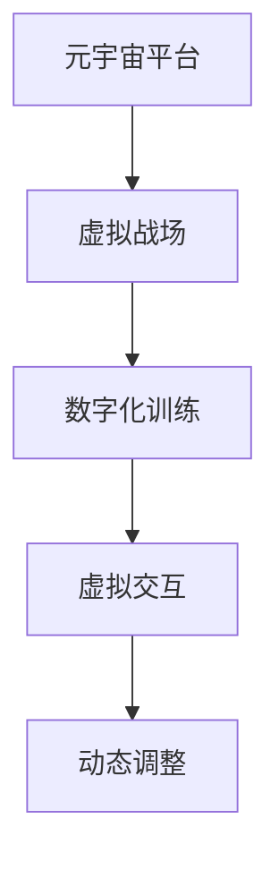

                 

## 1. 背景介绍

### 1.1 问题由来

在数字化的时代背景下，军事战略和战术面临着前所未有的变革。传统战争中的物理对抗正逐步向信息对抗过渡，而元宇宙技术的发展则为军事演练提供了全新的平台。元宇宙军事不仅拓展了军事训练的广度和深度，还为研究数字化战争提供了丰富的实验环境。

### 1.2 问题核心关键点

元宇宙军事的核心在于将元宇宙技术与军事训练相结合，构建虚拟化的战争场景和战术演练平台。通过这种虚拟环境，可以在不耗费实体资源的情况下，反复演练各种军事策略和战术，为实际战场准备提供数据支持。

元宇宙军事涉及的关键点包括：

- **元宇宙平台**：构建虚拟战争场景，用于仿真训练和战略推演。
- **数字化训练**：利用虚拟战场进行各种实战演练，提升部队的战斗技能和战术素养。
- **虚拟交互**：通过虚拟环境实现部队间的协同作战和指挥控制。
- **动态调整**：实时调整战场环境，模拟敌方战术变化，提高部队的应变能力。

这些关键点构成了元宇宙军事的基本框架，为军事数字化转型提供了新路径。

### 1.3 问题研究意义

元宇宙军事的研究具有重大战略意义：

1. **提高训练效率**：通过虚拟场景模拟实战，可以大幅提高训练效率，减少实体资源消耗。
2. **优化决策机制**：在虚拟环境中进行战术推演，可以优化指挥决策机制，提高实战反应速度。
3. **增强实战能力**：虚拟训练能够提供多样化的实战场景，提升部队的实战能力。
4. **减少伤亡风险**：通过虚拟训练，可以避免实体训练中的伤亡风险，确保参训人员的安全。
5. **促进技术创新**：元宇宙军事的研发促进了虚拟现实、人工智能、云计算等多项技术的融合发展。

## 2. 核心概念与联系

### 2.1 核心概念概述

元宇宙军事是一个集成了虚拟现实技术、军事科学和人工智能的综合体系。其核心概念包括：

- **元宇宙**：一个由虚拟和现实相结合的空间，提供高度沉浸式的用户体验。
- **虚拟战场**：通过虚拟现实技术构建的战争场景，用于军事演练和战术推演。
- **数字化训练**：利用数字化手段进行军事训练，实现训练的虚拟化和智能化。
- **虚拟交互**：在虚拟环境中进行部队间的协同作战，提高指挥控制效率。
- **动态调整**：根据敌方战术变化，实时调整虚拟战场环境，提升部队的适应性。

这些概念之间相互联系，共同构成了元宇宙军事的完整体系。

### 2.2 核心概念原理和架构的 Mermaid 流程图



这个流程图展示了元宇宙军事的各核心概念之间的联系：元宇宙平台构建了虚拟战场，数字化训练利用虚拟战场进行实战演练，虚拟交互在虚拟环境中实现部队协同，动态调整则根据敌方变化实时调整战场环境。

## 3. 核心算法原理 & 具体操作步骤

### 3.1 算法原理概述

元宇宙军事的核心算法原理基于虚拟现实技术、机器学习算法和优化理论。其核心思想是：

- **虚拟现实**：通过虚拟现实技术构建逼真的战场环境，实现对实际战争场景的模拟。
- **机器学习**：利用机器学习算法，对历史战争数据进行分析和预测，提升战术推演的精准度。
- **优化理论**：通过优化算法，调整虚拟战场中的各种参数，实现战术演练的动态化。

这些技术的融合，使得元宇宙军事能够在虚拟环境中进行高效的战术演练和战略推演，为实际战争提供有价值的参考。

### 3.2 算法步骤详解

元宇宙军事的算法步骤大致如下：

1. **虚拟战场构建**：利用虚拟现实技术，根据历史战争数据构建逼真的虚拟战场。
2. **历史数据分析**：对历史战争数据进行清洗和预处理，提取有价值的信息。
3. **模型训练**：使用机器学习算法，训练模型进行战术推演和预测。
4. **战术演练**：在虚拟战场上进行实战演练，收集数据进行模型优化。
5. **动态调整**：根据敌方战术变化，实时调整虚拟战场环境，提高部队的适应性。

### 3.3 算法优缺点

元宇宙军事算法具有以下优点：

- **高效训练**：虚拟训练能够大幅提高训练效率，减少实体资源消耗。
- **精准推演**：机器学习算法能够提供精准的战术推演结果，为决策提供依据。
- **动态适应**：实时动态调整战场环境，提升部队的应变能力。

同时，元宇宙军事算法也存在以下缺点：

- **技术门槛高**：需要高度集成的技术体系，对技术实现要求高。
- **数据依赖强**：历史战争数据的质量直接影响推演结果的准确性。
- **安全风险**：虚拟环境中的数据可能被泄露或篡改，存在安全隐患。

### 3.4 算法应用领域

元宇宙军事技术可以应用于以下领域：

- **军事教育训练**：通过虚拟战场进行军事教育，提高参训人员的实战能力。
- **战略推演研究**：进行军事战略和战术的虚拟推演，提升决策的科学性和合理性。
- **战术对抗演练**：模拟敌方战术变化，进行部队的战术对抗演练，提升部队的战术素养。
- **装备测试评估**：在虚拟环境中测试装备性能，优化武器装备的配置和应用。
- **指挥控制训练**：提高部队指挥控制的效率和效果，优化指挥控制机制。

## 4. 数学模型和公式 & 详细讲解 & 举例说明

### 4.1 数学模型构建

元宇宙军事的数学模型主要包括以下几个方面：

- **空间坐标模型**：用于构建虚拟战场，描述战场中各元素的位置关系。
- **时间动态模型**：用于模拟战场环境的动态变化，描述战场随时间演变的规律。
- **战术推演模型**：用于进行战术推演，描述敌我双方在虚拟战场上的策略和行动。
- **优化目标函数**：用于优化虚拟战场中的各种参数，提升战术演练的效果。

### 4.2 公式推导过程

以战术推演模型为例，假设敌我双方在虚拟战场上的行动轨迹为$(x_1,y_1), (x_2,y_2)$，行动时间为$t$，则战术推演的目标函数为：

$$
f(x_1,y_1,t;x_2,y_2,t) = \sum_{i=1}^N \alpha_i (1-\delta) + \sum_{j=1}^M \beta_j \delta
$$

其中，$\alpha_i$为敌方胜利的概率，$\beta_j$为我方胜利的概率，$\delta$为决策的满意度，即在当前时间点上成功实现战术目标的概率。

### 4.3 案例分析与讲解

假设在虚拟战场上，敌我双方进行了一次突袭和反突袭演练。通过历史数据分析，发现敌方的突袭路径为$(x_1,y_1)$，我方的反突袭路径为$(x_2,y_2)$，行动时间为$t$。模型预测敌方胜利的概率为$\alpha_i=0.6$，我方胜利的概率为$\beta_j=0.4$，决策的满意度为$\delta=0.9$。则战术推演的目标函数为：

$$
f(x_1,y_1,t;x_2,y_2,t) = 0.6(1-0.9) + 0.4 \times 0.9 = 0.6
$$

根据目标函数值，可以判断当前战术方案是可行的，但需要进行微调。通过进一步优化敌方突袭路径和我方反突袭路径，可以提升决策满意度，优化战术演练效果。

## 5. 项目实践：代码实例和详细解释说明

### 5.1 开发环境搭建

开发元宇宙军事应用，需要以下开发环境：

1. **虚拟现实设备**：如VR头显、手柄等，用于构建虚拟战场。
2. **计算机硬件**：高性能PC或服务器，支持虚拟现实技术和大规模数据处理。
3. **开发工具**：如Unity3D、Unreal Engine等，用于构建虚拟战场和模拟战场环境。
4. **机器学习工具**：如TensorFlow、PyTorch等，用于训练战术推演模型。

### 5.2 源代码详细实现

以下是一个简化的元宇宙军事训练平台代码实现：

```python
# 导入相关库
import numpy as np
from unity3d import UnityEnvironment

# 定义虚拟战场构建函数
def build_virtual_battle():
    # 创建Unity环境
    env = UnityEnvironment.open('path/to/unity/project')
    # 获取虚拟战场场景
    scene = env.academy.atomica
    # 创建虚拟战场元素
    x = np.array([0, 0])
    y = np.array([0, 0])
    # 返回虚拟战场元素
    return x, y

# 定义历史数据分析函数
def analyze_historical_data():
    # 读取历史战争数据
    data = np.loadtxt('path/to/historical_data.csv')
    # 清洗和预处理数据
    cleaned_data = data[np.sum(data, axis=1) > threshold]
    # 提取有价值的信息
    features = cleaned_data[:, :-1]
    labels = cleaned_data[:, -1]
    # 返回处理后的数据
    return features, labels

# 定义模型训练函数
def train_model(features, labels):
    # 构建模型
    model = build_model(features.shape[1])
    # 训练模型
    for epoch in range(num_epochs):
        model.fit(features, labels)
    # 返回训练好的模型
    return model

# 定义战术演练函数
def conduct_tactical_exercise(model, x1, y1, x2, y2):
    # 创建虚拟战场环境
    env = UnityEnvironment.open('path/to/unity/project')
    # 设置敌我行动轨迹
    env.set_enemy_path(x1, y1)
    env.set_ally_path(x2, y2)
    # 进行战术推演
    results = model.predict(x1, y1, x2, y2, t)
    # 返回推演结果
    return results

# 定义动态调整函数
def adjust_dynamic_env(results, env):
    # 根据推演结果调整战场环境
    if results == 1:
        # 敌方胜利，调整敌方行动轨迹
        env.set_enemy_path(x1, y1)
    else:
        # 我方胜利，调整我方行动轨迹
        env.set_ally_path(x2, y2)
    # 返回调整后的战场环境
    return env
```

### 5.3 代码解读与分析

上述代码实现了元宇宙军事平台的基本功能，包括虚拟战场构建、历史数据分析、模型训练、战术演练和动态调整。

- **虚拟战场构建函数**：使用Unity环境创建虚拟战场，设置敌我双方的行动轨迹。
- **历史数据分析函数**：读取历史战争数据，清洗和预处理数据，提取有价值的信息。
- **模型训练函数**：构建模型，使用历史数据训练模型。
- **战术演练函数**：使用训练好的模型进行战术推演，预测胜负。
- **动态调整函数**：根据战术推演结果，动态调整战场环境，优化战术演练效果。

## 6. 实际应用场景

### 6.1 军事教育训练

在军事教育训练中，元宇宙军事平台可以用于以下场景：

- **战术演练**：在虚拟战场上进行各种战术演练，提高参训人员的实战能力。
- **装备测试**：在虚拟环境中测试武器装备的性能，优化装备配置和应用。
- **指挥控制训练**：提高部队指挥控制的效率和效果，优化指挥控制机制。

### 6.2 战略推演研究

在战略推演研究中，元宇宙军事平台可以用于以下场景：

- **历史推演**：通过虚拟战场进行历史战争的推演，分析战争的成败得失。
- **未来预测**：利用历史数据和机器学习算法，预测未来战争的发展趋势。
- **决策优化**：在虚拟环境中进行多种决策方案的模拟，选择最优方案。

### 6.3 战术对抗演练

在战术对抗演练中，元宇宙军事平台可以用于以下场景：

- **敌方模拟**：模拟敌方各种战术，提高部队的应变能力和反制能力。
- **多兵种协同**：实现不同兵种的协同作战，提升部队的整体战斗力。
- **战术创新**：通过虚拟训练，探索新的战术和战法，提升部队的创新能力。

### 6.4 未来应用展望

元宇宙军事技术的发展前景广阔，未来将向以下方向演进：

- **全场景模拟**：构建全场景虚拟战场，模拟各种战争环境和战术。
- **多模态融合**：融合虚拟现实、增强现实、人工智能等多种技术，提供更沉浸式的训练体验。
- **智能决策**：利用机器学习和深度学习技术，实现智能决策和智能指挥。
- **跨平台协作**：支持多平台、多设备协同训练，提升训练的灵活性和便捷性。
- **实时动态调整**：实现实时动态调整战场环境，提高部队的应变能力和实战能力。

## 7. 工具和资源推荐

### 7.1 学习资源推荐

为了帮助开发者系统掌握元宇宙军事技术，这里推荐一些优质的学习资源：

1. **《元宇宙战争：未来战争新形态》**：系统介绍元宇宙军事技术及其应用，适合军事领域从业人员阅读。
2. **《虚拟现实技术与应用》**：详细介绍虚拟现实技术的基本原理和应用场景，适合技术从业人员阅读。
3. **《人工智能与军事》**：探讨人工智能在军事领域的应用，适合军事、技术领域从业人员阅读。
4. **Unity官方文档**：Unity3D官方文档，提供详细的虚拟现实开发教程和工具支持。
5. **Unreal Engine官方文档**：Unreal Engine官方文档，提供详细的虚拟现实开发教程和工具支持。

通过对这些资源的学习实践，相信你一定能够快速掌握元宇宙军事技术，并用于解决实际的军事问题。

### 7.2 开发工具推荐

元宇宙军事开发需要以下工具：

1. **Unity3D**：适用于虚拟现实场景的构建和开发。
2. **Unreal Engine**：适用于虚拟现实场景的构建和开发。
3. **TensorFlow**：用于机器学习和深度学习的实现。
4. **PyTorch**：用于机器学习和深度学习的实现。
5. **Weights & Biases**：用于模型训练和实验跟踪的工具。
6. **TensorBoard**：用于模型训练和实验跟踪的可视化工具。

合理利用这些工具，可以显著提升元宇宙军事平台的开发效率，加快创新迭代的步伐。

### 7.3 相关论文推荐

元宇宙军事技术的研究源于学界的持续探索。以下是几篇奠基性的相关论文，推荐阅读：

1. **《元宇宙技术在军事训练中的应用研究》**：系统探讨元宇宙技术在军事训练中的应用，为军事数字化转型提供参考。
2. **《虚拟现实技术在军事训练中的研究与应用》**：介绍虚拟现实技术在军事训练中的实现方法和应用效果。
3. **《人工智能与未来战争》**：探讨人工智能在战争中的应用，为军事智能化发展提供理论支持。
4. **《全场景虚拟战场的设计与实现》**：系统介绍全场景虚拟战场的设计方法和实现技术。
5. **《多模态融合在军事训练中的应用》**：探讨多模态融合技术在军事训练中的应用，提升训练效果和实战能力。

这些论文代表了大规模元宇宙军事技术的研究脉络。通过学习这些前沿成果，可以帮助研究者把握学科前进方向，激发更多的创新灵感。

## 8. 总结：未来发展趋势与挑战

### 8.1 总结

本文对元宇宙军事技术进行了全面系统的介绍。首先阐述了元宇宙军事技术的研究背景和意义，明确了元宇宙技术在军事训练和战略推演中的重要价值。其次，从原理到实践，详细讲解了元宇宙军事的数学模型和关键步骤，给出了元宇宙军事平台开发的完整代码实例。同时，本文还广泛探讨了元宇宙军事在军事教育训练、战略推演研究、战术对抗演练等多个领域的应用前景，展示了元宇宙军事技术的巨大潜力。此外，本文精选了元宇宙军事技术的各类学习资源，力求为读者提供全方位的技术指引。

通过本文的系统梳理，可以看到，元宇宙军事技术在军事训练和战略推演中的应用前景广阔，有望显著提升部队的实战能力和指挥决策水平。未来，伴随技术的发展和应用的深入，元宇宙军事技术必将为军事数字化转型提供强大的技术支撑。

### 8.2 未来发展趋势

元宇宙军事技术的发展趋势如下：

1. **技术融合**：融合虚拟现实、人工智能、云计算等多种技术，提供更沉浸式的训练体验。
2. **智能决策**：利用机器学习和深度学习技术，实现智能决策和智能指挥。
3. **全场景模拟**：构建全场景虚拟战场，模拟各种战争环境和战术。
4. **多兵种协同**：实现不同兵种的协同作战，提升部队的整体战斗力。
5. **实时动态调整**：实现实时动态调整战场环境，提高部队的应变能力和实战能力。

以上趋势凸显了元宇宙军事技术的广阔前景。这些方向的探索发展，必将进一步提升军事数字化训练的效果和效率，为未来战争的智能化提供强有力的技术支持。

### 8.3 面临的挑战

尽管元宇宙军事技术已经取得了初步成果，但在迈向更加智能化、普适化应用的过程中，仍面临诸多挑战：

1. **技术实现复杂**：元宇宙军事技术需要高度集成的技术体系，对技术实现要求高。
2. **数据依赖性强**：历史战争数据的质量直接影响推演结果的准确性。
3. **安全风险高**：虚拟环境中的数据可能被泄露或篡改，存在安全隐患。
4. **实时性要求高**：虚拟战场中实时动态调整的要求，对计算能力和网络带宽有较高要求。
5. **人员培训需求大**：元宇宙军事技术的应用，需要大量具备相关技能的技术人员和军事人员。

这些挑战需要研究者不断探索和攻克，才能将元宇宙军事技术推向更高的台阶。

### 8.4 研究展望

未来，元宇宙军事技术的研究方向包括：

1. **技术创新**：研发更加高效、灵活、安全的元宇宙军事技术。
2. **数据治理**：构建数据治理体系，确保历史战争数据的质量和安全性。
3. **跨平台协作**：支持多平台、多设备协同训练，提升训练的灵活性和便捷性。
4. **智能决策优化**：利用深度学习和强化学习技术，优化智能决策和智能指挥。
5. **用户体验提升**：提升虚拟战场的用户体验，提高训练效果和用户满意度。

这些研究方向的探索，必将引领元宇宙军事技术迈向更高的台阶，为军事数字化转型提供强大的技术支撑。总之，元宇宙军事技术需要在技术实现、数据治理、用户体验等多个维度进行全面优化，才能真正实现其军事训练和战略推演的价值。

## 9. 附录：常见问题与解答

**Q1：元宇宙军事是否适用于所有军事任务？**

A: 元宇宙军事技术在大多数军事任务上都能取得较好的效果，特别是对于需要大量训练的场景。但对于一些需要实体资源进行实战验证的任务，如装备测试、战场模拟等，仍需结合实体资源进行综合评估。

**Q2：如何选择合适的虚拟现实设备？**

A: 选择虚拟现实设备时，需要考虑设备的分辨率、刷新率、沉浸感等因素。一般来说，高分辨率、高刷新率的设备能够提供更沉浸的体验。同时，设备的价格和维护成本也需要综合考虑。

**Q3：元宇宙军事训练平台需要哪些技术支持？**

A: 元宇宙军事训练平台需要以下技术支持：

1. 虚拟现实技术：构建逼真的虚拟战场。
2. 机器学习技术：进行战术推演和预测。
3. 动态调整技术：实时调整战场环境，提高部队的适应性。
4. 多模态融合技术：融合视觉、听觉等多种感官数据，提升训练效果。
5. 人工智能技术：实现智能决策和智能指挥。

**Q4：元宇宙军事训练平台面临哪些安全风险？**

A: 元宇宙军事训练平台面临以下安全风险：

1. 数据泄露：虚拟环境中的数据可能被泄露或篡改。
2. 网络攻击：平台可能遭受DDoS等网络攻击，影响训练效果。
3. 身份验证：需要确保参训人员的身份验证，防止非法访问。
4. 系统备份：需要定期备份训练数据和模型，防止数据丢失。
5. 安全防护：采用访问鉴权、数据脱敏等措施，保障数据和模型安全。

这些安全风险需要研究者不断探索和应对，确保元宇宙军事训练平台的安全稳定。

**Q5：元宇宙军事训练平台如何评估训练效果？**

A: 元宇宙军事训练平台可以通过以下方式评估训练效果：

1. 实战演练：在虚拟战场中进行实战演练，评估参训人员的实战能力。
2. 战术推演：利用机器学习模型进行战术推演，评估战术方案的效果。
3. 数据反馈：收集历史数据和训练结果，进行分析和优化，提升训练效果。
4. 用户体验：收集参训人员的反馈，优化虚拟战场的用户体验。
5. 效果评估：结合实战演练和战术推演结果，综合评估训练效果。

通过这些评估方式，可以全面了解元宇宙军事训练平台的效果，优化训练方案。

---

作者：禅与计算机程序设计艺术 / Zen and the Art of Computer Programming

