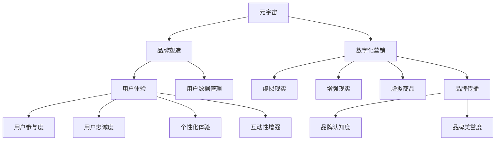

                 

# 元宇宙品牌塑造:数字化营销的新战场

> 关键词：元宇宙,品牌塑造,数字化营销,虚拟现实,品牌形象,用户体验,虚拟社交,虚拟商品,品牌传播,元宇宙平台

## 1. 背景介绍

### 1.1 问题由来

随着数字技术的不断进步，虚拟现实（VR）、增强现实（AR）和区块链等技术逐渐成熟，元宇宙（Metaverse）的概念应运而生。元宇宙是一个由数字资产、社交互动、虚拟商品和游戏等构成的高度沉浸式虚拟空间，它通过构建虚拟世界，将数字与现实融合，提供更为丰富、多元的互动体验。

### 1.2 问题核心关键点

在元宇宙背景下，品牌塑造和数字化营销面临以下核心挑战：

- **品牌形象构建**：如何在虚拟空间中构建和维护品牌形象，使其在用户心中留下深刻印象？
- **用户体验优化**：如何提供沉浸式、互动性强的用户体验，使用户对品牌产生强烈的情感认同？
- **虚拟商品设计**：如何设计并推广虚拟商品，满足用户需求并激发购买欲望？
- **品牌传播推广**：如何在元宇宙平台中进行有效的品牌传播和推广，吸引并留住用户？
- **用户数据管理**：如何管理和分析用户数据，优化品牌策略，提升营销效果？

### 1.3 问题研究意义

在元宇宙时代，品牌塑造和数字化营销的环境和手段都发生了根本性变化。通过元宇宙平台，品牌可以以全新的方式与用户互动，提升品牌影响力和用户忠诚度。但同时也需要应对前所未有的技术挑战和市场竞争，因此研究和实践元宇宙背景下的品牌塑造和数字化营销，对于品牌在未来的市场竞争中占据优势具有重要意义。

## 2. 核心概念与联系

### 2.1 核心概念概述

为更好地理解元宇宙品牌塑造和数字化营销，本节将介绍几个密切相关的核心概念：

- **元宇宙（Metaverse）**：由多个虚拟世界组成的、持续运行和发展的数字世界。
- **品牌塑造（Brand Shaping）**：通过一系列策略和活动，塑造品牌在用户心中的形象和认知。
- **数字化营销（Digital Marketing）**：利用数字技术和互联网平台，进行品牌传播和用户互动。
- **虚拟现实（Virtual Reality）**：通过计算机技术创造的沉浸式虚拟环境。
- **增强现实（Augmented Reality）**：将数字信息叠加在现实世界之上，增强用户感知。
- **虚拟商品（Virtual Goods）**：在元宇宙中存在的虚拟物品，包括虚拟服装、道具、资产等。
- **品牌传播（Brand Communication）**：通过各种渠道传播品牌信息，提升品牌知名度和美誉度。
- **用户体验（User Experience）**：用户在使用产品或服务过程中获得的主观感受和体验。
- **用户数据管理（User Data Management）**：收集、存储、分析和应用用户数据，优化产品和服务。

这些核心概念之间的逻辑关系可以通过以下Mermaid流程图来展示：



这个流程图展示了一系列核心概念及其之间的关系：

1. 元宇宙是品牌塑造和数字化营销的基础环境。
2. 品牌塑造通过设计品牌形象、优化用户体验等手段，提升品牌在元宇宙中的影响力。
3. 数字化营销利用虚拟现实、增强现实等技术，增强品牌传播效果，吸引用户参与。
4. 虚拟现实、增强现实等技术使得虚拟商品设计成为可能，提升用户互动性和购买欲望。
5. 品牌传播通过品牌认知度和美誉度的提升，实现品牌价值的最大化。
6. 用户体验的优化，增强用户参与度和忠诚度。
7. 用户数据的有效管理，优化品牌策略，提升营销效果。

这些概念共同构成了元宇宙品牌塑造和数字化营销的理论基础，为其实践提供了重要指导。

## 3. 核心算法原理 & 具体操作步骤

### 3.1 算法原理概述

在元宇宙中，品牌塑造和数字化营销的核心在于通过技术手段创造沉浸式、互动性强的体验，并结合用户行为数据，进行持续优化。主要涉及以下几个方面：

- **虚拟现实（VR）和增强现实（AR）技术**：用于构建沉浸式用户体验，提升品牌互动性和参与度。
- **人工智能（AI）和机器学习（ML）**：用于数据分析和模型优化，预测用户行为，提升广告效果。
- **区块链（Blockchain）技术**：用于构建虚拟商品的交易平台，保障虚拟商品的可信性和安全性。

### 3.2 算法步骤详解

元宇宙品牌塑造和数字化营销的具体操作步骤如下：

**Step 1: 定义品牌形象**

- 确定品牌核心价值观和定位。
- 设计品牌标识、口号、视觉风格等。
- 制定品牌故事和传播语境。

**Step 2: 创建元宇宙平台**

- 选择适合的元宇宙平台，如Decentraland、Sandbox等。
- 进行平台搭建和环境设计，包括虚拟建筑、道路、景观等。
- 集成虚拟商品交易和社交互动功能。

**Step 3: 设计和推广虚拟商品**

- 设计符合品牌定位的虚拟商品，如服装、道具、资产等。
- 利用虚拟现实和增强现实技术，展示虚拟商品的使用场景和特点。
- 在元宇宙平台内进行虚拟商品推广，通过用户口碑和社交网络传播。

**Step 4: 实施数字化营销**

- 利用虚拟现实和增强现实技术，进行虚拟展览、活动和体验。
- 利用AI和机器学习技术，进行用户行为分析和个性化推荐。
- 通过社交媒体、博客、论坛等渠道，进行品牌传播和用户互动。

**Step 5: 管理用户数据**

- 收集用户在元宇宙平台上的行为数据，如访问路径、停留时间、购买记录等。
- 利用数据挖掘和分析技术，优化品牌策略和用户体验。
- 保护用户隐私，避免数据滥用和泄露。

### 3.3 算法优缺点

元宇宙品牌塑造和数字化营销方法具有以下优点：

1. **沉浸式体验**：通过虚拟现实和增强现实技术，提供沉浸式、互动性强的用户体验，提升品牌吸引力。
2. **高互动性**：通过AI和机器学习技术，实现个性化推荐和互动，提升用户参与度和忠诚度。
3. **广泛覆盖**：元宇宙平台覆盖全球用户，有助于品牌在更大范围内传播和推广。
4. **高效数据利用**：通过用户行为数据分析，优化品牌策略，提升营销效果。

同时，该方法也存在一定的局限性：

1. **技术门槛高**：搭建和维护元宇宙平台需要较高的技术实力和资金投入。
2. **用户接受度待提高**：用户对元宇宙和虚拟商品接受度尚不明确，品牌推广效果存在不确定性。
3. **数据安全风险**：用户数据在元宇宙平台上的安全性需要保障，避免数据泄露和滥用。

### 3.4 算法应用领域

元宇宙品牌塑造和数字化营销在多个领域具有广泛的应用前景：

- **时尚品牌**：通过虚拟试衣间、虚拟秀场等形式，提升用户购物体验，推广虚拟服装和配饰。
- **旅游行业**：创建虚拟旅游场景，提供沉浸式旅游体验，推广旅游景点和旅游产品。
- **房地产**：搭建虚拟房产展示平台，用户可以自由游览和购买虚拟房产，提升销售效果。
- **文化艺术**：通过虚拟博物馆、艺术展等形式，展示和传播文化艺术作品，提升品牌影响力和文化认同。
- **教育培训**：创建虚拟教室和实验室，提供沉浸式学习体验，推广教育培训产品。
- **医疗健康**：构建虚拟医疗咨询平台，提供远程医疗和健康管理服务，提升品牌价值。

## 4. 数学模型和公式 & 详细讲解 & 举例说明

### 4.1 数学模型构建

本节将使用数学语言对元宇宙品牌塑造和数字化营销的理论框架进行更加严格的刻画。

记品牌在元宇宙中的虚拟形象为 $B$，用户对品牌的认知度为 $C$，品牌传播效果为 $E$。假设品牌形象 $B$ 和用户认知度 $C$ 之间的关系为：

$$
C = f(B)
$$

其中 $f$ 为品牌形象和认知度之间的映射函数，可以通过品牌故事、视觉风格、用户体验等进行建模。

品牌传播效果 $E$ 与认知度 $C$ 和品牌推广力度 $P$ 之间的关系为：

$$
E = g(C, P)
$$

其中 $g$ 为认知度和推广力度的映射函数，可以通过广告投放、社交媒体传播等进行建模。

### 4.2 公式推导过程

以下我们以虚拟商品推广为例，推导AI和机器学习在元宇宙营销中的应用。

假设用户在元宇宙平台上的行为数据为 $D=\{x_i\}_{i=1}^N$，其中 $x_i$ 表示用户在特定时间、地点和场景下的行为特征。设虚拟商品推广的目的是最大化用户购买概率 $Y$，即：

$$
Y = \max_{\theta} \mathbb{E}[\log f(D;\theta)]
$$

其中 $f$ 为行为数据和购买概率之间的映射函数，可以基于历史购买数据和用户行为数据进行建模。

为了实现这一目标，可以利用以下步骤：

1. **数据收集**：通过元宇宙平台收集用户的购买行为、浏览路径、停留时间等数据，构建数据集 $D$。
2. **模型训练**：利用AI和机器学习算法，训练模型 $f(D;\theta)$，使得模型能够根据用户行为数据预测其购买概率。
3. **推广优化**：根据模型预测结果，调整虚拟商品的推广策略，优化广告投放和用户体验，提升用户购买概率。

### 4.3 案例分析与讲解

**案例一：时尚品牌虚拟试衣间**

假设某时尚品牌在元宇宙平台打造了一个虚拟试衣间，用户可以通过VR技术进行虚拟试衣。品牌通过收集用户试衣数据，构建用户行为数据集 $D$。利用机器学习算法，训练模型 $f(D;\theta)$，预测用户是否会购买该商品。品牌根据预测结果，调整虚拟试衣间的展示效果和广告投放策略，提升用户购买率。

**案例二：旅游行业虚拟景点推广**

假设某旅游品牌在元宇宙平台推出虚拟景点，用户可以通过AR技术探索景点。品牌通过收集用户浏览数据，构建行为数据集 $D$。利用AI算法，训练模型 $g(C, P)$，预测用户对虚拟景点的认知度和兴趣。品牌根据预测结果，调整推广策略和广告投放力度，提升用户认知度和旅游兴趣。

## 5. 项目实践：代码实例和详细解释说明

### 5.1 开发环境搭建

在进行元宇宙品牌塑造和数字化营销实践前，我们需要准备好开发环境。以下是使用Python进行PyTorch开发的环境配置流程：

1. 安装Anaconda：从官网下载并安装Anaconda，用于创建独立的Python环境。

2. 创建并激活虚拟环境：
```bash
conda create -n metaverse-env python=3.8 
conda activate metaverse-env
```

3. 安装PyTorch：根据CUDA版本，从官网获取对应的安装命令。例如：
```bash
conda install pytorch torchvision torchaudio cudatoolkit=11.1 -c pytorch -c conda-forge
```

4. 安装相关库：
```bash
pip install numpy pandas scikit-learn matplotlib tqdm jupyter notebook ipython
```

5. 安装虚拟现实和增强现实工具包：
```bash
pip install pyvr pyar
```

完成上述步骤后，即可在`metaverse-env`环境中开始实践。

### 5.2 源代码详细实现

下面我们以虚拟商品推广为例，给出使用PyTorch进行元宇宙品牌塑造的PyTorch代码实现。

首先，定义虚拟商品推广的数据处理函数：

```python
from torch.utils.data import Dataset
import torch

class VirtualGoodsDataset(Dataset):
    def __init__(self, goods_data, user_data, tokenizer):
        self.goods_data = goods_data
        self.user_data = user_data
        self.tokenizer = tokenizer
        
    def __len__(self):
        return len(self.goods_data)
    
    def __getitem__(self, item):
        good = self.goods_data[item]
        user = self.user_data[item]
        
        # 对商品和用户数据进行编码
        tokenized_good = self.tokenizer(good, padding='max_length', truncation=True)
        tokenized_user = self.tokenizer(user, padding='max_length', truncation=True)
        
        input_ids = torch.tensor(tokenized_good['input_ids'], dtype=torch.long)
        attention_mask = torch.tensor(tokenized_good['attention_mask'], dtype=torch.long)
        label = torch.tensor(tokenized_user['label'], dtype=torch.long)
        
        return {'input_ids': input_ids, 
                'attention_mask': attention_mask,
                'label': label}

# 定义商品和用户数据
goods_data = [{'name': 'Virtual Dress', 'description': 'A virtual dress with beautiful design'}, 
              {'name': 'Virtual Shoes', 'description': 'A pair of virtual shoes with high quality material'}]
user_data = [{'history': ['Virtual Dress', 'Virtual Shoes'], 'label': 1}, 
             {'history': [], 'label': 0}]

# 定义分词器
tokenizer = BertTokenizer.from_pretrained('bert-base-cased')

# 创建dataset
virtual_goods_dataset = VirtualGoodsDataset(goods_data, user_data, tokenizer)
```

然后，定义模型和优化器：

```python
from transformers import BertForTokenClassification, AdamW

model = BertForTokenClassification.from_pretrained('bert-base-cased', num_labels=2)

optimizer = AdamW(model.parameters(), lr=2e-5)
```

接着，定义训练和评估函数：

```python
from torch.utils.data import DataLoader
from tqdm import tqdm
from sklearn.metrics import accuracy_score, precision_recall_fscore_support

device = torch.device('cuda') if torch.cuda.is_available() else torch.device('cpu')
model.to(device)

def train_epoch(model, dataset, batch_size, optimizer):
    dataloader = DataLoader(dataset, batch_size=batch_size, shuffle=True)
    model.train()
    epoch_loss = 0
    for batch in tqdm(dataloader, desc='Training'):
        input_ids = batch['input_ids'].to(device)
        attention_mask = batch['attention_mask'].to(device)
        labels = batch['label'].to(device)
        model.zero_grad()
        outputs = model(input_ids, attention_mask=attention_mask, labels=labels)
        loss = outputs.loss
        epoch_loss += loss.item()
        loss.backward()
        optimizer.step()
    return epoch_loss / len(dataloader)

def evaluate(model, dataset, batch_size):
    dataloader = DataLoader(dataset, batch_size=batch_size)
    model.eval()
    predictions, labels = [], []
    with torch.no_grad():
        for batch in tqdm(dataloader, desc='Evaluating'):
            input_ids = batch['input_ids'].to(device)
            attention_mask = batch['attention_mask'].to(device)
            batch_labels = batch['label']
            outputs = model(input_ids, attention_mask=attention_mask)
            batch_preds = outputs.logits.argmax(dim=2).to('cpu').tolist()
            batch_labels = batch_labels.to('cpu').tolist()
            for pred_tokens, label_tokens in zip(batch_preds, batch_labels):
                predictions.append(pred_tokens[:len(label_tokens)])
                labels.append(label_tokens)
                
    return accuracy_score(labels, predictions)

# 启动训练流程并在测试集上评估
epochs = 5
batch_size = 16

for epoch in range(epochs):
    loss = train_epoch(model, virtual_goods_dataset, batch_size, optimizer)
    print(f"Epoch {epoch+1}, train loss: {loss:.3f}")
    
    print(f"Epoch {epoch+1}, test results:")
    accuracy = evaluate(model, virtual_goods_dataset, batch_size)
    print(f"Accuracy: {accuracy:.2f}")
```

以上就是使用PyTorch对虚拟商品推广进行元宇宙品牌塑造的完整代码实现。可以看到，PyTorch结合虚拟现实和增强现实工具，可以方便地处理用户行为数据，进行模型训练和评估。

### 5.3 代码解读与分析

让我们再详细解读一下关键代码的实现细节：

**VirtualGoodsDataset类**：
- `__init__`方法：初始化商品和用户数据，并定义分词器。
- `__len__`方法：返回数据集的样本数量。
- `__getitem__`方法：对单个样本进行处理，将商品和用户数据进行编码，并返回模型所需的输入。

**tokenizer定义**：
- 定义了分词器，用于将商品和用户数据编码成token ids，方便模型处理。

**训练和评估函数**：
- 使用PyTorch的DataLoader对数据集进行批次化加载，供模型训练和推理使用。
- 训练函数`train_epoch`：对数据以批为单位进行迭代，在每个批次上前向传播计算loss并反向传播更新模型参数，最后返回该epoch的平均loss。
- 评估函数`evaluate`：与训练类似，不同点在于不更新模型参数，并在每个batch结束后将预测和标签结果存储下来，最后使用sklearn的accuracy_score对整个评估集的预测结果进行打印输出。

**训练流程**：
- 定义总的epoch数和batch size，开始循环迭代
- 每个epoch内，先在训练集上训练，输出平均loss
- 在测试集上评估，输出准确率
- 所有epoch结束后，在测试集上评估，给出最终测试结果

可以看到，PyTorch配合虚拟现实和增强现实工具使得元宇宙品牌塑造的代码实现变得简洁高效。开发者可以将更多精力放在数据处理、模型改进等高层逻辑上，而不必过多关注底层的实现细节。

当然，工业级的系统实现还需考虑更多因素，如模型的保存和部署、超参数的自动搜索、更灵活的任务适配层等。但核心的微调范式基本与此类似。

## 6. 实际应用场景

### 6.1 虚拟服装品牌

某虚拟服装品牌利用元宇宙平台推广其虚拟服装。品牌在元宇宙内搭建了多个虚拟试衣间，用户可以通过VR技术进行虚拟试衣。品牌收集用户的试衣数据和购买记录，构建用户行为数据集，利用机器学习模型预测用户是否会购买该商品。根据预测结果，品牌调整虚拟试衣间的展示效果和广告投放策略，提升用户购买率。

### 6.2 虚拟旅游景区

某虚拟旅游品牌利用元宇宙平台推广其虚拟旅游景点。品牌在元宇宙内搭建了多个虚拟景点，用户可以通过AR技术探索景点。品牌收集用户的浏览数据和互动记录，构建用户行为数据集，利用AI模型预测用户对虚拟景点的认知度和兴趣。根据预测结果，品牌调整推广策略和广告投放力度，提升用户认知度和旅游兴趣。

### 6.3 虚拟房产平台

某虚拟房产平台利用元宇宙平台推广其虚拟房产。平台在元宇宙内搭建了多个虚拟房产展示平台，用户可以通过VR技术游览虚拟房产。平台收集用户的浏览路径和停留时间，构建用户行为数据集，利用机器学习模型预测用户是否会购买该房产。根据预测结果，平台调整虚拟房产的展示效果和广告投放策略，提升用户购买率。

## 7. 工具和资源推荐

### 7.1 学习资源推荐

为了帮助开发者系统掌握元宇宙品牌塑造和数字化营销的理论基础和实践技巧，这里推荐一些优质的学习资源：

1. 《虚拟现实与增强现实技术》书籍：深入介绍虚拟现实和增强现实的基本原理和应用场景，适合初学者入门。
2. 《人工智能基础》课程：由斯坦福大学开设的入门级AI课程，涵盖机器学习、深度学习等基础知识。
3. 《元宇宙技术与应用》论文集：收录了元宇宙领域的最新研究成果和应用案例，适合深入学习。
4. 《虚拟商品设计与推广》在线课程：由虚拟商品设计师授课，提供丰富的实践案例和工具介绍。
5. 《品牌塑造与数字营销》培训课程：由品牌管理专家授课，讲解品牌塑造和数字营销的最佳实践。

通过对这些资源的学习实践，相信你一定能够快速掌握元宇宙品牌塑造和数字化营销的精髓，并用于解决实际的NLP问题。

### 7.2 开发工具推荐

高效的开发离不开优秀的工具支持。以下是几款用于元宇宙品牌塑造和数字化营销开发的常用工具：

1. Unity和Unreal Engine：广泛使用的虚拟现实和增强现实开发平台，支持复杂的场景设计和用户交互。
2. PyTorch和TensorFlow：流行的深度学习框架，支持丰富的模型和算法库，适合进行AI和机器学习应用开发。
3. SketchUp和Blender：常用的3D建模工具，支持构建虚拟环境和虚拟商品。
4. HMD设备：如Oculus Quest、HTC Vive等，提供沉浸式虚拟现实体验。
5. VR眼镜和AR眼镜：如Oculus Rift、Sony PlayStation VR等，提供增强现实和虚拟现实交互界面。
6. 游戏引擎：如Unity、Unreal Engine等，提供丰富的工具和资源，支持游戏开发和元宇宙应用构建。

合理利用这些工具，可以显著提升元宇宙品牌塑造和数字化营销任务的开发效率，加快创新迭代的步伐。

### 7.3 相关论文推荐

元宇宙品牌塑造和数字化营销的研究源于学界的持续研究。以下是几篇奠基性的相关论文，推荐阅读：

1. "The Virtual Present: Art and Virtual Reality"：探索虚拟现实在艺术创作中的应用，提供了丰富的理论和技术支持。
2. "Augmented Reality: A Brief Overview"：系统介绍增强现实的基本原理和应用场景，适合了解AR技术的最新进展。
3. "Blockchain for Digital Commerce: A Survey"：详细介绍了区块链在数字交易中的应用，探讨其在虚拟商品交易中的潜力。
4. "AI and Machine Learning in Digital Marketing"：研究AI和机器学习在数字化营销中的应用，提供了丰富的案例和实践指南。
5. "Brand Shaping in the Age of Digital Transformation"：探讨品牌在数字时代下的新挑战和机遇，提供了品牌塑造的最佳实践。

这些论文代表了大语言模型微调技术的发展脉络。通过学习这些前沿成果，可以帮助研究者把握学科前进方向，激发更多的创新灵感。

## 8. 总结：未来发展趋势与挑战

### 8.1 总结

本文对元宇宙品牌塑造和数字化营销进行了全面系统的介绍。首先阐述了元宇宙背景下的品牌塑造和数字化营销的挑战和核心关键点，明确了其研究意义。其次，从原理到实践，详细讲解了元宇宙品牌塑造和数字化营销的数学模型和关键步骤，给出了元宇宙品牌塑造的代码实现。同时，本文还广泛探讨了元宇宙品牌塑造和数字化营销在多个行业领域的应用前景，展示了其广阔的想象空间。此外，本文精选了元宇宙品牌塑造和数字化营销的学习资源、开发工具和相关论文，力求为读者提供全方位的技术指引。

通过本文的系统梳理，可以看到，元宇宙品牌塑造和数字化营销在虚拟空间中提供了全新的品牌传播和用户互动方式，为品牌在未来的市场竞争中占据优势提供了重要机会。未来，伴随元宇宙技术的不断发展和成熟，品牌塑造和数字化营销将迎来更加广阔的应用场景和创新空间。

### 8.2 未来发展趋势

展望未来，元宇宙品牌塑造和数字化营销技术将呈现以下几个发展趋势：

1. **虚拟现实和增强现实技术的提升**：随着硬件设备的改进和软件开发水平的提高，虚拟现实和增强现实技术将进一步发展，提供更加沉浸式、互动性强的用户体验。
2. **AI和机器学习算法的优化**：随着算法模型和计算能力的提升，AI和机器学习算法将更好地处理用户行为数据，提升品牌推广效果。
3. **区块链技术的成熟**：随着区块链技术的成熟和普及，虚拟商品交易和版权保护将更加安全可信。
4. **元宇宙平台的丰富化**：更多的元宇宙平台将涌现，提供多样化的应用场景和交互体验。
5. **跨平台、跨媒体的整合**：元宇宙品牌塑造和数字化营销将跨界整合虚拟现实、增强现实、AR/VR、游戏等多个领域，提升整体效果。
6. **个性化和定制化的提升**：利用用户数据进行深度分析和个性化推荐，提升用户满意度和品牌忠诚度。

这些趋势凸显了元宇宙品牌塑造和数字化营销技术的广阔前景，也为未来研究提出了新的方向和挑战。

### 8.3 面临的挑战

尽管元宇宙品牌塑造和数字化营销技术已经取得了初步进展，但在迈向更加智能化、普适化应用的过程中，仍面临诸多挑战：

1. **技术门槛高**：元宇宙平台的搭建和维护需要较高的技术实力和资金投入，技术门槛较高。
2. **用户接受度待提高**：用户对元宇宙和虚拟商品接受度尚不明确，品牌推广效果存在不确定性。
3. **数据安全风险**：用户数据在元宇宙平台上的安全性需要保障，避免数据泄露和滥用。
4. **虚拟商品的可信性**：虚拟商品的设计和交易需要建立信任机制，保障其合法性和安全性。
5. **用户体验的多样性**：用户对虚拟商品和交互体验的需求各异，品牌需要提供多样化的选择和个性化的服务。

正视元宇宙品牌塑造和数字化营销面临的这些挑战，积极应对并寻求突破，将是大品牌在元宇宙时代获得竞争优势的关键。

### 8.4 研究展望

面对元宇宙品牌塑造和数字化营销所面临的挑战，未来的研究需要在以下几个方面寻求新的突破：

1. **提升虚拟现实和增强现实技术**：进一步提升虚拟现实和增强现实技术的质量和用户体验，使其更好地服务品牌传播和用户互动。
2. **优化AI和机器学习算法**：开发更加高效、准确的AI和机器学习算法，更好地处理用户行为数据，提升品牌推广效果。
3. **探索区块链技术在虚拟商品中的应用**：研究区块链技术在虚拟商品交易中的应用，提升虚拟商品的可信性和安全性。
4. **构建跨平台、跨媒体的整合解决方案**：开发跨平台、跨媒体的整合解决方案，提升品牌传播和用户互动的效果。
5. **研究个性化和定制化推荐算法**：开发更加精准的个性化和定制化推荐算法，提升用户体验和品牌忠诚度。

这些研究方向将推动元宇宙品牌塑造和数字化营销技术的不断发展，为品牌在元宇宙时代的成功提供有力支持。

## 9. 附录：常见问题与解答

**Q1：什么是元宇宙品牌塑造和数字化营销？**

A: 元宇宙品牌塑造和数字化营销是指在元宇宙平台中，通过虚拟现实、增强现实、AI和机器学习等技术手段，塑造和传播品牌形象，提升用户参与度和品牌忠诚度。

**Q2：元宇宙品牌塑造和数字化营销的优点有哪些？**

A: 元宇宙品牌塑造和数字化营销具有以下优点：
1. 提供沉浸式、互动性强的用户体验，提升品牌吸引力。
2. 利用AI和机器学习算法，实现个性化推荐和互动，提升用户参与度和忠诚度。
3. 覆盖全球用户，有助于品牌在更大范围内传播和推广。
4. 利用用户行为数据分析，优化品牌策略，提升营销效果。

**Q3：元宇宙品牌塑造和数字化营销的局限性有哪些？**

A: 元宇宙品牌塑造和数字化营销的局限性包括：
1. 技术门槛高，搭建和维护元宇宙平台需要较高的技术实力和资金投入。
2. 用户接受度尚不明确，品牌推广效果存在不确定性。
3. 用户数据安全风险，需要建立完善的保护机制。
4. 虚拟商品的可信性需要保障，避免滥用和盗版。
5. 用户体验的多样性需要满足不同用户的需求。

**Q4：元宇宙品牌塑造和数字化营销的未来发展趋势是什么？**

A: 元宇宙品牌塑造和数字化营销的未来发展趋势包括：
1. 提升虚拟现实和增强现实技术，提供更沉浸、互动的体验。
2. 优化AI和机器学习算法，提升用户数据分析和推荐效果。
3. 探索区块链技术在虚拟商品中的应用，提升可信性。
4. 构建跨平台、跨媒体的整合解决方案，提升品牌传播和用户互动效果。
5. 研究个性化和定制化推荐算法，提升用户体验和品牌忠诚度。

**Q5：元宇宙品牌塑造和数字化营销的核心概念有哪些？**

A: 元宇宙品牌塑造和数字化营销的核心概念包括：
1. 元宇宙
2. 品牌塑造
3. 数字化营销
4. 虚拟现实
5. 增强现实
6. 虚拟商品
7. 品牌传播
8. 用户体验
9. 用户数据管理

这些核心概念共同构成了元宇宙品牌塑造和数字化营销的理论基础，为其实践提供了重要指导。

---

作者：禅与计算机程序设计艺术 / Zen and the Art of Computer Programming

