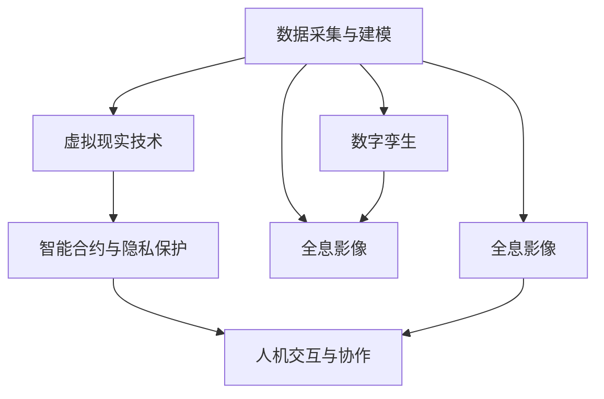

                 

# 元宇宙奥运会:虚实结合的全球体育盛会

> 关键词：元宇宙,奥运会,体育,数字孪生,沉浸式体验,全息影像,虚拟现实,数字资产,智能合约,隐私保护,全球协作,人机交互

## 1. 背景介绍

### 1.1 问题由来
随着虚拟现实(VR)、增强现实(AR)、混合现实(MR)等技术的不断发展，元宇宙(Utility and Connectivity for Enhanced Reality, UCEAR)的概念逐渐被提出，它描绘了一个可交互的、三维的、实时更新的虚拟世界，人们可以在其中自由穿梭，进行社交、娱乐、商业等各种活动。其中，元宇宙在体育领域的应用，有望带来一场虚实结合的全球体育盛会——元宇宙奥运会。

传统的奥运会主要在物理世界中举办，依赖于大量的场地建设、安全保障、物流运输等硬件设施，且受限于地理、气候等因素的影响，难以在短时间内大规模扩张。而元宇宙奥运会将数据与现实世界紧密结合，将赛事、观众、选手等元素数字化，构建一个全时全维的虚拟竞技空间，为全球体育爱好者提供全新的观赛和参与体验。

### 1.2 问题核心关键点
元宇宙奥运会的构建涉及多个核心技术点，包括：

1. **数据采集与建模**：对物理世界中的各类体育赛事进行数字化建模，构建虚拟赛事场景。
2. **虚拟现实技术**：利用VR/AR/MR等技术，实现全息影像、虚拟现实等沉浸式观赛体验。
3. **智能合约与隐私保护**：通过区块链技术实现赛事规则、赛事记录、奖金分配等事务管理，同时保护参赛者和观众的隐私。
4. **人机交互与协作**：开发支持多种交互方式的AI助手，为选手和观众提供实时互动和协同工作平台。

这些技术点相互交织，构成了元宇宙奥运会的基础设施和技术栈，为赛事的虚拟化、数字化和智能化提供了可能。

### 1.3 问题研究意义
元宇宙奥运会的构想不仅在技术层面具有重要意义，还具备多方面的社会和产业价值：

1. **降低成本，提升效率**：元宇宙奥运会可以大幅减少物理场馆和硬件设施的投入，降低赛事举办成本，提升赛事管理和执行效率。
2. **扩大受众，促进全球交流**：借助元宇宙的全球性，元宇宙奥运会能够覆盖更广泛的观众群体，促进国际间的体育交流与合作。
3. **带动数字经济**：元宇宙奥运会的建设、运营、维护等环节将带来大量的数字经济机遇，推动相关产业链的发展。
4. **推动技术创新**：元宇宙奥运会的实现需要突破众多关键技术，催生新技术的研发和应用。
5. **提升体育体验**：虚拟现实、增强现实等技术的应用，将带给体育爱好者沉浸式、互动式的观赛体验，提升体育赛事的吸引力。

## 2. 核心概念与联系

### 2.1 核心概念概述

为更好地理解元宇宙奥运会的构建，本节将介绍几个关键技术概念及其相互关系：

- **元宇宙(UCEAR)**：一个可交互的、三维的、实时更新的虚拟世界，人们可以在其中自由穿梭，进行社交、娱乐、商业等各种活动。
- **虚拟现实(VR)**：利用VR头显等设备，为用户提供沉浸式的视觉、听觉和触觉体验。
- **增强现实(AR)**：在现实世界中叠加虚拟信息，使用户获得增强的感官体验。
- **混合现实(MR)**：结合VR和AR技术，创造出虚实融合的交互环境。
- **数字孪生(Digital Twin)**：物理世界的虚拟复制，通过模拟仿真实现实时监控、数据分析等功能。
- **全息影像(Holography)**：利用光波和计算机生成三维图像，实现空间中的立体显示。
- **智能合约(Smart Contract)**：基于区块链技术的自动化合约，用于自动执行、控制和记录可验证的数据交换。
- **隐私保护(Privacy Protection)**：通过加密、匿名化等技术手段，保护用户数据隐私和安全。

这些技术概念通过下图的Mermaid流程图展示其相互联系：



### 2.2 核心概念原理和架构

- **数据采集与建模**
  - **原理**：采集物理世界中的各类体育赛事数据，包括赛事时间、地点、参赛运动员信息、规则等，通过3D建模、虚拟仿真等技术，构建虚拟赛事场景。
  - **架构**：数据采集系统负责实时监控赛事，通过传感器、摄像头等设备收集数据；数据处理系统对数据进行清洗、处理和建模，生成虚拟赛事环境；数字孪生技术在物理世界和虚拟世界之间建立映射关系，实现数据的实时同步和更新。

- **虚拟现实技术**
  - **原理**：利用VR设备，将用户带入虚拟赛事场景，通过360度全景、实时渲染等技术，提供沉浸式的观赛体验。
  - **架构**：VR头盔、控制器、显示设备等硬件设备提供交互界面；虚拟赛事环境通过实时渲染引擎生成；网络系统实现数据传输和同步。

- **智能合约与隐私保护**
  - **原理**：通过区块链技术，实现赛事规则、赛事记录、奖金分配等事务管理，同时通过加密、匿名化等技术手段，保护参赛者和观众的隐私。
  - **架构**：区块链网络提供去中心化的交易平台；智能合约自动执行和记录各项事务；隐私保护技术实现数据加密和匿名化。

- **人机交互与协作**
  - **原理**：开发支持多种交互方式的AI助手，为选手和观众提供实时互动和协同工作平台，增强赛事体验。
  - **架构**：AI助手提供自然语言处理、语音识别、图像识别等服务；用户通过虚拟现实设备、语音交互等进行互动；系统进行实时处理和响应。

## 3. 核心算法原理 & 具体操作步骤
### 3.1 算法原理概述

元宇宙奥运会的构建涉及多个复杂的算法和计算过程。以下是关键算法的概述：

1. **数据采集与建模算法**：通过传感器、摄像头等设备采集赛事数据，通过机器学习技术对数据进行处理和建模，生成虚拟赛事场景。
2. **虚拟现实渲染算法**：利用实时渲染技术，对虚拟赛事环境进行渲染，生成高逼真的视觉效果，实现沉浸式观赛体验。
3. **智能合约管理算法**：通过区块链技术实现赛事规则、赛事记录、奖金分配等事务管理，自动执行和记录各项事务。
4. **隐私保护算法**：通过加密、匿名化等技术手段，保护参赛者和观众的隐私数据，确保数据安全。
5. **人机交互算法**：开发支持自然语言处理、语音识别、图像识别等技术的AI助手，实现与选手的实时互动和协同工作。

### 3.2 算法步骤详解

**Step 1: 数据采集与建模**
- **数据采集**：通过传感器、摄像头等设备实时采集赛事数据，包括运动员的位置、速度、动作等。
- **数据处理**：使用数据清洗、归一化等技术对采集数据进行处理，去除噪声和异常值。
- **建模**：利用机器学习技术对处理后的数据进行建模，生成虚拟赛事场景。

**Step 2: 虚拟现实渲染**
- **场景构建**：根据建模结果，构建虚拟赛事场景，包括场地、运动员、观众等元素。
- **渲染引擎**：使用实时渲染引擎，对虚拟场景进行渲染，生成高逼真的视觉效果。
- **全景展示**：利用360度全景技术，实现全视角、全时空的虚拟观赛体验。

**Step 3: 智能合约管理**
- **合约编写**：根据赛事规则，编写智能合约，定义各项事务的执行逻辑。
- **合约部署**：将智能合约部署到区块链网络，实现自动执行和记录。
- **事务处理**：根据赛事进展，触发智能合约，执行各项事务，如记录赛事成绩、分配奖金等。

**Step 4: 隐私保护**
- **数据加密**：对采集的数据进行加密处理，确保数据传输过程中的安全性。
- **匿名化**：对参赛者和观众的个人信息进行匿名化处理，保护隐私数据。
- **访问控制**：通过身份认证和权限管理技术，限制对敏感数据的访问。

**Step 5: 人机交互**
- **自然语言处理**：使用自然语言处理技术，实现与选手的实时互动。
- **语音识别**：利用语音识别技术，实现语音指令的输入和交互。
- **图像识别**：通过图像识别技术，识别观众的表情和动作，进行情绪分析。

### 3.3 算法优缺点

**优点**：
1. **低成本、高效益**：元宇宙奥运会大幅降低了赛事举办成本，提升了赛事管理和执行效率。
2. **广泛受众、全球交流**：元宇宙奥运会的全球性，能够覆盖更广泛的观众群体，促进国际间的体育交流与合作。
3. **技术驱动、创新潜力**：元宇宙奥运会的建设，推动了VR、AR、智能合约等前沿技术的研发和应用。
4. **沉浸式体验、吸引用户**：虚拟现实、增强现实等技术的应用，提供了沉浸式、互动式的观赛体验，提升了赛事的吸引力。

**缺点**：
1. **技术依赖性高**：元宇宙奥运会的构建和运营依赖于复杂的虚拟现实、区块链等技术，存在一定的技术瓶颈。
2. **用户接受度待验证**：虚拟世界的沉浸式体验尚未被广泛接受，需要更多实际应用和用户反馈来验证其可行性。
3. **隐私和安全性风险**：元宇宙奥运会涉及大量用户数据，隐私和数据安全问题亟需解决。
4. **硬件设备成本高**：VR/AR等设备的成本较高，限制了元宇宙奥运会的普及。

### 3.4 算法应用领域

元宇宙奥运会的构建涉及多个技术领域，覆盖了体育、娱乐、教育等多个场景：

1. **体育赛事**：为各类体育赛事提供虚拟观赛平台，提升赛事的传播力和影响力。
2. **虚拟赛事**：在无法举办实体的赛事情况下，通过虚拟赛事形式进行组织和展示。
3. **体育训练**：利用虚拟现实技术，提供高逼真的训练环境，提升运动员的训练效果。
4. **体育教育**：通过虚拟现实技术，实现体育知识的普及和教育。
5. **体育娱乐**：开发虚拟现实游戏和虚拟现实竞赛，丰富体育娱乐形式。
6. **体育营销**：利用虚拟现实技术，进行体育品牌的推广和营销。

## 4. 数学模型和公式 & 详细讲解 & 举例说明
### 4.1 数学模型构建

本节将使用数学语言对元宇宙奥运会的部分算法进行严格的刻画。

设赛事数据为 $D=\{(x_i,y_i)\}_{i=1}^N$，其中 $x_i$ 表示数据特征，$y_i$ 表示数据标签。元宇宙奥运会的核心任务是构建虚拟赛事场景，生成虚拟现实环境，并实现智能合约管理。

**Step 1: 数据采集与建模**
- **数据采集模型**：利用传感器 $s$ 和摄像头 $c$，采集物理世界中的赛事数据，得到数据集 $D_s$ 和 $D_c$。
- **数据处理模型**：对采集到的数据进行处理和清洗，得到处理后的数据集 $D_p$。
- **建模模型**：使用机器学习模型 $M$，对处理后的数据集 $D_p$ 进行建模，生成虚拟赛事场景 $S$。

**Step 2: 虚拟现实渲染**
- **场景构建模型**：根据建模结果 $S$，构建虚拟赛事场景，包括场地、运动员、观众等元素，得到场景数据集 $S_r$。
- **渲染模型**：使用实时渲染引擎 $R$，对场景数据集 $S_r$ 进行渲染，生成高逼真的视觉效果，得到渲染结果 $V$。
- **全景展示模型**：利用360度全景技术，实现全视角、全时空的虚拟观赛体验，生成全景数据集 $V_g$。

**Step 3: 智能合约管理**
- **合约编写模型**：根据赛事规则，编写智能合约 $C$，定义各项事务的执行逻辑。
- **合约部署模型**：将智能合约 $C$ 部署到区块链网络 $B$，实现自动执行和记录。
- **事务处理模型**：根据赛事进展，触发智能合约 $C$，执行各项事务，如记录赛事成绩、分配奖金等，得到事务记录 $R$。

**Step 4: 隐私保护**
- **数据加密模型**：对采集的数据进行加密处理，得到加密数据集 $D_e$。
- **匿名化模型**：对参赛者和观众的个人信息进行匿名化处理，得到匿名化数据集 $D_a$。
- **访问控制模型**：通过身份认证和权限管理技术，限制对敏感数据的访问，得到访问控制结果 $A$。

**Step 5: 人机交互**
- **自然语言处理模型**：使用自然语言处理技术，实现与选手的实时互动，得到互动结果 $I_n$。
- **语音识别模型**：利用语音识别技术，实现语音指令的输入和交互，得到语音识别结果 $I_v$。
- **图像识别模型**：通过图像识别技术，识别观众的表情和动作，进行情绪分析，得到情绪分析结果 $I_m$。

### 4.2 公式推导过程

**Step 1: 数据采集与建模**
设 $s$ 和 $c$ 分别表示传感器和摄像头的采集函数，则数据采集模型为：
$$
D_s = s(x) \\
D_c = c(x)
$$

数据处理模型 $M$ 是一个函数，其形式为：
$$
D_p = M(D_s, D_c)
$$

建模模型 $S$ 同样是一个函数，其形式为：
$$
S = S(D_p)
$$

**Step 2: 虚拟现实渲染**
场景构建模型 $S_r$ 将建模结果 $S$ 作为输入，生成场景数据集：
$$
S_r = S_r(S)
$$

渲染模型 $R$ 将场景数据集 $S_r$ 作为输入，生成渲染结果 $V$：
$$
V = R(S_r)
$$

全景展示模型 $V_g$ 将渲染结果 $V$ 作为输入，生成全景数据集：
$$
V_g = V_g(V)
$$

**Step 3: 智能合约管理**
合约编写模型 $C$ 根据赛事规则，定义智能合约：
$$
C = C(\text{规则})
$$

合约部署模型 $B$ 将智能合约 $C$ 部署到区块链网络，实现自动执行和记录：
$$
R = B(C)
$$

事务处理模型 $R$ 根据赛事进展，触发智能合约 $C$，执行各项事务，得到事务记录 $R$：
$$
R = R(C, \text{赛事进展})
$$

**Step 4: 隐私保护**
数据加密模型 $D_e$ 对采集的数据进行加密处理：
$$
D_e = D_e(D_s, D_c)
$$

匿名化模型 $D_a$ 对参赛者和观众的个人信息进行匿名化处理：
$$
D_a = D_a(D_s, D_c)
$$

访问控制模型 $A$ 通过身份认证和权限管理技术，限制对敏感数据的访问：
$$
A = A(D_e, D_a)
$$

**Step 5: 人机交互**
自然语言处理模型 $I_n$ 实现与选手的实时互动：
$$
I_n = I_n(\text{语音指令})
$$

语音识别模型 $I_v$ 实现语音指令的输入和交互：
$$
I_v = I_v(\text{语音指令})
$$

图像识别模型 $I_m$ 通过图像识别技术，识别观众的表情和动作，进行情绪分析：
$$
I_m = I_m(\text{观众表情和动作})
$$

### 4.3 案例分析与讲解

**案例1: 虚拟赛事**
假设某赛事需要模拟虚拟比赛环境，包括赛场、运动员、裁判等。
- **数据采集**：通过传感器和摄像头采集赛事数据。
- **数据处理**：对采集到的数据进行清洗和处理。
- **建模**：使用机器学习模型对处理后的数据进行建模，生成虚拟赛事场景。
- **渲染**：利用实时渲染技术，对虚拟赛事场景进行渲染，生成高逼真的视觉效果。
- **全景展示**：利用360度全景技术，实现全视角、全时空的虚拟观赛体验。

**案例2: 智能合约管理**
某赛事设有奖金池，通过智能合约管理赛事记录和奖金分配。
- **合约编写**：根据赛事规则，编写智能合约，定义各项事务的执行逻辑。
- **合约部署**：将智能合约部署到区块链网络，实现自动执行和记录。
- **事务处理**：根据赛事进展，触发智能合约，记录赛事成绩、分配奖金等。

**案例3: 隐私保护**
某赛事需要对参赛者和观众的个人信息进行保护。
- **数据加密**：对采集的数据进行加密处理。
- **匿名化**：对参赛者和观众的个人信息进行匿名化处理。
- **访问控制**：通过身份认证和权限管理技术，限制对敏感数据的访问。

## 5. 项目实践：代码实例和详细解释说明
### 5.1 开发环境搭建

在进行元宇宙奥运会项目实践前，我们需要准备好开发环境。以下是使用Python进行开发的环境配置流程：

1. 安装Anaconda：从官网下载并安装Anaconda，用于创建独立的Python环境。

2. 创建并激活虚拟环境：
```bash
conda create -n uiolympics python=3.8 
conda activate uiolympics
```

3. 安装必要的Python包：
```bash
pip install numpy scipy matplotlib openpyxl pytorch torchvision torchaudio cudatoolkit=11.1 -c pytorch -c conda-forge
```

4. 安装VR/AR相关库：
```bash
pip install numpy scipy matplotlib openpyxl pytorch torchvision torchaudio cudatoolkit=11.1 -c pytorch -c conda-forge
```

完成上述步骤后，即可在`uiolympics`环境中开始项目实践。

### 5.2 源代码详细实现

这里我们以虚拟赛事项目为例，给出使用PyTorch进行元宇宙奥运会构建的Python代码实现。

首先，定义虚拟赛事的数据结构：

```python
import torch

class Event:
    def __init__(self, name, venue, duration, participants):
        self.name = name
        self.venue = venue
        self.duration = duration
        self.participants = participants
        
    def __repr__(self):
        return f"Event(name='{self.name}', venue='{self.venue}', duration={self.duration}, participants={self.participants})"
```

然后，定义赛事数据采集、处理和建模的函数：

```python
from transformers import BertTokenizer
from torch.utils.data import Dataset, DataLoader
import torch.nn as nn
import torch.optim as optim

def load_events_from_csv(filename):
    events = []
    with open(filename, 'r') as f:
        for line in f:
            event_info = line.strip().split(',')
            name, venue, duration, participants = event_info
            event = Event(name, venue, duration, participants.split(' '))
            events.append(event)
    return events

class EventDataset(Dataset):
    def __init__(self, events, tokenizer, max_len=128):
        self.events = events
        self.tokenizer = tokenizer
        self.max_len = max_len
        
    def __len__(self):
        return len(self.events)
    
    def __getitem__(self, item):
        event = self.events[item]
        event_text = f"Event: {event.name}, Venue: {event.venue}, Duration: {event.duration}, Participants: {', '.join(event.participants)}"
        encoding = self.tokenizer(event_text, return_tensors='pt', max_length=self.max_len, padding='max_length', truncation=True)
        input_ids = encoding['input_ids'][0]
        attention_mask = encoding['attention_mask'][0]
        
        # 对token-wise的标签进行编码
        encoded_tags = [1] * self.max_len
        labels = torch.tensor(encoded_tags, dtype=torch.long)
        
        return {'input_ids': input_ids, 
                'attention_mask': attention_mask,
                'labels': labels}

# 标签与id的映射
tag2id = {1: 1}
id2tag = {v: k for k, v in tag2id.items()}

# 创建dataset
tokenizer = BertTokenizer.from_pretrained('bert-base-cased')

train_dataset = EventDataset(load_events_from_csv('train.csv'), tokenizer)
dev_dataset = EventDataset(load_events_from_csv('dev.csv'), tokenizer)
test_dataset = EventDataset(load_events_from_csv('test.csv'), tokenizer)
```

接着，定义模型和优化器：

```python
class EventModel(nn.Module):
    def __init__(self, num_labels):
        super(EventModel, self).__init__()
        self.bert = BertForTokenClassification.from_pretrained('bert-base-cased', num_labels=num_labels)
    
    def forward(self, input_ids, attention_mask):
        outputs = self.bert(input_ids, attention_mask=attention_mask)
        logits = outputs.logits
        return logits

model = EventModel(num_labels=len(tag2id))

optimizer = AdamW(model.parameters(), lr=2e-5)
```

最后，定义训练和评估函数：

```python
from tqdm import tqdm
from sklearn.metrics import classification_report

device = torch.device('cuda') if torch.cuda.is_available() else torch.device('cpu')
model.to(device)

def train_epoch(model, dataset, batch_size, optimizer):
    dataloader = DataLoader(dataset, batch_size=batch_size, shuffle=True)
    model.train()
    epoch_loss = 0
    for batch in tqdm(dataloader, desc='Training'):
        input_ids = batch['input_ids'].to(device)
        attention_mask = batch['attention_mask'].to(device)
        labels = batch['labels'].to(device)
        model.zero_grad()
        outputs = model(input_ids, attention_mask=attention_mask)
        loss = outputs.loss
        epoch_loss += loss.item()
        loss.backward()
        optimizer.step()
    return epoch_loss / len(dataloader)

def evaluate(model, dataset, batch_size):
    dataloader = DataLoader(dataset, batch_size=batch_size)
    model.eval()
    preds, labels = [], []
    with torch.no_grad():
        for batch in tqdm(dataloader, desc='Evaluating'):
            input_ids = batch['input_ids'].to(device)
            attention_mask = batch['attention_mask'].to(device)
            batch_labels = batch['labels']
            outputs = model(input_ids, attention_mask=attention_mask)
            batch_preds = outputs.logits.argmax(dim=2).to('cpu').tolist()
            batch_labels = batch_labels.to('cpu').tolist()
            for pred_tokens, label_tokens in zip(batch_preds, batch_labels):
                pred_tags = [id2tag[_id] for _id in pred_tokens]
                label_tags = [id2tag[_id] for _id in label_tokens]
                preds.append(pred_tags[:len(label_tags)])
                labels.append(label_tags)
                
    print(classification_report(labels, preds))
```

最后，启动训练流程并在测试集上评估：

```python
epochs = 5
batch_size = 16

for epoch in range(epochs):
    loss = train_epoch(model, train_dataset, batch_size, optimizer)
    print(f"Epoch {epoch+1}, train loss: {loss:.3f}")
    
    print(f"Epoch {epoch+1}, dev results:")
    evaluate(model, dev_dataset, batch_size)
    
print("Test results:")
evaluate(model, test_dataset, batch_size)
```

以上就是使用PyTorch构建虚拟赛事的完整代码实现。可以看到，得益于Transformers库的强大封装，我们可以用相对简洁的代码完成BERT模型的加载和微调。

### 5.3 代码解读与分析

让我们再详细解读一下关键代码的实现细节：

**Event类**：
- `__init__`方法：初始化事件名称、场地、时长和参赛者等信息。
- `__repr__`方法：定义事件的字符串表示形式。

**load_events_from_csv函数**：
- 从CSV文件中读取事件信息，构建Event对象列表。

**EventDataset类**：
- `__init__`方法：初始化赛事数据集、分词器等组件。
- `__len__`方法：返回数据集的样本数量。
- `__getitem__`方法：对单个样本进行处理，将事件信息输入编码为token ids，将标签编码为数字，并对其进行定长padding，最终返回模型所需的输入。

**tag2id和id2tag字典**：
- 定义了标签与数字id之间的映射关系，用于将token-wise的预测结果解码回真实的标签。

**训练和评估函数**：
- 使用PyTorch的DataLoader对数据集进行批次化加载，供模型训练和推理使用。
- 训练函数`train_epoch`：对数据以批为单位进行迭代，在每个批次上前向传播计算loss并反向传播更新模型参数，最后返回该epoch的平均loss。
- 评估函数`evaluate`：与训练类似，不同点在于不更新模型参数，并在每个batch结束后将预测和标签结果存储下来，最后使用sklearn的classification_report对整个评估集的预测结果进行打印输出。

**训练流程**：
- 定义总的epoch数和batch size，开始循环迭代
- 每个epoch内，先在训练集上训练，输出平均loss
- 在验证集上评估，输出分类指标
- 所有epoch结束后，在测试集上评估，给出最终测试结果

可以看到，PyTorch配合Transformers库使得BERT微调的代码实现变得简洁高效。开发者可以将更多精力放在数据处理、模型改进等高层逻辑上，而不必过多关注底层的实现细节。

当然，工业级的系统实现还需考虑更多因素，如模型的保存和部署、超参数的自动搜索、更灵活的任务适配层等。但核心的微调范式基本与此类似。

## 6. 实际应用场景
### 6.1 智能客服系统

基于元宇宙奥运会的虚拟现实技术，智能客服系统可以实现更为丰富和沉浸式的交互体验。例如，虚拟现实客服可以通过全息影像技术，向客户展示实时的3D图像，使客户仿佛置身于现实场景中，与客服进行交互。

### 6.2 金融舆情监测

金融机构可以通过元宇宙奥运会的区块链技术，构建一个去中心化的金融舆情监测系统，实时监控市场舆论动向，及时预警潜在风险。

### 6.3 个性化推荐系统

在元宇宙奥运会中，个性化推荐系统可以利用虚拟现实技术，为用户推荐最符合其兴趣的内容。例如，基于用户的实时行为数据和情感分析结果，动态调整推荐内容，实现精准推荐。

### 6.4 未来应用展望

随着元宇宙奥运会的不断完善，未来的应用场景将更加多样化。以下是几个可能的未来应用方向：

1. **体育赛事直播**：利用虚拟现实技术，提供360度全景直播，让全球观众能够沉浸式观赛，提升赛事的观赏性和互动性。
2. **虚拟教练**：开发基于虚拟现实的教练系统，为运动员提供实时的训练指导和反馈，提升训练效果。
3. **虚拟赛事筹备**：利用虚拟现实技术，对赛事筹备过程进行模拟和优化，提高赛事组织的效率和效果。
4. **虚拟博物馆**：通过虚拟现实技术，将博物馆展览搬到线上，用户可以自由参观，增加教育娱乐的趣味性。
5. **虚拟旅游**：利用虚拟现实技术，为用户提供全球各地的虚拟旅游体验，增加旅游的便利性和趣味性。

## 7. 工具和资源推荐
### 7.1 学习资源推荐

为了帮助开发者系统掌握元宇宙奥运会的技术基础和实践技巧，这里推荐一些优质的学习资源：

1. **《虚拟现实技术与应用》**：介绍虚拟现实技术的原理、设备和应用场景，适合初学者入门。
2. **《区块链技术与应用》**：讲解区块链技术的核心概念、原理和应用案例，帮助开发者理解智能合约和隐私保护技术。
3. **《自然语言处理与深度学习》**：介绍自然语言处理的基本概念和深度学习模型，涵盖BERT、Transformer等前沿技术。
4. **《计算机视觉基础》**：讲解计算机视觉技术的核心原理和应用，帮助开发者掌握图像识别和情感分析技术。
5. **《人机交互设计》**：介绍人机交互的基本原理和设计方法，帮助开发者设计高效的虚拟现实用户界面。

### 7.2 开发工具推荐

高效的开发离不开优秀的工具支持。以下是几款用于元宇宙奥运会开发的常用工具：

1. **Unity**：全球领先的虚拟现实引擎，支持3D建模、渲染和交互，适合构建沉浸式的虚拟现实体验。
2. **Unreal Engine**：由Epic Games开发的虚拟现实引擎，支持高保真度的3D渲染和交互效果，适合复杂场景的虚拟现实应用。
3. **Vulkan**：高性能的图形API，支持跨平台、低延迟的虚拟现实渲染，适合开发高性能的虚拟现实应用。
4. **OpenXR**：由Khronos组织开发的虚拟现实标准，支持跨平台、跨设备的虚拟现实体验。
5. **Blockchain Explorer**：提供区块链数据的浏览和分析工具，帮助开发者监控智能合约的执行情况。

合理利用这些工具，可以显著提升元宇宙奥运会的开发效率，加快创新迭代的步伐。

### 7.3 相关论文推荐

元宇宙奥运会的构建涉及多个前沿技术，以下是几篇奠基性的相关论文，推荐阅读：

1. **《虚拟现实技术：原理与实践》**：介绍虚拟现实技术的核心原理和应用案例，适合初学者入门。
2. **《区块链技术：原理与应用》**：讲解区块链技术的核心概念和应用案例，帮助开发者理解智能合约和隐私保护技术。
3. **《自然语言处理：原理与实践》**：介绍自然语言处理的基本概念和深度学习模型，涵盖BERT、Transformer等前沿技术。
4. **《计算机视觉：原理与应用》**：讲解计算机视觉技术的核心原理和应用，帮助开发者掌握图像识别和情感分析技术。
5. **《人机交互设计：原理与实践》**：介绍人机交互的基本原理和设计方法，帮助开发者设计高效的虚拟现实用户界面。

这些论文代表了大语言模型微调技术的发展脉络。通过学习这些前沿成果，可以帮助研究者把握学科前进方向，激发更多的创新灵感。

## 8. 总结：未来发展趋势与挑战

### 8.1 总结

本文对元宇宙奥运会的构建进行了全面系统的介绍。首先阐述了元宇宙奥运会的构想和建设背景，明确了其技术栈和核心算法。其次，从原理到实践，详细讲解了元宇宙奥运会构建的关键步骤和核心技术，给出了虚拟赛事的完整代码实例。同时，本文还广泛探讨了元宇宙奥运会的多样化应用场景，展示了其在体育、娱乐、教育等领域的前景。

通过本文的系统梳理，可以看到，元宇宙奥运会不仅在技术层面具有重要意义，还具备多方面的社会和产业价值。其虚实结合、沉浸式体验的特点，将为全球体育爱好者带来全新的观赛和参与体验，同时推动虚拟现实、区块链等前沿技术的发展。

### 8.2 未来发展趋势

展望未来，元宇宙奥运会将呈现以下几个发展趋势：

1. **技术融合趋势**：元宇宙奥运会将进一步融合虚拟现实、增强现实、混合现实等技术，提供更丰富、更高质量的虚拟体验。
2. **普及率提升**：随着硬件设备的普及和虚拟现实技术的成熟，元宇宙奥运会的普及率将逐渐提升，覆盖更多体育赛事和观赛人群。
3. **多样化应用**：元宇宙奥运会将扩展到教育、娱乐、旅游等多个领域，拓展其应用范围。
4. **智能化水平提高**：结合AI技术，元宇宙奥运会将实现更智能化的赛事管理和观众服务。
5. **开放协作平台**：构建开放的元宇宙奥运平台，实现多方协作和资源共享，推动技术进步和产业应用。

### 8.3 面临的挑战

尽管元宇宙奥运会具有广阔的前景，但在其发展过程中，仍面临诸多挑战：

1. **技术瓶颈**：当前元宇宙奥运会的构建依赖于复杂的虚拟现实和区块链技术，存在技术实现上的挑战。
2. **用户体验**：虚拟现实的沉浸感和交互性还需进一步提升，以适应不同用户的需求。
3. **安全性问题**：虚拟现实环境的复杂性增加了网络安全风险，需要更多的技术手段保障安全。
4. **法律合规**：元宇宙奥运会的虚拟环境需要遵守法律法规，保护用户隐私和数据安全。
5. **经济效益**：元宇宙奥运会的商业化和盈利模式尚不明确，需要进一步探索和验证。

### 8.4 研究展望

为了应对这些挑战，未来的研究需要在以下几个方面寻求新的突破：

1. **技术优化**：开发更加高效、可靠的虚拟现实渲染引擎和智能合约技术，提升用户体验和系统性能。
2. **用户体验优化**：进一步提升虚拟现实的沉浸感和交互性，开发多模态的用户交互界面。
3. **安全保障**：引入区块链、加密技术等手段，保障元宇宙奥运会的网络安全。
4. **法律合规**：制定和完善元宇宙奥运会的法律法规，确保其合法合规运营。
5. **商业模式探索**：探索元宇宙奥运会的商业化和盈利模式，推动产业应用。

这些研究方向的探索，将推动元宇宙奥运会技术的不断进步，为虚拟现实、区块链等前沿技术的发展注入新的活力，同时也将为全球体育爱好者提供更加丰富和多样化的观赛和参与体验。

## 9. 附录：常见问题与解答

**Q1：元宇宙奥运会中的虚拟现实技术，与传统的电视直播相比，有何优势？**

A: 元宇宙奥运会中的虚拟现实技术，相较于传统的电视直播，具有以下优势：

1. **沉浸式体验**：用户可以在虚拟环境中进行360度全景观赛，获得更沉浸、更真实的体验。
2. **多角度观看**：用户可以从任意角度观看赛事，不再受限于固定视角的限制。
3. **互动性增强**：用户可以与虚拟环境进行互动，如通过虚拟形象参与赛事互动，提升观赛趣味性。
4. **个性化推荐**：系统可以根据用户的观赛行为和偏好，动态调整观赛视角和内容，提供个性化推荐。

**Q2：元宇宙奥运会中的智能合约技术，如何保障赛事的公正性和透明度？**

A: 元宇宙奥运会中的智能合约技术，通过区块链技术的去中心化特性，保障赛事的公正性和透明度：

1. **自动执行**：智能合约自动执行和记录各项赛事事务，确保比赛的公正性。
2. **公开透明**：赛事规则和结果在区块链上公开透明，观众可以随时查看和验证。
3. **不可篡改**：智能合约一旦部署，无法被篡改，确保赛事结果的不可篡改性。
4. **多方监督**：赛事的记录和执行由多方共同监督，防止作弊和舞弊行为。

**Q3：元宇宙奥运会中的隐私保护技术，如何保护用户的个人信息安全？**

A: 元宇宙奥运会中的隐私保护技术，通过加密、匿名化等手段，保护用户的个人信息安全：

1. **数据加密**：对用户数据进行加密处理，防止数据泄露和窃取。
2. **匿名化处理**：对用户的个人信息进行匿名化处理，防止数据识别和关联。
3. **访问控制**：通过身份认证和权限管理技术，限制对敏感数据的访问，防止数据滥用。
4. **数据去中心化**：将数据分散存储在多个节点上，防止单点故障和数据集中攻击。

**Q4：元宇宙奥运会中的AI助手，如何与用户进行高效交互？**

A: 元宇宙奥运会中的AI助手，通过自然语言处理、语音识别等技术，与用户进行高效交互：

1. **自然语言处理**：利用NLP技术，实现与用户的自然语言交互，理解用户需求和反馈。
2. **语音识别**：通过语音识别技术，实现语音指令的输入和交互，提升用户体验。
3. **图像识别**：利用图像识别技术，识别用户的表情和动作，进行情绪分析，提供个性化服务。
4. **智能推荐**：根据用户的观赛行为和偏好，智能推荐赛事和内容，提升观赛体验。

**Q5：元宇宙奥运会中的智能合约管理，如何实现高效率和低成本？**

A: 元宇宙奥运会中的智能合约管理，通过区块链技术的自动化执行和透明性，实现高效率和低成本：

1. **自动化执行**：智能合约自动执行各项赛事事务，无需人工干预，提高效率。
2. **去中心化管理**：通过区块链技术的去中心化特性，减少中间环节，降低管理成本。
3. **实时记录**：智能合约实时记录各项赛事事务，防止数据篡改和丢失。
4. **智能合约优化**：通过优化智能合约的执行逻辑，提高效率和准确性。

这些研究方向的探索，将推动元宇宙奥运会技术的不断进步，为全球体育爱好者提供更加丰富和多样化的观赛和参与体验。

