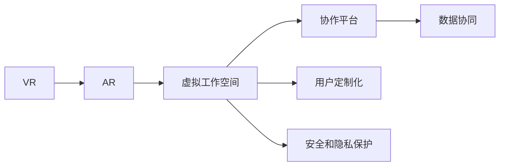

                 

## 1. 背景介绍

### 1.1 问题由来

近年来，随着信息技术的不断进步，远程办公、居家学习和跨地域协作成为新的常态。传统的办公模式逐渐向虚拟化、智能化的方向转变，催生了元宇宙（Metaverse）这一全新的工作空间概念。元宇宙工作空间，也称为虚拟工作空间（Virtual Workspace），通过虚拟现实（Virtual Reality, VR）、增强现实（Augmented Reality, AR）等技术，将物理世界中的工作场景数字化、虚拟化，实现跨地域、跨组织的无缝协作。

### 1.2 问题核心关键点

元宇宙工作空间的核心在于将现实世界的协作场景映射到数字空间，通过虚拟技术增强协作体验，打破物理空间的限制。其关键点在于：

- **虚拟化协同**：利用虚拟现实技术，让远程团队成员通过虚拟空间进行实时交互，消除地理位置的限制。
- **智能协作工具**：通过AI驱动的智能助手、协作平台，提升工作效率和协作质量。
- **数据协同**：构建统一的虚拟数据中心，实现跨平台、跨设备的数据共享和协作。
- **用户定制化**：允许用户根据个人需求和工作场景自定义虚拟空间和工作流程。
- **安全和隐私保护**：确保虚拟空间的安全性，保护用户数据隐私。

### 1.3 问题研究意义

研究元宇宙工作空间的构建，对于推动远程办公和跨地域协作的革新，提升工作效率和用户体验，具有重要意义：

1. **提升远程协作效率**：通过虚拟化技术，打破物理空间的限制，让团队成员随时随地进行高效协作。
2. **改善用户体验**：虚拟空间的多样化设计和灵活交互，提升用户的沉浸感和参与度。
3. **促进组织创新**：虚拟工作空间提供了新的协作模式和创新平台，激发团队的创造力。
4. **推动经济转型**：元宇宙工作空间有助于实现从线下到线上的业务转型，推动数字经济的发展。
5. **应对未来挑战**：应对未来可能出现的更多远程办公需求，如全球疫情导致的远程工作常态化。

## 2. 核心概念与联系

### 2.1 核心概念概述

为更好地理解元宇宙工作空间的构建原理和关键技术，本节将介绍几个关键概念：

- **虚拟现实（VR）**：通过VR设备提供沉浸式的视觉、听觉和触觉体验，构建虚拟世界。
- **增强现实（AR）**：在现实世界中叠加虚拟信息，增强用户对环境的感知和互动。
- **虚拟工作空间（Virtual Workspace）**：通过VR和AR技术，将物理工作场景映射到虚拟空间，实现跨地域、跨组织的协作。
- **协作平台（Collaboration Platform）**：提供团队协作的工具和平台，支持任务分配、项目管理、沟通交流等功能。
- **数据协同（Data Collaboration）**：构建统一的数据平台，支持跨设备和跨系统的数据共享和协作。
- **用户定制化（User Customization）**：允许用户根据自身需求和偏好，自定义虚拟工作环境和操作流程。
- **安全和隐私保护（Security and Privacy）**：确保虚拟空间的安全性，保护用户数据隐私。

这些概念之间的关系可以通过以下Mermaid流程图来展示：



这个流程图展示了几者之间的逻辑关系：

1. VR和AR技术为虚拟工作空间提供了沉浸式和增强的交互体验。
2. 虚拟工作空间结合协作平台，支持团队在虚拟空间中进行高效的协作。
3. 数据协同确保了跨平台和跨设备的数据共享和协作。
4. 用户定制化允许用户根据自身需求进行个性化设置。
5. 安全和隐私保护是构建虚拟工作空间的基础保障。

## 3. 核心算法原理 & 具体操作步骤

### 3.1 算法原理概述

元宇宙工作空间的构建，涉及多个核心算法的协同工作，包括虚拟现实渲染、智能协作、数据协同、用户定制等。其核心算法原理如下：

- **虚拟现实渲染**：利用计算机图形学技术，将三维模型渲染成可交互的虚拟环境。
- **智能协作**：通过自然语言处理（NLP）和计算机视觉（CV）技术，实现智能协作和沟通。
- **数据协同**：构建分布式数据存储和处理系统，支持数据的高效共享和协同。
- **用户定制**：利用个性化推荐和用户界面（UI）设计，提供丰富的用户体验。
- **安全和隐私保护**：通过加密和安全协议，确保数据和交互的安全性。

### 3.2 算法步骤详解

构建元宇宙工作空间一般包括以下几个关键步骤：

**Step 1: 准备虚拟现实硬件和软件环境**
- 选择合适的VR头显、手柄和主机会话设备。
- 安装和配置VR软件平台（如Unity、Unreal Engine等）。
- 配置网络环境和服务器资源，确保流畅的虚拟空间体验。

**Step 2: 创建虚拟工作空间**
- 设计虚拟工作空间的布局和功能模块。
- 利用计算机图形学技术，生成三维虚拟环境。
- 添加虚拟物体和交互设备，如虚拟桌椅、白板、投影等。

**Step 3: 开发智能协作工具**
- 设计任务分配和项目管理工具。
- 实现智能助手和协作平台，支持团队沟通和任务协作。
- 集成NLP和CV技术，支持文本和语音的智能识别和处理。

**Step 4: 实现数据协同**
- 设计数据中心和分布式存储方案。
- 开发数据同步和同步工具，支持跨平台数据共享。
- 实现数据安全和隐私保护机制，确保数据的安全性和隐私性。

**Step 5: 进行用户定制化**
- 提供用户界面设计和自定义工具。
- 支持用户根据自己的需求和偏好，进行虚拟工作环境的个性化定制。
- 提供丰富的交互方式和操作方式，提升用户体验。

**Step 6: 部署和测试**
- 部署虚拟工作空间到生产环境。
- 进行性能测试和安全测试，确保系统的稳定性和安全性。
- 收集用户反馈，不断优化和改进系统。

以上是构建元宇宙工作空间的基本流程。在实际应用中，还需要根据具体需求和场景，进一步细化和优化各个环节。

### 3.3 算法优缺点

元宇宙工作空间的构建具有以下优点：

1. **打破地理限制**：通过虚拟现实技术，使得远程团队成员可以随时随地进行高效协作，打破地理位置的限制。
2. **提升用户体验**：虚拟空间的多样化和灵活交互，提升了用户的沉浸感和参与度。
3. **促进协作创新**：虚拟工作空间提供了新的协作模式和创新平台，激发团队的创造力。
4. **推动经济转型**：促进线下业务向线上转型，推动数字经济的发展。

同时，该方法也存在一些局限性：

1. **硬件依赖性强**：构建元宇宙工作空间需要高性能的VR硬件设备和强大的计算资源。
2. **技术复杂度高**：涉及多个技术领域的融合，开发和部署复杂度较高。
3. **用户接受度低**：部分用户可能对虚拟现实和增强现实技术存在抵触情绪。
4. **成本高昂**：构建和维护虚拟工作空间需要较高的投资和维护成本。

尽管存在这些局限性，但就目前而言，元宇宙工作空间依然是大势所趋，其价值和潜力不可忽视。

### 3.4 算法应用领域

元宇宙工作空间的应用领域广泛，主要包括以下几个方面：

- **远程办公**：通过虚拟现实技术，实现跨地域、跨组织的高效协作。
- **企业培训**：构建虚拟培训空间，提升员工的培训效果和体验。
- **医疗健康**：利用虚拟现实技术，进行远程医疗和健康监测。
- **教育培训**：提供虚拟教室和实验室，支持远程教育和实验。
- **游戏娱乐**：开发虚拟游戏和娱乐应用，增强用户的沉浸感和娱乐体验。
- **文化旅游**：通过虚拟现实技术，展示和体验不同文化的历史和景点。

## 4. 数学模型和公式 & 详细讲解 & 举例说明

### 4.1 数学模型构建

为了更好地理解元宇宙工作空间的构建原理，本节将使用数学语言对其中的核心技术进行更加严格的刻画。

记虚拟现实渲染的3D模型为$\mathcal{M}$，其渲染后的二维图像为$\mathcal{I}$。假设虚拟工作空间中的用户数为$U$，任务数为$T$。定义用户$i$在任务$j$上的工作时间为$w_{ij}$，任务$j$的完成时间为$c_j$。

则虚拟工作空间的任务完成时间和用户工作时间的关系可以用以下数学模型来描述：

$$
c_j = \sum_{i=1}^U w_{ij}
$$

该模型假设每个用户的工作效率是恒定的，且每个任务只由一个用户完成。实际应用中，任务和用户之间可能存在重叠和依赖关系，模型需要进一步扩展和优化。

### 4.2 公式推导过程

为了简化问题，我们假设虚拟工作空间中只有一个任务和两个用户。设任务完成时间为$c_j$，用户1和用户2在任务上的工作时间分别为$w_{11}$和$w_{12}$，则有：

$$
c_j = w_{11} + w_{12}
$$

假设用户1和用户2的工作效率分别为$\epsilon_1$和$\epsilon_2$，则有：

$$
w_{11} = \frac{c_j}{\epsilon_1}, w_{12} = \frac{c_j}{\epsilon_2}
$$

将上述公式代入任务完成时间的计算公式中，得：

$$
c_j = \frac{c_j}{\epsilon_1} + \frac{c_j}{\epsilon_2}
$$

简化得：

$$
\epsilon_1 = \frac{1}{1 + \frac{\epsilon_2}{\epsilon_1}}
$$

该公式表明，用户1的工作效率与用户2的工作效率成反比。在实际应用中，可以通过调整用户1和用户2的工作负荷，实现任务的协同完成。

### 4.3 案例分析与讲解

以下我们以企业培训为例，展示如何构建基于数学模型的虚拟培训空间。

假设企业有500名员工，需要培训一项新技能。培训时间为20小时，每个员工的工作效率为5小时/天。则按照公式（4-1），我们可以计算出每个员工需要工作的时间和培训完成时间：

$$
c_j = \sum_{i=1}^U w_{ij} = \frac{20}{5} = 4
$$

因此，每个员工需要工作4天，完成培训。为了优化培训效果，可以将员工分为两组，每组250人，分别由5个管理员指导。根据公式（4-2），可以计算出每个管理员的工作效率：

$$
\epsilon_1 = \frac{1}{1 + \frac{\epsilon_2}{\epsilon_1}}
$$

假设管理员1和管理员2的工作效率分别为10小时/天和12小时/天，则有：

$$
\epsilon_1 = \frac{1}{1 + \frac{12}{10}} = \frac{10}{22}, \epsilon_2 = \frac{1}{1 + \frac{10}{12}} = \frac{12}{22}
$$

因此，管理员1的工作效率较低，需要更多的资源和时间来完成任务。企业可以调整培训策略，增加管理员1的工作负荷，减少管理员2的工作负荷，提高培训效果。

## 5. 项目实践：代码实例和详细解释说明

### 5.1 开发环境搭建

在进行元宇宙工作空间的构建时，我们需要准备好开发环境。以下是使用Python进行虚拟现实开发的环境配置流程：

1. 安装Anaconda：从官网下载并安装Anaconda，用于创建独立的Python环境。

2. 创建并激活虚拟环境：
```bash
conda create -n vrt-env python=3.8 
conda activate vrt-env
```

3. 安装虚拟现实库：
```bash
pip install pyglet
pip install openvr
pip install panda3d
```

4. 安装VR设备驱动：
```bash
conda install -c conda-forge libvrfw
```

完成上述步骤后，即可在`vrt-env`环境中开始虚拟现实开发。

### 5.2 源代码详细实现

下面我们以虚拟工作空间中的一个任务分配为例，给出使用Python进行虚拟现实开发和任务分配的代码实现。

首先，定义虚拟工作空间的场景类：

```python
from panda3d.core import NodePath, Landscape, Light, Camera

class Workspace:
    def __init__(self):
        self.landscape = Landscape(self.node, numSegments=20, smooth=True)
        self.camera = Camera()
        self.light = Light(self.camera)
        self.camera.lookAt(self.node)
        self.camera.setLens(45, 100, 10)
        self.camera.setPos(0, 0, 100)
```

然后，实现任务分配函数：

```python
from time import sleep

class Task:
    def __init__(self, name, start_time, end_time):
        self.name = name
        self.start_time = start_time
        self.end_time = end_time
        self.progress = 0

    def work(self, work_time):
        self.progress += work_time
        if self.progress >= self.end_time:
            self.end()
        elif self.progress >= self.start_time:
            self.progress = self.start_time

    def end(self):
        print(f"Task {self.name} is done")

def assign_tasks(workspace, tasks):
    for task in tasks:
        print(f"Task {task.name} starts at {task.start_time}")
        workspace.camera.lookAt(task.node)
        task.work(work_time=2)
        print(f"Task {task.name} is {task.progress}/{task.end_time}")
        workspace.camera.lookAt(workspace.node)

# 创建虚拟工作空间
workspace = Workspace()

# 定义任务
task1 = Task("task1", start_time=0, end_time=5)
task2 = Task("task2", start_time=5, end_time=10)

# 分配任务
assign_tasks(workspace, [task1, task2])
```

最后，启动虚拟空间并进行任务分配：

```python
from panda3d.core import run
run()
```

以上就是使用Python进行虚拟工作空间开发和任务分配的完整代码实现。可以看到，利用Panda3D库，可以较为简单地实现虚拟场景和任务分配。

### 5.3 代码解读与分析

让我们再详细解读一下关键代码的实现细节：

**Workspace类**：
- `__init__`方法：初始化虚拟工作空间，创建地形、灯光、相机等组件。
- `landscape`属性：地形组件，用于构建虚拟地面。
- `camera`属性：相机组件，用于控制摄像机的视角和位置。
- `light`属性：灯光组件，用于照亮虚拟场景。

**Task类**：
- `__init__`方法：初始化任务，包括任务名称、开始时间、结束时间、进度等属性。
- `work`方法：根据任务进度执行相应的操作，包括工作、结束等。
- `end`方法：表示任务完成。

**assign_tasks函数**：
- 遍历所有任务，打印任务开始时间和进度，并通过`work`方法进行任务执行。
- 根据任务的进度，调整相机的视角，以展示任务执行的实时状态。

可以看到，Python结合Panda3D库，可以实现较为完整的虚拟工作空间开发。开发者可以进一步扩展和优化，实现更加复杂的功能和效果。

当然，实际的虚拟工作空间开发还需要考虑更多的因素，如用户界面设计、多用户协作、数据同步等。但核心的虚拟现实渲染和任务分配技术，已初步展示在此代码中。

## 6. 实际应用场景

### 6.1 远程办公

基于虚拟现实技术的远程办公，已经广泛应用于各大企业和组织。通过构建虚拟工作空间，团队成员可以随时随地进行高效协作，打破物理空间和时间的限制。

在技术实现上，企业可以利用Unity或Unreal Engine等游戏引擎，构建虚拟办公室、会议室和协作平台。通过VR头盔和手柄，员工可以在虚拟空间中进行实时沟通、文件共享和任务协作。虚拟现实技术还可以实现虚拟展示、虚拟培训等功能，提升员工的体验和工作效率。

### 6.2 企业培训

虚拟现实技术为企业培训提供了新的途径。通过构建虚拟培训空间，员工可以在虚拟环境中进行模拟操作和情景演练，提升技能水平。

在实际应用中，企业可以利用虚拟现实技术，构建虚拟实验室、虚拟教室和虚拟演示环境。员工可以通过VR头盔进行虚拟操作和互动，掌握复杂的操作技能。虚拟现实技术还可以实现远程指导和实时反馈，提升培训效果。

### 6.3 医疗健康

虚拟现实技术在医疗健康领域也有广泛的应用。通过构建虚拟手术室和模拟病房，医生可以进行虚拟手术和健康监测，提升诊疗水平。

在实际应用中，医院可以利用虚拟现实技术，构建虚拟手术室和健康监测环境。医生可以通过VR头盔进行虚拟手术和健康监测，掌握操作技能和诊断技巧。虚拟现实技术还可以实现远程指导和实时反馈，提升医疗服务的质量和效率。

### 6.4 教育培训

虚拟现实技术为教育培训提供了新的平台。通过构建虚拟教室和实验室，学生可以在虚拟环境中进行学习和实验，提升学习效果。

在实际应用中，学校可以利用虚拟现实技术，构建虚拟教室和实验室。学生可以通过VR头盔进行虚拟学习，掌握复杂的操作技能和知识。虚拟现实技术还可以实现远程指导和实时反馈，提升教育服务的质量和效率。

### 6.5 游戏娱乐

虚拟现实技术在游戏娱乐领域有广泛的应用。通过构建虚拟游戏和娱乐环境，用户可以在虚拟世界中体验不同的情境和场景。

在实际应用中，游戏公司可以利用虚拟现实技术，开发虚拟游戏和娱乐应用。用户可以通过VR头盔进行虚拟游戏和互动，体验不同的情境和场景。虚拟现实技术还可以实现远程游戏和社交，提升娱乐体验。

## 7. 工具和资源推荐

### 7.1 学习资源推荐

为了帮助开发者系统掌握元宇宙工作空间的构建技术，这里推荐一些优质的学习资源：

1. **《虚拟现实编程与开发》**：一本介绍虚拟现实技术开发的经典书籍，涵盖了虚拟现实技术的原理、工具和应用。
2. **Unity官方文档**：Unity游戏引擎的官方文档，提供了详细的开发教程和实例，是虚拟现实开发的重要资源。
3. **Unreal Engine官方文档**：Unreal Engine游戏引擎的官方文档，提供了详细的开发教程和实例，是虚拟现实开发的重要资源。
4. **VR开发社区**：如VRChat、Hololive等，提供了丰富的VR开发资源和社区支持，是学习虚拟现实技术的重要平台。
5. **VR硬件教程**：如Valve SDK、OpenXR等，提供了详细的硬件驱动和开发教程，是虚拟现实开发的重要资源。

通过对这些资源的学习实践，相信你一定能够快速掌握元宇宙工作空间的构建技术，并用于解决实际的虚拟现实问题。

### 7.2 开发工具推荐

高效的开发离不开优秀的工具支持。以下是几款用于虚拟现实开发的常用工具：

1. **Unity**：由Unity Technologies开发的游戏引擎，支持跨平台开发和部署，广泛应用于虚拟现实开发。
2. **Unreal Engine**：由Epic Games开发的游戏引擎，支持高性能的虚拟现实和增强现实开发，广泛应用于虚拟现实和企业级应用。
3. **Pyglet**：一个Python的图形库，支持跨平台的游戏和多媒体应用开发，是虚拟现实开发的常用工具。
4. **OpenVR**：由Valve公司开发的VR开发框架，支持多种VR设备，是虚拟现实开发的重要资源。
5. **Panda3D**：一个Python的游戏引擎，支持3D图形渲染和动画效果，是虚拟现实开发的重要工具。

合理利用这些工具，可以显著提升虚拟现实开发效率，加快创新迭代的步伐。

### 7.3 相关论文推荐

元宇宙工作空间的构建涉及多个领域的交叉融合，以下是几篇奠基性的相关论文，推荐阅读：

1. **《虚拟现实技术在医疗中的应用》**：研究了虚拟现实技术在医疗健康领域的应用，包括虚拟手术和健康监测等。
2. **《虚拟现实技术在教育中的应用》**：研究了虚拟现实技术在教育培训中的应用，包括虚拟教室和实验室等。
3. **《虚拟现实技术在游戏中的应用》**：研究了虚拟现实技术在游戏娱乐领域的应用，包括虚拟游戏和虚拟世界等。
4. **《虚拟现实技术在工业中的应用》**：研究了虚拟现实技术在工业制造领域的应用，包括虚拟工厂和虚拟培训等。
5. **《虚拟现实技术在商业中的应用》**：研究了虚拟现实技术在商业领域的创新应用，包括虚拟展示和虚拟体验等。

这些论文代表了大语言模型微调技术的发展脉络。通过学习这些前沿成果，可以帮助研究者把握学科前进方向，激发更多的创新灵感。

## 8. 总结：未来发展趋势与挑战

### 8.1 总结

本文对元宇宙工作空间的构建原理和关键技术进行了全面系统的介绍。首先阐述了元宇宙工作空间的研究背景和意义，明确了虚拟现实技术在远程协作中的应用价值。其次，从原理到实践，详细讲解了虚拟现实渲染、智能协作、数据协同、用户定制等核心技术的实现方法，给出了虚拟现实开发和任务分配的代码实例。同时，本文还广泛探讨了元宇宙工作空间在远程办公、企业培训、医疗健康、教育培训、游戏娱乐等多个行业领域的应用前景，展示了虚拟现实技术带来的革命性变革。

通过本文的系统梳理，可以看到，基于虚拟现实技术的元宇宙工作空间正在成为远程协作的重要范式，极大地提升了远程办公和跨地域协作的效率和体验，推动了各行各业的数字化转型。未来，随着虚拟现实技术的不断发展，元宇宙工作空间必将在更多的领域得到应用，为社会经济的数字化发展提供新的动力。

### 8.2 未来发展趋势

展望未来，元宇宙工作空间的构建技术将呈现以下几个发展趋势：

1. **技术成熟度提升**：随着虚拟现实技术的发展，元宇宙工作空间的渲染质量和用户体验将进一步提升，支持更复杂的操作和协作。
2. **应用场景拓展**：元宇宙工作空间的应用场景将进一步拓展，应用于更多行业领域，如工业制造、商业零售等。
3. **多模态融合**：虚拟现实技术将与其他技术融合，如增强现实、混合现实等，实现更加丰富的交互和体验。
4. **标准和规范**：随着元宇宙工作空间的普及，将逐步形成统一的技术标准和规范，提升系统的兼容性和可扩展性。
5. **云计算支持**：元宇宙工作空间将依托云平台进行分布式部署，支持更大规模的用户和数据。

以上趋势凸显了元宇宙工作空间的广阔前景。这些方向的探索发展，必将进一步推动虚拟现实技术的成熟和普及，为构建更加智能、灵活、高效的工作环境提供新的技术支持。

### 8.3 面临的挑战

尽管元宇宙工作空间的构建技术已经取得了瞩目成就，但在迈向更加智能化、普适化应用的过程中，仍面临诸多挑战：

1. **硬件成本高昂**：高性能的虚拟现实硬件设备和高性能的计算资源，是构建元宇宙工作空间的基础。高昂的成本可能会限制其普及和应用。
2. **用户体验差异**：不同用户的VR设备和虚拟现实技术水平存在差异，可能会影响其使用体验。
3. **内容缺乏丰富**：虚拟现实内容缺乏丰富性，可能会限制用户的应用场景。
4. **安全和隐私问题**：虚拟空间中的数据安全和隐私保护问题，需要进一步解决。
5. **技术壁垒高**：虚拟现实技术的复杂性，可能会限制其应用推广。

尽管存在这些挑战，但就目前而言，元宇宙工作空间依然是大势所趋，其价值和潜力不可忽视。

### 8.4 研究展望

面对元宇宙工作空间所面临的种种挑战，未来的研究需要在以下几个方面寻求新的突破：

1. **降低硬件成本**：研究如何利用开源硬件和计算资源，降低虚拟现实设备的成本，提高其普及率。
2. **提升用户体验**：研究如何提升虚拟现实设备和技术的用户体验，提升用户的使用体验和满意度。
3. **丰富内容生态**：研究如何构建丰富的虚拟现实内容生态，提供更多的应用场景和用户体验。
4. **加强安全保护**：研究如何加强虚拟空间中的数据安全和隐私保护，确保用户数据的安全性。
5. **降低技术门槛**：研究如何降低虚拟现实技术的开发和应用门槛，促进其普及和应用。

这些研究方向的探索，必将引领元宇宙工作空间的构建技术迈向更高的台阶，为构建安全、可靠、可控的智能系统铺平道路。面向未来，元宇宙工作空间还需要与其他人工智能技术进行更深入的融合，如知识表示、因果推理、强化学习等，多路径协同发力，共同推动自然语言理解和智能交互系统的进步。只有勇于创新、敢于突破，才能不断拓展虚拟现实技术的边界，让智能技术更好地造福人类社会。

## 9. 附录：常见问题与解答

**Q1：虚拟现实技术有哪些局限性？**

A: 虚拟现实技术虽然带来了革命性的变化，但仍存在一些局限性：

1. **设备限制**：高性能的虚拟现实设备和高性能的计算资源，是构建元宇宙工作空间的基础。高昂的成本可能会限制其普及和应用。
2. **用户体验差异**：不同用户的VR设备和虚拟现实技术水平存在差异，可能会影响其使用体验。
3. **内容缺乏丰富**：虚拟现实内容缺乏丰富性，可能会限制用户的应用场景。
4. **安全和隐私问题**：虚拟空间中的数据安全和隐私保护问题，需要进一步解决。
5. **技术壁垒高**：虚拟现实技术的复杂性，可能会限制其应用推广。

尽管存在这些挑战，但就目前而言，虚拟现实技术依然是大势所趋，其价值和潜力不可忽视。

**Q2：如何提升虚拟现实技术的用户体验？**

A: 提升虚拟现实技术的用户体验，可以从以下几个方面入手：

1. **硬件优化**：优化虚拟现实设备的设计和性能，提升用户的沉浸感和舒适度。
2. **内容丰富**：开发多样化的虚拟现实内容，提供丰富的应用场景和体验。
3. **交互优化**：优化虚拟现实技术的交互方式，提升用户的互动体验。
4. **用户反馈**：收集用户反馈，不断优化和改进虚拟现实技术。
5. **技术创新**：利用最新的技术，如混合现实、增强现实等，提升用户体验。

通过不断优化和创新，虚拟现实技术将能够更好地服务于用户的实际需求，提升用户体验和工作效率。

**Q3：虚拟现实技术在教育培训中的应用有哪些？**

A: 虚拟现实技术在教育培训中有着广泛的应用，主要包括以下几个方面：

1. **虚拟教室**：构建虚拟教室，提升远程教育的体验和效果。
2. **虚拟实验室**：构建虚拟实验室，提供虚拟实验环境和设备，进行实验教学。
3. **虚拟培训**：利用虚拟现实技术进行虚拟培训，提升员工的培训效果和体验。
4. **虚拟仿真**：利用虚拟现实技术进行虚拟仿真，提升军事、医学等领域的人员培训效果。
5. **虚拟演练**：利用虚拟现实技术进行虚拟演练，提升灾害救援、消防安全等领域的人员培训效果。

虚拟现实技术为教育培训提供了新的途径，能够提升教育培训的效果和体验，具有重要的应用价值。

**Q4：虚拟现实技术在游戏娱乐中的应用有哪些？**

A: 虚拟现实技术在游戏娱乐领域有着广泛的应用，主要包括以下几个方面：

1. **虚拟游戏**：构建虚拟游戏世界，提供沉浸式的游戏体验。
2. **虚拟社交**：提供虚拟社交平台，增强用户的互动体验。
3. **虚拟体验**：提供虚拟体验项目，如虚拟旅游、虚拟购物等，提升用户的娱乐体验。
4. **虚拟展示**：提供虚拟展示平台，展示产品、文化等内容，提升用户体验。
5. **虚拟培训**：利用虚拟现实技术进行虚拟培训，提升军事、医学等领域的人员培训效果。

虚拟现实技术为游戏娱乐提供了新的途径，能够提升游戏的沉浸感和娱乐体验，具有重要的应用价值。

**Q5：虚拟现实技术在医疗健康中的应用有哪些？**

A: 虚拟现实技术在医疗健康领域有着广泛的应用，主要包括以下几个方面：

1. **虚拟手术**：利用虚拟现实技术进行虚拟手术，提升手术技能和培训效果。
2. **虚拟康复**：利用虚拟现实技术进行虚拟康复训练，提升康复效果。
3. **虚拟医疗**：利用虚拟现实技术进行虚拟医疗教学，提升医疗人员的培训效果。
4. **虚拟健康监测**：利用虚拟现实技术进行虚拟健康监测，提升健康监测效果。
5. **虚拟治疗**：利用虚拟现实技术进行虚拟治疗，提升治疗效果。

虚拟现实技术为医疗健康提供了新的途径，能够提升医疗服务的质量和效率，具有重要的应用价值。

**Q6：虚拟现实技术在工业制造中的应用有哪些？**

A: 虚拟现实技术在工业制造领域有着广泛的应用，主要包括以下几个方面：

1. **虚拟工厂**：利用虚拟现实技术进行虚拟工厂设计，提升设计效果。
2. **虚拟培训**：利用虚拟现实技术进行虚拟培训，提升操作技能和培训效果。
3. **虚拟仿真**：利用虚拟现实技术进行虚拟仿真，提升产品设计和测试效果。
4. **虚拟维护**：利用虚拟现实技术进行虚拟维护，提升维护效果。
5. **虚拟展示**：利用虚拟现实技术进行虚拟展示，提升展示效果。

虚拟现实技术为工业制造提供了新的途径，能够提升工业制造的设计、生产、维护等环节的效率和效果，具有重要的应用价值。

总之，虚拟现实技术正在逐步融入各个行业领域，为各行各业带来革命性的变革。未来，随着技术的不断成熟和普及，虚拟现实技术必将在更多的领域得到应用，为社会经济的数字化发展提供新的动力。

---

作者：禅与计算机程序设计艺术 / Zen and the Art of Computer Programming

