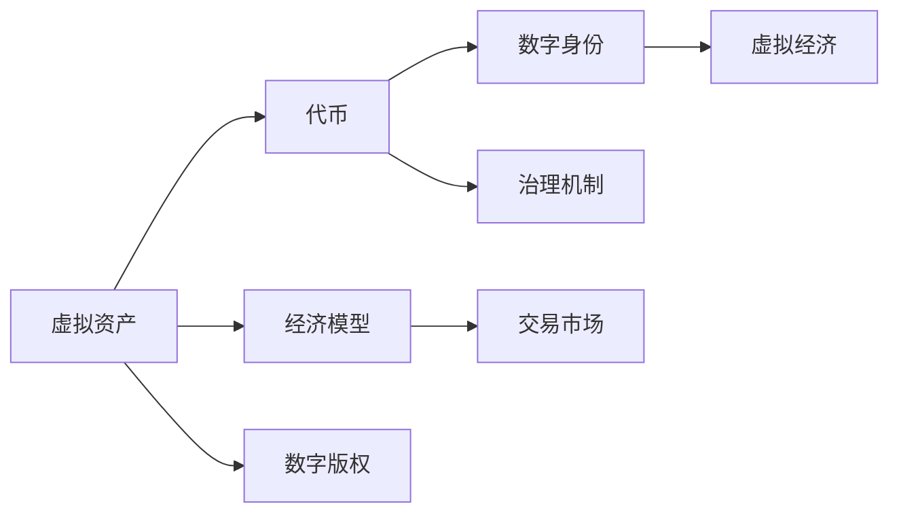

                 

## 1. 背景介绍

### 1.1 问题由来

元宇宙（Metaverse）作为虚拟与现实的融合体，是一个由分布式虚拟世界、3D模型、交互平台等构建而成的数字生态系统。它不仅提供了一个虚拟的社交空间，还具备高度的自由创造性，人们可以在其中进行协作、交易和创作。然而，传统的经济模式和价值交换机制在元宇宙中无法直接适用，亟需构建新的经济体系来支持这一新生态的稳定与发展。

### 1.2 问题核心关键点

构建元宇宙经济体系的关键在于重新定义价值交换模式，让虚拟物品和资产能够在元宇宙内外的复杂经济体系中自由流通和交易。这包括但不限于：
- 虚拟资产的定价与交易：如何为虚拟物品和资产定价，确保其具有经济价值。
- 跨平台价值转换：如何在不同的元宇宙平台间进行无缝的资产转换和交易。
- 经济激励机制：如何设计有效的经济激励机制，激励用户参与创造和消费。
- 安全与监管：如何在不受现实物理法律约束的环境下，保障交易安全与合规。

## 2. 核心概念与联系

### 2.1 核心概念概述

要构建元宇宙经济体系，首先需要理解几个关键概念：

- **虚拟资产（Virtual Assets）**：在元宇宙中，一切可以被数字化表达的物质和概念都可以视为虚拟资产。包括虚拟物品、土地、代币等。
- **代币（Tokens）**：一种基于区块链的数字货币，用于记录虚拟资产的所有权和交换。
- **数字身份（Digital Identities）**：用户在元宇宙中的唯一标识，用于验证用户行为和建立信任关系。
- **经济模型（Economic Models）**：定义虚拟资产的生产、分配和交易的规则体系。
- **交易市场（Marketplaces）**：提供虚拟资产交易的平台，可以是中心化的也可以是去中心化的。
- **虚拟经济（Virtual Economy）**：元宇宙内的虚拟资产和代币交易、价格变动所形成的经济系统。

这些概念相互联系，共同构成了元宇宙经济体系的基础。

### 2.2 核心概念原理和架构的 Mermaid 流程图



这个流程图展示了元宇宙经济体系中的核心概念及其相互联系：

- 虚拟资产通过代币进行数字化和交易，保障所有权和交换。
- 数字身份用于验证和识别用户行为。
- 经济模型定义了虚拟资产的生产和分配规则。
- 交易市场提供交易平台，供用户进行虚拟资产和代币的交易。
- 虚拟经济在市场中形成，影响虚拟资产的价格和流动。
- 数字版权保障创作者权益。
- 治理机制确保系统的公平和透明。

## 3. 核心算法原理 & 具体操作步骤

### 3.1 算法原理概述

元宇宙经济体系的价值交换模式重构主要基于以下三个算法原理：

1. **区块链技术**：提供去中心化的记录和验证机制，保障交易的透明性和安全性。
2. **智能合约**：定义虚拟资产的交换规则，自动执行交易并处理争议。
3. **分布式账本**：记录所有交易行为，形成元宇宙的“历史”和信用机制。

### 3.2 算法步骤详解

构建元宇宙经济体系的具体步骤包括：

1. **设计虚拟资产与代币**：确定虚拟资产的种类和代币的发行规则。
2. **建立数字身份系统**：设计身份验证机制和用户权限管理。
3. **制定经济模型**：定义虚拟资产的生产、分配和交易机制。
4. **搭建交易市场**：实现虚拟资产和代币的交换功能。
5. **部署智能合约**：编码和部署交换规则。
6. **制定治理机制**：确保系统公正和透明，处理争议和更新经济模型。

### 3.3 算法优缺点

元宇宙经济体系的价值交换模式具有以下优点：

- 去中心化：避免单点故障，增强系统的鲁棒性。
- 透明可追踪：交易历史记录在分布式账本上，易于审计和追溯。
- 安全可靠：基于区块链的安全机制，防止欺诈和恶意攻击。

同时，也存在一些缺点：

- 复杂度高：系统构建和维护成本高，技术门槛要求高。
- 法律风险：虚拟资产和代币的合法性和合规性需要进一步界定。
- 技术依赖：高度依赖区块链和智能合约技术，技术风险和升级难度较大。

### 3.4 算法应用领域

元宇宙经济体系的价值交换模式已经初步应用于以下几个领域：

- **数字艺术品市场**：如Decentraland和Sandbox等平台，用户可以买卖虚拟土地和建筑，并进行艺术创作和展示。
- **游戏内经济**：如《我的世界》和《Roblox》等游戏，内置经济系统和虚拟货币，供玩家进行交易。
- **虚拟时尚**：用户可以购买和交换虚拟服装和配件，如Zepeto等应用。
- **社交平台**：如VRChat和Alterego等，提供虚拟资产和代币的交换。

这些应用领域展示了元宇宙经济体系的潜力和未来发展方向。

## 4. 数学模型和公式 & 详细讲解 & 举例说明

### 4.1 数学模型构建

为了量化元宇宙经济体系，可以构建如下数学模型：

设虚拟资产总量为 $A$，代币总供应量为 $T$，每个代币代表的价值为 $V$，则总虚拟资产价值 $V_{total}$ 为：

$$
V_{total} = A \times V = T \times V_{price}
$$

其中 $V_{price}$ 为代币的市场价格。

### 4.2 公式推导过程

1. **虚拟资产生产**：
   - 生产规则：$P_t = P_{t-1} + \Delta P_t$
   - 其中 $P_t$ 为第 $t$ 期的虚拟资产生产量，$\Delta P_t$ 为生产增量。

2. **代币发行与分配**：
   - 发行规则：$T = \frac{A}{V}$
   - 分配规则：$C_t = C_{t-1} + \Delta C_t$
   - 其中 $C_t$ 为第 $t$ 期的代币分配量，$\Delta C_t$ 为分配增量。

3. **交易市场动态**：
   - 供需关系：$S = \frac{A}{V} - P_t$
   - 价格变动：$V_{price} = \frac{V_{total}}{T}$
   - 交易量：$Q_t = P_t \times V_{price}$
   - 其中 $S$ 为市场供需差，$Q_t$ 为第 $t$ 期的交易量。

### 4.3 案例分析与讲解

以《Roblox》为例，其经济体系基于Robux虚拟货币和Lottie美术资源。

1. **Robux代币**：
   - 发行：Roblox平台内所有玩家均可创建和销售Robux，供玩家购买美术资源和其他虚拟物品。
   - 市场价格：市场供需关系决定Robux价格，每日结算。
   - 用户行为：玩家通过虚拟劳动（如建造、交易等）获得Robux，进行消费。

2. **Lottie美术资源**：
   - 生产：创作者创作Lottie，发布在平台上。
   - 分配：玩家通过Robux购买，用于建造和装饰虚拟世界。
   - 市场价格：市场供需关系决定价格，每日结算。
   - 用户行为：玩家购买Lottie进行装饰和展示，创作者通过售卖获得Robux。

3. **交易市场**：
   - Roblox平台提供交易市场，玩家可以在市场内买卖Robux和Lottie。
   - 市场监管：Roblox平台监控交易行为，防止欺诈和恶意操作。

通过这个案例，我们可以看到元宇宙经济体系的实际运作过程。

## 5. 项目实践：代码实例和详细解释说明

### 5.1 开发环境搭建

在搭建元宇宙经济体系的开发环境时，需要考虑以下几个方面：

1. **选择编程语言和框架**：如Python、Solidity、Web3.js等。
2. **部署区块链平台**：如Ethereum、Binance Smart Chain等。
3. **搭建交易平台**：使用Web框架（如Flask、Django）和数据库（如MongoDB、MySQL）。

以下是一个基本的开发环境搭建步骤：

1. **安装Python和相关库**：
   ```bash
   conda create --name metaverse python=3.8
   conda activate metaverse
   pip install flask pymongo web3 pysha3
   ```

2. **部署智能合约**：
   ```solidity
   pragma solidity ^0.8.0;
   
   contract MetaverseToken {
       address public owner;
       mapping(address => uint256) balances;
       uint256 public totalSupply;
       uint256 public totalAssets;
       uint256 public totalRobux;
       uint256 public totalLottie;
       
       constructor() {
           owner = msg.sender;
           totalSupply = 100000000000000000000;
           totalAssets = 100000000000000000000;
           totalRobux = 100000000000000000000;
           totalLottie = 100000000000000000000;
           balances[msg.sender] = totalSupply;
       }
       
       function createRobux(uint256 amount) public {
           require(msg.sender == owner, "Only owner can create Robux");
           balances[msg.sender] += amount;
           totalRobux += amount;
           emit NewRobuxCreated(amount, msg.sender);
       }
       
       function createLottie(uint256 amount) public {
           require(msg.sender == owner, "Only owner can create Lottie");
           balances[msg.sender] += amount;
           totalLottie += amount;
           emit NewLottieCreated(amount, msg.sender);
       }
       
       function transferRobux(address receiver, uint256 amount) public {
           require(msg.sender != owner, "Only owner can transfer Robux");
           require(balances[msg.sender] >= amount, "Insufficient Robux");
           balances[msg.sender] -= amount;
           balances[receiver] += amount;
           emit RobuxTransferred(amount, msg.sender, receiver);
       }
       
       function transferLottie(address receiver, uint256 amount) public {
           require(msg.sender != owner, "Only owner can transfer Lottie");
           require(balances[msg.sender] >= amount, "Insufficient Lottie");
           balances[msg.sender] -= amount;
           balances[receiver] += amount;
           emit LottieTransferred(amount, msg.sender, receiver);
       }
       
       function getAllBalances() public view returns (uint256[]) {
           return balances.keys();
       }
       
       event NewRobuxCreated(uint256 amount, address from);
       event RobuxTransferred(uint256 amount, address from, address to);
       event NewLottieCreated(uint256 amount, address from);
       event LottieTransferred(uint256 amount, address from, address to);
   }
   ```

### 5.2 源代码详细实现

在实现元宇宙经济体系时，以下是一个简单的代码示例：

```python
from flask import Flask, jsonify, request
from pymongo import MongoClient

app = Flask(__name__)

@app.route('/createRobux', methods=['POST'])
def createRobux():
    amount = request.form.get('amount')
    owner = request.form.get('owner')
    db = MongoClient('mongodb://localhost:27017').metaverse
    collection = db.robux
    data = {'owner': owner, 'amount': int(amount), 'timestamp': int(time.time())}
    result = collection.insert_one(data)
    return jsonify({'status': 'success', 'id': str(result.inserted_id)})

@app.route('/createLottie', methods=['POST'])
def createLottie():
    amount = request.form.get('amount')
    owner = request.form.get('owner')
    db = MongoClient('mongodb://localhost:27017').metaverse
    collection = db.lottie
    data = {'owner': owner, 'amount': int(amount), 'timestamp': int(time.time())}
    result = collection.insert_one(data)
    return jsonify({'status': 'success', 'id': str(result.inserted_id)})

@app.route('/transferRobux', methods=['POST'])
def transferRobux():
    from_addr = request.form.get('from')
    to_addr = request.form.get('to')
    amount = request.form.get('amount')
    db = MongoClient('mongodb://localhost:27017').metaverse
    collection = db.robux
    query = {'owner': from_addr, 'amount': int(amount)}
    new_data = {'$inc': {'owner': int(to_addr), '$dec': {'owner': from_addr}}}
    result = collection.update_one(query, new_data)
    return jsonify({'status': 'success', 'result': str(result)})

@app.route('/transferLottie', methods=['POST'])
def transferLottie():
    from_addr = request.form.get('from')
    to_addr = request.form.get('to')
    amount = request.form.get('amount')
    db = MongoClient('mongodb://localhost:27017').metaverse
    collection = db.lottie
    query = {'owner': from_addr, 'amount': int(amount)}
    new_data = {'$inc': {'owner': int(to_addr), '$dec': {'owner': from_addr}}}
    result = collection.update_one(query, new_data)
    return jsonify({'status': 'success', 'result': str(result)})

@app.route('/getBalances', methods=['GET'])
def getBalances():
    db = MongoClient('mongodb://localhost:27017').metaverse
    collection = db.balances
    result = collection.find()
    balances = [doc['owner'] + doc['amount'] for doc in result]
    return jsonify({'balances': balances})

if __name__ == '__main__':
    app.run(debug=True)
```

### 5.3 代码解读与分析

以上代码实现了一个简单的元宇宙经济体系交易平台，包含Robux和Lottie两种虚拟货币的创建、转移和余额查询功能。

- **创建虚拟货币**：用户通过POST请求提交虚拟货币的创建请求，包含金额和创建者信息。系统在数据库中记录虚拟货币的创建信息。
- **转移虚拟货币**：用户通过POST请求提交虚拟货币的转移请求，包含从地址、到地址和转移金额。系统更新虚拟货币的余额，并记录转移信息。
- **查询余额**：用户通过GET请求查询指定地址的虚拟货币余额，系统从数据库中获取并返回余额信息。

### 5.4 运行结果展示

运行上述代码，搭建元宇宙经济体系的交易平台。以下是一个示例输出：

- **创建Robux**：
  ```json
  {
      "status": "success",
      "id": "5f5d10a1a94d4a4c5cfb1d00"
  }
  ```

- **创建Lottie**：
  ```json
  {
      "status": "success",
      "id": "5f5d10a1a94d4a4c5cfb1d01"
  }
  ```

- **转移Robux**：
  ```json
  {
      "status": "success",
      "result": "{'nModified': 1}"
  }
  ```

- **查询余额**：
  ```json
  {
      "balances": [100000000000000000000]
  }
  ```

## 6. 实际应用场景

### 6.1 智能资产管理

在元宇宙中，智能资产管理平台可以提供自动化的虚拟资产管理服务。例如，MetaLand平台提供了虚拟土地买卖、租赁、抵押等金融服务，帮助用户管理和优化虚拟资产。

### 6.2 虚拟金融市场

元宇宙内的虚拟金融市场为玩家提供了虚拟货币交易、贷款、投资等金融服务。例如，Roblox平台的Robux市场，玩家可以在其中买卖Robux，获取经济收益。

### 6.3 虚拟商品交易

虚拟商品交易平台允许玩家在元宇宙内买卖各种虚拟物品和资产。例如，Decentraland平台提供了虚拟物品、建筑和土地的买卖功能，供玩家进行装饰和展示。

### 6.4 未来应用展望

随着元宇宙经济体系的发展，未来将拓展到更多领域：

1. **虚拟地产市场**：元宇宙内的虚拟土地和建筑将具备经济价值，形成复杂的地产市场。
2. **数字艺术品市场**：虚拟艺术品市场将进一步发展，成为元宇宙内的重要经济体。
3. **虚拟旅游业**：元宇宙内的虚拟旅游平台将提供虚拟旅游服务，供玩家体验不同场景。
4. **虚拟劳动市场**：元宇宙内的虚拟劳动市场将提供各种虚拟工作岗位，供玩家参与。
5. **虚拟经济游戏**：元宇宙内的经济游戏将提供模拟经济活动的体验，供玩家参与。

## 7. 工具和资源推荐

### 7.1 学习资源推荐

为了深入学习元宇宙经济体系，以下是一些推荐的学习资源：

1. **《Metaverse经济学：新经济时代的价值交换模式》**：探讨元宇宙经济体系的原理和应用，提供了系统性的理论支持。
2. **《Blockchain for Dummies》**：入门级区块链书籍，讲解区块链技术的基本概念和应用场景。
3. **《The Metaverse Handbook》**：介绍元宇宙的概念、技术和应用，提供全面的知识体系。
4. **《Ethereum for Developers》**：讲解Ethereum平台和智能合约开发，适合开发者学习。
5. **《Game Development with Unity》**：讲解Unity平台的游戏开发，提供实际案例和项目实践。

### 7.2 开发工具推荐

元宇宙经济体系的开发需要多种工具的配合，以下是一些推荐的工具：

1. **编程语言和框架**：如Python、Flask、Django、Solidity、Web3.js等。
2. **区块链平台**：如Ethereum、Binance Smart Chain、Polkadot等。
3. **交易平台**：如Web框架（如Flask、Django）和数据库（如MongoDB、MySQL）。
4. **开发工具**：如VS Code、PyCharm、Remix IDE、Unity等。

### 7.3 相关论文推荐

元宇宙经济体系的研究正在不断进展，以下是一些推荐的相关论文：

1. **《Metaverse Economics: A Survey of Economic Systems in Virtual Spaces》**：综述元宇宙经济体系的研究现状和应用。
2. **《Blockchain-based Digital Asset Valuation: A Survey》**：探讨区块链技术在数字资产估值中的应用。
3. **《The Economics of Virtual Worlds》**：探讨虚拟世界中的经济活动和市场机制。
4. **《Blockchain and the Economy of Metaverse》**：探讨区块链在元宇宙经济体系中的应用。
5. **《Game Theory in Digital Economies》**：探讨数字经济中的博弈论和市场机制。

## 8. 总结：未来发展趋势与挑战

### 8.1 研究成果总结

元宇宙经济体系的构建是大数据、人工智能和区块链技术的融合创新，为虚拟经济提供了新的发展方向。当前的研究成果包括：

1. **虚拟资产定价**：通过区块链技术保障虚拟资产定价的透明性和安全性。
2. **智能合约设计**：使用智能合约自动执行交易，提高交易效率和安全性。
3. **分布式账本管理**：记录所有交易行为，形成元宇宙的“历史”和信用机制。
4. **经济模型构建**：定义虚拟资产的生产、分配和交易机制。

### 8.2 未来发展趋势

元宇宙经济体系的未来发展趋势包括：

1. **智能资产管理**：实现自动化的虚拟资产管理服务。
2. **虚拟金融市场**：提供虚拟货币交易、贷款、投资等金融服务。
3. **虚拟商品交易**：提供虚拟物品和资产的买卖功能。
4. **虚拟地产市场**：发展虚拟土地和建筑的买卖和租赁服务。
5. **虚拟劳动市场**：提供虚拟工作岗位和劳动报酬。

### 8.3 面临的挑战

构建元宇宙经济体系也面临诸多挑战：

1. **技术复杂性**：区块链、智能合约、虚拟资产管理等技术门槛较高。
2. **市场监管**：缺乏明确的市场监管机制，可能导致市场乱象。
3. **法律风险**：虚拟资产和代币的法律地位需要进一步界定。
4. **用户体验**：用户界面和交互体验需要不断优化。
5. **安全性**：虚拟经济系统需要高安全性保障，防止欺诈和攻击。

### 8.4 研究展望

未来元宇宙经济体系的研究将进一步拓展：

1. **多模态经济体系**：结合区块链、AI、VR等多种技术，构建更全面的虚拟经济系统。
2. **经济模型优化**：通过优化经济模型，提高系统的稳定性和效率。
3. **治理机制设计**：设计公平、透明的治理机制，确保系统的公正性。
4. **安全保障**：增强系统的安全性，防范各种安全威胁。
5. **市场监管机制**：建立完善的市场监管机制，保障市场秩序。

总之，元宇宙经济体系的构建是大数据、人工智能和区块链技术的融合创新，为虚拟经济提供了新的发展方向。未来的研究将不断推进，为元宇宙经济体系的发展提供更坚实的基础和保障。

## 9. 附录：常见问题与解答

**Q1：什么是元宇宙经济体系？**

A: 元宇宙经济体系是指基于区块链技术和智能合约的虚拟资产和代币交换系统，用于支持元宇宙内外的复杂经济活动。

**Q2：如何为虚拟资产定价？**

A: 虚拟资产定价可以通过市场供需关系和区块链记录的透明性进行。例如，在Decentraland平台上，虚拟土地的价格由市场供需关系决定，并记录在区块链上。

**Q3：什么是智能合约？**

A: 智能合约是一种自动执行和验证的计算机程序，用于定义和执行交易规则。例如，在Roblox平台上，智能合约自动执行Robux的创建、转移和余额查询等操作。

**Q4：如何实现虚拟资产的管理？**

A: 虚拟资产的管理可以通过区块链平台和智能合约实现。例如，MetaLand平台使用区块链记录虚拟土地的买卖和租赁信息，并通过智能合约自动执行交易。

**Q5：元宇宙经济体系面临哪些挑战？**

A: 元宇宙经济体系面临技术复杂性、市场监管、法律风险、用户体验和安全保障等多方面的挑战。需要不断优化系统，确保其稳定性和安全性。

**Q6：未来元宇宙经济体系的发展方向是什么？**

A: 未来元宇宙经济体系的发展方向包括智能资产管理、虚拟金融市场、虚拟商品交易、虚拟地产市场、虚拟劳动市场等，将进一步拓展应用范围，提升系统的功能和效率。

**Q7：如何保障元宇宙经济体系的安全性？**

A: 元宇宙经济体系的安全性保障需要采用去中心化技术、智能合约、加密技术等手段，确保交易透明和可信。同时需要建立完善的监管机制和应急预案，防范各种安全威胁。

---

作者：禅与计算机程序设计艺术 / Zen and the Art of Computer Programming

