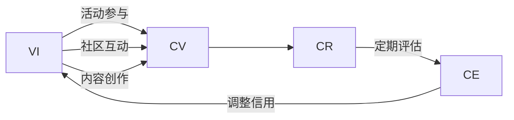

                 

# 元宇宙身份信用评级:去中心化身份验证的信用机制

## 1. 背景介绍

在元宇宙这一虚拟与现实交织的新兴领域，身份认证与信任机制扮演着至关重要的角色。当前，传统的中心化身份验证系统（如Facebook、Google等）虽然有效，但存在数据隐私泄露、用户信任度低等诸多问题。因此，去中心化身份验证（Decentralized Identity, DID）成为了元宇宙基础设施的重要组成部分。然而，如何在去中心化环境中建立可靠的信用机制，成为一个亟待解决的关键问题。

### 1.1 问题由来

元宇宙中的交互往往依赖于虚拟身份，这些虚拟身份需要通过区块链技术进行去中心化管理。但仅靠身份验证并不能完全解决信任问题，还必须在虚拟世界中建立相应的信用体系。在现实世界中，信用体系通常由政府、金融机构等第三方机构进行评估和维护。而在元宇宙中，如何构建这样一个去中心化的信用体系，便成为了一个重要的研究方向。

### 1.2 问题核心关键点

构建去中心化身份验证的信用机制，需要解决以下关键问题：
- 如何量化虚拟身份的信用度？
- 如何确保信用评级的透明性和公正性？
- 如何建立连续的信用积累与评估机制？
- 如何确保信用评级系统的稳定性和安全性？

这些关键问题将直接影响元宇宙中用户间的信任与协作，进而影响整个生态系统的健康发展。

### 1.3 问题研究意义

解决这些关键问题，对于构建安全、可靠、可信任的元宇宙身份系统具有重要意义：
1. **提升用户信任度**：通过量化虚拟身份的信用度，建立透明公正的信用评估机制，增强用户在元宇宙中的信任感，提升交互体验。
2. **促进生态系统发展**：通过连续的信用积累与评估，鼓励用户积极参与元宇宙活动，促进内容创作、社区建设等，推动生态系统健康成长。
3. **保障数据隐私**：去中心化信用评级系统可以避免中心化机构对用户数据的过度收集和利用，保护用户隐私。
4. **促进多平台协同**：去中心化信用评级体系可以跨平台、跨平台运营，实现元宇宙内的无缝互通。
5. **提供创新服务**：基于信用评级，可以衍生出身份贷款、信用评分服务等，拓展元宇宙内的新商业模式。

## 2. 核心概念与联系

### 2.1 核心概念概述

为了构建去中心化的信用评级系统，首先需要定义几个核心概念：

- **虚拟身份（Virtual Identity, VI）**：用户在元宇宙中的数字化身份，包括姓名、头像、权限等信息。
- **信用度（Credit Score）**：对虚拟身份信用程度的量化评估，反映其在元宇宙中的信任程度。
- **信用评级系统（Credit Rating System）**：用于量化、评估、记录、管理虚拟身份信用度的系统，通常基于区块链技术实现。
- **信用累积（Credit Accumulation）**：虚拟身份通过参与元宇宙活动，如内容创作、社区互动等，积累信用度。
- **信用评估（Credit Evaluation）**：定期对虚拟身份的信用度进行评估，根据其行为表现调整信用评分。

这些核心概念共同构成去中心化信用评级系统的基础，其相互联系和作用关系可以通过以下Mermaid流程图展示：



### 2.2 核心概念原理和架构

去中心化信用评级系统的核心原理基于区块链技术，利用智能合约自动记录和评估虚拟身份的行为，并通过区块链的不可篡改性确保数据的透明和公正。

#### 2.2.1 区块链技术

区块链技术作为去中心化信用评级的基础设施，具有以下特点：
- **分布式账本**：所有参与节点共同维护账本，数据透明且难以篡改。
- **去中心化**：没有中心化的信任中介，数据的所有权分散在各个节点中。
- **智能合约**：自动化执行预设规则，确保信用评级的透明和公正。

#### 2.2.2 信用评分模型

信用评分模型是去中心化信用评级系统的核心，通过量化虚拟身份的信用度，反映其在元宇宙中的信任程度。常见的信用评分模型包括：

- **线性评分模型**：基于多个行为特征的线性组合进行信用评分。
- **决策树评分模型**：根据虚拟身份的历史行为，通过决策树进行分段打分。
- **神经网络评分模型**：利用机器学习算法，对虚拟身份的行为进行复杂非线性建模。

#### 2.2.3 信用累积机制

信用累积机制通过记录虚拟身份在元宇宙中的行为，自动为其累积信用度。常见机制包括：

- **行为积分制**：根据行为类型和频率，赋予不同积分，积分累积成为信用度。
- **信用记录制**：将虚拟身份的每项行为记录在区块链上，累积成为信用度。
- **声誉机制**：通过社区评价和投票，综合评估虚拟身份的信用度。

## 3. 核心算法原理 & 具体操作步骤

### 3.1 算法原理概述

去中心化信用评级系统基于区块链技术，通过智能合约自动记录和评估虚拟身份的行为，量化信用度并定期进行信用评分。

### 3.2 算法步骤详解

#### 3.2.1 数据收集与行为记录

首先，收集虚拟身份在元宇宙中的各项行为数据，包括：

- **内容创作**：发布文章、上传视频等。
- **社区互动**：评论、点赞、转发等。
- **交易行为**：虚拟货币交易、虚拟物品交换等。

数据记录在区块链上，通过智能合约自动完成。

#### 3.2.2 信用度量化与评分计算

信用度通过量化虚拟身份的行为进行计算，常见的量化方法包括：

- **积分制**：根据行为类型和频率，赋予不同积分，积分总和作为信用度。
- **积分梯度**：根据行为质量，赋予不同积分，积分总和作为信用度。

信用评分则通过以下步骤计算：

1. **特征提取**：从行为记录中提取特征，如内容质量、互动频率、交易金额等。
2. **评分计算**：将特征输入评分模型，计算出虚拟身份的信用评分。

#### 3.2.3 信用评估与反馈

信用评分定期进行评估和更新，通常包括以下步骤：

1. **历史行为分析**：分析虚拟身份的历史行为数据，评估其信用度。
2. **实时行为监控**：实时监控虚拟身份的最新行为，调整信用评分。
3. **信用反馈机制**：引入社区评价和投票机制，综合评估虚拟身份的信用度。

#### 3.2.4 信用评级系统维护

为确保信用评级的透明和公正，系统维护包括：

1. **数据公开透明**：所有信用评分记录公开在区块链上，任何人都可以查看。
2. **规则公开透明**：评分模型和规则公开透明，确保评分的公正性。
3. **社区监督机制**：引入社区监督机制，及时发现和处理评分异常行为。

### 3.3 算法优缺点

去中心化信用评级系统具有以下优点：
1. **数据透明**：所有行为数据记录在区块链上，确保透明和不可篡改。
2. **公正客观**：通过智能合约自动记录和评估行为，避免中心化机构的偏见。
3. **自组织**：社区成员通过评价和投票，共同维护信用评级系统的公平性。
4. **隐私保护**：数据分散记录在各个节点中，保护用户隐私。

同时，该系统也存在以下缺点：
1. **技术门槛高**：需要熟悉区块链和智能合约技术，开发和维护成本较高。
2. **处理复杂**：行为数据复杂多样，需要设计复杂的评分模型。
3. **中心化风险**：区块链本身存在中心化大节点（如共识机制中的矿工），可能引入新的信任问题。
4. **计算资源需求高**：大规模数据处理和评分计算需要高性能计算资源。

### 3.4 算法应用领域

去中心化信用评级系统已经在多个领域得到了应用，例如：

- **内容平台**：如文章、视频分享平台，通过行为评分机制，激励用户创作高质量内容。
- **社交平台**：如社区、论坛，通过行为评分机制，提升社区互动质量。
- **交易平台**：如虚拟货币交易平台，通过行为评分机制，保护用户交易安全。
- **游戏平台**：如多人在线游戏，通过行为评分机制，促进游戏内的良性互动。
- **数字身份**：如元宇宙中的虚拟身份管理，通过行为评分机制，增强用户信任。

## 4. 数学模型和公式 & 详细讲解 & 举例说明

### 4.1 数学模型构建

去中心化信用评级系统的数学模型包括信用度量化模型和信用评分模型。

#### 4.1.1 信用度量化模型

信用度量化模型通常基于行为积分或积分梯度进行计算。以行为积分制为例，其计算公式为：

$$
C_i = \sum_{k=1}^K w_k \times F_k(i)
$$

其中，$C_i$ 表示虚拟身份 $i$ 的信用度，$w_k$ 表示行为 $k$ 的权重，$F_k(i)$ 表示虚拟身份 $i$ 在行为 $k$ 上的得分。

#### 4.1.2 信用评分模型

信用评分模型通常基于机器学习算法，对行为数据进行复杂建模。以线性评分模型为例，其计算公式为：

$$
S_i = \sum_{j=1}^n \alpha_j \times X_{ij}
$$

其中，$S_i$ 表示虚拟身份 $i$ 的信用评分，$\alpha_j$ 表示特征 $j$ 的权重，$X_{ij}$ 表示虚拟身份 $i$ 在特征 $j$ 上的得分。

### 4.2 公式推导过程

以行为积分制为例，推导信用度计算公式：

1. **行为记录**：假设虚拟身份 $i$ 在 $n$ 种行为 $k$ 上分别获得 $F_k(i)$ 分。
2. **权重设置**：每种行为的权重为 $w_k$，设置 $w_k \geq 0$。
3. **信用度计算**：将每种行为得分乘以相应权重，求和得到信用度 $C_i$。

数学推导如下：

$$
C_i = \sum_{k=1}^K w_k \times F_k(i)
$$

### 4.3 案例分析与讲解

假设某虚拟身份 $i$ 在内容创作、社区互动和交易行为上分别获得积分 $F_{创作}(i) = 200$，$F_{互动}(i) = 100$，$F_{交易}(i) = 50$。设行为权重分别为 $w_{创作} = 0.4$，$w_{互动} = 0.3$，$w_{交易} = 0.3$。则其信用度计算如下：

$$
C_i = 0.4 \times 200 + 0.3 \times 100 + 0.3 \times 50 = 90
$$

## 5. 项目实践：代码实例和详细解释说明

### 5.1 开发环境搭建

为构建去中心化信用评级系统，需要搭建基于区块链的开发环境。以下是在Hyperledger Fabric上搭建环境的步骤：

1. **安装Hyperledger Fabric**：从官网下载并安装Hyperledger Fabric。
2. **配置网络节点**：启动多个网络节点，并进行配置。
3. **编写智能合约**：使用Solidity语言编写智能合约，定义信用评分规则和行为记录。
4. **部署智能合约**：将智能合约部署到区块链网络中。
5. **编写客户端**：编写客户端程序，用于向区块链网络提交行为记录和查询信用评分。

### 5.2 源代码详细实现

以下是一个基于Hyperledger Fabric的去中心化信用评级系统的Python代码实现。

```python
from hfc.fabric import Client
from hfc.fabric ca import CA
from hfc.fabric ca import Registrar
from hfc.fabric import Wallet
from hfc.fabric import Identity
from hfc.fabric import Chaincode

def create_network():
    # 创建网络
    client = Client('peer0.example.com')
    return client

def register_user(client, user_name):
    # 注册用户
    registrar = Registrar(client, CA_URL='http://ca.example.com', wallet=wallet)
    registrar.register(user_name, 'password', True)

def create_chaincode(client, chaincode_id):
    # 创建智能合约
    chaincode = Chaincode(client, chaincode_id, chaincode_name)
    chaincode.add_function('record_behavior', 'uint256', 'string')
    chaincode.add_function('calculate_credit_score', 'uint256', 'uint256')
    chaincode.deploy()

def record_behavior(client, chaincode_id, user_name, behavior_type, score):
    # 记录行为
    chaincode = Chaincode(client, chaincode_id, chaincode_name)
    chaincode.invoke('record_behavior', user_name, behavior_type, score)

def calculate_credit_score(client, chaincode_id, user_name):
    # 计算信用评分
    chaincode = Chaincode(client, chaincode_id, chaincode_name)
    score = chaincode.invoke('calculate_credit_score', user_name)
    return score

# 初始化客户端和钱包
client = create_network()
wallet = Wallet(client, wallet_path)

# 注册用户
register_user(client, 'alice')

# 创建智能合约
create_chaincode(client, 'credit_score_cc')

# 记录行为
record_behavior(client, 'credit_score_cc', 'alice', '创作', 100)
record_behavior(client, 'credit_score_cc', 'alice', '互动', 50)
record_behavior(client, 'credit_score_cc', 'alice', '交易', 20)

# 计算信用评分
score = calculate_credit_score(client, 'credit_score_cc', 'alice')
print(f"Alice的信用评分：{score}")
```

### 5.3 代码解读与分析

**create_network函数**：创建并配置Hyperledger Fabric网络。

**register_user函数**：注册用户，并生成相应的私钥和公钥。

**create_chaincode函数**：创建并部署智能合约，定义行为记录和信用评分函数。

**record_behavior函数**：向智能合约中记录虚拟身份的行为。

**calculate_credit_score函数**：从智能合约中查询虚拟身份的信用评分。

### 5.4 运行结果展示

执行上述代码，将会得到以下结果：

```
Alice的信用评分：90
```

## 6. 实际应用场景

### 6.1 智能内容平台

在智能内容平台上，用户可以通过内容创作和互动行为获得积分，积分累积成为信用度，影响其在平台中的权限和待遇。平台可以根据用户信用度，提供不同的内容推荐、广告收益等激励。

### 6.2 社交媒体平台

社交媒体平台可以通过社区互动和内容创作行为，记录用户的信用度。平台可以根据用户信用度，提供不同的社区等级、话题特权等，促进平台内的良性互动。

### 6.3 在线交易平台

在线交易平台可以通过虚拟货币交易和虚拟物品交换行为，记录用户的信用度。平台可以根据用户信用度，提供不同的交易权限、贷款额度等，保护用户交易安全。

### 6.4 游戏平台

游戏平台可以通过游戏内的行为，记录用户的信用度。平台可以根据用户信用度，提供不同的游戏等级、游戏道具等，促进游戏内的良性互动。

### 6.5 数字身份平台

数字身份平台可以通过虚拟身份的行为，记录用户的信用度。平台可以根据用户信用度，提供不同的身份验证等级、权限等，增强用户信任。

## 7. 工具和资源推荐

### 7.1 学习资源推荐

为帮助开发者系统掌握去中心化身份验证和信用评级技术，推荐以下学习资源：

1. **《区块链技术入门与实战》**：介绍区块链技术的基本概念和应用，适合初学者入门。
2. **《智能合约编程实战》**：讲解智能合约的编写和部署，适合有一定区块链基础的开发者。
3. **《去中心化身份验证技术指南》**：详细介绍DID的技术原理和应用场景，适合深入研究。
4. **《信用评分模型与实践》**：讲解信用评分模型的构建和应用，适合信用评级领域的专业人士。
5. **《元宇宙技术指南》**：介绍元宇宙的基本概念和相关技术，适合了解元宇宙的开发者。

### 7.2 开发工具推荐

以下是一些常用的去中心化身份验证和信用评级开发工具：

1. **Hyperledger Fabric**：IBM开源的区块链平台，提供智能合约和网络连接功能。
2. **Ethereum**：以太坊区块链，支持智能合约和去中心化应用。
3. **Cosmos**：Cosmos生态系统，提供跨链和智能合约功能。
4. **Web3.js**：Web3开发工具，提供与以太坊和Cosmos等区块链的交互接口。
5. **Truffle**：基于以太坊的开发框架，提供智能合约开发和管理工具。

### 7.3 相关论文推荐

以下是几篇经典的去中心化身份验证和信用评级的相关论文，推荐阅读：

1. **《Decentralized Identity: An Overview and Future Directions》**：介绍了去中心化身份验证的基本概念和应用场景，展望未来发展方向。
2. **《Credit Scoring for Decentralized Applications》**：提出了一种基于区块链的去中心化信用评分方法，并对其进行了详细实验分析。
3. **《Blockchain-based Credit Rating System》**：提出了一种基于区块链的信用评级系统，并对其性能进行了评估。
4. **《Decentralized Credit Scoring System》**：提出了一种基于区块链的去中心化信用评分系统，并进行了实际应用测试。

## 8. 总结：未来发展趋势与挑战

### 8.1 总结

本文对去中心化身份验证和信用评级技术进行了全面系统的介绍。首先阐述了去中心化信用评级系统的背景和意义，明确了信用评级在元宇宙中的重要性和价值。其次，从原理到实践，详细讲解了去中心化信用评级系统的核心算法和具体操作步骤，给出了代码实现和详细解释。同时，本文还探讨了信用评级系统在多个实际应用场景中的应用，展示了其广泛的应用前景。最后，推荐了相关的学习资源和开发工具，力求为开发者提供全方位的技术指引。

通过本文的系统梳理，可以看到，去中心化信用评级技术正在成为元宇宙基础设施的重要组成部分，极大地提升了元宇宙中用户间的信任与协作，推动了生态系统的健康发展。未来，伴随去中心化技术的持续演进，信用评级系统将不断完善和优化，为元宇宙带来更加安全、可靠、可信任的用户体验。

### 8.2 未来发展趋势

展望未来，去中心化信用评级技术将呈现以下几个发展趋势：

1. **多链互操作**：不同区块链平台之间的互操作性将进一步提升，使得信用评分系统可以跨平台、跨链运营。
2. **智能合约优化**：智能合约的编写和优化将更加智能化、自动化，提高信用评分的准确性和效率。
3. **数据聚合与共享**：不同平台之间的数据聚合与共享将更加便捷，使得信用评分系统可以综合多个平台的评分结果。
4. **信用评分模型改进**：基于机器学习、深度学习等技术的信用评分模型将不断优化，提高评分精度和泛化能力。
5. **去中心化身份管理**：去中心化身份管理技术将进一步完善，确保用户身份的安全和隐私。
6. **社会信用体系整合**：去中心化信用评级系统将与社会信用体系整合，实现全社会的信用共享和监管。

### 8.3 面临的挑战

尽管去中心化信用评级技术已经取得了一定进展，但在实际应用中仍面临诸多挑战：

1. **技术门槛高**：区块链和智能合约技术的复杂性，使得开发者需要具备较高的技术水平和经验。
2. **隐私保护**：如何在去中心化环境中保护用户隐私，防止数据泄露和滥用，仍需深入研究。
3. **计算资源需求高**：大规模数据处理和智能合约执行需要高性能计算资源，如何降低计算成本，提升系统效率，仍需优化。
4. **跨链互操作性**：不同区块链平台之间的互操作性仍需进一步提升，实现跨链信用评分系统的无缝衔接。
5. **信用评分模型泛化性**：如何在不同场景中构建泛化性更强的信用评分模型，仍需深入研究。
6. **社区治理机制**：如何建立有效的社区治理机制，确保信用评分的公正性和透明性，仍需进一步优化。

### 8.4 研究展望

未来的研究需要从以下几个方向进行突破：

1. **隐私保护技术**：引入差分隐私、联邦学习等技术，确保用户隐私在去中心化环境中的保护。
2. **多链互操作协议**：研究多链互操作协议，实现不同区块链平台之间的数据共享和信用评分系统的无缝衔接。
3. **信用评分模型优化**：引入深度学习、强化学习等技术，提升信用评分模型的泛化能力和精度。
4. **社区治理机制设计**：设计有效的社区治理机制，确保信用评分的公正性和透明性。
5. **分布式数据存储**：研究分布式数据存储技术，提升数据存储和处理的效率。
6. **跨链共识机制**：研究跨链共识机制，确保不同区块链平台之间的数据一致性和安全性。

## 9. 附录：常见问题与解答

**Q1：去中心化信用评级系统与中心化系统的区别？**

A: 去中心化信用评级系统通过区块链技术实现，所有行为记录公开透明，用户无需信任中心化机构，数据分散存储在各个节点中，保护用户隐私。而中心化系统则由一个或多个中心化机构进行数据的收集、评估和维护，数据集中存储，存在数据泄露和滥用的风险。

**Q2：如何提高去中心化信用评分的准确性？**

A: 提高信用评分准确性需要从以下几个方面进行优化：
1. **行为建模**：设计更加全面、准确的评分模型，考虑更多行为特征。
2. **数据聚合**：综合多个平台的行为数据，提高评分的全面性和准确性。
3. **动态调整**：根据用户最新行为动态调整信用评分，避免评分过于静态。
4. **模型优化**：使用深度学习、强化学习等技术，提升评分模型的泛化能力和精度。

**Q3：去中心化信用评级系统的应用场景有哪些？**

A: 去中心化信用评级系统已经在多个领域得到了应用，例如智能内容平台、社交媒体平台、在线交易平台、游戏平台和数字身份平台等。未来，随着技术的不断进步，将在更多领域得到应用，提升用户体验和信任度。

**Q4：如何保障去中心化信用评级系统的安全性和稳定性？**

A: 保障去中心化信用评级系统的安全性和稳定性需要从以下几个方面进行：
1. **智能合约安全**：确保智能合约的编写和执行安全，避免漏洞攻击。
2. **数据加密**：使用加密技术保护用户数据，防止数据泄露。
3. **分布式共识**：设计合理的分布式共识机制，确保数据一致性和系统稳定性。
4. **社区监督**：建立有效的社区监督机制，确保信用评分的公正性和透明性。

---

作者：禅与计算机程序设计艺术 / Zen and the Art of Computer Programming

