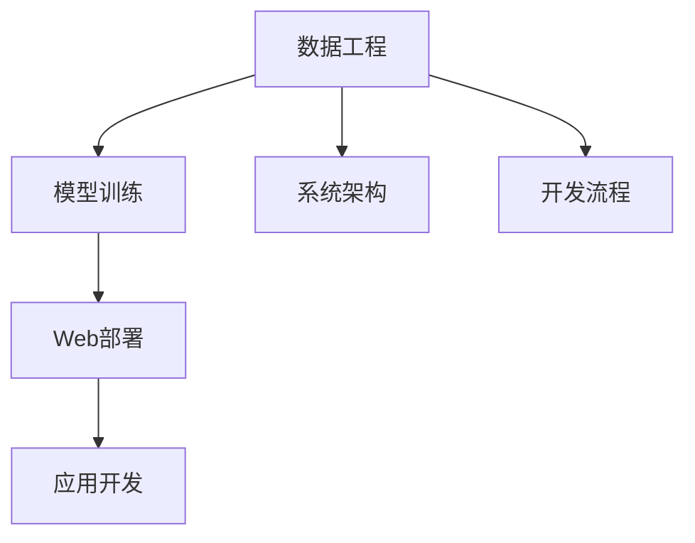

                 

# 全栈AI开发：从模型训练到Web部署

> 关键词：全栈AI, 模型训练, Web部署, 深度学习, 计算机视觉, 自然语言处理, 数据工程, 系统架构, 开发流程

## 1. 背景介绍

### 1.1 问题由来

随着人工智能技术的迅猛发展，越来越多的企业和科研机构开始引入AI技术来解决实际问题。然而，许多技术人员对AI技术的应用缺乏全面理解和系统掌握，往往无法将AI技术与具体业务场景无缝融合。全栈AI开发，即涵盖数据工程、模型训练、Web部署、应用开发等全链路的技术，是确保AI技术在实际应用中成功落地的关键。

### 1.2 问题核心关键点

全栈AI开发的核心在于将AI模型从实验室环境移植到实际生产环境，并融入到业务系统中。其关键点包括：

- 数据工程：收集、清洗、标注、划分等数据预处理技术，确保数据的质量和可用性。
- 模型训练：选择合适的模型架构、优化器、损失函数等，通过海量数据训练出高性能的AI模型。
- Web部署：将训练好的模型封装为Web服务，使其能够被前端应用调用。
- 应用开发：结合AI模型，开发出符合用户需求的实际应用。

这些技术环节相互关联，需要紧密配合，才能实现AI技术的商业价值。

### 1.3 问题研究意义

掌握全栈AI开发技能，对于AI技术的应用和推广具有重要意义：

- 提升AI技术的应用效果：通过科学的数据工程和模型训练，获得更好的模型性能。
- 加速AI技术的落地：快速搭建Web服务，便于集成到现有系统，加速业务创新。
- 降低AI开发成本：通过合理的系统架构和开发流程，提高开发效率，减少人力物力投入。
- 推动AI技术商业化：将AI技术融入到实际应用中，实现商业价值。

## 2. 核心概念与联系

### 2.1 核心概念概述

为更好地理解全栈AI开发的流程和技术，本节将介绍几个密切相关的核心概念：

- 数据工程(Data Engineering)：收集、清洗、标注、划分等数据预处理技术，确保数据的质量和可用性。
- 模型训练(Model Training)：选择合适的模型架构、优化器、损失函数等，通过海量数据训练出高性能的AI模型。
- Web部署(Web Deployment)：将训练好的模型封装为Web服务，使其能够被前端应用调用。
- 应用开发(Application Development)：结合AI模型，开发出符合用户需求的实际应用。
- 系统架构(System Architecture)：设计合理的系统架构，确保系统的高可用性、可扩展性和可维护性。
- 开发流程(Development Process)：定义清晰的开发流程，保证项目按时交付、质量达标。

这些核心概念之间的逻辑关系可以通过以下Mermaid流程图来展示：



这个流程图展示了大全栈AI开发的核心概念及其之间的关系：

1. 数据工程是模型训练的基础，提供高质量的数据。
2. 模型训练是核心环节，通过训练获得高性能的AI模型。
3. 模型训练完成后，通过Web部署将其封装为服务，供应用调用。
4. 应用开发结合AI模型，实现具体的业务功能。
5. 系统架构和开发流程提供技术保障，确保项目的顺利进行。

这些概念共同构成了全栈AI开发的技术框架，使其能够在各种场景下发挥作用。通过理解这些核心概念，我们可以更好地把握全栈AI开发的精髓。

## 3. 核心算法原理 & 具体操作步骤
### 3.1 算法原理概述

全栈AI开发的核心是AI模型的训练、部署和应用，其实现流程大致可以分为数据工程、模型训练、Web部署和应用开发四个环节。每个环节都需要依赖前一个环节的结果，并产生下一个环节的输入。

### 3.2 算法步骤详解

以下是全栈AI开发的基本流程和技术细节：

**Step 1: 数据工程**

- 数据收集：从各种数据源（如数据库、API、爬虫）收集原始数据。
- 数据清洗：处理缺失值、异常值等，保证数据的质量。
- 数据标注：根据业务需求，对数据进行手动或自动标注。
- 数据划分：将数据划分为训练集、验证集和测试集，便于模型训练和评估。

**Step 2: 模型训练**

- 选择合适的模型架构，如卷积神经网络（CNN）、循环神经网络（RNN）、Transformer等。
- 设计合适的损失函数和优化器，如交叉熵损失、AdamW优化器等。
- 使用数据集进行模型训练，迭代优化模型参数，直到收敛。
- 在验证集上进行模型评估，选择合适的超参数。

**Step 3: Web部署**

- 选择合适的Web框架，如Flask、Django等，实现模型服务的封装。
- 定义API接口，提供模型预测的接口。
- 部署Web服务到云平台或本地服务器。
- 配置监控和日志，确保服务稳定运行。

**Step 4: 应用开发**

- 根据业务需求，选择合适的UI框架，如React、Vue等，开发前端界面。
- 实现后端与AI模型服务的交互，获取模型预测结果。
- 集成业务逻辑，完成应用功能的实现。
- 进行应用测试和调试，确保应用功能正常。

### 3.3 算法优缺点

全栈AI开发有以下优点：

- 全面覆盖：覆盖数据工程、模型训练、Web部署、应用开发全链路，确保项目的完整性和可执行性。
- 无缝集成：将AI技术与具体业务场景无缝融合，实现AI技术的实际应用价值。
- 高效部署：使用Web部署技术，快速将模型封装为服务，便于集成到现有系统。
- 灵活应用：结合AI模型，开发出满足用户需求的应用，提升业务价值。

同时，该方法也存在一定的局限性：

- 技术复杂：涉及多个技术环节，需要掌握多种技术，技术难度较高。
- 开发成本高：需要大量人力物力投入，开发周期较长。
- 依赖环境：对数据质量、模型性能、服务器配置等环境要求较高，调试难度大。

尽管存在这些局限性，但全栈AI开发依然是目前AI技术落地的主流范式，尤其在业务场景复杂、需求多样的应用场景中，其全面性、集成性和高效性具有不可替代的优势。

### 3.4 算法应用领域

全栈AI开发已经在多个领域得到了广泛的应用，例如：

- 计算机视觉：如图像识别、人脸识别、视频分析等。通过数据工程和模型训练，实现高效的图像处理和识别功能。
- 自然语言处理：如情感分析、机器翻译、对话系统等。结合AI模型和Web服务，开发出丰富的NLP应用。
- 智能推荐系统：如商品推荐、音乐推荐等。通过模型训练和应用开发，实现精准的个性化推荐。
- 金融风控：如信用评分、欺诈检测等。结合数据工程和模型训练，实现高效的金融风控。
- 智慧医疗：如病历分析、医学影像诊断等。通过数据工程和模型训练，提高医疗诊断的准确性和效率。

除了上述这些经典应用外，全栈AI开发还在更多场景中得到应用，如智慧城市、智能制造、智能交通等，为各行各业带来智能化升级。

## 4. 数学模型和公式 & 详细讲解 & 举例说明

### 4.1 数学模型构建

本节将使用数学语言对全栈AI开发的各个环节进行严格刻画。

以计算机视觉任务为例，假设我们有一个二分类问题，输入图像$x$属于类别$y$的概率由模型$M_{\theta}$给出，即$P(y|x)=M_{\theta}(x)$。记损失函数为$\ell(\theta)$，则模型的经验风险为：

$$
\mathcal{L}(\theta) = \frac{1}{N}\sum_{i=1}^N \ell(M_{\theta}(x_i),y_i)
$$

其中$N$为样本数，$\theta$为模型参数。

### 4.2 公式推导过程

以CNN为例，假设输入图像大小为$H\times W\times C$，卷积核大小为$k\times k$，卷积步长为$s$，输入特征图大小为$H'$，输出特征图大小为$H''$，则卷积操作定义为：

$$
h_{i,j} = \sum_{m=0}^{k-1}\sum_{n=0}^{k-1} w_{m,n} * h'_{i+m\cdot s,j+n\cdot s}
$$

其中$w_{m,n}$为卷积核权重，$*$表示卷积操作。

通过反向传播算法，可以求得损失函数$\mathcal{L}$对参数$\theta$的梯度，从而更新模型参数：

$$
\frac{\partial \mathcal{L}}{\partial \theta} = \frac{1}{N}\sum_{i=1}^N \frac{\partial \ell(M_{\theta}(x_i),y_i)}{\partial M_{\theta}(x_i)} \cdot \frac{\partial M_{\theta}(x_i)}{\partial \theta}
$$

### 4.3 案例分析与讲解

以图像分类任务为例，假设我们有一个包含1000个类别的数据集，使用AlexNet模型进行训练。数据集分为训练集、验证集和测试集，每个集的大小为5000。训练集用于模型训练，验证集用于调整超参数，测试集用于模型评估。

假设使用CPU进行训练，每次迭代训练100张图片，学习率为0.001，使用随机梯度下降（SGD）优化算法。训练100个epoch，每个epoch进行5次验证。模型训练步骤如下：

1. 使用训练集进行前向传播，计算预测结果$P(y|x)$。
2. 计算交叉熵损失$\ell(y,\hat{y})=-\sum_{i=1}^N y_i \log \hat{y}_i$。
3. 计算梯度$\frac{\partial \mathcal{L}}{\partial \theta}$。
4. 使用SGD算法更新模型参数$\theta$。
5. 使用验证集评估模型性能。
6. 调整学习率，继续训练。
7. 使用测试集评估最终模型性能。

通过以上步骤，可以训练出一个高性能的图像分类模型。

## 5. 项目实践：代码实例和详细解释说明
### 5.1 开发环境搭建

在进行全栈AI开发实践前，我们需要准备好开发环境。以下是使用Python进行Flask框架开发的环境配置流程：

1. 安装Anaconda：从官网下载并安装Anaconda，用于创建独立的Python环境。

2. 创建并激活虚拟环境：
```bash
conda create -n ai-env python=3.8 
conda activate ai-env
```

3. 安装Flask：
```bash
pip install flask
```

4. 安装Pillow库：用于处理图像数据
```bash
pip install Pillow
```

5. 安装TensorFlow：用于模型训练
```bash
pip install tensorflow
```

6. 安装OpenCV：用于图像处理
```bash
pip install opencv-python
```

完成上述步骤后，即可在`ai-env`环境中开始开发实践。

### 5.2 源代码详细实现

下面我们以计算机视觉任务为例，给出使用Flask框架和TensorFlow进行图像分类的PyTorch代码实现。

首先，定义图像分类模型：

```python
import tensorflow as tf
from tensorflow.keras import layers

model = tf.keras.Sequential([
    layers.Conv2D(32, (3,3), activation='relu', input_shape=(224,224,3)),
    layers.MaxPooling2D((2,2)),
    layers.Conv2D(64, (3,3), activation='relu'),
    layers.MaxPooling2D((2,2)),
    layers.Conv2D(128, (3,3), activation='relu'),
    layers.MaxPooling2D((2,2)),
    layers.Flatten(),
    layers.Dense(256, activation='relu'),
    layers.Dense(1, activation='sigmoid')
])
```

然后，定义模型训练函数：

```python
import numpy as np
from PIL import Image

def train_model(model, train_data_path, train_labels_path, epochs=10, batch_size=32):
    train_dataset = tf.data.Dataset.from_tensor_slices(
        (train_images, train_labels)
    ).batch(batch_size)

    for epoch in range(epochs):
        for batch, (images, labels) in enumerate(train_dataset):
            with tf.GradientTape() as tape:
                predictions = model(images, training=True)
                loss = tf.losses.BinaryCrossentropy()(labels, predictions)

            gradients = tape.gradient(loss, model.trainable_variables)
            optimizer.apply_gradients(zip(gradients, model.trainable_variables))

        if (epoch + 1) % 1 == 0:
            print(f"Epoch {epoch+1}, Loss: {loss.numpy()}")

    return model
```

接着，定义Web服务接口：

```python
from flask import Flask, request, jsonify

app = Flask(__name__)

@app.route('/predict', methods=['POST'])
def predict():
    data = request.json
    image = Image.open(data['image_path'])
    image = image.resize((224, 224))
    image = np.array(image) / 255.0
    image = np.expand_dims(image, axis=0)
    predictions = model.predict(image)
    label = predictions[0][0]
    return jsonify({'label': label})

if __name__ == '__main__':
    app.run(debug=True)
```

最后，启动Web服务：

```bash
python app.py
```

以上就是使用Flask框架和TensorFlow进行图像分类的完整代码实现。可以看到，通过Flask和TensorFlow的结合，可以快速搭建出易于部署和使用的图像分类Web服务。

### 5.3 代码解读与分析

让我们再详细解读一下关键代码的实现细节：

**定义模型**：
- 使用TensorFlow的Sequential模型，定义了卷积层、池化层、全连接层等组件。
- 在最后一层使用Sigmoid激活函数，得到二分类预测结果。

**训练函数**：
- 使用TF.data.Dataset从TensorSlices中读取训练数据和标签，进行批处理。
- 在每个epoch内，遍历整个数据集，进行前向传播和反向传播，计算损失和梯度。
- 使用Optimizer优化模型参数，并在每个epoch结束时输出损失。

**Web服务接口**：
- 使用Flask定义一个/predict接口，接收POST请求。
- 从请求中读取图像路径，将图像读入PIL库，并进行预处理。
- 将预处理后的图像作为输入，使用模型进行预测，并返回预测结果。

**启动Web服务**：
- 使用app.run()启动Flask Web服务，默认监听本地8000端口。
- 在debug模式下，Flask会自动重载代码，方便调试。

可以看到，通过Flask和TensorFlow的结合，我们能够快速搭建出高性能的图像分类Web服务。这种跨领域的技术融合，使得AI技术能够更广泛地应用于实际场景中。

## 6. 实际应用场景
### 6.1 智能监控

智能监控系统已经成为许多公共场所和企业的标配。基于全栈AI开发技术，可以实现高精度的视频分析和异常检测，提高监控系统的智能化水平。

具体而言，可以收集历史监控录像和标签数据，训练深度学习模型进行目标检测和行为分析。将训练好的模型部署为Web服务，实时处理新采集的视频数据，检测异常行为并报警。通过结合AI技术和实时数据，智能监控系统能够更加高效地识别和应对各类安全威胁，保障公共安全。

### 6.2 医疗影像诊断

医疗影像诊断是AI技术的重要应用之一。基于全栈AI开发技术，可以实现高精度的医学影像分类和分割，辅助医生进行诊断和治疗。

具体而言，可以收集大量医学影像数据，并手动标注病灶位置和类型。训练卷积神经网络模型进行医学影像分类和分割，将训练好的模型部署为Web服务。通过API接口，前端应用可以实时上传医学影像，获取诊断结果。AI技术辅助医生进行诊断，提高诊断的准确性和效率。

### 6.3 金融风控

金融风控是AI技术在金融行业的重要应用之一。基于全栈AI开发技术，可以实现高精度的信用评分和欺诈检测，降低金融风险。

具体而言，可以收集金融客户的交易数据和行为数据，并手动标注风险标签。训练机器学习模型进行信用评分和欺诈检测，将训练好的模型部署为Web服务。通过API接口，金融公司可以实时获取客户的信用评分和欺诈风险评估结果。AI技术辅助金融机构进行风险控制，降低坏账率和风险损失。

### 6.4 未来应用展望

随着全栈AI开发技术的不断进步，其在更多领域的应用前景将更加广阔。

- 智能制造：基于视觉检测和深度学习技术，实现对生产流程的实时监控和故障诊断，提高生产效率和产品质量。
- 智能交通：基于图像识别和深度学习技术，实现对交通信号的智能分析和管理，提高交通系统的智能化水平。
- 智能零售：基于计算机视觉和自然语言处理技术，实现对商品信息的智能标注和推荐，提升客户购物体验。
- 智慧城市：基于图像识别和深度学习技术，实现对城市环境的高效监控和管理，提升城市运行效率。

## 7. 工具和资源推荐
### 7.1 学习资源推荐

为了帮助开发者系统掌握全栈AI开发的技术基础和实践技巧，这里推荐一些优质的学习资源：

1. 《深度学习》书籍：由Ian Goodfellow等人编写，全面介绍深度学习的基本概念和算法，是学习全栈AI开发的基础。

2. 《TensorFlow实战》书籍：由Google官方编写，详细介绍TensorFlow的使用方法，是深度学习开发的入门书籍。

3. 《Flask Web开发》书籍：由Miguel Grinberg编写，详细介绍Flask框架的使用方法，是Web开发的入门书籍。

4. 《计算机视觉：算法与应用》书籍：由Simon J.D. Prince等人编写，详细介绍计算机视觉的基本概念和算法，是图像处理开发的入门书籍。

5. CS231n《卷积神经网络》课程：斯坦福大学开设的计算机视觉课程，有Lecture视频和配套作业，深入浅出地介绍计算机视觉的基本概念和算法。

6. CS224N《自然语言处理》课程：斯坦福大学开设的自然语言处理课程，有Lecture视频和配套作业，全面介绍自然语言处理的基本概念和算法。

7. Weights & Biases：模型训练的实验跟踪工具，可以记录和可视化模型训练过程中的各项指标，方便对比和调优。与主流深度学习框架无缝集成。

8. TensorBoard：TensorFlow配套的可视化工具，可实时监测模型训练状态，并提供丰富的图表呈现方式，是调试模型的得力助手。

通过对这些资源的学习实践，相信你一定能够快速掌握全栈AI开发的技术基础，并用于解决实际的AI问题。

### 7.2 开发工具推荐

高效的开发离不开优秀的工具支持。以下是几款用于全栈AI开发常用的工具：

1. PyTorch：基于Python的开源深度学习框架，灵活动态的计算图，适合快速迭代研究。

2. TensorFlow：由Google主导开发的开源深度学习框架，生产部署方便，适合大规模工程应用。

3. Flask：轻量级的Web框架，易于上手，适合快速开发API接口。

4. Django：功能强大的Web框架，适合处理复杂的应用场景。

5. Jupyter Notebook：交互式的开发环境，适合进行代码调试和实时展示。

6. PyCharm：专业的开发工具，提供代码提示、调试、版本控制等功能，是开发全栈AI项目的好帮手。

合理利用这些工具，可以显著提升全栈AI开发项目的开发效率，加快创新迭代的步伐。

### 7.3 相关论文推荐

全栈AI开发技术的发展源于学界的持续研究。以下是几篇奠基性的相关论文，推荐阅读：

1. AlexNet：ImageNet大规模视觉识别竞赛冠军算法，是深度学习应用的里程碑。

2. VGGNet：使用非常深的网络结构，提升了图像识别的准确性，是计算机视觉领域的重要成果。

3. ResNet：使用残差连接技术，解决了深层网络训练中的梯度消失问题，是深度学习领域的经典算法。

4. InceptionNet：使用多尺度卷积和并行计算技术，提升了深度网络的计算效率，是计算机视觉领域的创新成果。

5. DNNLM：基于深度神经网络的语言模型，在机器翻译和语音识别任务上取得了优异的效果，是自然语言处理领域的经典算法。

6. Transformer：使用自注意力机制，提升了自然语言处理任务的性能，是深度学习领域的里程碑。

这些论文代表了大全栈AI开发技术的发展脉络。通过学习这些前沿成果，可以帮助研究者把握学科前进方向，激发更多的创新灵感。

## 8. 总结：未来发展趋势与挑战
### 8.1 研究成果总结

全栈AI开发技术经过多年的发展，已经在多个领域得到了广泛的应用。其核心在于将AI技术与实际业务场景无缝融合，实现AI技术的商业价值。

### 8.2 未来发展趋势

展望未来，全栈AI开发技术将呈现以下几个发展趋势：

1. 模型性能提升：随着算力成本的下降和数据规模的扩张，深度学习模型的精度和性能将进一步提升，推动更多复杂任务的应用。

2. 数据工程优化：数据工程将更加高效、自动化，自动清洗、标注和划分数据，提高数据质量，缩短模型训练时间。

3. Web服务优化：Web服务将更加轻量、高效，支持更多开发语言和框架，适应多样化的应用需求。

4. 开发工具集成：开发工具将更加集成化，提供一站式的开发环境，降低开发成本，提高开发效率。

5. 应用场景扩展：全栈AI开发技术将更多应用于智能制造、智慧交通、智能零售等新兴领域，拓展AI技术的应用范围。

6. 智能协同：全栈AI开发技术将与自然语言处理、计算机视觉等技术更加紧密结合，形成更加强大的人机协同系统。

以上趋势凸显了全栈AI开发技术的广阔前景。这些方向的探索发展，必将进一步提升AI技术的应用效果，推动人工智能技术的产业化进程。

### 8.3 面临的挑战

尽管全栈AI开发技术已经取得了瞩目成就，但在迈向更加智能化、普适化应用的过程中，它仍面临着诸多挑战：

1. 数据质量瓶颈：数据质量往往影响模型的性能，如何获取高质量的数据，成为制约全栈AI开发的关键问题。

2. 模型复杂性：深度学习模型的参数量和计算量都很大，训练和推理成本高昂。如何优化模型结构，降低计算成本，是未来需要重点解决的问题。

3. 系统稳定性：全栈AI开发技术涉及多个技术环节，任何一个环节出现问题都会影响系统的稳定性。如何设计高可用、高扩展的系统架构，是未来需要重点关注的问题。

4. 数据隐私保护：AI技术的广泛应用带来了数据隐私保护的挑战。如何保护用户数据，避免数据泄露和滥用，是未来需要重点解决的问题。

5. 模型解释性：深度学习模型的决策过程往往缺乏可解释性，如何增强模型的可解释性，提供透明的决策依据，是未来需要重点关注的问题。

6. 伦理道德问题：AI技术的广泛应用带来了伦理道德的挑战。如何确保AI技术的公平性、透明性，避免算法偏见和滥用，是未来需要重点关注的问题。

正视全栈AI开发面临的这些挑战，积极应对并寻求突破，将是全栈AI开发技术迈向成熟的必由之路。相信随着学界和产业界的共同努力，这些挑战终将一一被克服，全栈AI开发必将在构建人机协同的智能时代中扮演越来越重要的角色。

### 8.4 研究展望

面对全栈AI开发所面临的种种挑战，未来的研究需要在以下几个方面寻求新的突破：

1. 探索更高效的数据工程技术：使用自动清洗、标注和划分数据的技术，提高数据质量，缩短模型训练时间。

2. 开发更轻量、高效的模型结构：使用知识蒸馏、模型压缩等技术，优化模型结构，降低计算成本。

3. 设计高可用、高扩展的系统架构：使用微服务、容器化等技术，设计高可用、高扩展的系统架构，确保系统的稳定性。

4. 增强模型的可解释性：使用因果推断、对比学习等技术，增强模型的可解释性，提供透明的决策依据。

5. 引入伦理道德约束：在模型训练目标中引入伦理导向的评估指标，过滤和惩罚有偏见、有害的输出倾向，确保输出符合人类价值观和伦理道德。

这些研究方向的探索，必将引领全栈AI开发技术迈向更高的台阶，为构建安全、可靠、可解释、可控的智能系统铺平道路。面向未来，全栈AI开发技术还需要与其他人工智能技术进行更深入的融合，如知识表示、因果推理、强化学习等，多路径协同发力，共同推动自然语言理解和智能交互系统的进步。只有勇于创新、敢于突破，才能不断拓展AI技术的应用边界，让智能技术更好地造福人类社会。

## 9. 附录：常见问题与解答

**Q1：全栈AI开发是否适用于所有AI项目？**

A: 全栈AI开发适用于大多数AI项目，尤其是数据复杂、业务场景多样、需求多样的项目。但对于一些简单的应用场景，如数据标注量较小、模型结构简单的情况，可以考虑直接使用预训练模型进行微调。

**Q2：如何选择合适的深度学习框架？**

A: 选择合适的深度学习框架需要考虑多个因素，包括模型的性能、计算效率、可扩展性等。对于研究性项目，可以选择PyTorch或TensorFlow等深度学习框架，进行快速迭代。对于工程项目，可以选择Keras、MXNet等易用的深度学习框架，快速部署。

**Q3：如何设计高可用、高扩展的系统架构？**

A: 设计高可用、高扩展的系统架构需要考虑多个方面，包括微服务、容器化、负载均衡、自动扩展等。使用微服务架构可以提升系统的可扩展性和可维护性，使用容器化技术可以提升系统的部署效率和稳定性和可扩展性。

**Q4：如何进行模型压缩和优化？**

A: 模型压缩和优化是提升模型性能和计算效率的重要手段。常见的模型压缩技术包括剪枝、量化、蒸馏等。剪枝可以去除冗余的参数，减少计算量。量化可以将浮点模型转为定点模型，减少存储空间和计算量。蒸馏可以将大模型转化为小模型，保持模型性能。

**Q5：如何确保数据隐私保护？**

A: 数据隐私保护是AI技术应用的重要问题。常见的数据隐私保护技术包括数据脱敏、差分隐私、联邦学习等。数据脱敏可以去除敏感信息，保护用户隐私。差分隐私可以在保证数据隐私的前提下，进行数据分析和建模。联邦学习可以在不共享数据的情况下，进行模型训练和优化。

通过对这些问题的回答，希望能够帮助你更好地理解全栈AI开发技术，掌握其核心要点，并应用于实际的AI项目中。

---

作者：禅与计算机程序设计艺术 / Zen and the Art of Computer Programming

