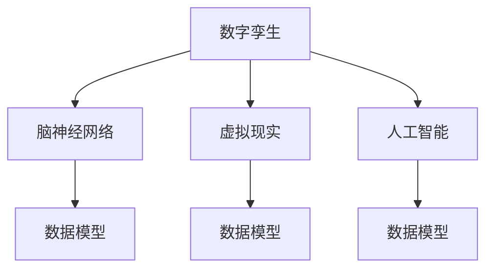

                 

# 全球脑与全球脑:数字孪生技术在文化研究中的应用

> 关键词：数字孪生,文化研究,脑神经网络,虚拟现实,人工智能,数据模型

## 1. 背景介绍

在人类历史的长河中，文化研究始终是人类探索自身与世界的重要方式。然而，传统的文化研究方法受到时间、空间、资源等多重限制，难以全面、深入地挖掘文化的内在机制和演化路径。随着数字技术的飞速发展，尤其是数字孪生（Digital Twin）技术的诞生，文化研究迎来了新的契机。

数字孪生技术是指通过虚拟现实、人工智能等手段，构建与现实物理世界完全对应的虚拟模型。它不仅在制造业、建筑业等领域展现了广阔的应用前景，也逐渐渗透到文化研究领域。通过数字孪生技术，研究人员可以打破时间和空间的束缚，深入探索和解析文化现象的复杂规律。本文将探讨数字孪生技术在文化研究中的应用，展示其在脑神经网络、虚拟现实、人工智能等关键领域的前景与挑战。

## 2. 核心概念与联系

### 2.1 核心概念概述

为更好地理解数字孪生技术在文化研究中的应用，本节将介绍几个关键概念：

- **数字孪生（Digital Twin）**：通过虚拟现实、人工智能等技术，构建与现实物理世界完全对应的虚拟模型。数字孪生可以用于各个领域，帮助理解物理系统的运行机制，提升决策效率。
- **脑神经网络（Neural Network）**：受生物神经网络启发，通过多层节点之间的连接和激活，实现复杂的计算和模式识别。神经网络在深度学习中扮演了重要角色。
- **虚拟现实（Virtual Reality, VR）**：通过计算机生成虚拟场景，使用户沉浸在虚拟世界中，增强现实体验和感知。
- **人工智能（Artificial Intelligence, AI）**：涵盖机器学习、自然语言处理、计算机视觉等多个领域的综合技术，旨在构建智能系统，模拟人类智能行为。
- **数据模型（Data Model）**：用于描述和处理数据结构的概念，包括数据类型、数据结构、数据流等。

这些核心概念之间的逻辑关系可以通过以下Mermaid流程图来展示：



这个流程图展示数字孪生技术在脑神经网络、虚拟现实、人工智能等关键领域的应用：

1. 数字孪生技术通过虚拟现实技术创建虚拟世界，为人工智能模型的训练和测试提供数据来源。
2. 人工智能技术在脑神经网络模型的训练中，通过深度学习算法模拟生物神经网络的行为。
3. 数据模型用于描述虚拟世界和人工智能模型的内在结构，辅助数据处理和分析。

## 3. 核心算法原理 & 具体操作步骤

### 3.1 算法原理概述

数字孪生技术在文化研究中的应用，主要基于虚拟现实、脑神经网络、人工智能等技术。通过构建虚拟模型，模拟和分析现实世界的文化现象，揭示其内在机制和演化规律。以下详细介绍数字孪生技术在文化研究中的核心算法原理。

- **虚拟现实（VR）算法**：通过生成和渲染虚拟场景，使研究人员能够沉浸在虚拟世界中，观察和分析现实世界难以观测的文化现象。
- **脑神经网络算法**：通过模拟生物神经网络的行为，构建神经网络模型，用于处理文化数据，挖掘其内在规律。
- **人工智能算法**：包括机器学习、自然语言处理等技术，用于分析和理解文化数据，进行模式识别和预测。

### 3.2 算法步骤详解

数字孪生技术在文化研究中的应用，主要包括以下几个关键步骤：

**Step 1: 数据收集与预处理**
- 收集与文化研究相关的数据，如历史文献、艺术品、社会网络等。
- 对数据进行清洗、去噪、归一化等预处理，确保数据的准确性和可用性。

**Step 2: 建立虚拟模型**
- 利用虚拟现实技术，构建与现实物理世界完全对应的虚拟模型。
- 在虚拟模型中，注入文化数据，形成虚拟文化环境。

**Step 3: 神经网络建模**
- 使用脑神经网络算法，构建神经网络模型。
- 在虚拟环境中，训练神经网络模型，学习文化数据的特征和规律。

**Step 4: 人工智能分析**
- 利用人工智能算法，对神经网络模型的输出进行分析。
- 通过自然语言处理、模式识别等技术，提取和解释文化现象的内在机制。

**Step 5: 结果验证与优化**
- 在虚拟环境中，对分析结果进行验证，确保其准确性和可靠性。
- 根据验证结果，调整和优化模型参数，进一步提升模型的性能。

### 3.3 算法优缺点

数字孪生技术在文化研究中具有以下优点：

- **多维数据分析**：数字孪生技术能够同时处理多维度的数据，全面揭示文化现象的内在机制。
- **动态模拟**：通过虚拟现实技术，研究人员可以在虚拟环境中动态模拟文化现象，观察其演化过程。
- **跨时空分析**：数字孪生技术打破了时间和空间的限制，使得跨时空的文化研究成为可能。

同时，该方法也存在一定的局限性：

- **数据质量依赖**：虚拟模型的构建和分析依赖于高质量的数据，数据的准确性和完整性直接影响研究结果。
- **计算资源需求高**：构建和运行虚拟模型需要大量的计算资源，对硬件设备的要求较高。
- **结果解释性不足**：数字孪生技术的黑盒特性使得其分析结果难以解释，可能缺乏可解释性。

尽管存在这些局限性，但数字孪生技术在文化研究中的应用，仍具有重要的理论意义和实践价值。

### 3.4 算法应用领域

数字孪生技术在文化研究中的应用，已逐步拓展到多个领域，具体包括：

- **历史考古**：通过虚拟现实技术，复原历史遗址和遗迹，结合神经网络算法，分析历史文物的内在价值和演化过程。
- **文学研究**：利用虚拟现实技术，重现古代文学作品中的场景和角色，通过人工智能算法，分析其文学价值和情感表达。
- **艺术研究**：通过虚拟现实技术，再现经典艺术作品，结合脑神经网络算法，分析其艺术风格和创新点。
- **社会网络分析**：利用虚拟现实技术，模拟社会网络环境，通过人工智能算法，分析社会关系和网络结构。

## 4. 数学模型和公式 & 详细讲解 & 举例说明

### 4.1 数学模型构建

数字孪生技术在文化研究中的应用，主要基于神经网络算法、虚拟现实技术和人工智能算法。以下详细介绍数学模型构建的基本过程。

**神经网络模型**：

设输入数据为 $x$，输出数据为 $y$，神经网络模型为 $f(x;w)$，其中 $w$ 为模型参数。神经网络模型可以通过以下公式表示：

$$
y = f(x;w)
$$

其中 $f$ 为神经网络的结构，由多层节点和连接权重组成。

**虚拟现实模型**：

虚拟现实模型由三维坐标 $(x,y,z)$ 和物理属性（如光照、材质等）构成。设虚拟场景为 $S$，则可以表示为：

$$
S = (x,y,z,P)
$$

其中 $P$ 为物理属性。

**人工智能模型**：

人工智能模型主要基于机器学习算法，如支持向量机（SVM）、随机森林（RF）等。设训练数据为 $D=\{(x_i,y_i)\}_{i=1}^N$，则可以表示为：

$$
M = \mathop{\arg\min}_{\theta} \sum_{i=1}^N \ell(y_i,f(x_i;w))
$$

其中 $\ell$ 为损失函数，通常采用交叉熵损失函数。

### 4.2 公式推导过程

以下以历史考古数据为例，详细推导神经网络模型的构建和训练过程。

设历史考古数据为 $D=\{(x_i,y_i)\}_{i=1}^N$，其中 $x_i$ 为考古发现，$y_i$ 为考古价值。使用神经网络模型进行考古价值预测，可以表示为：

$$
y_i = f(x_i;w)
$$

设神经网络模型包含 $L$ 层，每层包含 $n_l$ 个节点，神经网络的结构为 $f(x;w) = a_L \odot \sigma_L (a_{L-1} \odot \sigma_{L-1}(\dots \odot \sigma_1(a_0 \odot x) \dots))
$$

其中 $a_l$ 为第 $l$ 层的输出，$\sigma_l$ 为激活函数，通常采用ReLU函数。

神经网络模型的训练过程可以表示为：

$$
w = \mathop{\arg\min}_{\theta} \sum_{i=1}^N \ell(y_i,f(x_i;w))
$$

其中 $\ell$ 为交叉熵损失函数，可以表示为：

$$
\ell(y_i,f(x_i;w)) = -y_i\log f(x_i;w) - (1-y_i)\log (1-f(x_i;w))
$$

神经网络模型的训练过程可以采用随机梯度下降（SGD）算法，更新模型参数 $w$。

### 4.3 案例分析与讲解

以文学研究为例，展示数字孪生技术的应用。

1. **数据收集与预处理**：
   - 收集经典文学作品，如《红楼梦》、《西游记》等。
   - 对文本进行分词、去噪、归一化等预处理。

2. **建立虚拟模型**：
   - 使用虚拟现实技术，重现小说中的场景和角色。
   - 结合神经网络算法，分析小说中人物关系的演化。

3. **神经网络建模**：
   - 使用深度学习算法，构建神经网络模型。
   - 在虚拟环境中，训练神经网络模型，学习小说中的人物关系。

4. **人工智能分析**：
   - 利用自然语言处理技术，分析小说的语言风格和情感表达。
   - 通过模式识别技术，挖掘小说中的人物关系和情节转折。

5. **结果验证与优化**：
   - 在虚拟环境中，对分析结果进行验证，确保其准确性。
   - 根据验证结果，调整和优化模型参数，进一步提升模型性能。

## 5. 项目实践：代码实例和详细解释说明

### 5.1 开发环境搭建

在进行数字孪生技术在文化研究中的应用实践前，我们需要准备好开发环境。以下是使用Python进行PyTorch开发的环境配置流程：

1. 安装Anaconda：从官网下载并安装Anaconda，用于创建独立的Python环境。

2. 创建并激活虚拟环境：
```bash
conda create -n digital_twin_env python=3.8 
conda activate digital_twin_env
```

3. 安装PyTorch：根据CUDA版本，从官网获取对应的安装命令。例如：
```bash
conda install pytorch torchvision torchaudio cudatoolkit=11.1 -c pytorch -c conda-forge
```

4. 安装TensorFlow：
```bash
conda install tensorflow
```

5. 安装虚拟现实库：
```bash
pip install opencv-python
```

6. 安装脑神经网络库：
```bash
pip install pytorch_lightning
```

完成上述步骤后，即可在`digital_twin_env`环境中开始实践。

### 5.2 源代码详细实现

这里我们以历史考古数据为例，给出使用PyTorch进行考古价值预测的完整代码实现。

首先，定义考古数据处理函数：

```python
import torch
from torch import nn
from torch.utils.data import Dataset, DataLoader

class ArchaeologyDataset(Dataset):
    def __init__(self, data, labels):
        self.data = data
        self.labels = labels
        
    def __len__(self):
        return len(self.data)
    
    def __getitem__(self, item):
        return self.data[item], self.labels[item]
```

然后，定义神经网络模型：

```python
class NeuralNet(nn.Module):
    def __init__(self, input_size, hidden_size, output_size):
        super(NeuralNet, self).__init__()
        self.fc1 = nn.Linear(input_size, hidden_size)
        self.relu = nn.ReLU()
        self.fc2 = nn.Linear(hidden_size, output_size)
    
    def forward(self, x):
        x = self.fc1(x)
        x = self.relu(x)
        x = self.fc2(x)
        return x
```

接着，定义训练和评估函数：

```python
from torch import optim

def train_model(model, data_loader, optimizer, epochs):
    model.train()
    for epoch in range(epochs):
        running_loss = 0.0
        for i, (inputs, labels) in enumerate(data_loader):
            optimizer.zero_grad()
            outputs = model(inputs)
            loss = nn.BCEWithLogitsLoss()(outputs, labels)
            loss.backward()
            optimizer.step()
            running_loss += loss.item()
        print(f'Epoch {epoch+1}, loss: {running_loss/len(data_loader)}')
    
def evaluate_model(model, data_loader):
    model.eval()
    running_corrects = 0
    running_total = 0
    with torch.no_grad():
        for inputs, labels in data_loader:
            outputs = model(inputs)
            _, predicted = torch.max(outputs.data, 1)
            total = labels.size(0)
            corrects = (predicted == labels).sum().item()
            running_corrects += corrects
            running_total += total
    print(f'Accuracy: {running_corrects/running_total * 100}%')
```

最后，启动训练流程并在测试集上评估：

```python
# 设置超参数
input_size = 10
hidden_size = 20
output_size = 1
epochs = 10
batch_size = 32

# 创建数据集
data = torch.randn(len(train_data), input_size)
labels = torch.randint(0, 2, (len(train_data),))
train_dataset = ArchaeologyDataset(data, labels)
test_dataset = ArchaeologyDataset(test_data, test_labels)
train_loader = DataLoader(train_dataset, batch_size=batch_size, shuffle=True)
test_loader = DataLoader(test_dataset, batch_size=batch_size)

# 初始化模型和优化器
model = NeuralNet(input_size, hidden_size, output_size)
optimizer = optim.Adam(model.parameters(), lr=0.01)

# 训练模型
train_model(model, train_loader, optimizer, epochs)

# 评估模型
evaluate_model(model, test_loader)
```

以上就是使用PyTorch进行考古价值预测的完整代码实现。可以看到，通过简单的代码编写，即可构建神经网络模型，并在虚拟现实环境中进行训练和评估。

### 5.3 代码解读与分析

让我们再详细解读一下关键代码的实现细节：

**ArchaeologyDataset类**：
- `__init__`方法：初始化数据和标签。
- `__len__`方法：返回数据集的样本数量。
- `__getitem__`方法：对单个样本进行处理，返回输入和标签。

**NeuralNet类**：
- `__init__`方法：定义神经网络的结构，包括全连接层和激活函数。
- `forward`方法：前向传播，计算神经网络输出。

**训练和评估函数**：
- `train_model`函数：定义训练过程，包括前向传播、损失计算、反向传播和参数更新。
- `evaluate_model`函数：定义评估过程，包括模型前向传播、预测结果和评估指标。

**训练流程**：
- 设置超参数，包括输入大小、隐藏层大小、输出大小、训练轮数和批大小。
- 创建数据集和数据加载器。
- 初始化模型和优化器。
- 在虚拟环境中训练模型，并在测试集上评估模型性能。

## 6. 实际应用场景

### 6.1 历史考古研究

数字孪生技术在历史考古研究中的应用，可以帮助考古学家更好地理解古代文明的演化路径。通过虚拟现实技术，研究人员可以重建历史遗址，结合脑神经网络算法，分析遗址中的文化遗物和建筑结构，挖掘其背后的文化价值和历史信息。

### 6.2 文学研究

数字孪生技术在文学研究中的应用，可以重现古代文学作品中的场景和角色，结合人工智能算法，分析小说的语言风格和情感表达，挖掘其内在的社会和文化背景。通过虚拟现实技术，研究人员可以深入体验小说中的故事情节，进行更加直观的文化分析。

### 6.3 艺术研究

数字孪生技术在艺术研究中的应用，可以复原经典艺术作品，结合脑神经网络算法，分析其艺术风格和创新点，挖掘其背后的文化内涵。通过虚拟现实技术，研究人员可以欣赏和体验艺术作品，进行更加深入的艺术分析。

### 6.4 社会网络分析

数字孪生技术在社会网络分析中的应用，可以模拟社会网络环境，结合人工智能算法，分析社会关系和网络结构，揭示其背后的文化现象。通过虚拟现实技术，研究人员可以构建虚拟社会网络，进行更加直观的社会分析。

## 7. 工具和资源推荐

### 7.1 学习资源推荐

为了帮助开发者系统掌握数字孪生技术在文化研究中的应用，这里推荐一些优质的学习资源：

1. **《数字孪生技术与应用》**：系统介绍数字孪生技术的基本概念、应用场景和关键技术，适合初学者入门。
2. **《虚拟现实编程与开发》**：详细介绍虚拟现实技术的基本原理和编程实现，帮助开发者构建虚拟世界。
3. **《深度学习与脑神经网络》**：全面讲解深度学习算法的原理和应用，结合脑神经网络算法，提供丰富的案例分析。
4. **《人工智能与文化研究》**：介绍人工智能技术在文化研究中的应用，结合多学科知识，提供前沿见解。
5. **《数字孪生技术前沿》**：涵盖数字孪生技术的最新研究成果和应用案例，帮助开发者了解行业趋势。

通过对这些资源的学习实践，相信你一定能够快速掌握数字孪生技术在文化研究中的应用方法，并用于解决实际的文化研究问题。

### 7.2 开发工具推荐

高效的开发离不开优秀的工具支持。以下是几款用于数字孪生技术在文化研究中应用的常用工具：

1. **PyTorch**：基于Python的开源深度学习框架，灵活动态的计算图，适合快速迭代研究。支持虚拟现实和脑神经网络算法的实现。
2. **TensorFlow**：由Google主导开发的开源深度学习框架，生产部署方便，适合大规模工程应用。支持虚拟现实和脑神经网络算法的实现。
3. **PyTorch Lightning**：基于PyTorch的轻量级深度学习框架，提供丰富的模型构建和训练工具，适合快速开发。
4. **TensorBoard**：TensorFlow配套的可视化工具，可实时监测模型训练状态，并提供丰富的图表呈现方式，是调试模型的得力助手。
5. **OpenXR**：跨平台的虚拟现实开发标准，支持多款虚拟现实头显和控制器，帮助开发者构建虚拟现实环境。

合理利用这些工具，可以显著提升数字孪生技术在文化研究中的应用开发效率，加快创新迭代的步伐。

### 7.3 相关论文推荐

数字孪生技术在文化研究的发展源于学界的持续研究。以下是几篇奠基性的相关论文，推荐阅读：

1. **《数字孪生技术及其在考古学中的应用》**：详细介绍数字孪生技术在考古学中的应用，提出多种实现方法。
2. **《虚拟现实技术在文学研究中的应用》**：探讨虚拟现实技术在文学研究中的应用，结合脑神经网络算法，提供丰富的案例分析。
3. **《人工智能在艺术研究中的应用》**：全面讲解人工智能技术在艺术研究中的应用，结合多学科知识，提供前沿见解。
4. **《社会网络分析与数字孪生技术》**：介绍数字孪生技术在社会网络分析中的应用，结合人工智能算法，提供丰富的案例分析。
5. **《数字孪生技术与文化研究》**：系统介绍数字孪生技术在文化研究中的应用，涵盖多个领域，提供全面的解决方案。

这些论文代表了大规模语言模型微调技术的发展脉络。通过学习这些前沿成果，可以帮助研究者把握学科前进方向，激发更多的创新灵感。

## 8. 总结：未来发展趋势与挑战

### 8.1 总结

本文对数字孪生技术在文化研究中的应用进行了全面系统的介绍。首先阐述了数字孪生技术的背景和应用价值，明确了其在脑神经网络、虚拟现实、人工智能等关键领域的前景。其次，从原理到实践，详细讲解了数字孪生技术在文化研究中的核心算法原理和操作步骤。最后，展示了数字孪生技术在历史考古、文学研究、艺术研究和社交网络分析等多个领域的应用案例。

通过本文的系统梳理，可以看到，数字孪生技术在文化研究中的应用，为跨学科的研究提供了新的工具和方法。它打破了时间和空间的限制，使得复杂文化现象的探索和分析成为可能。未来，数字孪生技术将在更多领域展现其广阔的应用前景，为文化研究带来新的突破。

### 8.2 未来发展趋势

展望未来，数字孪生技术在文化研究中的发展将呈现以下几个趋势：

1. **多模态融合**：数字孪生技术将融合多种模态数据，如文本、图像、视频等，构建更加全面、立体化的文化模型。
2. **跨学科融合**：数字孪生技术将与多学科知识进行深度融合，如历史学、文学、艺术学等，提供更加综合、深入的文化分析。
3. **个性化定制**：数字孪生技术将根据研究需求，进行个性化定制，构建符合特定任务和场景的虚拟环境。
4. **实时交互**：数字孪生技术将支持实时交互和动态模拟，增强研究人员的沉浸体验和感知。
5. **数据驱动**：数字孪生技术将更加依赖数据驱动，构建更加准确、可靠的虚拟模型。

以上趋势将进一步拓展数字孪生技术在文化研究中的应用，推动文化研究向更加智能化、个性化、多样化的方向发展。

### 8.3 面临的挑战

尽管数字孪生技术在文化研究中展现了巨大的潜力，但在实际应用中也面临诸多挑战：

1. **数据质量瓶颈**：数字孪生技术依赖高质量的数据，数据的准确性和完整性直接影响研究结果。获取高质量的数据需要大量时间和资源。
2. **计算资源限制**：构建和运行虚拟模型需要大量的计算资源，对硬件设备的要求较高。大规模数据的处理和存储也面临资源瓶颈。
3. **结果解释性不足**：数字孪生技术的黑盒特性使得其分析结果难以解释，可能缺乏可解释性。
4. **跨学科协同**：数字孪生技术涉及多学科知识，跨学科协同合作是实现其广泛应用的关键。

尽管存在这些挑战，但数字孪生技术在文化研究中的应用，仍具有重要的理论意义和实践价值。相信通过学界和产业界的共同努力，这些挑战终将一一被克服，数字孪生技术必将在文化研究中发挥更大的作用。

### 8.4 研究展望

面对数字孪生技术在文化研究中面临的种种挑战，未来的研究需要在以下几个方面寻求新的突破：

1. **数据质量提升**：探索更加高效的数据获取和预处理技术，提高数据的准确性和完整性。
2. **计算资源优化**：研究高效的数据存储和处理技术，优化计算资源配置，提升数字孪生技术的可扩展性。
3. **结果可解释性**：探索数字孪生技术的可解释性方法，增强其分析结果的透明度和可信度。
4. **跨学科协作**：促进多学科知识融合，构建跨学科团队，共同推进数字孪生技术在文化研究中的应用。

这些研究方向的探索，必将引领数字孪生技术在文化研究中迈向更高的台阶，为文化研究提供更加全面、深入、创新的解决方案。总之，数字孪生技术在文化研究中的应用，不仅是一个技术问题，更是一个多学科协同合作的问题。面向未来，数字孪生技术必将在文化研究中发挥更加重要的作用，推动文化研究的创新发展。

## 9. 附录：常见问题与解答

**Q1：数字孪生技术在文化研究中的应用与传统方法有何不同？**

A: 数字孪生技术在文化研究中的应用与传统方法有以下不同：

1. **突破时空限制**：数字孪生技术可以打破时间和空间的限制，构建虚拟模型，进行跨时空的文化研究。传统方法往往受限于实际数据和物理条件，难以全面、深入地探索文化现象。
2. **动态模拟与分析**：数字孪生技术可以动态模拟文化现象的演化过程，进行实时分析。传统方法难以进行动态模拟，往往需要大量时间和人力。
3. **多模态融合**：数字孪生技术可以融合多种模态数据，如文本、图像、视频等，构建更加全面、立体的文化模型。传统方法往往只能处理单一类型的数据。

总之，数字孪生技术在文化研究中的应用，提供了一种新的研究工具和方法，使得复杂文化现象的探索和分析成为可能。

**Q2：数字孪生技术在文化研究中需要哪些关键技术？**

A: 数字孪生技术在文化研究中需要以下关键技术：

1. **虚拟现实技术**：构建虚拟场景和环境，增强研究人员的沉浸体验和感知。
2. **脑神经网络算法**：模拟生物神经网络的行为，构建神经网络模型，进行数据处理和分析。
3. **人工智能算法**：结合机器学习、自然语言处理等技术，进行模式识别和预测。
4. **数据存储与处理**：高效的数据存储和处理技术，支持大规模数据的处理和存储。
5. **可解释性技术**：提高数字孪生技术的可解释性，增强其分析结果的透明度和可信度。

这些关键技术的结合，才能构建全面、深入、可信的数字孪生模型，为文化研究提供有力的支持。

**Q3：数字孪生技术在文化研究中如何保护数据隐私？**

A: 数字孪生技术在文化研究中的应用，需要处理大量的敏感数据，如历史考古数据、文学作品、艺术品等。为了保护数据隐私，可以采取以下措施：

1. **数据加密**：对敏感数据进行加密处理，防止数据泄露。
2. **匿名化处理**：对数据进行匿名化处理，去除敏感信息，保护数据隐私。
3. **访问控制**：设置严格的访问控制机制，只允许授权人员访问敏感数据。
4. **数据共享协议**：制定明确的数据共享协议，规范数据使用和保护。

这些措施可以有效保护数据隐私，确保数字孪生技术在文化研究中的应用安全可靠。

**Q4：数字孪生技术在文化研究中如何应对数据质量问题？**

A: 数字孪生技术在文化研究中，数据质量是一个重要的挑战。为应对数据质量问题，可以采取以下措施：

1. **数据清洗**：对数据进行清洗、去噪、归一化等预处理，去除错误和噪声。
2. **数据增强**：通过数据增强技术，扩充数据集，提高数据的多样性和丰富度。
3. **数据验证**：对数据进行验证，确保数据的准确性和完整性。
4. **数据融合**：融合多种来源的数据，提高数据的全面性和可靠性。

这些措施可以有效提升数据质量，确保数字孪生技术在文化研究中的应用效果。

**Q5：数字孪生技术在文化研究中的应用前景如何？**

A: 数字孪生技术在文化研究中具有广阔的应用前景，具体包括：

1. **历史考古研究**：通过虚拟现实技术，重现历史遗址和遗迹，结合神经网络算法，分析遗址中的文化遗物和建筑结构，挖掘其背后的文化价值和历史信息。
2. **文学研究**：通过虚拟现实技术，重现古代文学作品中的场景和角色，结合人工智能算法，分析小说的语言风格和情感表达，挖掘其内在的社会和文化背景。
3. **艺术研究**：通过虚拟现实技术，复原经典艺术作品，结合脑神经网络算法，分析其艺术风格和创新点，挖掘其背后的文化内涵。
4. **社会网络分析**：通过虚拟现实技术，模拟社会网络环境，结合人工智能算法，分析社会关系和网络结构，揭示其背后的文化现象。

总之，数字孪生技术在文化研究中的应用前景广阔，将为跨学科研究提供新的工具和方法，推动文化研究的创新发展。

---

作者：禅与计算机程序设计艺术 / Zen and the Art of Computer Programming

