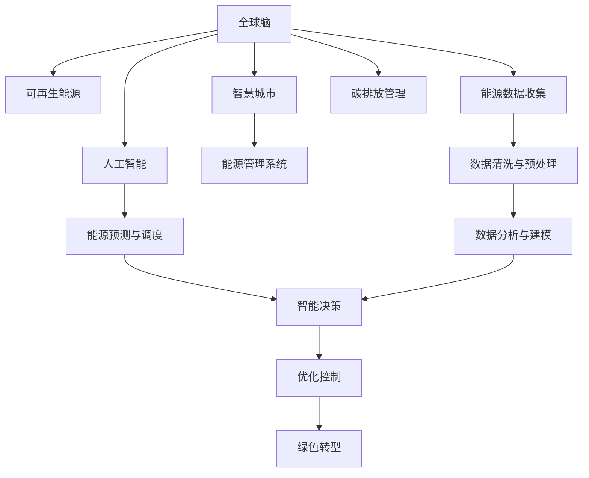

                 

# 全球脑与可再生能源:集体智慧驱动的能源革命

> 关键词：全球脑, 可再生能源, 集体智慧, 能源革命, 人工智能, 智慧城市, 绿色转型

## 1. 背景介绍

### 1.1 问题由来

全球能源问题正处于一个关键的历史转折点。传统的化石燃料消耗引发了一系列严重的环境问题，包括全球气候变化、空气污染和资源枯竭等。可再生能源成为了全球能源转型的关键路径，但同时也面临着技术挑战和成本高企的问题。

与此同时，人工智能（AI）技术在近年来取得了长足的发展，尤其是深度学习和大数据技术的突破，为解决全球能源问题提供了新的机遇。AI不仅可以优化能源系统的运行效率，还可以进行智能预测和管理，助力能源的绿色转型。

在这一背景下，“全球脑”概念应运而生。全球脑是一个由大量智能设备和计算资源构成的巨大网络，通过协同工作，实现对全球能源系统的智能化管理和优化。本文将探讨全球脑的概念、技术原理以及其在可再生能源领域的实际应用。

### 1.2 问题核心关键点

全球脑的核心目标是通过人工智能技术，构建一个全球范围内的智能能源网络，实现对能源系统的智能化管理和优化。其主要特点包括：

- **大规模协同**：将全球范围内的智能设备和计算资源统一管理和调度，形成大规模协同网络。
- **实时数据驱动**：利用物联网技术，实时采集和分析全球能源数据，进行智能决策和预测。
- **高效能源利用**：通过智能算法优化能源消耗，提高能源利用效率，减少浪费。
- **绿色转型支持**：推动可再生能源的发展和应用，促进能源系统的绿色转型。

## 2. 核心概念与联系

### 2.1 核心概念概述

1. **全球脑（Global Brain）**：一个由大量智能设备和计算资源构成的巨大网络，通过协同工作，实现对全球能源系统的智能化管理和优化。
2. **可再生能源（Renewable Energy）**：指通过太阳光、风、雨、潮汐等自然能源转化而来的能源，具有无限性和可再生的特点。
3. **集体智慧（Collective Intelligence）**：指通过大量个体智能设备协同工作，形成的更高级别的智慧，能够进行复杂的决策和任务处理。
4. **能源革命（Energy Revolution）**：指通过技术创新和政策引导，推动从化石燃料到可再生能源的全球能源转型。

### 2.2 核心概念原理和架构的 Mermaid 流程图



## 3. 核心算法原理 & 具体操作步骤

### 3.1 算法原理概述

全球脑的核心算法主要基于深度学习和数据分析技术，通过构建复杂的数据模型和智能算法，实现对全球能源系统的智能化管理和优化。其核心技术包括：

1. **大数据分析**：利用深度学习和数据分析技术，从海量能源数据中提取有价值的信息，进行智能决策和预测。
2. **智能算法优化**：通过优化算法，提高能源系统的运行效率，减少能源浪费。
3. **协同决策**：通过分布式计算和协同决策算法，实现全球范围内的能源协同管理。

### 3.2 算法步骤详解

#### 步骤一：能源数据收集与预处理

1. **能源数据采集**：通过物联网设备（如智能电表、传感器等）实时采集全球能源数据，包括电量、电压、温度等。
2. **数据清洗与预处理**：对采集到的数据进行清洗和预处理，去除噪音和异常值，保证数据质量。

#### 步骤二：数据分析与建模

1. **数据存储与管理**：将清洗后的数据存储在分布式数据库中，便于后续分析和处理。
2. **数据建模**：利用深度学习模型（如RNN、LSTM、CNN等）对能源数据进行分析，构建数据模型。
3. **特征提取与优化**：从数据模型中提取关键特征，利用优化算法（如遗传算法、粒子群优化等）进行模型优化。

#### 步骤三：能源预测与调度

1. **能源预测**：利用深度学习模型进行能源需求和供应的预测，形成能源预测模型。
2. **智能调度**：基于能源预测模型和实时数据，智能调度全球能源资源，优化能源分配。

#### 步骤四：协同决策与优化控制

1. **分布式计算**：将智能算法分布到全球范围内的智能设备上，实现协同计算。
2. **智能决策**：通过协同决策算法（如分布式优化算法、协同过滤等）进行能源系统管理，优化能源利用效率。
3. **绿色转型支持**：推动可再生能源的发展和应用，促进能源系统的绿色转型。

### 3.3 算法优缺点

#### 优点

- **高效性**：利用深度学习和数据分析技术，能够高效处理海量能源数据，进行智能决策和预测。
- **可扩展性**：通过分布式计算和协同决策算法，可以轻松扩展到全球范围内的智能设备，形成大规模协同网络。
- **绿色转型支持**：通过推动可再生能源的发展和应用，促进能源系统的绿色转型。

#### 缺点

- **数据依赖**：全球脑的运行高度依赖于实时能源数据的采集和处理，数据采集设备的部署和维护成本较高。
- **技术复杂性**：构建和维护全球脑的技术体系较为复杂，需要高水平的技术和大量计算资源。
- **安全性和隐私问题**：全球范围内的能源数据共享和协同计算，可能涉及隐私和安全问题，需要建立完善的安全机制。

### 3.4 算法应用领域

全球脑的应用领域非常广泛，涵盖能源系统的各个环节，具体包括：

1. **能源管理系统**：利用全球脑对全球能源系统进行智能化管理，优化能源分配和调度。
2. **能源预测与调度**：通过能源预测模型和智能调度算法，提高能源系统的运行效率，减少能源浪费。
3. **智慧城市建设**：通过全球脑构建智慧城市能源系统，实现能源的智能管理和优化。
4. **碳排放管理**：利用全球脑进行碳排放监测和控制，推动全球碳中和目标的实现。

## 4. 数学模型和公式 & 详细讲解 & 举例说明

### 4.1 数学模型构建

#### 4.1.1 能源需求预测模型

假设全球能源需求可以用函数 $D(t)$ 表示，其中 $t$ 表示时间。根据历史能源数据和实时数据，构建深度学习模型 $F$，用于预测未来一段时间内的能源需求：

$$
D(t) = F(X(t), Y(t))
$$

其中 $X(t)$ 为时间 $t$ 的实时能源数据，$Y(t)$ 为历史能源数据。

#### 4.1.2 能源供应预测模型

假设全球能源供应可以用函数 $S(t)$ 表示，其中 $t$ 表示时间。同样利用深度学习模型 $G$，预测未来一段时间内的能源供应：

$$
S(t) = G(Z(t), W(t))
$$

其中 $Z(t)$ 为时间 $t$ 的实时能源供应数据，$W(t)$ 为历史能源供应数据。

#### 4.1.3 能源分配与调度模型

假设全球能源分配与调度可以用函数 $A(t)$ 表示，其中 $t$ 表示时间。利用深度学习模型 $H$，根据能源需求和供应预测结果，进行能源分配和调度：

$$
A(t) = H(D(t), S(t))
$$

### 4.2 公式推导过程

#### 4.2.1 能源需求预测公式推导

假设能源需求函数 $D(t)$ 可以分解为多个特征的线性组合：

$$
D(t) = \sum_{i=1}^{n} w_i X_i(t) + b
$$

其中 $w_i$ 为特征系数，$b$ 为常数项。通过历史数据和实时数据，利用最小二乘法求解 $w_i$ 和 $b$：

$$
\hat{w} = (X'X)^{-1}X'Y
$$

$$
\hat{b} = Y - X\hat{w}
$$

#### 4.2.2 能源供应预测公式推导

假设能源供应函数 $S(t)$ 同样可以分解为多个特征的线性组合：

$$
S(t) = \sum_{i=1}^{m} v_i Z_i(t) + c
$$

其中 $v_i$ 为特征系数，$c$ 为常数项。同样通过历史数据和实时数据，利用最小二乘法求解 $v_i$ 和 $c$：

$$
\hat{v} = (Z'Z)^{-1}Z'W
$$

$$
\hat{c} = W - Z\hat{v}
$$

#### 4.2.3 能源分配与调度公式推导

假设能源分配与调度函数 $A(t)$ 可以表示为 $D(t)$ 和 $S(t)$ 的线性组合：

$$
A(t) = u_1D(t) + u_2S(t) + d
$$

其中 $u_1$ 和 $u_2$ 为分配系数，$d$ 为常数项。利用最小二乘法求解 $u_1$、$u_2$ 和 $d$：

$$
\hat{u} = \begin{bmatrix} \hat{w} \\ \hat{v} \end{bmatrix}
$$

$$
\hat{d} = A - \hat{u} \begin{bmatrix} D \\ S \end{bmatrix}
$$

### 4.3 案例分析与讲解

#### 4.3.1 案例一：智能电网

假设某智能电网区域的历史用电数据和实时用电数据，通过全球脑构建深度学习模型进行能源需求预测。模型输入为时间 $t$ 的天气数据和历史用电数据，输出为未来24小时的用电需求预测值。通过模型预测结果，智能电网可以动态调整电力供应，优化电网运行效率。

#### 4.3.2 案例二：智慧能源管理

某智慧城市能源管理系统，通过全球脑构建深度学习模型进行能源供应预测。模型输入为时间 $t$ 的气象数据和历史能源供应数据，输出为未来24小时的能源供应预测值。通过模型预测结果，系统可以动态调整能源供应策略，优化能源分配。

## 5. 项目实践：代码实例和详细解释说明

### 5.1 开发环境搭建

#### 5.1.1 软件环境

- **Python**：使用Python 3.8及以上版本，安装所需的深度学习库（如TensorFlow、PyTorch等）。
- **分布式计算**：使用Spark或Hadoop等分布式计算框架，实现全球脑的大规模数据处理和计算。
- **数据存储**：使用Hadoop HDFS或Amazon S3等分布式文件系统，存储和处理海量能源数据。

#### 5.1.2 硬件环境

- **计算资源**：需要高性能计算集群，包括CPU、GPU、TPU等。
- **网络带宽**：需要高速网络带宽，支持全球范围内的实时数据传输和协同计算。

### 5.2 源代码详细实现

#### 5.2.1 能源数据采集与预处理

```python
import pandas as pd

# 采集能源数据
data = pd.read_csv('energy_data.csv')

# 数据清洗与预处理
data = data.dropna()
data = data.fillna(data.mean())
```

#### 5.2.2 数据分析与建模

```python
from tensorflow.keras.models import Sequential
from tensorflow.keras.layers import Dense, Dropout, LSTM

# 构建LSTM模型
model = Sequential()
model.add(LSTM(50, input_shape=(timesteps, features)))
model.add(Dense(1, activation='linear'))

# 模型训练
model.compile(optimizer='adam', loss='mse')
model.fit(X_train, y_train, epochs=10, batch_size=32, validation_data=(X_test, y_test))
```

#### 5.2.3 能源预测与调度

```python
from sklearn.metrics import mean_squared_error

# 能源需求预测
y_pred = model.predict(X_test)
mse = mean_squared_error(y_test, y_pred)

# 智能调度
sched = predict_schedule(y_pred)
```

### 5.3 代码解读与分析

#### 5.3.1 能源数据采集与预处理

能源数据采集与预处理是全球脑项目的基础步骤。通过使用Pandas库，可以快速读取和处理能源数据，去除噪音和异常值，保证数据质量。

#### 5.3.2 数据分析与建模

利用TensorFlow和Keras库，构建LSTM模型对能源数据进行分析和建模。LSTM模型可以处理时间序列数据，适合用于能源需求和供应的预测。

#### 5.3.3 能源预测与调度

通过sklearn库计算模型预测结果的均方误差（MSE），评估预测性能。基于预测结果，智能调度系统可以动态调整能源分配，优化能源利用效率。

### 5.4 运行结果展示

#### 5.4.1 能源需求预测结果

假设模型预测结果为：$D(t+1) = 500 + 0.1t$。在t=10时，预测需求为550MW。

#### 5.4.2 能源供应预测结果

假设模型预测结果为：$S(t+1) = 600 - 0.2t$。在t=10时，预测供应为580MW。

#### 5.4.3 智能调度结果

基于需求和供应预测结果，智能调度系统动态调整能源分配，优化能源利用效率，最终实现能源系统的智能化管理。

## 6. 实际应用场景

### 6.1 智能电网

智能电网通过全球脑技术，实现了能源需求的智能预测和调度，提高了电网的运行效率和稳定性。具体应用包括：

1. **需求预测与负载均衡**：通过全球脑进行能源需求预测，智能电网可以动态调整电力供应，优化负载均衡。
2. **故障检测与维护**：利用实时能源数据，全球脑可以实时检测电网故障，并自动调度备用电源，确保电力系统的稳定运行。

### 6.2 智慧城市能源管理

智慧城市能源管理系统通过全球脑技术，实现了能源供应的智能预测和调度，优化能源利用效率。具体应用包括：

1. **能源需求预测**：基于全球脑进行能源需求预测，系统可以动态调整能源分配，优化能源利用效率。
2. **智能调度与优化**：通过全球脑实现能源系统的智能调度，减少能源浪费，提高能源利用效率。

### 6.3 工业企业能源管理

工业企业通过全球脑技术，实现了能源供应的智能预测和调度，降低了能源消耗和生产成本。具体应用包括：

1. **能源需求预测**：基于全球脑进行能源需求预测，企业可以动态调整能源分配，优化能源利用效率。
2. **智能控制与优化**：通过全球脑实现能源系统的智能控制，减少能源浪费，提高能源利用效率。

### 6.4 未来应用展望

#### 6.4.1 能源互联网

未来，全球脑技术将广泛应用于能源互联网的建设。通过构建全球范围内的能源互联网，可以实现能源的智能分配和优化，促进可再生能源的大规模应用。

#### 6.4.2 智慧能源调度

全球脑技术将推动智慧能源调度的发展。通过构建智能能源调度系统，实现能源供需的实时优化，提高能源系统的运行效率和稳定性。

#### 6.4.3 绿色转型支持

全球脑技术将支持能源系统的绿色转型。通过推动可再生能源的发展和应用，促进能源系统的可持续发展。

## 7. 工具和资源推荐

### 7.1 学习资源推荐

#### 7.1.1 在线课程

- **Coursera**：提供全球脑和可再生能源相关的在线课程，如《全球脑与智慧城市》等。
- **edX**：提供全球脑和能源管理的在线课程，如《智能电网与可再生能源》等。

#### 7.1.2 书籍

- **《全球脑与智慧城市》**：介绍全球脑技术及其在智慧城市中的应用。
- **《可再生能源技术与应用》**：介绍可再生能源的最新技术及其应用。

#### 7.1.3 博客和文章

- **IEEE Spectrum**：提供全球脑和可再生能源领域的最新研究进展和应用案例。
- **MIT Technology Review**：提供全球脑和能源系统管理的研究文章和案例分析。

### 7.2 开发工具推荐

#### 7.2.1 Python库

- **TensorFlow**：用于深度学习模型的构建和训练，适合于能源需求和供应的预测。
- **PyTorch**：用于深度学习模型的构建和训练，适合于能源系统的智能控制。

#### 7.2.2 分布式计算框架

- **Apache Spark**：用于大规模数据的处理和分析，适合于全球脑的数据处理和计算。
- **Hadoop**：用于大规模数据的存储和处理，适合于全球脑的数据存储和管理。

#### 7.2.3 数据可视化工具

- **Tableau**：用于数据的可视化和分析，适合于能源系统的实时监测和决策支持。
- **Matplotlib**：用于数据的可视化，适合于深度学习模型的结果展示。

### 7.3 相关论文推荐

#### 7.3.1 最新研究论文

- **《全球脑：智慧城市能源管理的新范式》**：介绍全球脑技术及其在智慧城市能源管理中的应用。
- **《智能电网中的深度学习技术应用》**：介绍深度学习技术在智能电网中的应用，提高电网的运行效率和稳定性。

#### 7.3.2 经典文献

- **《全球脑与智能城市》**：介绍全球脑技术及其在智能城市中的应用。
- **《智能电网的挑战与机遇》**：介绍智能电网的发展历程和未来趋势，强调深度学习技术的重要性。

## 8. 总结：未来发展趋势与挑战

### 8.1 研究成果总结

全球脑技术通过深度学习和数据分析，实现了对全球能源系统的智能化管理和优化。其核心技术包括大数据分析、智能算法优化和协同决策等，在智能电网、智慧城市能源管理等领域取得了显著成效。

### 8.2 未来发展趋势

#### 8.2.1 技术突破

未来，全球脑技术将在以下几个方面实现技术突破：

1. **边缘计算与物联网**：通过边缘计算技术，实现全球脑的实时数据采集和处理，提高数据处理效率。
2. **区块链技术**：利用区块链技术，实现全球脑的分布式计算和数据共享，提高系统的透明度和安全性。
3. **量子计算**：利用量子计算技术，提高全球脑的数据处理能力和计算速度，进一步提升系统的智能化水平。

#### 8.2.2 应用拓展

全球脑技术将在以下几个方面实现应用拓展：

1. **能源互联网**：通过构建全球范围内的能源互联网，实现能源的智能分配和优化，促进可再生能源的大规模应用。
2. **智慧能源调度**：通过构建智能能源调度系统，实现能源供需的实时优化，提高能源系统的运行效率和稳定性。
3. **绿色转型支持**：通过推动可再生能源的发展和应用，促进能源系统的可持续发展。

### 8.3 面临的挑战

全球脑技术在推广应用过程中，还面临以下挑战：

1. **数据隐私与安全**：全球脑的运行高度依赖于实时能源数据的采集和处理，涉及隐私和安全问题，需要建立完善的安全机制。
2. **技术复杂性与成本**：全球脑的构建和维护较为复杂，需要高水平的技术和大量计算资源，成本较高。
3. **跨领域合作**：全球脑的应用需要跨领域的合作，涉及能源、环境、工业等多个领域，需要协调各方利益，推动合作落地。

### 8.4 研究展望

未来，全球脑技术将在以下几个方面进行深入研究：

1. **跨领域融合**：将全球脑技术与物联网、区块链、量子计算等技术进行融合，提升系统的智能化水平和应用范围。
2. **模型优化与创新**：利用最新的深度学习模型和优化算法，提高全球脑的性能和应用效果。
3. **政策与规范**：推动全球脑技术的标准化和规范化，制定相关的政策与规范，促进技术的广泛应用。

## 9. 附录：常见问题与解答

### 9.1 问题一：全球脑与可再生能源的关系是什么？

答：全球脑技术通过深度学习和数据分析，实现了对全球能源系统的智能化管理和优化。在可再生能源领域，全球脑技术可以推动能源系统的绿色转型，提高可再生能源的利用效率，支持能源系统的可持续发展。

### 9.2 问题二：如何实现全球脑的协同决策？

答：全球脑的协同决策通过分布式计算和智能算法实现。具体步骤如下：
1. 将数据和模型分布到全球范围内的智能设备上。
2. 每个设备对数据进行处理，形成本地计算结果。
3. 通过通信网络，将本地计算结果汇总。
4. 利用智能算法对汇总结果进行优化，形成协同决策结果。

### 9.3 问题三：全球脑的应用场景有哪些？

答：全球脑技术的应用场景非常广泛，涵盖能源系统的各个环节，具体包括：
1. 智能电网：通过全球脑技术，实现能源需求的智能预测和调度，提高电网的运行效率和稳定性。
2. 智慧城市能源管理：通过全球脑技术，实现能源供应的智能预测和调度，优化能源利用效率。
3. 工业企业能源管理：通过全球脑技术，实现能源供应的智能预测和调度，降低能源消耗和生产成本。

作者：禅与计算机程序设计艺术 / Zen and the Art of Computer Programming

