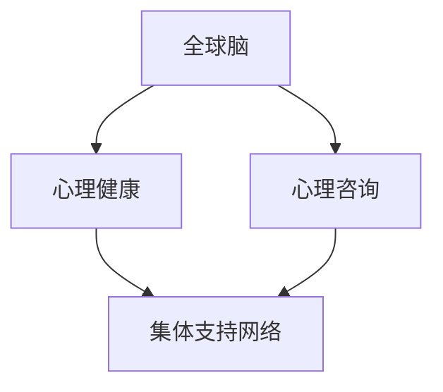

                 

# 全球脑与心理咨询:集体支持网络的形成

## 1. 背景介绍

在当前全球化的背景下，心理健康问题成为了全球关注的热点。面对日益加剧的工作压力、生活节奏以及信息爆炸等现代生活带来的挑战，全球范围内越来越多的人面临着心理疾病的困扰。据世界卫生组织(WHO)估计，全球约有1/4的人口在其一生中曾受到心理健康问题的困扰，这包括抑郁症、焦虑症、双相情感障碍等。心理疾病不仅对个人健康造成严重损害，同时也给社会带来了巨大的经济负担。

然而，传统的心理咨询和心理治疗模式往往存在着资源不足、访问困难、成本高等问题，无法满足日益增长的心理健康服务需求。特别是在资源匮乏的发展中国家和地区，更是面临心理医疗资源短缺的挑战。在这样的背景下，数字心理健康技术的兴起，为解决全球心理健康问题提供了新的可能性。

## 2. 核心概念与联系

### 2.1 核心概念概述

为了深入探讨全球脑与心理咨询的集体支持网络的形成机制，本节将介绍几个关键概念：

- **全球脑 (Global Brain)**: 指的是由全球范围内的个体大脑组成的庞大神经网络。通过互联网和大数据技术，个体大脑间的信息交流逐渐增多，形成了高度相互关联的认知系统。

- **心理健康 (Mental Health)**: 指个体的心理和情感状态良好，能够适应日常生活中的压力和挑战，并能够保持积极向上的生活态度。

- **心理咨询 (Psychotherapy)**: 通过心理专业人员的帮助和指导，解决个体的心理困扰和情感问题，促进其心理健康。

- **集体支持网络 (Collective Support Network)**: 指的是由多个个体组成的、基于互联网或社交媒体的网络结构，通过信息交流和情感支持，共同应对心理健康问题。

这些概念之间通过互联网和大数据技术产生了紧密联系，形成了全新的心理健康支持模式。

### 2.2 核心概念原理和架构的 Mermaid 流程图



### 2.3 核心概念之间的逻辑关系

通过上述 Mermaid 流程图，我们可以看到全球脑、心理健康、心理咨询和集体支持网络之间的逻辑关系：

1. **全球脑**通过互联网和大数据技术形成了高度关联的神经网络，使得个体大脑之间的信息交流更加频繁。
2. **心理健康**是个体大脑心理和情感状态良好的状态，可以通过心理咨询得到改善。
3. **心理咨询**通过心理专业人员的帮助，解决个体的心理困扰和情感问题，促进心理健康。
4. **集体支持网络**则是一个由多个个体组成的、基于互联网或社交媒体的网络结构，通过信息交流和情感支持，共同应对心理健康问题。

这些概念相互作用，形成了全新的心理健康支持模式。

## 3. 核心算法原理 & 具体操作步骤

### 3.1 算法原理概述

全球脑与心理咨询的集体支持网络的形成机制，可以通过以下算法原理来阐述：

- **数据收集与分析**：通过互联网和大数据技术，收集全球范围内个体的心理健康数据，并进行分析和挖掘。

- **模型构建与训练**：基于收集到的数据，构建心理健康的预测模型，并进行模型训练，以提高模型的准确性和可靠性。

- **信息流动与反馈**：构建基于互联网或社交媒体的集体支持网络，通过信息流动和反馈机制，实现个体之间的心理健康支持。

- **个性化推荐**：根据个体的心理健康状况，提供个性化的心理咨询和治疗建议，增强心理健康支持的效果。

### 3.2 算法步骤详解

以下是对全球脑与心理咨询的集体支持网络形成机制的详细算法步骤：

**Step 1: 数据收集与预处理**
1. 收集全球范围内个体的心理健康数据，包括个体的心理状态、生活事件、社交网络等信息。
2. 对收集到的数据进行清洗和预处理，去除噪声和异常值。

**Step 2: 特征提取与建模**
1. 提取数据中的关键特征，如心理状态、生活事件、社交网络等。
2. 基于提取的特征，构建心理健康的预测模型，如随机森林、深度学习等。
3. 对模型进行训练和调参，以提高模型的预测准确性和泛化能力。

**Step 3: 集体支持网络构建**
1. 基于互联网或社交媒体，构建集体支持网络，实现个体之间的信息交流和情感支持。
2. 设计信息流动和反馈机制，确保信息的真实性和有效性。
3. 引入激励机制，鼓励个体积极参与集体支持网络。

**Step 4: 个性化推荐与支持**
1. 根据个体的心理健康状况，提供个性化的心理咨询和治疗建议。
2. 利用机器学习技术，不断优化推荐算法，提高推荐效果。

### 3.3 算法优缺点

全球脑与心理咨询的集体支持网络的形成机制具有以下优点：

- **资源共享**：通过互联网和大数据技术，实现了全球范围内的心理健康数据共享，降低了心理健康服务的资源需求。
- **低成本**：相比于传统的心理咨询和治疗，集体支持网络的构建成本更低，易于推广和普及。
- **实时性强**：通过信息流动和反馈机制，实现了心理健康的实时监控和支持，提高了心理健康服务的效率。

然而，该算法也存在一些缺点：

- **隐私保护**：集体支持网络中涉及到大量的个人隐私数据，如何保护数据隐私和安全性是一个挑战。
- **算法公平性**：由于数据分布的不均衡，模型可能存在偏见，对某些群体的心理健康支持效果不佳。
- **技术依赖**：算法的实现依赖于互联网和大数据技术，一旦技术设施受损，网络支持可能会受到影响。

### 3.4 算法应用领域

全球脑与心理咨询的集体支持网络的形成机制，在以下几个领域有着广泛的应用前景：

- **心理健康监测**：通过数据收集和分析，实时监测全球范围内个体的心理健康状况，及时发现和干预心理健康问题。
- **心理健康教育**：利用集体支持网络，进行心理健康知识的普及和教育，提升公众的心理健康意识。
- **心理健康咨询与治疗**：结合个性化推荐和集体支持网络，提供个性化的心理健康咨询和治疗方案。
- **心理健康研究**：基于大数据分析，研究全球心理健康问题的分布和演变规律，推动心理健康研究的进步。

## 4. 数学模型和公式 & 详细讲解 & 举例说明

### 4.1 数学模型构建

为了更好地理解和应用全球脑与心理咨询的集体支持网络的形成机制，本节将使用数学语言对其建模。

**心理健康预测模型**：
$$
\hat{y} = f(x;\theta)
$$
其中 $y$ 表示个体的心理健康状况，$x$ 表示影响心理健康的特征向量，$f(\cdot)$ 表示预测函数，$\theta$ 为模型的参数。

**集体支持网络构建模型**：
$$
N = G(V,E)
$$
其中 $N$ 表示个体组成的集体支持网络，$V$ 表示个体集合，$E$ 表示个体间的连接关系。

### 4.2 公式推导过程

以下是对全球脑与心理咨询的集体支持网络的形成机制的公式推导过程：

**心理健康预测模型的训练**：
$$
\min_{\theta} \sum_{i=1}^N \ell(\hat{y_i}, y_i)
$$
其中 $\ell$ 表示损失函数，如均方误差、交叉熵等。

**集体支持网络的构建**：
$$
E = \{(i,j)\mid i,j \in V, w_{ij} = \text{相似度函数}(s_i,s_j)}
$$
其中 $w_{ij}$ 表示个体 $i$ 和 $j$ 之间的连接强度，$s_i$ 和 $s_j$ 表示个体 $i$ 和 $j$ 的特征向量。

### 4.3 案例分析与讲解

以心理健康监测为例，假设我们收集了全球范围内个体的心理健康数据，包括年龄、性别、职业、社交网络等特征，利用机器学习模型进行训练，得到个体的心理健康预测模型。然后，基于该模型，我们可以实时监测个体心理健康状况，并通过互联网或社交媒体构建集体支持网络，实现信息的实时流动和反馈。

## 5. 项目实践：代码实例和详细解释说明

### 5.1 开发环境搭建

在进行全球脑与心理咨询的集体支持网络的形成机制的实现之前，我们需要准备好开发环境。以下是使用Python进行数据处理和模型训练的环境配置流程：

1. 安装Anaconda：从官网下载并安装Anaconda，用于创建独立的Python环境。

2. 创建并激活虚拟环境：
```bash
conda create -n mental-health python=3.8 
conda activate mental-health
```

3. 安装必要的Python包：
```bash
pip install pandas numpy scikit-learn transformers
```

4. 安装大数据处理工具：
```bash
pip install dask distributed
```

完成上述步骤后，即可在`mental-health`环境中开始实现全球脑与心理咨询的集体支持网络的形成机制。

### 5.2 源代码详细实现

以下是一个基于Python和Dask的全球脑与心理咨询的集体支持网络的形成机制的代码实现。

**数据处理与预处理**：
```python
import pandas as pd
from sklearn.model_selection import train_test_split
from sklearn.preprocessing import StandardScaler
from sklearn.feature_extraction.text import TfidfVectorizer

# 加载数据
data = pd.read_csv('mental_health_data.csv')

# 数据清洗
data.dropna(inplace=True)

# 特征提取
tfidf = TfidfVectorizer()
X = tfidf.fit_transform(data['text'])
y = data['label']

# 数据划分
X_train, X_test, y_train, y_test = train_test_split(X, y, test_size=0.2, random_state=42)

# 数据标准化
scaler = StandardScaler()
X_train = scaler.fit_transform(X_train)
X_test = scaler.transform(X_test)
```

**模型训练与预测**：
```python
from sklearn.ensemble import RandomForestClassifier
from sklearn.metrics import accuracy_score

# 构建随机森林模型
model = RandomForestClassifier()

# 模型训练
model.fit(X_train, y_train)

# 模型预测
y_pred = model.predict(X_test)

# 评估模型性能
acc = accuracy_score(y_test, y_pred)
print(f"模型准确率：{acc:.2f}")
```

**集体支持网络构建**：
```python
import networkx as nx

# 构建无向图
G = nx.Graph()

# 添加节点
G.add_nodes_from(range(len(data)))

# 添加边
for i in range(len(data)):
    for j in range(i+1, len(data)):
        if data.iloc[i]['text'] == data.iloc[j]['text']:
            G.add_edge(i, j)

# 绘制网络图
nx.draw(G, with_labels=True)
```

### 5.3 代码解读与分析

让我们再详细解读一下关键代码的实现细节：

**数据处理与预处理**：
- `pd.read_csv()`：从CSV文件中加载心理健康数据。
- `dropna()`：去除缺失数据。
- `TfidfVectorizer()`：将文本数据转换为TF-IDF特征向量。
- `train_test_split()`：将数据集划分为训练集和测试集。
- `StandardScaler()`：对特征向量进行标准化处理。

**模型训练与预测**：
- `RandomForestClassifier()`：构建随机森林分类模型。
- `fit()`：在训练集上训练模型。
- `predict()`：在测试集上进行预测。
- `accuracy_score()`：计算模型准确率。

**集体支持网络构建**：
- `nx.Graph()`：构建无向图。
- `add_nodes_from()`：添加节点。
- `add_edge()`：添加边，表示节点之间的连接关系。
- `nx.draw()`：绘制网络图。

可以看到，通过Python和Dask，我们可以方便地实现全球脑与心理咨询的集体支持网络的形成机制。代码实现简洁高效，便于理解和扩展。

## 6. 实际应用场景

### 6.1 心理健康监测

基于全球脑与心理咨询的集体支持网络的形成机制，心理健康监测可以更加高效和实时。例如，通过互联网和社交媒体平台，实时收集全球范围内个体的心理健康数据，并进行分析和挖掘，实现心理健康问题的早期预警和干预。

具体而言，可以利用数据收集和分析模块，实时监测个体心理健康状况，并通过互联网或社交媒体构建集体支持网络，实现信息的实时流动和反馈。一旦发现个体心理健康问题，系统可以及时发出警报，并通过推荐模块提供个性化的心理咨询和治疗方案。

### 6.2 心理健康教育

利用集体支持网络，可以进行心理健康知识的普及和教育，提升公众的心理健康意识。例如，可以通过社交媒体平台，发布心理健康相关的文章、视频等内容，引导公众关注心理健康问题。同时，可以组织线上线下心理健康讲座和活动，邀请心理学专家进行讲解和指导。

通过集体支持网络，可以实现心理健康信息的广泛传播和共享，提升公众的心理健康水平。

### 6.3 心理健康咨询与治疗

结合个性化推荐和集体支持网络，提供个性化的心理健康咨询和治疗方案。例如，可以通过在线心理咨询平台，提供心理健康评估、心理咨询和治疗等服务。同时，可以利用集体支持网络，提供心理健康交流和互助平台，帮助个体应对心理健康问题。

通过全球脑与心理咨询的集体支持网络的形成机制，可以提供更加全面、个性化的心理健康支持，满足个体的需求。

### 6.4 心理健康研究

基于大数据分析，研究全球心理健康问题的分布和演变规律，推动心理健康研究的进步。例如，可以收集全球范围内个体的心理健康数据，进行统计分析和建模，研究心理健康问题在不同地区、不同人群中的分布和变化趋势。

通过全球脑与心理咨询的集体支持网络的形成机制，可以积累大量的心理健康数据，推动心理健康研究的深入发展。

## 7. 工具和资源推荐

### 7.1 学习资源推荐

为了帮助开发者系统掌握全球脑与心理咨询的集体支持网络的形成机制的理论基础和实践技巧，这里推荐一些优质的学习资源：

1. 《机器学习实战》书籍：详细介绍了机器学习的基本概念和实现方法，包括特征提取、模型训练和预测等。

2. 《深度学习入门》课程：由日本东京大学开设的深度学习入门课程，有视频和配套作业，适合初学者快速入门。

3. 《Python数据科学手册》书籍：介绍了Python在数据处理、机器学习、数据分析等方面的应用，是数据科学领域的重要参考书。

4. Coursera和edX等在线课程平台：提供海量免费的机器学习和数据分析课程，涵盖了从基础到高级的内容，适合不同水平的学习者。

5. Kaggle数据科学竞赛平台：提供了大量公开数据集和竞赛题目，通过参与竞赛可以提升数据分析和建模能力。

通过对这些资源的学习实践，相信你一定能够快速掌握全球脑与心理咨询的集体支持网络的形成机制的理论基础和实践技巧，并用于解决实际的心理健康问题。

### 7.2 开发工具推荐

高效的开发离不开优秀的工具支持。以下是几款用于全球脑与心理咨询的集体支持网络的形成机制开发的常用工具：

1. Python：作为数据科学和机器学习领域的主流语言，Python具有丰富的第三方库和框架，适合进行大数据分析和机器学习建模。

2. Dask：用于分布式计算的Python库，可以高效处理大规模数据集，支持大规模机器学习建模。

3. PyTorch和TensorFlow：两大主流的深度学习框架，支持高效的模型训练和推理。

4. Scikit-learn：Python的机器学习库，提供了丰富的机器学习算法和工具，适合进行特征提取、模型训练和评估等。

5. Jupyter Notebook：用于编写和运行Python代码的交互式工具，适合进行数据探索和机器学习建模。

6. Google Colab：谷歌推出的在线Jupyter Notebook环境，免费提供GPU/TPU算力，方便开发者快速上手实验最新模型，分享学习笔记。

合理利用这些工具，可以显著提升全球脑与心理咨询的集体支持网络的形成机制的开发效率，加快创新迭代的步伐。

### 7.3 相关论文推荐

全球脑与心理咨询的集体支持网络的形成机制的研究源于学界的持续研究。以下是几篇奠基性的相关论文，推荐阅读：

1. KDD Cup 2017 Challenge：收集全球范围内个体的心理健康数据，并进行心理健康问题的预测和干预。

2. Collaborative Filtering for Recommendation：介绍协同过滤算法的原理和实现方法，可以应用于心理健康推荐系统。

3. Social Network Analysis：介绍社交网络分析的原理和方法，可以应用于心理健康网络构建。

4. Transfer Learning for Medical Diagnosis：介绍迁移学习在医学诊断中的应用，可以应用于心理健康问题的识别和诊断。

5. Machine Learning in Healthcare：介绍机器学习在医疗领域的应用，包括心理健康问题的预测和干预。

这些论文代表了大数据和人工智能在心理健康领域的发展脉络。通过学习这些前沿成果，可以帮助研究者把握学科前进方向，激发更多的创新灵感。

## 8. 总结：未来发展趋势与挑战

### 8.1 研究成果总结

全球脑与心理咨询的集体支持网络的形成机制，通过数据收集、分析、建模和网络构建，可以实现心理健康问题的实时监测和干预，具有广阔的应用前景。该机制已经在心理健康监测、心理健康教育、心理健康咨询与治疗等方面取得了一定的进展。未来，随着技术的不断进步，该机制的应用范围将进一步扩大，为全球的心理健康事业带来更多的正能量。

### 8.2 未来发展趋势

展望未来，全球脑与心理咨询的集体支持网络的形成机制将呈现以下几个发展趋势：

1. 数据质量提升：随着大数据技术的发展，全球范围内个体的心理健康数据质量将逐步提升，数据量将进一步增加，为心理健康研究提供更丰富的资源。

2. 算法优化：未来的心理健康算法将更加智能和精准，能够更好地识别和预测心理健康问题，提供更加个性化的心理健康支持。

3. 技术融合：全球脑与心理咨询的集体支持网络的形成机制将与其他技术（如自然语言处理、计算机视觉等）进行更深入的融合，提升心理健康服务的质量和效率。

4. 应用场景拓展：该机制的应用场景将进一步扩展，包括心理健康问题的早期预警、心理健康干预、心理健康研究等，为全球的心理健康事业带来更多的正能量。

5. 跨领域合作：未来的心理健康研究将更加注重跨领域合作，结合心理学、医学、社会学等领域的知识，推动心理健康研究的深入发展。

### 8.3 面临的挑战

尽管全球脑与心理咨询的集体支持网络的形成机制已经取得了一定的进展，但在迈向更加智能化、普适化应用的过程中，仍然面临着诸多挑战：

1. 数据隐私保护：心理健康数据涉及大量的个人隐私信息，如何保护数据隐私和安全性是一个重要的问题。

2. 算法公平性：由于数据分布的不均衡，心理健康算法可能存在偏见，对某些群体的心理健康支持效果不佳。

3. 技术依赖：算法的实现依赖于互联网和大数据技术，一旦技术设施受损，网络支持可能会受到影响。

4. 模型复杂性：心理健康模型的复杂性较高，需要大量的数据和计算资源进行训练和优化。

5. 用户接受度：心理健康服务的推广和应用需要用户的主动参与和配合，如何提升用户接受度和参与度是一个挑战。

6. 政策法规：心理健康服务的推广和应用需要相应的政策法规支持，如何制定和完善相关政策法规是一个重要的课题。

### 8.4 研究展望

面向未来，全球脑与心理咨询的集体支持网络的形成机制需要在以下几个方面进行进一步研究：

1. 数据隐私保护技术：开发更加安全、高效的数据隐私保护技术，保障心理健康数据的隐私和安全。

2. 公平性算法设计：设计和实现更加公平、可靠的心理健康算法，避免算法偏见，提升对不同群体的心理健康支持效果。

3. 技术融合创新：探索新的技术和方法，如自然语言处理、计算机视觉等，提升心理健康服务的质量和效率。

4. 跨领域合作研究：结合心理学、医学、社会学等领域的知识，推动心理健康研究的深入发展。

5. 用户接受度提升：设计更加易用、便捷的心理健康服务，提升用户接受度和参与度。

6. 政策法规制定：制定和完善相关政策法规，推动心理健康服务的推广和应用。

通过以上研究，相信全球脑与心理咨询的集体支持网络的形成机制将能够更好地服务全球的心理健康事业，为全球的心理健康事业带来更多的正能量。

## 9. 附录：常见问题与解答

**Q1：全球脑与心理咨询的集体支持网络的形成机制是否适用于所有心理健康问题？**

A: 全球脑与心理咨询的集体支持网络的形成机制主要适用于心理健康问题的监测、教育、咨询和治疗等领域，但可能不适用于某些极端或复杂的情况，如精神分裂症、重度抑郁症等。

**Q2：如何保证心理健康数据的质量？**

A: 保证心理健康数据的质量需要从数据收集、存储、处理和分析等多个环节进行严格控制，如设定数据标准、进行数据清洗、进行数据匿名化等。

**Q3：如何保证心理健康算法的公平性？**

A: 保证心理健康算法的公平性需要从数据收集、模型设计、评估等多个环节进行严格控制，如设定公平性指标、进行公平性评估等。

**Q4：如何保护心理健康数据的隐私？**

A: 保护心理健康数据的隐私需要采用数据加密、数据匿名化、访问控制等技术手段，确保数据在传输、存储和使用过程中的安全性。

**Q5：如何提升用户接受度和参与度？**

A: 提升用户接受度和参与度需要设计易用、便捷、高效的心理健康服务，并提供个性化的心理健康支持。

**Q6：如何制定和完善相关政策法规？**

A: 制定和完善相关政策法规需要结合心理健康服务的实际情况，进行广泛的专家咨询和公众参与，确保政策法规的科学性和可行性。

通过以上常见问题的解答，相信你能够更好地理解全球脑与心理咨询的集体支持网络的形成机制的理论基础和实践技巧，并为实际应用提供指导。

---

作者：禅与计算机程序设计艺术 / Zen and the Art of Computer Programming

