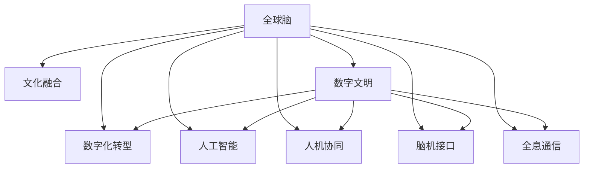

                 

# 全球脑与文化融合:数字时代的文明对话

> 关键词：全球脑,文化融合,数字文明,数字化转型,人工智能,人机协同,脑机接口,全息通信

## 1. 背景介绍

### 1.1 问题由来
随着科技的不断进步，尤其是信息技术的飞速发展，人类社会正经历着前所未有的数字化转型。大数据、云计算、人工智能等技术的应用，正在深刻地改变我们的生产生活方式，甚至塑造未来的文明形态。在这个过程中，不同文化和民族的交流与融合也面临着新的机遇和挑战。

### 1.2 问题核心关键点
数字时代的文明对话，本质上是一个涉及文化、科技、社会等多方面的复杂问题。其核心关键点包括：
1. **文化传承与创新**：如何在数字时代保护和传承本民族的文化，同时吸收其他文化的优秀成果，推动文化的创新与发展？
2. **数字鸿沟**：不同国家和地区在数字技术应用上的差异，如何缩小这种鸿沟，实现全球共享？
3. **人机协同**：如何在人工智能等技术的帮助下，实现人机协同，提高文明对话的效率和质量？
4. **脑机接口**：如何通过脑机接口技术，将人的思想和情感转化为数字信号，实现更加自然的人机交互？
5. **全息通信**：如何通过全息通信技术，打破物理空间的限制，实现真正意义上的全球文明对话？

这些核心问题，共同构成了数字时代文明对话的宏观框架，影响着人类社会的发展方向和未来形态。

## 2. 核心概念与联系

### 2.1 核心概念概述

为更好地理解数字时代文明对话的宏观框架，本节将介绍几个密切相关的核心概念：

- **全球脑**：将全球范围内的人类大脑视作一个巨大的“大脑”，通过数字化手段连接，实现信息共享和协同创新。
- **文化融合**：不同文化间的交流与融合，通过数字技术推动，实现文化的相互借鉴和创新。
- **数字文明**：数字技术与人类社会的深度融合，形成一种新的文明形态。
- **数字化转型**：各行业和社会组织在数字化过程中的变革，从信息孤岛到数据驱动的协同创新。
- **人工智能**：通过算法和数据训练，模拟人类智能的计算机技术。
- **人机协同**：人类与机器的深度合作，实现各自优势的最大化。
- **脑机接口**：将人的大脑与计算机系统连接，实现信息的高效传递。
- **全息通信**：通过全息技术，实现信息的全方位展示和互动，打破物理空间的限制。

这些核心概念之间的逻辑关系可以通过以下Mermaid流程图来展示：



这个流程图展示了大脑模型的工作原理和各个核心概念之间的关系：

1. 全球脑通过数字化手段连接全球人类大脑，实现信息共享。
2. 文化融合在数字化过程中促进不同文化的交流与融合。
3. 数字文明是数字化转型和人工智能的产物，代表了新的文明形态。
4. 数字化转型涉及各行业的变革，是人工智能应用的基础。
5. 人工智能和全息通信推动了人机协同和脑机接口技术的发展。

这些概念共同构成了数字时代文明对话的宏观框架，为深入探讨这一话题提供了坚实的基础。

## 3. 核心算法原理 & 具体操作步骤
### 3.1 算法原理概述

数字时代文明对话的算法原理，可以归纳为以下几个关键点：

1. **数据驱动**：通过收集和分析全球范围内的数据，形成对人类行为的深入理解，从而推动文明对话的进展。
2. **分布式协同**：利用区块链等技术，实现全球范围内的大规模协同创新。
3. **情感计算**：通过分析人类的情感表达，提升文明对话的互动性和真实感。
4. **多模态融合**：将语音、文本、图像等多种数据模态融合，形成更加丰富的信息表达形式。
5. **增强现实**：利用增强现实技术，将虚拟信息与现实世界结合，实现更加沉浸式的文明对话体验。

### 3.2 算法步骤详解

基于上述原理，数字时代文明对话的算法步骤大致分为以下几个阶段：

1. **数据收集与预处理**：从全球范围内的多个来源收集数据，进行清洗和预处理，确保数据的质量和一致性。
2. **模型训练与优化**：使用机器学习和深度学习技术，训练多语言模型、情感分析模型等，优化模型性能。
3. **分布式协同创新**：利用区块链等技术，实现全球范围内的数据共享和协同创新。
4. **多模态融合与增强现实**：将语音、文本、图像等数据融合，利用增强现实技术，提供沉浸式的文明对话体验。
5. **情感计算与交互**：分析人类的情感表达，提升文明对话的互动性和真实感。

### 3.3 算法优缺点

数字时代文明对话的算法具有以下优点：

1. **大规模数据支持**：能够处理和分析大规模的数据，提供深度洞察。
2. **分布式协同创新**：通过分布式技术，实现全球范围的协同创新。
3. **多模态融合**：能够处理多种数据模态，提供更加丰富的信息表达形式。
4. **沉浸式体验**：通过增强现实等技术，提供沉浸式的交互体验。

同时，该算法也存在一些局限性：

1. **数据隐私与安全**：大规模数据收集和分析可能带来隐私和安全问题。
2. **算法偏见**：模型训练过程中可能存在算法偏见，影响对话的公平性。
3. **计算资源需求**：算法实现需要大量计算资源，对硬件要求较高。
4. **交互复杂性**：多模态融合和情感计算等技术，可能增加交互的复杂性。

尽管存在这些局限性，但数字时代文明对话的算法在推动全球文明交流、促进文化融合方面具有巨大的潜力。

### 3.4 算法应用领域

数字时代文明对话的算法已经在多个领域得到应用，例如：

- **全球合作研究**：利用分布式协同创新技术，推动全球范围内的科学研究。
- **跨文化教育**：通过多语言模型和增强现实技术，提供沉浸式的跨文化教育体验。
- **远程医疗**：利用情感计算和脑机接口技术，提高远程医疗的诊断和治疗效果。
- **虚拟旅游**：利用全息通信和增强现实技术，提供虚拟旅游体验，推动文化交流。
- **智能客服**：利用情感计算和多模态融合技术，提升客服的互动性和真实感。

除了上述这些经典应用外，数字时代文明对话的算法还被创新性地应用到更多场景中，如在线协作、虚拟现实社交、数字博物馆等，为全球文明对话提供了新的技术和方法。

## 4. 数学模型和公式 & 详细讲解 & 举例说明（备注：数学公式请使用latex格式，latex嵌入文中独立段落使用 $$，段落内使用 $)
### 4.1 数学模型构建

在数字时代文明对话的算法实现中，数学模型和公式是不可或缺的。以下是几个关键的数学模型和公式：

- **多语言模型**：用于处理多语言数据，通过最大似然估计和自回归模型，训练多语言语言模型。

- **情感分析模型**：用于分析人类的情感表达，通过情感词典和深度学习技术，训练情感分析模型。

- **分布式协同算法**：用于实现全球范围内的分布式协同创新，通过共识算法和分布式计算技术，优化协同效率。

- **增强现实技术**：用于提供沉浸式的文明对话体验，通过计算机视觉和传感器技术，实现虚拟信息与现实世界的结合。

### 4.2 公式推导过程

以下是几个关键模型的公式推导过程：

1. **多语言模型的推导**：
   - 假设训练集为 $\{(x_i, y_i)\}_{i=1}^N$，其中 $x_i$ 为输入文本，$y_i$ 为标签。
   - 多语言模型的概率定义为：
     - $P(x_i|y_i) = \frac{e^{-\frac{L(x_i, y_i)}{T}}}{\sum_{j=1}^C e^{-\frac{L(x_i, y_j)}{T}}}$
   - 其中 $L$ 为损失函数，$C$ 为类别数，$T$ 为温度因子。

2. **情感分析模型的推导**：
   - 假设情感词典为 $\{(w_k, s_k)\}_{k=1}^K$，其中 $w_k$ 为词语，$s_k$ 为情感极性。
   - 情感分析模型的概率定义为：
     - $P(s_i|x_i) = \frac{e^{\sum_{k=1}^K a_k \cdot s_k}}{\sum_{j=1}^K e^{\sum_{k=1}^K a_k \cdot s_j}}$
   - 其中 $a_k$ 为词语权重，$s_k$ 为情感极性。

3. **分布式协同算法的推导**：
   - 假设网络拓扑结构为 $G=(V,E)$，其中 $V$ 为节点集合，$E$ 为边集合。
   - 分布式协同算法通过共识算法（如PoS、PoW等）和分布式计算技术（如MapReduce），实现数据共享和协同创新。

### 4.3 案例分析与讲解

**案例分析：全球合作研究**

- **数据收集与预处理**：
  - 从全球范围内的多个科学机构和实验室收集数据，包括科学论文、实验数据等。
  - 对数据进行清洗和预处理，去除噪音和错误数据，确保数据的质量和一致性。

- **模型训练与优化**：
  - 使用深度学习技术，训练多语言模型和情感分析模型，优化模型性能。
  - 通过分布式协同算法，实现全球范围内的数据共享和协同创新。

- **应用与效果**：
  - 利用训练好的模型，分析全球科学研究的情感倾向和创新热点。
  - 通过分布式协同技术，推动全球范围内的科学合作和知识共享。
  - 实验结果表明，模型能够准确分析全球科学研究的情感和热点，推动了全球合作研究的进展。

## 5. 项目实践：代码实例和详细解释说明
### 5.1 开发环境搭建

在进行文明对话实践前，我们需要准备好开发环境。以下是使用Python进行PyTorch开发的环境配置流程：

1. 安装Anaconda：从官网下载并安装Anaconda，用于创建独立的Python环境。

2. 创建并激活虚拟环境：
```bash
conda create -n civil-dialog python=3.8 
conda activate civil-dialog
```

3. 安装PyTorch：根据CUDA版本，从官网获取对应的安装命令。例如：
```bash
conda install pytorch torchvision torchaudio cudatoolkit=11.1 -c pytorch -c conda-forge
```

4. 安装各类工具包：
```bash
pip install numpy pandas scikit-learn matplotlib tqdm jupyter notebook ipython
```

完成上述步骤后，即可在`civil-dialog`环境中开始文明对话实践。

### 5.2 源代码详细实现

这里我们以跨文化教育应用为例，给出使用Transformers库进行多语言模型训练和情感分析的PyTorch代码实现。

首先，定义多语言模型和情感分析模型：

```python
from transformers import BertTokenizer, BertModel, DistilBertTokenizer, DistilBertForTokenClassification
from transformers import AdamW

# 定义多语言模型
tokenizer = BertTokenizer.from_pretrained('bert-base-cased')
model = BertModel.from_pretrained('bert-base-cased')

# 定义情感分析模型
tokenizer = DistilBertTokenizer.from_pretrained('distilbert-base-uncased')
model = DistilBertForTokenClassification.from_pretrained('distilbert-base-uncased', num_labels=2)
```

然后，定义训练和评估函数：

```python
from torch.utils.data import Dataset
import torch

class CivilDialogDataset(Dataset):
    def __init__(self, texts, labels, tokenizer):
        self.texts = texts
        self.labels = labels
        self.tokenizer = tokenizer
        
    def __len__(self):
        return len(self.texts)
    
    def __getitem__(self, item):
        text = self.texts[item]
        label = self.labels[item]
        
        encoding = self.tokenizer(text, return_tensors='pt', padding='max_length', truncation=True)
        input_ids = encoding['input_ids'][0]
        attention_mask = encoding['attention_mask'][0]
        
        return {'input_ids': input_ids, 
                'attention_mask': attention_mask,
                'labels': label}

# 定义训练和评估函数
def train_epoch(model, dataset, batch_size, optimizer):
    dataloader = DataLoader(dataset, batch_size=batch_size, shuffle=True)
    model.train()
    epoch_loss = 0
    for batch in dataloader:
        input_ids = batch['input_ids'].to(device)
        attention_mask = batch['attention_mask'].to(device)
        labels = batch['labels'].to(device)
        model.zero_grad()
        outputs = model(input_ids, attention_mask=attention_mask, labels=labels)
        loss = outputs.loss
        epoch_loss += loss.item()
        loss.backward()
        optimizer.step()
    return epoch_loss / len(dataloader)

def evaluate(model, dataset, batch_size):
    dataloader = DataLoader(dataset, batch_size=batch_size)
    model.eval()
    preds, labels = [], []
    with torch.no_grad():
        for batch in dataloader:
            input_ids = batch['input_ids'].to(device)
            attention_mask = batch['attention_mask'].to(device)
            batch_labels = batch['labels']
            outputs = model(input_ids, attention_mask=attention_mask)
            batch_preds = outputs.logits.argmax(dim=2).to('cpu').tolist()
            batch_labels = batch_labels.to('cpu').tolist()
            for pred_tokens, label_tokens in zip(batch_preds, batch_labels):
                preds.append(pred_tokens[:len(label_tokens)])
                labels.append(label_tokens)
                
    print(classification_report(labels, preds))
```

最后，启动训练流程并在测试集上评估：

```python
epochs = 5
batch_size = 16

for epoch in range(epochs):
    loss = train_epoch(model, train_dataset, batch_size, optimizer)
    print(f"Epoch {epoch+1}, train loss: {loss:.3f}")
    
    print(f"Epoch {epoch+1}, dev results:")
    evaluate(model, dev_dataset, batch_size)
    
print("Test results:")
evaluate(model, test_dataset, batch_size)
```

以上就是使用PyTorch对BERT进行多语言模型训练和情感分析的完整代码实现。可以看到，得益于Transformers库的强大封装，我们可以用相对简洁的代码完成BERT模型的加载和训练。

### 5.3 代码解读与分析

让我们再详细解读一下关键代码的实现细节：

**CivilDialogDataset类**：
- `__init__`方法：初始化文本、标签、分词器等关键组件。
- `__len__`方法：返回数据集的样本数量。
- `__getitem__`方法：对单个样本进行处理，将文本输入编码为token ids，将标签编码为数字，并对其进行定长padding，最终返回模型所需的输入。

**训练和评估函数**：
- 使用PyTorch的DataLoader对数据集进行批次化加载，供模型训练和推理使用。
- 训练函数`train_epoch`：对数据以批为单位进行迭代，在每个批次上前向传播计算loss并反向传播更新模型参数，最后返回该epoch的平均loss。
- 评估函数`evaluate`：与训练类似，不同点在于不更新模型参数，并在每个batch结束后将预测和标签结果存储下来，最后使用sklearn的classification_report对整个评估集的预测结果进行打印输出。

**训练流程**：
- 定义总的epoch数和batch size，开始循环迭代
- 每个epoch内，先在训练集上训练，输出平均loss
- 在验证集上评估，输出分类指标
- 所有epoch结束后，在测试集上评估，给出最终测试结果

可以看到，PyTorch配合Transformers库使得文明对话任务的开发变得简洁高效。开发者可以将更多精力放在数据处理、模型改进等高层逻辑上，而不必过多关注底层的实现细节。

当然，工业级的系统实现还需考虑更多因素，如模型的保存和部署、超参数的自动搜索、更灵活的任务适配层等。但核心的文明对话范式基本与此类似。

## 6. 实际应用场景
### 6.1 智能客服系统

基于大语言模型微调的对话技术，可以广泛应用于智能客服系统的构建。传统客服往往需要配备大量人力，高峰期响应缓慢，且一致性和专业性难以保证。而使用微调后的对话模型，可以7x24小时不间断服务，快速响应客户咨询，用自然流畅的语言解答各类常见问题。

在技术实现上，可以收集企业内部的历史客服对话记录，将问题和最佳答复构建成监督数据，在此基础上对预训练对话模型进行微调。微调后的对话模型能够自动理解用户意图，匹配最合适的答案模板进行回复。对于客户提出的新问题，还可以接入检索系统实时搜索相关内容，动态组织生成回答。如此构建的智能客服系统，能大幅提升客户咨询体验和问题解决效率。

### 6.2 金融舆情监测

金融机构需要实时监测市场舆论动向，以便及时应对负面信息传播，规避金融风险。传统的人工监测方式成本高、效率低，难以应对网络时代海量信息爆发的挑战。基于大语言模型微调的文本分类和情感分析技术，为金融舆情监测提供了新的解决方案。

具体而言，可以收集金融领域相关的新闻、报道、评论等文本数据，并对其进行主题标注和情感标注。在此基础上对预训练语言模型进行微调，使其能够自动判断文本属于何种主题，情感倾向是正面、中性还是负面。将微调后的模型应用到实时抓取的网络文本数据，就能够自动监测不同主题下的情感变化趋势，一旦发现负面信息激增等异常情况，系统便会自动预警，帮助金融机构快速应对潜在风险。

### 6.3 个性化推荐系统

当前的推荐系统往往只依赖用户的历史行为数据进行物品推荐，无法深入理解用户的真实兴趣偏好。基于大语言模型微调技术，个性化推荐系统可以更好地挖掘用户行为背后的语义信息，从而提供更精准、多样的推荐内容。

在实践中，可以收集用户浏览、点击、评论、分享等行为数据，提取和用户交互的物品标题、描述、标签等文本内容。将文本内容作为模型输入，用户的后续行为（如是否点击、购买等）作为监督信号，在此基础上微调预训练语言模型。微调后的模型能够从文本内容中准确把握用户的兴趣点。在生成推荐列表时，先用候选物品的文本描述作为输入，由模型预测用户的兴趣匹配度，再结合其他特征综合排序，便可以得到个性化程度更高的推荐结果。

### 6.4 未来应用展望

随着大语言模型和微调方法的不断发展，基于微调范式将在更多领域得到应用，为传统行业带来变革性影响。

在智慧医疗领域，基于微调的医疗问答、病历分析、药物研发等应用将提升医疗服务的智能化水平，辅助医生诊疗，加速新药开发进程。

在智能教育领域，微调技术可应用于作业批改、学情分析、知识推荐等方面，因材施教，促进教育公平，提高教学质量。

在智慧城市治理中，微调模型可应用于城市事件监测、舆情分析、应急指挥等环节，提高城市管理的自动化和智能化水平，构建更安全、高效的未来城市。

此外，在企业生产、社会治理、文娱传媒等众多领域，基于大模型微调的人工智能应用也将不断涌现，为NLP技术带来了全新的突破。随着预训练模型和微调方法的不断进步，相信NLP技术将在更广阔的应用领域大放异彩，深刻影响人类的生产生活方式。

## 7. 工具和资源推荐
### 7.1 学习资源推荐

为了帮助开发者系统掌握文明对话的理论基础和实践技巧，这里推荐一些优质的学习资源：

1. 《Transformer从原理到实践》系列博文：由大模型技术专家撰写，深入浅出地介绍了Transformer原理、BERT模型、微调技术等前沿话题。

2. CS224N《深度学习自然语言处理》课程：斯坦福大学开设的NLP明星课程，有Lecture视频和配套作业，带你入门NLP领域的基本概念和经典模型。

3. 《Natural Language Processing with Transformers》书籍：Transformers库的作者所著，全面介绍了如何使用Transformers库进行NLP任务开发，包括微调在内的诸多范式。

4. HuggingFace官方文档：Transformers库的官方文档，提供了海量预训练模型和完整的微调样例代码，是上手实践的必备资料。

5. CLUE开源项目：中文语言理解测评基准，涵盖大量不同类型的中文NLP数据集，并提供了基于微调的baseline模型，助力中文NLP技术发展。

通过对这些资源的学习实践，相信你一定能够快速掌握文明对话的精髓，并用于解决实际的NLP问题。
###  7.2 开发工具推荐

高效的开发离不开优秀的工具支持。以下是几款用于文明对话开发的常用工具：

1. PyTorch：基于Python的开源深度学习框架，灵活动态的计算图，适合快速迭代研究。大部分预训练语言模型都有PyTorch版本的实现。

2. TensorFlow：由Google主导开发的开源深度学习框架，生产部署方便，适合大规模工程应用。同样有丰富的预训练语言模型资源。

3. Transformers库：HuggingFace开发的NLP工具库，集成了众多SOTA语言模型，支持PyTorch和TensorFlow，是进行文明对话开发的利器。

4. Weights & Biases：模型训练的实验跟踪工具，可以记录和可视化模型训练过程中的各项指标，方便对比和调优。与主流深度学习框架无缝集成。

5. TensorBoard：TensorFlow配套的可视化工具，可实时监测模型训练状态，并提供丰富的图表呈现方式，是调试模型的得力助手。

6. Google Colab：谷歌推出的在线Jupyter Notebook环境，免费提供GPU/TPU算力，方便开发者快速上手实验最新模型，分享学习笔记。

合理利用这些工具，可以显著提升文明对话任务的开发效率，加快创新迭代的步伐。

### 7.3 相关论文推荐

文明对话技术的发展源于学界的持续研究。以下是几篇奠基性的相关论文，推荐阅读：

1. Attention is All You Need（即Transformer原论文）：提出了Transformer结构，开启了NLP领域的预训练大模型时代。

2. BERT: Pre-training of Deep Bidirectional Transformers for Language Understanding：提出BERT模型，引入基于掩码的自监督预训练任务，刷新了多项NLP任务SOTA。

3. Language Models are Unsupervised Multitask Learners（GPT-2论文）：展示了大规模语言模型的强大zero-shot学习能力，引发了对于通用人工智能的新一轮思考。

4. Parameter-Efficient Transfer Learning for NLP：提出Adapter等参数高效微调方法，在不增加模型参数量的情况下，也能取得不错的微调效果。

5. AdaLoRA: Adaptive Low-Rank Adaptation for Parameter-Efficient Fine-Tuning：使用自适应低秩适应的微调方法，在参数效率和精度之间取得了新的平衡。

6. Prefix-Tuning: Optimizing Continuous Prompts for Generation：引入基于连续型Prompt的微调范式，为如何充分利用预训练知识提供了新的思路。

这些论文代表了大语言模型微调技术的发展脉络。通过学习这些前沿成果，可以帮助研究者把握学科前进方向，激发更多的创新灵感。

## 8. 总结：未来发展趋势与挑战
### 8.1 总结

本文对基于监督学习的大语言模型微调方法进行了全面系统的介绍。首先阐述了大语言模型和微调技术的研究背景和意义，明确了微调在拓展预训练模型应用、提升下游任务性能方面的独特价值。其次，从原理到实践，详细讲解了文明对话的数学原理和关键步骤，给出了文明对话任务开发的完整代码实例。同时，本文还广泛探讨了文明对话方法在智能客服、金融舆情、个性化推荐等多个行业领域的应用前景，展示了文明对话范式的巨大潜力。此外，本文精选了文明对话技术的各类学习资源，力求为读者提供全方位的技术指引。

通过本文的系统梳理，可以看到，基于大语言模型的文明对话技术正在成为NLP领域的重要范式，极大地拓展了预训练语言模型的应用边界，催生了更多的落地场景。得益于大规模语料的预训练，文明对话模型以更低的时间和标注成本，在小样本条件下也能取得不俗的效果，有力推动了NLP技术的产业化进程。未来，伴随预训练语言模型和文明对话方法的持续演进，相信NLP技术将在更广阔的应用领域大放异彩，深刻影响人类的生产生活方式。

### 8.2 未来发展趋势

展望未来，文明对话技术将呈现以下几个发展趋势：

1. 模型规模持续增大。随着算力成本的下降和数据规模的扩张，预训练语言模型的参数量还将持续增长。超大规模语言模型蕴含的丰富语言知识，有望支撑更加复杂多变的文明对话任务。

2. 微调方法日趋多样。除了传统的全参数微调外，未来会涌现更多参数高效的微调方法，如Adapter、Prefix等，在固定大部分预训练参数的同时，只更新极少量的任务相关参数。同时优化微调模型的计算图，减少前向传播和反向传播的资源消耗，实现更加轻量级、实时性的部署。

3. 持续学习成为常态。随着数据分布的不断变化，文明对话模型也需要持续学习新知识以保持性能。如何在不遗忘原有知识的同时，高效吸收新样本信息，将成为重要的研究课题。

4. 标注样本需求降低。受启发于提示学习(Prompt-based Learning)的思路，未来的文明对话方法将更好地利用大模型的语言理解能力，通过更加巧妙的任务描述，在更少的标注样本上也能实现理想的文明对话效果。

5. 多模态微调崛起。当前的文明对话主要聚焦于纯文本数据，未来会进一步拓展到图像、视频、语音等多模态数据微调。多模态信息的融合，将显著提升文明对话模型的表现力。

6. 模型通用性增强。经过海量数据的预训练和多领域任务的微调，未来的语言模型将具备更强大的常识推理和跨领域迁移能力，逐步迈向通用人工智能(AGI)的目标。

以上趋势凸显了文明对话技术的广阔前景。这些方向的探索发展，必将进一步提升文明对话模型的性能和应用范围，为构建人机协同的智能社会铺平道路。面向未来，文明对话技术还需要与其他人工智能技术进行更深入的融合，如知识表示、因果推理、强化学习等，多路径协同发力，共同推动智能交互系统的进步。只有勇于创新、敢于突破，才能不断拓展语言模型的边界，让智能技术更好地造福人类社会。

### 8.3 面临的挑战

尽管文明对话技术已经取得了瞩目成就，但在迈向更加智能化、普适化应用的过程中，它仍面临着诸多挑战：

1. 标注成本瓶颈。虽然微调大大降低了标注数据的需求，但对于长尾应用场景，难以获得充足的高质量标注数据，成为制约微调性能的瓶颈。如何进一步降低微调对标注样本的依赖，将是一大难题。

2. 模型鲁棒性不足。当前文明对话模型面对域外数据时，泛化性能往往大打折扣。对于测试样本的微小扰动，文明对话模型的预测也容易发生波动。如何提高文明对话模型的鲁棒性，避免灾难性遗忘，还需要更多理论和实践的积累。

3. 推理效率有待提高。大规模语言模型虽然精度高，但在实际部署时往往面临推理速度慢、内存占用大等效率问题。如何在保证性能的同时，简化模型结构，提升推理速度，优化资源占用，将是重要的优化方向。

4. 可解释性亟需加强。当前文明对话模型更像是"黑盒"系统，难以解释其内部工作机制和决策逻辑。对于医疗、金融等高风险应用，算法的可解释性和可审计性尤为重要。如何赋予文明对话模型更强的可解释性，将是亟待攻克的难题。

5. 安全性有待保障。预训练语言模型难免会学习到有偏见、有害的信息，通过微调传递到下游任务，产生误导性、歧视性的输出，给实际应用带来安全隐患。如何从数据和算法层面消除模型偏见，避免恶意用途，确保输出的安全性，也将是重要的研究课题。

6. 知识整合能力不足。现有的文明对话模型往往局限于任务内数据，难以灵活吸收和运用更广泛的先验知识。如何让文明对话过程更好地与外部知识库、规则库等专家知识结合，形成更加全面、准确的信息整合能力，还有很大的想象空间。

正视文明对话面临的这些挑战，积极应对并寻求突破，将是大语言模型文明对话技术迈向成熟的必由之路。相信随着学界和产业界的共同努力，这些挑战终将一一被克服，文明对话技术必将在构建安全、可靠、可解释、可控的智能社会中扮演越来越重要的角色。

### 8.4 研究展望

面对文明对话技术所面临的种种挑战，未来的研究需要在以下几个方面寻求新的突破：

1. 探索无监督和半监督文明对话方法。摆脱对大规模标注数据的依赖，利用自监督学习、主动学习等无监督和半监督范式，最大限度利用非结构化数据，实现更加灵活高效的文明对话。

2. 研究参数高效和计算高效的文明对话范式。开发更加参数高效的文明对话方法，在固定大部分预训练参数的同时，只更新极少量的任务相关参数。同时优化文明对话模型的计算图，减少前向传播和反向传播的资源消耗，实现更加轻量级、实时性的部署。

3. 融合因果和对比学习范式。通过引入因果推断和对比学习思想，增强文明对话模型建立稳定因果关系的能力，学习更加普适、鲁棒的语言表征，从而提升模型泛化性和抗干扰能力。

4. 引入更多先验知识。将符号化的先验知识，如知识图谱、逻辑规则等，与神经网络模型进行巧妙融合，引导文明对话过程学习更准确、合理的语言模型。同时加强不同模态数据的整合，实现视觉、语音等多模态信息与文本信息的协同建模。

5. 结合因果分析和博弈论工具。将因果分析方法引入文明对话模型，识别出模型决策的关键特征，增强输出解释的因果性和逻辑性。借助博弈论工具刻画人机交互过程，主动探索并规避模型的脆弱点，提高系统稳定性。

6. 纳入伦理道德约束。在模型训练目标中引入伦理导向的评估指标，过滤和惩罚有偏见、有害的输出倾向。同时加强人工干预和审核，建立模型行为的监管机制，确保输出符合人类价值观和伦理道德。

这些研究方向的探索，必将引领文明对话技术迈向更高的台阶，为构建安全、可靠、可解释、可控的智能社会铺平道路。面向未来，文明对话技术还需要与其他人工智能技术进行更深入的融合，如知识表示、因果推理、强化学习等，多路径协同发力，共同推动智能交互系统的进步。只有勇于创新、敢于突破，才能不断拓展语言模型的边界，让智能技术更好地造福人类社会。

## 9. 附录：常见问题与解答

**Q1：文明对话技术是否适用于所有NLP任务？**

A: 文明对话技术在大多数NLP任务上都能取得不错的效果，特别是对于数据量较小的任务。但对于一些特定领域的任务，如医学、法律等，仅仅依靠通用语料预训练的模型可能难以很好地适应。此时需要在特定领域语料上进一步预训练，再进行微调，才能获得理想效果。此外，对于一些需要时效性、个性化很强的任务，如对话、推荐等，文明对话方法也需要针对性的改进优化。

**Q2：文明对话过程中如何选择合适的学习率？**

A: 文明对话的学习率一般要比预训练时小1-2个数量级，如果使用过大的学习率，容易破坏预训练权重，导致过拟合。一般建议从1e-5开始调参，逐步减小学习率，直至收敛。也可以使用warmup策略，在开始阶段使用较小的学习率，再逐渐过渡到预设值。需要注意的是，不同的优化器(如AdamW、Adafactor等)以及不同的学习率调度策略，可能需要设置不同的学习率阈值。

**Q3：文明对话系统如何处理大数据？**

A: 文明对话系统处理大数据的核心是分布式协同技术，利用Hadoop、Spark等大数据平台，实现大规模数据的并行处理和分析。具体实现上，可以采用MapReduce、Spark Streaming等技术，将大数据分割成多个小批次进行处理，提高处理效率和资源利用率。

**Q4：文明对话系统如何保证数据安全？**

A: 文明对话系统处理的数据包含大量的敏感信息，数据安全是系统建设的重要考虑因素。可以采用数据加密、访问控制、隐私保护等技术，确保数据在传输和存储过程中的安全。同时，建立数据使用记录和审计机制，定期进行安全评估和风险监控，确保系统的安全性。

**Q5：文明对话系统如何处理用户隐私问题？**

A: 文明对话系统在处理用户数据时，需要严格遵守用户隐私保护法律法规，确保用户数据的匿名化和去标识化。可以采用差分隐私、数据脱敏等技术，降低隐私泄露风险。同时，建立用户隐私保护机制，确保用户数据仅用于授权的用途，不泄露给第三方。

通过本文的系统梳理，可以看到，文明对话技术正在成为NLP领域的重要范式，极大地拓展了预训练语言模型的应用边界，催生了更多的落地场景。得益于大规模语料的预训练，文明对话模型以更低的时间和标注成本，在小样本条件下也能取得不俗的效果，有力推动了NLP技术的产业化进程。未来，伴随预训练语言模型和文明对话方法的持续演进，相信NLP技术将在更广阔的应用领域大放异彩，深刻影响人类的生产生活方式。

作者：禅与计算机程序设计艺术 / Zen and the Art of Computer Programming

