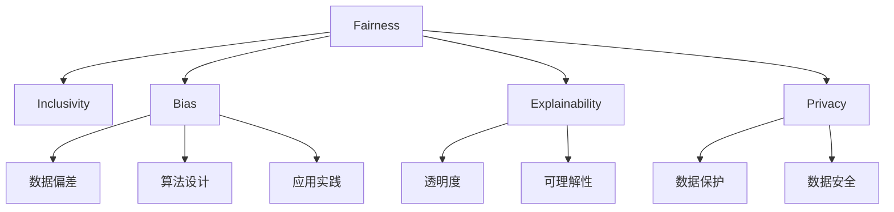

                 

# 公平与包容：确保人类计算的平等性

> 关键词：公平性,包容性,计算,算法偏见,可解释性,隐私保护,机器学习伦理

## 1. 背景介绍

随着人工智能(AI)技术的快速发展，人类计算的规模和影响力已经达到前所未有的高度。从智能客服、个性化推荐，到医疗诊断、自动驾驶，AI技术正在深度融合到社会的各个角落，深刻改变着我们的生产生活方式。然而，这一过程中也孕育出新的挑战，尤其是在计算的公平性与包容性方面，引起了广泛的关注和讨论。

**问题由来**：
- AI模型在数据、算法和应用过程中，可能因为数据偏见、算法设计缺陷或社会不公等因素，导致对某些群体的歧视或不平等对待。例如，算法招聘、信用评分、广告投放等应用中，都曾出现因为种族、性别、年龄等因素导致的偏见。
- 在AI技术的开发和应用过程中，如何确保计算的公平性和包容性，成为一个亟需解决的问题。

**问题核心关键点**：
- 计算公平性：指AI系统在不同群体间提供平等的计算资源和服务，避免歧视和偏见。
- 计算包容性：指AI系统能够包容不同的需求、文化和背景，提供灵活多样、个性化的计算服务。

## 2. 核心概念与联系

### 2.1 核心概念概述

为更好地理解公平性与包容性在人类计算中的应用，本节将介绍几个密切相关的核心概念：

- 公平性(Fairness)：指在AI系统中，不同群体间得到平等、公正的计算资源和服务。
- 包容性(Inclusivity)：指AI系统能够包容不同的需求、文化和背景，提供灵活多样、个性化的计算服务。
- 偏见(Bias)：指在数据、算法或应用过程中，由于偏见性因素导致的不平等或歧视。
- 可解释性(Explainability)：指AI系统的决策过程透明、可理解，用户可以理解和信任AI的输出。
- 隐私保护(Privacy)：指在计算过程中，保护用户数据的隐私和安全，避免数据泄露和滥用。

这些核心概念之间的逻辑关系可以通过以下Mermaid流程图来展示：



这个流程图展示了几大核心概念及其之间的关系：

1. 公平性基于包容性和隐私保护，同时需要避免偏见。
2. 包容性需要确保公平性，同时提供个性化的服务。
3. 偏见可能存在于数据、算法或应用中，需要通过公平性、包容性和隐私保护来解决。
4. 可解释性是确保公平性和包容性的重要手段，使得系统决策透明、可理解。
5. 隐私保护是公平性和包容性的前提，保护用户数据不被滥用。

## 3. 核心算法原理 & 具体操作步骤

### 3.1 算法原理概述

确保计算的公平性和包容性，核心在于构建公平的算法和系统。常用的方法包括数据清洗、算法修正和应用优化，具体步骤如下：

1. **数据清洗**：通过预处理数据，去除偏见性数据和异常值，确保训练数据集的多样性和代表性。
2. **算法修正**：采用公平性约束或正则化方法，限制算法模型在特定维度上的表现，避免特定群体的偏见。
3. **应用优化**：设计包容性的应用流程，通过多样化的输出和反馈机制，满足不同用户的需求和背景。

### 3.2 算法步骤详解

下面详细介绍构建公平包容的AI系统的关键步骤：

**Step 1: 数据收集与清洗**
- 收集多源、多维度数据，确保数据多样性和代表性。
- 清洗数据，去除重复、缺失、异常值，确保数据质量。
- 检测和修正数据中的偏见，如使用统计方法检测样本中不同群体的比例差异。

**Step 2: 算法设计**
- 选择适合任务的公平算法，如公平分类算法、公平回归算法等。
- 应用正则化或约束方法，如平方惩罚、拉格朗日乘子法等，限制算法在特定维度上的表现。
- 进行公平性评估，使用如均衡误差、差异度量等指标衡量模型的公平性。

**Step 3: 应用设计**
- 设计包容性的应用流程，支持多种语言、文化和背景。
- 设计多样化的输出机制，提供定制化的服务。
- 设计用户反馈机制，根据用户反馈调整系统输出。

### 3.3 算法优缺点

构建公平包容的AI系统，具有以下优点：
1. 提升用户满意度：通过公平、包容的服务，满足不同用户的需求，提升用户体验。
2. 减少法律风险：避免因偏见导致的歧视和不公，减少法律纠纷和监管风险。
3. 增强信任度：通过透明的可解释性机制，增强用户对系统的信任和接受度。

但同时也存在一些缺点：
1. 成本高昂：数据收集和清洗、算法设计和优化等都需要大量资源投入。
2. 技术复杂：构建公平包容的系统涉及多个领域的技术，实现难度较大。
3. 效果不理想：即便设计了完善的公平性措施，仍然难以完全消除偏见和歧视。

尽管存在这些局限，但构建公平包容的AI系统，是大数据时代发展的必然选择，是社会进步的必然要求。

### 3.4 算法应用领域

公平包容的AI系统，已经在多个领域得到了应用，例如：

- 金融领域：在贷款审批、信用评分、保险赔付等场景中，避免因性别、种族、年龄等因素导致的歧视。
- 医疗领域：在病患诊断、治疗方案推荐等场景中，提供公平、个性化的医疗服务。
- 教育领域：在智能推荐、作业批改、学情分析等场景中，确保不同背景学生的平等机会。
- 司法领域：在判决、评估、监督等场景中，避免因偏见导致的司法不公。
- 人资管理：在招聘、晋升、薪酬等场景中，确保不同群体的公平机会。

## 4. 数学模型和公式 & 详细讲解 & 举例说明

### 4.1 数学模型构建

构建公平包容的AI系统，需要设计和应用多种数学模型。本节将介绍一些常用的数学模型及其构建方法。

- 公平分类模型：通过修改分类器的损失函数，限制在特定属性维度上的表现，避免歧视。
- 公平回归模型：通过添加正则化项，限制回归模型的偏倚，确保不同群体的公平性。
- 差异度量模型：通过计算模型在不同群体间的差异，衡量模型的公平性。

### 4.2 公式推导过程

以公平回归模型为例，其数学模型可以表示为：

$$
\min_{\theta} \frac{1}{n}\sum_{i=1}^n (y_i - f(x_i; \theta))^2 + \lambda \frac{1}{n} \sum_{i=1}^n \delta_{x_i} (\theta)
$$

其中，$y_i$为样本的真实标签，$f(x_i; \theta)$为模型预测，$\delta_{x_i} (\theta)$为公平性约束项。

公平性约束项通常为：

$$
\delta_{x_i} (\theta) = \frac{1}{n} \sum_{j=1}^n |f(x_j; \theta) - f(x_i; \theta)|
$$

即模型在每个样本的预测值与其在群体内的平均预测值之间的差距。

### 4.3 案例分析与讲解

下面以医疗领域为例，分析如何构建公平包容的AI系统。

- 数据收集：收集病人的病历、影像、基因等信息，确保数据多样性和代表性。
- 数据清洗：去除重复、缺失、异常数据，确保数据质量。
- 算法设计：采用公平回归模型，限制模型在性别、种族等属性维度上的表现，避免因偏见导致的歧视。
- 应用设计：设计多样化的输出机制，根据病人的具体情况推荐个性化的治疗方案。
- 结果评估：使用差异度量指标，衡量模型在不同性别、种族等群体间的公平性。

## 5. 项目实践：代码实例和详细解释说明

### 5.1 开发环境搭建

在进行公平包容的AI系统开发前，我们需要准备好开发环境。以下是使用Python进行PyTorch开发的环境配置流程：

1. 安装Anaconda：从官网下载并安装Anaconda，用于创建独立的Python环境。

2. 创建并激活虚拟环境：
```bash
conda create -n pytorch-env python=3.8 
conda activate pytorch-env
```

3. 安装PyTorch：根据CUDA版本，从官网获取对应的安装命令。例如：
```bash
conda install pytorch torchvision torchaudio cudatoolkit=11.1 -c pytorch -c conda-forge
```

4. 安装TensorFlow：
```bash
pip install tensorflow
```

5. 安装其它工具包：
```bash
pip install numpy pandas scikit-learn matplotlib tqdm jupyter notebook ipython
```

完成上述步骤后，即可在`pytorch-env`环境中开始项目实践。

### 5.2 源代码详细实现

下面我们以公平分类为例，给出使用PyTorch进行公平分类模型训练的代码实现。

首先，定义公平分类模型：

```python
import torch
import torch.nn as nn
import torch.optim as optim

class FairClassifier(nn.Module):
    def __init__(self, input_size, num_classes):
        super(FairClassifier, self).__init__()
        self.fc1 = nn.Linear(input_size, 128)
        self.fc2 = nn.Linear(128, num_classes)
        self.delta = nn.Parameter(torch.tensor([0.1], requires_grad=True)) # 公平性约束项的超参数

    def forward(self, x):
        x = torch.relu(self.fc1(x))
        x = torch.sigmoid(self.fc2(x))
        return x, self.delta * x

    def get_delta(self, y):
        delta = torch.tensor([0.5], requires_grad=False)
        for i in range(len(y)):
            if y[i] == 1:
                delta = torch.max(delta, torch.mean(self.forward(x[i])[1]))
        return delta

    def get不公平_rate(self, y):
        delta = self.get_delta(y)
        return torch.mean(self.forward(x)[1] - delta * self.get_delta(y))
```

然后，定义训练函数和评估函数：

```python
from sklearn.metrics import accuracy_score

def train_model(model, train_data, epochs, batch_size, learning_rate):
    model.train()
    optimizer = optim.SGD(model.parameters(), lr=learning_rate, momentum=0.9)
    for epoch in range(epochs):
        total_loss = 0
        for batch in train_data:
            inputs, labels = batch
            optimizer.zero_grad()
            outputs = model(inputs)
            loss = criterion(outputs, labels)
            loss.backward()
            optimizer.step()
            total_loss += loss.item()
        print('Epoch {}/{}: Loss: {:.4f}'.format(epoch+1, epochs, total_loss/len(train_data)))
    return model

def evaluate_model(model, test_data):
    model.eval()
    total = 0
    correct = 0
    for batch in test_data:
        inputs, labels = batch
        outputs = model(inputs)
        _, predicted = torch.max(outputs.data, 1)
        total += labels.size(0)
        correct += (predicted == labels).sum().item()
    accuracy = 100 * correct / total
    print('Accuracy: {:.2f}%'.format(accuracy))
    return accuracy
```

最后，启动训练流程并在测试集上评估：

```python
from torch.utils.data import DataLoader

# 构建数据集
train_data = # 训练集
test_data = # 测试集

# 构建模型
model = FairClassifier(input_size, num_classes)

# 训练模型
train_model(model, train_data, epochs=10, batch_size=64, learning_rate=0.01)

# 评估模型
evaluate_model(model, test_data)
```

以上就是使用PyTorch对公平分类模型进行训练的完整代码实现。可以看到，得益于PyTorch的强大封装，我们可以用相对简洁的代码完成公平分类模型的训练。

### 5.3 代码解读与分析

让我们再详细解读一下关键代码的实现细节：

**FairClassifier类**：
- `__init__`方法：初始化模型结构，包括两个全连接层和一个公平性约束项。
- `forward`方法：定义模型的前向传播过程，包括两个全连接层的计算和公平性约束项的计算。
- `get_delta`方法：计算公平性约束项，即每个类别在训练集中的平均预测值。
- `get_unfair_rate`方法：计算模型在训练集中的不公平率，即模型预测值与公平性约束项的差距。

**train_model函数**：
- 定义训练过程中的优化器、损失函数等关键组件。
- 在每个epoch内，对每个batch进行前向传播、反向传播和参数更新。
- 打印每个epoch的平均损失，评估模型性能。

**evaluate_model函数**：
- 在测试集上评估模型的预测准确率。
- 打印测试集上的准确率，评估模型性能。

## 6. 实际应用场景

### 6.1 智能招聘系统

在智能招聘系统中，基于公平包容的AI技术，可以自动筛选简历，提供公平、公正的招聘决策。传统的招聘系统往往因为性别、年龄等因素导致歧视，而公平包容的AI系统可以通过算法修正和数据清洗，确保招聘过程的公平性。

在技术实现上，可以收集招聘单位的历史招聘数据，提取不同群体的背景信息，将其作为监督数据对模型进行微调。微调后的模型能够自动理解不同群体的特征，避免在简历筛选和面试推荐中产生偏见。

### 6.2 医疗诊断系统

医疗诊断系统中的AI技术，已经广泛应用于病患的诊断和治疗。然而，由于数据偏见和算法设计问题，可能存在对某些群体的歧视。通过公平包容的AI技术，可以确保诊断和治疗过程的公平性和包容性，避免因性别、种族等因素导致的偏见。

在技术实现上，可以收集不同群体的病患数据，提取和病人相关的病历、影像、基因等信息，构建公平回归模型。模型能够从多维数据中提取病人的特征，避免因性别、种族等因素导致的偏见，提供公平、个性化的诊断和治疗方案。

### 6.3 智能客服系统

智能客服系统的AI技术，已经成为企业提高客户满意度的重要手段。然而，由于数据偏见和算法设计问题，可能存在对某些群体的歧视。通过公平包容的AI技术，可以确保客服过程中对不同群体的平等对待。

在技术实现上，可以收集不同群体的客户服务数据，提取客户的意图、情感等信息，构建公平分类模型。模型能够从多维数据中提取客户的特征，避免因性别、年龄等因素导致的偏见，提供公平、个性化的客户服务。

### 6.4 未来应用展望

随着公平包容的AI技术不断发展，将在更多领域得到应用，为社会公平和包容性提供新的解决方案。

在教育领域，基于公平包容的AI技术，可以提供个性化的学习资源和辅导，确保不同群体的平等学习机会。在金融领域，基于公平包容的AI技术，可以提供公平的贷款审批和保险赔付，避免因性别、年龄等因素导致的歧视。

未来，公平包容的AI技术还将进一步拓展到智慧城市、环境保护、公共安全等多个领域，为社会公平和包容性注入新的动力。相信伴随技术的进步，公平包容的AI技术将成为实现社会进步的重要手段。

## 7. 工具和资源推荐

### 7.1 学习资源推荐

为了帮助开发者系统掌握公平包容的AI技术，这里推荐一些优质的学习资源：

1. 《机器学习导论》书籍：清华大学出版社，介绍了机器学习的基本概念和公平性算法。
2. 《Python机器学习》书籍：用Python实现机器学习算法，包括公平性算法的实现。
3. 《机器学习实战》书籍：涵盖机器学习实践案例，包括公平性算法的应用。
4. Kaggle竞赛：参加公平性数据集竞赛，实践和应用公平性算法。
5. Coursera课程：由斯坦福大学开设的公平性课程，介绍公平性算法的理论和方法。

通过对这些资源的学习实践，相信你一定能够快速掌握公平包容的AI技术的精髓，并用于解决实际的AI问题。

### 7.2 开发工具推荐

高效的开发离不开优秀的工具支持。以下是几款用于公平包容AI开发常用的工具：

1. PyTorch：基于Python的开源深度学习框架，灵活动态的计算图，适合快速迭代研究。大部分公平包容算法都有PyTorch版本的实现。
2. TensorFlow：由Google主导开发的开源深度学习框架，生产部署方便，适合大规模工程应用。
3. scikit-learn：Python机器学习库，包含多种公平性算法和数据预处理方法。
4. H2O.ai：支持分布式机器学习，支持公平性算法和模型训练。
5. DataRobot：提供自动化机器学习平台，支持公平性算法和模型训练。

合理利用这些工具，可以显著提升公平包容的AI开发效率，加快创新迭代的步伐。

### 7.3 相关论文推荐

公平包容的AI技术的发展源于学界的持续研究。以下是几篇奠基性的相关论文，推荐阅读：

1. "Bias in Pre-trained Models and Their Fine-Tuning"：分析预训练模型中的偏见，并提出修正方法。
2. "The Fairness of Pre-trained Models"：通过公平约束和正则化方法，限制模型在特定维度上的表现。
3. "Robustness is All you Need"：提出RobustNet，通过鲁棒性提升公平性，避免模型对数据偏差的敏感性。
4. "Fairness in Machine Learning: From Data to Models"：涵盖公平性算法和模型训练的全面介绍。
5. "On the Fairness of Classifier Chains"：通过组合多个公平模型，提升整体的公平性。

这些论文代表了大数据时代公平包容AI技术的发展脉络。通过学习这些前沿成果，可以帮助研究者把握学科前进方向，激发更多的创新灵感。

## 8. 总结：未来发展趋势与挑战

### 8.1 总结

本文对公平包容的AI技术进行了全面系统的介绍。首先阐述了公平性与包容性的研究背景和意义，明确了公平包容在AI系统中的重要性。其次，从原理到实践，详细讲解了公平包容的AI系统构建的关键步骤，给出了公平包容AI系统的完整代码实例。同时，本文还广泛探讨了公平包容AI技术在招聘、医疗、客服等多个行业领域的应用前景，展示了公平包容AI技术的巨大潜力。此外，本文精选了公平包容技术的各类学习资源，力求为读者提供全方位的技术指引。

通过本文的系统梳理，可以看到，公平包容的AI技术正在成为AI系统的重要组成部分，极大地提升了系统的公平性和包容性，为社会公平和包容性提供了新的解决方案。未来，伴随公平包容AI技术的持续演进，相信AI技术必将在更广阔的应用领域大放异彩，深刻影响人类的生产生活方式。

### 8.2 未来发展趋势

展望未来，公平包容的AI技术将呈现以下几个发展趋势：

1. 算法自动化：通过自动化机器学习技术，提升公平包容算法的开发效率，降低开发成本。
2. 模型融合：将公平包容算法与其它AI技术（如因果推理、强化学习等）进行融合，实现更加全面、鲁棒的公平包容系统。
3. 跨领域应用：公平包容技术将应用于更多领域，如教育、金融、医疗、司法等，实现更广泛的社会公平和包容。
4. 数据驱动：通过数据分析和挖掘，发现和消除数据中的偏见，提升公平包容算法的有效性。
5. 伦理审查：引入伦理审查机制，确保公平包容算法的道德合规性，避免潜在的社会问题。

以上趋势凸显了公平包容的AI技术的广阔前景。这些方向的探索发展，必将进一步提升AI系统的公平性和包容性，为社会公平和包容性注入新的动力。

### 8.3 面临的挑战

尽管公平包容的AI技术已经取得了瞩目成就，但在迈向更加智能化、普适化应用的过程中，它仍面临着诸多挑战：

1. 数据偏见问题：尽管通过数据清洗和修正，可以一定程度上减少数据偏见，但仍难以完全消除，数据偏见可能通过模型传递到下游任务。
2. 算法复杂性：公平包容算法设计复杂，需要综合考虑多维度公平性约束，实现难度较大。
3. 计算资源需求高：公平包容算法往往需要大量的计算资源和存储空间，限制了其在实际应用中的推广。
4. 用户接受度：尽管公平包容算法可以有效避免偏见，但用户对AI系统的信任度仍需进一步提升。
5. 隐私保护：在数据收集和处理过程中，如何保护用户隐私，避免数据滥用，仍是一个重要问题。

尽管存在这些挑战，但公平包容的AI技术仍然是推动AI技术发展的必然选择，是社会进步的必然要求。只有持续优化算法、数据和应用，才能确保公平包容AI技术的广泛应用和持续发展。

### 8.4 研究展望

未来的研究需要在以下几个方面寻求新的突破：

1. 改进数据预处理方法：开发更加高效的数据清洗和修正算法，消除数据偏见。
2. 优化公平包容算法：开发更加自动化、易用化的公平包容算法，降低开发难度和成本。
3. 提升算法可解释性：开发更加可解释的公平包容算法，提升用户信任度。
4. 引入外部知识库：将专家知识与神经网络模型进行融合，提升公平包容算法的效果。
5. 扩展应用领域：将公平包容技术应用到更多领域，如教育、金融、医疗、司法等，实现更广泛的社会公平和包容。

这些研究方向将推动公平包容的AI技术不断进步，为实现社会公平和包容性提供新的动力。

## 9. 附录：常见问题与解答

**Q1：公平包容的AI系统是否适用于所有行业？**

A: 公平包容的AI系统在许多行业中都有应用前景。如在招聘、医疗、金融、教育等领域，可以实现公平、包容的决策和推荐。然而，对于某些特定领域（如司法、军事等），由于数据隐私和安全等因素，公平包容AI系统的应用可能存在一定的限制。

**Q2：公平包容的AI系统是否会导致数据泄露？**

A: 公平包容的AI系统在数据处理和应用过程中，需要严格遵守数据隐私和保护法规，如GDPR等。通过采用数据脱敏、加密等技术，可以最大程度地保护用户数据隐私。

**Q3：公平包容的AI系统是否需要大量标注数据？**

A: 公平包容的AI系统需要一定的标注数据进行训练，但相比传统机器学习算法，需要的数据量相对较少。通过数据清洗和修正，可以有效减少数据偏见。

**Q4：公平包容的AI系统是否会影响性能？**

A: 公平包容的AI系统在设计过程中，可能会增加模型复杂度和计算资源消耗。然而，公平包容算法通常具有较好的泛化性能，不会显著影响模型整体性能。

**Q5：公平包容的AI系统是否需要持续更新？**

A: 公平包容的AI系统需要持续监控数据和算法，确保其公平性和包容性。随着数据分布的变化，公平包容算法需要定期更新和优化，以保持其性能和公平性。

---

作者：禅与计算机程序设计艺术 / Zen and the Art of Computer Programming

