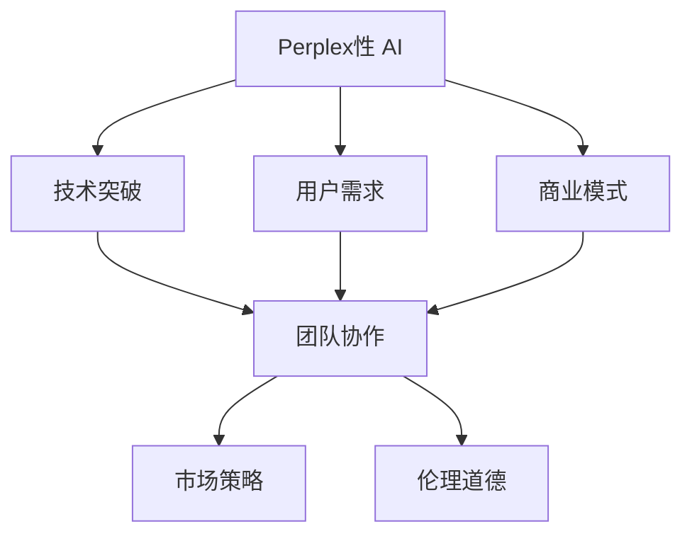

                 

# 创业精神：Perplex性 AI 的基因

## 1. 背景介绍

### 1.1 问题由来

人工智能(AI)领域近年来取得了飞速发展，各大企业纷纷涌入其中，力求在这场数字化革命中占据有利地位。在这场技术变革的浪潮中，创业公司因其灵活、创新的优势，逐步崭露头角。AI领域的创业精神不仅体现在技术突破上，更体现在如何将新技术落地应用，创造价值上。

### 1.2 问题核心关键点

AI创业公司的成功离不开以下几个核心关键点：

1. **技术突破**：强大的技术储备和创新能力是创业公司的立身之本。
2. **用户需求**：精准定位用户需求，打造能够切实解决用户问题的产品。
3. **商业模式**：构建可持续发展的商业模式，实现盈利与价值。
4. **团队协作**：组建高效、团结的团队，激发创造力。
5. **市场策略**：灵活应对市场变化，精准投放资源。
6. **伦理道德**：遵守伦理规范，确保技术的健康发展。

本文旨在深入探讨AI创业公司的创业精神，通过分析这些核心关键点，揭示Perplex性 AI的基因，为AI创业者提供实践指导。

## 2. 核心概念与联系

### 2.1 核心概念概述

为了更好地理解AI创业公司的核心概念，本节将详细介绍几个密切相关的核心概念：

- **Perplex性 AI**：指AI模型在面对复杂、未知场景时，能够提供精准、鲁棒、可解释的解决方案的能力。
- **创业精神**：指创业公司追求创新、坚韧不拔、勇于冒险的精神。
- **基因**：指AI模型和创业公司的内在特质和驱动因素。
- **技术突破**：指在算法、模型、数据等方面取得重大进展。
- **用户需求**：指目标用户的具体需求和痛点。
- **商业模式**：指实现产品或服务价值变现的策略和模式。
- **团队协作**：指团队成员间的沟通、合作与分工。
- **市场策略**：指制定和执行市场定位、竞争策略等。
- **伦理道德**：指遵守法律法规、道德规范的行为准则。

这些概念之间的逻辑关系可以通过以下Mermaid流程图来展示：



这个流程图展示了大语言模型的核心概念及其之间的关系：

1. 创业公司的成功离不开对Perplex性 AI的突破，但同时需要精准的用户需求和可持续的商业模式。
2. 技术突破和用户需求相互促进，共同推动产品的创新与优化。
3. 商业模式和市场策略决定公司的市场定位和竞争策略。
4. 团队协作和伦理道德保障公司的长期稳定发展。

这些概念共同构成了AI创业公司的核心框架，使其能够在复杂多变的市场环境中保持竞争优势。

## 3. 核心算法原理 & 具体操作步骤

### 3.1 算法原理概述

Perplex性 AI的核心在于模型在处理复杂、未知场景时，能够提供高精度、鲁棒性和可解释性的解决方案。其核心算法原理可以概括为以下几个方面：

1. **模型设计**：选择合适的算法架构，如深度神经网络、Transformer等，确保模型具有良好的表达能力和泛化能力。
2. **数据预处理**：对输入数据进行标准化、归一化、增量等处理，提升模型的稳定性和鲁棒性。
3. **损失函数**：设计合适的损失函数，如交叉熵、均方误差等，确保模型输出与真实标签之间的差异最小化。
4. **优化算法**：选择合适的优化算法，如梯度下降、AdamW等，确保模型参数能够不断优化，接近最优解。
5. **正则化技术**：应用L2正则、Dropout等技术，防止过拟合，提升模型泛化能力。

### 3.2 算法步骤详解

Perplex性 AI的算法步骤可以分为以下几个关键环节：

**Step 1: 模型选择与设计**

1. **算法选择**：根据任务类型选择适合的算法架构，如卷积神经网络、循环神经网络、Transformer等。
2. **模型设计**：定义模型的输入、输出和隐藏层结构，确定网络参数。
3. **初始化**：对模型参数进行初始化，一般使用随机初始化或预训练模型权重。

**Step 2: 数据准备与预处理**

1. **数据收集**：收集并准备标注数据集，分为训练集、验证集和测试集。
2. **数据标准化**：对输入数据进行归一化、标准化等处理，提升模型稳定性。
3. **数据增强**：通过扩充训练集，提升模型泛化能力，如数据扩充、增量学习等。

**Step 3: 模型训练与优化**

1. **损失函数选择**：根据任务类型选择合适的损失函数，如交叉熵、均方误差等。
2. **优化算法选择**：选择合适的优化算法，如梯度下降、AdamW等，并设定合适的学习率、批大小、迭代轮数等超参数。
3. **模型训练**：对模型进行训练，不断更新模型参数，最小化损失函数。
4. **正则化技术应用**：应用L2正则、Dropout等技术，防止过拟合。
5. **模型评估**：在验证集上评估模型性能，根据评估结果调整超参数。

**Step 4: 模型应用与部署**

1. **模型部署**：将训练好的模型部署到生产环境中，进行推理预测。
2. **性能监控**：实时监控模型性能，确保模型在实际应用中的稳定性和准确性。
3. **用户反馈**：收集用户反馈，持续优化模型和应用。

### 3.3 算法优缺点

Perplex性 AI的算法具有以下优点：

1. **高精度**：通过深度学习和优化算法，模型能够提供高精度的预测结果。
2. **鲁棒性**：通过数据增强和正则化技术，模型具有较强的鲁棒性，能够应对复杂、未知场景。
3. **可解释性**：通过模型解释和可视化技术，模型能够提供可解释的决策过程。

但同时，Perplex性 AI也存在一些缺点：

1. **计算资源需求高**：深度学习模型通常需要大量计算资源，如GPU、TPU等高性能设备。
2. **训练时间长**：复杂模型训练时间较长，需要较长的开发周期。
3. **数据依赖性强**：模型需要大量标注数据进行训练，数据获取成本较高。

### 3.4 算法应用领域

Perplex性 AI在多个领域中得到了广泛应用，例如：

- **医疗诊断**：通过深度学习模型分析医疗图像、病历数据，提高诊断准确率。
- **金融风险管理**：通过深度学习模型预测市场趋势、风险，优化投资决策。
- **智能推荐系统**：通过深度学习模型分析用户行为数据，提供个性化推荐。
- **自然语言处理**：通过深度学习模型处理自然语言数据，进行文本分类、情感分析、机器翻译等。
- **智能制造**：通过深度学习模型分析生产数据，优化生产流程，提高生产效率。

以上这些应用领域都展示了Perplex性 AI的强大能力，为AI创业者提供了丰富的应用方向。

## 4. 数学模型和公式 & 详细讲解 & 举例说明

### 4.1 数学模型构建

本节将使用数学语言对Perplex性 AI进行更加严格的刻画。

假设模型的输入为 $x$，输出为 $y$，模型为 $f(x; \theta)$，其中 $\theta$ 为模型参数。模型的损失函数为 $L(f(x; \theta), y)$。模型的优化目标为最小化损失函数：

$$
\theta^* = \mathop{\arg\min}_{\theta} L(f(x; \theta), y)
$$

在训练过程中，我们通过反向传播算法计算损失函数的梯度：

$$
\nabla_{\theta}L(f(x; \theta), y) = \frac{\partial L(f(x; \theta), y)}{\partial \theta}
$$

通过优化算法（如梯度下降、AdamW等）更新模型参数，不断逼近最优解。

### 4.2 公式推导过程

以二分类任务为例，假设模型输出为 $f(x; \theta)$，其中 $f(x; \theta) = \sigma(Wx + b)$，$W$ 和 $b$ 为模型参数，$\sigma$ 为激活函数。

模型的损失函数为交叉熵损失：

$$
L(f(x; \theta), y) = -y\log(f(x; \theta)) - (1-y)\log(1-f(x; \theta))
$$

通过链式法则，计算损失函数对参数 $W$ 和 $b$ 的梯度：

$$
\nabla_{W}L(f(x; \theta), y) = (f(x; \theta) - y)f(x; \theta)(1 - f(x; \theta))x
$$

$$
\nabla_{b}L(f(x; \theta), y) = (f(x; \theta) - y)f(x; \theta)(1 - f(x; \theta))
$$

其中 $x$ 为输入数据的特征向量，$\sigma$ 为激活函数，$y$ 为真实标签。

### 4.3 案例分析与讲解

以医疗图像诊断为例，假设输入数据为 $x$，输出标签为 $y$，模型为 $f(x; \theta)$，其中 $\theta$ 为模型参数。

模型的损失函数为交叉熵损失：

$$
L(f(x; \theta), y) = -\sum_iy_ilog(f(x; \theta)_i)
$$

其中 $y_i$ 为第 $i$ 个样本的真实标签，$f(x; \theta)_i$ 为模型对第 $i$ 个样本的预测概率。

模型的优化目标为最小化损失函数：

$$
\theta^* = \mathop{\arg\min}_{\theta} \sum_iL(f(x; \theta), y_i)
$$

通过反向传播算法计算损失函数的梯度：

$$
\nabla_{\theta}L(f(x; \theta), y) = \frac{\partial L(f(x; \theta), y)}{\partial \theta}
$$

通过优化算法（如梯度下降、AdamW等）更新模型参数，不断逼近最优解。

## 5. 项目实践：代码实例和详细解释说明

### 5.1 开发环境搭建

在进行Perplex性 AI项目实践前，我们需要准备好开发环境。以下是使用Python进行PyTorch开发的环境配置流程：

1. 安装Anaconda：从官网下载并安装Anaconda，用于创建独立的Python环境。

2. 创建并激活虚拟环境：
```bash
conda create -n pytorch-env python=3.8 
conda activate pytorch-env
```

3. 安装PyTorch：根据CUDA版本，从官网获取对应的安装命令。例如：
```bash
conda install pytorch torchvision torchaudio cudatoolkit=11.1 -c pytorch -c conda-forge
```

4. 安装Transformers库：
```bash
pip install transformers
```

5. 安装各类工具包：
```bash
pip install numpy pandas scikit-learn matplotlib tqdm jupyter notebook ipython
```

完成上述步骤后，即可在`pytorch-env`环境中开始Perplex性 AI项目实践。

### 5.2 源代码详细实现

下面我们以二分类任务为例，给出使用Transformers库对BERT模型进行Perplex性 AI项目开发的PyTorch代码实现。

首先，定义二分类任务的数据处理函数：

```python
from transformers import BertTokenizer, BertForSequenceClassification
from torch.utils.data import Dataset, DataLoader
import torch

class BinaryDataset(Dataset):
    def __init__(self, texts, labels):
        self.texts = texts
        self.labels = labels
        self.tokenizer = BertTokenizer.from_pretrained('bert-base-cased')

    def __len__(self):
        return len(self.texts)

    def __getitem__(self, item):
        text = self.texts[item]
        label = self.labels[item]

        encoding = self.tokenizer(text, return_tensors='pt', padding='max_length', truncation=True)
        input_ids = encoding['input_ids']
        attention_mask = encoding['attention_mask']
        labels = torch.tensor(label, dtype=torch.long)

        return {'input_ids': input_ids, 
                'attention_mask': attention_mask,
                'labels': labels}
```

然后，定义模型和优化器：

```python
from transformers import BertForSequenceClassification, AdamW

model = BertForSequenceClassification.from_pretrained('bert-base-cased', num_labels=2)

optimizer = AdamW(model.parameters(), lr=2e-5)
```

接着，定义训练和评估函数：

```python
device = torch.device('cuda') if torch.cuda.is_available() else torch.device('cpu')
model.to(device)

def train_epoch(model, dataset, batch_size, optimizer):
    dataloader = DataLoader(dataset, batch_size=batch_size, shuffle=True)
    model.train()
    epoch_loss = 0
    for batch in dataloader:
        input_ids = batch['input_ids'].to(device)
        attention_mask = batch['attention_mask'].to(device)
        labels = batch['labels'].to(device)
        model.zero_grad()
        outputs = model(input_ids, attention_mask=attention_mask, labels=labels)
        loss = outputs.loss
        epoch_loss += loss.item()
        loss.backward()
        optimizer.step()
    return epoch_loss / len(dataloader)

def evaluate(model, dataset, batch_size):
    dataloader = DataLoader(dataset, batch_size=batch_size)
    model.eval()
    preds, labels = [], []
    with torch.no_grad():
        for batch in dataloader:
            input_ids = batch['input_ids'].to(device)
            attention_mask = batch['attention_mask'].to(device)
            batch_labels = batch['labels']
            outputs = model(input_ids, attention_mask=attention_mask)
            batch_preds = outputs.logits.argmax(dim=1).to('cpu').tolist()
            batch_labels = batch_labels.to('cpu').tolist()
            for pred, label in zip(batch_preds, batch_labels):
                preds.append(pred)
                labels.append(label)

    print(classification_report(labels, preds))
```

最后，启动训练流程并在测试集上评估：

```python
epochs = 5
batch_size = 16

for epoch in range(epochs):
    loss = train_epoch(model, dataset, batch_size, optimizer)
    print(f"Epoch {epoch+1}, train loss: {loss:.3f}")

    print(f"Epoch {epoch+1}, dev results:")
    evaluate(model, dev_dataset, batch_size)

print("Test results:")
evaluate(model, test_dataset, batch_size)
```

以上就是使用PyTorch对BERT模型进行Perplex性 AI项目开发的完整代码实现。可以看到，得益于Transformers库的强大封装，我们可以用相对简洁的代码完成BERT模型的训练和评估。

### 5.3 代码解读与分析

让我们再详细解读一下关键代码的实现细节：

**BinaryDataset类**：
- `__init__`方法：初始化文本、标签、分词器等关键组件。
- `__len__`方法：返回数据集的样本数量。
- `__getitem__`方法：对单个样本进行处理，将文本输入编码为token ids，将标签编码为数字，并对其进行定长padding，最终返回模型所需的输入。

**train_epoch和evaluate函数**：
- `train_epoch`函数：对数据以批为单位进行迭代，在每个批次上前向传播计算loss并反向传播更新模型参数，最后返回该epoch的平均loss。
- `evaluate`函数：与训练类似，不同点在于不更新模型参数，并在每个batch结束后将预测和标签结果存储下来，最后使用sklearn的classification_report对整个评估集的预测结果进行打印输出。

**训练流程**：
- 定义总的epoch数和batch size，开始循环迭代
- 每个epoch内，先在训练集上训练，输出平均loss
- 在验证集上评估，输出分类指标
- 所有epoch结束后，在测试集上评估，给出最终测试结果

可以看到，PyTorch配合Transformers库使得BERT微调的代码实现变得简洁高效。开发者可以将更多精力放在数据处理、模型改进等高层逻辑上，而不必过多关注底层的实现细节。

当然，工业级的系统实现还需考虑更多因素，如模型的保存和部署、超参数的自动搜索、更灵活的任务适配层等。但核心的微调范式基本与此类似。

## 6. 实际应用场景

### 6.1 医疗诊断系统

Perplex性 AI在医疗领域中的应用前景广阔。通过深度学习模型分析医疗图像、病历数据，能够快速准确地辅助医生进行诊断。

具体而言，可以收集大量医学图像、病历数据，并对其进行标注。在此基础上对预训练语言模型进行微调，使其能够学习到疾病与症状之间的映射关系。微调后的模型可以用于医学图像的自动标注、病历数据的自动分析，提高诊断的效率和准确性。

### 6.2 金融风控系统

金融领域的数据量大、业务复杂，传统的人工风控方式难以应对。Perplex性 AI可以通过深度学习模型分析交易数据、客户行为数据，识别出潜在的风险因素，构建更加精准的风控模型。

具体而言，可以收集金融交易数据、客户行为数据，并对其进行标注。在此基础上对预训练语言模型进行微调，使其能够学习到交易行为与风险之间的映射关系。微调后的模型可以用于实时监控交易行为、识别异常交易，提高金融风险管理的能力。

### 6.3 智能推荐系统

推荐系统是电商、内容分发等平台的核心功能。传统的推荐系统往往只依赖用户的历史行为数据进行物品推荐，难以深入理解用户的真实兴趣偏好。Perplex性 AI可以通过深度学习模型分析用户行为数据，提供个性化推荐。

具体而言，可以收集用户浏览、点击、评论、分享等行为数据，并提取和用户交互的物品标题、描述、标签等文本内容。将文本内容作为模型输入，用户的后续行为（如是否点击、购买等）作为监督信号，在此基础上微调预训练语言模型。微调后的模型能够从文本内容中准确把握用户的兴趣点。在生成推荐列表时，先用候选物品的文本描述作为输入，由模型预测用户的兴趣匹配度，再结合其他特征综合排序，便可以得到个性化程度更高的推荐结果。

### 6.4 未来应用展望

展望未来，Perplex性 AI将在更多领域得到应用，为人类社会带来深远影响。

在智慧医疗领域，Perplex性 AI可以通过深度学习模型分析医疗图像、病历数据，提供精准的诊断和治疗方案。在智慧金融领域，Perplex性 AI可以通过深度学习模型分析交易数据、客户行为数据，构建更加精准的风控模型。在智慧制造领域，Perplex性 AI可以通过深度学习模型分析生产数据，优化生产流程，提高生产效率。

除了这些领域，Perplex性 AI还将渗透到智能家居、智能交通、智慧城市等更多领域，为人类生活带来更加便捷、高效、智能的体验。

## 7. 工具和资源推荐

### 7.1 学习资源推荐

为了帮助开发者系统掌握Perplex性 AI的理论基础和实践技巧，这里推荐一些优质的学习资源：

1. 《深度学习》课程：斯坦福大学开设的深度学习入门课程，详细讲解深度学习的基本概念和算法。
2. 《Python深度学习》书籍：深度学习领域的经典书籍，详细讲解深度学习模型的构建和训练。
3. 《TensorFlow实战》书籍：TensorFlow的官方书籍，详细讲解TensorFlow的框架和应用。
4. 《自然语言处理基础》课程：斯坦福大学开设的NLP入门课程，讲解自然语言处理的基本概念和算法。
5. 《Transformer》论文：Transformer模型的原始论文，详细讲解Transformer架构的设计和优化。

通过对这些资源的学习实践，相信你一定能够快速掌握Perplex性 AI的精髓，并用于解决实际的NLP问题。

### 7.2 开发工具推荐

高效的开发离不开优秀的工具支持。以下是几款用于Perplex性 AI开发常用的工具：

1. PyTorch：基于Python的开源深度学习框架，灵活性高，适合研究型应用。
2. TensorFlow：由Google主导开发的深度学习框架，生产部署方便，适合工程应用。
3. Transformers库：HuggingFace开发的NLP工具库，集成了多个SOTA模型，提供便利的API接口。
4. Weights & Biases：模型训练的实验跟踪工具，可以记录和可视化模型训练过程中的各项指标，方便对比和调优。
5. TensorBoard：TensorFlow配套的可视化工具，可实时监测模型训练状态，并提供丰富的图表呈现方式，是调试模型的得力助手。

合理利用这些工具，可以显著提升Perplex性 AI的开发效率，加快创新迭代的步伐。

### 7.3 相关论文推荐

Perplex性 AI的发展源于学界的持续研究。以下是几篇奠基性的相关论文，推荐阅读：

1. Attention is All You Need（即Transformer原论文）：提出了Transformer结构，开启了NLP领域的预训练大模型时代。
2. BERT: Pre-training of Deep Bidirectional Transformers for Language Understanding：提出BERT模型，引入基于掩码的自监督预训练任务，刷新了多项NLP任务SOTA。
3. Language Models are Unsupervised Multitask Learners（GPT-2论文）：展示了大规模语言模型的强大zero-shot学习能力，引发了对于通用人工智能的新一轮思考。
4. Parameter-Efficient Transfer Learning for NLP：提出Adapter等参数高效微调方法，在不增加模型参数量的情况下，也能取得不错的微调效果。
5. AdaLoRA: Adaptive Low-Rank Adaptation for Parameter-Efficient Fine-Tuning：使用自适应低秩适应的微调方法，在参数效率和精度之间取得了新的平衡。
6. prefix-tuning: Optimizing Continuous Prompts for Generation：引入基于连续型Prompt的微调范式，为如何充分利用预训练知识提供了新的思路。

这些论文代表了大语言模型微调技术的发展脉络。通过学习这些前沿成果，可以帮助研究者把握学科前进方向，激发更多的创新灵感。

## 8. 总结：未来发展趋势与挑战

### 8.1 总结

本文对Perplex性 AI创业公司的创业精神进行了全面系统的介绍。首先阐述了Perplex性 AI在NLP领域的发展背景和应用前景，明确了微调在拓展预训练模型应用、提升下游任务性能方面的独特价值。其次，从原理到实践，详细讲解了Perplex性 AI的数学原理和关键步骤，给出了微调任务开发的完整代码实例。同时，本文还广泛探讨了Perplex性 AI在多个行业领域的应用前景，展示了Perplex性 AI的强大能力。

通过本文的系统梳理，可以看到，Perplex性 AI在处理复杂、未知场景时，能够提供精准、鲁棒、可解释的解决方案，成为NLP领域的重要范式。AI创业者需要理解和掌握这些核心技术，才能在激烈的市场竞争中保持领先地位。

### 8.2 未来发展趋势

展望未来，Perplex性 AI的发展趋势将呈现以下几个方向：

1. 模型规模持续增大。随着算力成本的下降和数据规模的扩张，预训练语言模型的参数量还将持续增长。超大模型蕴含的丰富语言知识，有望支撑更加复杂多变的下游任务微调。
2. 模型通用性增强。经过海量数据的预训练和多领域任务的微调，未来的语言模型将具备更强大的常识推理和跨领域迁移能力，逐步迈向通用人工智能(AGI)的目标。
3. 模型可解释性提升。未来的模型将更加注重可解释性，通过模型解释和可视化技术，提升模型的透明度和可信度。
4. 数据需求降低。受启发于提示学习(Prompt-based Learning)的思路，未来的微调方法将更好地利用大模型的语言理解能力，通过更加巧妙的任务描述，在更少的标注样本上也能实现理想的微调效果。
5. 多模态融合。未来的模型将融合视觉、语音、文本等多种模态信息，实现多模态信息的协同建模。

以上趋势凸显了Perplex性 AI的广阔前景。这些方向的探索发展，必将进一步提升NLP系统的性能和应用范围，为人类认知智能的进化带来深远影响。

### 8.3 面临的挑战

尽管Perplex性 AI在处理复杂、未知场景时已经展现出强大的能力，但在迈向更加智能化、普适化应用的过程中，仍面临诸多挑战：

1. 计算资源需求高。深度学习模型通常需要大量计算资源，如GPU、TPU等高性能设备。
2. 训练时间长。复杂模型训练时间较长，需要较长的开发周期。
3. 数据依赖性强。模型需要大量标注数据进行训练，数据获取成本较高。
4. 模型可解释性不足。模型的决策过程难以解释，难以满足高风险应用的需求。
5. 模型鲁棒性不足。面对域外数据时，泛化性能往往大打折扣。

### 8.4 研究展望

面对Perplex性 AI面临的这些挑战，未来的研究需要在以下几个方面寻求新的突破：

1. 探索无监督和半监督微调方法。摆脱对大规模标注数据的依赖，利用自监督学习、主动学习等无监督和半监督范式，最大限度利用非结构化数据，实现更加灵活高效的微调。
2. 研究参数高效和计算高效的微调范式。开发更加参数高效的微调方法，在固定大部分预训练参数的同时，只更新极少量的任务相关参数。同时优化微调模型的计算图，减少前向传播和反向传播的资源消耗，实现更加轻量级、实时性的部署。
3. 融合因果和对比学习范式。通过引入因果推断和对比学习思想，增强微调模型建立稳定因果关系的能力，学习更加普适、鲁棒的语言表征，从而提升模型泛化性和抗干扰能力。
4. 结合因果分析和博弈论工具。将因果分析方法引入微调模型，识别出模型决策的关键特征，增强输出解释的因果性和逻辑性。借助博弈论工具刻画人机交互过程，主动探索并规避模型的脆弱点，提高系统稳定性。
5. 纳入伦理道德约束。在模型训练目标中引入伦理导向的评估指标，过滤和惩罚有偏见、有害的输出倾向。加强人工干预和审核，建立模型行为的监管机制，确保输出符合人类价值观和伦理道德。

这些研究方向的探索，必将引领Perplex性 AI技术迈向更高的台阶，为构建安全、可靠、可解释、可控的智能系统铺平道路。面向未来，Perplex性 AI需要与其他人工智能技术进行更深入的融合，如知识表示、因果推理、强化学习等，多路径协同发力，共同推动自然语言理解和智能交互系统的进步。只有勇于创新、敢于突破，才能不断拓展语言模型的边界，让智能技术更好地造福人类社会。

## 9. 附录：常见问题与解答

**Q1：Perplex性 AI是否适用于所有NLP任务？**

A: Perplex性 AI在大多数NLP任务上都能取得不错的效果，特别是对于数据量较小的任务。但对于一些特定领域的任务，如医学、法律等，仅仅依靠通用语料预训练的模型可能难以很好地适应。此时需要在特定领域语料上进一步预训练，再进行微调，才能获得理想效果。此外，对于一些需要时效性、个性化很强的任务，如对话、推荐等，微调方法也需要针对性的改进优化。

**Q2：Perplex性 AI的训练时间如何控制？**

A: 训练时间主要受模型复杂度和训练数据量影响。通过采用GPU、TPU等高性能设备，并使用批量梯度下降等优化技术，可以显著缩短训练时间。此外，还可以采用分布式训练、混合精度训练等技术，进一步加速训练过程。

**Q3：Perplex性 AI如何处理大规模数据？**

A: 处理大规模数据时，通常采用分布式训练和数据增强技术。通过将数据分为多个小块，在不同的GPU上并行训练，可以加快训练速度。数据增强技术可以通过扩充训练集，提升模型的泛化能力，如数据扩充、增量学习等。

**Q4：Perplex性 AI在落地部署时需要注意哪些问题？**

A: 将Perplex性 AI模型转化为实际应用，还需要考虑以下因素：

1. 模型裁剪：去除不必要的层和参数，减小模型尺寸，加快推理速度。
2. 量化加速：将浮点模型转为定点模型，压缩存储空间，提高计算效率。
3. 服务化封装：将模型封装为标准化服务接口，便于集成调用。
4. 弹性伸缩：根据请求流量动态调整资源配置，平衡服务质量和成本。
5. 监控告警：实时采集系统指标，设置异常告警阈值，确保服务稳定性。
6. 安全防护：采用访问鉴权、数据脱敏等措施，保障数据和模型安全。

Perplex性 AI需要开发者根据具体任务，不断迭代和优化模型、数据和算法，方能得到理想的效果。

