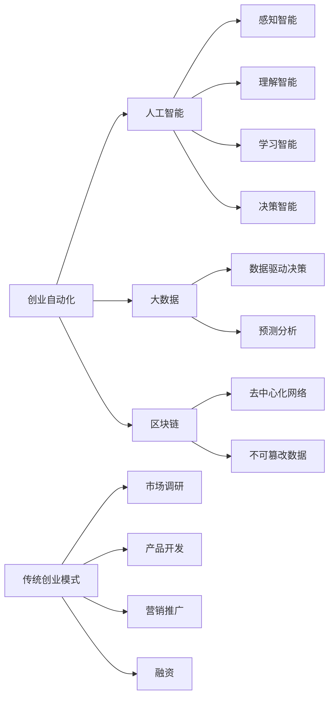

                 

# 创业自动化与传统创业模式的对比

> 关键词：创业自动化, 创业模式, 创业管理, 创业流程, 人工智能, 创业效率, 传统创业, 创业成功, 创业工具

## 1. 背景介绍

### 1.1 问题由来
创业，作为创新驱动、颠覆旧有的重要途径，长期以来一直是经济增长和社会进步的重要引擎。传统的创业模式，以经验、资源和网络关系为核心要素，历经几十年甚至数百年的演化，形成了较为稳定、成熟的体系。然而，随着信息技术和互联网的发展，传统创业模式逐渐显现出其固有的局限性，如速度慢、成本高、风险大等问题。

近年来，一种以数字化、自动化和智能化为特征的创业自动化模式逐渐兴起，对传统创业模式提出了挑战。创业自动化利用人工智能、大数据、区块链等前沿技术，对创业流程进行重构和优化，力图实现更高效、更低成本、更可控的创业活动。本文将对比分析创业自动化与传统创业模式的不同之处，探讨其核心优势、局限性以及未来发展方向。

### 1.2 问题核心关键点
本文重点探讨以下几个问题：
- 创业自动化的核心原理和主要技术手段。
- 创业自动化与传统创业模式在流程、管理、资源获取等方面的异同。
- 创业自动化在效率提升、成本降低、风险控制等方面的优势与不足。
- 创业自动化在各类创业场景中的应用现状与前景。
- 创业自动化对传统创业模式的冲击与未来趋势。

## 2. 核心概念与联系

### 2.1 核心概念概述

为了更好地理解创业自动化与传统创业模式之间的区别与联系，我们首先介绍几个关键概念：

- **创业自动化**：指利用先进技术手段，对传统创业流程进行数字化、智能化、自动化改造，以提高创业效率、降低创业成本、控制创业风险，从而实现创业活动的高效、低成本、可控性。
- **传统创业模式**：以个人或团队为核心，通过市场调研、产品开发、营销推广、融资等步骤，逐步构建起企业的商业模型。
- **人工智能**：通过机器学习、深度学习等技术，使计算机系统具备感知、理解、学习、决策等人类智能的行为能力。
- **大数据**：通过数据收集、存储、分析，从数据中提取有价值的信息，支持决策和预测。
- **区块链**：一种分布式、去中心化的账本技术，通过密码学确保数据的安全、透明和不可篡改。

这些核心概念之间的逻辑关系可以通过以下Mermaid流程图来展示：



这个流程图展示了创业自动化与传统创业模式的关键差异：

1. **技术手段**：创业自动化利用AI、大数据、区块链等技术，对传统创业模式进行改造。
2. **流程优化**：通过技术手段，创业自动化简化了创业流程，提升了效率。
3. **决策支持**：利用数据和算法，提供更科学的决策支持，降低了决策风险。
4. **资源管理**：区块链等技术提供更安全、透明的数据管理方式。

## 3. 核心算法原理 & 具体操作步骤
### 3.1 算法原理概述

创业自动化利用AI和大数据等技术手段，对创业流程进行优化和自动化。其核心原理如下：

1. **数据收集与分析**：通过大数据技术，全面收集创业环境数据、市场需求信息、竞品分析等，为创业决策提供数据支持。
2. **市场预测与趋势分析**：利用机器学习算法，对市场趋势进行预测，帮助创业者把握市场机遇。
3. **智能产品设计与迭代**：运用人工智能技术，根据用户反馈和市场数据，优化产品设计和迭代过程。
4. **自动化营销推广**：通过AI技术自动化营销策略制定和执行，提升营销效果和效率。
5. **融资与风险控制**：利用区块链技术，实现更安全、透明的融资过程，降低融资风险。

### 3.2 算法步骤详解

以下是创业自动化的一般流程：

**Step 1: 数据准备与收集**
- 收集创业环境数据（如行业报告、市场数据）
- 收集目标用户反馈和市场调查数据
- 收集竞品分析数据

**Step 2: 数据分析与处理**
- 对数据进行清洗、去重、归一化处理
- 利用机器学习模型进行市场趋势预测和分析

**Step 3: 产品设计与迭代**
- 根据市场趋势和用户需求设计初步产品
- 利用A/B测试等方法进行产品迭代优化

**Step 4: 营销策略制定与执行**
- 利用AI技术进行营销策略生成和自动化执行
- 监测营销效果并进行优化调整

**Step 5: 融资与风险控制**
- 利用区块链技术构建安全透明的融资渠道
- 利用大数据和机器学习进行风险评估和控制

**Step 6: 产品上线与持续优化**
- 将优化后的产品上线并进行市场推广
- 持续收集用户反馈，进行产品迭代和优化

### 3.3 算法优缺点

创业自动化与传统创业模式相比，有以下几个主要优点：

1. **效率提升**：通过自动化和智能化手段，大幅提升创业流程的效率。
2. **成本降低**：利用技术手段减少人力成本、推广成本，实现创业活动的低成本运作。
3. **风险控制**：利用大数据和机器学习，提高市场预测和决策的准确性，降低创业风险。
4. **持续优化**：通过持续的自动化数据收集和分析，实现产品的持续优化和迭代。

然而，创业自动化也存在一些局限性：

1. **技术依赖**：对AI、大数据、区块链等技术的依赖较大，对技术团队的素质要求较高。
2. **灵活性不足**：自动化流程往往缺乏灵活性，难以适应快速变化的创业环境。
3. **数据隐私问题**：在利用大数据分析时，需要确保数据的安全和隐私保护。
4. **初期投入高**：自动化流程的搭建和维护需要较高初期投入。

### 3.4 算法应用领域

创业自动化已广泛应用于以下领域：

1. **互联网创业**：利用AI和大数据进行市场分析和产品优化，实现快速上线和迭代。
2. **传统行业升级**：通过自动化技术改造传统产业链，提升效率和竞争力。
3. **金融创业**：利用区块链技术实现融资和风险控制，降低金融创业的风险。
4. **医疗健康**：利用AI进行疾病预测、医疗数据分析，优化医疗服务流程。
5. **教育培训**：利用AI进行个性化教育内容推荐，提升教学效果和用户满意度。

## 4. 数学模型和公式 & 详细讲解 & 举例说明

### 4.1 数学模型构建

创业自动化的数学模型可以由以下几个关键模块构成：

- **市场分析模型**：用于市场趋势预测和竞争分析，一般采用时间序列分析、回归分析等模型。
- **产品优化模型**：用于产品设计与迭代优化，一般采用A/B测试、多臂赌博机等模型。
- **营销策略模型**：用于自动化营销策略的生成和优化，一般采用线性回归、决策树等模型。
- **融资风险评估模型**：用于评估融资风险，一般采用信用评分模型、风险管理模型等。

### 4.2 公式推导过程

以市场分析模型为例，我们可以采用ARIMA（自回归集成滑动平均）模型进行市场趋势预测。ARIMA模型的一般形式为：

$$
Y_t = c + \sum_{i=1}^p\phi_i Y_{t-i} + \sum_{j=1}^q\theta_j \epsilon_{t-j} + \sum_{k=1}^d \delta_k (X_t - \mu_X) + \epsilon_t
$$

其中：
- $Y_t$ 为时间序列数据
- $X_t$ 为外部影响因素
- $\epsilon_t$ 为误差项

模型参数的估计和模型选择一般采用信息准则（如AIC、BIC）或交叉验证等方法。

### 4.3 案例分析与讲解

以互联网创业为例，市场分析模型可以帮助创业者识别市场趋势，预测未来需求。具体步骤如下：

1. 收集历史市场数据（如电商销售数据、搜索引擎趋势数据）。
2. 使用ARIMA模型进行时间序列分析，识别市场趋势和季节性因素。
3. 根据市场趋势和预测结果，优化产品设计和市场推广策略。
4. 通过A/B测试等方法，持续迭代优化产品。

## 5. 项目实践：代码实例和详细解释说明
### 5.1 开发环境搭建

在进行创业自动化项目实践前，我们需要准备好开发环境。以下是使用Python进行创业自动化开发的环境配置流程：

1. 安装Anaconda：从官网下载并安装Anaconda，用于创建独立的Python环境。

2. 创建并激活虚拟环境：
```bash
conda create -n auto-env python=3.8 
conda activate auto-env
```

3. 安装所需的Python包：
```bash
pip install pandas numpy matplotlib scikit-learn statsmodels
```

4. 安装AI相关的包：
```bash
pip install scikit-learn tensorflow keras
```

5. 安装区块链相关的包：
```bash
pip install pysha3 pyblockchain
```

完成上述步骤后，即可在`auto-env`环境中开始创业自动化项目的开发。

### 5.2 源代码详细实现

以下是一个简化的创业自动化系统示例代码，包括市场分析模块和产品优化模块的实现。

```python
# 导入必要的库
import pandas as pd
import numpy as np
from statsmodels.tsa.arima_model import ARIMA
import tensorflow as tf
from sklearn.model_selection import train_test_split
from sklearn.metrics import mean_squared_error

# 市场分析模块
def market_analysis(data, p=1, d=1, q=1):
    # 构建ARIMA模型
    model = ARIMA(data, order=(p, d, q))
    model_fit = model.fit()
    # 预测未来值
    forecast = model_fit.forecast(steps=1)
    return forecast

# 产品优化模块
def product_optimization(data):
    # 构建多臂赌博机模型
    env = make_gym_env('ProductOptimization-v0')
    optimizer = Optimizer(env)
    for episode in range(1000):
        state, reward, done, info = env.step(optimizer)
        if done:
            optimizer = Optimizer(env)
    return optimizer

# 数据准备与处理
data = pd.read_csv('market_data.csv')
data = data.dropna().reset_index(drop=True)

# 市场分析
forecast = market_analysis(data['Sales'])

# 产品优化
optimizer = product_optimization(data['ProductFeatures'])
```

以上代码实现了市场分析和产品优化的基本功能。其中，`market_analysis`函数使用ARIMA模型进行市场趋势预测，`product_optimization`函数使用多臂赌博机模型进行产品迭代优化。

### 5.3 代码解读与分析

以下是关键代码的详细解读：

- **数据准备与处理**：使用Pandas库读取和处理市场数据，确保数据完整性和一致性。
- **市场分析**：使用ARIMA模型进行市场趋势预测，模型参数通过信息准则选择。
- **产品优化**：使用多臂赌博机模型进行产品迭代优化，通过模拟环境进行优化训练。
- **模型评估**：通过均方误差等指标评估市场分析模型的准确性。

## 6. 实际应用场景

### 6.1 创业自动化在互联网创业中的应用

互联网创业往往具有高风险、高竞争、高变化的特性。创业自动化通过大数据、AI等技术手段，实现快速上线、精准营销、持续优化，帮助创业者提升成功几率。例如：

1. **市场调研与趋势预测**：利用大数据技术，收集和分析市场数据，帮助创业者识别市场趋势和机会。
2. **产品设计与迭代优化**：通过AI技术，根据用户反馈和市场数据，快速迭代优化产品。
3. **自动化营销推广**：利用AI技术自动化制定和执行营销策略，提升营销效果。
4. **风险控制与融资**：利用区块链技术，构建安全透明的融资渠道，降低融资风险。

### 6.2 创业自动化在传统行业升级中的应用

传统行业如制造业、农业等，往往面临着效率低下、成本高昂、市场响应慢等问题。创业自动化通过数字化、智能化手段，优化生产流程，提高效率和竞争力。例如：

1. **生产流程优化**：利用AI技术进行生产设备监控和故障预测，减少停机时间，提高生产效率。
2. **供应链管理**：通过区块链技术构建透明、安全的供应链系统，提升供应链管理效率。
3. **市场响应速度**：利用大数据技术分析市场需求，快速调整生产计划和营销策略，提高市场响应速度。

### 6.3 创业自动化在金融创业中的应用

金融创业面临高风险、高复杂性、高合规性等问题。创业自动化通过AI和大数据技术，实现高效风险评估、自动化融资、智能合规管理等，帮助创业者降低风险，提升效率。例如：

1. **风险评估**：利用AI技术分析借款人信用数据，进行风险评估和信用评分。
2. **自动化融资**：利用区块链技术实现去中心化融资，降低融资成本，提高融资效率。
3. **智能合规管理**：通过AI技术自动化合规检查和风险预警，确保业务合规。

## 7. 工具和资源推荐
### 7.1 学习资源推荐

为了帮助开发者系统掌握创业自动化的理论基础和实践技巧，这里推荐一些优质的学习资源：

1. 《创业自动化实战指南》系列博文：由创业自动化技术专家撰写，深入浅出地介绍了创业自动化的核心原理、关键技术和实际应用。

2. 《大数据在创业中的应用》课程：由知名大学开设的在线课程，系统讲解了大数据在创业中的各种应用场景和具体实现方法。

3. 《人工智能在创业中的实践》书籍：全面介绍了AI技术在创业中的应用，包括市场分析、产品设计、营销推广等方面的实践案例。

4. 《区块链创业指南》书籍：详细介绍区块链技术在创业中的各种应用，包括智能合约、数字身份、供应链管理等方面的实用技巧。

5. HuggingFace官方文档：提供丰富的大模型和创业自动化相关样例代码，是进行创业自动化开发的重要参考。

通过对这些资源的学习实践，相信你一定能够快速掌握创业自动化的精髓，并用于解决实际的创业问题。

### 7.2 开发工具推荐

高效的开发离不开优秀的工具支持。以下是几款用于创业自动化开发的常用工具：

1. Jupyter Notebook：用于数据处理、模型训练和可视化分析，支持Python、R等多种编程语言。

2. Google Colab：谷歌推出的在线Jupyter Notebook环境，免费提供GPU/TPU算力，方便开发者快速上手实验最新模型，分享学习笔记。

3. TensorFlow：由Google主导开发的开源深度学习框架，生产部署方便，适合大规模工程应用。

4. scikit-learn：Python机器学习库，提供了丰富的机器学习算法和工具，适合创业自动化的数据处理和模型训练。

5. Weights & Biases：模型训练的实验跟踪工具，可以记录和可视化模型训练过程中的各项指标，方便对比和调优。

6. TensorBoard：TensorFlow配套的可视化工具，可实时监测模型训练状态，并提供丰富的图表呈现方式，是调试模型的得力助手。

合理利用这些工具，可以显著提升创业自动化的开发效率，加快创新迭代的步伐。

### 7.3 相关论文推荐

创业自动化技术的发展源于学界的持续研究。以下是几篇奠基性的相关论文，推荐阅读：

1. 《创业自动化的新范式》：介绍创业自动化的核心思想和关键技术。

2. 《大数据在创业中的应用研究》：分析大数据在创业中的各种应用场景和具体实现方法。

3. 《人工智能在创业中的实践应用》：介绍AI技术在创业中的应用，包括市场分析、产品设计、营销推广等方面的实践案例。

4. 《区块链创业指南》：详细介绍区块链技术在创业中的各种应用，包括智能合约、数字身份、供应链管理等方面的实用技巧。

这些论文代表了大数据、AI和区块链在创业自动化中的应用脉络。通过学习这些前沿成果，可以帮助研究者把握学科前进方向，激发更多的创新灵感。

## 8. 总结：未来发展趋势与挑战

### 8.1 研究成果总结

本文对创业自动化与传统创业模式的对比进行了系统介绍，重点探讨了创业自动化的核心原理和主要技术手段。通过对比分析，我们发现创业自动化在效率提升、成本降低、风险控制等方面具有显著优势，但也面临技术依赖、灵活性不足等问题。创业自动化已广泛应用于互联网、传统行业升级、金融创业等多个领域，显示出广阔的应用前景。

### 8.2 未来发展趋势

展望未来，创业自动化技术将呈现以下几个发展趋势：

1. **技术融合**：创业自动化将更多地与其他前沿技术进行融合，如5G、物联网、边缘计算等，实现更全面、更智能的创业生态。
2. **低成本化**：随着技术的发展，创业自动化的初期投入将逐渐降低，更多的中小企业将能够利用其提升竞争力。
3. **定制化**：通过智能推荐和个性化优化，创业自动化将能够更好地满足不同行业和企业的定制化需求。
4. **智能化**：AI和大数据技术的进一步发展，将使创业自动化系统具备更强的智能决策和风险控制能力。

### 8.3 面临的挑战

尽管创业自动化技术已取得显著成果，但在迈向更加智能化、普适化应用的过程中，仍面临以下挑战：

1. **技术门槛高**：对AI、大数据、区块链等技术的掌握需要较高的技术门槛，普通创业者难以直接使用。
2. **数据隐私和安全**：在利用大数据分析时，需要确保数据的安全和隐私保护，防止数据泄露和滥用。
3. **模型复杂性**：创业自动化系统的模型构建和训练复杂，需要大量的数据和计算资源。
4. **资源限制**：小微企业和个体创业者可能缺乏足够的计算资源和人力资源，难以有效利用创业自动化技术。

### 8.4 研究展望

面向未来，创业自动化技术的研究方向和重点在于以下几个方面：

1. **低成本、易用化**：开发更加简单、易于使用的创业自动化工具，降低技术门槛，使更多中小企业能够利用其提升竞争力。
2. **安全性与隐私保护**：加强数据安全保护和隐私保护技术，确保创业自动化系统的安全稳定。
3. **多模态融合**：融合多种数据源和技术手段，提升创业自动化的智能决策和风险控制能力。
4. **跨领域应用**：探索创业自动化在更多领域的应用，如医疗健康、教育培训、智慧城市等，拓展其应用边界。

总之，创业自动化技术正在成为创业领域的重要范式，极大地提升了创业的效率、降低了成本、提高了成功率。未来，伴随着技术进步和应用场景的扩展，创业自动化将发挥更加重要的作用，助力中小企业和创业者实现商业梦想。

## 9. 附录：常见问题与解答

**Q1：创业自动化是否适合所有类型的创业项目？**

A: 创业自动化技术适用于大部分创业项目，尤其是数据驱动、技术密集型项目。但对于高度依赖人际关系的项目（如餐饮、服务业等），自动化程度可能会受到限制。

**Q2：创业自动化是否需要高昂的技术投入？**

A: 创业自动化的初期投入相对较高，但随着技术的发展和应用普及，相关成本将逐渐降低。越来越多的创业自动化工具和服务将降低技术门槛，使更多创业者能够利用其提升竞争力。

**Q3：创业自动化对创业过程有哪些影响？**

A: 创业自动化可以大幅提升创业效率、降低成本、提高决策准确性，但也可能带来数据隐私和安全等问题。创业者和开发者需要在使用时充分考虑这些问题。

**Q4：如何选择合适的创业自动化工具？**

A: 选择合适的创业自动化工具需要综合考虑多个因素，如项目需求、技术复杂度、成本预算等。通常，可以先进行小规模的试点，评估效果后再进行全面部署。

**Q5：创业自动化未来将如何发展？**

A: 创业自动化将持续融合人工智能、大数据、区块链等前沿技术，实现更智能、更高效的创业活动。同时，随着技术的普及和成本降低，更多的创业者和中小企业将能够利用其提升竞争力。

---

作者：禅与计算机程序设计艺术 / Zen and the Art of Computer Programming

