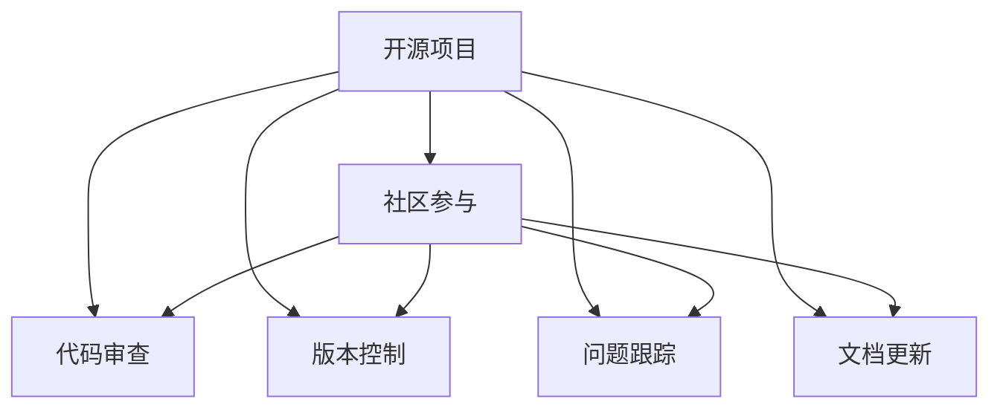

                 

# 创建开源项目的企业支持服务：模式与实施

> 关键词：开源项目，企业支持服务，模式设计，实施策略，社区管理

## 1. 背景介绍

在当今开源盛行的时代，企业越来越多地依赖于开源项目来加速产品开发，降低成本，并利用全球开发者社区的智慧和资源。然而，开源项目的管理和运营并不简单，它涉及社区参与、版本控制、问题跟踪、文档更新等多方面的工作。企业支持服务的有效实施，成为开源项目成功的关键之一。

### 1.1 问题由来

许多企业在加入开源项目时，常常面临以下挑战：

- **社区管理**：如何吸引和保持社区活跃，处理社区冲突，确保贡献者的高效协作。
- **代码质量**：如何确保代码质量，避免引入错误，提高代码可维护性和可扩展性。
- **版本控制**：如何高效地进行版本管理，处理分支冲突，确保代码的稳定和可靠。
- **问题跟踪**：如何高效地跟踪和解决贡献者的问题，快速响应并解决问题。
- **文档维护**：如何保持项目文档的最新性和准确性，确保新贡献者可以快速上手。

这些问题如果处理不当，将严重影响开源项目的健康发展和企业的参与体验。

### 1.2 问题核心关键点

为解决上述挑战，企业支持服务的模式设计应围绕以下几个关键点展开：

- **社区参与机制**：建立激励机制，吸引和保留核心贡献者，促进社区的积极参与。
- **代码审查流程**：设置严格的代码审查流程，确保代码质量，避免引入新问题。
- **版本控制策略**：制定合理的版本控制策略，确保版本管理的效率和透明度。
- **问题跟踪系统**：使用高效的问题跟踪系统，及时响应和解决贡献者的问题。
- **文档更新机制**：建立文档更新机制，确保文档的准确性和时效性。

通过合理设计企业支持服务，可以在确保代码质量的同时，提升开源项目的参与度和活跃度，推动项目快速发展。

## 2. 核心概念与联系

### 2.1 核心概念概述

为更好地理解企业支持服务的实施策略，本节将介绍几个关键概念：

- **开源项目**：指公开源代码的项目，通常以Git仓库的形式存在，开发者可以通过克隆和推送代码参与贡献。
- **企业支持服务**：指企业为开源项目提供的资金、技术、人才支持，帮助项目维持和发展。
- **社区参与**：指项目开发者和管理者通过各种方式激励社区成员的积极参与。
- **代码审查**：指对代码变更进行检查和审核的过程，确保代码质量和一致性。
- **版本控制**：指对代码变更进行管理的过程，确保版本记录的准确性和可靠性。
- **问题跟踪**：指对项目中出现的问题进行记录、分类、优先级排序和解决的过程。
- **文档更新**：指对项目文档进行维护和更新的过程，确保文档的准确性和时效性。

这些核心概念之间的逻辑关系可以通过以下Mermaid流程图来展示：



这个流程图展示了一些关键概念之间的关系：

1. 开源项目是企业支持服务的主要对象。
2. 社区参与、代码审查、版本控制、问题跟踪、文档更新是开源项目成功运营的关键环节。
3. 企业支持服务通过这些环节的支持，推动开源项目的健康发展和企业的成功参与。

## 3. 核心算法原理 & 具体操作步骤

### 3.1 算法原理概述

企业支持服务的实施，本质上是一个多维度支持系统设计的复杂过程。其核心思想是：通过系统化、规范化的方法，为企业在开源项目中的参与提供全方位的支持，确保项目的高效运行和持续发展。

形式化地，假设企业支持服务系统由以下关键组件构成：

- $S_{community}$：社区参与组件，用于激励和引导社区成员参与。
- $S_{code}$：代码审查组件，用于检查和审核代码变更。
- $S_{version}$：版本控制组件，用于管理代码变更的历史和状态。
- $S_{issue}$：问题跟踪组件，用于记录、分类和解决贡献者的问题。
- $S_{docs}$：文档更新组件，用于维护和更新项目文档。

系统设计者需综合考虑这些组件的集成和交互，确保它们协同工作，共同支持项目的成功运营。

### 3.2 算法步骤详解

企业支持服务的实施，一般包括以下几个关键步骤：

**Step 1: 需求分析**
- 分析企业参与开源项目的具体需求，包括资金支持、技术支持、人才支持等。
- 确定项目当前存在的主要问题和挑战，制定支持策略。

**Step 2: 系统设计**
- 设计社区参与、代码审查、版本控制、问题跟踪、文档更新等关键组件的架构和功能。
- 确定组件之间的接口和数据交互方式，确保系统的高效运转。

**Step 3: 资源配置**
- 根据需求和设计，配置必要的硬件资源、软件工具和人力资源。
- 选择合适的开源平台和工具，确保系统的稳定性和可扩展性。

**Step 4: 实施部署**
- 按照设计方案，逐步部署和实施各个组件。
- 测试和调试系统，确保各个组件协同工作，满足企业需求。

**Step 5: 持续优化**
- 根据实施效果和反馈，不断优化系统设计和功能。
- 定期评估和改进支持策略，确保企业参与的长期有效性。

### 3.3 算法优缺点

企业支持服务的设计和实施，具有以下优点：

1. **资源整合**：通过系统化的设计和资源配置，可以整合多种支持和工具，提升项目的整体效率和质量。
2. **标准化流程**：通过规范化的流程设计，确保代码审查、版本控制、问题跟踪等关键环节的标准化和一致性。
3. **快速响应**：通过高效的问题跟踪和文档更新机制，可以快速响应和解决贡献者的问题，提升项目的活跃度和贡献者的满意度。
4. **社区激励**：通过设计激励机制，吸引和保留核心贡献者，推动项目的持续发展。

同时，该方法也存在一定的局限性：

1. **资源依赖**：企业支持服务的实施需要投入大量资源，包括资金、人力、技术等。
2. **适应性不足**：不同开源项目的需求和特性差异较大，通用的支持服务可能需要针对性地进行调整。
3. **风险管理**：系统设计和实施过程中可能遇到各种风险和挑战，需要及时调整和应对。
4. **社区动态变化**：开源社区的变化和动态可能导致支持策略失效，需要不断更新和改进。

尽管存在这些局限性，但就目前而言，企业支持服务的系统化设计，仍是推动开源项目成功和健康发展的关键方法。未来相关研究的重点在于如何进一步降低企业支持服务的实施成本，提高其灵活性和适应性，同时兼顾风险管理和社区动态变化。

### 3.4 算法应用领域

企业支持服务的实施，已经在诸多开源项目中得到了广泛的应用，覆盖了几乎所有开源领域，例如：

- **开源框架和库**：如TensorFlow、PyTorch、Kubernetes等，企业提供资金和技术支持，推动项目发展。
- **开源工具和应用**：如OpenSSL、Apache Spark、Red Hat Enterprise Linux等，企业提供资源和社区管理。
- **开源基础设施**：如OpenStack、VMware vSphere、Elastic Stack等，企业提供基础设施和运营支持。

除了上述这些经典领域外，企业支持服务还被创新性地应用到更多场景中，如开源标准、开源认证、开源教育和开源文化推广等，为开源技术的产业化进程提供了重要的支持。

## 4. 数学模型和公式 & 详细讲解  
### 4.1 数学模型构建

本节将使用数学语言对企业支持服务的实施策略进行更加严格的刻画。

记企业支持服务系统由以下关键组件构成：

- $S_{community}$：社区参与组件，用于激励和引导社区成员参与，其输入为需求分析结果，输出为社区活跃度。
- $S_{code}$：代码审查组件，用于检查和审核代码变更，其输入为代码变更请求，输出为审查结果。
- $S_{version}$：版本控制组件，用于管理代码变更的历史和状态，其输入为代码变更请求，输出为版本信息。
- $S_{issue}$：问题跟踪组件，用于记录、分类和解决贡献者的问题，其输入为问题报告，输出为问题解决状态。
- $S_{docs}$：文档更新组件，用于维护和更新项目文档，其输入为文档反馈，输出为更新后的文档。

系统整体的设计目标为：最大化社区活跃度和代码质量，最小化问题和文档错误。

### 4.2 公式推导过程

以下我们以代码审查组件 $S_{code}$ 为例，推导其核心算法和公式。

假设代码审查组件 $S_{code}$ 由以下步骤组成：

1. **代码提交**：开发者提交代码变更请求。
2. **自动审查**：系统自动运行代码质量检查工具，检测代码中可能存在的错误。
3. **人工审查**：由经验丰富的审核者人工审查代码变更，确保代码符合项目标准。
4. **反馈和修正**：审核者给出反馈意见，开发者根据反馈进行代码修正。
5. **合并和发布**：审核通过后，代码变更被合并到主分支，并发布新版本。

上述步骤可以抽象为以下公式：

$$
S_{code} = F_{autoReview}(F_{submit}, F_{manualReview}, F_{feedback}, F_{mergePublish})
$$

其中，$F_{autoReview}$ 表示自动审查函数，$F_{submit}$ 表示代码提交函数，$F_{manualReview}$ 表示人工审查函数，$F_{feedback}$ 表示反馈函数，$F_{mergePublish}$ 表示合并和发布函数。

### 4.3 案例分析与讲解

假设一个开源项目 $P$，由企业 $E$ 提供支持服务。企业 $E$ 通过以下步骤实施支持服务：

1. **需求分析**：$E$ 分析 $P$ 的社区参与情况和代码质量问题，确定支持需求。
2. **系统设计**：$E$ 设计社区参与机制、代码审查流程、版本控制策略、问题跟踪系统和文档更新机制。
3. **资源配置**：$E$ 配置必要的硬件资源、软件工具和人力资源。
4. **实施部署**：$E$ 按照设计方案，逐步部署和实施各个组件。
5. **持续优化**：$E$ 根据实施效果和反馈，不断优化系统设计和功能。

在实施过程中，$E$ 利用开源工具，如GitHub、GitLab、JIRA等，确保系统的高效运转和协作效率。例如，$E$ 在GitHub上创建一个问题跟踪项目，用于记录和跟踪贡献者的问题，同时使用GitLab进行代码审查和版本控制，确保代码变更的一致性和可追溯性。

## 5. 项目实践：代码实例和详细解释说明
### 5.1 开发环境搭建

在进行支持服务项目开发前，我们需要准备好开发环境。以下是使用Python进行企业支持服务项目开发的环境配置流程：

1. 安装Anaconda：从官网下载并安装Anaconda，用于创建独立的Python环境。

2. 创建并激活虚拟环境：
```bash
conda create -n enterprise-support-env python=3.8 
conda activate enterprise-support-env
```

3. 安装Python的必要库：
```bash
pip install pandas numpy matplotlib jupyter notebook ipython requests
```

4. 安装Git版本控制系统：
```bash
conda install git
```

5. 安装GitHub的Python API：
```bash
pip install github3.py
```

完成上述步骤后，即可在`enterprise-support-env`环境中开始支持服务项目的开发。

### 5.2 源代码详细实现

下面我们以GitHub问题跟踪为例，给出使用Python开发企业支持服务项目的代码实现。

首先，定义GitHub问题的数据处理函数：

```python
from github3 import GitHub
from typing import Dict, List

def fetch_issues(github: GitHub, repo_name: str) -> List[Dict[str, str]]:
    issues = github.issues.list_for_repo(repo_name)
    return [{'id': issue.number, 'title': issue.title, 'state': issue.state} for issue in issues]
```

然后，定义问题跟踪系统的功能：

```python
from datetime import datetime

def track_issue(issue_id: int) -> Dict[str, str]:
    github = GitHub()
    repo_name = 'your-repo-name'
    issue = github.issues.get(repo_name, issue_id)
    return {
        'id': issue.id,
        'title': issue.title,
        'state': issue.state,
        'created_at': issue.created_at.strftime('%Y-%m-%d %H:%M:%S'),
        'updated_at': issue.updated_at.strftime('%Y-%m-%d %H:%M:%S'),
        'assigned_to': issue.assignee.login if issue.assignee else 'unassigned',
        'resolved_by': issue.closed_by.login if issue.closed_by else 'unresolved'
    }
```

最后，启动问题跟踪系统的测试流程：

```python
github = GitHub()
repo_name = 'your-repo-name'
issues = fetch_issues(github, repo_name)
for issue in issues:
    print(track_issue(issue['id']))
```

以上就是使用Python对GitHub问题跟踪进行企业支持服务项目开发的完整代码实现。可以看到，通过GitHub API，可以方便地获取和处理GitHub上的问题数据，构建起高效的问题跟踪系统。

### 5.3 代码解读与分析

让我们再详细解读一下关键代码的实现细节：

**fetch_issues函数**：
- 利用GitHub3 Python库，获取指定仓库的所有问题。
- 将问题数据转换为一个包含id、title、state的列表，方便后续处理。

**track_issue函数**：
- 获取指定问题ID的问题详情，包括id、title、state、创建时间、更新时间、指派人和解决人。
- 将问题详情转换为一个字典，方便返回和展示。

**测试流程**：
- 从GitHub获取指定仓库的问题列表。
- 遍历列表，获取每个问题的详情，并输出结果。

可以看到，使用Python和GitHub API，可以轻松构建起问题跟踪系统的基本功能，为企业的支持服务提供有力支持。

当然，工业级的系统实现还需考虑更多因素，如问题的分类和优先级管理、解决状态的实时更新、自动提醒和通知机制等。但核心的支持服务流程基本与此类似。

## 6. 实际应用场景
### 6.1 智能客服系统

企业支持服务在智能客服系统中可以发挥重要作用。传统客服系统依赖人工操作，响应时间长，服务效率低下。而企业支持服务可以提供自动化的客服解决方案，提升客服的响应速度和效率。

例如，企业可以利用开源的机器学习库和自然语言处理工具，构建智能客服系统。通过在GitHub上创建问题跟踪项目，记录和分类用户的问题，并利用自动化工具进行自动回复和处理，企业可以实现24小时不间断的客户服务。

### 6.2 在线教育平台

在线教育平台通常需要处理大量的学生和教师互动数据，企业支持服务可以提供有效的管理支持，提升平台的运营效率。

例如，企业可以利用GitHub作为在线课程的问题跟踪系统，记录学生和教师提出的问题，并及时进行解答和解决。同时，通过版本控制工具，可以跟踪课程内容的更新和发布，确保课程的时效性和准确性。

### 6.3 产品开发平台

产品开发平台需要管理大量的代码变更和问题，企业支持服务可以提供高效的支持，保障产品的稳定和可靠。

例如，企业可以利用GitHub进行代码审查和版本控制，确保代码变更的一致性和可追溯性。通过问题跟踪系统，及时解决开发者和用户报告的问题，提升产品的用户体验和质量。

### 6.4 未来应用展望

随着企业支持服务技术的不断发展，其在更多领域的应用前景将更加广阔。

在智慧城市治理中，企业支持服务可以应用于城市事件监测、舆情分析、应急指挥等环节，提高城市管理的自动化和智能化水平，构建更安全、高效的未来城市。

在企业内部，企业支持服务可以应用于项目管理、人力资源管理、客户关系管理等多个方面，提升企业的运营效率和竞争力。

## 7. 工具和资源推荐
### 7.1 学习资源推荐

为帮助开发者系统掌握企业支持服务的理论基础和实践技巧，这里推荐一些优质的学习资源：

1. GitHub官方文档：GitHub提供的全面API文档和代码示例，是构建问题跟踪系统的基础。
2. JIRA官方文档：JIRA作为问题跟踪系统的另一大主流工具，其官方文档提供了丰富的功能和API使用指南。
3. GitLab官方文档：GitLab提供的Git版本控制和项目管理功能，是企业支持服务项目的重要组成部分。
4. Docker官方文档：Docker容器化技术，可以帮助企业实现代码变更的快速部署和回滚，提升系统的稳定性和可扩展性。
5. Jenkins官方文档：Jenkins持续集成和持续部署工具，可以帮助企业自动化测试和发布过程，提高开发效率。

通过对这些资源的学习实践，相信你一定能够快速掌握企业支持服务的精髓，并用于解决实际的业务问题。

### 7.2 开发工具推荐

高效的开发离不开优秀的工具支持。以下是几款用于企业支持服务项目开发的常用工具：

1. Python：Python语言的灵活性和易用性，使得企业支持服务项目开发更加高效。
2. GitHub：GitHub提供丰富的Git版本控制和问题跟踪功能，是企业支持服务项目的首选平台。
3. JIRA：JIRA是另一个广泛使用的问题跟踪系统，支持复杂的自定义需求和管理功能。
4. GitLab：GitLab提供了强大的项目管理功能，可以与GitHub和JIRA无缝集成。
5. Jenkins：Jenkins提供持续集成和持续部署功能，可以自动构建、测试和发布企业支持服务项目。
6. Docker：Docker容器化技术，可以轻松实现企业支持服务项目的部署和管理。

合理利用这些工具，可以显著提升企业支持服务项目的开发效率，加快创新迭代的步伐。

### 7.3 相关论文推荐

企业支持服务的发展源于学界的持续研究。以下是几篇奠基性的相关论文，推荐阅读：

1. "The Importance of Open Source Software in Modern Business" by Jonathan Grummitt：这篇文章探讨了开源软件在现代企业中的应用，强调了企业支持服务的重要性。
2. "Supporting Open Source Software Communities: A Systematic Review" by Mohammad Sayad et al.：这篇文章回顾了支持开源社区的各种方法和策略，为实施企业支持服务提供了理论基础。
3. "Enterprise Open Source Support Strategies" by Michael Schwartz et al.：这篇文章总结了企业在开源项目中的支持策略，包括资金支持、技术支持、人才支持等。
4. "Supporting Open Source Software Projects: A Comparative Analysis" by Roman Oklobzija et al.：这篇文章对比了不同的开源支持服务模式，为实施企业支持服务提供了方法和建议。
5. "Open Source Support as a Service: A New Paradigm for Enterprise Open Source Management" by Markus Färber et al.：这篇文章提出了开源支持服务的新范式，为未来的企业支持服务发展指明了方向。

这些论文代表了大语言模型微调技术的发展脉络。通过学习这些前沿成果，可以帮助研究者把握学科前进方向，激发更多的创新灵感。

## 8. 总结：未来发展趋势与挑战

### 8.1 总结

本文对企业支持服务的实施策略进行了全面系统的介绍。首先阐述了企业支持服务在开源项目中的重要性，明确了支持服务在社区管理、代码质量、版本控制、问题跟踪、文档更新等关键环节的作用。其次，从原理到实践，详细讲解了企业支持服务的设计流程和实施步骤，给出了企业支持服务项目开发的完整代码实例。同时，本文还广泛探讨了企业支持服务在智能客服、在线教育、产品开发等多个行业领域的应用前景，展示了支持服务范式的巨大潜力。此外，本文精选了企业支持服务的各类学习资源，力求为读者提供全方位的技术指引。

通过本文的系统梳理，可以看到，企业支持服务在推动开源项目成功和健康发展方面，发挥了重要作用。未来，伴随企业支持服务技术的持续演进，将会有更多创新应用场景出现，为开源技术的产业化进程提供更强有力的支持。

### 8.2 未来发展趋势

展望未来，企业支持服务的发展趋势如下：

1. **智能化**：利用人工智能技术，如机器学习、自然语言处理等，提升问题分析和解决效率，实现智能客服、智能文档更新等应用。
2. **自动化**：通过自动化工具，如持续集成、持续部署、自动化测试等，提升代码变更和问题解决的速度和质量。
3. **云化**：利用云平台提供的计算和存储资源，实现企业支持服务的弹性扩展和灵活部署。
4. **生态化**：构建企业支持服务的生态系统，整合多种工具和平台，提升整体支持能力。
5. **社区化**：加强与开源社区的互动和合作，提升企业的开源文化和社区影响力。

以上趋势凸显了企业支持服务技术的广阔前景。这些方向的探索发展，必将进一步提升开源项目的参与度和活跃度，推动项目快速成长。

### 8.3 面临的挑战

尽管企业支持服务技术已经取得了显著成果，但在实施过程中仍面临诸多挑战：

1. **资源投入**：企业支持服务的实施需要投入大量资金、人力和技术资源，对中小企业可能构成负担。
2. **技术复杂性**：企业支持服务涉及多种工具和平台，系统设计和实施过程复杂，对技术要求高。
3. **社区动态变化**：开源社区的变化和动态可能导致支持策略失效，需要不断更新和改进。
4. **文化和认同**：企业需要在员工中推广开源文化和价值观，培养开源技术人才。

尽管存在这些挑战，但通过系统化的设计和实施，合理利用资源和技术，企业支持服务必将在开源项目中发挥更大作用，推动技术的创新和发展。

### 8.4 研究展望

面对企业支持服务面临的挑战，未来的研究需要在以下几个方面寻求新的突破：

1. **成本效益分析**：研究企业支持服务的成本效益，制定合理的投入策略，降低中小企业参与的门槛。
2. **标准化和工具集成**：开发标准化的企业支持服务框架和工具，提升系统的易用性和可扩展性。
3. **社区动态管理**：研究社区动态变化的规律和影响，制定灵活的支持策略，确保支持服务的长期有效性。
4. **文化建设**：推动企业内部开源文化的建设，培养开源技术人才，提升企业支持服务的效果。

这些研究方向的探索，必将引领企业支持服务技术迈向更高的台阶，为开源技术的产业化进程提供更加坚实的支持。

## 9. 附录：常见问题与解答

**Q1：企业支持服务是否只适用于开源项目？**

A: 企业支持服务最初是为开源项目设计的，但也可以应用于企业内部项目，如产品开发、客户服务、市场营销等。通过合理的工具集成和管理策略，企业支持服务可以提升各种项目的运营效率和质量。

**Q2：企业支持服务是否需要专业的技术支持？**

A: 企业支持服务的实施确实需要一定的技术支持，但并不需要专业的技术团队。通过合理利用开源工具和自动化技术，企业可以降低技术门槛，提高支持服务的实施效率。

**Q3：企业支持服务是否需要持续投入资源？**

A: 企业支持服务的实施需要持续投入资源，包括资金、人力和技术支持。但通过合理的成本效益分析和资源优化，可以降低企业支持服务的运营成本，提升投入产出比。

**Q4：企业支持服务是否适用于大型企业？**

A: 企业支持服务不仅适用于大型企业，也对中小企业具有重要意义。通过系统化的设计和实施，中小企业也可以享受企业支持服务带来的好处，提升运营效率和竞争力。

**Q5：企业支持服务是否需要持续改进？**

A: 企业支持服务的实施是一个动态过程，需要不断改进和优化。通过持续评估和调整支持策略，确保企业支持服务能够适应开源项目的变化和动态，保持其长期有效性。

---

作者：禅与计算机程序设计艺术 / Zen and the Art of Computer Programming

