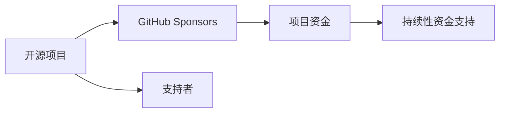

                 

# 利用GitHub Sponsors最大化项目收益

> 关键词：GitHub Sponsors, 开源项目, 捐赠, 收益优化, 众筹, 开发者社区

## 1. 背景介绍

在开源软件开发的世界里，开发者们常常面临着如何高效地获取资金来支持项目成长和持续发展的难题。随着社区和商业的不断成熟，许多开源项目开始探索新的资金获取方式，以解决这一问题。近年来，一种新颖的资金模式——GitHub Sponsors，正在全球开源社区中迅速崛起，成为了开源项目获取资金的新选择。本文将详细探讨GitHub Sponsors的原理与实践，分析其对开源项目资金获取的积极影响，并提供一系列建议，帮助项目维护者最大化其项目收益。

### 1.1 问题由来

在开源社区中，项目的成长和持续创新离不开资金的支持。传统的资金获取方式主要包括：项目赞助、个人捐赠、商业赞助、众筹平台等。然而，这些方式都有其局限性：赞助往往需要具有一定影响力的个人或公司；个人捐赠依赖于个人财力和随机性；商业赞助受限于商业利益和项目适用性；众筹平台虽然能够覆盖更广泛的受众，但门槛较高，成功率和资金量有限。

GitHub Sponsors的出现，为开源项目提供了一种全新的资金获取方式，其特点包括：

- **灵活透明**：用户可以自由地对项目进行捐赠，同时项目维护者可以实时公开资金使用情况。
- **社区驱动**：支持者来自全球开发者社区，对项目的长期价值有更深的认识。
- **持续性**：Sponsors承诺的资金通常是每月或每季度定期支付，为项目提供持续的资金支持。
- **无门槛**：任何人都可以通过Sponsors对项目进行捐赠，无需高昂的启动资金或复杂的申请流程。

### 1.2 问题核心关键点

利用GitHub Sponsors最大化项目收益，关键在于理解其工作机制，分析其对项目资金流的影响，并采取有效的策略来吸引更多的支持者。核心在于：

1. **明确项目目标与需求**：项目维护者需要清晰地定义项目的愿景、目标和具体需求，以便吸引志同道合的支持者。
2. **提供高质量内容**：高质量的内容是吸引支持者的重要因素。项目文档、代码、社区互动等都需要维护者用心投入。
3. **优化用户参与体验**：良好的用户体验能够显著提高支持者的满意度和忠诚度，从而提高捐赠率。
4. **有效利用宣传渠道**：通过社交媒体、博客、电子邮件等渠道，广泛宣传项目和捐赠机制，吸引更多潜在支持者。
5. **及时回应与反馈**：对支持者的问题和反馈进行及时回应，增强社区的凝聚力和支持者的信任感。

## 2. 核心概念与联系

### 2.1 核心概念概述

GitHub Sponsors是一种基于GitHub平台的项目资金支持机制，它允许用户为开源项目提供定期的资金捐助。Sponsors模式借鉴了会员制众筹的思路，通过用户每月或每季度支付固定费用，帮助项目持续发展。

核心概念包括：

- **开源项目**：在GitHub上托管，遵循开源许可证的软件项目。
- **GitHub Sponsors**：GitHub提供的服务，用于接受用户捐赠，帮助项目持续发展。
- **支持者**：为项目提供定期资金捐助的用户。
- **项目资金**：项目通过Sponsors获得的捐赠资金。
- **持续性资金支持**：支持者承诺的定期资金支付，为项目提供稳定的资金流。

这些概念之间的逻辑关系可以通过以下Mermaid流程图来展示：



这个流程图展示了一个开源项目通过GitHub Sponsors获得资金支持的过程：

1. 开源项目在GitHub上托管，项目维护者通过Sponsors服务接受用户捐赠。
2. 支持者定期支付资金，帮助项目持续发展。
3. 项目维护者获得持续性资金支持，用于项目的维护和创新。

## 3. 核心算法原理 & 具体操作步骤
### 3.1 算法原理概述

GitHub Sponsors的算法原理主要基于订阅模型，即用户为项目提供定期的资金支付，支持项目的持续发展。具体步骤如下：

1. **创建项目**：在GitHub上创建开源项目，并启用Sponsors服务。
2. **发布赞助信息**：在项目页面上发布赞助信息，明确说明项目的愿景、目标和资金使用计划。
3. **接受赞助**：支持者选择符合项目需求的赞助计划，每月或每季度支付固定费用。
4. **资金管理**：项目维护者将收到的资金用于项目维护和创新，并公开资金使用情况，增强透明度。

### 3.2 算法步骤详解

下面是利用GitHub Sponsors最大化项目收益的具体操作步骤：

**Step 1: 创建项目和启用Sponsors服务**
- 登录GitHub，在主界面右上角点击“+”，选择“New repository”。
- 在创建项目时，选择“Private”或“Public”，设置项目名称、描述、许可证等基本属性。
- 在项目设置中，启用“Sponsors”服务。

**Step 2: 发布赞助信息**
- 在项目主页上，点击“Sponsors”按钮。
- 在Sponsors页面上，发布项目愿景、目标和资金使用计划，明确说明支持者将如何使用捐款。
- 设置不同的赞助计划，定义月度或季度赞助金额，选择是否公开赞助者的信息等。

**Step 3: 接受赞助**
- 支持者可以通过网页或移动应用对项目进行赞助，选择相应的计划，并设置支付周期和金额。
- 项目维护者可以实时查看资金流入情况，并在资金使用后进行记录和公开。

**Step 4: 资金管理和使用**
- 项目维护者可以将收到的资金用于项目维护、开发新功能、参与社区活动等。
- 定期在项目页面上更新资金使用情况，增强透明度和信任感。
- 利用捐款进行项目扩展和推广，吸引更多支持者。

### 3.3 算法优缺点

**优点：**

1. **灵活性高**：支持者可以自由选择赞助金额和时间，增强了捐赠的灵活性。
2. **透明度高**：资金使用情况公开透明，增强了支持者的信任感。
3. **持续性资金支持**：支持者承诺的定期资金支付，为项目提供了稳定的资金流。
4. **社区驱动**：支持者来自全球开发者社区，对项目的长期价值有更深的认识。

**缺点：**

1. **对项目吸引力有依赖**：项目的吸引力和可见度是吸引支持者的关键，低质量的项目可能难以获得资金支持。
2. **维护者精力分散**：项目维护者需要投入更多时间和精力来管理资金和使用情况，分散了原本可用于开发和社区互动的资源。
3. **依赖长期承诺**：项目依赖于支持者的长期承诺，如果部分支持者退订，可能会对项目资金流造成影响。

### 3.4 算法应用领域

GitHub Sponsors可以应用于各种类型的开源项目，特别是那些需要持续资金支持的项目，如开发工具、平台、应用等。以下是一些具体的应用场景：

1. **软件开发**：为开源框架、库和工具提供资金支持，帮助其持续维护和创新。
2. **数据科学**：支持数据集、算法和工具的开发和维护，促进科学研究和技术进步。
3. **社区和基础设施**：支持社区平台、开源基金会和基础设施项目，推动开源生态的发展。
4. **环境和社会创新**：支持环保、社会创新等公益项目，推动社会进步和可持续发展。

## 4. 数学模型和公式 & 详细讲解 & 举例说明
### 4.1 数学模型构建

假设项目维护者收到n个支持者每月捐赠的总金额为$M$，每月的总支出为$C$，设$M>C$，则项目剩余资金为$M-C$。假设项目在t个月后的总资金为$F(t)$，则有：

$$
F(t) = M - t \cdot C
$$

其中，$M$为总捐赠金额，$C$为每月总支出，$t$为时间（月）。

### 4.2 公式推导过程

根据上述公式，我们可以推导出项目剩余资金和总资金的时间变化趋势：

1. **资金使用速率**：
$$
\frac{dF(t)}{dt} = -C
$$

这表示项目每月的资金减少速率是恒定的，为每月总支出$C$。

2. **资金峰值时间**：
$$
t_{\text{peak}} = \frac{M}{C}
$$

这表示项目剩余资金达到最大值$M$时，所需要的时间为$\frac{M}{C}$个月。

3. **资金耗尽时间**：
$$
t_{\text{end}} = \frac{M}{C} + \frac{C}{M}
$$

这表示项目总资金耗尽时，所需要的时间为$\frac{M}{C} + \frac{C}{M}$个月。

### 4.3 案例分析与讲解

假设一个开源项目每月接受10个支持者，每人每月捐赠100美元，总月支出为5000美元。

1. **资金使用速率**：
$$
\frac{dF(t)}{dt} = -5000
$$

2. **资金峰值时间**：
$$
t_{\text{peak}} = \frac{100 \times 10}{5000} = 2
$$

3. **资金耗尽时间**：
$$
t_{\text{end}} = 2 + \frac{5000}{100 \times 10} = 4
$$

这意味着项目在第2个月时，资金达到最大值10000美元，在第4个月时，资金耗尽。项目维护者应合理规划资金使用，确保在第2个月后，仍能满足项目的运营需求。

## 5. 项目实践：代码实例和详细解释说明
### 5.1 开发环境搭建

以下是使用GitHub Sponsors进行资金管理的基本环境搭建步骤：

1. **创建项目**：在GitHub上创建开源项目，设置项目名称、描述、许可证等基本属性。
2. **启用Sponsors服务**：在项目设置中启用Sponsors服务。
3. **发布赞助信息**：在项目主页上发布赞助信息，明确项目愿景、目标和资金使用计划。
4. **接受赞助**：支持者通过网页或移动应用选择赞助计划，并设置支付周期和金额。
5. **资金管理和使用**：项目维护者可以实时查看资金流入情况，并在资金使用后进行记录和公开。

### 5.2 源代码详细实现

以下是一个假想的开源项目，通过GitHub Sponsors进行资金管理的示例代码：

```python
# 初始化总捐赠金额和每月支出
total_donation = 10000
monthly_expense = 5000

# 计算资金峰值时间和资金耗尽时间
peak_time = total_donation / monthly_expense
end_time = peak_time + monthly_expense / total_donation

# 打印计算结果
print(f"资金峰值时间：{peak_time}个月")
print(f"资金耗尽时间：{end_time}个月")
```

### 5.3 代码解读与分析

上述代码简要计算了项目的资金峰值时间和资金耗尽时间，并输出了计算结果。实际应用中，项目维护者需要结合项目的实际情况，合理规划资金使用，确保项目在资金峰值时仍能正常运营。

## 6. 实际应用场景
### 6.1 智能客服系统

GitHub Sponsors可以应用于智能客服系统的开发和维护。智能客服系统需要持续的技术支持和数据积累，Sponsors模式可以帮助项目获得稳定的资金流，用于系统开发、算法优化和数据收集。

### 6.2 金融舆情监测

金融舆情监测项目需要实时监测市场舆论动向，及时获取最新信息。Sponsors模式可以帮助项目获得稳定的资金支持，用于数据分析、模型训练和系统维护，提高舆情监测的准确性和实时性。

### 6.3 个性化推荐系统

个性化推荐系统需要持续的数据收集和算法优化，Sponsors模式可以帮助项目获得稳定的资金支持，用于数据收集、算法研发和系统扩展，提升推荐系统的个性化和精准度。

### 6.4 未来应用展望

随着GitHub Sponsors的普及，未来在开源社区中，更多的项目将采用Sponsors模式获取资金支持。这种模式不仅能够为项目提供持续的资金支持，还能增强项目的透明度和社区凝聚力，推动开源生态的发展。

## 7. 工具和资源推荐
### 7.1 学习资源推荐

1. **GitHub Sponsors官方文档**：GitHub Sponsors的官方文档提供了详细的步骤和最佳实践，帮助开发者快速上手。
2. **Open Source Guides**：Open Source Guides提供了开源项目管理的全面指南，包括资金管理、社区建设等。
3. **GitHub Learning Lab**：GitHub Learning Lab提供了GitHub平台的使用教程，帮助开发者提升技能。
4. **Coursera - Open Source**：Coursera上的Open Source课程，帮助开发者了解开源项目管理的最佳实践。

### 7.2 开发工具推荐

1. **GitHub Desktop**：GitHub Desktop是GitHub的桌面客户端，方便开发者进行项目管理和资金管理。
2. **GitHub Mobile**：GitHub Mobile是GitHub的移动应用，方便开发者随时查看资金流动和项目状态。
3. **Jira**：Jira是一款项目管理工具，可以与GitHub Sponsors集成，帮助项目维护者高效管理项目和资金。

### 7.3 相关论文推荐

1. **GitHub Sponsors的实践与挑战**：深入探讨GitHub Sponsors的实际应用和挑战，提出解决方案。
2. **开源项目的资金获取与项目管理**：分析开源项目的资金获取方式，提出资金管理的最佳实践。
3. **GitHub Sponsors对开源社区的影响**：研究Sponsors模式对开源社区的影响，评估其优缺点。

## 8. 总结：未来发展趋势与挑战
### 8.1 总结

本文详细探讨了GitHub Sponsors的原理与实践，分析了其对开源项目资金获取的积极影响，并提供了最大化项目收益的建议。通过深入分析GitHub Sponsors的工作机制，明确了项目维护者应如何利用这一模式，吸引更多支持者，获得持续的资金支持。

通过本文的系统梳理，可以看到，GitHub Sponsors为开源项目提供了一种全新的资金获取方式，极大地提高了项目获得稳定资金支持的可能性。未来，随着社区和商业的不断成熟，Sponsors模式必将在开源项目资金获取中发挥更加重要的作用。

### 8.2 未来发展趋势

1. **普及性提高**：随着Sponsors模式的普及，越来越多的开源项目将采用这一模式，获得持续的资金支持。
2. **社区参与度提升**：支持者来自全球开发者社区，项目的透明度和社区凝聚力将显著提升。
3. **资金管理优化**：项目维护者将更注重资金的合理使用和管理，提高资金利用效率。
4. **支持者多样性增加**：支持者不仅限于开发者，还将包括企业、机构和个人等，资金来源更加多样化。
5. **资金用途多元化**：Sponsors资金将用于更多领域，如开源社区建设、技术交流、教育培训等。

### 8.3 面临的挑战

尽管GitHub Sponsors具有显著优势，但在实际应用中也面临一些挑战：

1. **项目吸引力不足**：低质量的项目可能难以吸引支持者，需提高项目吸引力。
2. **维护者精力分散**：项目维护者需投入更多时间和精力管理资金，需平衡资金管理和项目开发。
3. **长期承诺依赖**：项目依赖支持者的长期承诺，需建立稳定的资金流。
4. **市场竞争激烈**：开源项目竞争激烈，需提高项目独特性和吸引力。
5. **法律和道德问题**：资金使用需合法合规，需关注隐私和伦理问题。

### 8.4 研究展望

未来的研究应在以下几个方向进行深入探讨：

1. **项目质量提升**：通过提升项目质量，吸引更多支持者，提高资金获取率。
2. **资金使用优化**：优化资金使用策略，提高资金利用效率，增强项目可持续发展能力。
3. **社区参与激励**：设计激励机制，增强社区参与度，提高支持者忠诚度。
4. **法律合规管理**：确保资金使用合法合规，关注隐私和伦理问题，建立透明和公正的资金使用机制。
5. **技术创新和多样化**：利用新技术和多样化资金来源，增强项目吸引力和竞争力。

## 9. 附录：常见问题与解答

**Q1：GitHub Sponsors对项目有什么要求？**

A: GitHub Sponsors对项目没有严格的技术或代码要求，但项目需要有明确的愿景、目标和资金使用计划，并且保持高质量的代码和文档。

**Q2：如何最大化Sponsors资金收益？**

A: 项目维护者应定期公开资金使用情况，增强透明度和信任感。合理规划资金使用，确保资金峰值时项目能正常运营。吸引更多支持者，提高资金获取率。

**Q3：支持者如何选择适合自己的赞助计划？**

A: 支持者应根据项目的实际需求和自身能力选择合适的赞助计划。可以考虑每月或每季度的金额，以及是否公开自身信息等。

**Q4：资金使用需要注意哪些问题？**

A: 资金使用应合法合规，确保隐私和伦理问题。项目维护者应合理规划资金使用，提高资金利用效率。

**Q5：GitHub Sponsors未来有哪些发展前景？**

A: GitHub Sponsors的普及性和社区参与度将进一步提升，资金使用优化和技术创新将增强项目的吸引力和竞争力。

---

作者：禅与计算机程序设计艺术 / Zen and the Art of Computer Programming

