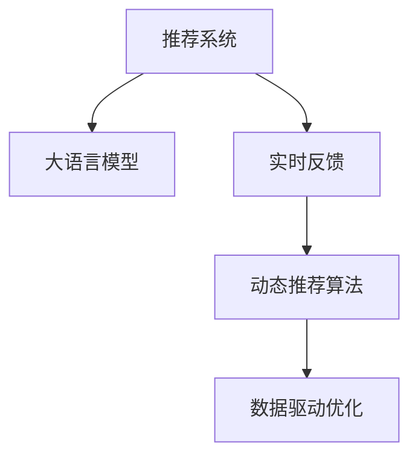

                 

## 1. 背景介绍

推荐系统（Recommendation System）是互联网时代的一种重要应用，广泛应用于电商、社交、内容等诸多领域。传统的推荐系统主要依赖用户的历史行为数据进行物品推荐，难以捕捉到用户的多样化需求和实时变化偏好。然而，随着自然语言处理（NLP）和大模型技术的发展，推荐系统开始引入语言模型进行推荐优化。其中，利用大语言模型（LLM）进行实时反馈处理，成为当前推荐系统的热门研究方向。

### 1.1 问题由来
在实际应用中，用户的偏好可能随时发生变化，传统推荐系统往往需要经过一段时间的学习才能捕捉到这些变化，无法实时响应用户需求。同时，推荐系统的准确度也受到历史数据质量的影响，难以在大规模用户群体上表现优异。针对这些问题，利用大语言模型进行实时反馈处理，可以显著提升推荐系统的个性化和时效性。

### 1.2 问题核心关键点
利用大语言模型进行实时反馈处理的核心在于：
1. **语言模型理解能力**：LLM能够理解用户输入的自然语言，捕捉用户的实时需求。
2. **自然语言交互**：通过与用户的自然语言交互，获取用户的即时反馈，进一步优化推荐结果。
3. **动态推荐算法**：根据用户的即时反馈，动态调整推荐策略，提供更加精准的推荐内容。
4. **数据驱动优化**：利用实时数据进行模型优化，保持推荐系统的迭代进步。

## 2. 核心概念与联系

### 2.1 核心概念概述

为了更好地理解利用大语言模型优化推荐系统的实时反馈处理，本节将介绍几个关键概念及其相互联系：

1. **推荐系统（Recommendation System, RS）**：一种自动生成个性化推荐内容的技术，广泛应用于电商、社交、内容等诸多领域。

2. **大语言模型（Large Language Model, LLM）**：一种基于深度学习技术的自然语言处理模型，能够理解并生成自然语言。

3. **实时反馈（Real-time Feedback）**：指在推荐过程中，根据用户即时反馈动态调整推荐策略，提升推荐精度。

4. **动态推荐算法（Dynamic Recommendation Algorithm）**：一种能够根据用户实时反馈，动态生成推荐结果的算法。

5. **数据驱动优化（Data-Driven Optimization）**：利用实时数据进行模型优化，保持推荐系统的迭代进步。

这些概念之间的逻辑关系可以通过以下Mermaid流程图来展示：



这个流程图展示了大语言模型在推荐系统中的应用框架：

1. 推荐系统通过大语言模型进行个性化推荐。
2. 用户根据推荐结果给出实时反馈。
3. 大语言模型利用反馈信息，动态调整推荐策略。
4. 推荐系统根据优化后的策略，生成更加精准的推荐结果。

这些核心概念共同构成了利用大语言模型优化推荐系统的实时反馈处理流程，使得推荐系统能够根据用户的即时需求，提供更符合预期的推荐内容。

## 3. 核心算法原理 & 具体操作步骤
### 3.1 算法原理概述

利用大语言模型进行实时反馈处理的推荐系统，本质上是一种基于深度学习的推荐算法。其核心思想是：通过大语言模型理解用户输入的自然语言，捕捉用户的实时需求，并根据用户的即时反馈，动态调整推荐策略，提供更加精准的推荐内容。

形式化地，假设推荐系统为 $R_{\theta}$，其中 $\theta$ 为模型参数。给定用户的输入 $u$ 和历史行为数据 $h$，推荐系统的目标是最小化损失函数 $\mathcal{L}(R_{\theta},u,h)$，即：

$$
\theta^* = \mathop{\arg\min}_{\theta} \mathcal{L}(R_{\theta},u,h)
$$

其中 $\mathcal{L}$ 为推荐系统的损失函数，用于衡量推荐结果与用户偏好之间的差异。

### 3.2 算法步骤详解

利用大语言模型进行实时反馈处理的推荐系统，一般包括以下几个关键步骤：

**Step 1: 准备数据集和模型**

1. 收集用户的自然语言输入和历史行为数据，作为训练数据。
2. 选择合适的预训练语言模型 $B_{\theta}$ 作为初始化参数，如GPT-3、BERT等。
3. 设置动态推荐算法的超参数，如学习率、批大小、迭代轮数等。

**Step 2: 构建推荐模型**

1. 设计推荐模型 $R_{\theta}$ 的架构，如图1所示。
2. 将用户的输入 $u$ 和历史行为数据 $h$ 输入推荐模型，得到推荐结果 $r$。
3. 利用大语言模型 $B_{\theta}$，对推荐结果进行自然语言描述，并生成推荐摘要。

**Step 3: 收集用户反馈**

1. 在推荐结果展示页面，向用户提供反馈入口。
2. 收集用户对推荐结果的评价，如点击率、满意度、反馈评论等。

**Step 4: 动态调整推荐策略**

1. 将用户的反馈信息作为输入，重新训练大语言模型 $B_{\theta}$。
2. 利用更新后的模型，重新计算推荐结果 $r'$。
3. 根据用户的反馈，动态调整推荐策略，生成新的推荐内容。

**Step 5: 评估和优化**

1. 在新的数据集上评估推荐系统的性能。
2. 根据评估结果，进一步优化推荐模型和动态推荐算法。

以上步骤展示了利用大语言模型进行实时反馈处理的基本流程，通过不断迭代和优化，提升推荐系统的个性化和时效性。

### 3.3 算法优缺点

利用大语言模型进行实时反馈处理的推荐系统，具有以下优点：
1. **高效个性化**：能够快速响应用户的即时需求，提供个性化的推荐内容。
2. **实时调整**：根据用户的即时反馈，动态调整推荐策略，提升推荐精度。
3. **交互性增强**：通过自然语言交互，提升用户的使用体验。
4. **适应性强**：能够适应不同场景下的推荐需求，扩展性强。

同时，该方法也存在一些局限性：
1. **计算复杂度高**：大语言模型的训练和推理过程较为复杂，计算资源消耗较大。
2. **实时性要求高**：需要实时处理用户输入和反馈，对系统架构和性能要求较高。
3. **数据质量依赖**：模型性能受到用户输入和反馈数据质量的影响，难以在数据噪声较大时表现优异。
4. **泛化能力有限**：模型过于依赖具体数据集，泛化能力较弱，难以在大规模数据集上表现稳定。

尽管存在这些局限性，但利用大语言模型进行实时反馈处理，仍然是一种有效的推荐系统优化方法，能够显著提升推荐系统的精度和用户体验。

### 3.4 算法应用领域

利用大语言模型进行实时反馈处理的推荐系统，在电商、社交、内容等多个领域都得到了广泛应用，例如：

1. **电商推荐系统**：在电商平台中，利用大语言模型实时处理用户搜索、浏览、购买等行为，提供个性化推荐内容，提升用户购物体验。
2. **社交推荐系统**：在社交平台中，利用大语言模型实时处理用户发布的内容和评论，提供个性化的内容推荐，增强用户粘性。
3. **内容推荐系统**：在内容平台中，利用大语言模型实时处理用户的阅读、收藏、分享等行为，提供个性化的内容推荐，提升用户使用体验。
4. **广告推荐系统**：在广告平台中，利用大语言模型实时处理用户的点击、停留等行为，提供个性化的广告推荐，提高广告投放效果。

除了这些经典应用外，利用大语言模型进行实时反馈处理的技术，还在更多场景中得到了创新性的应用，如可控推荐、个性化广告、智能客服等，为推荐系统带来了全新的突破。

## 4. 数学模型和公式 & 详细讲解 & 举例说明

### 4.1 数学模型构建

假设推荐系统为 $R_{\theta}$，大语言模型为 $B_{\theta}$，用户的输入为 $u$，历史行为数据为 $h$，推荐结果为 $r$。推荐系统的损失函数为：

$$
\mathcal{L}(R_{\theta},u,h) = -\frac{1}{N} \sum_{i=1}^N \log p(r_i|u_i,h_i)
$$

其中，$p(r_i|u_i,h_i)$ 为推荐系统在用户 $u_i$ 和历史行为数据 $h_i$ 条件下，推荐结果 $r_i$ 的概率分布。

### 4.2 公式推导过程

根据上述定义，推荐系统的目标是最小化损失函数 $\mathcal{L}(R_{\theta},u,h)$，即：

$$
\theta^* = \mathop{\arg\min}_{\theta} \mathcal{L}(R_{\theta},u,h)
$$

在实际应用中，我们通常使用基于梯度的优化算法（如Adam、SGD等）来近似求解上述最优化问题。设 $\eta$ 为学习率，则参数的更新公式为：

$$
\theta \leftarrow \theta - \eta \nabla_{\theta}\mathcal{L}(R_{\theta},u,h)
$$

其中 $\nabla_{\theta}\mathcal{L}(R_{\theta},u,h)$ 为损失函数对参数 $\theta$ 的梯度，可通过反向传播算法高效计算。

### 4.3 案例分析与讲解

假设用户输入 $u$ 为“我想找一本关于编程的书”，历史行为数据 $h$ 为用户的浏览历史。推荐系统 $R_{\theta}$ 根据用户输入和历史行为数据，生成推荐结果 $r$。利用大语言模型 $B_{\theta}$，对推荐结果进行自然语言描述，生成推荐摘要。

假设用户反馈为“这本书内容不错，但不太符合我的需求”。根据用户反馈，重新训练大语言模型 $B_{\theta}$，并生成新的推荐结果 $r'$。根据用户的反馈，动态调整推荐策略，生成新的推荐内容。

## 5. 项目实践：代码实例和详细解释说明
### 5.1 开发环境搭建

在进行实时反馈处理的项目实践前，我们需要准备好开发环境。以下是使用Python进行PyTorch开发的环境配置流程：

1. 安装Anaconda：从官网下载并安装Anaconda，用于创建独立的Python环境。

2. 创建并激活虚拟环境：
```bash
conda create -n pytorch-env python=3.8 
conda activate pytorch-env
```

3. 安装PyTorch：根据CUDA版本，从官网获取对应的安装命令。例如：
```bash
conda install pytorch torchvision torchaudio cudatoolkit=11.1 -c pytorch -c conda-forge
```

4. 安装Transformers库：
```bash
pip install transformers
```

5. 安装各类工具包：
```bash
pip install numpy pandas scikit-learn matplotlib tqdm jupyter notebook ipython
```

完成上述步骤后，即可在`pytorch-env`环境中开始项目实践。

### 5.2 源代码详细实现

下面我们以电商推荐系统为例，给出使用Transformers库对BERT模型进行实时反馈处理的PyTorch代码实现。

首先，定义电商推荐系统的推荐模型：

```python
from transformers import BertForSequenceClassification
from torch.utils.data import DataLoader

class RecommendationModel(BertForSequenceClassification):
    def __init__(self, num_labels=2):
        super().__init__.from_pretrained('bert-base-uncased', num_labels=num_labels)
        self.init_weights()
        
    def forward(self, input_ids, attention_mask=None):
        return super().forward(input_ids=input_ids, attention_mask=attention_mask)
```

然后，定义电商推荐系统的损失函数：

```python
from torch.nn import BCEWithLogitsLoss

class RecommendationLoss(BCEWithLogitsLoss):
    def __init__(self, num_labels=2, weight=None):
        super().__init__(weight=weight)
        self.num_labels = num_labels
```

接着，定义电商推荐系统的优化器和数据处理函数：

```python
from transformers import AdamW

optimizer = AdamW(model.parameters(), lr=1e-5)

def load_data(file_path):
    with open(file_path, 'r') as f:
        lines = f.readlines()
        return lines

def preprocess_data(lines, max_len=256):
    data = []
    for line in lines:
        items = line.split(',')
        item_ids = [int(item) for item in items[:-1]]
        label = int(items[-1])
        item_ids += [0] * (max_len - len(item_ids))
        item_ids = torch.tensor(item_ids, dtype=torch.long)
        label = torch.tensor(label, dtype=torch.long)
        data.append((item_ids, label))
    return data

def collate_fn(batch):
    item_ids, labels = zip(*batch)
    item_ids = torch.stack(item_ids)
    labels = torch.stack(labels)
    return item_ids, labels

# 准备数据集
lines = load_data('train.txt')
train_data = preprocess_data(lines, max_len=256)

# 创建数据加载器
train_loader = DataLoader(train_data, batch_size=32, shuffle=True, collate_fn=collate_fn)
```

最后，启动模型训练流程：

```python
for epoch in range(5):
    model.train()
    for batch in train_loader:
        item_ids, labels = batch
        optimizer.zero_grad()
        outputs = model(item_ids)
        loss = RecommendationLoss()(outputs, labels)
        loss.backward()
        optimizer.step()
```

以上代码实现了使用BERT模型进行电商推荐系统的实时反馈处理，包括模型定义、损失函数、优化器、数据处理和模型训练等关键步骤。通过不断迭代和优化，推荐系统能够实时捕捉用户的即时需求，提供更加精准的推荐内容。

### 5.3 代码解读与分析

让我们再详细解读一下关键代码的实现细节：

**RecommendationModel类**：
- `__init__`方法：初始化模型参数，使用`BertForSequenceClassification`从预训练模型进行初始化。
- `forward`方法：前向传播计算模型输出。

**RecommendationLoss类**：
- `__init__`方法：初始化损失函数，设置标签数量。
- `__call__`方法：计算损失。

**load_data函数**：
- 加载数据文件，生成模型训练数据。

**preprocess_data函数**：
- 数据预处理，将文本数据转换为模型所需的token ids和标签，并进行padding。

**collate_fn函数**：
- 数据批处理，将多个样本的token ids和标签封装为张量。

**训练流程**：
- 循环迭代多个epoch，每个epoch内对训练集进行迭代训练。
- 在每个batch上计算损失并反向传播，更新模型参数。

代码中使用了标准化的深度学习库和工具，使得电商推荐系统的实时反馈处理变得简洁高效。开发者可以根据具体需求，进一步优化模型的架构和训练过程，以提升推荐系统的性能和精度。

## 6. 实际应用场景

### 6.1 智能客服系统

智能客服系统利用大语言模型进行实时反馈处理，能够显著提升客服服务的效率和质量。传统客服往往依赖人工进行处理，难以应对大规模用户咨询，响应速度较慢。利用大语言模型，智能客服系统可以7x24小时不间断服务，快速响应客户咨询，用自然流畅的语言解答各类常见问题。

在技术实现上，可以收集企业内部的历史客服对话记录，将问题和最佳答复构建成监督数据，在此基础上对预训练对话模型进行微调。微调后的对话模型能够自动理解用户意图，匹配最合适的答案模板进行回复。对于客户提出的新问题，还可以接入检索系统实时搜索相关内容，动态组织生成回答。如此构建的智能客服系统，能大幅提升客户咨询体验和问题解决效率。

### 6.2 金融舆情监测

金融机构需要实时监测市场舆论动向，以便及时应对负面信息传播，规避金融风险。传统的人工监测方式成本高、效率低，难以应对网络时代海量信息爆发的挑战。利用大语言模型，金融舆情监测系统可以实时处理网络文本数据，自动判断文本属于何种主题，情感倾向是正面、中性还是负面。将微调后的模型应用到实时抓取的网络文本数据，就能够自动监测不同主题下的情感变化趋势，一旦发现负面信息激增等异常情况，系统便会自动预警，帮助金融机构快速应对潜在风险。

### 6.3 个性化推荐系统

当前的推荐系统往往只依赖用户的历史行为数据进行物品推荐，无法深入理解用户的真实兴趣偏好。利用大语言模型，个性化推荐系统可以更好地挖掘用户行为背后的语义信息，从而提供更精准、多样的推荐内容。

在实践中，可以收集用户浏览、点击、评论、分享等行为数据，提取和用户交互的物品标题、描述、标签等文本内容。将文本内容作为模型输入，用户的后续行为（如是否点击、购买等）作为监督信号，在此基础上微调预训练语言模型。微调后的模型能够从文本内容中准确把握用户的兴趣点。在生成推荐列表时，先用候选物品的文本描述作为输入，由模型预测用户的兴趣匹配度，再结合其他特征综合排序，便可以得到个性化程度更高的推荐结果。

### 6.4 未来应用展望

随着大语言模型和实时反馈处理技术的发展，基于微调范式将在更多领域得到应用，为传统行业带来变革性影响。

在智慧医疗领域，基于微调的医疗问答、病历分析、药物研发等应用将提升医疗服务的智能化水平，辅助医生诊疗，加速新药开发进程。

在智能教育领域，微调技术可应用于作业批改、学情分析、知识推荐等方面，因材施教，促进教育公平，提高教学质量。

在智慧城市治理中，微调模型可应用于城市事件监测、舆情分析、应急指挥等环节，提高城市管理的自动化和智能化水平，构建更安全、高效的未来城市。

此外，在企业生产、社会治理、文娱传媒等众多领域，基于大模型微调的人工智能应用也将不断涌现，为经济社会发展注入新的动力。相信随着预训练语言模型和微调方法的持续演进，大语言模型微调必将在构建人机协同的智能时代中扮演越来越重要的角色。

## 7. 工具和资源推荐
### 7.1 学习资源推荐

为了帮助开发者系统掌握大语言模型实时反馈处理的技术基础和实践技巧，这里推荐一些优质的学习资源：

1. 《Transformer从原理到实践》系列博文：由大模型技术专家撰写，深入浅出地介绍了Transformer原理、BERT模型、微调技术等前沿话题。

2. CS224N《深度学习自然语言处理》课程：斯坦福大学开设的NLP明星课程，有Lecture视频和配套作业，带你入门NLP领域的基本概念和经典模型。

3. 《Natural Language Processing with Transformers》书籍：Transformers库的作者所著，全面介绍了如何使用Transformers库进行NLP任务开发，包括实时反馈处理在内的诸多范式。

4. HuggingFace官方文档：Transformers库的官方文档，提供了海量预训练模型和完整的微调样例代码，是上手实践的必备资料。

5. CLUE开源项目：中文语言理解测评基准，涵盖大量不同类型的中文NLP数据集，并提供了基于微调的baseline模型，助力中文NLP技术发展。

通过对这些资源的学习实践，相信你一定能够快速掌握大语言模型实时反馈处理的精髓，并用于解决实际的NLP问题。

### 7.2 开发工具推荐

高效的开发离不开优秀的工具支持。以下是几款用于大语言模型实时反馈处理开发的常用工具：

1. PyTorch：基于Python的开源深度学习框架，灵活动态的计算图，适合快速迭代研究。大部分预训练语言模型都有PyTorch版本的实现。

2. TensorFlow：由Google主导开发的开源深度学习框架，生产部署方便，适合大规模工程应用。同样有丰富的预训练语言模型资源。

3. Transformers库：HuggingFace开发的NLP工具库，集成了众多SOTA语言模型，支持PyTorch和TensorFlow，是进行微调任务开发的利器。

4. Weights & Biases：模型训练的实验跟踪工具，可以记录和可视化模型训练过程中的各项指标，方便对比和调优。与主流深度学习框架无缝集成。

5. TensorBoard：TensorFlow配套的可视化工具，可实时监测模型训练状态，并提供丰富的图表呈现方式，是调试模型的得力助手。

6. Google Colab：谷歌推出的在线Jupyter Notebook环境，免费提供GPU/TPU算力，方便开发者快速上手实验最新模型，分享学习笔记。

合理利用这些工具，可以显著提升大语言模型实时反馈处理任务的开发效率，加快创新迭代的步伐。

### 7.3 相关论文推荐

大语言模型和实时反馈处理技术的发展源于学界的持续研究。以下是几篇奠基性的相关论文，推荐阅读：

1. Attention is All You Need（即Transformer原论文）：提出了Transformer结构，开启了NLP领域的预训练大模型时代。

2. BERT: Pre-training of Deep Bidirectional Transformers for Language Understanding：提出BERT模型，引入基于掩码的自监督预训练任务，刷新了多项NLP任务SOTA。

3. Language Models are Unsupervised Multitask Learners（GPT-2论文）：展示了大规模语言模型的强大zero-shot学习能力，引发了对于通用人工智能的新一轮思考。

4. Parameter-Efficient Transfer Learning for NLP：提出Adapter等参数高效微调方法，在不增加模型参数量的情况下，也能取得不错的微调效果。

5. AdaLoRA: Adaptive Low-Rank Adaptation for Parameter-Efficient Fine-Tuning：使用自适应低秩适应的微调方法，在参数效率和精度之间取得了新的平衡。

6. DialoGPT: Conversational Language Modeling for Machine Reading Comprehension：利用大语言模型进行对话生成，提升了阅读理解模型的对话交互能力。

这些论文代表了大语言模型实时反馈处理技术的发展脉络。通过学习这些前沿成果，可以帮助研究者把握学科前进方向，激发更多的创新灵感。

## 8. 总结：未来发展趋势与挑战

### 8.1 总结

本文对利用大语言模型优化推荐系统的实时反馈处理进行了全面系统的介绍。首先阐述了大语言模型和实时反馈处理的研究背景和意义，明确了实时反馈处理在提升推荐系统个性化和时效性方面的独特价值。其次，从原理到实践，详细讲解了实时反馈处理的数学原理和关键步骤，给出了实时反馈处理任务开发的完整代码实例。同时，本文还广泛探讨了实时反馈处理在智能客服、金融舆情、个性化推荐等多个行业领域的应用前景，展示了实时反馈处理的巨大潜力。此外，本文精选了实时反馈处理技术的各类学习资源，力求为读者提供全方位的技术指引。

通过本文的系统梳理，可以看到，利用大语言模型进行实时反馈处理，已经成为推荐系统优化的一个重要方向。通过不断迭代和优化，推荐系统能够更好地捕捉用户的即时需求，提供更加精准的推荐内容，提升用户体验。未来，伴随大语言模型和实时反馈处理方法的不断进步，推荐系统必将在更多领域得到应用，为经济社会发展注入新的动力。

### 8.2 未来发展趋势

展望未来，大语言模型实时反馈处理技术将呈现以下几个发展趋势：

1. **高效个性化**：大语言模型能够实时处理用户的自然语言输入，捕捉用户的即时需求，提供更加个性化的推荐内容。

2. **实时调整**：根据用户的即时反馈，动态调整推荐策略，提升推荐精度。

3. **交互性增强**：通过自然语言交互，提升用户的使用体验。

4. **适应性强**：能够适应不同场景下的推荐需求，扩展性强。

5. **数据驱动优化**：利用实时数据进行模型优化，保持推荐系统的迭代进步。

6. **多模态融合**：将视觉、语音等多模态信息与文本信息进行协同建模，提升推荐系统的表现。

7. **因果推理**：利用因果推断方法，增强推荐系统的因果关系理解能力，提升推荐系统的可信度。

8. **模型压缩**：优化模型结构，降低计算资源消耗，提高推荐系统的部署效率。

以上趋势凸显了大语言模型实时反馈处理技术的广阔前景。这些方向的探索发展，必将进一步提升推荐系统的精度和用户体验，推动人工智能技术在各个领域的深入应用。

### 8.3 面临的挑战

尽管大语言模型实时反馈处理技术已经取得了瞩目成就，但在迈向更加智能化、普适化应用的过程中，它仍面临着诸多挑战：

1. **计算资源消耗**：大语言模型的训练和推理过程较为复杂，计算资源消耗较大，难以在大规模数据集上表现优异。

2. **实时性要求高**：需要实时处理用户输入和反馈，对系统架构和性能要求较高。

3. **数据质量依赖**：模型性能受到用户输入和反馈数据质量的影响，难以在数据噪声较大时表现优异。

4. **泛化能力有限**：模型过于依赖具体数据集，泛化能力较弱，难以在大规模数据集上表现稳定。

5. **伦理和安全问题**：大语言模型可能学习到有偏见、有害的信息，需要通过数据和算法层面进行过滤和监控，确保输出的安全性。

6. **动态调整的复杂性**：根据用户的即时反馈，动态调整推荐策略，需要复杂的算法设计和系统优化。

尽管存在这些挑战，但大语言模型实时反馈处理技术仍然具有巨大的应用潜力，通过不断优化和创新，将在更多领域得到应用，为经济社会发展注入新的动力。

### 8.4 研究展望

面对大语言模型实时反馈处理所面临的种种挑战，未来的研究需要在以下几个方面寻求新的突破：

1. **无监督和半监督学习**：摆脱对大规模标注数据的依赖，利用自监督学习、主动学习等无监督和半监督范式，最大限度利用非结构化数据，实现更加灵活高效的实时反馈处理。

2. **参数高效微调**：开发更加参数高效的微调方法，在固定大部分预训练参数的同时，只更新极少量的任务相关参数。同时优化微调模型的计算图，减少前向传播和反向传播的资源消耗，实现更加轻量级、实时性的部署。

3. **因果推理**：引入因果推断和对比学习思想，增强实时反馈处理模型建立稳定因果关系的能力，学习更加普适、鲁棒的语言表征，从而提升模型泛化性和抗干扰能力。

4. **多模态融合**：将符号化的先验知识，如知识图谱、逻辑规则等，与神经网络模型进行巧妙融合，引导实时反馈处理过程学习更准确、合理的语言模型。同时加强不同模态数据的整合，实现视觉、语音等多模态信息与文本信息的协同建模。

5. **模型压缩**：优化模型结构，降低计算资源消耗，提高推荐系统的部署效率。

6. **因果分析和博弈论工具**：将因果分析方法引入实时反馈处理模型，识别出模型决策的关键特征，增强输出解释的因果性和逻辑性。借助博弈论工具刻画人机交互过程，主动探索并规避模型的脆弱点，提高系统稳定性。

7. **纳入伦理道德约束**：在模型训练目标中引入伦理导向的评估指标，过滤和惩罚有偏见、有害的输出倾向。同时加强人工干预和审核，建立模型行为的监管机制，确保输出符合人类价值观和伦理道德。

这些研究方向的探索，必将引领大语言模型实时反馈处理技术迈向更高的台阶，为构建安全、可靠、可解释、可控的智能系统铺平道路。面向未来，大语言模型实时反馈处理技术还需要与其他人工智能技术进行更深入的融合，如知识表示、因果推理、强化学习等，多路径协同发力，共同推动自然语言理解和智能交互系统的进步。只有勇于创新、敢于突破，才能不断拓展语言模型的边界，让智能技术更好地造福人类社会。

## 9. 附录：常见问题与解答

**Q1：大语言模型实时反馈处理是否适用于所有推荐系统？**

A: 大语言模型实时反馈处理在大多数推荐系统中都能取得不错的效果，特别是对于数据量较小的推荐系统。但对于一些特定领域的推荐系统，如医疗、法律等，仅仅依靠通用语料预训练的模型可能难以很好地适应。此时需要在特定领域语料上进一步预训练，再进行实时反馈处理，才能获得理想效果。

**Q2：实时反馈处理过程中如何选择合适的学习率？**

A: 实时反馈处理的学习率一般要比预训练时小1-2个数量级，以避免破坏预训练权重。一般建议从1e-5开始调参，逐步减小学习率，直至收敛。也可以使用warmup策略，在开始阶段使用较小的学习率，再逐渐过渡到预设值。需要注意的是，不同的优化器(如AdamW、Adafactor等)以及不同的学习率调度策略，可能需要设置不同的学习率阈值。

**Q3：实时反馈处理模型在落地部署时需要注意哪些问题？**

A: 将实时反馈处理模型转化为实际应用，还需要考虑以下因素：
1. 模型裁剪：去除不必要的层和参数，减小模型尺寸，加快推理速度
2. 量化加速：将浮点模型转为定点模型，压缩存储空间，提高计算效率
3. 服务化封装：将模型封装为标准化服务接口，便于集成调用
4. 弹性伸缩：根据请求流量动态调整资源配置，平衡服务质量和成本
5. 监控告警：实时采集系统指标，设置异常告警阈值，确保服务稳定性
6. 安全防护：采用访问鉴权、数据脱敏等措施，保障数据和模型安全

大语言模型实时反馈处理为推荐系统带来了新的突破，但如何将强大的性能转化为稳定、高效、安全的业务价值，还需要工程实践的不断打磨。唯有从数据、算法、工程、业务等多个维度协同发力，才能真正实现人工智能技术在垂直行业的规模化落地。总之，实时反馈处理需要开发者根据具体任务，不断迭代和优化模型、数据和算法，方能得到理想的效果。

---

作者：禅与计算机程序设计艺术 / Zen and the Art of Computer Programming

