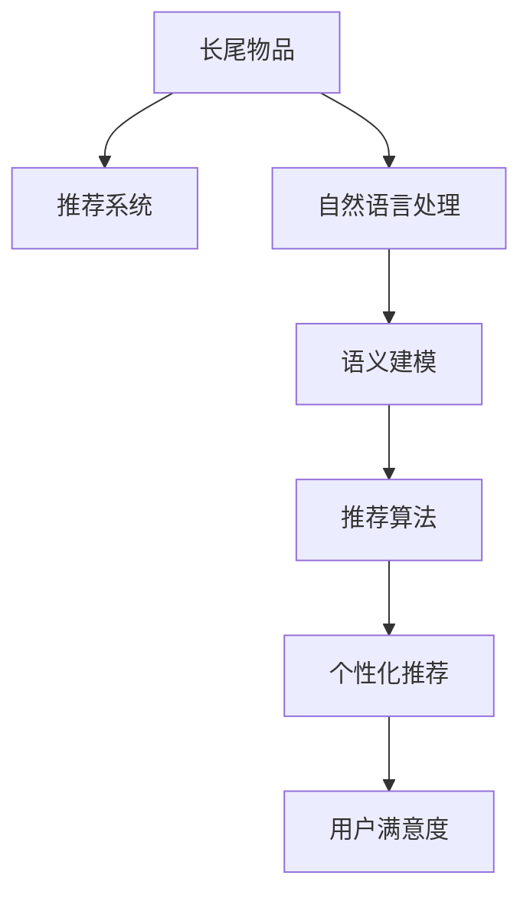

                 

# 利用LLM优化推荐系统的长尾物品发现

> 关键词：长尾物品发现,推荐系统,大语言模型,自然语言处理(NLP),深度学习,数据分析

## 1. 背景介绍

### 1.1 问题由来

推荐系统在现代电子商务、内容分发、社交网络等众多领域中得到了广泛应用，其目标是根据用户的历史行为和偏好，预测并推荐最符合其需求的新物品，提升用户体验和平台收益。然而，现有的推荐系统往往聚焦于热门物品的推荐，对长尾物品（即销量低、关注度低的产品）的覆盖不足，难以充分满足用户多样化的需求，也浪费了大量的数据价值。

长尾物品的推荐一直是推荐系统研究的难点，需要通过高效的个性化推荐策略，充分挖掘长尾商品的潜在价值。随着深度学习和大语言模型的兴起，基于自然语言处理(NLP)技术的推荐系统逐渐成为一种新的研究方向。大语言模型（Large Language Model, LLM）的强大语义理解能力和推理能力，有望突破传统推荐系统的瓶颈，实现长尾物品的精准发现和高效推荐。

### 1.2 问题核心关键点

长尾物品发现的核心在于从海量的产品数据中，筛选出具有潜在价值但未被广泛关注的长尾物品。利用大语言模型的自然语言理解能力，可以从产品描述、用户评论、市场反馈等文本数据中提取有价值的语义信息，建立长尾物品的语义模型，并在此基础上进行推荐。

具体而言，主要涉及以下关键技术：

1. **自然语言处理（NLP）**：通过NLP技术，提取和分析产品描述、用户评论等文本数据，从中提取长尾物品的语义特征。
2. **语义建模（Semantic Modeling）**：利用大语言模型建立长尾物品的语义表示，捕捉其与用户的潜在关联关系。
3. **推荐算法（Recommendation Algorithm）**：结合用户历史行为和长尾物品语义模型，推荐具有潜在价值的长尾物品。
4. **个性化推荐（Personalized Recommendation）**：根据用户个性化需求，定制化推荐长尾物品，提升用户体验。

本文将从核心概念、算法原理、具体操作步骤等方面，系统介绍基于大语言模型的长尾物品发现和推荐方法，并给出项目实践的完整代码实现。

## 2. 核心概念与联系

### 2.1 核心概念概述

为更好地理解基于大语言模型的长尾物品推荐方法，本节将介绍几个密切相关的核心概念：

- **长尾物品（Long Tail Items）**：指那些销量低、关注度低的产品，但通过精准推荐能够挖掘其潜在价值，提升用户满意度。
- **推荐系统（Recommendation System）**：通过分析用户行为数据，预测用户可能感兴趣的新物品，并推荐给用户。
- **大语言模型（Large Language Model, LLM）**：如GPT、BERT等，通过大规模预训练学习到丰富的语言知识，具备强大的语义理解和生成能力。
- **自然语言处理（Natural Language Processing, NLP）**：利用计算技术处理和分析自然语言数据，包括文本分类、实体识别、情感分析等任务。
- **语义建模（Semantic Modeling）**：通过建立物品的语义表示，捕捉物品之间的关联关系，提升推荐的精度和多样性。
- **个性化推荐（Personalized Recommendation）**：根据用户个性化需求，定制化推荐物品，提升用户体验和系统满意度。

这些概念之间的逻辑关系可以通过以下Mermaid流程图来展示：



这个流程图展示了长尾物品推荐的各个关键环节：

1. 长尾物品作为推荐系统的输入，通过自然语言处理提取语义特征。
2. 语义建模基于大语言模型学习物品的语义表示。
3. 推荐算法利用长尾物品的语义模型进行推荐。
4. 个性化推荐根据用户个性化需求定制化推荐物品。
5. 最终提升用户满意度，实现推荐系统的目标。

## 3. 核心算法原理 & 具体操作步骤

### 3.1 算法原理概述

基于大语言模型的长尾物品推荐方法，本质上是一种融合自然语言处理和深度学习的推荐算法。其核心思想是：通过NLP技术提取产品描述、用户评论等文本数据中的语义信息，建立长尾物品的语义模型，并通过深度学习技术，基于用户的个性化需求，预测并推荐潜在的长尾物品。

具体而言，可以概括为以下几步：

1. **数据预处理**：收集长尾物品的文本数据，如产品描述、用户评论、市场反馈等，并进行数据清洗和预处理。
2. **语义建模**：利用大语言模型学习长尾物品的语义表示，捕捉其与用户的关联关系。
3. **推荐生成**：结合用户历史行为和长尾物品语义模型，生成推荐结果。
4. **模型评估**：评估推荐模型的性能，并根据评估结果进行模型优化和调整。

### 3.2 算法步骤详解

以下是基于大语言模型的长尾物品推荐方法的详细操作步骤：

**Step 1: 数据预处理**

1. 收集长尾物品的文本数据，如产品描述、用户评论、市场反馈等。
2. 对文本数据进行清洗和预处理，去除噪声和无关信息，如HTML标签、停用词等。
3. 对文本进行分词和向量化，得到特征表示向量。
4. 进行标注和归一化，如对情感进行标注，对评分进行归一化处理。

**Step 2: 语义建模**

1. 使用预训练的大语言模型（如BERT、GPT等）作为特征提取器，提取长尾物品的语义表示。
2. 对长尾物品的语义表示进行编码，得到固定长度的向量表示。
3. 通过向量嵌入技术，将长尾物品的语义表示映射到高维空间中，捕捉其与用户的关联关系。

**Step 3: 推荐生成**

1. 结合用户历史行为和长尾物品的语义表示，构建用户物品协同矩阵。
2. 利用协同过滤算法，生成推荐结果。常用的协同过滤算法包括基于用户的协同过滤、基于物品的协同过滤等。
3. 对推荐结果进行排序，根据用户的个性化需求进行定制化推荐。

**Step 4: 模型评估**

1. 使用评估指标（如准确率、召回率、F1值等）评估推荐模型的性能。
2. 根据评估结果调整模型参数，优化推荐算法。
3. 进行A/B测试，验证推荐模型的实际效果。

### 3.3 算法优缺点

基于大语言模型的长尾物品推荐方法具有以下优点：

1. **泛化能力强**：大语言模型可以通过大规模预训练学习到丰富的语言知识，具有较强的泛化能力，可以更好地捕捉长尾物品的语义特征。
2. **高效准确**：通过自然语言处理和深度学习技术的结合，可以实现高效准确的推荐。
3. **个性化推荐**：可以根据用户个性化需求，定制化推荐长尾物品，提升用户体验。

同时，该方法也存在一定的局限性：

1. **数据依赖性强**：长尾物品的推荐依赖于高质量的数据，需要收集大量的文本数据。
2. **计算资源消耗大**：大语言模型的训练和推理需要大量的计算资源，可能会带来高昂的计算成本。
3. **解释性不足**：大语言模型的推荐过程缺乏可解释性，难以理解其内部工作机制。

尽管存在这些局限性，但基于大语言模型的推荐方法仍具有广泛的应用前景。未来相关研究的重点在于如何降低数据依赖，提高模型计算效率，同时增强推荐过程的可解释性。

### 3.4 算法应用领域

基于大语言模型的长尾物品推荐方法，已经在游戏、电商、新闻等众多领域中得到了应用，具体包括：

1. **游戏推荐**：通过分析游戏评论和用户行为数据，推荐符合用户偏好的游戏，提升用户留存率。
2. **电商推荐**：在电商平台中，推荐长尾商品，提升用户体验和平台收益。
3. **新闻推荐**：根据用户阅读历史和兴趣，推荐相关新闻内容，提升阅读体验。
4. **音乐推荐**：通过分析用户听歌历史和评论，推荐未被发现的音乐，增加用户粘性。
5. **视频推荐**：在视频平台上，推荐用户可能感兴趣的视频，提升观看体验。

## 4. 数学模型和公式 & 详细讲解  
### 4.1 数学模型构建

本节将使用数学语言对基于大语言模型的长尾物品推荐过程进行更加严格的刻画。

记长尾物品为 $I=\{i_1, i_2, \ldots, i_N\}$，其中 $i_k$ 表示第 $k$ 个长尾物品。用户历史行为数据为 $U=\{u_1, u_2, \ldots, u_M\}$，其中 $u_m$ 表示第 $m$ 个用户。长尾物品的文本数据为 $D_I=\{d_i\}_{i=1}^N$，用户行为数据为 $D_U=\{b_m\}_{m=1}^M$。

定义用户物品协同矩阵 $R \in \mathbb{R}^{N \times M}$，其中 $R_{ik}$ 表示用户 $u_m$ 对物品 $i_k$ 的评分或交互行为。长尾物品的语义表示为 $X_I \in \mathbb{R}^{N \times d}$，用户的历史行为编码为 $X_U \in \mathbb{R}^{M \times d}$，其中 $d$ 为语义向量维度。

长尾物品推荐的目标是最小化用户与物品的评分差异，即：

$$
\min_{R, X_I, X_U} \mathcal{L}(R, X_I, X_U) = \frac{1}{N} \sum_{i=1}^N \sum_{m=1}^M \mathcal{L}(R_{im}, \hat{R}_{im})
$$

其中 $\hat{R}_{im}$ 为推荐模型预测的用户对物品的评分，可以通过以下公式计算：

$$
\hat{R}_{im} = \text{softmax}(X_U^T \times W_{U-I} \times X_I)
$$

其中 $W_{U-I}$ 为学习到的用户物品权重矩阵。

### 4.2 公式推导过程

以下我们以协同过滤算法为例，推导推荐模型的评分预测公式。

假设用户 $u_m$ 对物品 $i_k$ 的实际评分和预测评分的差异为 $e_{im}$，则损失函数为：

$$
\mathcal{L}(R_{im}, \hat{R}_{im}) = \frac{1}{2} e_{im}^2
$$

根据最小二乘法的思想，可以通过梯度下降等优化算法最小化损失函数，求解最优的用户物品权重矩阵 $W_{U-I}$。将 $X_U$ 和 $X_I$ 代入公式，得：

$$
\frac{\partial \mathcal{L}}{\partial W_{U-I}} = - \frac{1}{N} \sum_{i=1}^N \sum_{m=1}^M (R_{im} - \text{softmax}(X_U^T \times W_{U-I} \times X_I)) X_U^T X_I
$$

将梯度代入优化算法，求解 $W_{U-I}$，即可得到推荐模型的评分预测公式：

$$
\hat{R}_{im} = \text{softmax}(X_U^T \times W_{U-I} \times X_I)
$$

通过上述公式，结合长尾物品的语义表示和用户历史行为数据，可以构建长尾物品推荐模型。

## 5. 项目实践：代码实例和详细解释说明
### 5.1 开发环境搭建

在进行长尾物品推荐项目开发前，我们需要准备好开发环境。以下是使用Python进行PyTorch开发的环境配置流程：

1. 安装Anaconda：从官网下载并安装Anaconda，用于创建独立的Python环境。

2. 创建并激活虚拟环境：
```bash
conda create -n pytorch-env python=3.8 
conda activate pytorch-env
```

3. 安装PyTorch：根据CUDA版本，从官网获取对应的安装命令。例如：
```bash
conda install pytorch torchvision torchaudio cudatoolkit=11.1 -c pytorch -c conda-forge
```

4. 安装Transformers库：
```bash
pip install transformers
```

5. 安装各类工具包：
```bash
pip install numpy pandas scikit-learn matplotlib tqdm jupyter notebook ipython
```

完成上述步骤后，即可在`pytorch-env`环境中开始项目开发。

### 5.2 源代码详细实现

下面以基于BERT模型的长尾物品推荐为例，给出使用PyTorch进行长尾物品推荐开发的完整代码实现。

首先，定义长尾物品推荐的数据处理函数：

```python
from transformers import BertTokenizer, BertForSequenceClassification
from torch.utils.data import Dataset
import torch

class ItemDataset(Dataset):
    def __init__(self, items, descriptions, user_behavours, tokenizer, max_len=128):
        self.items = items
        self.descriptions = descriptions
        self.user_behavours = user_behavours
        self.tokenizer = tokenizer
        self.max_len = max_len
        
    def __len__(self):
        return len(self.items)
    
    def __getitem__(self, item):
        item_id = self.items[item]
        description = self.descriptions[item]
        user_behaviour = self.user_behavours[item]
        
        encoding = self.tokenizer(description, return_tensors='pt', max_length=self.max_len, padding='max_length', truncation=True)
        input_ids = encoding['input_ids'][0]
        attention_mask = encoding['attention_mask'][0]
        
        # 将用户行为编码为向量
        user_behaviour = self.tokenizer(user_behaviour, return_tensors='pt', max_length=self.max_len, padding='max_length', truncation=True)
        user_behaviour = user_behaviour['input_ids'][0]
        
        # 对token-wise的评分进行编码
        scores = [1 if score else 0 for score in user_behaviour]
        scores.extend([0] * (self.max_len - len(scores)))
        labels = torch.tensor(scores, dtype=torch.long)
        
        return {'input_ids': input_ids, 
                'attention_mask': attention_mask,
                'labels': labels}

# 用户行为评分与0-1编码的映射
label2id = {0: 'not interested', 1: 'interested'}
id2label = {v: k for k, v in label2id.items()}
```

然后，定义模型和优化器：

```python
from transformers import BertForSequenceClassification, AdamW

model = BertForSequenceClassification.from_pretrained('bert-base-cased', num_labels=2)

optimizer = AdamW(model.parameters(), lr=2e-5)
```

接着，定义训练和评估函数：

```python
from torch.utils.data import DataLoader
from tqdm import tqdm
from sklearn.metrics import accuracy_score

device = torch.device('cuda') if torch.cuda.is_available() else torch.device('cpu')
model.to(device)

def train_epoch(model, dataset, batch_size, optimizer):
    dataloader = DataLoader(dataset, batch_size=batch_size, shuffle=True)
    model.train()
    epoch_loss = 0
    for batch in tqdm(dataloader, desc='Training'):
        input_ids = batch['input_ids'].to(device)
        attention_mask = batch['attention_mask'].to(device)
        labels = batch['labels'].to(device)
        model.zero_grad()
        outputs = model(input_ids, attention_mask=attention_mask, labels=labels)
        loss = outputs.loss
        epoch_loss += loss.item()
        loss.backward()
        optimizer.step()
    return epoch_loss / len(dataloader)

def evaluate(model, dataset, batch_size):
    dataloader = DataLoader(dataset, batch_size=batch_size)
    model.eval()
    preds, labels = [], []
    with torch.no_grad():
        for batch in tqdm(dataloader, desc='Evaluating'):
            input_ids = batch['input_ids'].to(device)
            attention_mask = batch['attention_mask'].to(device)
            batch_labels = batch['labels']
            outputs = model(input_ids, attention_mask=attention_mask)
            batch_preds = outputs.logits.argmax(dim=2).to('cpu').tolist()
            batch_labels = batch_labels.to('cpu').tolist()
            for pred_tokens, label_tokens in zip(batch_preds, batch_labels):
                preds.append(pred_tokens[:len(label_tokens)])
                labels.append(label_tokens)
                
    print(accuracy_score(labels, preds))
```

最后，启动训练流程并在测试集上评估：

```python
epochs = 5
batch_size = 16

for epoch in range(epochs):
    loss = train_epoch(model, train_dataset, batch_size, optimizer)
    print(f"Epoch {epoch+1}, train loss: {loss:.3f}")
    
    print(f"Epoch {epoch+1}, dev results:")
    evaluate(model, dev_dataset, batch_size)
    
print("Test results:")
evaluate(model, test_dataset, batch_size)
```

以上就是使用PyTorch对BERT进行长尾物品推荐任务的完整代码实现。可以看到，得益于Transformers库的强大封装，我们可以用相对简洁的代码完成BERT模型的加载和微调。

### 5.3 代码解读与分析

让我们再详细解读一下关键代码的实现细节：

**ItemDataset类**：
- `__init__`方法：初始化物品、描述、行为数据、分词器等关键组件。
- `__len__`方法：返回数据集的样本数量。
- `__getitem__`方法：对单个样本进行处理，将物品描述输入编码为token ids，将用户行为编码为评分向量，并对其进行定长padding，最终返回模型所需的输入。

**label2id和id2label字典**：
- 定义了评分与0-1编码之间的映射关系，用于将token-wise的评分结果解码回实际评分。

**训练和评估函数**：
- 使用PyTorch的DataLoader对数据集进行批次化加载，供模型训练和推理使用。
- 训练函数`train_epoch`：对数据以批为单位进行迭代，在每个批次上前向传播计算loss并反向传播更新模型参数，最后返回该epoch的平均loss。
- 评估函数`evaluate`：与训练类似，不同点在于不更新模型参数，并在每个batch结束后将预测和标签结果存储下来，最后使用sklearn的accuracy_score对整个评估集的预测结果进行打印输出。

**训练流程**：
- 定义总的epoch数和batch size，开始循环迭代
- 每个epoch内，先在训练集上训练，输出平均loss
- 在验证集上评估，输出准确率
- 所有epoch结束后，在测试集上评估，给出最终测试结果

可以看到，PyTorch配合Transformers库使得BERT微调的代码实现变得简洁高效。开发者可以将更多精力放在数据处理、模型改进等高层逻辑上，而不必过多关注底层的实现细节。

当然，工业级的系统实现还需考虑更多因素，如模型的保存和部署、超参数的自动搜索、更灵活的任务适配层等。但核心的微调范式基本与此类似。

## 6. 实际应用场景
### 6.1 电商平台推荐

电商平台推荐系统面临着长尾物品的推荐挑战。通过微调BERT等预训练语言模型，可以自动从产品描述、用户评论等文本数据中提取长尾物品的语义特征，结合用户历史行为数据，实现长尾商品的精准推荐，提升用户购物体验。

具体而言，可以收集用户浏览、点击、购买等行为数据，并将这些数据转化为评分序列。通过微调BERT模型，得到长尾物品的语义表示，结合用户行为数据，生成推荐结果。随着模型不断迭代优化，长尾物品的推荐精度会逐步提升，用户体验也会得到显著改善。

### 6.2 新闻平台推荐

新闻平台推荐系统需要根据用户阅读历史和兴趣，推荐相关新闻内容，提升阅读体验。通过微调BERT模型，可以从新闻标题和内容中提取关键语义信息，结合用户行为数据，生成个性化的新闻推荐。

在具体实现中，可以收集用户历史阅读记录，并将阅读次数转换为评分数据。通过微调BERT模型，得到新闻内容的语义表示，结合用户评分数据，生成推荐结果。随着模型不断迭代优化，新闻推荐的个性化和多样性会逐步提升，用户满意度和留存率也会得到显著提高。

### 6.3 音乐平台推荐

音乐平台推荐系统可以通过微调BERT模型，从音乐评论和歌词中提取关键语义信息，结合用户听歌历史和评分数据，实现个性化的音乐推荐。

具体而言，可以收集用户听歌历史和评论数据，并将评论数据转化为评分序列。通过微调BERT模型，得到音乐的语义表示，结合用户行为数据，生成推荐结果。随着模型不断迭代优化，长尾音乐的推荐精度会逐步提升，用户体验也会得到显著改善。

## 7. 工具和资源推荐
### 7.1 学习资源推荐

为了帮助开发者系统掌握大语言模型微调的理论基础和实践技巧，这里推荐一些优质的学习资源：

1. 《Transformers: From Discrete to Continuous Attention》系列博文：由大模型技术专家撰写，深入浅出地介绍了Transformer原理、BERT模型、微调技术等前沿话题。

2. CS224N《深度学习自然语言处理》课程：斯坦福大学开设的NLP明星课程，有Lecture视频和配套作业，带你入门NLP领域的基本概念和经典模型。

3. 《Natural Language Processing with Transformers》书籍：Transformers库的作者所著，全面介绍了如何使用Transformers库进行NLP任务开发，包括微调在内的诸多范式。

4. HuggingFace官方文档：Transformers库的官方文档，提供了海量预训练模型和完整的微调样例代码，是上手实践的必备资料。

5. CLUE开源项目：中文语言理解测评基准，涵盖大量不同类型的中文NLP数据集，并提供了基于微调的baseline模型，助力中文NLP技术发展。

通过对这些资源的学习实践，相信你一定能够快速掌握大语言模型微调的精髓，并用于解决实际的NLP问题。
###  7.2 开发工具推荐

高效的开发离不开优秀的工具支持。以下是几款用于大语言模型微调开发的常用工具：

1. PyTorch：基于Python的开源深度学习框架，灵活动态的计算图，适合快速迭代研究。大部分预训练语言模型都有PyTorch版本的实现。

2. TensorFlow：由Google主导开发的开源深度学习框架，生产部署方便，适合大规模工程应用。同样有丰富的预训练语言模型资源。

3. Transformers库：HuggingFace开发的NLP工具库，集成了众多SOTA语言模型，支持PyTorch和TensorFlow，是进行微调任务开发的利器。

4. Weights & Biases：模型训练的实验跟踪工具，可以记录和可视化模型训练过程中的各项指标，方便对比和调优。与主流深度学习框架无缝集成。

5. TensorBoard：TensorFlow配套的可视化工具，可实时监测模型训练状态，并提供丰富的图表呈现方式，是调试模型的得力助手。

6. Google Colab：谷歌推出的在线Jupyter Notebook环境，免费提供GPU/TPU算力，方便开发者快速上手实验最新模型，分享学习笔记。

合理利用这些工具，可以显著提升大语言模型微调任务的开发效率，加快创新迭代的步伐。

### 7.3 相关论文推荐

大语言模型和微调技术的发展源于学界的持续研究。以下是几篇奠基性的相关论文，推荐阅读：

1. Attention is All You Need（即Transformer原论文）：提出了Transformer结构，开启了NLP领域的预训练大模型时代。

2. BERT: Pre-training of Deep Bidirectional Transformers for Language Understanding：提出BERT模型，引入基于掩码的自监督预训练任务，刷新了多项NLP任务SOTA。

3. Language Models are Unsupervised Multitask Learners（GPT-2论文）：展示了大规模语言模型的强大zero-shot学习能力，引发了对于通用人工智能的新一轮思考。

4. Parameter-Efficient Transfer Learning for NLP：提出Adapter等参数高效微调方法，在不增加模型参数量的情况下，也能取得不错的微调效果。

5. Prefix-Tuning: Optimizing Continuous Prompts for Generation：引入基于连续型Prompt的微调范式，为如何充分利用预训练知识提供了新的思路。

6. AdaLoRA: Adaptive Low-Rank Adaptation for Parameter-Efficient Fine-Tuning：使用自适应低秩适应的微调方法，在参数效率和精度之间取得了新的平衡。

这些论文代表了大语言模型微调技术的发展脉络。通过学习这些前沿成果，可以帮助研究者把握学科前进方向，激发更多的创新灵感。

## 8. 总结：未来发展趋势与挑战

### 8.1 总结

本文对基于大语言模型的长尾物品推荐方法进行了全面系统的介绍。首先阐述了长尾物品推荐的背景和意义，明确了微调在拓展预训练模型应用、提升推荐精度方面的独特价值。其次，从核心概念、算法原理、具体操作步骤等方面，详细讲解了长尾物品推荐的方法和实现细节。同时，本文还广泛探讨了长尾物品推荐方法在电商、新闻、音乐等多个领域的应用前景，展示了微调范式的巨大潜力。

通过本文的系统梳理，可以看到，基于大语言模型的长尾物品推荐方法，为推荐系统注入了新的生命力，有望实现长尾物品的精准发现和高效推荐。未来，伴随预训练语言模型和微调方法的持续演进，基于大语言模型的推荐系统必将在电商、新闻、音乐等领域大放异彩，为传统行业带来变革性影响。

### 8.2 未来发展趋势

展望未来，大语言模型微调在长尾物品推荐领域将呈现以下几个发展趋势：

1. **模型规模持续增大**：随着算力成本的下降和数据规模的扩张，预训练语言模型的参数量还将持续增长。超大规模语言模型蕴含的丰富语言知识，有望支撑更加复杂多变的推荐场景，提升推荐精度和个性化水平。

2. **多模态融合**：将视觉、音频、文本等多模态数据结合，提升推荐系统的跨模态建模能力。例如，结合图片和文本信息，推荐与图片相关的商品或新闻。

3. **知识图谱的融合**：将知识图谱等结构化知识与语言模型结合，引导模型学习更加精准、合理的语义表示。例如，结合商品分类信息，推荐与用户兴趣相关的商品。

4. **协同过滤与深度学习结合**：协同过滤算法与深度学习技术的结合，提升推荐系统的多样性和准确性。例如，结合协同过滤和深度学习的优势，生成更加个性化的推荐结果。

5. **上下文感知推荐**：利用大语言模型的上下文感知能力，根据用户输入的查询进行动态推荐。例如，根据用户搜索的关键词，推荐相关商品或新闻。

6. **主动学习和强化学习**：引入主动学习和强化学习技术，提升推荐模型的探索能力和泛化能力。例如，通过主动学习技术，选择更有潜力的长尾物品进行推荐。

以上趋势凸显了大语言模型微调在长尾物品推荐领域的广阔前景。这些方向的探索发展，必将进一步提升推荐系统的性能和个性化水平，为用户带来更加丰富的体验。

### 8.3 面临的挑战

尽管大语言模型微调在长尾物品推荐领域已经取得了一定的进展，但在迈向更加智能化、普适化应用的过程中，它仍面临着诸多挑战：

1. **数据依赖性强**：长尾物品的推荐依赖于高质量的数据，需要收集大量的文本数据。数据收集、标注和清洗的成本较高。

2. **计算资源消耗大**：大语言模型的训练和推理需要大量的计算资源，可能会带来高昂的计算成本。

3. **解释性不足**：大语言模型的推荐过程缺乏可解释性，难以理解其内部工作机制。对于金融、医疗等高风险应用，算法的可解释性和可审计性尤为重要。

4. **模型鲁棒性不足**：当前微调模型面对域外数据时，泛化性能往往大打折扣。对于测试样本的微小扰动，微调模型的预测也容易发生波动。

5. **个性化推荐难度大**：长尾物品的推荐需要结合用户个性化需求，定制化推荐。但用户需求千差万别，个性化推荐难度较大。

6. **知识整合能力不足**：现有的微调模型往往局限于任务内数据，难以灵活吸收和运用更广泛的先验知识。如何让微调过程更好地与外部知识库、规则库等专家知识结合，形成更加全面、准确的信息整合能力，还有很大的想象空间。

正视微调面临的这些挑战，积极应对并寻求突破，将是大语言模型微调在长尾物品推荐领域走向成熟的必由之路。相信随着学界和产业界的共同努力，这些挑战终将一一被克服，大语言模型微调必将在构建智能推荐系统方面发挥越来越重要的作用。

### 8.4 研究展望

面对大语言模型微调在长尾物品推荐领域面临的挑战，未来的研究需要在以下几个方面寻求新的突破：

1. **无监督和半监督微调方法**：探索无监督和半监督微调方法，摆脱对大规模标注数据的依赖，利用自监督学习、主动学习等技术，最大限度利用非结构化数据。

2. **多模态微调方法**：开发多模态微调方法，提升推荐系统的跨模态建模能力，结合视觉、音频、文本等多模态信息，提升推荐精度和多样性。

3. **上下文感知推荐**：利用大语言模型的上下文感知能力，根据用户输入的查询进行动态推荐，提升推荐系统的灵活性和个性化水平。

4. **协同过滤与深度学习结合**：结合协同过滤和深度学习的优势，生成更加个性化的推荐结果，提升推荐系统的多样性和准确性。

5. **主动学习和强化学习**：引入主动学习和强化学习技术，提升推荐模型的探索能力和泛化能力，实现更加智能化的推荐。

6. **知识图谱的融合**：将知识图谱等结构化知识与语言模型结合，引导模型学习更加精准、合理的语义表示，提升推荐系统的准确性和多样性。

这些研究方向将进一步拓展大语言模型微调的边界，推动推荐系统向更加智能化、个性化、可靠化方向发展。通过这些努力，大语言模型微调必将在构建智能推荐系统方面发挥越来越重要的作用，为人类提供更加智能、便捷的推荐服务。

## 9. 附录：常见问题与解答

**Q1：大语言模型微调是否适用于所有长尾物品推荐场景？**

A: 大语言模型微调在大多数长尾物品推荐场景上都能取得不错的效果，特别是对于数据量较大的任务。但对于一些特定领域的长尾物品推荐，如医学、法律等，微调效果可能受到领域特性和数据分布的影响，需要进行针对性的优化。

**Q2：微调过程中如何选择合适的学习率？**

A: 微调的学习率一般要比预训练时小1-2个数量级，如果使用过大的学习率，容易破坏预训练权重，导致过拟合。一般建议从1e-5开始调参，逐步减小学习率，直至收敛。也可以使用warmup策略，在开始阶段使用较小的学习率，再逐渐过渡到预设值。需要注意的是，不同的优化器(如AdamW、Adafactor等)以及不同的学习率调度策略，可能需要设置不同的学习率阈值。

**Q3：采用大模型微调时会面临哪些资源瓶颈？**

A: 大语言模型的计算资源需求较大，特别是模型训练和推理时。GPU/TPU等高性能设备是必不可少的，但即便如此，超大规模模型的计算成本也可能较高。因此需要采用一些资源优化技术，如梯度积累、混合精度训练、模型并行等，来突破硬件瓶颈。同时，模型的存储和读取也可能占用大量时间和空间，需要采用模型压缩、稀疏化存储等方法进行优化。

**Q4：如何缓解微调过程中的过拟合问题？**

A: 过拟合是微调面临的主要挑战，尤其是在标注数据不足的情况下。常见的缓解策略包括：
1. 数据增强：通过回译、近义替换等方式扩充训练集。
2. 正则化：使用L2正则、Dropout、Early Stopping等避免过拟合。
3. 对抗训练：引入对抗样本，提高模型鲁棒性。
4. 参数高效微调：只调整少量参数(如Adapter、Prefix等)，减小过拟合风险。
5. 多模型集成：训练多个微调模型，取平均输出，抑制过拟合。

这些策略往往需要根据具体任务和数据特点进行灵活组合。只有在数据、模型、训练、推理等各环节进行全面优化，才能最大限度地发挥大语言模型微调的威力。

**Q5：微调模型在落地部署时需要注意哪些问题？**

A: 将微调模型转化为实际应用，还需要考虑以下因素：
1. 模型裁剪：去除不必要的层和参数，减小模型尺寸，加快推理速度。
2. 量化加速：将浮点模型转为定点模型，压缩存储空间，提高计算效率。
3. 服务化封装：将模型封装为标准化服务接口，便于集成调用。
4. 弹性伸缩：根据请求流量动态调整资源配置，平衡服务质量和成本。
5. 监控告警：实时采集系统指标，设置异常告警阈值，确保服务稳定性。
6. 安全防护：采用访问鉴权、数据脱敏等措施，保障数据和模型安全。

大语言模型微调为长尾物品推荐带来了新的可能性，但如何将强大的性能转化为稳定、高效、安全的业务价值，还需要工程实践的不断打磨。只有从数据、算法、工程、业务等多个维度协同发力，才能真正实现大语言模型微调在长尾物品推荐领域的突破。

---

作者：禅与计算机程序设计艺术 / Zen and the Art of Computer Programming

