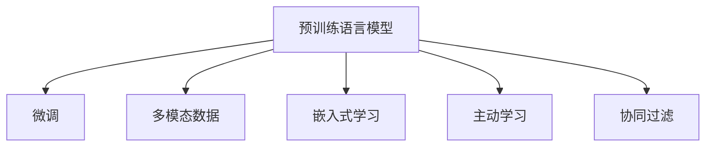

                 

# 利用大模型总结用户浏览历史

## 1. 背景介绍

### 1.1 问题由来

在电子商务和在线媒体平台，用户浏览历史是挖掘用户兴趣、行为和需求的重要数据源。然而，传统的数据分析方法往往依赖人工标签或者简单的机器学习模型，难以有效捕捉用户行为的多样性和复杂性。

大语言模型（Large Language Models, LLMs）的兴起为自动化分析用户浏览历史提供了新的可能性。通过预训练语言模型（Pretrained Language Models），可以抽取文本中的丰富语义信息，从而在不需要大量标注数据的情况下，对用户浏览历史进行高效分析和建模。

### 1.2 问题核心关键点

- **用户行为建模**：利用大模型对用户浏览历史进行建模，挖掘其兴趣和需求。
- **无监督学习**：无需大量标注数据，通过预训练模型自动学习用户行为模式。
- **多模态融合**：结合文本、图片、视频等多模态数据，提升对用户行为的全面理解。
- **可解释性**：通过模型输出结果的可解释性，提升决策过程的透明度和可信度。
- **实时性**：大模型支持高效推理，实时捕捉用户行为变化，提升用户体验。

### 1.3 问题研究意义

对用户浏览历史进行高效建模，对于个性化推荐、内容定制、用户行为预测等应用具有重要意义：

1. **个性化推荐**：基于用户兴趣和行为的个性化推荐，提升用户满意度和留存率。
2. **内容定制**：根据用户浏览历史定制内容，提升内容的相关性和吸引力。
3. **用户行为预测**：预测用户未来的浏览行为和购买倾向，指导广告投放和营销策略。
4. **用户体验优化**：通过理解用户需求，提升平台的用户体验和服务质量。

## 2. 核心概念与联系

### 2.1 核心概念概述

为更好地理解如何利用大模型总结用户浏览历史，本节将介绍几个密切相关的核心概念：

- **预训练语言模型**：如BERT、GPT等，通过在大规模无标签文本语料上进行预训练，学习通用的语言表示。
- **微调**：基于下游任务的具体需求，对预训练模型进行微调，使其适应特定任务。
- **多模态数据**：结合文本、图片、视频等多模态数据，更全面地理解用户行为。
- **嵌入式学习**：将用户浏览历史与嵌入式知识进行结合，提升模型对特定领域的理解。
- **主动学习**：通过用户反馈，动态调整模型参数，优化模型预测。
- **协同过滤**：利用用户间的相似性，进行推荐或行为预测。

这些概念之间的逻辑关系可以通过以下Mermaid流程图来展示：



这个流程图展示了大模型用于总结用户浏览历史的各个关键概念及其之间的关系：

1. 通过预训练语言模型获取通用语言表示。
2. 在微调过程中，对模型进行特定任务的适配。
3. 结合多模态数据，提升模型对用户行为的全面理解。
4. 将用户浏览历史与嵌入式知识结合，提升模型对特定领域的理解。
5. 通过主动学习和协同过滤，动态调整模型，优化预测结果。

## 3. 核心算法原理 & 具体操作步骤
### 3.1 算法原理概述

利用大模型总结用户浏览历史的核心思想是：通过预训练语言模型学习通用的语言表示，然后通过微调过程适应特定用户浏览历史的数据分布。具体而言，可以从以下步骤进行：

1. **预训练模型准备**：选择适合的预训练语言模型，如BERT、GPT等，作为初始化参数。
2. **数据预处理**：将用户浏览历史数据转换为模型可处理的输入形式，如文本、图片、视频等。
3. **微调模型**：在用户浏览历史数据上，对预训练模型进行微调，使其能够捕捉用户行为特征。
4. **多模态融合**：结合不同模态的数据，提升对用户行为的全面理解。
5. **嵌入式学习**：将用户浏览历史与嵌入式知识结合，提升模型对特定领域的理解。
6. **预测与反馈**：使用微调后的模型对用户未来行为进行预测，并根据用户反馈进行动态调整。

### 3.2 算法步骤详解

#### 步骤1：数据准备和预处理

用户浏览历史数据通常包含以下几类信息：

- **文本数据**：如网页标题、内容、图片描述等。
- **图片数据**：如产品图片、广告图像等。
- **视频数据**：如产品介绍视频、广告短片等。

对于不同类型的输入数据，需要进行相应的预处理。以文本数据为例，常见的预处理步骤包括：

- **分词和清洗**：去除噪声，如标点、停用词等。
- **序列化和填充**：将文本序列化，并进行填充，使所有样本的序列长度相同。
- **标签编码**：将文本标签转换为模型可以处理的数值形式。

#### 步骤2：模型选择和微调

选择适合的预训练语言模型作为初始化参数。以BERT模型为例，微调过程可以分为以下几个步骤：

1. **加载模型**：使用Hugging Face的Transformers库加载预训练的BERT模型。
2. **定义任务**：根据具体任务定义任务输入和输出格式。
3. **微调设置**：设置微调的学习率、批大小、迭代轮数等超参数。
4. **微调过程**：在用户浏览历史数据上，对模型进行微调。
5. **模型评估**：在验证集上评估微调后模型的性能，确保模型泛化能力。

#### 步骤3：多模态数据融合

结合文本、图片、视频等多模态数据，提升对用户行为的全面理解。以下是一个简单的多模态数据融合示例：

1. **特征提取**：对文本、图片、视频等数据进行特征提取。
2. **融合方式**：可以使用简单的拼接、加权平均等方式融合多模态数据。
3. **输入调整**：将融合后的数据调整为模型可处理的输入形式。

#### 步骤4：嵌入式学习

将用户浏览历史与嵌入式知识结合，提升模型对特定领域的理解。嵌入式学习的步骤如下：

1. **领域知识获取**：收集特定领域的知识图谱、规则等。
2. **知识嵌入**：将领域知识转换为模型可以处理的数值形式。
3. **模型融合**：将嵌入式知识和预训练模型进行融合，提升模型对特定领域的理解。

#### 步骤5：预测与反馈

使用微调后的模型对用户未来行为进行预测，并根据用户反馈进行动态调整。步骤如下：

1. **预测生成**：输入用户浏览历史数据，生成预测结果。
2. **结果评估**：根据预测结果和实际行为，评估模型性能。
3. **动态调整**：根据用户反馈，动态调整模型参数。

### 3.3 算法优缺点

利用大模型总结用户浏览历史的优势包括：

- **高效性**：无需大量标注数据，通过预训练模型自动学习用户行为模式。
- **全面性**：结合多模态数据和嵌入式知识，提升对用户行为的全面理解。
- **实时性**：支持高效推理，实时捕捉用户行为变化，提升用户体验。

然而，该方法也存在以下缺点：

- **数据依赖**：依赖高质量的数据和预训练模型，获取数据成本较高。
- **模型复杂性**：多模态融合和嵌入式学习增加了模型复杂性，需要更多计算资源。
- **解释性不足**：大模型的预测结果往往缺乏可解释性，难以理解其内部工作机制。
- **数据隐私**：用户浏览历史涉及隐私问题，需要谨慎处理和保护。

## 4. 数学模型和公式 & 详细讲解  
### 4.1 数学模型构建

以BERT模型为例，对利用大模型总结用户浏览历史的过程进行数学建模。假设用户浏览历史为 $X=\{x_i\}_{i=1}^N$，其中 $x_i$ 为第 $i$ 个文本数据。模型的输入输出形式为：

- 输入：$x_i$ 的嵌入表示 $\mathbf{h}_i$。
- 输出：用户行为标签 $y_i$。

模型形式为：

$$
f(x_i; \theta) = \sigma(W_x \mathbf{h}_i + b_x + \sum_{k=1}^K b_k \sigma(W_k \mathbf{h}_i + b_k) + b)
$$

其中 $W_x, b_x$ 为文本输入的权重和偏置，$W_k, b_k$ 为领域知识嵌入的权重和偏置，$b$ 为模型的最终输出偏置，$\sigma$ 为激活函数。

### 4.2 公式推导过程

以分类任务为例，假设模型预测结果为 $\hat{y}_i$，则损失函数为：

$$
\mathcal{L}(\theta) = \frac{1}{N} \sum_{i=1}^N \ell(y_i, \hat{y}_i)
$$

其中 $\ell$ 为损失函数，如交叉熵损失。对于二分类任务，损失函数形式为：

$$
\ell(y_i, \hat{y}_i) = -[y_i \log \hat{y}_i + (1-y_i) \log(1-\hat{y}_i)]
$$

### 4.3 案例分析与讲解

假设一个电商平台的商品推荐系统，希望利用用户浏览历史总结用户兴趣。具体步骤如下：

1. **数据准备**：收集用户浏览历史，包括网页标题、图片、视频等。
2. **预训练模型选择**：选择BERT作为初始化模型。
3. **微调设置**：定义二分类任务，设置学习率为1e-5，批大小为16，迭代轮数为10。
4. **微调过程**：在用户浏览历史数据上，对BERT模型进行微调。
5. **多模态融合**：将文本、图片、视频等数据进行融合，生成模型输入。
6. **嵌入式学习**：将商品分类信息作为嵌入式知识，与模型进行融合。
7. **预测与反馈**：使用微调后的模型对用户兴趣进行预测，并根据用户反馈进行动态调整。

## 5. 项目实践：代码实例和详细解释说明
### 5.1 开发环境搭建

在进行用户浏览历史分析的项目实践前，我们需要准备好开发环境。以下是使用Python进行PyTorch开发的环境配置流程：

1. 安装Anaconda：从官网下载并安装Anaconda，用于创建独立的Python环境。
2. 创建并激活虚拟环境：
```bash
conda create -n pytorch-env python=3.8 
conda activate pytorch-env
```
3. 安装PyTorch：根据CUDA版本，从官网获取对应的安装命令。例如：
```bash
conda install pytorch torchvision torchaudio cudatoolkit=11.1 -c pytorch -c conda-forge
```
4. 安装Transformers库：
```bash
pip install transformers
```
5. 安装各类工具包：
```bash
pip install numpy pandas scikit-learn matplotlib tqdm jupyter notebook ipython
```

完成上述步骤后，即可在`pytorch-env`环境中开始项目实践。

### 5.2 源代码详细实现

以下是一个利用BERT模型对用户浏览历史进行分类的完整代码实现。

```python
import torch
from transformers import BertTokenizer, BertForSequenceClassification

# 加载模型和分词器
model = BertForSequenceClassification.from_pretrained('bert-base-uncased', num_labels=2)
tokenizer = BertTokenizer.from_pretrained('bert-base-uncased')

# 准备数据
train_data = ...
dev_data = ...
test_data = ...

# 定义模型和优化器
device = torch.device('cuda' if torch.cuda.is_available() else 'cpu')
model.to(device)
optimizer = torch.optim.Adam(model.parameters(), lr=1e-5)

# 定义评估函数
def evaluate(model, data_loader, device):
    model.eval()
    correct = 0
    total = 0
    with torch.no_grad():
        for batch in data_loader:
            input_ids = batch['input_ids'].to(device)
            attention_mask = batch['attention_mask'].to(device)
            labels = batch['labels'].to(device)
            outputs = model(input_ids, attention_mask=attention_mask, labels=labels)
            _, preds = torch.max(outputs, 1)
            total += labels.size(0)
            correct += (preds == labels).sum().item()
    acc = correct / total
    return acc

# 训练函数
def train_epoch(model, data_loader, optimizer, device, n_epochs=10):
    model.train()
    total_loss = 0
    for epoch in range(n_epochs):
        for batch in data_loader:
            input_ids = batch['input_ids'].to(device)
            attention_mask = batch['attention_mask'].to(device)
            labels = batch['labels'].to(device)
            optimizer.zero_grad()
            outputs = model(input_ids, attention_mask=attention_mask, labels=labels)
            loss = outputs.loss
            total_loss += loss.item()
            loss.backward()
            optimizer.step()
    avg_loss = total_loss / len(data_loader)
    return avg_loss

# 训练模型
train_loader = ...
dev_loader = ...
test_loader = ...

for epoch in range(n_epochs):
    avg_loss = train_epoch(model, train_loader, optimizer, device, n_epochs)
    dev_acc = evaluate(model, dev_loader, device)
    print(f'Epoch {epoch+1}, loss: {avg_loss:.4f}, dev acc: {dev_acc:.4f}')

# 测试模型
test_acc = evaluate(model, test_loader, device)
print(f'Test acc: {test_acc:.4f}')
```

### 5.3 代码解读与分析

以下是关键代码的解读与分析：

1. **模型加载和数据准备**：首先加载预训练的BERT模型和对应的分词器，然后准备训练集、验证集和测试集数据。
2. **模型和优化器设置**：将模型移动到GPU设备上，使用Adam优化器进行参数更新。
3. **评估函数**：定义评估函数，计算模型在验证集上的准确率。
4. **训练函数**：定义训练函数，在每个epoch中对模型进行微调，并计算训练集的平均损失。
5. **训练和测试**：在训练集上训练模型，并在验证集和测试集上评估模型的性能。

## 6. 实际应用场景

### 6.1 电商商品推荐

在电商平台上，利用大模型对用户浏览历史进行分析和建模，可以显著提升商品推荐系统的性能。具体步骤如下：

1. **数据收集**：收集用户浏览历史数据，包括网页标题、图片、视频等。
2. **数据预处理**：对数据进行分词、清洗和标准化。
3. **模型选择**：选择BERT模型作为初始化模型。
4. **微调设置**：定义二分类任务，设置学习率为1e-5，批大小为16，迭代轮数为10。
5. **多模态融合**：将文本、图片、视频等数据进行融合，生成模型输入。
6. **嵌入式学习**：将商品分类信息作为嵌入式知识，与模型进行融合。
7. **预测与反馈**：使用微调后的模型对用户兴趣进行预测，并根据用户反馈进行动态调整。

### 6.2 在线广告投放

在线广告投放平台可以利用大模型对用户浏览历史进行分析和建模，以提高广告投放的精准性和效果。具体步骤如下：

1. **数据收集**：收集用户浏览历史数据，包括网页标题、图片、视频等。
2. **数据预处理**：对数据进行分词、清洗和标准化。
3. **模型选择**：选择BERT模型作为初始化模型。
4. **微调设置**：定义二分类任务，设置学习率为1e-5，批大小为16，迭代轮数为10。
5. **多模态融合**：将文本、图片、视频等数据进行融合，生成模型输入。
6. **嵌入式学习**：将广告类型信息作为嵌入式知识，与模型进行融合。
7. **预测与反馈**：使用微调后的模型对用户兴趣进行预测，并根据用户反馈进行动态调整。

### 6.3 新闻内容推荐

新闻平台可以利用大模型对用户浏览历史进行分析和建模，以提高新闻内容推荐的个性化程度。具体步骤如下：

1. **数据收集**：收集用户浏览历史数据，包括网页标题、图片、视频等。
2. **数据预处理**：对数据进行分词、清洗和标准化。
3. **模型选择**：选择BERT模型作为初始化模型。
4. **微调设置**：定义二分类任务，设置学习率为1e-5，批大小为16，迭代轮数为10。
5. **多模态融合**：将文本、图片、视频等数据进行融合，生成模型输入。
6. **嵌入式学习**：将新闻分类信息作为嵌入式知识，与模型进行融合。
7. **预测与反馈**：使用微调后的模型对用户兴趣进行预测，并根据用户反馈进行动态调整。

## 7. 工具和资源推荐

### 7.1 学习资源推荐

为了帮助开发者系统掌握大模型在用户浏览历史分析中的理论基础和实践技巧，这里推荐一些优质的学习资源：

1. 《Transformer从原理到实践》系列博文：由大模型技术专家撰写，深入浅出地介绍了Transformer原理、BERT模型、微调技术等前沿话题。
2. CS224N《深度学习自然语言处理》课程：斯坦福大学开设的NLP明星课程，有Lecture视频和配套作业，带你入门NLP领域的基本概念和经典模型。
3. 《Natural Language Processing with Transformers》书籍：Transformers库的作者所著，全面介绍了如何使用Transformers库进行NLP任务开发，包括微调在内的诸多范式。
4. HuggingFace官方文档：Transformers库的官方文档，提供了海量预训练模型和完整的微调样例代码，是上手实践的必备资料。
5. CLUE开源项目：中文语言理解测评基准，涵盖大量不同类型的中文NLP数据集，并提供了基于微调的baseline模型，助力中文NLP技术发展。

通过对这些资源的学习实践，相信你一定能够快速掌握大模型在用户浏览历史分析中的精髓，并用于解决实际的NLP问题。

### 7.2 开发工具推荐

高效的开发离不开优秀的工具支持。以下是几款用于大模型开发和用户浏览历史分析的常用工具：

1. PyTorch：基于Python的开源深度学习框架，灵活动态的计算图，适合快速迭代研究。大部分预训练语言模型都有PyTorch版本的实现。
2. TensorFlow：由Google主导开发的开源深度学习框架，生产部署方便，适合大规模工程应用。同样有丰富的预训练语言模型资源。
3. Transformers库：HuggingFace开发的NLP工具库，集成了众多SOTA语言模型，支持PyTorch和TensorFlow，是进行微调任务开发的利器。
4. Weights & Biases：模型训练的实验跟踪工具，可以记录和可视化模型训练过程中的各项指标，方便对比和调优。与主流深度学习框架无缝集成。
5. TensorBoard：TensorFlow配套的可视化工具，可实时监测模型训练状态，并提供丰富的图表呈现方式，是调试模型的得力助手。
6. Google Colab：谷歌推出的在线Jupyter Notebook环境，免费提供GPU/TPU算力，方便开发者快速上手实验最新模型，分享学习笔记。

合理利用这些工具，可以显著提升大模型在用户浏览历史分析中的开发效率，加快创新迭代的步伐。

### 7.3 相关论文推荐

大语言模型和用户浏览历史分析的发展源于学界的持续研究。以下是几篇奠基性的相关论文，推荐阅读：

1. Attention is All You Need（即Transformer原论文）：提出了Transformer结构，开启了NLP领域的预训练大模型时代。
2. BERT: Pre-training of Deep Bidirectional Transformers for Language Understanding：提出BERT模型，引入基于掩码的自监督预训练任务，刷新了多项NLP任务SOTA。
3. Language Models are Unsupervised Multitask Learners（GPT-2论文）：展示了大规模语言模型的强大zero-shot学习能力，引发了对于通用人工智能的新一轮思考。
4. Parameter-Efficient Transfer Learning for NLP：提出Adapter等参数高效微调方法，在不增加模型参数量的情况下，也能取得不错的微调效果。
5. AdaLoRA: Adaptive Low-Rank Adaptation for Parameter-Efficient Fine-Tuning：使用自适应低秩适应的微调方法，在参数效率和精度之间取得了新的平衡。
6. Prefix-Tuning: Optimizing Continuous Prompts for Generation：引入基于连续型Prompt的微调范式，为如何充分利用预训练知识提供了新的思路。

这些论文代表了大语言模型在用户浏览历史分析中的发展脉络。通过学习这些前沿成果，可以帮助研究者把握学科前进方向，激发更多的创新灵感。

## 8. 总结：未来发展趋势与挑战

### 8.1 总结

本文对利用大模型总结用户浏览历史进行了全面系统的介绍。首先阐述了大模型在用户浏览历史分析中的研究背景和意义，明确了微调在自动化分析和建模中的独特价值。其次，从原理到实践，详细讲解了大模型的微调过程，给出了用户浏览历史分析的完整代码实现。同时，本文还广泛探讨了微调方法在电商商品推荐、在线广告投放、新闻内容推荐等多个行业领域的应用前景，展示了微调范式的巨大潜力。

通过本文的系统梳理，可以看到，利用大模型进行用户浏览历史分析，可以高效地挖掘用户兴趣和行为，为个性化推荐、内容定制、广告投放等应用提供有力的支持。未来，伴随大模型和微调方法的不断发展，基于大模型的用户浏览历史分析必将在更多领域得到应用，为人类认知智能的进化带来深远影响。

### 8.2 未来发展趋势

展望未来，大模型在用户浏览历史分析领域的发展趋势包括：

1. 模型规模持续增大。随着算力成本的下降和数据规模的扩张，预训练语言模型的参数量还将持续增长。超大规模语言模型蕴含的丰富语言知识，有望支撑更加复杂多变的用户行为分析。
2. 微调方法日趋多样。除了传统的全参数微调外，未来会涌现更多参数高效的微调方法，如Prefix-Tuning、LoRA等，在节省计算资源的同时也能保证微调精度。
3. 持续学习成为常态。随着数据分布的不断变化，微调模型也需要持续学习新知识以保持性能。如何在不遗忘原有知识的同时，高效吸收新样本信息，将成为重要的研究课题。
4. 标注样本需求降低。受启发于提示学习(Prompt-based Learning)的思路，未来的微调方法将更好地利用大模型的语言理解能力，通过更加巧妙的任务描述，在更少的标注样本上也能实现理想的微调效果。
5. 多模态融合崛起。当前的微调主要聚焦于纯文本数据，未来会进一步拓展到图像、视频、语音等多模态数据。多模态信息的融合，将显著提升对用户行为的全面理解。
6. 模型通用性增强。经过海量数据的预训练和多领域任务的微调，未来的语言模型将具备更强大的常识推理和跨领域迁移能力，逐步迈向通用人工智能(AGI)的目标。

以上趋势凸显了大模型在用户浏览历史分析中的广阔前景。这些方向的探索发展，必将进一步提升NLP系统的性能和应用范围，为人类认知智能的进化带来深远影响。

### 8.3 面临的挑战

尽管大模型在用户浏览历史分析中已经取得了瞩目成就，但在迈向更加智能化、普适化应用的过程中，它仍面临着诸多挑战：

1. 标注成本瓶颈。虽然微调大大降低了标注数据的需求，但对于长尾应用场景，难以获得充足的高质量标注数据，成为制约微调性能的瓶颈。如何进一步降低微调对标注样本的依赖，将是一大难题。
2. 模型鲁棒性不足。当前微调模型面对域外数据时，泛化性能往往大打折扣。对于测试样本的微小扰动，微调模型的预测也容易发生波动。如何提高微调模型的鲁棒性，避免灾难性遗忘，还需要更多理论和实践的积累。
3. 推理效率有待提高。大规模语言模型虽然精度高，但在实际部署时往往面临推理速度慢、内存占用大等效率问题。如何在保证性能的同时，简化模型结构，提升推理速度，优化资源占用，将是重要的优化方向。
4. 可解释性亟需加强。当前微调模型更像是"黑盒"系统，难以解释其内部工作机制和决策逻辑。对于医疗、金融等高风险应用，算法的可解释性和可审计性尤为重要。如何赋予微调模型更强的可解释性，将是亟待攻克的难题。
5. 安全性有待保障。预训练语言模型难免会学习到有偏见、有害的信息，通过微调传递到下游任务，产生误导性、歧视性的输出，给实际应用带来安全隐患。如何从数据和算法层面消除模型偏见，避免恶意用途，确保输出的安全性，也将是重要的研究课题。
6. 知识整合能力不足。现有的微调模型往往局限于任务内数据，难以灵活吸收和运用更广泛的先验知识。如何让微调过程更好地与外部知识库、规则库等专家知识结合，形成更加全面、准确的信息整合能力，还有很大的想象空间。

正视微调面临的这些挑战，积极应对并寻求突破，将是大模型在用户浏览历史分析中走向成熟的必由之路。相信随着学界和产业界的共同努力，这些挑战终将一一被克服，大模型必将在构建安全、可靠、可解释、可控的智能系统铺平道路。

### 8.4 研究展望

面对大模型在用户浏览历史分析中的挑战，未来的研究需要在以下几个方面寻求新的突破：

1. 探索无监督和半监督微调方法。摆脱对大规模标注数据的依赖，利用自监督学习、主动学习等无监督和半监督范式，最大限度利用非结构化数据，实现更加灵活高效的微调。
2. 研究参数高效和计算高效的微调范式。开发更加参数高效的微调方法，在固定大部分预训练参数的同时，只更新极少量的任务相关参数。同时优化微调模型的计算图，减少前向传播和反向传播的资源消耗，实现更加轻量级、实时性的部署。
3. 融合因果和对比学习范式。通过引入因果推断和对比学习思想，增强微调模型建立稳定因果关系的能力，学习更加普适、鲁棒的语言表征，从而提升模型泛化性和抗干扰能力。
4. 引入更多先验知识。将符号化的先验知识，如知识图谱、逻辑规则等，与神经网络模型进行巧妙融合，引导微调过程学习更准确、合理的语言模型。同时加强不同模态数据的整合，实现视觉、语音等多模态信息与文本信息的协同建模。
5. 结合因果分析和博弈论工具。将因果分析方法引入微调模型，识别出模型决策的关键特征，增强输出解释的因果性和逻辑性。借助博弈论工具刻画人机交互过程，主动探索并规避模型的脆弱点，提高系统稳定性。
6. 纳入伦理道德约束。在模型训练目标中引入伦理导向的评估指标，过滤和惩罚有偏见、有害的输出倾向。同时加强人工干预和审核，建立模型行为的监管机制，确保输出符合人类价值观和伦理道德。

这些研究方向的探索，必将引领大模型在用户浏览历史分析中迈向更高的台阶，为构建安全、可靠、可解释、可控的智能系统铺平道路。面向未来，大模型需要在数据、算法、工程、业务等多个维度协同发力，才能真正实现人工智能技术在垂直行业的规模化落地。总之，微调需要开发者根据具体任务，不断迭代和优化模型、数据和算法，方能得到理想的效果。

## 9. 附录：常见问题与解答

**Q1：大模型是否适用于所有用户浏览历史分析任务？**

A: 大模型在大多数用户浏览历史分析任务上都能取得不错的效果，特别是对于数据量较小的任务。但对于一些特定领域的任务，如医疗、法律等，仅仅依靠通用语料预训练的模型可能难以很好地适应。此时需要在特定领域语料上进一步预训练，再进行微调，才能获得理想效果。

**Q2：微调过程中如何选择合适的学习率？**

A: 微调的学习率一般要比预训练时小1-2个数量级，如果使用过大的学习率，容易破坏预训练权重，导致过拟合。一般建议从1e-5开始调参，逐步减小学习率，直至收敛。也可以使用warmup策略，在开始阶段使用较小的学习率，再逐渐过渡到预设值。需要注意的是，不同的优化器(如AdamW、Adafactor等)以及不同的学习率调度策略，可能需要设置不同的学习率阈值。

**Q3：采用大模型分析用户浏览历史时会面临哪些资源瓶颈？**

A: 目前主流的预训练大模型动辄以亿计的参数规模，对算力、内存、存储都提出了很高的要求。GPU/TPU等高性能设备是必不可少的，但即便如此，超大批次的训练和推理也可能遇到显存不足的问题。因此需要采用一些资源优化技术，如梯度积累、混合精度训练、模型并行等，来突破硬件瓶颈。同时，模型的存储和读取也可能占用大量时间和空间，需要采用模型压缩、稀疏化存储等方法进行优化。

**Q4：如何缓解微调过程中的过拟合问题？**

A: 过拟合是微调面临的主要挑战，尤其是在标注数据不足的情况下。常见的缓解策略包括：

1. 数据增强：通过回译、近义替换等方式扩充训练集
2. 正则化：使用L2正则、Dropout、Early Stopping等避免过拟合
3. 对抗训练：引入对抗样本，提高模型鲁棒性
4. 参数高效微调：只调整少量参数(如Adapter、Prefix等)，减小过拟合风险
5. 多模型集成：训练多个微调模型，取平均输出，抑制过拟合

这些策略往往需要根据具体任务和数据特点进行灵活组合。只有在数据、模型、训练、推理等各环节进行全面优化，才能最大限度地发挥大模型在用户浏览历史分析中的威力。

**Q5：大模型在用户浏览历史分析中是否需要大量的标注数据？**

A: 大模型在用户浏览历史分析中对标注数据的需求可以显著降低。通过预训练模型自动学习语言表示，可以在少量标注数据上取得较好的效果。尤其对于长尾应用场景，利用大模型可以在不标注的情况下，自动捕捉用户行为模式。然而，对于特定领域的应用，仍需要一定量的标注数据进行微调，以进一步提升模型性能。

---

作者：禅与计算机程序设计艺术 / Zen and the Art of Computer Programming

