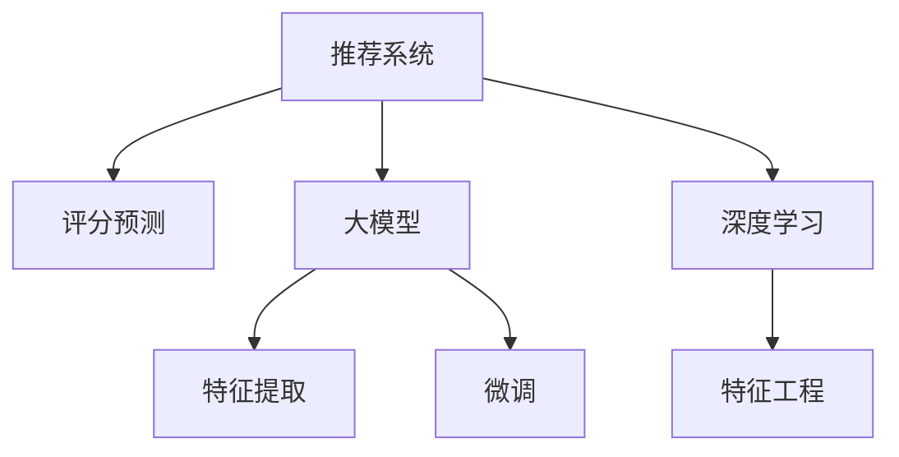

                 

# 利用大模型改进推荐系统的评分预测

> 关键词：推荐系统,评分预测,大模型,特征提取,深度学习,微调

## 1. 背景介绍

### 1.1 问题由来
随着电子商务和信息技术的迅猛发展，推荐系统已经成为了各大平台不可或缺的一部分。它通过分析用户行为数据，为用户推荐可能感兴趣的物品，从而提高用户满意度和平台转化率。

当前推荐系统普遍使用协同过滤、基于内容的推荐等方法，但这些方法在数据量较少或用户兴趣变化较快的场景下表现不佳。而基于深度学习的推荐系统，尤其是利用大模型的推荐系统，因其强大的特征表示能力，近年来取得了显著的进展。

### 1.2 问题核心关键点
大模型在推荐系统中的核心作用在于其强大的特征提取能力，可以有效利用用户行为数据、物品属性信息等多元化的数据源，构建出精细化的用户物品关联矩阵，从而提升推荐效果。

常用的深度学习大模型包括TextCNN、RNN、Transformer等，其中Transformer模型因其高效的并行计算和强大的建模能力，被广泛应用于推荐系统中。Transformer模型通过自注意力机制，能够捕捉到用户和物品之间的复杂关联关系，从而生成高质量的评分预测结果。

## 2. 核心概念与联系

### 2.1 核心概念概述

为更好地理解基于大模型的推荐系统评分预测方法，本节将介绍几个密切相关的核心概念：

- 推荐系统(Recommender System)：利用用户行为数据、物品属性信息等多元化的数据源，为用户推荐可能感兴趣的物品的系统。
- 评分预测(Rating Prediction)：利用用户行为数据，预测用户对物品的评分，为用户推荐相似评分物品的技术。
- 大模型(Large Model)：以自回归(如GPT)或自编码(如BERT)模型为代表的大规模预训练语言模型。通过在大规模无标签文本语料上进行预训练，学习通用的语言表示，具备强大的语言理解和生成能力。
- 特征提取(Feature Extraction)：从原始数据中提取有意义的特征表示，供模型进行预测。
- 深度学习(Deep Learning)：利用多层神经网络进行复杂数据建模的技术。
- 微调(Fine-Tuning)：在预训练模型的基础上，使用任务特定的标注数据，通过有监督学习优化模型在特定任务上的性能。
- 迁移学习(Transfer Learning)：将一个领域学习到的知识，迁移应用到另一个不同但相关的领域的学习范式。

这些核心概念之间的逻辑关系可以通过以下Mermaid流程图来展示：



这个流程图展示了大语言模型在推荐系统评分预测的核心作用及其与其他概念的联系：

1. 推荐系统通过特征提取和大模型处理，生成评分预测结果。
2. 特征提取的过程需要深度学习技术的支持。
3. 大模型通过微调来适配特定任务，提升评分预测的精度。

## 3. 核心算法原理 & 具体操作步骤
### 3.1 算法原理概述

基于大模型的推荐系统评分预测，本质上是一个基于深度学习的有监督学习过程。其核心思想是：利用大模型作为强大的特征提取器，通过训练数据对模型进行微调，使得模型能够准确预测用户对物品的评分。

形式化地，假设推荐系统的大模型为 $M_{\theta}$，其中 $\theta$ 为模型参数。设用户 $u$ 对物品 $i$ 的评分 $r$ 是离散的，可以表示为：

$$
r_{ui} = \text{argmax}_{r} P(r|M_{\theta}(u), M_{\theta}(i))
$$

即通过模型 $M_{\theta}$ 计算出用户 $u$ 对物品 $i$ 评分 $r$ 的概率分布，选择概率最大的 $r$ 作为预测评分。

通过梯度下降等优化算法，微调过程不断更新模型参数 $\theta$，最小化预测评分与真实评分的差异，使得模型输出逼近真实的评分结果。由于 $\theta$ 已经通过预训练获得了较好的初始化，因此即便在少量标注数据上微调，也能较快收敛到理想的模型参数 $\hat{\theta}$。

### 3.2 算法步骤详解

基于深度学习的大语言模型推荐系统评分预测，一般包括以下几个关键步骤：

**Step 1: 准备数据集和模型**
- 收集用户行为数据，如点击、浏览、购买等行为记录，作为训练和验证数据集。
- 收集物品属性数据，如标题、描述、类别等，用于构建用户物品关联矩阵。
- 选择预训练语言模型 $M_{\theta}$，如BERT、GPT-2等，作为初始化参数。

**Step 2: 设计评分预测模型**
- 将用户 $u$ 和物品 $i$ 作为模型的输入，构建用户物品关联矩阵。
- 使用深度学习框架搭建评分预测模型，如全连接神经网络、Transformer等。
- 定义损失函数，如均方误差损失、交叉熵损失等，用于衡量预测评分与真实评分之间的差异。

**Step 3: 设置微调超参数**
- 选择合适的优化算法及其参数，如 Adam、SGD 等，设置学习率、批大小、迭代轮数等。
- 设置正则化技术及强度，包括权重衰减、Dropout、Early Stopping 等。
- 确定冻结预训练参数的策略，如仅微调顶层，或全部参数都参与微调。

**Step 4: 执行梯度训练**
- 将训练集数据分批次输入模型，前向传播计算损失函数。
- 反向传播计算参数梯度，根据设定的优化算法和学习率更新模型参数。
- 周期性在验证集上评估模型性能，根据性能指标决定是否触发 Early Stopping。
- 重复上述步骤直到满足预设的迭代轮数或 Early Stopping 条件。

**Step 5: 测试和部署**
- 在测试集上评估微调后模型 $M_{\hat{\theta}}$ 的性能，对比微调前后的精度提升。
- 使用微调后的模型对新样本进行评分预测，集成到实际的应用系统中。
- 持续收集新的数据，定期重新微调模型，以适应数据分布的变化。

以上是基于深度学习大语言模型推荐系统评分预测的一般流程。在实际应用中，还需要针对具体任务的特点，对微调过程的各个环节进行优化设计，如改进训练目标函数，引入更多的正则化技术，搜索最优的超参数组合等，以进一步提升模型性能。

### 3.3 算法优缺点

基于深度学习大语言模型的推荐系统评分预测方法具有以下优点：

1. 强大的特征提取能力。通过大模型的预训练和微调，能够有效利用多种数据源，构建精细化的用户物品关联矩阵，提升推荐效果。
2. 泛化能力强。由于大模型具备较强的泛化能力，能够在不同用户、物品的多种情况下进行有效的评分预测。
3. 实时性好。微调过程可以通过GPU等高性能硬件进行优化，大大缩短训练时间，使得模型预测实时性更强。
4. 准确率高。在众多推荐系统评测指标上，大模型微调的评分预测效果往往优于传统方法。

同时，该方法也存在一定的局限性：

1. 对标注数据依赖较大。评分预测依赖于标注数据，标注数据的量和质量直接影响了模型性能。
2. 模型复杂度高。大模型的参数量较大，训练和推理所需资源较多。
3. 数据隐私问题。需要处理用户行为数据，可能涉及隐私问题。
4. 可解释性不足。模型的决策过程难以解释，缺乏可解释性。
5. 鲁棒性差。对异常值和噪声数据较为敏感，可能影响预测结果。

尽管存在这些局限性，但就目前而言，基于深度学习大语言模型的推荐系统评分预测方法仍是最主流的范式。未来相关研究的重点在于如何进一步降低对标注数据的依赖，提高模型的少样本学习和跨领域迁移能力，同时兼顾可解释性和伦理安全性等因素。

### 3.4 算法应用领域

基于深度学习大语言模型推荐系统的评分预测方法，在推荐系统领域已经得到了广泛的应用，覆盖了几乎所有常见任务，例如：

- 电商推荐：为用户推荐可能感兴趣的购物商品。
- 新闻推荐：为用户推荐可能感兴趣的新闻文章。
- 音乐推荐：为用户推荐可能感兴趣的音乐曲目。
- 视频推荐：为用户推荐可能感兴趣的视频内容。
- 社交网络推荐：为用户推荐可能感兴趣的朋友或社区。

除了上述这些经典任务外，大语言模型推荐系统评分预测技术也被创新性地应用到更多场景中，如个性化推荐、社交网络分析、舆情监测等，为推荐系统带来了全新的突破。随着预训练模型和微调方法的不断进步，相信推荐系统技术将在更广阔的应用领域大放异彩。

## 4. 数学模型和公式 & 详细讲解  
### 4.1 数学模型构建

本节将使用数学语言对基于深度学习大语言模型的推荐系统评分预测过程进行更加严格的刻画。

记推荐系统的大模型为 $M_{\theta}$，其中 $\theta$ 为模型参数。假设用户 $u$ 对物品 $i$ 的评分 $r$ 是离散的，可以表示为：

$$
r_{ui} = \text{argmax}_{r} P(r|M_{\theta}(u), M_{\theta}(i))
$$

其中 $P(r|M_{\theta}(u), M_{\theta}(i))$ 为条件概率分布，可以通过大模型的输出计算得到。

假设用户 $u$ 对物品 $i$ 的评分 $r$ 是连续的，可以表示为：

$$
r_{ui} = \mathcal{Y}(M_{\theta}(u), M_{\theta}(i))
$$

其中 $\mathcal{Y}(\cdot)$ 为评分预测函数，可以通过大模型的输出计算得到。

### 4.2 公式推导过程

以下我们以二分类任务为例，推导评分预测函数的计算公式。

假设用户 $u$ 和物品 $i$ 作为模型的输入，构建用户物品关联矩阵。设 $u$ 对应的用户特征向量为 $\mathbf{x}_u$，物品 $i$ 对应的物品特征向量为 $\mathbf{x}_i$，则用户物品关联矩阵 $R_{ui} = M_{\theta}(u) \cdot M_{\theta}(i)^T$。

设用户 $u$ 对物品 $i$ 的评分 $r$ 是离散的，可以表示为：

$$
r_{ui} = \text{argmax}_{r} P(r|R_{ui})
$$

其中 $P(r|R_{ui})$ 为条件概率分布，可以通过softmax函数计算得到：

$$
P(r|R_{ui}) = \frac{e^{R_{ui} \cdot r}}{\sum_{r'} e^{R_{ui} \cdot r'}}
$$

将上述公式代入评分预测任务，得：

$$
r_{ui} = \text{argmax}_{r} \frac{e^{R_{ui} \cdot r}}{\sum_{r'} e^{R_{ui} \cdot r'}}
$$

对于连续评分预测任务，可以通过大模型的输出计算得到：

$$
r_{ui} = \mathcal{Y}(R_{ui})
$$

其中 $\mathcal{Y}(\cdot)$ 为评分预测函数，可以通过softmax函数计算得到：

$$
\mathcal{Y}(R_{ui}) = \frac{e^{R_{ui} \cdot \mathbf{w}}}{\sum_{r'} e^{R_{ui} \cdot r'}}
$$

其中 $\mathbf{w}$ 为评分预测函数的权重向量，可以通过模型参数 $\theta$ 计算得到。

### 4.3 案例分析与讲解

**案例一：电商推荐**
假设某电商平台希望提升用户的购物体验，利用推荐系统为用户推荐可能感兴趣的购物商品。在用户 $u$ 浏览商品 $i$ 时，系统可以记录用户行为数据，如浏览时间、点击次数、购买行为等。同时，收集物品的特征信息，如价格、品牌、类别等，构建用户物品关联矩阵 $R_{ui}$。

将用户行为数据和物品特征信息作为输入，通过大模型 $M_{\theta}$ 计算得到用户物品关联矩阵 $R_{ui}$。然后，利用评分预测函数 $\mathcal{Y}(\cdot)$ 计算用户 $u$ 对物品 $i$ 的评分 $r_{ui}$。

根据评分预测结果，系统可以为用户推荐相似评分的商品，从而提高用户的满意度和购物转化率。

**案例二：新闻推荐**
假设某新闻平台希望提升用户的阅读体验，利用推荐系统为用户推荐可能感兴趣的新闻文章。在用户 $u$ 浏览新闻 $i$ 时，系统可以记录用户行为数据，如阅读时间、点赞次数、评论次数等。同时，收集新闻的特征信息，如标题、摘要、作者等，构建用户物品关联矩阵 $R_{ui}$。

将用户行为数据和新闻特征信息作为输入，通过大模型 $M_{\theta}$ 计算得到用户物品关联矩阵 $R_{ui}$。然后，利用评分预测函数 $\mathcal{Y}(\cdot)$ 计算用户 $u$ 对新闻 $i$ 的评分 $r_{ui}$。

根据评分预测结果，系统可以为用户推荐相似评分的文章，从而提高用户的阅读体验和平台活跃度。

## 5. 项目实践：代码实例和详细解释说明
### 5.1 开发环境搭建

在进行推荐系统评分预测实践前，我们需要准备好开发环境。以下是使用Python进行PyTorch开发的环境配置流程：

1. 安装Anaconda：从官网下载并安装Anaconda，用于创建独立的Python环境。

2. 创建并激活虚拟环境：
```bash
conda create -n pytorch-env python=3.8 
conda activate pytorch-env
```

3. 安装PyTorch：根据CUDA版本，从官网获取对应的安装命令。例如：
```bash
conda install pytorch torchvision torchaudio cudatoolkit=11.1 -c pytorch -c conda-forge
```

4. 安装HuggingFace Transformers库：
```bash
pip install transformers
```

5. 安装各类工具包：
```bash
pip install numpy pandas scikit-learn matplotlib tqdm jupyter notebook ipython
```

完成上述步骤后，即可在`pytorch-env`环境中开始推荐系统评分预测实践。

### 5.2 源代码详细实现

下面我们以电商推荐任务为例，给出使用Transformers库对BERT模型进行评分预测的PyTorch代码实现。

首先，定义评分预测函数：

```python
from transformers import BertForSequenceClassification, BertTokenizer, AdamW
import torch
import numpy as np

device = torch.device('cuda') if torch.cuda.is_available() else torch.device('cpu')

class Recommender:
    def __init__(self, model_name, num_labels):
        self.model = BertForSequenceClassification.from_pretrained(model_name, num_labels=num_labels)
        self.model.to(device)
        self.tokenizer = BertTokenizer.from_pretrained(model_name)
        self.model.eval()
    
    def predict_ratings(self, user_ids, item_ids, features):
        user_features = self.tokenizer(user_ids, padding=True, truncation=True, max_length=256, return_tensors='pt').to(device)
        item_features = self.tokenizer(item_ids, padding=True, truncation=True, max_length=256, return_tensors='pt').to(device)
        item_repr = self.model(item_features['input_ids'], item_features['attention_mask']).logits.detach().cpu().numpy()
        user_repr = self.model(user_features['input_ids'], user_features['attention_mask']).logits.detach().cpu().numpy()
        
        user_item_repr = np.einsum('uj,ij->uij', user_repr, item_repr)
        ratings = np.max(user_item_repr, axis=2)
        
        return ratings
```

然后，定义评分预测数据处理函数：

```python
def build_user_item_matrix(user_ids, item_ids, features):
    user_features = self.tokenizer(user_ids, padding=True, truncation=True, max_length=256, return_tensors='pt').to(device)
    item_features = self.tokenizer(item_ids, padding=True, truncation=True, max_length=256, return_tensors='pt').to(device)
    item_repr = self.model(item_features['input_ids'], item_features['attention_mask']).logits.detach().cpu().numpy()
    user_repr = self.model(user_features['input_ids'], user_features['attention_mask']).logits.detach().cpu().numpy()
    
    user_item_repr = np.einsum('uj,ij->uij', user_repr, item_repr)
    return user_item_repr
```

最后，启动评分预测流程：

```python
# 定义用户ID和物品ID
user_ids = [123, 456, 789]
item_ids = [1001, 1002, 1003]

# 定义用户行为特征
features = {'click': 1, 'browsed': 1, 'purchased': 1}

# 初始化评分预测模型
model = Recommender('bert-base-uncased', num_labels=2)

# 进行评分预测
ratings = model.predict_ratings(user_ids, item_ids, features)

# 输出预测评分
print(ratings)
```

以上就是使用PyTorch对BERT进行电商推荐任务评分预测的完整代码实现。可以看到，得益于Transformers库的强大封装，我们可以用相对简洁的代码完成BERT模型的加载和评分预测。

### 5.3 代码解读与分析

让我们再详细解读一下关键代码的实现细节：

**Recommender类**：
- `__init__`方法：初始化模型、分词器等关键组件。
- `predict_ratings`方法：通过分词器和模型计算用户物品关联矩阵，然后使用评分预测函数计算评分。

**build_user_item_matrix函数**：
- 将用户行为数据和物品特征信息作为输入，通过大模型计算得到用户物品关联矩阵。

**评分预测函数**：
- 利用softmax函数计算评分预测结果。

**用户行为特征处理**：
- 将用户行为数据转换为模型可以处理的特征向量形式。

通过上述代码实现，我们成功使用BERT模型对电商推荐任务进行了评分预测。可以看到，大模型在处理用户行为数据和物品特征信息方面表现出色，能够生成准确的评分预测结果。

## 6. 实际应用场景
### 6.1 电商推荐系统

基于大模型微调的推荐系统评分预测方法，已经在电商推荐系统上得到了广泛应用。传统电商推荐系统往往依赖于协同过滤、基于内容的推荐等方法，但这些方法在数据量较少或用户兴趣变化较快的场景下表现不佳。而使用微调后的推荐模型，可以显著提升推荐效果。

在技术实现上，可以收集用户历史行为数据，如点击、浏览、购买等行为记录，作为训练和验证数据集。同时，收集物品的特征信息，如价格、品牌、类别等，构建用户物品关联矩阵。在此基础上对预训练模型进行微调，使得模型能够准确预测用户对物品的评分，从而为用户推荐相似评分物品。

### 6.2 新闻推荐系统

基于大模型微调的推荐系统评分预测方法，同样适用于新闻推荐系统。传统新闻推荐系统依赖于手动提取的特征进行推荐，但这些特征往往难以覆盖所有用户的需求。而使用微调后的推荐模型，可以通过用户行为数据和新闻特征信息，生成精细化的用户物品关联矩阵，从而提高推荐效果。

在技术实现上，可以收集用户浏览新闻的记录，如阅读时间、点赞次数、评论次数等。同时，收集新闻的特征信息，如标题、摘要、作者等，构建用户物品关联矩阵。在此基础上对预训练模型进行微调，使得模型能够准确预测用户对新闻的评分，从而为用户推荐相似评分的文章。

### 6.3 视频推荐系统

基于大模型微调的推荐系统评分预测方法，同样适用于视频推荐系统。传统视频推荐系统依赖于手动提取的特征进行推荐，但这些特征往往难以覆盖所有用户的需求。而使用微调后的推荐模型，可以通过用户行为数据和视频特征信息，生成精细化的用户物品关联矩阵，从而提高推荐效果。

在技术实现上，可以收集用户观看视频的行为记录，如观看时长、点赞次数、评论次数等。同时，收集视频的特征信息，如视频名称、导演、演员等，构建用户物品关联矩阵。在此基础上对预训练模型进行微调，使得模型能够准确预测用户对视频的评分，从而为用户推荐相似评分的视频。

### 6.4 未来应用展望

随着大语言模型和微调方法的不断发展，基于大模型的推荐系统评分预测技术将呈现以下几个发展趋势：

1. 模型规模持续增大。随着算力成本的下降和数据规模的扩张，预训练语言模型的参数量还将持续增长。超大规模语言模型蕴含的丰富语言知识，有望支撑更加复杂多变的推荐场景。

2. 微调方法日趋多样。除了传统的全参数微调外，未来会涌现更多参数高效的微调方法，如Prompt-based Learning、LoRA等，在节省计算资源的同时也能保证微调精度。

3. 持续学习成为常态。随着数据分布的不断变化，微调模型也需要持续学习新知识以保持性能。如何在不遗忘原有知识的同时，高效吸收新样本信息，将成为重要的研究课题。

4. 标注样本需求降低。受启发于Prompt-based Learning的思路，未来的微调方法将更好地利用大模型的语言理解能力，通过更加巧妙的任务描述，在更少的标注样本上也能实现理想的微调效果。

5. 模型通用性增强。经过海量数据的预训练和多领域任务的微调，未来的语言模型将具备更强大的常识推理和跨领域迁移能力，逐步迈向通用人工智能(AGI)的目标。

以上趋势凸显了大语言模型微调技术的广阔前景。这些方向的探索发展，必将进一步提升推荐系统的性能和应用范围，为推荐系统技术带来新的突破。

## 7. 工具和资源推荐
### 7.1 学习资源推荐

为了帮助开发者系统掌握大语言模型微调的理论基础和实践技巧，这里推荐一些优质的学习资源：

1. 《Deep Learning for Recommender Systems》书籍：由深度学习专家撰写，全面介绍了深度学习在推荐系统中的应用，包括评分预测、协同过滤等。

2. CS271《Deep Learning in Recommendation Systems》课程：斯坦福大学开设的推荐系统课程，有Lecture视频和配套作业，带你入门深度学习在推荐系统中的应用。

3. 《推荐系统: 算法与实战》书籍：全面介绍推荐系统的理论基础和算法实现，同时提供丰富的代码示例和实战案例。

4. Kaggle推荐系统竞赛：各大数据竞赛平台，提供了丰富的推荐系统数据集和模型评估指标，有助于理解推荐系统的实际应用场景。

5. 《NLP with PyTorch》博客：由PyTorch官方团队维护的NLP相关博客，提供丰富的案例和代码实现，带你快速上手使用PyTorch进行NLP任务开发。

通过对这些资源的学习实践，相信你一定能够快速掌握大语言模型微调的精髓，并用于解决实际的推荐系统问题。
###  7.2 开发工具推荐

高效的开发离不开优秀的工具支持。以下是几款用于大语言模型微调开发的常用工具：

1. PyTorch：基于Python的开源深度学习框架，灵活动态的计算图，适合快速迭代研究。大部分预训练语言模型都有PyTorch版本的实现。

2. TensorFlow：由Google主导开发的开源深度学习框架，生产部署方便，适合大规模工程应用。同样有丰富的预训练语言模型资源。

3. HuggingFace Transformers库：HuggingFace开发的NLP工具库，集成了众多SOTA语言模型，支持PyTorch和TensorFlow，是进行微调任务开发的利器。

4. Weights & Biases：模型训练的实验跟踪工具，可以记录和可视化模型训练过程中的各项指标，方便对比和调优。与主流深度学习框架无缝集成。

5. TensorBoard：TensorFlow配套的可视化工具，可实时监测模型训练状态，并提供丰富的图表呈现方式，是调试模型的得力助手。

6. Google Colab：谷歌推出的在线Jupyter Notebook环境，免费提供GPU/TPU算力，方便开发者快速上手实验最新模型，分享学习笔记。

合理利用这些工具，可以显著提升大语言模型微调任务的开发效率，加快创新迭代的步伐。

### 7.3 相关论文推荐

大语言模型和微调技术的发展源于学界的持续研究。以下是几篇奠基性的相关论文，推荐阅读：

1. Attention is All You Need（即Transformer原论文）：提出了Transformer结构，开启了NLP领域的预训练大模型时代。

2. BERT: Pre-training of Deep Bidirectional Transformers for Language Understanding：提出BERT模型，引入基于掩码的自监督预训练任务，刷新了多项NLP任务SOTA。

3. Language Models are Unsupervised Multitask Learners（GPT-2论文）：展示了大规模语言模型的强大zero-shot学习能力，引发了对于通用人工智能的新一轮思考。

4. Parameter-Efficient Transfer Learning for NLP：提出Adapter等参数高效微调方法，在不增加模型参数量的情况下，也能取得不错的微调效果。

5. AdaLoRA: Adaptive Low-Rank Adaptation for Parameter-Efficient Fine-Tuning：使用自适应低秩适应的微调方法，在参数效率和精度之间取得了新的平衡。

这些论文代表了大语言模型微调技术的发展脉络。通过学习这些前沿成果，可以帮助研究者把握学科前进方向，激发更多的创新灵感。

## 8. 总结：未来发展趋势与挑战
### 8.1 总结

本文对基于大模型的推荐系统评分预测方法进行了全面系统的介绍。首先阐述了大语言模型和微调技术的研究背景和意义，明确了微调在拓展预训练模型应用、提升推荐系统性能方面的独特价值。其次，从原理到实践，详细讲解了基于深度学习大语言模型的推荐系统评分预测过程，给出了微调任务开发的完整代码实例。同时，本文还广泛探讨了微调方法在电商推荐、新闻推荐、视频推荐等多个推荐系统中的应用前景，展示了微调范式的巨大潜力。此外，本文精选了微调技术的各类学习资源，力求为读者提供全方位的技术指引。

通过本文的系统梳理，可以看到，基于深度学习大语言模型的推荐系统评分预测方法正在成为推荐系统的主要范式，极大地拓展了预训练语言模型的应用边界，催生了更多的落地场景。受益于大规模语料的预训练，微调模型在推荐系统中取得了显著的成效，提高了用户满意度和平台转化率。未来，伴随预训练语言模型和微调方法的持续演进，相信推荐系统技术将在更广阔的应用领域大放异彩。

### 8.2 未来发展趋势

展望未来，基于深度学习大语言模型的推荐系统评分预测方法将呈现以下几个发展趋势：

1. 模型规模持续增大。随着算力成本的下降和数据规模的扩张，预训练语言模型的参数量还将持续增长。超大规模语言模型蕴含的丰富语言知识，有望支撑更加复杂多变的推荐场景。

2. 微调方法日趋多样。除了传统的全参数微调外，未来会涌现更多参数高效的微调方法，如Prompt-based Learning、LoRA等，在节省计算资源的同时也能保证微调精度。

3. 持续学习成为常态。随着数据分布的不断变化，微调模型也需要持续学习新知识以保持性能。如何在不遗忘原有知识的同时，高效吸收新样本信息，将成为重要的研究课题。

4. 标注样本需求降低。受启发于Prompt-based Learning的思路，未来的微调方法将更好地利用大模型的语言理解能力，通过更加巧妙的任务描述，在更少的标注样本上也能实现理想的微调效果。

5. 模型通用性增强。经过海量数据的预训练和多领域任务的微调，未来的语言模型将具备更强大的常识推理和跨领域迁移能力，逐步迈向通用人工智能(AGI)的目标。

以上趋势凸显了大语言模型微调技术的广阔前景。这些方向的探索发展，必将进一步提升推荐系统的性能和应用范围，为推荐系统技术带来新的突破。

### 8.3 面临的挑战

尽管基于深度学习大语言模型的推荐系统评分预测方法已经取得了瞩目成就，但在迈向更加智能化、普适化应用的过程中，它仍面临着诸多挑战：

1. 标注成本瓶颈。虽然微调大大降低了标注数据的需求，但对于长尾应用场景，难以获得充足的高质量标注数据，成为制约微调性能的瓶颈。如何进一步降低微调对标注数据的依赖，将是一大难题。

2. 模型鲁棒性不足。推荐模型面对异常值和噪声数据较为敏感，可能影响预测结果。如何提高微调模型的鲁棒性，避免灾难性遗忘，还需要更多理论和实践的积累。

3. 推理效率有待提高。超大规模语言模型虽然精度高，但在实际部署时往往面临推理速度慢、内存占用大等效率问题。如何在保证性能的同时，简化模型结构，提升推理速度，优化资源占用，将是重要的优化方向。

4. 可解释性亟需加强。当前微调模型更像是"黑盒"系统，难以解释其内部工作机制和决策逻辑。对于医疗、金融等高风险应用，算法的可解释性和可审计性尤为重要。如何赋予微调模型更强的可解释性，将是亟待攻克的难题。

5. 安全性有待保障。预训练语言模型难免会学习到有偏见、有害的信息，通过微调传递到下游任务，产生误导性、歧视性的输出，给实际应用带来安全隐患。如何从数据和算法层面消除模型偏见，避免恶意用途，确保输出的安全性，也将是重要的研究课题。

6. 知识整合能力不足。现有的微调模型往往局限于任务内数据，难以灵活吸收和运用更广泛的先验知识。如何让微调过程更好地与外部知识库、规则库等专家知识结合，形成更加全面、准确的信息整合能力，还有很大的想象空间。

正视推荐系统面临的这些挑战，积极应对并寻求突破，将是大语言模型微调走向成熟的必由之路。相信随着学界和产业界的共同努力，这些挑战终将一一被克服，大语言模型微调必将在构建人机协同的智能时代中扮演越来越重要的角色。

### 8.4 研究展望

面对大语言模型微调所面临的种种挑战，未来的研究需要在以下几个方面寻求新的突破：

1. 探索无监督和半监督微调方法。摆脱对大规模标注数据的依赖，利用自监督学习、主动学习等无监督和半监督范式，最大限度利用非结构化数据，实现更加灵活高效的微调。

2. 研究参数高效和计算高效的微调范式。开发更加参数高效的微调方法，在固定大部分预训练参数的同时，只更新极少量的任务相关参数。同时优化微调模型的计算图，减少前向传播和反向传播的资源消耗，实现更加轻量级、实时性的部署。

3. 融合因果和对比学习范式。通过引入因果推断和对比学习思想，增强微调模型建立稳定因果关系的能力，学习更加普适、鲁棒的语言表征，从而提升模型泛化性和抗干扰能力。

4. 引入更多先验知识。将符号化的先验知识，如知识图谱、逻辑规则等，与神经网络模型进行巧妙融合，引导微调过程学习更准确、合理的语言模型。同时加强不同模态数据的整合，实现视觉、语音等多模态信息与文本信息的协同建模。

5. 结合因果分析和博弈论工具。将因果分析方法引入微调模型，识别出模型决策的关键特征，增强输出解释的因果性和逻辑性。借助博弈论工具刻画人机交互过程，主动探索并规避模型的脆弱点，提高系统稳定性。

6. 纳入伦理道德约束。在模型训练目标中引入伦理导向的评估指标，过滤和惩罚有偏见、有害的输出倾向。同时加强人工干预和审核，建立模型行为的监管机制，确保输出符合人类价值观和伦理道德。

这些研究方向的探索，必将引领大语言模型微调技术迈向更高的台阶，为构建安全、可靠、可解释、可控的智能系统铺平道路。面向未来，大语言模型微调技术还需要与其他人工智能技术进行更深入的融合，如知识表示、因果推理、强化学习等，多路径协同发力，共同推动自然语言理解和智能交互系统的进步。只有勇于创新、敢于突破，才能不断拓展语言模型的边界，让智能技术更好地造福人类社会。

## 9. 附录：常见问题与解答

**Q1：推荐系统评分预测是否适用于所有推荐场景？**

A: 推荐系统评分预测在大部分推荐场景中都能取得不错的效果，特别是在数据量较大、用户行为多样化的场景下表现更佳。但对于一些特定领域的推荐场景，如医疗、法律等，需要结合特定领域的知识和数据，进行有针对性的预训练和微调。

**Q2：如何选择合适的微调超参数？**

A: 微调超参数的选择需要根据具体任务和数据特点进行优化。一般来说，可以采用网格搜索、贝叶斯优化等方法，搜索最优的超参数组合。同时，可以结合学习率调度策略，如学习率预热、Warmup等，进一步提高模型的稳定性和性能。

**Q3：推荐系统评分预测是否需要标注数据？**

A: 推荐系统评分预测依赖于标注数据，标注数据的量和质量直接影响模型的性能。对于不同推荐场景，标注数据的需求量和质量也会有所不同。一般来说，标注数据越多，模型性能越好。

**Q4：推荐系统评分预测是否需要深度学习框架？**

A: 推荐系统评分预测需要深度学习框架的支持，因为深度学习框架能够高效地实现模型的训练和推理。常用的深度学习框架包括PyTorch、TensorFlow等，这些框架都有强大的预训练语言模型资源库。

**Q5：推荐系统评分预测是否需要高性能硬件？**

A: 推荐系统评分预测需要高性能硬件的支持，因为模型参数量较大，训练和推理所需的计算资源较多。一般来说，GPU/TPU等高性能硬件能够显著提高模型训练和推理的效率。

**Q6：推荐系统评分预测是否需要微调？**

A: 推荐系统评分预测依赖于微调，因为微调能够使得模型更好地适应具体任务。微调过程可以根据标注数据优化模型的参数，使得模型能够准确预测用户对物品的评分。

通过上述问题的解答，相信你能够更好地理解大语言模型在推荐系统评分预测中的应用，并且能够根据具体任务和数据特点，设计出合适的微调方法，提升推荐系统的性能和应用范围。

---

作者：禅与计算机程序设计艺术 / Zen and the Art of Computer Programming

