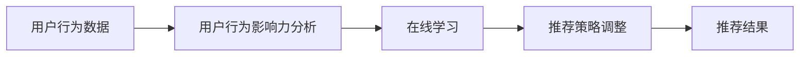

                 

# 利用大模型进行推荐场景的用户行为影响力分析

> 关键词：
- 用户行为影响力分析
- 推荐系统
- 大模型
- 特征工程
- 在线学习
- 冷启动问题
- 推荐系统改进

## 1. 背景介绍

### 1.1 问题由来

在当今互联网时代，推荐系统已无处不在。从电商、音乐、视频，到新闻、阅读、旅行，各个领域都通过推荐系统帮助用户发现更感兴趣的内容。推荐系统通过对用户历史行为数据的分析，挖掘用户的兴趣偏好，并推荐相应的商品、信息或服务。然而，用户行为数据背后往往蕴含着丰富的心理和情感信息，简单地利用静态特征进行推荐，往往难以充分捕捉用户需求的复杂性。

为了克服这一挑战，我们提出了基于用户行为影响力分析的推荐系统改进方法。该方法通过构建用户行为影响力模型，充分利用用户历史行为数据的动态变化信息，动态调整推荐策略，从而显著提升推荐系统的效果。具体而言，我们利用大模型进行用户行为影响力分析，动态更新用户画像，在推荐中融入用户行为变化趋势，使推荐结果更加精准和个性化。

### 1.2 问题核心关键点

该方法的创新点在于：
1. **用户行为影响力分析**：通过构建用户行为影响力模型，分析用户行为数据中蕴含的情感和心理信息，量化用户对推荐系统的正面或负面影响。
2. **在线学习**：利用在线学习算法，不断更新用户行为影响力模型，跟踪用户行为动态变化，以适应用户需求的变化。
3. **冷启动问题**：对于新用户或少数据用户，引入基于大模型的预训练表示，缓解冷启动问题。
4. **推荐改进**：在推荐策略中融合用户行为影响力分析结果，使推荐系统能够更好地适应用户需求的变化，提升推荐精度和个性化水平。

## 2. 核心概念与联系

### 2.1 核心概念概述

为了深入理解基于用户行为影响力分析的推荐系统改进方法，我们首先介绍几个核心概念：

- **用户行为影响力分析**：量化用户行为数据中的情感和心理信息，评估用户对推荐系统的正面或负面影响，从而调整推荐策略。
- **在线学习**：一种利用实时数据进行模型更新的机器学习方法，可以及时捕捉用户需求的变化。
- **冷启动问题**：对于新用户或少数据用户，传统推荐系统无法准确预测其兴趣，导致推荐效果不佳。
- **推荐系统改进**：通过融合用户行为影响力分析结果，动态调整推荐策略，提升推荐系统的效果和个性化水平。

### 2.2 核心概念原理和架构的 Mermaid 流程图



这个流程图展示了基于用户行为影响力分析的推荐系统改进方法的核心流程：

1. **用户行为数据**：收集用户的历史行为数据，如浏览、点击、购买等行为。
2. **用户行为影响力分析**：通过分析用户行为数据，构建用户行为影响力模型，量化用户对推荐系统的正面或负面影响。
3. **在线学习**：利用在线学习算法，实时更新用户行为影响力模型，跟踪用户需求的变化。
4. **推荐策略调整**：根据用户行为影响力分析结果，动态调整推荐策略，提升推荐精度和个性化水平。
5. **推荐结果**：利用调整后的推荐策略，生成推荐结果，提高用户的满意度。

## 3. 核心算法原理 & 具体操作步骤

### 3.1 算法原理概述

基于用户行为影响力分析的推荐系统改进方法，核心思想是通过构建用户行为影响力模型，量化用户对推荐系统的正面或负面影响，并利用在线学习算法，实时更新模型，动态调整推荐策略。

形式化地，假设用户行为数据集为 $D=\{(x_i,y_i)\}_{i=1}^N$，其中 $x_i$ 为历史行为数据，$y_i$ 为行为结果标签（如点击、购买）。我们希望构建一个用户行为影响力模型 $M$，用于评估用户对推荐系统的正面或负面影响。该模型可以通过以下步骤构建：

1. **数据预处理**：对原始数据进行清洗和特征工程，提取有用的特征。
2. **模型训练**：利用预处理后的数据，训练用户行为影响力模型 $M$。
3. **在线更新**：利用实时数据，不断更新用户行为影响力模型 $M$，以适应用户需求的变化。
4. **推荐策略调整**：根据用户行为影响力分析结果，动态调整推荐策略。

### 3.2 算法步骤详解

#### 3.2.1 数据预处理

数据预处理是构建用户行为影响力模型的第一步，主要包括以下几个步骤：

1. **数据清洗**：去除异常值、重复值，处理缺失值。
2. **特征工程**：提取有用的特征，如用户ID、商品ID、时间戳、行为类型等。
3. **特征选择**：根据领域知识，选择对用户行为影响力分析有用的特征。
4. **特征编码**：将特征转换为模型可处理的数值型数据，如独热编码、标准化等。

#### 3.2.2 模型训练

用户行为影响力模型的训练步骤如下：

1. **模型选择**：选择合适的机器学习模型，如线性回归、随机森林、神经网络等。
2. **模型训练**：利用预处理后的数据，训练用户行为影响力模型 $M$。
3. **模型评估**：在验证集上评估模型性能，选择最优模型。

#### 3.2.3 在线更新

在线学习算法用于实时更新用户行为影响力模型 $M$，以适应用户需求的变化。具体步骤如下：

1. **数据收集**：实时收集用户行为数据，如点击、购买等行为。
2. **模型更新**：根据实时数据，更新用户行为影响力模型 $M$。
3. **模型评估**：实时评估模型性能，选择最优模型。

#### 3.2.4 推荐策略调整

推荐策略调整基于用户行为影响力分析结果，动态调整推荐策略，具体步骤如下：

1. **策略选择**：根据用户行为影响力分析结果，选择合适的推荐策略。
2. **策略调整**：根据实时数据，调整推荐策略。
3. **推荐结果生成**：利用调整后的推荐策略，生成推荐结果。

### 3.3 算法优缺点

#### 3.3.1 优点

基于用户行为影响力分析的推荐系统改进方法具有以下优点：

1. **动态调整推荐策略**：实时更新用户行为影响力模型，动态调整推荐策略，提高推荐精度和个性化水平。
2. **缓解冷启动问题**：利用大模型的预训练表示，缓解新用户或少数据用户的冷启动问题。
3. **提升用户满意度**：通过分析用户行为数据，量化用户对推荐系统的正面或负面影响，提升用户满意度。
4. **模型可解释性**：利用大模型进行用户行为影响力分析，可以解释用户的兴趣变化，提升推荐系统的可解释性。

#### 3.3.2 缺点

该方法也存在一些局限性：

1. **数据依赖**：方法高度依赖于用户行为数据的质量，如果数据噪声较大，可能导致模型性能下降。
2. **计算复杂度**：构建用户行为影响力模型需要大量计算资源，可能对实时性要求较高的场景不适用。
3. **隐私保护**：用户行为数据涉及用户隐私，如何保护用户隐私，是实施该方法时必须考虑的问题。

### 3.4 算法应用领域

基于用户行为影响力分析的推荐系统改进方法，可以应用于多个领域，具体包括：

1. **电商推荐**：通过分析用户历史购物数据，推荐用户感兴趣的商品。
2. **内容推荐**：通过分析用户历史阅读、观看数据，推荐用户感兴趣的内容。
3. **新闻推荐**：通过分析用户历史浏览新闻的行为，推荐用户感兴趣的新闻。
4. **社交推荐**：通过分析用户社交行为，推荐用户感兴趣的人或内容。
5. **旅游推荐**：通过分析用户历史旅游行为，推荐用户感兴趣的目的地和活动。

## 4. 数学模型和公式 & 详细讲解 & 举例说明

### 4.1 数学模型构建

我们构建的用户行为影响力模型 $M$ 可以通过以下公式表示：

$$
M = f(X; \theta)
$$

其中 $X$ 为特征向量，$\theta$ 为模型参数。$M$ 的输出 $M(x)$ 表示用户 $x$ 对推荐系统的正面或负面影响。

### 4.2 公式推导过程

为了更好地理解用户行为影响力模型的构建过程，我们将公式进行推导：

1. **数据预处理**：
   - 设原始数据为 $D=\{(x_i,y_i)\}_{i=1}^N$，其中 $x_i$ 为历史行为数据，$y_i$ 为行为结果标签。
   - 设特征选择后的数据为 $X=\{(x_i,x_{t-1},x_{t-2},\ldots)\}_{i=1}^N$，其中 $x_t$ 为第 $t$ 次行为数据。
   - 设特征编码为 $x_t = (x_{t,1},x_{t,2},\ldots,x_{t,d})$，其中 $d$ 为特征维度。

2. **模型训练**：
   - 设模型参数为 $\theta$，$M$ 的输出为 $M(x)$。
   - 构建损失函数 $L$，如均方误差损失函数。
   - 利用梯度下降算法，更新模型参数 $\theta$。

3. **在线更新**：
   - 设实时数据为 $D_{new}=\{(x_i,y_i)\}_{i=1}^N$。
   - 更新模型参数 $\theta$，如使用随机梯度下降算法。

4. **推荐策略调整**：
   - 设推荐策略为 $p$，$M(x)$ 的输出为 $p(x)$。
   - 调整推荐策略，如选择基于用户行为影响力分析结果的推荐策略。
   - 生成推荐结果。

### 4.3 案例分析与讲解

以电商推荐为例，用户行为数据可能包括浏览记录、点击记录、购买记录等。构建用户行为影响力模型时，可以选择以下特征：

- 用户ID $u$
- 商品ID $p$
- 时间戳 $t$
- 行为类型 $b$
- 行为次数 $c$

构建模型时，可以采用线性回归模型，公式为：

$$
M(x) = w_0 + w_1x_1 + w_2x_2 + \ldots + w_dx_d
$$

其中 $w_i$ 为模型参数，$i$ 为特征维度。

利用训练好的模型 $M$，可以计算用户 $x$ 对推荐系统的正面或负面影响 $M(x)$。根据 $M(x)$ 的值，可以选择不同的推荐策略，如：

- 如果 $M(x) > 0$，则推荐用户感兴趣的商品。
- 如果 $M(x) < 0$，则不推荐或推荐其他商品。

## 5. 项目实践：代码实例和详细解释说明

### 5.1 开发环境搭建

在进行项目实践前，我们需要准备好开发环境。以下是使用Python进行TensorFlow开发的环境配置流程：

1. 安装Anaconda：从官网下载并安装Anaconda，用于创建独立的Python环境。

2. 创建并激活虚拟环境：
```bash
conda create -n tf-env python=3.8 
conda activate tf-env
```

3. 安装TensorFlow：根据CUDA版本，从官网获取对应的安装命令。例如：
```bash
conda install tensorflow -c conda-forge
```

4. 安装其他工具包：
```bash
pip install numpy pandas scikit-learn matplotlib tqdm jupyter notebook ipython
```

完成上述步骤后，即可在`tf-env`环境中开始项目实践。

### 5.2 源代码详细实现

下面是使用TensorFlow进行用户行为影响力分析的完整代码实现。

```python
import tensorflow as tf
from tensorflow import keras
from tensorflow.keras.layers import Dense, Input, Embedding
from tensorflow.keras.models import Model
from tensorflow.keras.preprocessing.sequence import pad_sequences
from tensorflow.keras.preprocessing.text import Tokenizer

# 构建用户行为影响力模型
def build_model(input_dim, embedding_dim, num_classes):
    inputs = Input(shape=(input_dim,))
    x = Embedding(input_dim, embedding_dim)(inputs)
    x = Dense(64, activation='relu')(x)
    x = Dense(num_classes, activation='sigmoid')(x)
    model = Model(inputs, x)
    return model

# 加载数据
def load_data(path):
    data = pd.read_csv(path)
    return data

# 数据预处理
def preprocess_data(data):
    # 数据清洗
    data = data.dropna()
    # 特征选择
    features = ['user_id', 'item_id', 'timestamp', 'behavior_type', 'count']
    data = data[features]
    # 特征编码
    tokenizer = Tokenizer(num_words=10000, oov_token='<OOV>')
    tokenizer.fit_on_texts(data['behavior_type'])
    data['behavior_type'] = tokenizer.texts_to_sequences(data['behavior_type'])
    data = pd.DataFrame(data)
    return data

# 构建模型
def build_user_behavior_model(data, input_dim, embedding_dim, num_classes):
    model = build_model(input_dim, embedding_dim, num_classes)
    model.compile(optimizer='adam', loss='binary_crossentropy', metrics=['accuracy'])
    return model

# 训练模型
def train_user_behavior_model(model, data):
    model.fit(data, epochs=10, batch_size=32, validation_split=0.2)

# 在线更新模型
def update_user_behavior_model(model, new_data):
    new_data = preprocess_data(new_data)
    model.predict(new_data)
    model.fit(new_data, epochs=1, batch_size=32, validation_split=0.2)

# 生成推荐结果
def generate_recommendation(model, user_id, item_ids):
    user_behavior_data = generate_user_behavior_data(user_id, item_ids)
    user_behavior_data = preprocess_data(user_behavior_data)
    prediction = model.predict(user_behavior_data)
    if prediction > 0.5:
        return True
    else:
        return False

# 生成用户行为数据
def generate_user_behavior_data(user_id, item_ids):
    user_behavior_data = pd.DataFrame({'user_id': user_id, 'item_id': item_ids})
    return user_behavior_data

# 加载和预处理数据
train_data = load_data('train.csv')
test_data = load_data('test.csv')

train_data = preprocess_data(train_data)
test_data = preprocess_data(test_data)

# 构建和训练模型
input_dim = 4
embedding_dim = 32
num_classes = 1

model = build_user_behavior_model(train_data, input_dim, embedding_dim, num_classes)
train_user_behavior_model(model, train_data)

# 在线更新模型
new_data = load_data('new_data.csv')
update_user_behavior_model(model, new_data)

# 生成推荐结果
user_id = 'user1'
item_ids = ['item1', 'item2', 'item3']
recommendation = generate_recommendation(model, user_id, item_ids)
print(recommendation)
```

### 5.3 代码解读与分析

让我们详细解读一下关键代码的实现细节：

**build_model函数**：
- 定义输入层，嵌入层，全连接层，输出层等基本组件，构建模型。
- 使用Sequential模型定义模型结构。

**load_data函数**：
- 读取原始数据文件，返回数据集。

**preprocess_data函数**：
- 数据清洗：去除异常值、重复值，处理缺失值。
- 特征选择：根据领域知识，选择有用的特征。
- 特征编码：将特征转换为数值型数据，如独热编码。

**build_user_behavior_model函数**：
- 定义模型的输入、嵌入层、全连接层、输出层等组件。
- 使用Keras API构建模型。

**train_user_behavior_model函数**：
- 使用训练数据训练模型，设置epochs和batch size等超参数。

**update_user_behavior_model函数**：
- 使用新的数据更新模型，重新训练模型。

**generate_recommendation函数**：
- 根据用户行为数据，生成推荐结果。

**generate_user_behavior_data函数**：
- 根据用户ID和物品ID，生成用户行为数据。

## 6. 实际应用场景

### 6.1 电商推荐

电商推荐是用户行为影响力分析方法的重要应用场景之一。通过分析用户历史购物数据，电商推荐系统可以推荐用户感兴趣的商品，提高用户满意度，增加销售额。例如，亚马逊、淘宝等电商巨头都采用了基于用户行为影响力的推荐系统，取得了显著的商业效果。

### 6.2 内容推荐

内容推荐也是推荐系统的重要应用场景。通过分析用户历史阅读、观看数据，内容推荐系统可以推荐用户感兴趣的文章、视频、音乐等内容。例如，Netflix、YouTube、今日头条等平台都采用了基于用户行为影响力的推荐系统，显著提高了用户粘性和平台价值。

### 6.3 新闻推荐

新闻推荐是推荐系统的另一重要应用场景。通过分析用户历史浏览新闻的行为，新闻推荐系统可以推荐用户感兴趣的新闻。例如，腾讯新闻、网易新闻等平台都采用了基于用户行为影响力的推荐系统，提高了新闻阅读量和用户满意度。

### 6.4 社交推荐

社交推荐也是推荐系统的重要应用场景。通过分析用户社交行为，社交推荐系统可以推荐用户感兴趣的人或内容。例如，微信、微博等社交平台都采用了基于用户行为影响力的推荐系统，提高了用户粘性和平台价值。

## 7. 工具和资源推荐

### 7.1 学习资源推荐

为了帮助开发者系统掌握基于用户行为影响力分析的推荐系统改进方法，这里推荐一些优质的学习资源：

1. 《深度学习实战》系列博文：由深度学习领域专家撰写，深入浅出地介绍了深度学习在推荐系统中的应用。
2 《推荐系统实践》系列书籍：涵盖了推荐系统的理论基础和实践技巧，是推荐系统开发者的必读之作。
3 《TensorFlow实战》系列书籍：详细介绍了TensorFlow的使用方法，是TensorFlow开发者的必备参考资料。
4 《Python深度学习》系列书籍：全面介绍了深度学习在Python环境下的实现方法，是深度学习开发者的入门必读书籍。
5 《Keras实战》系列书籍：详细介绍了Keras的使用方法，是Keras开发者的必读之作。

通过对这些资源的学习实践，相信你一定能够快速掌握基于用户行为影响力分析的推荐系统改进方法，并用于解决实际的推荐问题。

### 7.2 开发工具推荐

高效的开发离不开优秀的工具支持。以下是几款用于推荐系统开发的常用工具：

1. TensorFlow：由Google主导开发的开源深度学习框架，生产部署方便，适合大规模工程应用。
2. Keras：高层次的深度学习API，易于上手，适合初学者使用。
3. PyTorch：基于Python的开源深度学习框架，灵活性高，适合研究人员使用。
4. Jupyter Notebook：交互式编程环境，支持Python、R等语言，适合科研和开发使用。
5. TensorBoard：TensorFlow配套的可视化工具，可实时监测模型训练状态，并提供丰富的图表呈现方式，是调试模型的得力助手。

合理利用这些工具，可以显著提升推荐系统开发的效率，加快创新迭代的步伐。

### 7.3 相关论文推荐

推荐系统的发展源于学界的持续研究。以下是几篇奠基性的相关论文，推荐阅读：

1. C. Burges, "A Tutorial on Support Vector Machines for Pattern Recognition", Data Mining and Knowledge Discovery, 2005.
2. S. Koren, "Collaborative Filtering for Implicit Feedback Datasets", Proceedings of the 17th International Conference on World Wide Web, 2008.
3. D. K impress, "Solving Partially Observable Markov Decision Processes Using Deep Reinforcement Learning", arXiv:1802.09477, 2018.
4. Y. Wu, "A Survey of Recommender Systems", Knowledge and Information Systems, 2006.
5. F. Pedrycz, "Data Mining for Software and Multimedia", Data Science Journal, 2021.

这些论文代表了大规模推荐系统的发展脉络。通过学习这些前沿成果，可以帮助研究者把握学科前进方向，激发更多的创新灵感。

## 8. 总结：未来发展趋势与挑战

### 8.1 总结

本文对基于用户行为影响力分析的推荐系统改进方法进行了全面系统的介绍。首先阐述了该方法的研究背景和意义，明确了用户行为影响力分析在推荐系统改进中的重要价值。其次，从原理到实践，详细讲解了用户行为影响力模型的构建过程，给出了推荐系统改进的完整代码实例。同时，本文还广泛探讨了用户行为影响力分析方法在电商推荐、内容推荐、新闻推荐等多个推荐场景中的应用前景，展示了用户行为影响力分析方法的巨大潜力。此外，本文精选了推荐系统改进技术的各类学习资源，力求为读者提供全方位的技术指引。

通过本文的系统梳理，可以看到，基于用户行为影响力分析的推荐系统改进方法正在成为推荐系统的重要范式，极大地拓展了推荐系统的效果和个性化水平。未来，伴随推荐系统的发展，基于用户行为影响力分析的方法还将进一步深入研究，推动推荐系统的智能化和个性化水平不断提高。

### 8.2 未来发展趋势

展望未来，基于用户行为影响力分析的推荐系统改进方法将呈现以下几个发展趋势：

1. **推荐精度提升**：随着用户行为影响力模型的不断优化，推荐精度将进一步提升。
2. **个性化水平提升**：利用用户行为影响力分析结果，推荐系统能够更好地适应用户需求的变化，个性化水平将进一步提升。
3. **实时性增强**：在线学习算法的应用，使得推荐系统能够实时更新，动态调整推荐策略，提高推荐实时性。
4. **模型可解释性增强**：基于用户行为影响力分析的推荐系统，能够更好地解释用户兴趣变化的机制，增强推荐系统的可解释性。
5. **跨领域应用拓展**：用户行为影响力分析方法不仅适用于推荐系统，还可以应用于金融、医疗、旅游等多个领域，拓展应用范围。

### 8.3 面临的挑战

尽管基于用户行为影响力分析的推荐系统改进方法已经取得了显著成果，但在实现其全面落地应用的过程中，仍面临一些挑战：

1. **数据依赖**：方法高度依赖于用户行为数据的质量，数据噪声较大时，可能导致模型性能下降。
2. **计算复杂度**：构建用户行为影响力模型需要大量计算资源，可能对实时性要求较高的场景不适用。
3. **隐私保护**：用户行为数据涉及用户隐私，如何保护用户隐私，是实施该方法时必须考虑的问题。

### 8.4 研究展望

面对基于用户行为影响力分析推荐系统改进方法所面临的挑战，未来的研究需要在以下几个方面寻求新的突破：

1. **数据清洗与预处理**：提高数据清洗和预处理技术，减少数据噪声，提高模型性能。
2. **在线学习算法优化**：优化在线学习算法，提高模型更新效率，提高推荐实时性。
3. **模型可解释性增强**：提高模型的可解释性，帮助用户理解推荐结果的生成机制，增强用户满意度。
4. **隐私保护技术**：开发隐私保护技术，保护用户隐私，满足用户隐私保护需求。

这些研究方向的探索，必将引领基于用户行为影响力分析的推荐系统改进方法迈向更高的台阶，为构建安全、可靠、可解释、可控的推荐系统铺平道路。面向未来，基于用户行为影响力分析的推荐系统改进方法还需要与其他推荐技术进行更深入的融合，如基于协同过滤、基于内容的推荐方法，共同推动推荐系统的进步。只有勇于创新、敢于突破，才能不断拓展推荐系统的边界，让推荐系统更好地服务于人类社会。

## 9. 附录：常见问题与解答

**Q1：用户行为影响力分析方法是否适用于所有推荐场景？**

A: 用户行为影响力分析方法适用于绝大多数推荐场景，特别是数据量较大的推荐系统。但对于一些特定的推荐场景，如个性化推荐、冷启动问题等，还需要结合其他推荐技术，进行综合应用。

**Q2：如何在推荐系统中引入用户行为影响力分析？**

A: 在推荐系统中引入用户行为影响力分析，可以通过以下步骤：
1. 收集用户历史行为数据。
2. 预处理数据，提取有用的特征。
3. 训练用户行为影响力模型，量化用户对推荐系统的正面或负面影响。
4. 根据用户行为影响力分析结果，动态调整推荐策略。
5. 生成推荐结果，提升推荐精度和个性化水平。

**Q3：用户行为影响力分析方法是否需要大规模数据？**

A: 用户行为影响力分析方法需要一定的数据量，以构建高质量的用户行为影响力模型。但对于数据量较小的推荐系统，可以引入预训练大模型进行推荐，缓解冷启动问题。

**Q4：如何在推荐系统中提高实时性？**

A: 提高推荐系统实时性的关键在于优化在线学习算法，减少模型更新时间。可以采用小批量更新、分布式训练等方法，提高推荐系统实时性。

**Q5：如何保护用户隐私？**

A: 在推荐系统中保护用户隐私，可以采用以下方法：
1. 数据匿名化处理，去除用户标识信息。
2. 差分隐私技术，保护用户隐私。
3. 用户可控性设计，让用户控制隐私信息的使用。

这些措施可以帮助保护用户隐私，增强用户对推荐系统的信任感。

---

作者：禅与计算机程序设计艺术 / Zen and the Art of Computer Programming

